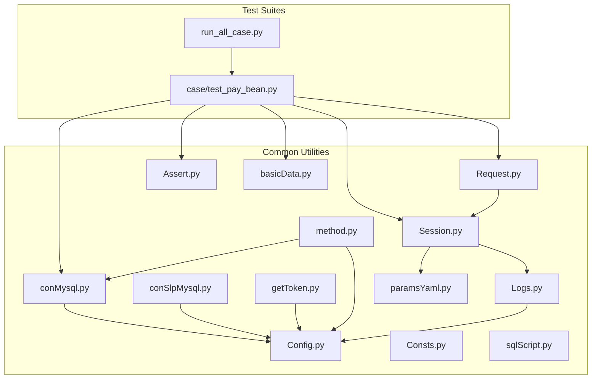
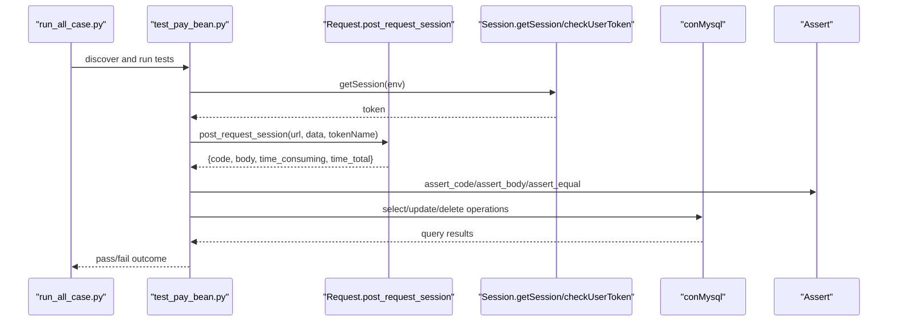
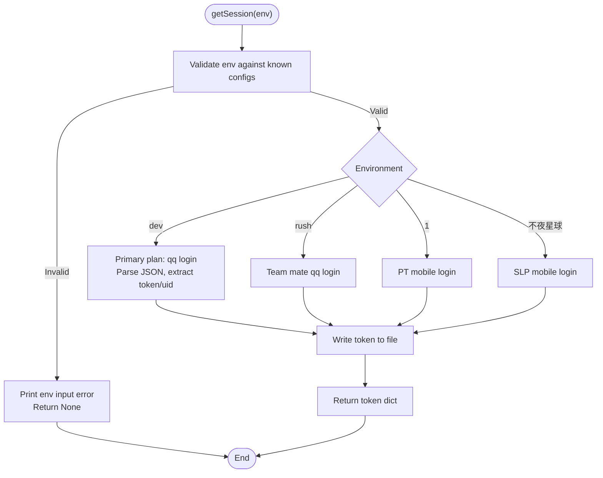
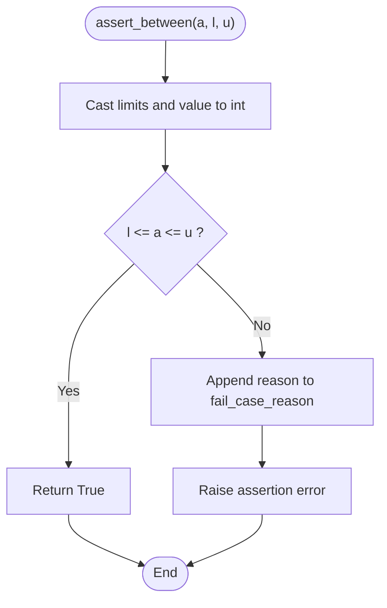
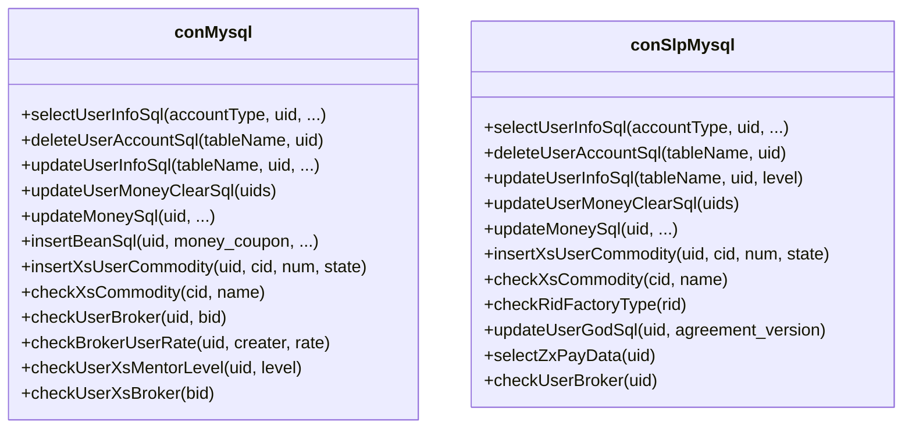
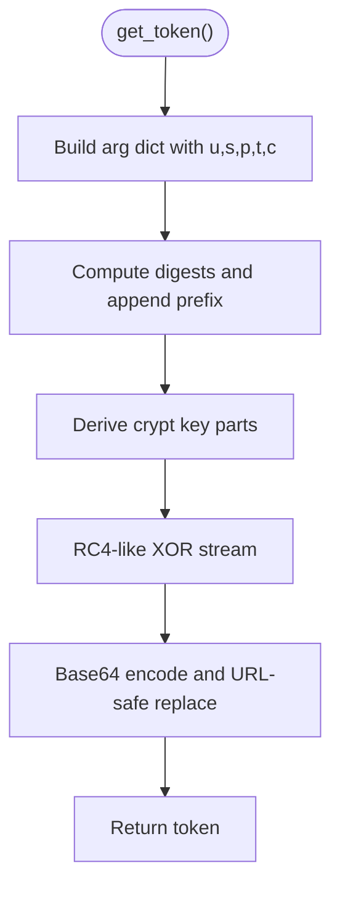
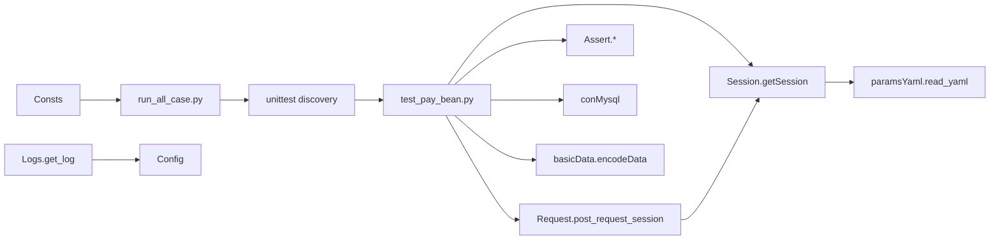

# API Reference

<cite>
**Referenced Files in This Document**
- [README.md](file://README.md)
- [run_all_case.py](file://run_all_case.py)
- [common/Request.py](file://common/Request.py)
- [common/Session.py](file://common/Session.py)
- [common/Assert.py](file://common/Assert.py)
- [common/Config.py](file://common/Config.py)
- [common/Consts.py](file://common/Consts.py)
- [common/conMysql.py](file://common/conMysql.py)
- [common/conSlpMysql.py](file://common/conSlpMysql.py)
- [common/getToken.py](file://common/getToken.py)
- [common/method.py](file://common/method.py)
- [common/Logs.py](file://common/Logs.py)
- [common/basicData.py](file://common/basicData.py)
- [common/paramsYaml.py](file://common/paramsYaml.py)
- [common/sqlScript.py](file://common/sqlScript.py)
- [case/test_pay_bean.py](file://case/test_pay_bean.py)
</cite>

## Table of Contents
1. [Introduction](#introduction)
2. [Project Structure](#project-structure)
3. [Core Components](#core-components)
4. [Architecture Overview](#architecture-overview)
5. [Detailed Component Analysis](#detailed-component-analysis)
6. [Dependency Analysis](#dependency-analysis)
7. [Performance Considerations](#performance-considerations)
8. [Troubleshooting Guide](#troubleshooting-guide)
9. [Conclusion](#conclusion)
10. [Appendices](#appendices)

## Introduction
This document provides a comprehensive API reference for the QA Payment Testing Framework. It covers public interfaces and components used for HTTP communication, session/token management, assertion engine, database connectors, configuration management, logging, and utility functions. It also documents parameter specifications, return values, exceptions, and usage patterns with practical examples drawn from the repository.

## Project Structure
The framework is organized around a common library of utilities and a set of test suites per product area. Key modules include HTTP request helpers, session/token retrieval, assertions, configuration constants, database connectors, token generation, logging, and shared utilities.

**Diagram sources**
- [run_all_case.py:12-159](file://run_all_case.py#L12-L159)
- [case/test_pay_bean.py:1-188](file://case/test_pay_bean.py#L1-L188)
- [common/Request.py:17-59](file://common/Request.py#L17-L59)
- [common/Session.py:19-200](file://common/Session.py#L19-L200)
- [common/Assert.py:11-96](file://common/Assert.py#L11-L96)
- [common/conMysql.py:8-530](file://common/conMysql.py#L8-L530)
- [common/conSlpMysql.py:8-680](file://common/conSlpMysql.py#L8-L680)
- [common/getToken.py:8-93](file://common/getToken.py#L8-L93)
- [common/method.py:11-171](file://common/method.py#L11-L171)
- [common/Logs.py:8-48](file://common/Logs.py#L8-L48)
- [common/basicData.py](file://common/basicData.py)
- [common/paramsYaml.py](file://common/paramsYaml.py)
- [common/sqlScript.py](file://common/sqlScript.py)

**Section sources**
- [README.md:1-38](file://README.md#L1-L38)
- [run_all_case.py:12-159](file://run_all_case.py#L12-L159)

## Core Components
- HTTP Request Helper: post_request_session(url, data, tokenName)
- Session Management: getSession(env), checkUserToken(operate, app_name, token), checkUserToken_slp(operate, uid, app_name, token)
- Assertion Engine: assert_code(actual_code, expected_code), assert_equal(actual, expected), assert_body(body, key, expected, reason), assert_len(actual, expected), assert_between(actual, lower, upper)
- Database Connectors: conMysql and conSlpMysql with methods for selecting, updating, inserting, and cleaning user data
- Token Generation: getToken(uid, salt).get_token(), static helpers for salt and hashing
- Configuration: config class constants for URLs, user IDs, gift IDs, app names, and server info
- Logging: get_log(name, level, when, back_count)
- Utilities: method helpers for Slack/markdown formatting, image fetching, JSON traversal, result reporting, and VIP experience calculations
- Encoding Factory: basicData.encodeData(...) used to construct payment request payloads

**Section sources**
- [common/Request.py:17-59](file://common/Request.py#L17-L59)
- [common/Session.py:19-200](file://common/Session.py#L19-L200)
- [common/Assert.py:11-96](file://common/Assert.py#L11-L96)
- [common/conMysql.py:8-530](file://common/conMysql.py#L8-L530)
- [common/conSlpMysql.py:8-680](file://common/conSlpMysql.py#L8-L680)
- [common/getToken.py:8-93](file://common/getToken.py#L8-L93)
- [common/Config.py:6-133](file://common/Config.py#L6-L133)
- [common/Logs.py:8-48](file://common/Logs.py#L8-L48)
- [common/method.py:11-171](file://common/method.py#L11-L171)
- [common/basicData.py](file://common/basicData.py)

## Architecture Overview
The framework orchestrates tests by:
- Running test suites via run_all_case.py
- Constructing HTTP requests using post_request_session
- Managing tokens via getSession and checkUserToken
- Executing assertions and collecting failure reasons
- Interacting with databases using conMysql/conSlpMysql
- Reporting results and logging outcomes

**Diagram sources**
- [run_all_case.py:126-147](file://run_all_case.py#L126-L147)
- [case/test_pay_bean.py:23-36](file://case/test_pay_bean.py#L23-L36)
- [common/Request.py:17-59](file://common/Request.py#L17-L59)
- [common/Session.py:19-200](file://common/Session.py#L19-L200)
- [common/conMysql.py:28-204](file://common/conMysql.py#L28-L204)
- [common/Assert.py:11-96](file://common/Assert.py#L11-L96)

## Detailed Component Analysis

### HTTP Request Helper: post_request_session
- Purpose: Perform HTTPS POST requests with a standardized header and token injection.
- Parameters:
  - url: Target endpoint (assured to be HTTPS)
  - data: Form-encoded payload (optional)
  - tokenName: App identifier for token lookup (default: dev)
- Returns:
  - Dictionary containing:
    - code: HTTP status code
    - body: Parsed JSON response or empty string on parse failure
    - time_consuming: Milliseconds portion of elapsed time
    - time_total: Total seconds elapsed
- Exceptions and error handling:
  - Requests exceptions and generic exceptions are caught and logged; returns an empty tuple-like structure on failure.
- Usage example:
  - Construct encoded data via basicData.encodeData and call post_request_session with config.pay_url and the payload.
- Integration patterns:
  - Used in test cases to trigger payment actions and validate responses.

**Section sources**
- [common/Request.py:17-59](file://common/Request.py#L17-L59)
- [case/test_pay_bean.py:25](file://case/test_pay_bean.py#L25)

### Session Management APIs
- getSession(env):
  - Retrieves login session for a given environment.
  - Reads YAML headers and parameters from Basic.yml.
  - Attempts primary login flow; falls back to backup plan using database-derived token.
  - Returns token dictionary with token and uid for supported environments.
- checkUserToken(operate, app_name, token):
  - Writes or reads user token to/from a per-app token file.
  - Raises exception if reading an empty token file.
- checkUserToken_slp(operate, uid, app_name, token):
  - Similar to above but scoped per uid for SLP app variants.

**Diagram sources**
- [common/Session.py:19-166](file://common/Session.py#L19-L166)

**Section sources**
- [common/Session.py:19-200](file://common/Session.py#L19-L200)
- [common/paramsYaml.py](file://common/paramsYaml.py)

### Assertion Engine Interfaces
- assert_code(actual_code, expected_code=200)
  - Validates HTTP status code equality; appends reason on mismatch and raises assertion error.
- assert_equal(actual_result, expect_result)
  - Validates equality; records reason and raises on mismatch.
- assert_body(body, body_msg, expected_msg, reason)
  - Extracts nested field via safe get and asserts equality; records reason and raises on mismatch.
- assert_len(actual_len, expect_len)
  - Validates minimum length; raises on mismatch.
- assert_between(actual_result, lower_limit, upper_limit)
  - Validates numeric range inclusively; raises on mismatch.

**Diagram sources**
- [common/Assert.py:88-96](file://common/Assert.py#L88-L96)

**Section sources**
- [common/Assert.py:11-96](file://common/Assert.py#L11-L96)
- [common/Consts.py:7-17](file://common/Consts.py#L7-L17)

### Database Connector Methods
- conMysql (general):
  - selectUserInfoSql(accountType, uid, ...): Queries balances, counts, levels, and related data.
  - deleteUserAccountSql(tableName, uid): Cleans backpack, titles, profiles, rooms, boxes, and related records.
  - updateUserInfoSql(tableName, uid, ...): Updates broker user, index salt, chatroom ownership, and super chatroom attributes.
  - Utility updates: checkXsGiftConfig, updateUserMoneyClearSql, updateMoneySql, insertBeanSql, insertXsUserCommodity, checkXsCommodity, checkUserBroker, checkBrokerUserRate, checkUserXsMentorLevel, checkUserXsBroker.
- conSlpMysql (SLP-specific):
  - selectUserInfoSql(accountType, uid, ...): Similar queries tailored to SLP schema.
  - deleteUserAccountSql(tableName, uid): Clears backpack, titles, pay_room_money, broker_user, chatroom, boxes, titles, popularity, and pay_change.
  - updateUserInfoSql(tableName, uid, level): Sets user title level and growth metrics.
  - Additional helpers: checkRidFactoryType, updateUserGodSql, selectZxPayData, checkUserBroker.

**Diagram sources**
- [common/conMysql.py:28-530](file://common/conMysql.py#L28-L530)
- [common/conSlpMysql.py:30-680](file://common/conSlpMysql.py#L30-L680)

**Section sources**
- [common/conMysql.py:8-530](file://common/conMysql.py#L8-L530)
- [common/conSlpMysql.py:8-680](file://common/conSlpMysql.py#L8-L680)

### Token Generation API
- getToken(uid, _salt):
  - get_token(): Generates a signed token with expiry using MD5, RC4-like XOR, and base64 encoding.
  - Static helpers:
    - get_salt(): Random salt generator.
    - md5(s): Hex digest of string.
    - php_microtime(): Mimics PHP microtime for key derivation.

**Diagram sources**
- [common/getToken.py:19-63](file://common/getToken.py#L19-L63)

**Section sources**
- [common/getToken.py:8-93](file://common/getToken.py#L8-L93)

### Configuration Management APIs
- config class constants:
  - appInfo, codeInfo, appName, linux_node: Hosts, paths, branch names, and identifiers.
  - pt_host, pay_url, slp_pay_url, bb_qqLogin_url, pt_mobile_login_url, starify_mobile_login_url, slp_mobile_login_url: Endpoint URLs.
  - rate: GS commercial room rate.
  - User and role IDs: payUid, testUid, masterUid, gsUid, plus PT and SLP user mappings.
  - Gift ID mappings for BB and PT.

**Section sources**
- [common/Config.py:6-133](file://common/Config.py#L6-L133)

### Logging API
- get_log(log_name, level=logging.DEBUG, when='midnight', back_count=0):
  - Creates a logger with rotating file handler and console handler.
  - Ensures log directory exists under project root.

**Section sources**
- [common/Logs.py:8-48](file://common/Logs.py#L8-L48)

### Utility Functions
- Slack/markdown formatting:
  - dictToListSlack(result_dict), dictToList(result_dict)
- Image fetching:
  - getImage(mode=2): Random girl or dog image URL.
- JSON traversal:
  - isExtend(data, tag), getKeys(data), getValue(res), reason(des, res), reason_slp(des, res)
- Path checks:
  - checkPath(path): Robot alert and EnvironmentError if path missing.
- VIP experience calculation:
  - getUserTitle(level), checkUserVipExp(money_type, uid, pay_off)

**Section sources**
- [common/method.py:11-171](file://common/method.py#L11-L171)

### Data Encoding Factory Interface
- basicData.encodeData(...):
  - Constructs payment request payloads for different scenarios (e.g., package types, gift IDs, gift types, quantities, recipient UIDs).
  - Used extensively in test cases to parameterize payment actions.

**Section sources**
- [common/basicData.py](file://common/basicData.py)
- [case/test_pay_bean.py:50-75](file://case/test_pay_bean.py#L50-L75)

## Dependency Analysis
- Test runner orchestration:
  - run_all_case.py discovers and executes test suites, aggregates results, and posts notifications.
- Test-to-utility dependencies:
  - Tests depend on Request, Session, Assert, conMysql, basicData, and method utilities.
- Configuration and YAML:
  - Session reads YAML configurations; Config centralizes endpoints and IDs.
- Logging and global state:
  - Logs module creates persistent logs; Consts holds runtime counters and failure reasons.

**Diagram sources**
- [run_all_case.py:126-147](file://run_all_case.py#L126-L147)
- [case/test_pay_bean.py:23-36](file://case/test_pay_bean.py#L23-L36)
- [common/Request.py:17-59](file://common/Request.py#L17-L59)
- [common/Session.py:19-166](file://common/Session.py#L19-L166)
- [common/Assert.py:11-96](file://common/Assert.py#L11-L96)
- [common/conMysql.py:28-204](file://common/conMysql.py#L28-L204)
- [common/Logs.py:8-48](file://common/Logs.py#L8-L48)
- [common/paramsYaml.py](file://common/paramsYaml.py)
- [common/Consts.py:7-17](file://common/Consts.py#L7-L17)

**Section sources**
- [run_all_case.py:12-159](file://run_all_case.py#L12-L159)
- [case/test_pay_bean.py:1-188](file://case/test_pay_bean.py#L1-L188)

## Performance Considerations
- Network latency:
  - post_request_session measures millisecond and total elapsed time; consider timeouts and retries for flaky endpoints.
- Database operations:
  - Batch updates and deletes commit immediately; ensure minimal transaction scope to avoid long locks.
- Token generation:
  - RC4-like stream and MD5 computations are lightweight; cache tokens when possible to reduce repeated generation.
- Logging:
  - Rotating handlers prevent disk bloat; adjust backup count and rotation interval for CI environments.

## Troubleshooting Guide
- HTTP request failures:
  - post_request_session catches request and general exceptions; inspect returned body and status code; verify SSL verification settings and URL scheme.
- Token file issues:
  - checkUserToken raises when token file is empty; ensure getSession completes successfully and writes token.
- Database query errors:
  - Many conMysql/conSlpMysql methods catch exceptions and rollback; check printed error messages and confirm table/column names align with schema.
- Assertion mismatches:
  - Assertion functions append reasons to fail_case_reason; review appended messages for precise failure diagnostics.
- Logging:
  - get_log ensures log directory creation; verify permissions and disk space.

**Section sources**
- [common/Request.py:35-59](file://common/Request.py#L35-L59)
- [common/Session.py:168-200](file://common/Session.py#L168-L200)
- [common/conMysql.py:28-204](file://common/conMysql.py#L28-L204)
- [common/Assert.py:17-25](file://common/Assert.py#L17-L25)
- [common/Logs.py:18-21](file://common/Logs.py#L18-L21)

## Conclusion
The QA Payment Testing Framework provides a cohesive set of APIs for orchestrating payment-related test automation. Its HTTP helper, session/token management, assertion engine, database connectors, configuration, logging, and utilities collectively enable robust, repeatable testing across multiple product variants. Adhering to the documented interfaces and usage patterns ensures reliable integration and maintainability.

## Appendices

### API Index and Examples

- HTTP Request
  - post_request_session(url, data, tokenName='dev')
  - Example usage: [case/test_pay_bean.py:25](file://case/test_pay_bean.py#L25)

- Session Management
  - getSession(env)
  - checkUserToken(operate, app_name='dev', token='')
  - checkUserToken_slp(operate, uid, app_name='dev', token='')
  - Example usage: [common/Session.py:19-200](file://common/Session.py#L19-L200)

- Assertions
  - assert_code(actual_code, expected_code=200)
  - assert_equal(actual_result, expect_result)
  - assert_body(body, body_msg, expected_msg, reason)
  - assert_len(actual_len, expect_len)
  - assert_between(actual_result, lower_limit, upper_limit)
  - Example usage: [common/Assert.py:11-96](file://common/Assert.py#L11-L96)

- Database Connectors
  - conMysql.selectUserInfoSql(...)
  - conMysql.updateMoneySql(...)
  - conMysql.insertBeanSql(...)
  - conSlpMysql.selectUserInfoSql(...)
  - conSlpMysql.updateUserInfoSql(...)
  - Example usage: [common/conMysql.py:28-530](file://common/conMysql.py#L28-L530), [common/conSlpMysql.py:30-680](file://common/conSlpMysql.py#L30-L680)

- Token Generation
  - getToken(uid, salt).get_token()
  - Example usage: [common/getToken.py:19-63](file://common/getToken.py#L19-L63)

- Configuration
  - config.pay_url, config.slp_pay_url, config.bb_qqLogin_url, config.pt_mobile_login_url, config.starify_mobile_login_url, config.slp_mobile_login_url
  - Example usage: [common/Config.py:49-56](file://common/Config.py#L49-L56)

- Logging
  - get_log(log_name, level, when='midnight', back_count=0)
  - Example usage: [common/Logs.py:8-48](file://common/Logs.py#L8-L48)

- Utilities
  - dictToListSlack(result_dict), dictToList(result_dict)
  - getImage(mode=2)
  - isExtend(data, tag), getKeys(data), getValue(res), reason(des, res), reason_slp(des, res)
  - checkPath(path)
  - getUserTitle(level), checkUserVipExp(money_type, uid, pay_off)
  - Example usage: [common/method.py:11-171](file://common/method.py#L11-L171)

- Data Encoding Factory
  - basicData.encodeData(...)
  - Example usage: [common/basicData.py](file://common/basicData.py), [case/test_pay_bean.py:50-75](file://case/test_pay_bean.py#L50-L75)