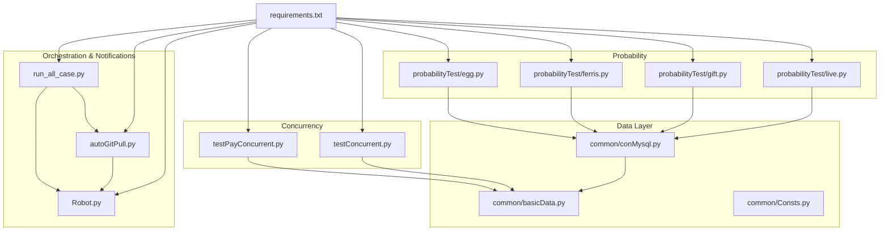
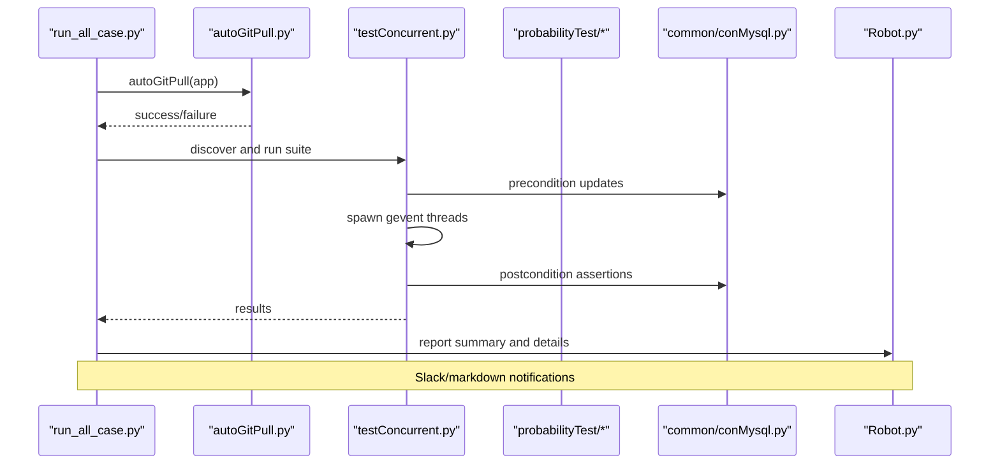
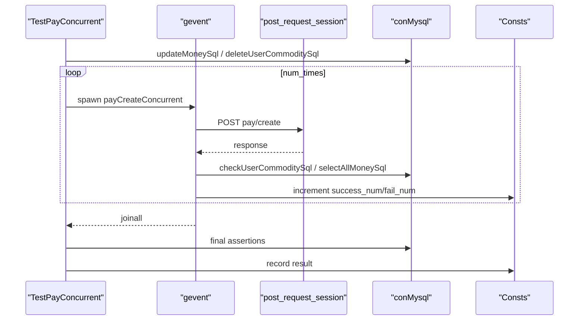
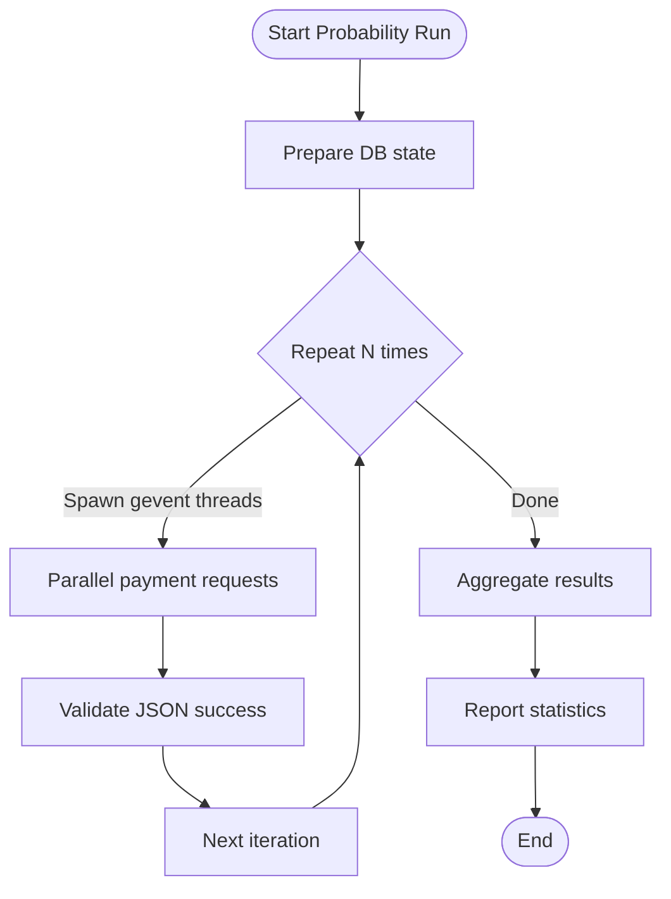
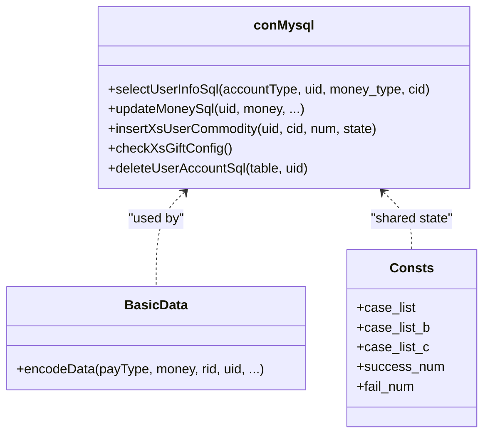
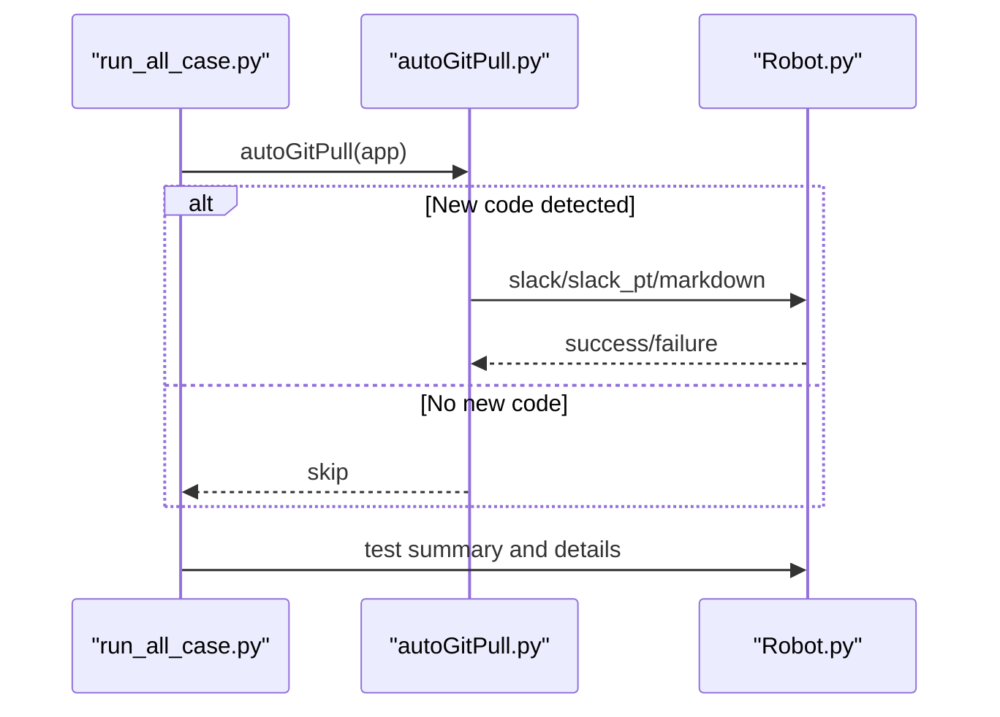
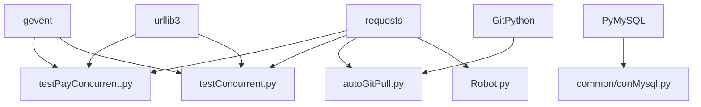

# Advanced Testing Features

<cite>
**Referenced Files in This Document**
- [testConcurrent.py](file://testConcurrent.py)
- [testPayConcurrent.py](file://testPayConcurrent.py)
- [probabilityTest/egg.py](file://probabilityTest/egg.py)
- [probabilityTest/ferris.py](file://probabilityTest/ferris.py)
- [probabilityTest/gift.py](file://probabilityTest/gift.py)
- [probabilityTest/live.py](file://probabilityTest/live.py)
- [common/conMysql.py](file://common/conMysql.py)
- [common/basicData.py](file://common/basicData.py)
- [common/Consts.py](file://common/Consts.py)
- [run_all_case.py](file://run_all_case.py)
- [autoGitPull.py](file://autoGitPull.py)
- [Robot.py](file://Robot.py)
- [requirements.txt](file://requirements.txt)
- [README.md](file://README.md)
</cite>

## Table of Contents
1. [Introduction](#introduction)
2. [Project Structure](#project-structure)
3. [Core Components](#core-components)
4. [Architecture Overview](#architecture-overview)
5. [Detailed Component Analysis](#detailed-component-analysis)
6. [Dependency Analysis](#dependency-analysis)
7. [Performance Considerations](#performance-considerations)
8. [Troubleshooting Guide](#troubleshooting-guide)
9. [Conclusion](#conclusion)
10. [Appendices](#appendices)

## Introduction
This document describes advanced testing features implemented in the repository, focusing on:
- Concurrent payment testing using gevent
- Probability and statistical analysis for random events
- Database transaction validation via MySQL helpers
- Real-time notification systems integrated with Slack and Git repository synchronization
- Performance optimization, scalability, and advanced debugging approaches
- Examples of advanced test execution, result interpretation, and CI/CD pipeline integration

## Project Structure
The repository organizes tests and utilities by feature area:
- Payment concurrency and orchestration: [testConcurrent.py](file://testConcurrent.py), [testPayConcurrent.py](file://testPayConcurrent.py)
- Probability/statistical analysis: [probabilityTest/egg.py](file://probabilityTest/egg.py), [probabilityTest/ferris.py](file://probabilityTest/ferris.py), [probabilityTest/gift.py](file://probabilityTest/gift.py), [probabilityTest/live.py](file://probabilityTest/live.py)
- Database connectivity and validations: [common/conMysql.py](file://common/conMysql.py)
- Request encoding and constants: [common/basicData.py](file://common/basicData.py), [common/Consts.py](file://common/Consts.py)
- Orchestration and notifications: [run_all_case.py](file://run_all_case.py), [autoGitPull.py](file://autoGitPull.py), [Robot.py](file://Robot.py)
- Dependencies and conventions: [requirements.txt](file://requirements.txt), [README.md](file://README.md)

**Diagram sources**
- [testPayConcurrent.py:1-47](file://testPayConcurrent.py#L1-L47)
- [testConcurrent.py:1-281](file://testConcurrent.py#L1-L281)
- [probabilityTest/egg.py:1-259](file://probabilityTest/egg.py#L1-L259)
- [probabilityTest/ferris.py:1-28](file://probabilityTest/ferris.py#L1-L28)
- [probabilityTest/gift.py:1-112](file://probabilityTest/gift.py#L1-L112)
- [probabilityTest/live.py:1-40](file://probabilityTest/live.py#L1-L40)
- [common/conMysql.py:1-530](file://common/conMysql.py#L1-L530)
- [common/basicData.py:1-581](file://common/basicData.py#L1-L581)
- [common/Consts.py:1-17](file://common/Consts.py#L1-L17)
- [run_all_case.py:1-159](file://run_all_case.py#L1-L159)
- [autoGitPull.py:1-237](file://autoGitPull.py#L1-L237)
- [Robot.py:1-138](file://Robot.py#L1-L138)
- [requirements.txt:1-85](file://requirements.txt#L1-L85)

**Section sources**
- [README.md:1-38](file://README.md#L1-L38)
- [requirements.txt:1-85](file://requirements.txt#L1-L85)

## Core Components
- Concurrent payment testing:
  - gevent-based concurrency for parallel payment operations
  - Database preconditions and postconditions validated per scenario
  - Global counters track successes/failures for assertion
- Probability and statistical analysis:
  - Randomized payment flows simulate real-world distributions
  - Repeated runs aggregate outcomes for statistical inference
- Database transaction validation:
  - Centralized MySQL helpers for updates, inserts, deletions, and queries
  - Assertions compare expected vs actual balances and inventory counts
- Real-time notifications:
  - Git code synchronization with branch checks and commit timestamps
  - Slack/markdown notifications for test results and code updates
- Orchestration:
  - Unified runner discovers and executes test suites per app
  - Logging and result aggregation for CI/CD integration

**Section sources**
- [testConcurrent.py:17-281](file://testConcurrent.py#L17-L281)
- [testPayConcurrent.py:9-47](file://testPayConcurrent.py#L9-L47)
- [probabilityTest/egg.py:19-259](file://probabilityTest/egg.py#L19-L259)
- [probabilityTest/ferris.py:11-28](file://probabilityTest/ferris.py#L11-L28)
- [probabilityTest/gift.py:9-112](file://probabilityTest/gift.py#L9-L112)
- [probabilityTest/live.py:9-40](file://probabilityTest/live.py#L9-L40)
- [common/conMysql.py:8-530](file://common/conMysql.py#L8-L530)
- [common/basicData.py:8-581](file://common/basicData.py#L8-L581)
- [common/Consts.py:4-17](file://common/Consts.py#L4-L17)
- [run_all_case.py:12-159](file://run_all_case.py#L12-L159)
- [autoGitPull.py:56-237](file://autoGitPull.py#L56-L237)
- [Robot.py:6-138](file://Robot.py#L6-L138)

## Architecture Overview
The system integrates asynchronous payment tests, probabilistic sampling, database validations, and automated notifications.

**Diagram sources**
- [run_all_case.py:12-159](file://run_all_case.py#L12-L159)
- [autoGitPull.py:114-192](file://autoGitPull.py#L114-L192)
- [testConcurrent.py:51-91](file://testConcurrent.py#L51-L91)
- [common/conMysql.py:350-361](file://common/conMysql.py#L350-L361)
- [Robot.py:6-34](file://Robot.py#L6-L34)

## Detailed Component Analysis

### Concurrent Payment Testing
- Design:
  - Uses gevent monkey patching and spawn/joinall for concurrency
  - Pre/post conditions manage database state and global counters
  - Encodes requests via shared helpers
- Scenarios:
  - Purchase and gift from backpack
  - Use items from backpack
  - Gift items from backpack
  - Room panel gifts
  - Shop purchases
- Validation:
  - Money and commodity counts checked after concurrency
  - Global success/failure counters asserted

**Diagram sources**
- [testConcurrent.py:51-91](file://testConcurrent.py#L51-L91)
- [common/conMysql.py:350-361](file://common/conMysql.py#L350-L361)
- [common/Consts.py:14-17](file://common/Consts.py#L14-L17)

**Section sources**
- [testConcurrent.py:17-281](file://testConcurrent.py#L17-L281)
- [common/basicData.py:8-101](file://common/basicData.py#L8-L101)
- [common/Consts.py:4-17](file://common/Consts.py#L4-L17)

### Probability and Statistical Analysis
- Egg drop/lucky egg tests:
  - Randomized gift levels and amounts
  - Repeated payments under controlled conditions
  - Outcome verification via JSON responses
- KTV/live room tests:
  - Bulk gift operations across multiple recipients
  - Controlled delays between requests
- Gift catalog tests:
  - Iterates over gift catalog entries
  - Validates payment outcomes and balances

**Diagram sources**
- [probabilityTest/egg.py:239-259](file://probabilityTest/egg.py#L239-L259)
- [probabilityTest/gift.py:101-112](file://probabilityTest/gift.py#L101-L112)
- [probabilityTest/live.py:29-40](file://probabilityTest/live.py#L29-L40)

**Section sources**
- [probabilityTest/egg.py:19-259](file://probabilityTest/egg.py#L19-L259)
- [probabilityTest/ferris.py:11-28](file://probabilityTest/ferris.py#L11-L28)
- [probabilityTest/gift.py:9-112](file://probabilityTest/gift.py#L9-L112)
- [probabilityTest/live.py:9-40](file://probabilityTest/live.py#L9-L40)

### Database Transaction Validation
- Capabilities:
  - Update user money and commodities
  - Insert/delete user data for controlled scenarios
  - Query totals, counts, and specific fields
  - Validate pre/post conditions for concurrency and probability tests
- Patterns:
  - Atomic operations with commit/rollback handling
  - Centralized SQL helpers reduce duplication

**Diagram sources**
- [common/conMysql.py:8-530](file://common/conMysql.py#L8-L530)
- [common/basicData.py:8-581](file://common/basicData.py#L8-L581)
- [common/Consts.py:4-17](file://common/Consts.py#L4-L17)

**Section sources**
- [common/conMysql.py:28-204](file://common/conMysql.py#L28-L204)
- [common/conMysql.py:350-415](file://common/conMysql.py#L350-L415)
- [common/basicData.py:8-101](file://common/basicData.py#L8-L101)
- [common/Consts.py:4-17](file://common/Consts.py#L4-L17)

### Real-Time Notification Systems
- Git synchronization:
  - Pulls code, validates branch, compares commit timestamps
  - Sends notifications via Slack/markdown depending on app type
- Test result notifications:
  - Aggregates total, failures, errors, runtime
  - Posts detailed summaries and failure reasons to Slack

**Diagram sources**
- [run_all_case.py:12-124](file://run_all_case.py#L12-L124)
- [autoGitPull.py:114-192](file://autoGitPull.py#L114-L192)
- [Robot.py:6-34](file://Robot.py#L6-L34)

**Section sources**
- [run_all_case.py:12-124](file://run_all_case.py#L12-L124)
- [autoGitPull.py:56-113](file://autoGitPull.py#L56-L113)
- [Robot.py:6-138](file://Robot.py#L6-L138)

### Advanced Debugging Approaches
- Logging:
  - Centralized logs for case results, failures, and Git operations
- Global counters:
  - Track successes/failures during concurrency to pinpoint anomalies
- Failure inspection:
  - Failure lists and reasons captured for targeted debugging
- Session management:
  - Token/session updates before test runs to ensure valid requests

**Section sources**
- [run_all_case.py:18-44](file://run_all_case.py#L18-L44)
- [common/Consts.py:14-17](file://common/Consts.py#L14-L17)
- [autoGitPull.py:146-152](file://autoGitPull.py#L146-L152)

## Dependency Analysis
External libraries and their roles:
- gevent: concurrency primitives for async payment tests
- requests: HTTP client for payment and notification endpoints
- GitPython: repository operations for code synchronization
- PyMySQL: MySQL connectivity for validations
- urllib3: SSL warnings suppression for local endpoints

**Diagram sources**
- [requirements.txt:23-66](file://requirements.txt#L23-L66)
- [testPayConcurrent.py:1-6](file://testPayConcurrent.py#L1-L6)
- [testConcurrent.py:1-14](file://testConcurrent.py#L1-L14)
- [autoGitPull.py:5-14](file://autoGitPull.py#L5-L14)
- [Robot.py:1-3](file://Robot.py#L1-L3)
- [common/conMysql.py:1-6](file://common/conMysql.py#L1-L6)

**Section sources**
- [requirements.txt:1-85](file://requirements.txt#L1-L85)

## Performance Considerations
- Concurrency model:
  - gevent’s cooperative threading reduces overhead compared to OS threads
  - Use spawn/joinall to minimize contention and coordinate teardown
- Network I/O:
  - Batch requests with minimal inter-request delays to avoid throttling
  - Disable SSL warnings only for trusted internal endpoints
- Database operations:
  - Use atomic updates and commits; avoid long transactions
  - Prefer bulk operations where feasible to reduce round trips
- Notifications:
  - Defer non-critical notifications to reduce test runtime impact
- Scalability:
  - Parameterize number of concurrent threads per scenario
  - Monitor resource usage and adjust concurrency limits accordingly

[No sources needed since this section provides general guidance]

## Troubleshooting Guide
- Branch mismatch:
  - Auto-git pull fails if active branch does not match expected branch
- Commit timestamp not advancing:
  - Verify time file exists and is writable; reset if corrupted
- Slack notifications failing:
  - Confirm webhook URLs are configured and reachable
- Database assertion failures:
  - Ensure preconditions are applied before concurrency
  - Validate that global counters reflect expected outcomes
- Requests exceptions:
  - Inspect response codes and JSON bodies; enable logging around request calls

**Section sources**
- [autoGitPull.py:164-177](file://autoGitPull.py#L164-L177)
- [autoGitPull.py:194-229](file://autoGitPull.py#L194-L229)
- [Robot.py:36-43](file://Robot.py#L36-L43)
- [testConcurrent.py:75-89](file://testConcurrent.py#L75-L89)
- [common/conMysql.py:350-361](file://common/conMysql.py#L350-L361)

## Conclusion
The repository implements a robust, scalable testing framework combining:
- gevent-based concurrency for realistic payment load testing
- Probabilistic sampling for random event validation
- Centralized database helpers for precise transaction validation
- Automated Git synchronization and Slack notifications for continuous feedback
These features collectively support advanced debugging, CI/CD integration, and reliable operational insights.

[No sources needed since this section summarizes without analyzing specific files]

## Appendices

### Advanced Test Execution Examples
- Concurrency:
  - Run parallel payment scenarios with configurable thread counts
  - Example invocation: [testConcurrent.py:266-281](file://testConcurrent.py#L266-L281)
- Probability:
  - Execute repeated payment loops to collect statistical samples
  - Example invocation: [probabilityTest/egg.py:256-259](file://probabilityTest/egg.py#L256-L259)
- Orchestration:
  - Discover and run suites per application environment
  - Example orchestration: [run_all_case.py:126-147](file://run_all_case.py#L126-L147)

**Section sources**
- [testConcurrent.py:266-281](file://testConcurrent.py#L266-L281)
- [probabilityTest/egg.py:256-259](file://probabilityTest/egg.py#L256-L259)
- [run_all_case.py:126-147](file://run_all_case.py#L126-L147)

### CI/CD Integration Notes
- Git synchronization:
  - Use autoGitPull to detect and notify on new commits
  - Reference: [run_all_case.py:14-16](file://run_all_case.py#L14-L16), [autoGitPull.py:114-192](file://autoGitPull.py#L114-L192)
- Reporting:
  - Aggregate results and post to Slack/markdown
  - Reference: [run_all_case.py:18-44](file://run_all_case.py#L18-L44), [Robot.py:108-125](file://Robot.py#L108-L125)

**Section sources**
- [run_all_case.py:12-44](file://run_all_case.py#L12-L44)
- [autoGitPull.py:114-192](file://autoGitPull.py#L114-L192)
- [Robot.py:108-125](file://Robot.py#L108-L125)