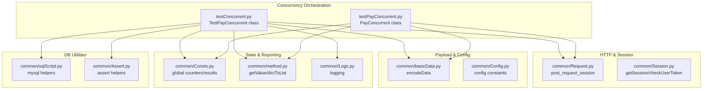
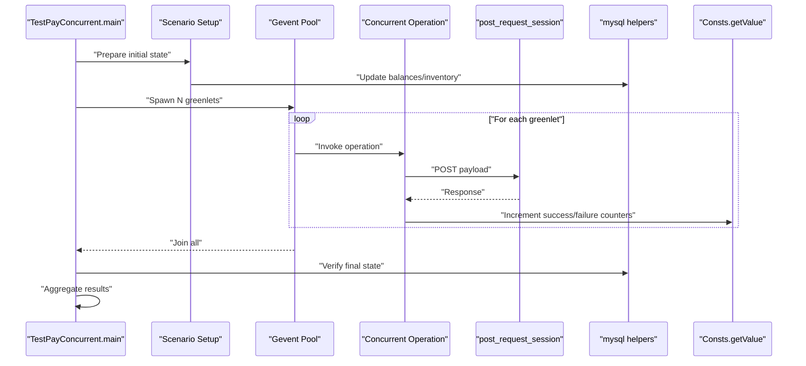
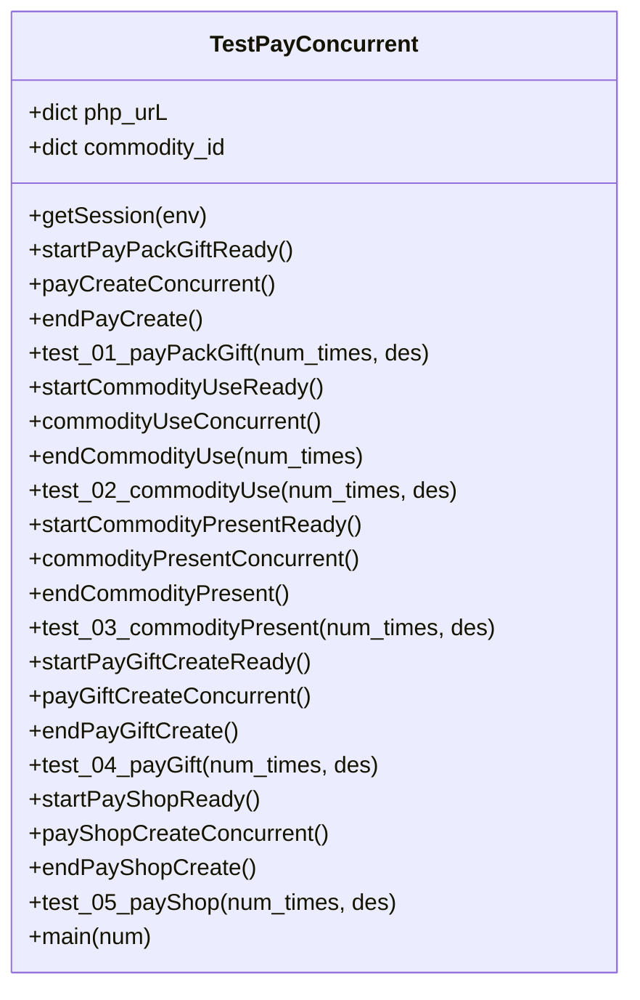
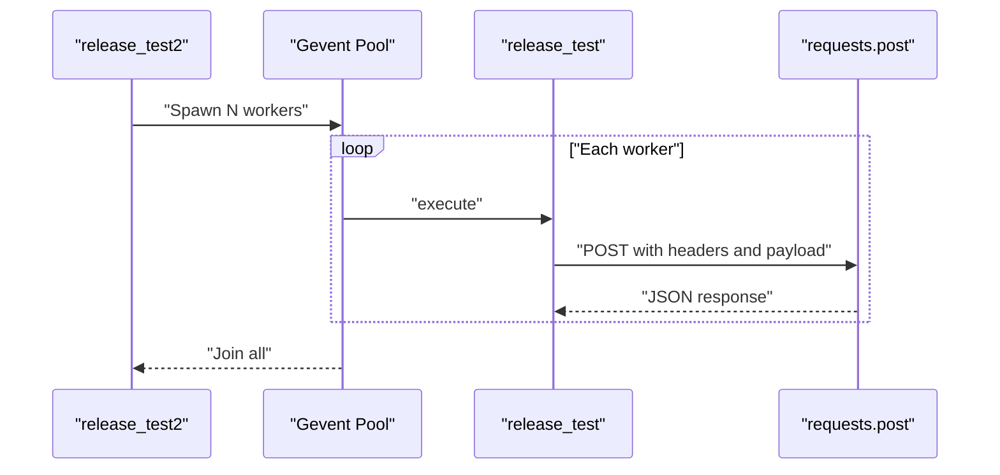
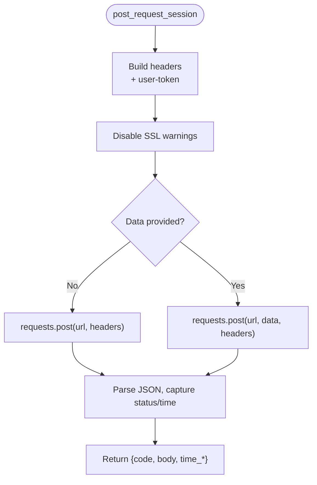
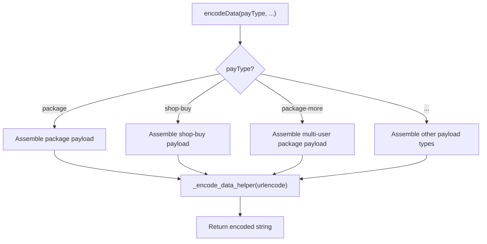
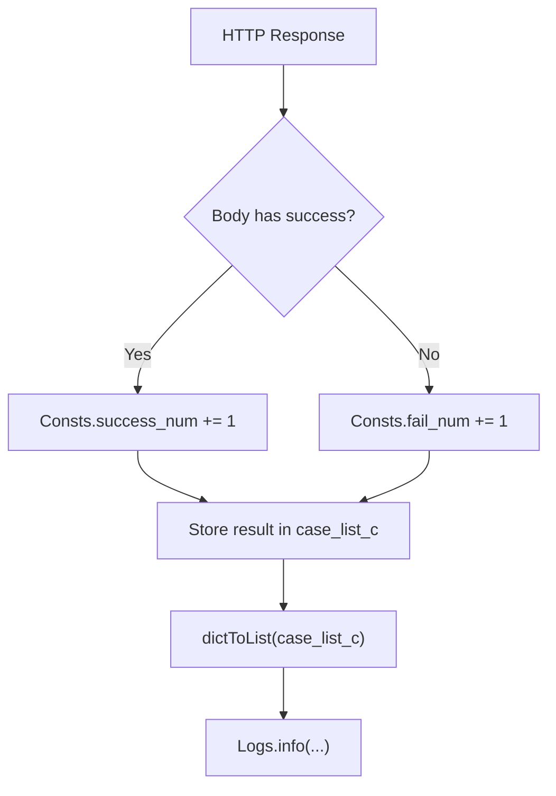
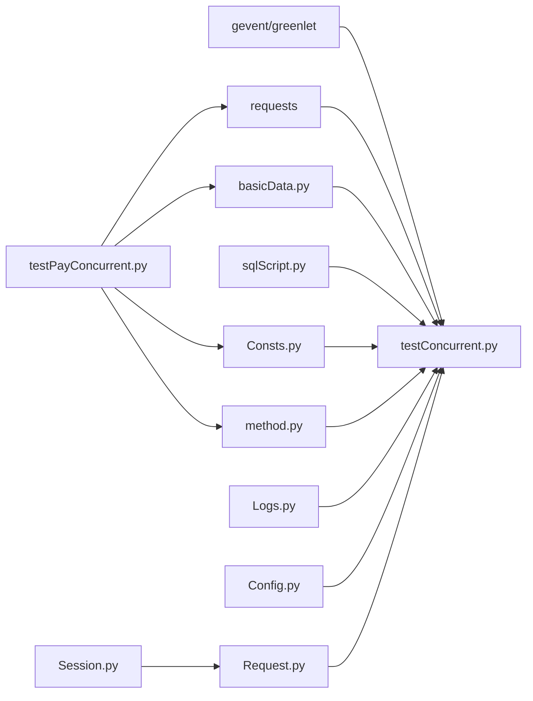
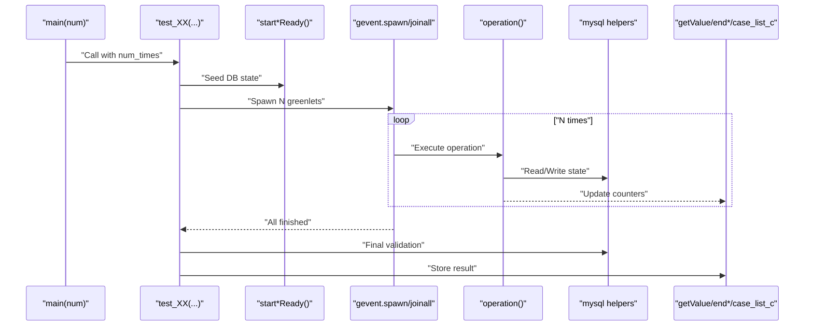

# Concurrent Payment Testing

<cite>
**Referenced Files in This Document**
- [testConcurrent.py](file://testConcurrent.py)
- [testPayConcurrent.py](file://testPayConcurrent.py)
- [run_all_case.py](file://run_all_case.py)
- [Config.py](file://common/Config.py)
- [Consts.py](file://common/Consts.py)
- [basicData.py](file://common/basicData.py)
- [Request.py](file://common/Request.py)
- [Session.py](file://common/Session.py)
- [method.py](file://common/method.py)
- [Logs.py](file://common/Logs.py)
- [sqlScript.py](file://common/sqlScript.py)
- [Assert.py](file://common/Assert.py)
- [requirements.txt](file://requirements.txt)
- [test_pay_shopBuy.py](file://case/test_pay_shopBuy.py)
</cite>

## Table of Contents
1. [Introduction](#introduction)
2. [Project Structure](#project-structure)
3. [Core Components](#core-components)
4. [Architecture Overview](#architecture-overview)
5. [Detailed Component Analysis](#detailed-component-analysis)
6. [Dependency Analysis](#dependency-analysis)
7. [Performance Considerations](#performance-considerations)
8. [Troubleshooting Guide](#troubleshooting-guide)
9. [Conclusion](#conclusion)
10. [Appendices](#appendices)

## Introduction
This document explains the concurrent payment testing capabilities implemented in the repository. It focuses on the gevent-based concurrency architecture, thread management, and parallel test execution patterns used to simulate simultaneous payment transactions. It documents the framework setup, payload generation for concurrent transactions, result aggregation mechanisms, and practical guidance for configuring scenarios, managing shared resources, handling race conditions, benchmarking, load testing, and scalability testing. It also provides troubleshooting advice and optimal configuration recommendations for different environments.

## Project Structure
The concurrent payment testing spans several modules:
- Concurrency orchestration and scenario execution
- HTTP request abstraction and session management
- Payload construction and database state preparation
- Global state for aggregating results and timing
- Logging and reporting utilities

**Diagram sources**
- [testConcurrent.py:17-281](file://testConcurrent.py#L17-L281)
- [testPayConcurrent.py:9-47](file://testPayConcurrent.py#L9-L47)
- [Request.py:17-59](file://common/Request.py#L17-L59)
- [Session.py:19-182](file://common/Session.py#L19-L182)
- [basicData.py:9-325](file://common/basicData.py#L9-L325)
- [Config.py:6-133](file://common/Config.py#L6-L133)
- [Consts.py:4-17](file://common/Consts.py#L4-L17)
- [method.py:26-123](file://common/method.py#L26-L123)
- [Logs.py:8-48](file://common/Logs.py#L8-L48)
- [sqlScript.py:5-145](file://common/sqlScript.py#L5-L145)
- [Assert.py:11-96](file://common/Assert.py#L11-L96)

**Section sources**
- [testConcurrent.py:17-281](file://testConcurrent.py#L17-L281)
- [testPayConcurrent.py:9-47](file://testPayConcurrent.py#L9-L47)
- [run_all_case.py:12-159](file://run_all_case.py#L12-L159)
- [requirements.txt:23-27](file://requirements.txt#L23-L27)

## Core Components
- Concurrency orchestration:
  - Gevent monkey patching enables cooperative concurrency.
  - Scenario runners spawn greenlets and join them to synchronize completion.
- HTTP and session:
  - Centralized POST request function with user token injection and connection close hints.
  - Session manager obtains tokens via environment-specific login flows.
- Payload generation:
  - Unified encoder builds structured payloads for various payment scenarios.
- State and aggregation:
  - Global counters track successes/failures per scenario.
  - Aggregation utilities convert dictionaries to reportable strings.
- Database utilities:
  - Helpers prepare and verify account and inventory states for concurrent tests.
- Assertions and logging:
  - Assertion helpers enforce expected outcomes.
  - Logging configured with rotating file handlers.

**Section sources**
- [testConcurrent.py:17-281](file://testConcurrent.py#L17-L281)
- [testPayConcurrent.py:9-47](file://testPayConcurrent.py#L9-L47)
- [Request.py:17-59](file://common/Request.py#L17-L59)
- [Session.py:19-182](file://common/Session.py#L19-L182)
- [basicData.py:9-325](file://common/basicData.py#L9-L325)
- [Consts.py:4-17](file://common/Consts.py#L4-L17)
- [method.py:26-123](file://common/method.py#L26-L123)
- [sqlScript.py:5-145](file://common/sqlScript.py#L5-L145)
- [Assert.py:11-96](file://common/Assert.py#L11-L96)
- [Logs.py:8-48](file://common/Logs.py#L8-L48)

## Architecture Overview
The concurrency architecture leverages gevent to run multiple payment operations concurrently. Each scenario prepares initial state, spawns greenlets to execute identical operations, waits for completion, and validates final state. Results are aggregated and logged.

**Diagram sources**
- [testConcurrent.py:266-281](file://testConcurrent.py#L266-L281)
- [testConcurrent.py:81-91](file://testConcurrent.py#L81-L91)
- [testConcurrent.py:118-128](file://testConcurrent.py#L118-L128)
- [testConcurrent.py:158-168](file://testConcurrent.py#L158-L168)
- [testConcurrent.py:206-216](file://testConcurrent.py#L206-L216)
- [testConcurrent.py:254-264](file://testConcurrent.py#L254-L264)
- [Request.py:17-59](file://common/Request.py#L17-L59)
- [Consts.py:15-16](file://common/Consts.py#L15-L16)
- [method.py:94-113](file://common/method.py#L94-L113)

## Detailed Component Analysis

### Concurrency Orchestration: TestPayConcurrent
- Purpose: Define and execute concurrent payment scenarios.
- Key patterns:
  - Preparation steps initialize database state for each scenario.
  - Greenlet spawning and joining ensures parallelism and synchronization.
  - Result aggregation stores pass/fail indicators per scenario.
- Scenarios covered:
  - Purchase and send gifts from backpack
  - Use items from backpack
  - Send items as gifts
  - Room gift donations
  - Shop purchases

**Diagram sources**
- [testConcurrent.py:17-281](file://testConcurrent.py#L17-L281)

**Section sources**
- [testConcurrent.py:17-281](file://testConcurrent.py#L17-L281)

### Concurrency Orchestration: PayConcurrent
- Purpose: Minimal example of releasing many concurrent payments against a single endpoint.
- Key patterns:
  - Gevent pool spawns N workers.
  - Each worker posts a payload constructed via the encoder.
  - Joinall synchronizes completion.

**Diagram sources**
- [testPayConcurrent.py:30-36](file://testPayConcurrent.py#L30-L36)
- [testPayConcurrent.py:18-28](file://testPayConcurrent.py#L18-L28)

**Section sources**
- [testPayConcurrent.py:9-47](file://testPayConcurrent.py#L9-L47)

### HTTP and Session Management
- post_request_session:
  - Adds user token from session storage.
  - Sends POST with optional form-encoded data.
  - Returns standardized response dictionary with status, body, and timing.
- Session:
  - Provides environment-specific login flows and writes tokens to local files for reuse.

**Diagram sources**
- [Request.py:17-59](file://common/Request.py#L17-L59)
- [Session.py:19-182](file://common/Session.py#L19-L182)

**Section sources**
- [Request.py:17-59](file://common/Request.py#L17-L59)
- [Session.py:19-182](file://common/Session.py#L19-L182)

### Payload Generation
- encodeData:
  - Builds form-encoded payloads for multiple payment types (room gift, shop buy, package present/use, etc.).
  - Supports dynamic parameters for room ID, user IDs, gift IDs, quantities, and exchange flags.
- Configuration:
  - Defaults and constants are centralized in Config for consistent behavior across scenarios.

**Diagram sources**
- [basicData.py:9-325](file://common/basicData.py#L9-L325)
- [Config.py:6-133](file://common/Config.py#L6-L133)

**Section sources**
- [basicData.py:9-325](file://common/basicData.py#L9-L325)
- [Config.py:6-133](file://common/Config.py#L6-L133)

### State and Result Aggregation
- Global counters:
  - success_num and fail_num are incremented per response evaluation.
- Aggregation:
  - getValue updates counters based on response body.
  - dictToList converts scenario results to a reportable string.
- Logging:
  - Rotating file handler writes results and runtime metrics.

**Diagram sources**
- [method.py:26-38](file://common/method.py#L26-L38)
- [method.py:94-113](file://common/method.py#L94-L113)
- [Consts.py:4-17](file://common/Consts.py#L4-L17)
- [Logs.py:8-48](file://common/Logs.py#L8-L48)

**Section sources**
- [method.py:26-38](file://common/method.py#L26-L38)
- [method.py:94-113](file://common/method.py#L94-L113)
- [Consts.py:4-17](file://common/Consts.py#L4-L17)
- [Logs.py:8-48](file://common/Logs.py#L8-L48)

### Database Utilities and Assertions
- mysql helpers:
  - Prepare and verify account balances and inventory counts for concurrent tests.
- Assertions:
  - assert_code, assert_equal, assert_body enforce expected outcomes and record reasons for failures.

**Section sources**
- [sqlScript.py:5-145](file://common/sqlScript.py#L5-L145)
- [Assert.py:11-96](file://common/Assert.py#L11-L96)

### Practical Examples and Patterns
- Configuring concurrent scenarios:
  - Adjust num_times to control concurrency level.
  - Use scenario-specific preparation steps to seed database state.
- Managing shared resources:
  - Use separate UIDs and room IDs per scenario to avoid cross-interference.
  - Ensure database updates are idempotent or reset between runs.
- Handling race conditions:
  - Validate final state after joinall to detect inconsistencies.
  - Use assertions that compare computed expected values against database queries.

**Section sources**
- [testConcurrent.py:81-91](file://testConcurrent.py#L81-L91)
- [testConcurrent.py:118-128](file://testConcurrent.py#L118-L128)
- [testConcurrent.py:158-168](file://testConcurrent.py#L158-L168)
- [testConcurrent.py:206-216](file://testConcurrent.py#L206-L216)
- [testConcurrent.py:254-264](file://testConcurrent.py#L254-L264)

## Dependency Analysis
- External dependencies:
  - gevent and greenlet enable cooperative concurrency.
  - requests handles HTTP transport.
- Internal dependencies:
  - Concurrency orchestrators depend on HTTP, payload generation, database utilities, and state aggregation.
  - Runners depend on configuration and logging.

**Diagram sources**
- [requirements.txt:23-27](file://requirements.txt#L23-L27)
- [testConcurrent.py:17-281](file://testConcurrent.py#L17-L281)
- [testPayConcurrent.py:9-47](file://testPayConcurrent.py#L9-L47)
- [Request.py:17-59](file://common/Request.py#L17-L59)
- [Session.py:19-182](file://common/Session.py#L19-L182)
- [basicData.py:9-325](file://common/basicData.py#L9-L325)
- [Consts.py:4-17](file://common/Consts.py#L4-L17)
- [method.py:26-38](file://common/method.py#L26-L38)
- [Logs.py:8-48](file://common/Logs.py#L8-L48)
- [Config.py:6-133](file://common/Config.py#L6-L133)
- [sqlScript.py:5-145](file://common/sqlScript.py#L5-L145)

**Section sources**
- [requirements.txt:23-27](file://requirements.txt#L23-L27)
- [testConcurrent.py:17-281](file://testConcurrent.py#L17-L281)
- [testPayConcurrent.py:9-47](file://testPayConcurrent.py#L9-L47)

## Performance Considerations
- Concurrency model:
  - Gevent’s cooperative concurrency reduces overhead compared to OS threads for I/O-bound workloads.
- Connection management:
  - Closing connections explicitly helps reduce connection churn under high concurrency.
- Payload size and encoding:
  - Keep payloads minimal and reuse encoded strings to reduce CPU overhead.
- Database contention:
  - Use distinct UIDs and rooms per scenario to minimize lock contention.
- Monitoring:
  - Capture response times and aggregate failure rates to identify bottlenecks.

[No sources needed since this section provides general guidance]

## Troubleshooting Guide
- Common concurrency issues:
  - Race conditions: Validate final state after joinall; assert expected totals against database queries.
  - Resource contention: Ensure database state is reset between runs; avoid sharing mutable state across workers.
- Memory management:
  - Limit concurrency levels (num_times) to match environment capacity.
  - Avoid accumulating large response bodies; process and discard as needed.
- Network and timeouts:
  - Disable SSL verification only in controlled environments; ensure proper proxy and DNS resolution.
- Logging and diagnostics:
  - Use rotating logs to track failures and timings; correlate with database snapshots.

**Section sources**
- [Assert.py:11-96](file://common/Assert.py#L11-L96)
- [Logs.py:8-48](file://common/Logs.py#L8-L48)
- [Request.py:25-59](file://common/Request.py#L25-L59)

## Conclusion
The repository implements a robust gevent-based concurrency framework for payment testing. By preparing database states, generating payloads, spawning greenlets, and aggregating results, it supports scalable load and stress testing. Proper configuration of concurrency levels, resource isolation, and result validation ensures reliable detection of race conditions and performance regressions.

[No sources needed since this section summarizes without analyzing specific files]

## Appendices

### Appendix A: Example Scenario Execution Flow

**Diagram sources**
- [testConcurrent.py:266-281](file://testConcurrent.py#L266-L281)
- [testConcurrent.py:81-91](file://testConcurrent.py#L81-L91)
- [testConcurrent.py:118-128](file://testConcurrent.py#L118-L128)
- [testConcurrent.py:158-168](file://testConcurrent.py#L158-L168)
- [testConcurrent.py:206-216](file://testConcurrent.py#L206-L216)
- [testConcurrent.py:254-264](file://testConcurrent.py#L254-L264)
- [method.py:94-113](file://common/method.py#L94-L113)

### Appendix B: Configuration Settings
- Environment selection and URLs are centralized in configuration.
- Token management is handled by the session module and persisted locally.

**Section sources**
- [Config.py:6-133](file://common/Config.py#L6-L133)
- [Session.py:168-182](file://common/Session.py#L168-L182)

### Appendix C: Related Test Case Reference
- Example non-concurrent payment tests demonstrate expected behaviors and assertions used in concurrent scenarios.

**Section sources**
- [test_pay_shopBuy.py:13-124](file://case/test_pay_shopBuy.py#L13-L124)