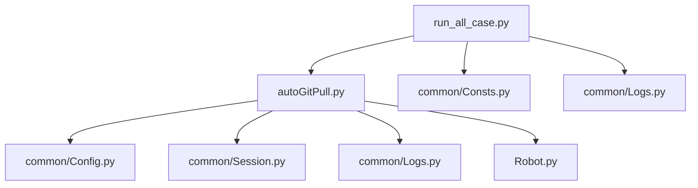
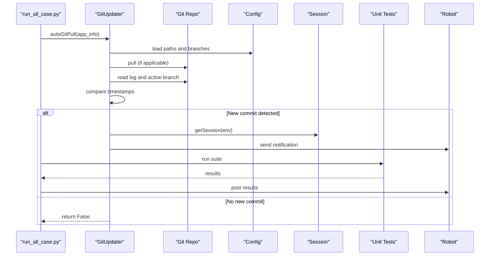
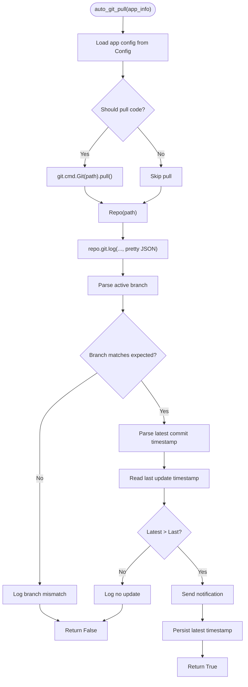
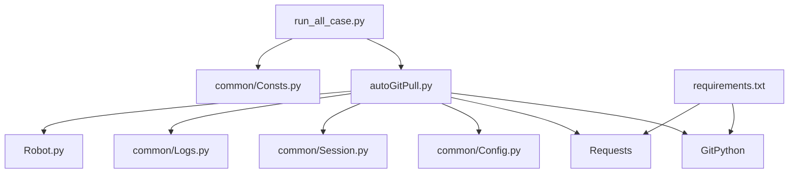

# Git Repository Synchronization

<cite>
**Referenced Files in This Document**
- [autoGitPull.py](file://autoGitPull.py)
- [run_all_case.py](file://run_all_case.py)
- [run_crontab_case.py](file://run_crontab_case.py)
- [Config.py](file://common/Config.py)
- [Session.py](file://common/Session.py)
- [Logs.py](file://common/Logs.py)
- [Consts.py](file://common/Consts.py)
- [Robot.py](file://Robot.py)
- [requirements.txt](file://requirements.txt)
- [README.md](file://README.md)
- [question.txt](file://others/question.txt)
</cite>

## Table of Contents
1. [Introduction](#introduction)
2. [Project Structure](#project-structure)
3. [Core Components](#core-components)
4. [Architecture Overview](#architecture-overview)
5. [Detailed Component Analysis](#detailed-component-analysis)
6. [Dependency Analysis](#dependency-analysis)
7. [Performance Considerations](#performance-considerations)
8. [Troubleshooting Guide](#troubleshooting-guide)
9. [Security Considerations](#security-considerations)
10. [Configuration Examples](#configuration-examples)
11. [Conclusion](#conclusion)

## Introduction
This document explains the Git repository synchronization capabilities implemented in the project. It covers the automatic pull mechanism, branch management, update detection algorithms, integration with remote repositories, authentication handling, conflict resolution strategies, automated testing workflow triggered by repository updates, version control integration patterns, and deployment synchronization. It also provides configuration examples, troubleshooting guidance for common Git operations and merge conflicts, and security considerations for repository access tokens and automated credential management.

## Project Structure
The synchronization pipeline integrates several modules:
- Git update orchestration and notification
- Automated test execution after code updates
- Centralized configuration for repository paths and branches
- Logging and session/token management
- Slack/WeChat notification dispatch

**Diagram sources**
- [run_all_case.py:12-124](file://run_all_case.py#L12-L124)
- [autoGitPull.py:56-192](file://autoGitPull.py#L56-L192)
- [Config.py:17-31](file://common/Config.py#L17-L31)
- [Session.py:19-68](file://common/Session.py#L19-L68)
- [Logs.py:8-47](file://common/Logs.py#L8-L47)
- [Robot.py:6-34](file://Robot.py#L6-L34)
- [Consts.py:1-17](file://common/Consts.py#L1-L17)

**Section sources**
- [run_all_case.py:12-124](file://run_all_case.py#L12-L124)
- [autoGitPull.py:56-192](file://autoGitPull.py#L56-L192)
- [Config.py:17-31](file://common/Config.py#L17-L31)

## Core Components
- GitUpdater: Orchestrates Git pull, branch verification, commit time comparison, and notifications.
- update_time: Manages a timestamp file to detect whether new commits occurred since the last run.
- run_all_case: Executes automated tests after successful Git updates and posts results to chat.
- Config: Centralizes repository paths and branch names per application.
- Session: Acquires and persists session tokens for API access.
- Logs: Provides structured logging for pull/update/branch error events.
- Robot: Dispatches notifications to Slack or WeChat.

Key responsibilities:
- Automatic pull: Uses GitPython to pull code when applicable.
- Branch enforcement: Ensures the active branch matches the configured expectation.
- Update detection: Compares the latest commit timestamp against a persisted timestamp.
- Notifications: Sends commit summaries to Slack/WeChat channels.
- Test trigger: Runs unit tests upon detecting new code and reports outcomes.

**Section sources**
- [autoGitPull.py:56-192](file://autoGitPull.py#L56-L192)
- [run_all_case.py:12-124](file://run_all_case.py#L12-L124)
- [Config.py:17-31](file://common/Config.py#L17-L31)
- [Session.py:19-68](file://common/Session.py#L19-L68)
- [Logs.py:8-47](file://common/Logs.py#L8-L47)
- [Robot.py:6-34](file://Robot.py#L6-L34)

## Architecture Overview
The system follows a deterministic flow:
- Determine which applications to synchronize based on environment and node identity.
- For each application, pull code (where applicable), verify branch, and compare timestamps.
- If new commits are detected, persist the latest timestamp and run tests.
- Post results to Slack/WeChat.

**Diagram sources**
- [run_all_case.py:12-124](file://run_all_case.py#L12-L124)
- [autoGitPull.py:114-192](file://autoGitPull.py#L114-L192)
- [Config.py:17-31](file://common/Config.py#L17-L31)
- [Session.py:19-68](file://common/Session.py#L19-L68)
- [Robot.py:6-34](file://Robot.py#L6-L34)

## Detailed Component Analysis

### GitUpdater: Automatic Pull and Update Detection
Responsibilities:
- Resolve application-specific configuration (paths, branches, environment, bot).
- Conditionally pull code using GitPython.
- Verify active branch matches expected branch.
- Parse commit metadata and compare timestamps.
- Trigger notifications and return success/failure.

Update detection algorithm:
- Extract latest commit metadata via Git log with a custom pretty format.
- Parse the commit date to a Unix timestamp.
- Compare against a persisted timestamp file.
- Persist the latest timestamp when new commits are found.

**Diagram sources**
- [autoGitPull.py:114-192](file://autoGitPull.py#L114-L192)
- [autoGitPull.py:194-229](file://autoGitPull.py#L194-L229)

**Section sources**
- [autoGitPull.py:56-192](file://autoGitPull.py#L56-L192)
- [autoGitPull.py:194-229](file://autoGitPull.py#L194-L229)

### Application Configuration and Branch Management
- Paths and branches are centralized in Config for each supported application.
- Applications include backend PHP/Go projects and SLP-related repositories.
- Branch enforcement ensures the active branch equals the configured branch before proceeding.

Configuration highlights:
- Paths for bb_php, bb_go, pt_php, slp_php, slp_common_rpc.
- Branches for each application family.
- Environment and bot identifiers per app.

**Section sources**
- [Config.py:17-31](file://common/Config.py#L17-L31)

### Session and Authentication Handling
- Session.getSession retrieves tokens for different environments.
- Supports fallback mechanisms and writes tokens to local files for reuse.
- Integrates with external APIs to obtain session credentials.

Operational notes:
- Token persistence avoids repeated authentication.
- Errors are logged and handled gracefully.

**Section sources**
- [Session.py:19-68](file://common/Session.py#L19-L68)
- [Session.py:168-200](file://common/Session.py#L168-L200)

### Notification Pipeline
- Robot supports multiple modes (Slack, WeChat, Markdown, icons).
- GitUpdater routes notifications differently for specific applications.
- Results of automated runs are posted after successful updates.

**Section sources**
- [Robot.py:6-34](file://Robot.py#L6-L34)
- [autoGitPull.py:93-113](file://autoGitPull.py#L93-L113)
- [run_all_case.py:24-44](file://run_all_case.py#L24-L44)

### Automated Testing Workflow
- After detecting new code, run_all_case executes the appropriate test suite.
- Reports include counts of total, failures, and errors, plus runtime and branch information.
- Notifications are sent to Slack/WeChat depending on the application.

**Section sources**
- [run_all_case.py:12-124](file://run_all_case.py#L12-L124)
- [run_crontab_case.py:27-71](file://run_crontab_case.py#L27-L71)

## Dependency Analysis
External libraries and integrations:
- GitPython for repository operations.
- Requests for HTTP interactions (session acquisition and notifications).
- YAML loader for configuration files.
- Logging handlers for persistent logs.

**Diagram sources**
- [autoGitPull.py:5-14](file://autoGitPull.py#L5-L14)
- [requirements.txt:25-69](file://requirements.txt#L25-L69)
- [run_all_case.py:1-10](file://run_all_case.py#L1-L10)

**Section sources**
- [requirements.txt:25-69](file://requirements.txt#L25-L69)
- [README.md:35-35](file://README.md#L35-L35)

## Performance Considerations
- Minimize Git operations: Only pull when necessary (e.g., skip for SLP repositories).
- Efficient timestamp checks: Persist and read a single timestamp file to avoid expensive history scans.
- Logging overhead: Use rotating file handlers to manage disk usage.
- Network latency: Batch notifications and avoid redundant API calls.

## Troubleshooting Guide
Common issues and resolutions:
- Branch mismatch: Ensure the active branch matches the configured branch in Config. Adjust branch expectations or switch branches manually.
- Git pull failures: Verify repository paths and network connectivity. Confirm credentials and SSH/Git configurations.
- Merge conflicts: Resolve conflicts locally, push the resolved branch, and re-run the synchronization.
- Network connectivity: Use proxy settings or host overrides for GitHub domains as shown in the repository notes.
- Notification failures: Check webhook URLs and permissions for Slack/WeChat bots.
- Token retrieval errors: Validate environment configuration and fallback logic in Session.

**Section sources**
- [autoGitPull.py:164-167](file://autoGitPull.py#L164-L167)
- [question.txt:39-43](file://others/question.txt#L39-L43)
- [Session.py:60-68](file://common/Session.py#L60-L68)

## Security Considerations
- Access tokens: The repository demonstrates cloning with personal access tokens. Store tokens securely and rotate them regularly.
- Credential management: Prefer short-lived tokens and avoid embedding secrets in code. Use environment variables or secure secret stores.
- Network isolation: Configure hosts and proxies carefully to limit exposure.
- Audit logs: Review logs for sensitive data and restrict access to log directories.

**Section sources**
- [question.txt:39-43](file://others/question.txt#L39-L43)
- [Logs.py:8-47](file://common/Logs.py#L8-L47)

## Configuration Examples
Repository setup:
- Configure repository paths and branches per application in Config.
- Define environment-specific branches and bot identifiers.

Branch protection rules:
- Enforce required reviews and status checks on target branches.
- Restrict force pushes and require linear history where applicable.

Automated deployment hooks:
- Use post-receive hooks to trigger synchronization and test runs.
- Integrate with CI/CD systems to automate deployments after successful tests.

Cron scheduling:
- Schedule periodic runs using cron to continuously monitor and synchronize repositories.

**Section sources**
- [Config.py:17-31](file://common/Config.py#L17-L31)
- [run_all_case.py:150-159](file://run_all_case.py#L150-L159)
- [run_crontab_case.py:74-79](file://run_crontab_case.py#L74-L79)
- [question.txt:45-51](file://others/question.txt#L45-L51)

## Conclusion
The Git repository synchronization system provides a robust, automated pipeline for pulling code, enforcing branch compliance, detecting updates, notifying stakeholders, and triggering automated tests. By centralizing configuration, leveraging GitPython and Requests, and maintaining clear logging and notification flows, the system supports reliable continuous integration and deployment workflows across multiple applications and environments.