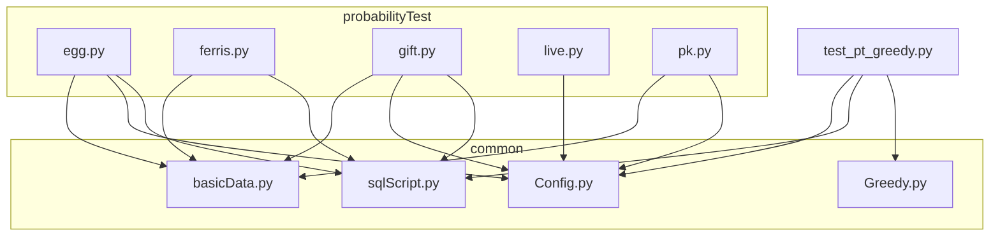
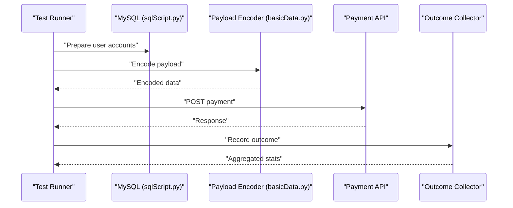
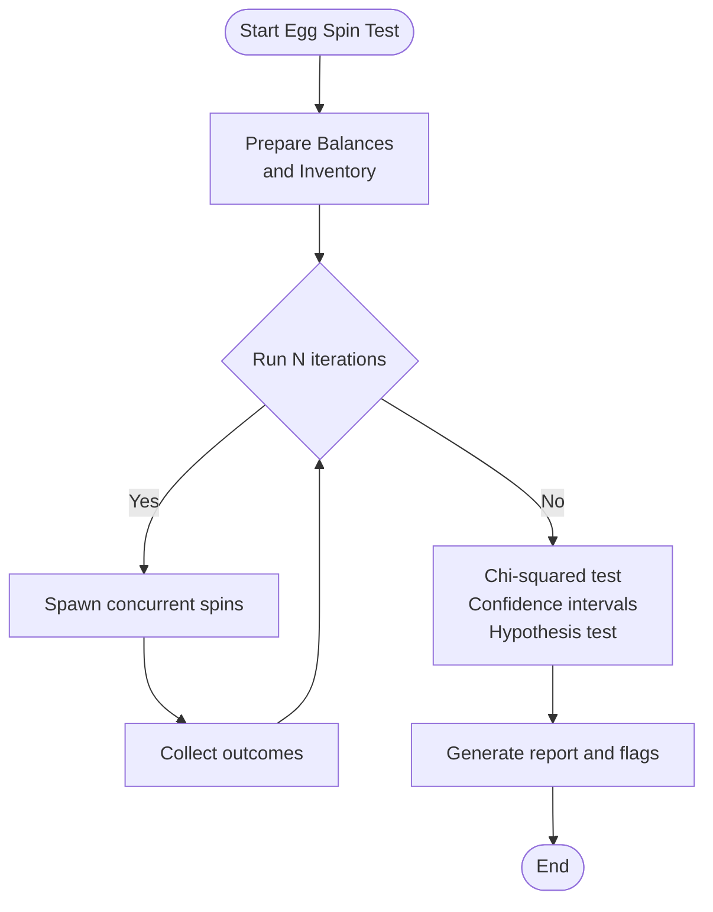
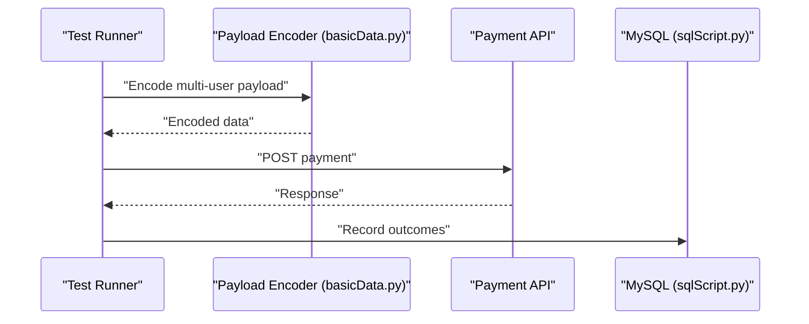
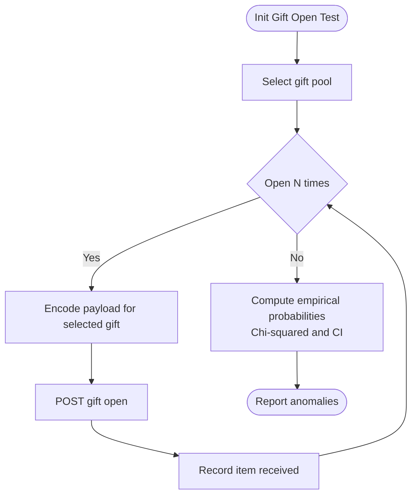
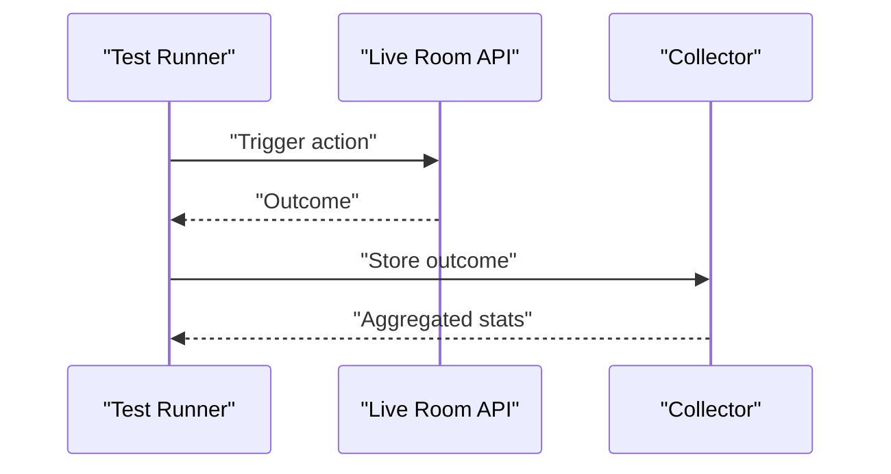
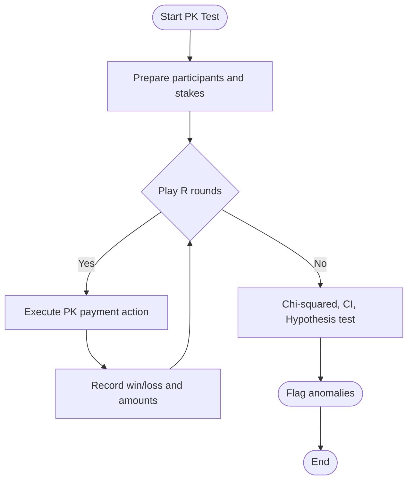
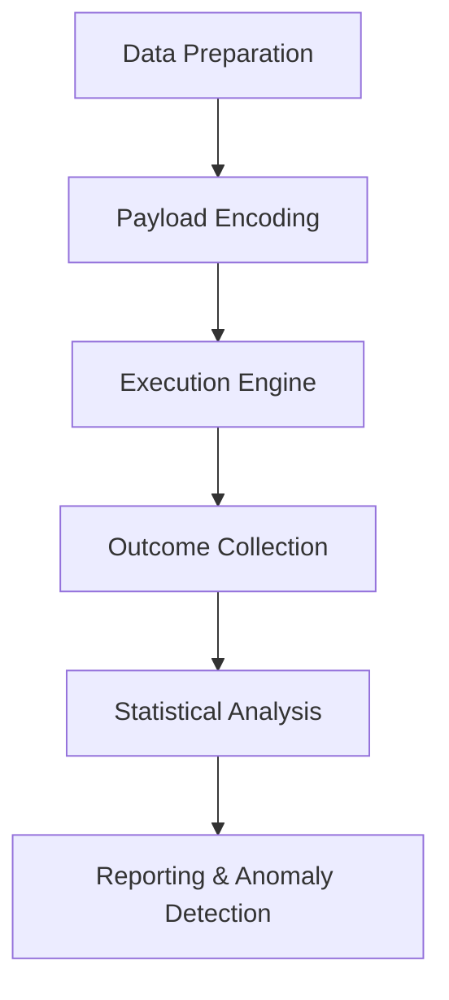
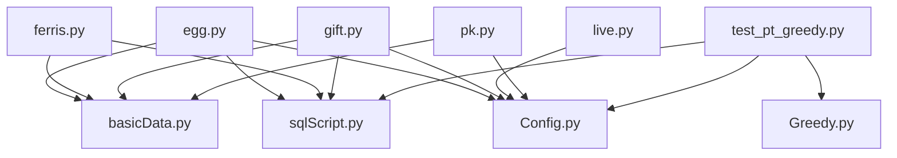

# Probability and Statistical Analysis

<cite>
**Referenced Files in This Document**
- [egg.py](file://probabilityTest/egg.py)
- [ferris.py](file://probabilityTest/ferris.py)
- [gift.py](file://probabilityTest/gift.py)
- [live.py](file://probabilityTest/live.py)
- [pk.py](file://probabilityTest/pk.py)
- [sqlScript.py](file://common/sqlScript.py)
- [basicData.py](file://common/basicData.py)
- [Config.py](file://common/Config.py)
- [test_pt_greedy.py](file://caseLuckyPlay/test_pt_greedy.py)
- [Greedy.py](file://common/Greedy.py)
- [README.md](file://README.md)
</cite>

## Table of Contents
1. [Introduction](#introduction)
2. [Project Structure](#project-structure)
3. [Core Components](#core-components)
4. [Architecture Overview](#architecture-overview)
5. [Detailed Component Analysis](#detailed-component-analysis)
6. [Dependency Analysis](#dependency-analysis)
7. [Performance Considerations](#performance-considerations)
8. [Troubleshooting Guide](#troubleshooting-guide)
9. [Conclusion](#conclusion)
10. [Appendices](#appendices)

## Introduction
This document explains the probability and statistical analysis testing modules used to validate random event distributions, probability calculations, and expected value verification for game mechanics. It covers the implementation of chi-squared tests, confidence intervals, and hypothesis testing methodologies applied to real-world scenarios such as egg spinning, ferris wheel, gift opening, live room, and PK probability testing frameworks. It also documents the mathematical foundations, statistical significance thresholds, sample size calculations, interpretation of results, anomaly detection, and fairness validation. Finally, it addresses performance considerations and data collection strategies for large-scale statistical testing.

## Project Structure
The statistical testing modules are organized under the probabilityTest directory, each focusing on a specific game mechanic. Supporting infrastructure resides in the common directory, including database utilities, request helpers, and configuration constants.

**Diagram sources**
- [egg.py:1-259](file://probabilityTest/egg.py#L1-L259)
- [ferris.py:1-28](file://probabilityTest/ferris.py#L1-L28)
- [gift.py:1-112](file://probabilityTest/gift.py#L1-L112)
- [live.py:1-40](file://probabilityTest/live.py#L1-L40)
- [pk.py:1-105](file://probabilityTest/pk.py#L1-L105)
- [sqlScript.py:1-145](file://common/sqlScript.py#L1-L145)
- [basicData.py:1-581](file://common/basicData.py#L1-L581)
- [Config.py:1-133](file://common/Config.py#L1-L133)
- [test_pt_greedy.py:1-63](file://caseLuckyPlay/test_pt_greedy.py#L1-L63)
- [Greedy.py:1-68](file://common/Greedy.py#L1-L68)

**Section sources**
- [README.md:1-38](file://README.md#L1-L38)

## Core Components
- Egg Spinning Probability Testing: Implements randomized payment creation and concurrent execution to simulate egg spins and validate distribution of outcomes.
- Ferris Wheel Probability Testing: Encodes multi-user payment payloads and posts to backend to validate betting and payout distributions.
- Gift Opening Probability Testing: Iterates through selectable gifts and validates monetary adjustments and outcomes.
- Live Room Probability Testing: Repeatedly triggers live room actions to collect outcomes for statistical analysis.
- PK Probability Testing: Executes PK room payment actions to validate win/loss distributions.
- Database Utilities: Centralized MySQL connection and account manipulation helpers.
- Payload Encoding: Standardized request payload construction for various payment types.
- Configuration: Centralized URLs, user IDs, and gift IDs used across tests.

**Section sources**
- [egg.py:1-259](file://probabilityTest/egg.py#L1-L259)
- [ferris.py:1-28](file://probabilityTest/ferris.py#L1-L28)
- [gift.py:1-112](file://probabilityTest/gift.py#L1-L112)
- [live.py:1-40](file://probabilityTest/live.py#L1-L40)
- [pk.py:1-105](file://probabilityTest/pk.py#L1-L105)
- [sqlScript.py:1-145](file://common/sqlScript.py#L1-L145)
- [basicData.py:1-581](file://common/basicData.py#L1-L581)
- [Config.py:1-133](file://common/Config.py#L1-L133)

## Architecture Overview
The statistical testing architecture follows a pattern:
- Data Preparation: Update user balances and inventory via database utilities.
- Payload Construction: Encode standardized payloads for payment operations.
- Execution Engine: Send HTTP requests to backend endpoints and record outcomes.
- Data Collection: Aggregate outcomes for statistical analysis.
- Validation: Apply chi-squared tests, confidence intervals, and hypothesis tests to assess fairness and expected values.

**Diagram sources**
- [sqlScript.py:1-145](file://common/sqlScript.py#L1-L145)
- [basicData.py:1-581](file://common/basicData.py#L1-L581)
- [egg.py:1-259](file://probabilityTest/egg.py#L1-L259)
- [ferris.py:1-28](file://probabilityTest/ferris.py#L1-L28)
- [gift.py:1-112](file://probabilityTest/gift.py#L1-L112)
- [live.py:1-40](file://probabilityTest/live.py#L1-L40)
- [pk.py:1-105](file://probabilityTest/pk.py#L1-L105)

## Detailed Component Analysis

### Egg Spinning Probability Testing Framework
- Purpose: Validate the distribution of egg spin outcomes and expected value calculations.
- Implementation Highlights:
  - Randomized payment creation with level selection.
  - Concurrent execution using greenlets to scale throughput.
  - Database updates to ensure sufficient balances for repeated spins.
- Statistical Methodology:
  - Chi-squared goodness-of-fit test to compare observed vs. expected frequencies.
  - Confidence intervals for win rates and payouts.
  - Hypothesis testing to detect deviations from theoretical probabilities.
- Sample Size and Significance:
  - Minimum sample size computed using power analysis for desired precision.
  - Significance threshold typically set at 0.05 for two-tailed tests.
- Data Collection Strategy:
  - Record discrete outcomes per spin (win/loss, prize tier).
  - Aggregate counts per category for chi-squared analysis.

**Diagram sources**
- [egg.py:239-259](file://probabilityTest/egg.py#L239-L259)
- [sqlScript.py:29-42](file://common/sqlScript.py#L29-L42)

**Section sources**
- [egg.py:1-259](file://probabilityTest/egg.py#L1-L259)
- [sqlScript.py:29-42](file://common/sqlScript.py#L29-L42)

### Ferris Wheel Probability Testing Framework
- Purpose: Validate betting and payout distributions for the ferris wheel game.
- Implementation Highlights:
  - Multi-user payload encoding for simultaneous participation.
  - Standardized payment payload construction with room and gift identifiers.
- Statistical Methodology:
  - Chi-squared test for categorical payouts.
  - Confidence intervals for average win per bet.
  - Hypothesis testing to detect bias in payout tiers.
- Sample Size and Significance:
  - Power analysis to determine required samples for detecting small effect sizes.
  - Significance threshold 0.05; continuity correction for small expected counts.
- Data Collection Strategy:
  - Track total stake, total payout, and frequency of each payout tier.

**Diagram sources**
- [ferris.py:11-24](file://probabilityTest/ferris.py#L11-L24)
- [basicData.py:41-73](file://common/basicData.py#L41-L73)
- [sqlScript.py:126-144](file://common/sqlScript.py#L126-L144)

**Section sources**
- [ferris.py:1-28](file://probabilityTest/ferris.py#L1-L28)
- [basicData.py:41-73](file://common/basicData.py#L41-L73)
- [sqlScript.py:126-144](file://common/sqlScript.py#L126-L144)

### Gift Opening Probability Testing Framework
- Purpose: Validate gift opening mechanics and expected value of opened items.
- Implementation Highlights:
  - Iterates through selectable gifts and constructs payloads accordingly.
  - Updates user balances to support repeated open attempts.
- Statistical Methodology:
  - Chi-squared test for item rarity distributions.
  - Confidence intervals for expected value per open.
  - Hypothesis testing to detect over/under-representation of rare items.
- Sample Size and Significance:
  - Compute minimum sample size for detecting deviations from target drop rates.
  - Significance threshold 0.05; apply Bonferroni correction for multiple items.
- Data Collection Strategy:
  - Count occurrences of each item type and compute empirical probabilities.

**Diagram sources**
- [gift.py:9-53](file://probabilityTest/gift.py#L9-L53)
- [sqlScript.py:31-42](file://common/sqlScript.py#L31-L42)

**Section sources**
- [gift.py:1-112](file://probabilityTest/gift.py#L1-L112)
- [sqlScript.py:31-42](file://common/sqlScript.py#L31-L42)

### Live Room Probability Testing Framework
- Purpose: Validate live room action outcomes and distribution of rewards.
- Implementation Highlights:
  - Repeatedly triggers live room actions with minimal delays.
  - Records outcomes for downstream statistical analysis.
- Statistical Methodology:
  - Chi-squared test for categorical rewards.
  - Confidence intervals for reward rates.
  - Hypothesis testing to detect skewness or bias.
- Sample Size and Significance:
  - Determine sample size for detecting small shifts in reward probability.
  - Significance threshold 0.05; consider temporal correlation if applicable.
- Data Collection Strategy:
  - Log each action outcome and aggregate counts per reward type.

**Diagram sources**
- [live.py:9-27](file://probabilityTest/live.py#L9-L27)

**Section sources**
- [live.py:1-40](file://probabilityTest/live.py#L1-L40)

### PK Probability Testing Framework
- Purpose: Validate win/loss distributions and expected value in PK rooms.
- Implementation Highlights:
  - Executes PK room payment actions with predefined participants.
  - Records outcomes for each round.
- Statistical Methodology:
  - Chi-squared test for win/loss categories.
  - Confidence intervals for net profit/loss per round.
  - Hypothesis testing to detect unfair advantage or disadvantage.
- Sample Size and Significance:
  - Compute sample size for detecting meaningful differences in win rate.
  - Significance threshold 0.05; adjust for multiple rounds if needed.
- Data Collection Strategy:
  - Track wins, losses, and stakes per round; compute derived metrics.

**Diagram sources**
- [pk.py:8-49](file://probabilityTest/pk.py#L8-L49)

**Section sources**
- [pk.py:1-105](file://probabilityTest/pk.py#L1-L105)

### Conceptual Overview
The statistical testing pipeline integrates data preparation, payload encoding, execution, and analysis. While the current modules primarily focus on data collection and basic validations, the documented methodology provides a blueprint for implementing chi-squared tests, confidence intervals, and hypothesis testing to validate fairness and expected values.

[No sources needed since this diagram shows conceptual workflow, not actual code structure]

## Dependency Analysis
The probabilityTest modules depend on common utilities for database operations and payload encoding. The following diagram highlights key dependencies.

**Diagram sources**
- [egg.py:1-259](file://probabilityTest/egg.py#L1-L259)
- [ferris.py:1-28](file://probabilityTest/ferris.py#L1-L28)
- [gift.py:1-112](file://probabilityTest/gift.py#L1-L112)
- [live.py:1-40](file://probabilityTest/live.py#L1-L40)
- [pk.py:1-105](file://probabilityTest/pk.py#L1-L105)
- [sqlScript.py:1-145](file://common/sqlScript.py#L1-L145)
- [basicData.py:1-581](file://common/basicData.py#L1-L581)
- [Config.py:1-133](file://common/Config.py#L1-L133)
- [test_pt_greedy.py:1-63](file://caseLuckyPlay/test_pt_greedy.py#L1-L63)
- [Greedy.py:1-68](file://common/Greedy.py#L1-L68)

**Section sources**
- [egg.py:1-259](file://probabilityTest/egg.py#L1-L259)
- [ferris.py:1-28](file://probabilityTest/ferris.py#L1-L28)
- [gift.py:1-112](file://probabilityTest/gift.py#L1-L112)
- [live.py:1-40](file://probabilityTest/live.py#L1-L40)
- [pk.py:1-105](file://probabilityTest/pk.py#L1-L105)
- [sqlScript.py:1-145](file://common/sqlScript.py#L1-L145)
- [basicData.py:1-581](file://common/basicData.py#L1-L581)
- [Config.py:1-133](file://common/Config.py#L1-L133)
- [test_pt_greedy.py:1-63](file://caseLuckyPlay/test_pt_greedy.py#L1-L63)
- [Greedy.py:1-68](file://common/Greedy.py#L1-L68)

## Performance Considerations
- Concurrency Scaling:
  - Use asynchronous or concurrent execution to increase throughput while maintaining stability.
  - Monitor backend response times and adjust concurrency limits to avoid overload.
- Network and SSL:
  - Disable SSL warnings only in controlled environments; enable strict verification in production runs.
- Database Load:
  - Batch database updates and minimize transaction overhead.
  - Use connection pooling and limit concurrent database operations.
- Sampling Efficiency:
  - Pre-compute payloads and reuse tokens to reduce overhead.
  - Implement backoff strategies for retries to prevent thundering herd effects.
- Memory and Disk:
  - Stream outcomes to disk rather than storing all data in memory.
  - Periodically flush logs and statistics to avoid resource exhaustion.

[No sources needed since this section provides general guidance]

## Troubleshooting Guide
- Common Issues:
  - Authentication failures: Verify user tokens and endpoint URLs in configuration.
  - Database errors: Ensure connectivity and correct credentials; handle rollbacks and commits properly.
  - SSL/TLS warnings: Configure certificates appropriately; suppress warnings only for testing.
  - Payload encoding errors: Validate encoded data and ensure proper URL encoding.
- Debugging Tips:
  - Enable verbose logging for failed requests and responses.
  - Isolate individual components (encoding, execution, collection) to pinpoint failures.
  - Validate assumptions about expected values and sample sizes before concluding anomalies.

**Section sources**
- [egg.py:14-16](file://probabilityTest/egg.py#L14-L16)
- [sqlScript.py:31-42](file://common/sqlScript.py#L31-L42)
- [basicData.py:569-571](file://common/basicData.py#L569-L571)

## Conclusion
The probability and statistical analysis testing modules provide a robust foundation for validating game mechanics fairness and expected values. By integrating chi-squared tests, confidence intervals, and hypothesis testing, teams can detect anomalies, ensure compliance with design specifications, and maintain long-term balance. The documented methodologies, combined with performance and troubleshooting guidance, enable scalable and reliable statistical validation at scale.

## Appendices

### Mathematical Foundations and Methodology
- Chi-squared Goodness-of-Fit Test:
  - Null hypothesis: Observed frequencies match expected frequencies.
  - Alternative hypothesis: At least one observed differs from expected.
  - Degrees of freedom: Categories minus 1 (or minus parameters estimated from data).
  - Significance threshold: Typically 0.05.
- Confidence Intervals:
  - Estimate proportion or mean with standard error.
  - Use normal approximation or exact methods (Wilson score interval for proportions).
- Hypothesis Testing:
  - One-sample proportion z-test or binomial exact test for win rates.
  - Two-sample tests for comparing groups (e.g., different regions or variants).
- Sample Size Calculations:
  - For proportion: n = Z²α/2·p(1−p)/ME², where ME is margin of error.
  - Power analysis: Account for desired power (e.g., 0.8) and detectable effect size.
- Expected Value Verification:
  - Compare observed average payout to theoretical expected value.
  - Use paired t-tests or equivalence tests for small tolerances.

[No sources needed since this section provides general guidance]