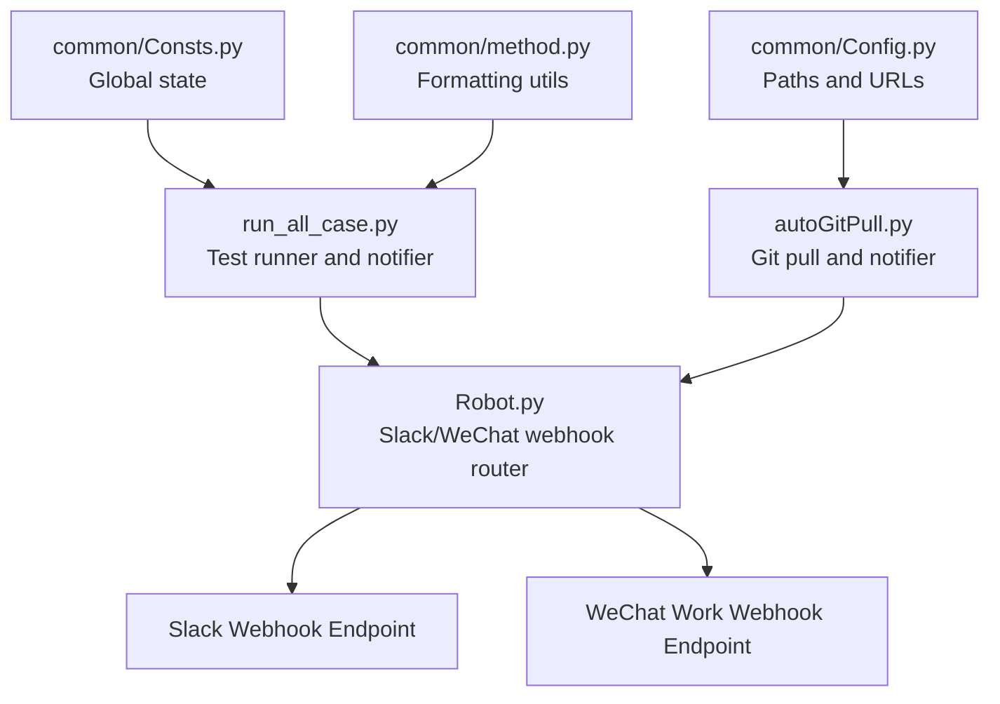
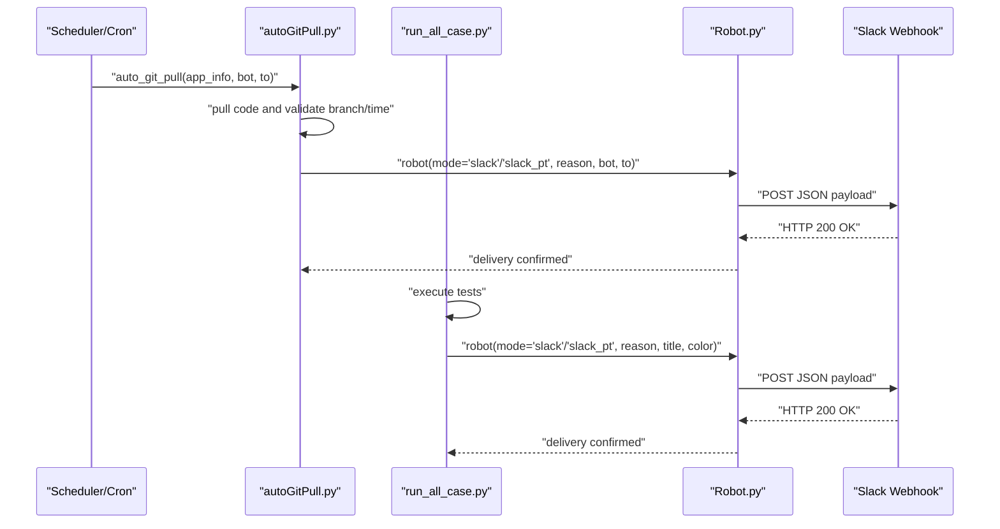
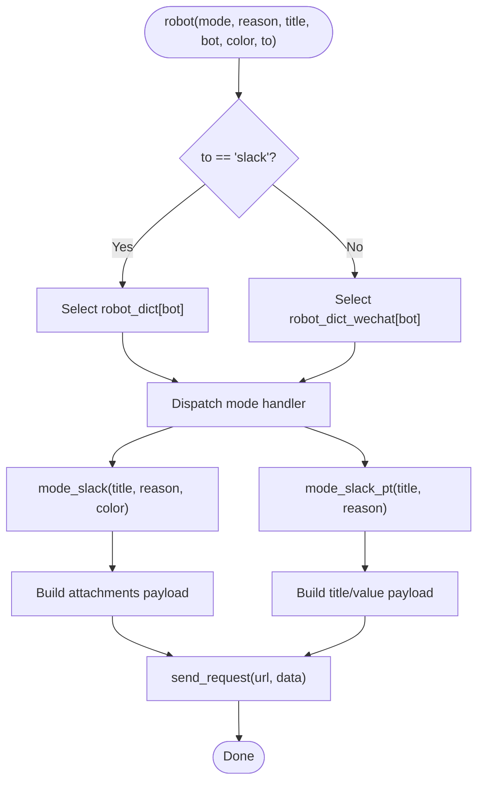
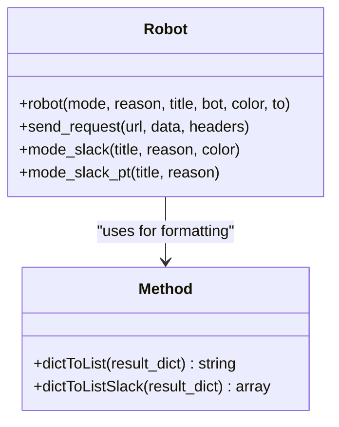
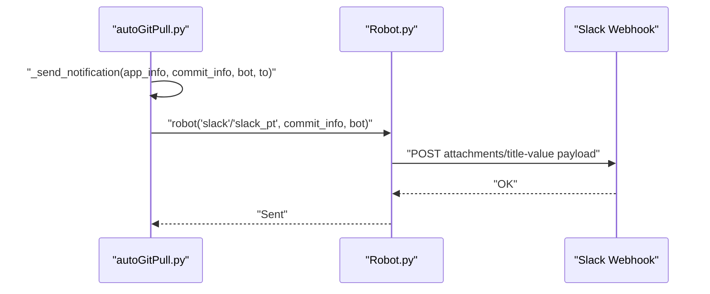
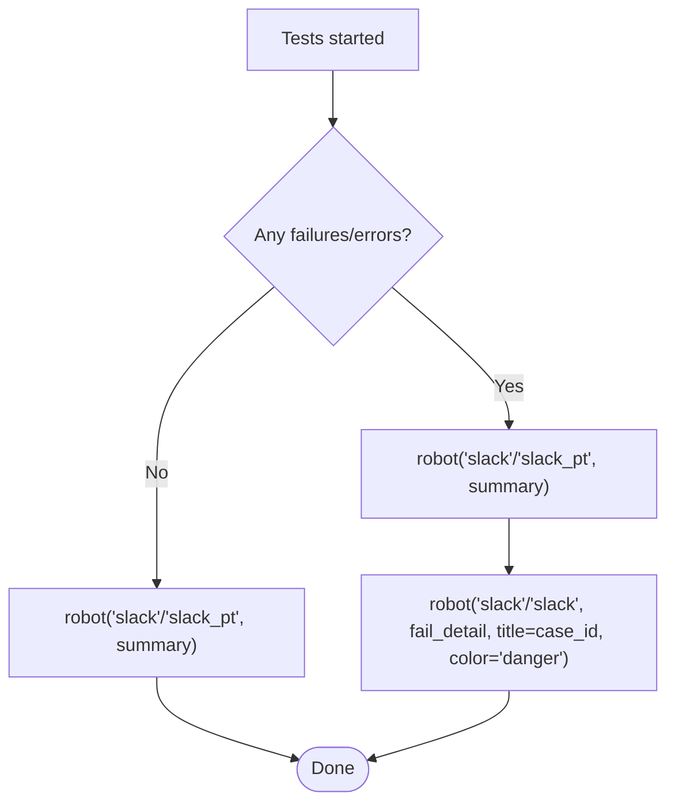
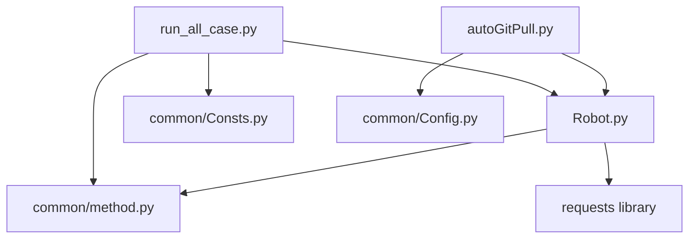

# Real-time Notification System

<cite>
**Referenced Files in This Document**
- [Robot.py](file://Robot.py)
- [autoGitPull.py](file://autoGitPull.py)
- [run_all_case.py](file://run_all_case.py)
- [Config.py](file://common/Config.py)
- [Consts.py](file://common/Consts.py)
- [method.py](file://common/method.py)
</cite>

## Table of Contents
1. [Introduction](#introduction)
2. [Project Structure](#project-structure)
3. [Core Components](#core-components)
4. [Architecture Overview](#architecture-overview)
5. [Detailed Component Analysis](#detailed-component-analysis)
6. [Dependency Analysis](#dependency-analysis)
7. [Performance Considerations](#performance-considerations)
8. [Troubleshooting Guide](#troubleshooting-guide)
9. [Security Considerations](#security-considerations)
10. [Conclusion](#conclusion)

## Introduction
This document explains the real-time notification system integration, focusing on Slack webhook implementation, message formatting, and automated alerting mechanisms. It documents notification triggers for test failures, success confirmations, and system status updates. It also details message templates, custom formatting options, channel integration capabilities, configuration examples, and troubleshooting guidance for connectivity and delivery issues.

## Project Structure
The notification system spans several modules:
- Central notification hub: Robot.py
- Automated Git pull and deployment notifier: autoGitPull.py
- Test execution orchestrator and notifier: run_all_case.py
- Configuration and constants: common/Config.py, common/Consts.py
- Utility helpers: common/method.py

**Diagram sources**
- [run_all_case.py:12-124](file://run_all_case.py#L12-L124)
- [autoGitPull.py:93-112](file://autoGitPull.py#L93-L112)
- [Robot.py:6-33](file://Robot.py#L6-L33)
- [Config.py:17-31](file://common/Config.py#L17-L31)
- [Consts.py:4-16](file://common/Consts.py#L4-L16)
- [method.py:26-38](file://common/method.py#L26-L38)

**Section sources**
- [run_all_case.py:12-124](file://run_all_case.py#L12-L124)
- [autoGitPull.py:93-112](file://autoGitPull.py#L93-L112)
- [Robot.py:6-33](file://Robot.py#L6-L33)
- [Config.py:17-31](file://common/Config.py#L17-L31)
- [Consts.py:4-16](file://common/Consts.py#L4-L16)
- [method.py:26-38](file://common/method.py#L26-L38)

## Core Components
- Slack webhook router and handlers: Robot.py
- Automated Git pull notifier: autoGitPull.py
- Test execution notifier: run_all_case.py
- Configuration and constants: common/Config.py, common/Consts.py
- Formatting utilities: common/method.py

Key responsibilities:
- Robot.py: Selects webhook endpoint by bot/channel, routes modes (fail, success, markdown, icon, slack, slack_pt), builds payloads, and posts to webhooks.
- autoGitPull.py: Pulls code, validates branch and timestamps, and sends notifications via robot() for different app types.
- run_all_case.py: Executes test suites and sends notifications for success/failure/error outcomes.
- common/Config.py: Provides code paths and branch names used by Git updater and test runner.
- common/Consts.py: Stores global state such as failure reasons and timing.
- common/method.py: Provides formatting helpers for lists and Slack field arrays.

**Section sources**
- [Robot.py:6-134](file://Robot.py#L6-L134)
- [autoGitPull.py:93-112](file://autoGitPull.py#L93-L112)
- [run_all_case.py:12-124](file://run_all_case.py#L12-L124)
- [Config.py:17-31](file://common/Config.py#L17-L31)
- [Consts.py:4-16](file://common/Consts.py#L4-L16)
- [method.py:11-38](file://common/method.py#L11-L38)

## Architecture Overview
The notification pipeline integrates three primary triggers:
- Automated Git pull updates
- Test suite completion
- Manual or external events routed through robot()

**Diagram sources**
- [autoGitPull.py:114-187](file://autoGitPull.py#L114-L187)
- [run_all_case.py:31-44](file://run_all_case.py#L31-L44)
- [Robot.py:108-125](file://Robot.py#L108-L125)

## Detailed Component Analysis

### Slack Webhook Implementation
Robot.py implements a centralized router for Slack and WeChat webhooks. For Slack:
- mode_slack constructs an attachments payload with a color and fields array.
- mode_slack_pt sends a simplified title/value payload.
- send_request performs HTTP POST with error handling.

**Diagram sources**
- [Robot.py:6-33](file://Robot.py#L6-L33)
- [Robot.py:108-133](file://Robot.py#L108-L133)
- [Robot.py:36-43](file://Robot.py#L36-L43)

**Section sources**
- [Robot.py:6-33](file://Robot.py#L6-L33)
- [Robot.py:108-133](file://Robot.py#L108-L133)
- [Robot.py:36-43](file://Robot.py#L36-L43)

### Message Formatting and Templates
- Slack attachments template: includes color, title, and value fields.
- Slack PT template: includes title and value fields for concise messages.
- Markdown template: supports markdown content for supported channels.
- List formatting: converts dictionaries to formatted strings for readability.

**Diagram sources**
- [Robot.py:6-134](file://Robot.py#L6-L134)
- [method.py:11-38](file://common/method.py#L11-L38)

**Section sources**
- [Robot.py:108-133](file://Robot.py#L108-L133)
- [method.py:11-38](file://common/method.py#L11-L38)

### Automated Alerting Mechanisms
- Git pull notifier: autoGitPull.py checks branch and commit timestamps, then dispatches notifications via robot().
- Test notifier: run_all_case.py sends notifications after test runs, with distinct handling for success, failures, and errors.

**Diagram sources**
- [autoGitPull.py:93-112](file://autoGitPull.py#L93-L112)
- [Robot.py:108-133](file://Robot.py#L108-L133)

**Section sources**
- [autoGitPull.py:93-112](file://autoGitPull.py#L93-L112)
- [run_all_case.py:31-44](file://run_all_case.py#L31-L44)

### Notification Triggers
- Test failures: robot() invoked with color set to danger and title set to failing case ID.
- Success confirmations: robot() invoked with summary and optional detailed breakdown.
- System status updates: Git pull notifier posts commit summaries and branch status.

**Diagram sources**
- [run_all_case.py:24-44](file://run_all_case.py#L24-L44)
- [run_all_case.py:59-79](file://run_all_case.py#L59-L79)
- [run_all_case.py:97-119](file://run_all_case.py#L97-L119)

**Section sources**
- [run_all_case.py:24-44](file://run_all_case.py#L24-L44)
- [run_all_case.py:59-79](file://run_all_case.py#L59-L79)
- [run_all_case.py:97-119](file://run_all_case.py#L97-L119)

### Channel Integration Capabilities
- Slack: robot_dict maps bot identifiers to webhook URLs; routing depends on to parameter.
- WeChat Work: robot_dict_wechat placeholder indicates support for WeChat work webhooks.
- Different modes: slack, slack_pt, markdown, icon, fail, success.

Note: The current implementation defines placeholders for webhook URLs. Actual integration requires populating the URL mappings.

**Section sources**
- [Robot.py:6-33](file://Robot.py#L6-L33)

### Configuration Examples
- Application and code paths: common/Config.py stores code paths and branch names used by Git updater and test runner.
- Global state: common/Consts.py holds failure reasons and timing used during notifications.
- Formatting helpers: common/method.py provides conversion utilities for lists and Slack field arrays.

Example configuration references:
- Code paths and branches: [Config.py:17-31](file://common/Config.py#L17-L31)
- Global state: [Consts.py:4-16](file://common/Consts.py#L4-L16)
- Formatting helpers: [method.py:11-38](file://common/method.py#L11-L38)

**Section sources**
- [Config.py:17-31](file://common/Config.py#L17-L31)
- [Consts.py:4-16](file://common/Consts.py#L4-L16)
- [method.py:11-38](file://common/method.py#L11-L38)

## Dependency Analysis
The notification system exhibits low coupling and clear separation of concerns:
- run_all_case.py depends on Robot.py and common modules for formatting and logging.
- autoGitPull.py depends on Robot.py and common/Config.py for paths and branch names.
- Robot.py depends on requests and common/method.py for image and formatting utilities.

**Diagram sources**
- [run_all_case.py:5-9](file://run_all_case.py#L5-L9)
- [autoGitPull.py:11-14](file://autoGitPull.py#L11-L14)
- [Robot.py:2-3](file://Robot.py#L2-L3)

**Section sources**
- [run_all_case.py:5-9](file://run_all_case.py#L5-L9)
- [autoGitPull.py:11-14](file://autoGitPull.py#L11-L14)
- [Robot.py:2-3](file://Robot.py#L2-L3)

## Performance Considerations
- Network latency: Each robot() invocation performs an HTTP POST; batch notifications where feasible.
- Rate limiting: Slack webhooks may throttle rapid successive messages; introduce small delays between notifications.
- Payload size: Attachments with many fields increase payload size; prefer concise titles/values for frequent alerts.
- Error handling: send_request() catches exceptions but does not retry; consider adding retry logic for transient failures.

## Troubleshooting Guide
Common issues and resolutions:
- Webhook connectivity failures:
  - Verify bot identifier and to parameter mapping.
  - Confirm URL placeholders are populated in robot_dict or robot_dict_wechat.
  - Check network access and firewall rules.
- Message delivery failures:
  - Inspect response status and logs around send_request().
  - Validate JSON payload structure matches Slack webhook expectations.
- Integration debugging:
  - Add logging around robot() invocations and payload construction.
  - Temporarily switch to a test Slack channel or webhook URL.
  - Validate mode selection logic and ensure correct mode handlers are called.

**Section sources**
- [Robot.py:36-43](file://Robot.py#L36-L43)
- [Robot.py:6-33](file://Robot.py#L6-L33)

## Security Considerations
- Webhook tokens and secrets:
  - Store webhook URLs securely; avoid hardcoding sensitive credentials in source files.
  - Use environment variables or secure vaults to manage endpoints.
- Rate limiting:
  - Implement backoff and throttling to prevent abuse and reduce rate-limit penalties.
- Notification spam prevention:
  - Deduplicate repeated notifications for the same event.
  - Limit frequency of failure notifications by grouping or cooldown periods.
  - Avoid sending @all mentions unless necessary; prefer targeted notifications.

## Conclusion
The real-time notification system integrates Git pull updates and test execution outcomes with Slack webhooks through a clean, modular design. By centralizing webhook routing in Robot.py and leveraging common utilities for formatting and configuration, the system supports flexible channel integration and extensible message templates. Proper configuration of webhook endpoints, robust error handling, and adherence to security best practices are essential for reliable and secure notifications.