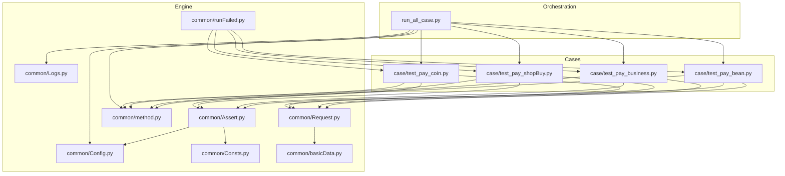
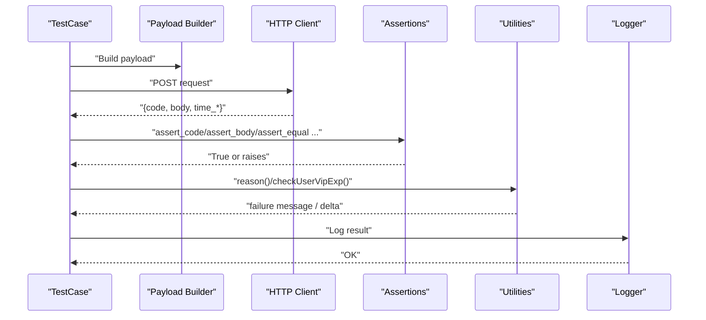
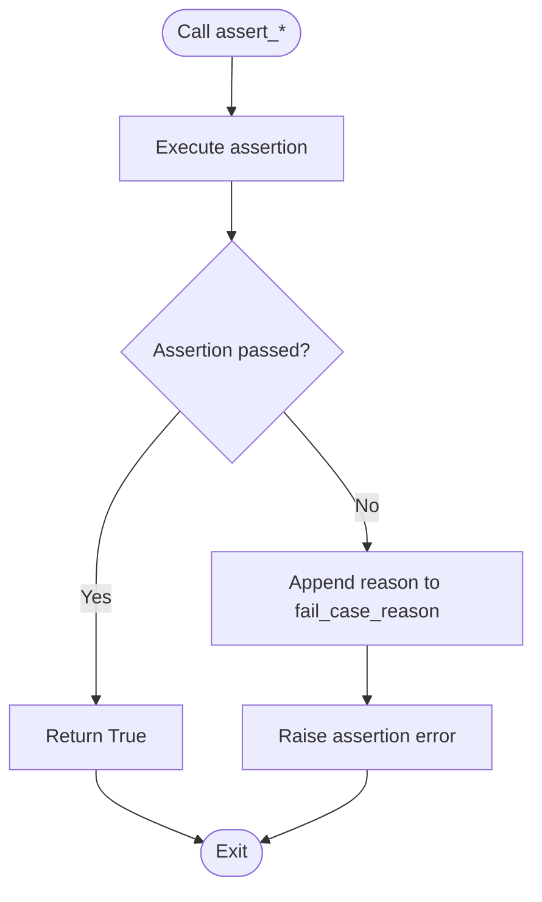
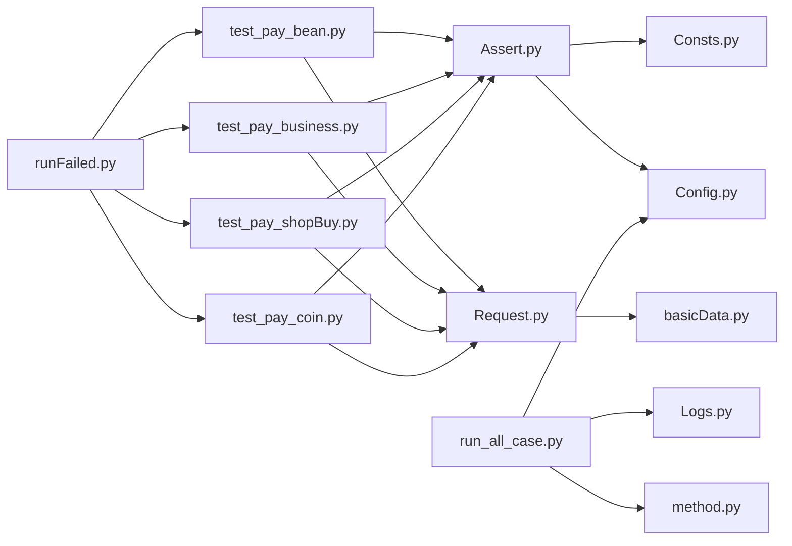

# Assertion and Validation Engine

<cite>
**Referenced Files in This Document**
- [Assert.py](file://common/Assert.py)
- [Logs.py](file://common/Logs.py)
- [Config.py](file://common/Config.py)
- [run_all_case.py](file://run_all_case.py)
- [Consts.py](file://common/Consts.py)
- [method.py](file://common/method.py)
- [runFailed.py](file://common/runFailed.py)
- [basicData.py](file://common/basicData.py)
- [Request.py](file://common/Request.py)
- [test_pay_bean.py](file://case/test_pay_bean.py)
- [test_pay_business.py](file://case/test_pay_business.py)
- [test_pay_shopBuy.py](file://case/test_pay_shopBuy.py)
- [test_pay_coin.py](file://case/test_pay_coin.py)
</cite>

## Table of Contents
1. [Introduction](#introduction)
2. [Project Structure](#project-structure)
3. [Core Components](#core-components)
4. [Architecture Overview](#architecture-overview)
5. [Detailed Component Analysis](#detailed-component-analysis)
6. [Dependency Analysis](#dependency-analysis)
7. [Performance Considerations](#performance-considerations)
8. [Troubleshooting Guide](#troubleshooting-guide)
9. [Conclusion](#conclusion)
10. [Appendices](#appendices)

## Introduction
This document describes the assertion and validation engine used across the payment test suite. It explains the standardized validation methods, assertion patterns, and result processing mechanisms. It documents logging integration, error reporting, and failure analysis capabilities. It also details the assertion factory pattern, validation rule implementations, and guidance for developing custom assertions. Finally, it provides examples of assertion usage, result interpretation, debugging techniques, performance optimization tips, batch validation strategies, and integration with test frameworks.

## Project Structure
The assertion and validation engine spans several modules:
- Assertion library: centralized validation helpers
- Logging: structured logging with rotating file handlers
- Configuration: environment and runtime constants
- Test orchestration: test discovery, execution, and reporting
- Utilities: shared helpers for reasons, paths, and VIP experience calculations
- Retry mechanism: automatic re-execution of failing tests
- Request abstraction: HTTP client wrapper returning normalized results
- Data builders: payload encoders for multiple scenarios
- Case suites: concrete tests leveraging the engine

**Diagram sources**
- [Assert.py:1-96](file://common/Assert.py#L1-L96)
- [Logs.py:1-48](file://common/Logs.py#L1-L48)
- [Config.py:1-133](file://common/Config.py#L1-L133)
- [run_all_case.py:1-159](file://run_all_case.py#L1-L159)
- [Consts.py:1-17](file://common/Consts.py#L1-L17)
- [method.py:1-171](file://common/method.py#L1-L171)
- [runFailed.py:1-87](file://common/runFailed.py#L1-L87)
- [basicData.py:1-581](file://common/basicData.py#L1-L581)
- [Request.py:1-162](file://common/Request.py#L1-L162)
- [test_pay_bean.py:1-188](file://case/test_pay_bean.py#L1-L188)
- [test_pay_business.py:1-189](file://case/test_pay_business.py#L1-L189)
- [test_pay_shopBuy.py:1-124](file://case/test_pay_shopBuy.py#L1-L124)
- [test_pay_coin.py:1-63](file://case/test_pay_coin.py#L1-L63)

**Section sources**
- [run_all_case.py:126-147](file://run_all_case.py#L126-L147)
- [test_pay_bean.py:13-36](file://case/test_pay_bean.py#L13-L36)
- [test_pay_business.py:13-46](file://case/test_pay_business.py#L13-L46)
- [test_pay_shopBuy.py:13-42](file://case/test_pay_shopBuy.py#L13-L42)
- [test_pay_coin.py:13-34](file://case/test_pay_coin.py#L13-L34)

## Core Components
- Assertion library: provides standardized validation helpers for HTTP status codes, equality checks, length thresholds, substring presence, body field equality, and numeric ranges.
- Logging: unified logger with console and timed rotating file handlers, configurable log level and rotation policy.
- Configuration: centralizes base paths, app endpoints, user IDs, gift IDs, and server identifiers.
- Test runner: discovers and executes test suites per application, aggregates results, and posts notifications.
- Utilities: constructs failure reasons, prints result counters, and computes VIP experience deltas.
- Retry decorator: transparently retries failing tests with optional prefix filtering and teardown/setup between attempts.
- Request abstraction: normalizes HTTP responses into a dictionary with code, JSON body, and timing metrics.
- Data builders: encodes payloads for numerous payment scenarios (room gifts, shop purchases, exchanges, defends, etc.).

Key responsibilities:
- Validation: enforce expectations and record failure reasons.
- Reporting: collect pass/fail counts, reasons, and timestamps.
- Observability: log to console and files, integrate with chat bots.
- Resilience: retry transient failures automatically.

**Section sources**
- [Assert.py:11-96](file://common/Assert.py#L11-L96)
- [Logs.py:8-48](file://common/Logs.py#L8-L48)
- [Config.py:6-133](file://common/Config.py#L6-L133)
- [run_all_case.py:12-124](file://run_all_case.py#L12-L124)
- [method.py:115-123](file://common/method.py#L115-L123)
- [runFailed.py:10-87](file://common/runFailed.py#L10-L87)
- [Request.py:17-59](file://common/Request.py#L17-L59)
- [basicData.py:9-324](file://common/basicData.py#L9-L324)

## Architecture Overview
The engine follows a layered design:
- Test layer: test methods invoke request builders, send HTTP requests, and apply assertions.
- Assertion layer: reusable validators encapsulate comparison logic and failure recording.
- Utility layer: helpers compute reasons, manage paths, and calculate VIP experience deltas.
- Orchestration layer: discovers tests, runs them, aggregates results, and reports outcomes.

**Diagram sources**
- [test_pay_bean.py:23-36](file://case/test_pay_bean.py#L23-L36)
- [basicData.py:9-324](file://common/basicData.py#L9-L324)
- [Request.py:17-59](file://common/Request.py#L17-L59)
- [Assert.py:11-96](file://common/Assert.py#L11-L96)
- [method.py:115-123](file://common/method.py#L115-L123)
- [Logs.py:8-48](file://common/Logs.py#L8-L48)

## Detailed Component Analysis

### Assertion Library
The assertion library defines a set of standardized validators:
- assert_code: compares HTTP status code with expected value; records reason on mismatch.
- assert_len: ensures actual length meets minimum threshold; records reason on mismatch.
- assert_equal: compares two values for equality; records reason on mismatch.
- assert_in_text: checks if expected message appears in serialized response body; records reason on mismatch.
- assert_body: retrieves a nested field safely and asserts equality; records reason on mismatch.
- assert_between: asserts numeric value lies within inclusive bounds; records reason on mismatch.

Behavioral characteristics:
- On success: return True.
- On failure: append a reason string to global failure list and raise assertion exception.
- Some validations include a small delay on non-production hosts to mitigate RPC latency.

**Diagram sources**
- [Assert.py:11-96](file://common/Assert.py#L11-L96)
- [Consts.py:7-8](file://common/Consts.py#L7-L8)

**Section sources**
- [Assert.py:11-96](file://common/Assert.py#L11-L96)
- [Consts.py:7-8](file://common/Consts.py#L7-L8)

### Logging System Integration
Logging is configured centrally:
- Creates a logger with both stream handler (console) and timed rotating file handler.
- Uses a consistent formatter with timestamp, pathname, line number, level, and message.
- Ensures log directory exists under the base path.
- Returns a configured logger instance for use across the suite.

Integration points:
- Test runner logs aggregated results and failures.
- Utilities and runner write informational and error messages to logs.

**Section sources**
- [Logs.py:8-48](file://common/Logs.py#L8-L48)
- [run_all_case.py:18-44](file://run_all_case.py#L18-L44)

### Test Orchestration and Result Processing
The test runner:
- Discovers test suites by application selection.
- Executes tests via unittest TextTestRunner with configurable verbosity.
- Aggregates total, failures, and errors.
- Logs summary and pushes notifications to chat bots.
- Collects and formats case lists and failure reasons.

Result processing:
- Maintains global counters and timestamps.
- Stores pass/fail markers in a shared result dictionary.
- Uses reason helpers to enrich failure messages.

**Section sources**
- [run_all_case.py:12-124](file://run_all_case.py#L12-L124)
- [Consts.py:4-16](file://common/Consts.py#L4-L16)
- [method.py:26-38](file://common/method.py#L26-L38)

### Retry Mechanism
The retry decorator:
- Supports class-level and function-level decoration.
- Retries a specified number of times with optional function name prefix filtering.
- Captures exceptions, prints traceback, and performs teardown/setup between retries.
- Re-raises after exhausting retries.

Usage patterns:
- Apply to entire classes to retry all matching tests.
- Apply to specific methods to selectively enable retries.

**Section sources**
- [runFailed.py:10-87](file://common/runFailed.py#L10-L87)
- [test_pay_bean.py:13-13](file://case/test_pay_bean.py#L13-L13)
- [test_pay_business.py:13-13](file://case/test_pay_business.py#L13-L13)
- [test_pay_shopBuy.py:13-13](file://case/test_pay_shopBuy.py#L13-L13)
- [test_pay_coin.py:13-13](file://case/test_pay_coin.py#L13-L13)

### Request Abstraction
The HTTP client wrapper:
- Sets standardized headers including user-agent, content-type, connection close, and user token.
- Sends POST requests with or without payload.
- Normalizes response into a dictionary containing status code, JSON body, and timing metrics.
- Handles exceptions by returning empty structures and printing errors.

**Section sources**
- [Request.py:17-59](file://common/Request.py#L17-L59)

### Payload Builders
Payload builders construct request bodies for various scenarios:
- Room gift payments (single/multiple recipients, exchange flows).
- Chat gift payments.
- Shop purchases (single and multiple items).
- Defend upgrades and breaks.
- Title purchases and coin exchanges.
- Overseas variants with region-specific rooms and gift IDs.

These builders centralize encoding logic and ensure consistent parameterization across tests.

**Section sources**
- [basicData.py:9-324](file://common/basicData.py#L9-L324)
- [basicData.py:328-565](file://common/basicData.py#L328-L565)

### Utilities and Failure Reasons
Utilities support:
- Converting dictionaries to Slack/markdown-friendly lists.
- Traversing nested JSON to check for key presence.
- Computing failure reasons with concise descriptions.
- Calculating VIP experience deltas based on user title multipliers.

These utilities enhance readability and debuggability of test outcomes.

**Section sources**
- [method.py:26-38](file://common/method.py#L26-L38)
- [method.py:58-91](file://common/method.py#L58-L91)
- [method.py:115-123](file://common/method.py#L115-L123)
- [method.py:163-171](file://common/method.py#L163-L171)

### Assertion Patterns in Practice
Common patterns observed across test suites:
- Status code validation immediately after request.
- Body field assertions for success flags and messages.
- Database assertions to verify backend effects.
- Optional length assertions for collections.
- Numeric range checks for balances and experience gains.

Examples of usage:
- Bean payment scenarios validate success flag and message, then assert database balances.
- Business room scenarios assert success and computed splits, including VIP experience increments.
- Shop purchase scenarios validate balance changes and inventory adjustments.
- Coin exchange and room coin payment scenarios validate currency conversions and distribution.

**Section sources**
- [test_pay_bean.py:23-36](file://case/test_pay_bean.py#L23-L36)
- [test_pay_business.py:37-46](file://case/test_pay_business.py#L37-L46)
- [test_pay_shopBuy.py:37-42](file://case/test_pay_shopBuy.py#L37-L42)
- [test_pay_coin.py:27-34](file://case/test_pay_coin.py#L27-L34)

### Result Interpretation and Debugging Techniques
Interpretation:
- Pass/fail markers are stored per-scenario in a shared dictionary.
- Failure reasons are appended globally and can be posted to chat bots.
- Timing metrics from HTTP responses help identify slow endpoints.

Debugging techniques:
- Use reason helpers to capture concise failure messages.
- Inspect logged body content and timestamps.
- Leverage retry decorator to mitigate flakiness.
- Verify environment-specific delays and host conditions.

**Section sources**
- [Consts.py:4-10](file://common/Consts.py#L4-L10)
- [method.py:115-123](file://common/method.py#L115-L123)
- [Assert.py:17-18](file://common/Assert.py#L17-L18)
- [run_all_case.py:34-44](file://run_all_case.py#L34-L44)

## Dependency Analysis
The assertion and validation engine exhibits low coupling and high cohesion:
- Assertions depend on configuration and shared constants.
- Tests depend on assertions, request abstraction, and data builders.
- Runner depends on configuration, logging, and utilities.
- Retry decorator decorates test classes/functions transparently.

**Diagram sources**
- [Assert.py:1-96](file://common/Assert.py#L1-L96)
- [Consts.py:1-17](file://common/Consts.py#L1-L17)
- [Config.py:1-133](file://common/Config.py#L1-L133)
- [test_pay_bean.py:1-11](file://case/test_pay_bean.py#L1-L11)
- [test_pay_business.py:1-11](file://case/test_pay_business.py#L1-L11)
- [test_pay_shopBuy.py:1-11](file://case/test_pay_shopBuy.py#L1-L11)
- [test_pay_coin.py:1-11](file://case/test_pay_coin.py#L1-L11)
- [Request.py:1-162](file://common/Request.py#L1-L162)
- [basicData.py:1-581](file://common/basicData.py#L1-L581)
- [run_all_case.py:1-159](file://run_all_case.py#L1-L159)
- [Logs.py:1-48](file://common/Logs.py#L1-L48)
- [method.py:1-171](file://common/method.py#L1-L171)
- [runFailed.py:1-87](file://common/runFailed.py#L1-L87)

**Section sources**
- [Assert.py:1-96](file://common/Assert.py#L1-L96)
- [run_all_case.py:126-147](file://run_all_case.py#L126-L147)

## Performance Considerations
- Network latency mitigation: a short delay is applied on non-production hosts to accommodate RPC jitter during status code assertions.
- Batch validation: group related assertions per scenario to minimize repeated network calls and database queries.
- Payload reuse: leverage payload builders to avoid recomputation and ensure consistency across tests.
- Logging overhead: keep log levels appropriate for CI environments; consider asynchronous handlers for high-throughput runs.
- Retry tuning: adjust retry count and prefixes to balance flakiness and execution time.

[No sources needed since this section provides general guidance]

## Troubleshooting Guide
Common issues and resolutions:
- Assertion failures: review appended failure reasons and inspect response bodies; confirm expected values align with test intent.
- Network errors: verify endpoint URLs and tokens; check request normalization and exception handling.
- Flaky tests: enable retry decorator with appropriate prefix filtering; ensure teardown/setup clean state between retries.
- Logging gaps: confirm log directory creation and handler configuration; verify log level settings.
- Environment drift: validate configuration overrides for different hosts and branches.

**Section sources**
- [Assert.py:23-25](file://common/Assert.py#L23-L25)
- [Request.py:40-46](file://common/Request.py#L40-L46)
- [runFailed.py:67-77](file://common/runFailed.py#L67-L77)
- [Logs.py:18-21](file://common/Logs.py#L18-L21)
- [Config.py:41-45](file://common/Config.py#L41-L45)

## Conclusion
The assertion and validation engine provides a robust, standardized foundation for payment test automation. Its modular design enables consistent validation, resilient execution via retries, and clear observability through logging and notifications. By adhering to the documented patterns and leveraging the provided utilities, teams can develop reliable, maintainable, and efficient test suites.

[No sources needed since this section summarizes without analyzing specific files]

## Appendices

### Standardized Validation Methods Reference
- assert_code: validate HTTP status code.
- assert_len: validate minimum length.
- assert_equal: validate equality.
- assert_in_text: validate substring presence in serialized body.
- assert_body: validate nested body field equality.
- assert_between: validate numeric range inclusivity.

**Section sources**
- [Assert.py:11-96](file://common/Assert.py#L11-L96)

### Assertion Factory Pattern and Custom Assertions
- Centralize assertion logic in a dedicated module for reuse and consistency.
- Extend the assertion library with new validators following the same pattern: try/except, append reason, raise.
- Keep failure messages actionable and include context (scenario description, actual vs expected).

**Section sources**
- [Assert.py:11-96](file://common/Assert.py#L11-L96)
- [Consts.py:7-8](file://common/Consts.py#L7-L8)

### Batch Validation and Test Framework Integration
- Use unittest discovery to batch-run suites per application.
- Aggregate results and push notifications via chat bot integrations.
- Employ retry decorator to improve stability without manual intervention.

**Section sources**
- [run_all_case.py:126-147](file://run_all_case.py#L126-L147)
- [run_all_case.py:34-44](file://run_all_case.py#L34-L44)
- [runFailed.py:10-87](file://common/runFailed.py#L10-L87)