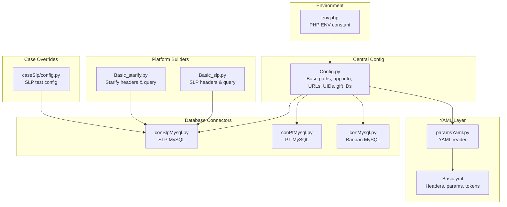
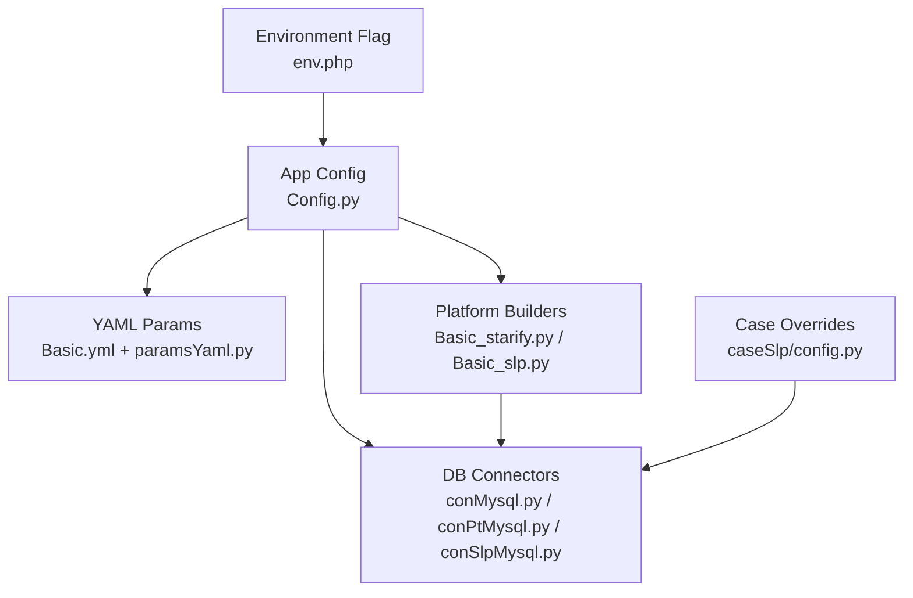
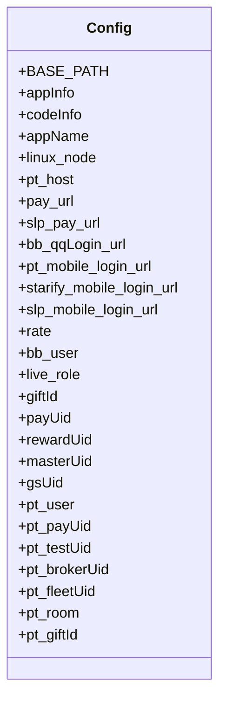
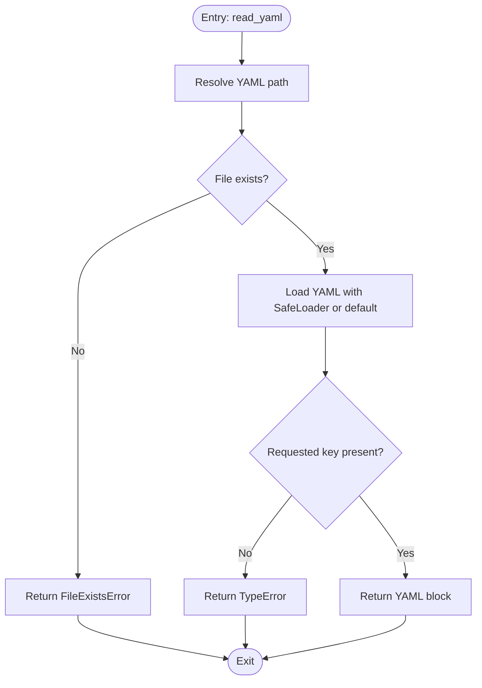
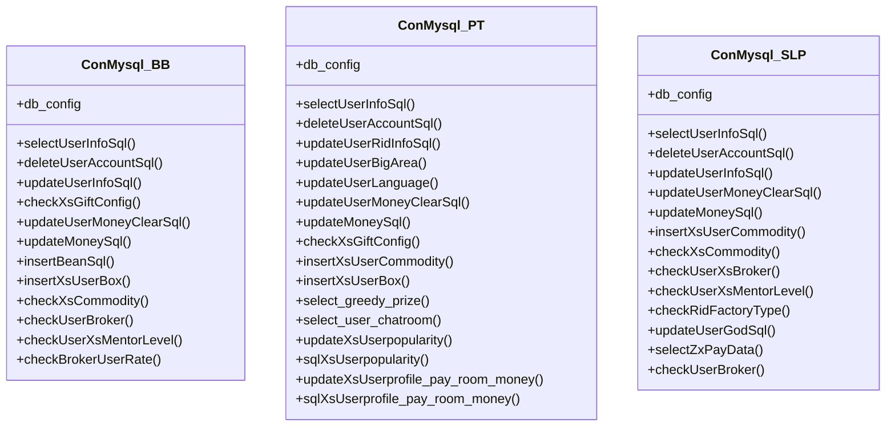
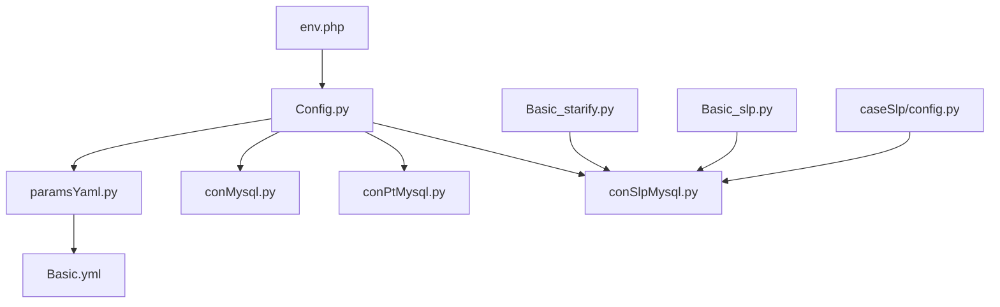

# Configuration Management System

<cite>
**Referenced Files in This Document**
- [Config.py](file://common/Config.py)
- [Basic.yml](file://common/Basic.yml)
- [paramsYaml.py](file://common/paramsYaml.py)
- [Basic_slp.py](file://common/Basic_slp.py)
- [Basic_starify.py](file://common/Basic_starify.py)
- [conMysql.py](file://common/conMysql.py)
- [conPtMysql.py](file://common/conPtMysql.py)
- [conSlpMysql.py](file://common/conSlpMysql.py)
- [config.py](file://caseSlp/config.py)
- [env.php](file://others/env.php)
- [README.md](file://README.md)
</cite>

## Table of Contents
1. [Introduction](#introduction)
2. [Project Structure](#project-structure)
3. [Core Components](#core-components)
4. [Architecture Overview](#architecture-overview)
5. [Detailed Component Analysis](#detailed-component-analysis)
6. [Dependency Analysis](#dependency-analysis)
7. [Performance Considerations](#performance-considerations)
8. [Troubleshooting Guide](#troubleshooting-guide)
9. [Conclusion](#conclusion)
10. [Appendices](#appendices)

## Introduction
This document describes the centralized configuration management system used across the project. It explains how environment-specific settings, platform configurations, and runtime parameters are organized and loaded. The system combines Python-based configuration classes, YAML-based parameter storage, and database connection utilities. It also covers how to configure different environments (development, staging, production), platform-specific settings for Banban, PT Overseas, Starify, and SLP platforms, and how to handle sensitive data securely.

## Project Structure
The configuration system is primarily composed of:
- Centralized Python configuration class holding URLs, user IDs, gift IDs, and platform constants
- YAML files containing headers, mobile login parameters, and environment-specific payloads
- Platform-specific header/query builders for Starify and SLP
- YAML loader utility that reads and validates YAML entries
- Database connection utilities for each platform
- Case-level configuration overrides for SLP tests
- PHP environment definition for server-side environment selection

**Diagram sources**
- [Config.py:1-133](file://common/Config.py#L1-L133)
- [Basic.yml:1-52](file://common/Basic.yml#L1-L52)
- [paramsYaml.py:1-32](file://common/paramsYaml.py#L1-L32)
- [Basic_starify.py:1-36](file://common/Basic_starify.py#L1-L36)
- [Basic_slp.py:1-34](file://common/Basic_slp.py#L1-L34)
- [conMysql.py:1-530](file://common/conMysql.py#L1-L530)
- [conPtMysql.py:1-345](file://common/conPtMysql.py#L1-L345)
- [conSlpMysql.py:1-680](file://common/conSlpMysql.py#L1-L680)
- [config.py:1-263](file://caseSlp/config.py#L1-L263)
- [env.php:1-5](file://others/env.php#L1-L5)

**Section sources**
- [README.md:1-38](file://README.md#L1-L38)
- [Config.py:1-133](file://common/Config.py#L1-L133)
- [Basic.yml:1-52](file://common/Basic.yml#L1-L52)
- [paramsYaml.py:1-32](file://common/paramsYaml.py#L1-L32)
- [Basic_starify.py:1-36](file://common/Basic_starify.py#L1-L36)
- [Basic_slp.py:1-34](file://common/Basic_slp.py#L1-L34)
- [conMysql.py:1-530](file://common/conMysql.py#L1-L530)
- [conPtMysql.py:1-345](file://common/conPtMysql.py#L1-L345)
- [conSlpMysql.py:1-680](file://common/conSlpMysql.py#L1-L680)
- [config.py:1-263](file://caseSlp/config.py#L1-L263)
- [env.php:1-5](file://others/env.php#L1-L5)

## Core Components
- Central configuration class: Provides base paths, application info, server URLs, user IDs, gift IDs, and platform constants. It also defines environment-specific endpoints and login URLs.
- YAML parameter loader: Reads YAML files and extracts named blocks, with platform-aware loader behavior depending on the current Linux node.
- Platform-specific headers and query builders: Provide per-platform HTTP headers and query parameters for authentication and request signing.
- Database connectors: Encapsulate MySQL connection configuration and common SQL operations for each platform.
- Case-level configuration overrides: Allow per-test configuration for SLP platform parameters.
- Environment definition: PHP-based environment flag influences server-side behavior and can be mirrored in Python via environment variables.

Key responsibilities:
- Centralized environment and platform URLs
- Parameter loading and validation
- Secure handling of tokens and secrets
- Runtime parameter overrides for tests

**Section sources**
- [Config.py:1-133](file://common/Config.py#L1-L133)
- [paramsYaml.py:1-32](file://common/paramsYaml.py#L1-L32)
- [Basic.yml:1-52](file://common/Basic.yml#L1-L52)
- [Basic_starify.py:1-36](file://common/Basic_starify.py#L1-L36)
- [Basic_slp.py:1-34](file://common/Basic_slp.py#L1-L34)
- [conMysql.py:1-530](file://common/conMysql.py#L1-L530)
- [conPtMysql.py:1-345](file://common/conPtMysql.py#L1-L345)
- [conSlpMysql.py:1-680](file://common/conSlpMysql.py#L1-L680)
- [config.py:1-263](file://caseSlp/config.py#L1-L263)
- [env.php:1-5](file://others/env.php#L1-L5)

## Architecture Overview
The configuration architecture follows a layered approach:
- Application-level configuration (Python) defines base paths, URLs, and constants
- YAML layer stores environment-specific parameters and tokens
- Platform builders encapsulate request metadata for authentication
- Database connectors manage connections and common operations
- Case-level overrides enable test-specific customization
- Environment flag influences runtime behavior

**Diagram sources**
- [Config.py:1-133](file://common/Config.py#L1-L133)
- [Basic.yml:1-52](file://common/Basic.yml#L1-L52)
- [paramsYaml.py:1-32](file://common/paramsYaml.py#L1-L32)
- [conMysql.py:1-530](file://common/conMysql.py#L1-L530)
- [conPtMysql.py:1-345](file://common/conPtMysql.py#L1-L345)
- [conSlpMysql.py:1-680](file://common/conSlpMysql.py#L1-L680)
- [Basic_starify.py:1-36](file://common/Basic_starify.py#L1-L36)
- [Basic_slp.py:1-34](file://common/Basic_slp.py#L1-L34)
- [config.py:1-263](file://caseSlp/config.py#L1-L263)
- [env.php:1-5](file://others/env.php#L1-L5)

## Detailed Component Analysis

### Central Configuration Class (Config.py)
Responsibilities:
- Define base project path and application info
- Provide URLs for payment, login, and platform endpoints
- Store user IDs, role IDs, and gift IDs for each platform
- Maintain platform-specific constants and server identifiers

Key elements:
- Base path resolution
- Application info dictionary mapping environment keys to endpoints
- Code info dictionary for deployment paths and branches
- App name mapping for platform identification
- Linux node identifiers for platform-aware YAML loading
- Predefined URLs for payment and login
- User dictionaries for Banban, PT, and SLP
- Gift ID dictionaries for Banban and PT

**Diagram sources**
- [Config.py:1-133](file://common/Config.py#L1-L133)

**Section sources**
- [Config.py:1-133](file://common/Config.py#L1-L133)

### YAML Parameter Loader (paramsYaml.py)
Responsibilities:
- Load YAML files from the project’s common directory
- Extract named blocks from YAML
- Handle platform-aware loader behavior based on the current Linux node
- Validate presence of requested YAML block

Processing logic:
- Resolve YAML file path using base path
- Attempt to load YAML with SafeLoader on specific nodes
- Fall back to default loader on other nodes
- Return the requested YAML block or raise errors on missing keys

**Diagram sources**
- [paramsYaml.py:1-32](file://common/paramsYaml.py#L1-L32)

**Section sources**
- [paramsYaml.py:1-32](file://common/paramsYaml.py#L1-L32)

### YAML Parameter Storage (Basic.yml)
Responsibilities:
- Store environment-specific headers for Banban, PT Overseas, and SLP
- Provide mobile login parameters and tokens for PT and SLP
- Define query parameters and sign-related values for different environments

Structure highlights:
- Header blocks for development and production-like environments
- Mobile login data for PT and SLP
- Query parameter blocks for login and session handling
- Token placeholders suitable for environment injection

**Section sources**
- [Basic.yml:1-52](file://common/Basic.yml#L1-L52)

### Platform-Specific Headers and Queries
- Starify headers and query parameters: Provide device and package metadata for Starify requests
- SLP headers and query parameters: Provide device and package metadata for SLP requests

These builders complement the central configuration by supplying platform-specific request metadata.

**Section sources**
- [Basic_starify.py:1-36](file://common/Basic_starify.py#L1-L36)
- [Basic_slp.py:1-34](file://common/Basic_slp.py#L1-L34)

### Database Connectors
Each platform has a dedicated connector class encapsulating:
- Connection configuration (host, user, password, database, port)
- Cursor initialization and ping with reconnect
- Common SQL operations for user data, balances, commodities, and room properties

Highlights:
- Banban connector supports account queries, commodity checks, broker user rates, and profile updates
- PT connector supports balance queries, commodity counts, chat pay cards, and area/language settings
- SLP connector supports account queries, commodity checks, broker membership verification, and special room data

**Diagram sources**
- [conMysql.py:1-530](file://common/conMysql.py#L1-L530)
- [conPtMysql.py:1-345](file://common/conPtMysql.py#L1-L345)
- [conSlpMysql.py:1-680](file://common/conSlpMysql.py#L1-L680)

**Section sources**
- [conMysql.py:1-530](file://common/conMysql.py#L1-L530)
- [conPtMysql.py:1-345](file://common/conPtMysql.py#L1-L345)
- [conSlpMysql.py:1-680](file://common/conSlpMysql.py#L1-L680)

### Case-Level Configuration Overrides (SLP)
The SLP test configuration module provides:
- Payment endpoint override for SLP
- Default gift quantity and amount
- Test user IDs and room IDs
- Gift configuration, room defense tiers, personal defense options
- Rates and noble level thresholds
- Special box configuration

This allows tests to override global defaults while still leveraging shared database connectors.

**Section sources**
- [config.py:1-263](file://caseSlp/config.py#L1-L263)

### Environment Definition (env.php)
Defines the environment constant used by PHP components. This can be mirrored in Python via environment variables to influence configuration behavior.

**Section sources**
- [env.php:1-5](file://others/env.php#L1-L5)

## Dependency Analysis
The configuration system exhibits clear separation of concerns:
- Central configuration depends on YAML loader and platform builders
- Database connectors depend on central configuration for shared constants
- Case-level overrides depend on database connectors and central configuration
- Environment flag influences central configuration behavior

**Diagram sources**
- [Config.py:1-133](file://common/Config.py#L1-L133)
- [paramsYaml.py:1-32](file://common/paramsYaml.py#L1-L32)
- [Basic.yml:1-52](file://common/Basic.yml#L1-L52)
- [conMysql.py:1-530](file://common/conMysql.py#L1-L530)
- [conPtMysql.py:1-345](file://common/conPtMysql.py#L1-L345)
- [conSlpMysql.py:1-680](file://common/conSlpMysql.py#L1-L680)
- [Basic_starify.py:1-36](file://common/Basic_starify.py#L1-L36)
- [Basic_slp.py:1-34](file://common/Basic_slp.py#L1-L34)
- [config.py:1-263](file://caseSlp/config.py#L1-L263)
- [env.php:1-5](file://others/env.php#L1-L5)

**Section sources**
- [Config.py:1-133](file://common/Config.py#L1-L133)
- [paramsYaml.py:1-32](file://common/paramsYaml.py#L1-L32)
- [Basic.yml:1-52](file://common/Basic.yml#L1-L52)
- [conMysql.py:1-530](file://common/conMysql.py#L1-L530)
- [conPtMysql.py:1-345](file://common/conPtMysql.py#L1-L345)
- [conSlpMysql.py:1-680](file://common/conSlpMysql.py#L1-L680)
- [Basic_starify.py:1-36](file://common/Basic_starify.py#L1-L36)
- [Basic_slp.py:1-34](file://common/Basic_slp.py#L1-L34)
- [config.py:1-263](file://caseSlp/config.py#L1-L263)
- [env.php:1-5](file://others/env.php#L1-L5)

## Performance Considerations
- YAML loading: SafeLoader is used on specific nodes to avoid warnings; ensure YAML files remain small and well-formed to minimize load overhead.
- Database connectors: Reuse connections and cursors; batch operations where possible to reduce round-trips.
- Central configuration: Keep constants immutable to avoid repeated reinitialization costs.
- Platform builders: Avoid redundant computation; cache computed values if reused frequently.

## Troubleshooting Guide
Common issues and resolutions:
- YAML file not found: Verify the YAML path resolution and file existence before attempting to load.
- Missing YAML key: Ensure the requested block exists in the YAML file; the loader returns a type error when keys are absent.
- Platform mismatch: Confirm the Linux node identifier matches the intended platform; loaders vary by node.
- Database connectivity: Check host, user, password, and database name; ensure the database is reachable and credentials are correct.
- Case-level overrides: Validate that SLP test configuration aligns with database expectations and gift/room mappings.

**Section sources**
- [paramsYaml.py:1-32](file://common/paramsYaml.py#L1-L32)
- [conMysql.py:1-530](file://common/conMysql.py#L1-L530)
- [conPtMysql.py:1-345](file://common/conPtMysql.py#L1-L345)
- [conSlpMysql.py:1-680](file://common/conSlpMysql.py#L1-L680)
- [config.py:1-263](file://caseSlp/config.py#L1-L263)

## Conclusion
The configuration management system integrates centralized Python configuration, YAML-based parameters, platform-specific builders, and database connectors. It supports environment-specific settings, platform configurations, and runtime overrides while maintaining clear separation of concerns. By following the documented patterns for YAML loading, parameter validation, and secure handling of sensitive data, teams can reliably manage configurations across development, staging, and production environments.

## Appendices

### Configuration File Structure Examples
- Central configuration: Defines base paths, app info, URLs, user IDs, gift IDs, and platform constants.
- YAML parameters: Stores headers, mobile login parameters, tokens, and query parameters.
- Platform builders: Provide device and package metadata for Starify and SLP.
- Database connectors: Encapsulate connection configuration and common SQL operations.

**Section sources**
- [Config.py:1-133](file://common/Config.py#L1-L133)
- [Basic.yml:1-52](file://common/Basic.yml#L1-L52)
- [Basic_starify.py:1-36](file://common/Basic_starify.py#L1-L36)
- [Basic_slp.py:1-34](file://common/Basic_slp.py#L1-L34)
- [conMysql.py:1-530](file://common/conMysql.py#L1-L530)
- [conPtMysql.py:1-345](file://common/conPtMysql.py#L1-L345)
- [conSlpMysql.py:1-680](file://common/conSlpMysql.py#L1-L680)

### Parameter Precedence
- Central configuration takes precedence for base paths and constants.
- YAML parameters override defaults for headers, tokens, and query parameters.
- Case-level overrides take effect during test execution for SLP-specific values.
- Environment flag influences server-side behavior and can be mirrored in Python.

**Section sources**
- [Config.py:1-133](file://common/Config.py#L1-L133)
- [paramsYaml.py:1-32](file://common/paramsYaml.py#L1-L32)
- [config.py:1-263](file://caseSlp/config.py#L1-L263)
- [env.php:1-5](file://others/env.php#L1-L5)

### Dynamic Configuration Updates
- YAML updates: Modify YAML blocks to change headers, tokens, or query parameters; reload via the YAML loader.
- Database connector updates: Adjust connection configuration or SQL operations as needed.
- Case overrides: Update SLP test configuration to reflect new defaults or test scenarios.

**Section sources**
- [paramsYaml.py:1-32](file://common/paramsYaml.py#L1-L32)
- [conMysql.py:1-530](file://common/conMysql.py#L1-L530)
- [conPtMysql.py:1-345](file://common/conPtMysql.py#L1-L345)
- [conSlpMysql.py:1-680](file://common/conSlpMysql.py#L1-L680)
- [config.py:1-263](file://caseSlp/config.py#L1-L263)

### Security Considerations and Sensitive Data Handling
- Tokens and secrets: Store tokens in YAML blocks and avoid hardcoding in scripts; load via the YAML loader.
- Environment isolation: Use environment flags to separate dev/staging/prod configurations; mirror PHP environment in Python where applicable.
- Access control: Restrict access to YAML files and database credentials; ensure least privilege for database accounts.
- Validation: Validate YAML keys and database responses to prevent unexpected behavior.

**Section sources**
- [Basic.yml:1-52](file://common/Basic.yml#L1-L52)
- [paramsYaml.py:1-32](file://common/paramsYaml.py#L1-L32)
- [env.php:1-5](file://others/env.php#L1-L5)