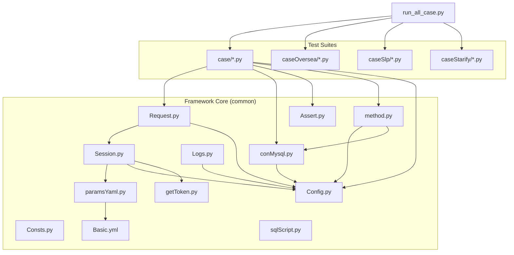
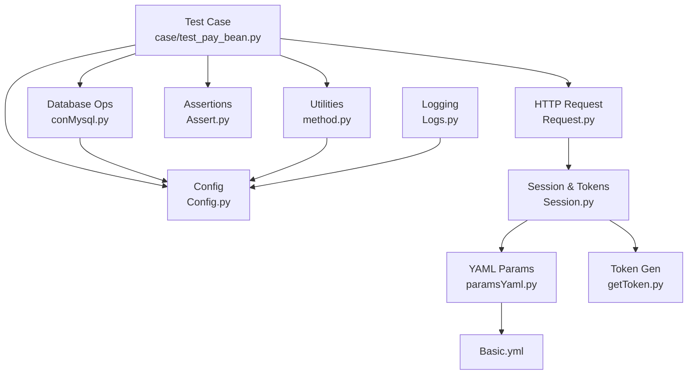
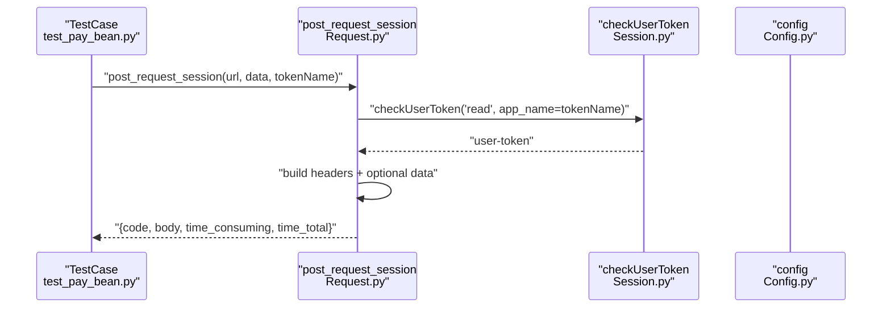
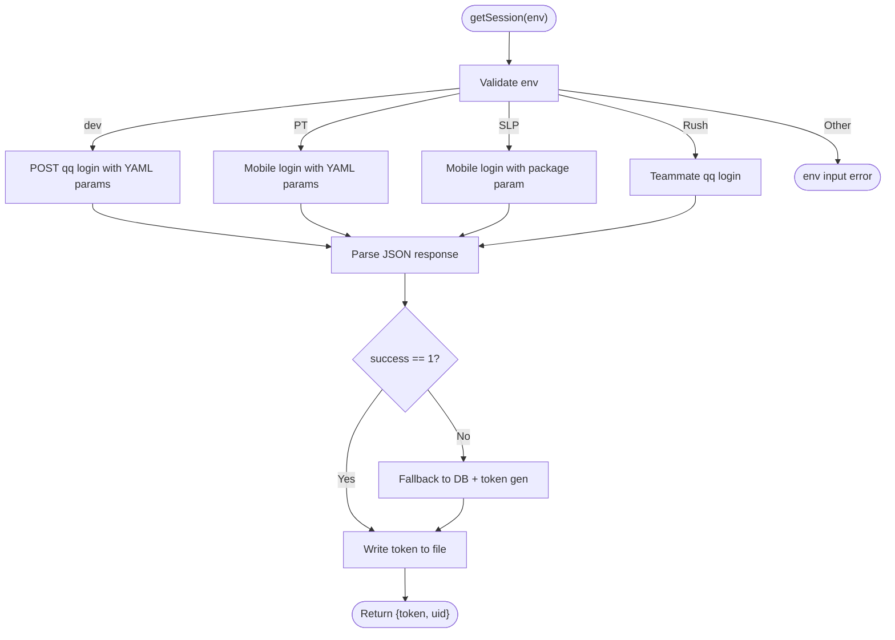
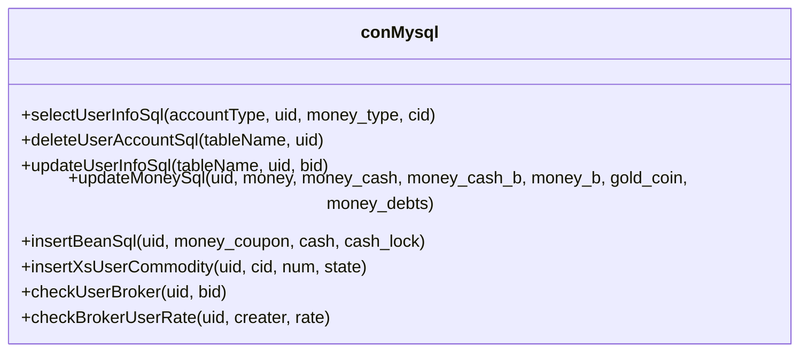
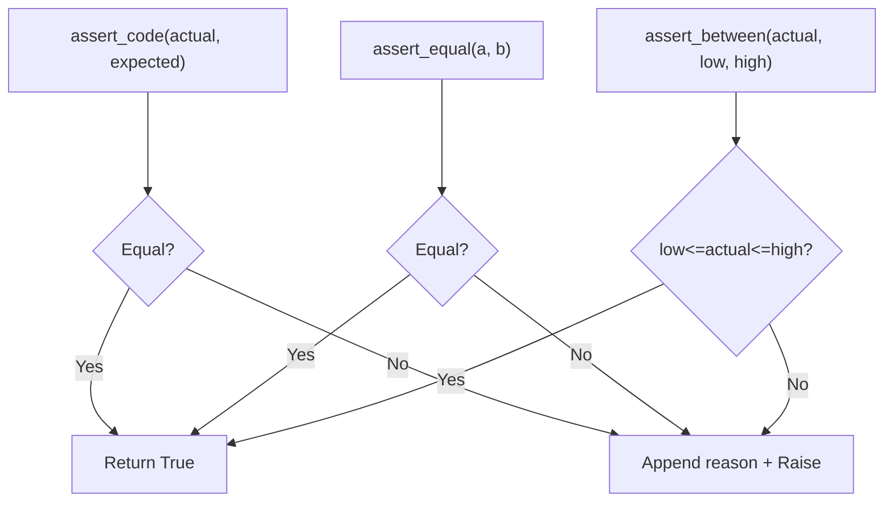
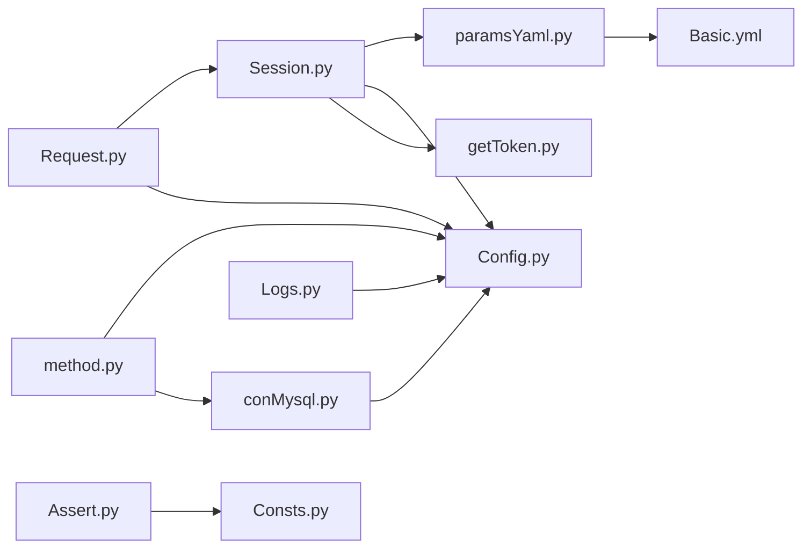

# Core Framework Components

<cite>
**Referenced Files in This Document**
- [Config.py](file://common/Config.py)
- [Request.py](file://common/Request.py)
- [Session.py](file://common/Session.py)
- [Assert.py](file://common/Assert.py)
- [Logs.py](file://common/Logs.py)
- [conMysql.py](file://common/conMysql.py)
- [getToken.py](file://common/getToken.py)
- [Consts.py](file://common/Consts.py)
- [paramsYaml.py](file://common/paramsYaml.py)
- [method.py](file://common/method.py)
- [Basic.yml](file://common/Basic.yml)
- [sqlScript.py](file://common/sqlScript.py)
- [run_all_case.py](file://run_all_case.py)
- [README.md](file://README.md)
- [test_pay_bean.py](file://case/test_pay_bean.py)
</cite>

## Table of Contents
1. [Introduction](#introduction)
2. [Project Structure](#project-structure)
3. [Core Components](#core-components)
4. [Architecture Overview](#architecture-overview)
5. [Detailed Component Analysis](#detailed-component-analysis)
6. [Dependency Analysis](#dependency-analysis)
7. [Performance Considerations](#performance-considerations)
8. [Troubleshooting Guide](#troubleshooting-guide)
9. [Conclusion](#conclusion)
10. [Appendices](#appendices)

## Introduction
This document describes the core framework components of the QA Payment Testing Framework. It focuses on centralized configuration management, HTTP request handling with multi-protocol support, session management and authentication token handling, database connectivity, assertion engine for test validation, data encoding factory pattern, logging system, token retrieval mechanisms, and utility functions. It also outlines architectural patterns, component relationships, integration points, and provides usage guidance with code example paths.

## Project Structure
The framework is organized around a shared common library and feature-specific test suites:
- common: Centralized utilities for configuration, HTTP requests, sessions, assertions, logging, database connectivity, token generation, YAML parsing, constants, and helpers.
- case/caseOversea/caseSlp/caseStarify: Feature-specific test suites that consume the common framework.
- run scripts: Orchestration for test discovery and execution.

**Diagram sources**
- [Config.py](file://common/Config.py)
- [Request.py](file://common/Request.py)
- [Session.py](file://common/Session.py)
- [Assert.py](file://common/Assert.py)
- [Logs.py](file://common/Logs.py)
- [conMysql.py](file://common/conMysql.py)
- [getToken.py](file://common/getToken.py)
- [Consts.py](file://common/Consts.py)
- [paramsYaml.py](file://common/paramsYaml.py)
- [Basic.yml](file://common/Basic.yml)
- [method.py](file://common/method.py)
- [sqlScript.py](file://common/sqlScript.py)
- [run_all_case.py](file://run_all_case.py)
- [test_pay_bean.py](file://case/test_pay_bean.py)

**Section sources**
- [README.md](file://README.md)
- [run_all_case.py](file://run_all_case.py)

## Core Components
- Centralized Configuration Management: Provides environment URLs, user roles, gift IDs, app names, and server identifiers.
- HTTP Request Handling: Encapsulates POST requests with token injection and response normalization.
- Session Management and Token Handling: Manages login sessions, writes/reads tokens to/from local storage, and falls back to token generation via salt.
- Database Connectivity: Offers MySQL operations for querying, updating, inserting, and cleaning test data.
- Assertion Engine: Provides multiple assertion helpers for status codes, equality, length bounds, substring checks, and structured body assertions.
- Logging System: Creates rotating loggers with console and file handlers.
- Token Retrieval Mechanisms: Implements token generation using MD5, RC4-like XOR, and base64 encoding with salt verification.
- Utility Functions: Includes JSON traversal, Slack/markdown message builders, image fetching, VIP experience calculation, and result reporting.

**Section sources**
- [Config.py](file://common/Config.py)
- [Request.py](file://common/Request.py)
- [Session.py](file://common/Session.py)
- [Assert.py](file://common/Assert.py)
- [Logs.py](file://common/Logs.py)
- [conMysql.py](file://common/conMysql.py)
- [getToken.py](file://common/getToken.py)
- [Consts.py](file://common/Consts.py)
- [paramsYaml.py](file://common/paramsYaml.py)
- [method.py](file://common/method.py)

## Architecture Overview
The framework follows a layered architecture:
- Test Layer: Feature tests import common utilities and orchestrate requests/assertions.
- Service Layer: HTTP request abstraction and session/token management.
- Persistence Layer: MySQL connectivity abstractions for CRUD operations.
- Infrastructure Layer: Logging, YAML configuration, constants, and utilities.

**Diagram sources**
- [test_pay_bean.py](file://case/test_pay_bean.py)
- [Request.py](file://common/Request.py)
- [Session.py](file://common/Session.py)
- [Assert.py](file://common/Assert.py)
- [conMysql.py](file://common/conMysql.py)
- [method.py](file://common/method.py)
- [Config.py](file://common/Config.py)
- [Logs.py](file://common/Logs.py)
- [paramsYaml.py](file://common/paramsYaml.py)
- [Basic.yml](file://common/Basic.yml)
- [getToken.py](file://common/getToken.py)

## Detailed Component Analysis

### Centralized Configuration Management
- Responsibilities:
  - Define base paths, app environments, code paths, and server identifiers.
  - Provide URLs for payment and login endpoints per app.
  - Store user IDs, role IDs, gift IDs, and ratios.
- Key behaviors:
  - Environment-aware appInfo mapping.
  - Pre-built endpoint URLs derived from appInfo.
  - User and role dictionaries for test data setup.
- Extension points:
  - Add new app environments by extending appInfo and adding related endpoints.
  - Introduce new user/role/gift mappings under respective dictionaries.

**Section sources**
- [Config.py](file://common/Config.py)

### HTTP Request Handling and Multi-Protocol Support
- Responsibilities:
  - Encapsulate HTTP POST requests with standardized headers and token injection.
  - Normalize responses into a dictionary with code, body, and timing metrics.
  - Support HTTPS enforcement and optional payload data.
- Key behaviors:
  - Reads user-token from session storage.
  - Converts response to JSON safely and records elapsed time.
  - Returns structured result for downstream assertions.
- Integration points:
  - Depends on Session for token retrieval and Config for base URLs.
- Extension points:
  - Add GET/PUT methods by mirroring POST logic and parameterization.
  - Introduce protocol-specific headers or signing mechanisms.

**Diagram sources**
- [test_pay_bean.py](file://case/test_pay_bean.py)
- [Request.py](file://common/Request.py)
- [Session.py](file://common/Session.py)
- [Config.py](file://common/Config.py)

**Section sources**
- [Request.py](file://common/Request.py)
- [Session.py](file://common/Session.py)
- [Config.py](file://common/Config.py)

### Session Management and Authentication Token Handling
- Responsibilities:
  - Perform app-specific login flows for multiple apps (dev, PT, SLP, Rush).
  - Persist tokens to local files and read them back for reuse.
  - Fallback to token generation using salt from DB.
- Key behaviors:
  - Reads YAML headers/params for login requests.
  - Writes tokens to app-specific files.
  - On failure, retrieves salt from DB and generates token.
- Integration points:
  - Uses YAML loader, Config, DB connector, and token generator.
- Extension points:
  - Add new app login flows by extending env branches and token persistence.

**Diagram sources**
- [Session.py](file://common/Session.py)
- [paramsYaml.py](file://common/paramsYaml.py)
- [Config.py](file://common/Config.py)
- [conMysql.py](file://common/conMysql.py)
- [getToken.py](file://common/getToken.py)

**Section sources**
- [Session.py](file://common/Session.py)
- [paramsYaml.py](file://common/paramsYaml.py)
- [Config.py](file://common/Config.py)
- [conMysql.py](file://common/conMysql.py)
- [getToken.py](file://common/getToken.py)

### Database Connectivity Layer
- Responsibilities:
  - Provide unified MySQL operations for querying, updating, inserting, and cleanup.
  - Support environment-specific DB credentials and schema selection.
- Key behaviors:
  - Centralized connection initialization and cursor management.
  - Account and inventory manipulation helpers.
  - Broker and guild-related setup and updates.
- Integration points:
  - Uses Config for DB host/user/password and schema.
- Extension points:
  - Add new SQL helpers for domain entities.
  - Introduce environment-specific connection pools.

**Diagram sources**
- [conMysql.py](file://common/conMysql.py)
- [Config.py](file://common/Config.py)

**Section sources**
- [conMysql.py](file://common/conMysql.py)
- [Config.py](file://common/Config.py)
- [sqlScript.py](file://common/sqlScript.py)

### Assertion Engine for Test Validation
- Responsibilities:
  - Provide assertion helpers for HTTP status, equality, length bounds, substring presence, and structured body checks.
- Key behaviors:
  - Record failure reasons into global failure list.
  - Sleep on specific nodes to mitigate RPC latency.
- Integration points:
  - Uses Config for environment checks and Consts for failure aggregation.

**Diagram sources**
- [Assert.py](file://common/Assert.py)
- [Consts.py](file://common/Consts.py)
- [Config.py](file://common/Config.py)

**Section sources**
- [Assert.py](file://common/Assert.py)
- [Consts.py](file://common/Consts.py)
- [Config.py](file://common/Config.py)

### Logging System
- Responsibilities:
  - Create rotating loggers with console and file handlers.
  - Configure log path under project root/log.
- Key behaviors:
  - Stream handler at INFO level, file handler with timed rotation.
  - Consistent formatter with timestamp, module path, line number, and level.

**Section sources**
- [Logs.py](file://common/Logs.py)
- [Config.py](file://common/Config.py)

### Token Retrieval Mechanisms
- Responsibilities:
  - Generate tokens using UID, salt, timestamps, and cryptographic primitives.
- Key behaviors:
  - Construct argument dict, compute MD5 checksums, apply RC4-like XOR cipher, and base64 encode with URL-safe transformations.
- Integration points:
  - Uses Config for salt lookup and DB queries.

**Section sources**
- [getToken.py](file://common/getToken.py)
- [conMysql.py](file://common/conMysql.py)

### Utility Functions
- Responsibilities:
  - JSON traversal, Slack/markdown builders, image fetching, VIP experience calculation, and result reporting.
- Key behaviors:
  - Recursive key extraction from nested JSON.
  - Convert dicts to Slack-compatible blocks.
  - Calculate VIP bonus multipliers based on level.

**Section sources**
- [method.py](file://common/method.py)
- [conMysql.py](file://common/conMysql.py)
- [Config.py](file://common/Config.py)

### YAML Parameter Loading
- Responsibilities:
  - Load YAML files with environment-aware loaders and handle missing keys gracefully.
- Key behaviors:
  - Resolve file path from BASE_PATH/common.
  - Return values for named entries or propagate exceptions.

**Section sources**
- [paramsYaml.py](file://common/paramsYaml.py)
- [Basic.yml](file://common/Basic.yml)
- [Config.py](file://common/Config.py)

### Data Encoding Factory Pattern
- Responsibilities:
  - Provide a single entry point to construct payment payloads for different scenarios.
- Usage pattern:
  - Tests call an encoding helper to build request bodies with gift IDs, types, amounts, and recipients.
- Integration points:
  - Consumed by HTTP request layer and validated by assertions.

**Section sources**
- [test_pay_bean.py](file://case/test_pay_bean.py)

## Dependency Analysis
- Cohesion:
  - Each module encapsulates a single concern (HTTP, DB, Session, Assert, Log, YAML, Utils).
- Coupling:
  - Request depends on Session and Config.
  - Session depends on YAML, Config, DB, and Token.
  - Assertions depend on Consts and Config.
  - Utilities depend on Config and DB.
- External dependencies:
  - requests, urllib3, pymysql, yaml, logging, base64, hashlib, time, platform.

**Diagram sources**
- [Request.py](file://common/Request.py)
- [Session.py](file://common/Session.py)
- [Assert.py](file://common/Assert.py)
- [Logs.py](file://common/Logs.py)
- [conMysql.py](file://common/conMysql.py)
- [getToken.py](file://common/getToken.py)
- [paramsYaml.py](file://common/paramsYaml.py)
- [Basic.yml](file://common/Basic.yml)
- [method.py](file://common/method.py)
- [Consts.py](file://common/Consts.py)
- [Config.py](file://common/Config.py)

**Section sources**
- [Request.py](file://common/Request.py)
- [Session.py](file://common/Session.py)
- [Assert.py](file://common/Assert.py)
- [Logs.py](file://common/Logs.py)
- [conMysql.py](file://common/conMysql.py)
- [getToken.py](file://common/getToken.py)
- [paramsYaml.py](file://common/paramsYaml.py)
- [method.py](file://common/method.py)
- [Consts.py](file://common/Consts.py)
- [Config.py](file://common/Config.py)

## Performance Considerations
- SSL/TLS verification disabled in HTTP requests; ensure appropriate safeguards in CI/CD contexts.
- Token generation involves cryptographic operations; cache tokens via local files to avoid repeated generation.
- Database operations batch updates with commits; consider transaction boundaries for large datasets.
- Logging uses rotating handlers; configure backup counts appropriately for CI environments.

[No sources needed since this section provides general guidance]

## Troubleshooting Guide
- HTTP request failures:
  - Verify token availability via Session token file and fallback logic.
  - Confirm endpoint URLs from Config and environment-specific YAML params.
- Database connectivity:
  - Ensure DB host/user/password match Config and schema selection succeeds.
  - Use centralized helpers to check/insert/update data before/after tests.
- Assertion failures:
  - Inspect recorded failure reasons appended to the global failure list.
  - Cross-check expected vs. actual values and adjust test data accordingly.
- Logging:
  - Check log directory under project root and confirm file permissions.

**Section sources**
- [Session.py](file://common/Session.py)
- [Request.py](file://common/Request.py)
- [conMysql.py](file://common/conMysql.py)
- [Assert.py](file://common/Assert.py)
- [Logs.py](file://common/Logs.py)
- [Consts.py](file://common/Consts.py)

## Conclusion
The QA Payment Testing Framework provides a cohesive, extensible foundation for payment-related test automation. Its layered design separates concerns across configuration, HTTP, session/token management, database operations, assertions, logging, and utilities. By leveraging centralized configuration, reusable helpers, and robust error handling, teams can efficiently author, maintain, and scale test suites across multiple applications and environments.

[No sources needed since this section summarizes without analyzing specific files]

## Appendices

### Example Usage References
- Running tests and collecting results:
  - [run_all_case.py](file://run_all_case.py)
- Example test using HTTP request, DB checks, and assertions:
  - [test_pay_bean.py](file://case/test_pay_bean.py)
- Configuration and endpoints:
  - [Config.py](file://common/Config.py)
- HTTP request abstraction:
  - [Request.py](file://common/Request.py)
- Session and token management:
  - [Session.py](file://common/Session.py)
- Database operations:
  - [conMysql.py](file://common/conMysql.py)
- Assertions:
  - [Assert.py](file://common/Assert.py)
- Logging:
  - [Logs.py](file://common/Logs.py)
- YAML loading:
  - [paramsYaml.py](file://common/paramsYaml.py)
  - [Basic.yml](file://common/Basic.yml)
- Utilities:
  - [method.py](file://common/method.py)