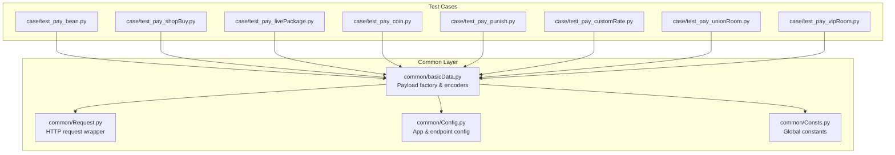
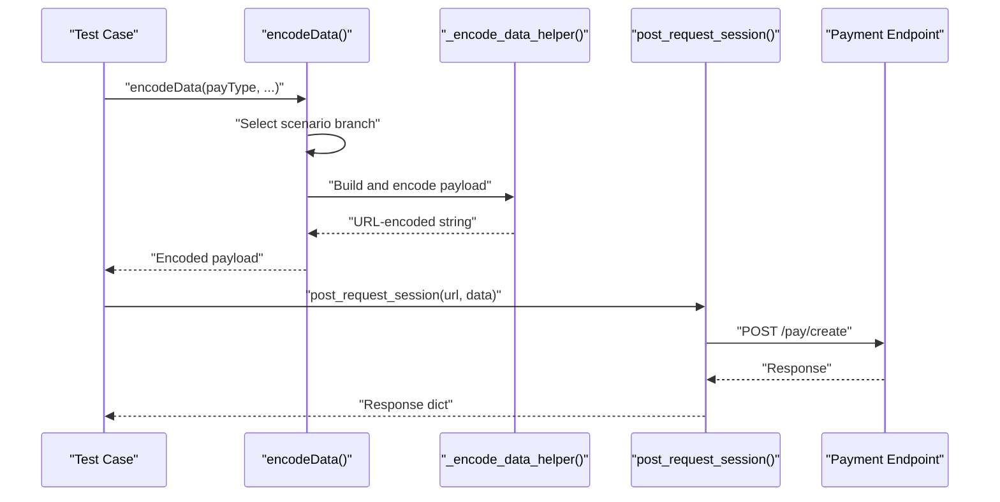
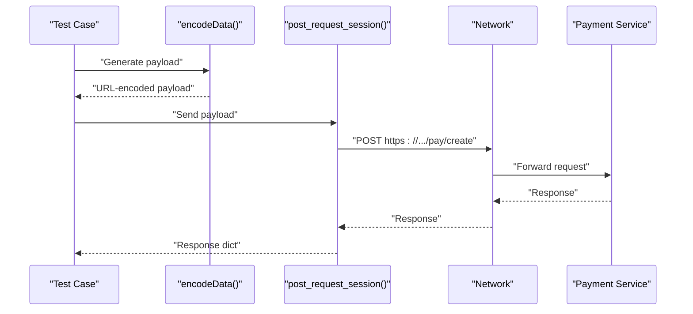
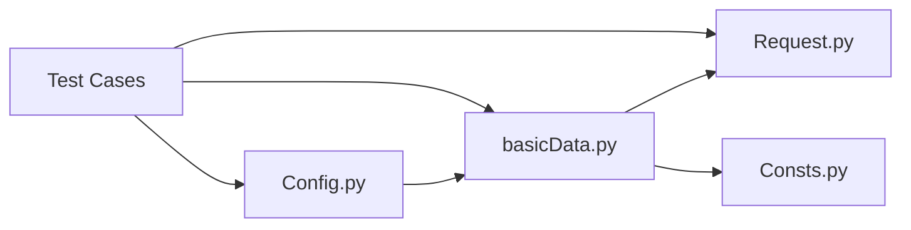

# Data Encoding and Factory Pattern

<cite>
**Referenced Files in This Document**
- [README.md](file://README.md)
- [common/basicData.py](file://common/basicData.py)
- [common/Request.py](file://common/Request.py)
- [common/Config.py](file://common/Config.py)
- [common/Consts.py](file://common/Consts.py)
- [case/test_pay_bean.py](file://case/test_pay_bean.py)
- [case/test_pay_shopBuy.py](file://case/test_pay_shopBuy.py)
- [case/test_pay_livePackage.py](file://case/test_pay_livePackage.py)
- [case/test_pay_coin.py](file://case/test_pay_coin.py)
- [case/test_pay_punish.py](file://case/test_pay_punish.py)
- [case/test_pay_customRate.py](file://case/test_pay_customRate.py)
- [case/test_pay_unionRoom.py](file://case/test_pay_unionRoom.py)
- [case/test_pay_vipRoom.py](file://case/test_pay_vipRoom.py)
</cite>

## Table of Contents
1. [Introduction](#introduction)
2. [Project Structure](#project-structure)
3. [Core Components](#core-components)
4. [Architecture Overview](#architecture-overview)
5. [Detailed Component Analysis](#detailed-component-analysis)
6. [Dependency Analysis](#dependency-analysis)
7. [Performance Considerations](#performance-considerations)
8. [Troubleshooting Guide](#troubleshooting-guide)
9. [Conclusion](#conclusion)
10. [Appendices](#appendices)

## Introduction
This document explains the data encoding factory pattern and payload generation system used to support 20+ payment scenarios across different platforms. It documents:
- The factory implementation that constructs platform-specific payloads for multiple payment scenarios
- Payload construction methods, parameter validation, and encoding standards
- Shared interfaces and extensibility mechanisms
- Examples of payload creation, scenario customization, and adding new scenarios
- Integration with request handling components

## Project Structure
The payment payload generation is centralized in a single module that exposes a family of encoding functions. Tests under the case directory demonstrate how payloads are constructed and sent via a unified request handler.

**Diagram sources**
- [common/basicData.py:1-581](file://common/basicData.py#L1-L581)
- [common/Request.py:1-162](file://common/Request.py#L1-L162)
- [common/Config.py:1-133](file://common/Config.py#L1-L133)
- [common/Consts.py:1-17](file://common/Consts.py#L1-L17)
- [case/test_pay_bean.py:1-188](file://case/test_pay_bean.py#L1-L188)
- [case/test_pay_shopBuy.py:1-124](file://case/test_pay_shopBuy.py#L1-L124)
- [case/test_pay_livePackage.py:1-248](file://case/test_pay_livePackage.py#L1-L248)
- [case/test_pay_coin.py:1-63](file://case/test_pay_coin.py#L1-L63)
- [case/test_pay_punish.py:1-42](file://case/test_pay_punish.py#L1-L42)
- [case/test_pay_customRate.py:1-172](file://case/test_pay_customRate.py#L1-L172)
- [case/test_pay_unionRoom.py:1-119](file://case/test_pay_unionRoom.py#L1-L119)
- [case/test_pay_vipRoom.py:1-90](file://case/test_pay_vipRoom.py#L1-L90)

**Section sources**
- [README.md:1-38](file://README.md#L1-L38)
- [common/basicData.py:1-581](file://common/basicData.py#L1-L581)
- [common/Request.py:1-162](file://common/Request.py#L1-L162)
- [common/Config.py:1-133](file://common/Config.py#L1-L133)
- [common/Consts.py:1-17](file://common/Consts.py#L1-L17)

## Core Components
- Payload factory: Centralized encoder that builds platform-specific payloads for multiple scenarios
- Request handler: Unified HTTP client wrapper for sending encoded payloads
- Configuration: Centralized endpoints and environment settings
- Constants: Global runtime constants used across tests and factories

Key responsibilities:
- Encode payloads for 20+ scenarios (e.g., package, chat-gift, shop-buy, defend, coin exchange, etc.)
- Apply platform defaults and versioning
- URL-encode payloads consistently
- Integrate with request handler and database checks in tests

**Section sources**
- [common/basicData.py:8-325](file://common/basicData.py#L8-L325)
- [common/Request.py:17-59](file://common/Request.py#L17-L59)
- [common/Config.py:47-55](file://common/Config.py#L47-L55)
- [common/Consts.py:1-17](file://common/Consts.py#L1-L17)

## Architecture Overview
The factory pattern is implemented as a set of conditional branches inside a single encoder function. Each branch corresponds to a payment scenario and produces a structured payload. The payload is then URL-encoded and sent via the request handler.

**Diagram sources**
- [common/basicData.py:8-325](file://common/basicData.py#L8-L325)
- [common/basicData.py:569-570](file://common/basicData.py#L569-L570)
- [common/Request.py:17-59](file://common/Request.py#L17-L59)

## Detailed Component Analysis

### Payload Factory: encodeData and encodePtData
- Purpose: Construct platform-specific payloads for multiple payment scenarios
- Scenarios covered:
  - Package-based payments (single, multiple recipients, exchange)
  - Chat gifts
  - Shop purchases (single item, multiple items, boxes)
  - Defenses (upgrade/break/activate)
  - Currency conversions (e.g., exchanging gold)
  - Overseas scenarios (PT) including special draw and card purchases
- Defaults and versioning:
  - Applies default values for optional fields (e.g., coins, guide visibility)
  - Sets a consistent version flag across scenarios
- Encoding:
  - Uses a helper to URL-encode payloads and normalize quotes

```mermaid
flowchart TD
Start(["Call encodeData(payType, ...)"]) --> Branch{"Select scenario"}
Branch --> |package| Pkg["Build package payload"]
Branch --> |package-more| PkgMore["Build multi-user package payload"]
Branch --> |package-exchange| PkgEx["Build exchange package payload"]
Branch --> |package-knightDefend| Def1["Build knight defend payload"]
Branch --> |package-radioDefend| Def2["Build radio defend payload"]
Branch --> |chat-gift| Chat["Build chat gift payload"]
Branch --> |shop-buy| Shop["Build shop buy payload"]
Branch --> |shop-buy-box| Box["Build shop box payload"]
Branch --> |defend| Def["Build defend payload"]
Branch --> |defend-upgrade| DefUp["Build defend upgrade payload"]
Branch --> |defend-break| DefBrk["Build defend break payload"]
Branch --> |title| Title["Build title payload"]
Branch --> |exchange_gold| Gold["Build gold exchange payload"]
Branch --> |unity-game-buy| Unity["Build unity game buy payload"]
Branch --> |pub-drink-buy| Pub["Build pub drink buy payload"]
Branch --> |deco-present| Deco["Build deco present payload"]
Branch --> |banban-consume| BB["Build banban consume payload"]
Branch --> |other| Other["Raise error"]
Pkg --> Encode["_encode_data_helper()"]
PkgMore --> Encode
PkgEx --> Encode
Def1 --> Encode
Def2 --> Encode
Chat --> Encode
Shop --> Encode
Box --> Encode
Def --> Encode
DefUp --> Encode
DefBrk --> Encode
Title --> Encode
Gold --> Encode
Unity --> Encode
Pub --> Encode
Deco --> Encode
BB --> Encode
Other --> EndErr["Error: invalid payType"]
Encode --> End(["Return URL-encoded payload"])
```

**Diagram sources**
- [common/basicData.py:8-325](file://common/basicData.py#L8-L325)
- [common/basicData.py:569-570](file://common/basicData.py#L569-L570)

**Section sources**
- [common/basicData.py:8-325](file://common/basicData.py#L8-L325)
- [common/basicData.py:569-570](file://common/basicData.py#L569-L570)

### Overseas Payload Factory: encodePtData
- Purpose: Provide PT (overseas) platform variants of payment scenarios
- Scenarios include package, chat-gift, shop-buy, shop-buy-box, coin shop-buy, exchange_gold, defend, and special PT actions (e.g., crazy spin, journey planet draw, chat-pay-card)
- Defaults and versioning mirror the domestic factory

**Section sources**
- [common/basicData.py:327-566](file://common/basicData.py#L327-L566)

### Request Handler Integration
- The unified request wrapper posts payloads to the configured payment endpoint
- Handles headers, SSL verification, and response parsing
- Returns structured response dictionaries for assertion in tests

**Diagram sources**
- [common/Request.py:17-59](file://common/Request.py#L17-L59)
- [common/Config.py:47-55](file://common/Config.py#L47-L55)

**Section sources**
- [common/Request.py:17-59](file://common/Request.py#L17-L59)
- [common/Config.py:47-55](file://common/Config.py#L47-L55)

### Test Integration and Validation
Tests demonstrate:
- How to construct payloads for various scenarios
- How to send requests and assert outcomes
- How to integrate with database checks for balances and transactions

Examples of usage across test files:
- Bean-based gift scenarios with insufficient/adequate bean balances
- Shop purchase and gift-to-user flows
- Live room and chat gift distributions with varying rates
- Coin exchange and coin gift scenarios
- Punishment flow triggered by payments
- Custom rate scenarios for guild brokers
- Union room and VIP room distributions
- Overseas PT scenarios (where applicable)

**Section sources**
- [case/test_pay_bean.py:37-158](file://case/test_pay_bean.py#L37-L158)
- [case/test_pay_shopBuy.py:21-123](file://case/test_pay_shopBuy.py#L21-L123)
- [case/test_pay_livePackage.py:20-247](file://case/test_pay_livePackage.py#L20-L247)
- [case/test_pay_coin.py:16-62](file://case/test_pay_coin.py#L16-L62)
- [case/test_pay_punish.py:16-41](file://case/test_pay_punish.py#L16-L41)
- [case/test_pay_customRate.py:23-171](file://case/test_pay_customRate.py#L23-L171)
- [case/test_pay_unionRoom.py:21-118](file://case/test_pay_unionRoom.py#L21-L118)
- [case/test_pay_vipRoom.py:18-89](file://case/test_pay_vipRoom.py#L18-L89)

## Dependency Analysis
- Factory depends on:
  - Configuration for default values and endpoints
  - Encoding helper for URL normalization
- Tests depend on:
  - Factory for payload construction
  - Request handler for sending requests
  - Database utilities for preconditions and assertions

**Diagram sources**
- [common/Config.py:1-133](file://common/Config.py#L1-L133)
- [common/basicData.py:1-581](file://common/basicData.py#L1-L581)
- [common/Request.py:1-162](file://common/Request.py#L1-L162)
- [common/Consts.py:1-17](file://common/Consts.py#L1-L17)

**Section sources**
- [common/Config.py:1-133](file://common/Config.py#L1-L133)
- [common/basicData.py:1-581](file://common/basicData.py#L1-L581)
- [common/Request.py:1-162](file://common/Request.py#L1-L162)
- [common/Consts.py:1-17](file://common/Consts.py#L1-L17)

## Performance Considerations
- Payload construction is lightweight and CPU-bound; negligible overhead
- Network latency dominates end-to-end performance; ensure efficient test orchestration
- URL encoding is performed once per payload; keep payload sizes reasonable
- Avoid redundant database reads/writes in tests to minimize test execution time

## Troubleshooting Guide
Common issues and resolutions:
- Invalid payType
  - Symptom: Error raised indicating invalid scenario
  - Resolution: Verify payType matches supported values
  - Reference: [common/basicData.py:323-325](file://common/basicData.py#L323-L325)
- Missing or incorrect parameters
  - Symptom: Payment rejected or unexpected balances
  - Resolution: Ensure required fields (money, uid, rid, giftId, etc.) are set appropriately
  - References:
    - [case/test_pay_bean.py:48-57](file://case/test_pay_bean.py#L48-L57)
    - [case/test_pay_shopBuy.py:32-42](file://case/test_pay_shopBuy.py#L32-L42)
- Encoding problems
  - Symptom: Malformed request body
  - Resolution: Use the provided encoder helper; avoid manual encoding
  - Reference: [common/basicData.py:569-570](file://common/basicData.py#L569-L570)
- SSL and network errors
  - Symptom: Request exceptions
  - Resolution: Disable SSL verification only in controlled environments; inspect returned status codes and bodies
  - Reference: [common/Request.py:35-59](file://common/Request.py#L35-L59)

**Section sources**
- [common/basicData.py:323-325](file://common/basicData.py#L323-L325)
- [common/basicData.py:569-570](file://common/basicData.py#L569-L570)
- [common/Request.py:35-59](file://common/Request.py#L35-L59)
- [case/test_pay_bean.py:48-57](file://case/test_pay_bean.py#L48-L57)
- [case/test_pay_shopBuy.py:32-42](file://case/test_pay_shopBuy.py#L32-L42)

## Conclusion
The payload generation system employs a straightforward factory pattern that centralizes encoding logic for 20+ payment scenarios. It provides:
- Clear separation between payload construction and HTTP transport
- Consistent defaults and encoding
- Extensible design for new scenarios
- Strong integration with tests for validation and database assertions

## Appendices

### Supported Scenarios (Domestic)
- package, package-more, package-exchange, package-knightDefend, package-radioDefend
- chat-gift
- shop-buy, shop-buy-box
- defend, defend-upgrade, defend-break
- title
- exchange_gold
- unity-game-buy
- pub-drink-buy
- deco-present
- banban-consume

**Section sources**
- [common/basicData.py:8-325](file://common/basicData.py#L8-L325)

### Supported Scenarios (Overseas - PT)
- package, package-more, package-exchange
- chat-gift
- shop-buy, shop-buy-box, coin-shop-buy
- exchange_gold, defend
- shop-buy-crazyspin, play-crazyspin
- journey_planet_draw
- chat-pay-card

**Section sources**
- [common/basicData.py:327-566](file://common/basicData.py#L327-L566)

### Example Workflows

#### Bean Gift with Insufficient Beans
- Construct payload for bean gift
- Send request and assert failure with appropriate message
- Verify balances remain unchanged

References:
- [case/test_pay_bean.py:37-57](file://case/test_pay_bean.py#L37-L57)

#### Shop Purchase and Gift Distribution
- Prepare shop-buy payload with quantity and commodity ID
- Send request and assert successful purchase
- Verify commodity count and balance adjustments

References:
- [case/test_pay_shopBuy.py:21-42](file://case/test_pay_shopBuy.py#L21-L42)

#### Live Room Chat Gift with Custom Rates
- Configure guild broker custom rate
- Send chat-gift payload
- Validate distribution split between streamer and broker

References:
- [case/test_pay_customRate.py:23-79](file://case/test_pay_customRate.py#L23-L79)

#### Punishment Flow Triggered by Payment
- Set up debtor account with debt
- Send payment payload
- Observe deduction order across accounts

References:
- [case/test_pay_punish.py:16-41](file://case/test_pay_punish.py#L16-L41)

#### Coin Exchange and Coin Gift
- Exchange money to gold coin
- Send coin gift payload
- Validate coin balances and VIP experience updates

References:
- [case/test_pay_coin.py:16-62](file://case/test_pay_coin.py#L16-L62)

#### Union Room Distribution
- Select union room RID
- Send package payload
- Validate guild share distribution

References:
- [case/test_pay_unionRoom.py:21-45](file://case/test_pay_unionRoom.py#L21-L45)

#### VIP Room Distribution
- Select VIP room RID
- Send package payload
- Validate personal charm distribution

References:
- [case/test_pay_vipRoom.py:18-39](file://case/test_pay_vipRoom.py#L18-L39)

### Extensibility Guide
To add a new scenario:
1. Extend the factory with a new payType branch
2. Define default parameters and versioning
3. Use the encoding helper to produce URL-encoded payloads
4. Add a test case invoking the new scenario
5. Integrate with the request handler and database checks as needed

References:
- [common/basicData.py:8-325](file://common/basicData.py#L8-L325)
- [common/basicData.py:569-570](file://common/basicData.py#L569-L570)
- [common/Request.py:17-59](file://common/Request.py#L17-L59)