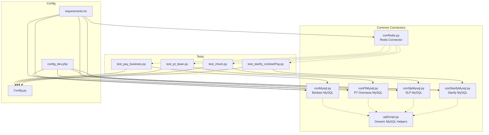
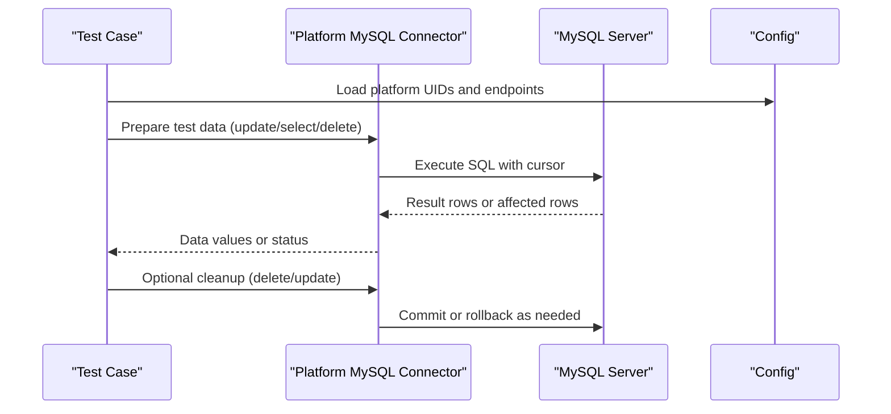
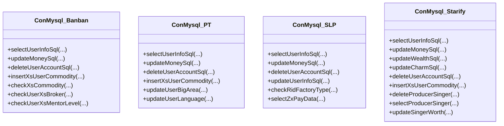
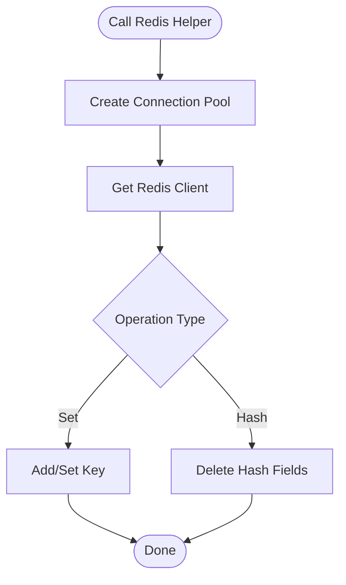
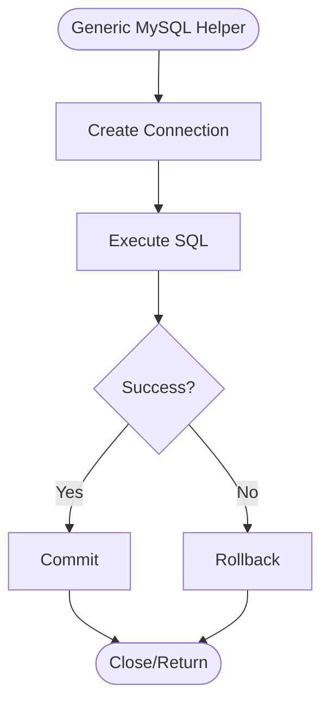
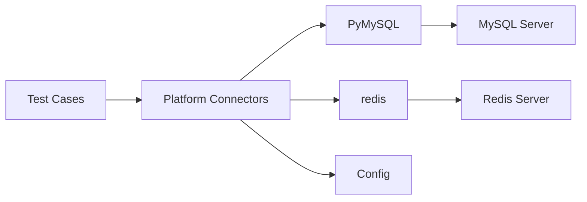
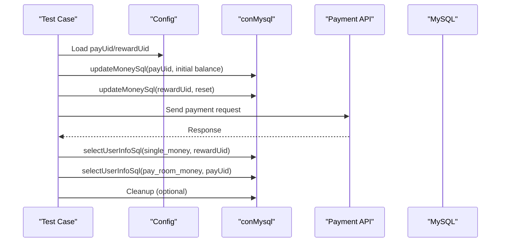
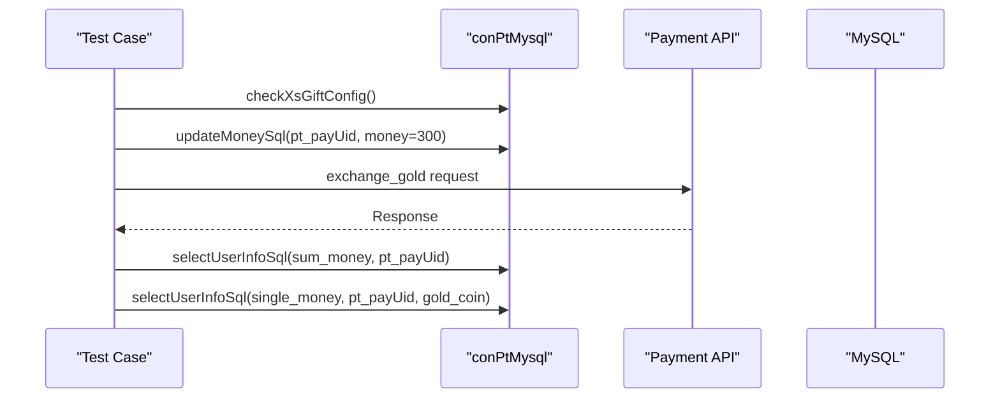
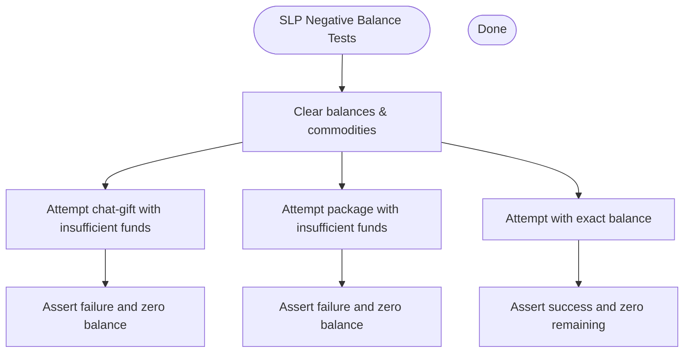
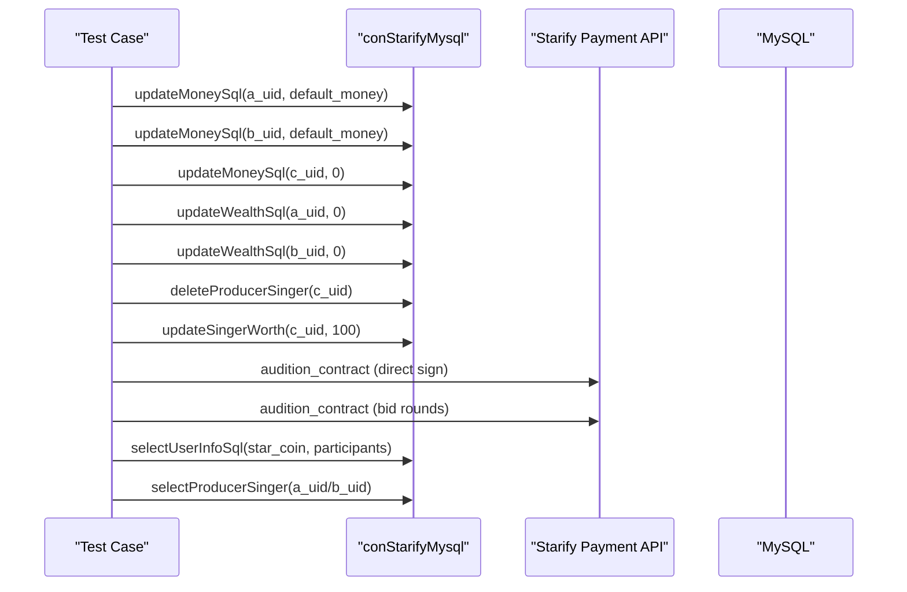

# Database Connectivity Layer

<cite>
**Referenced Files in This Document**
- [conMysql.py](file://common/conMysql.py)
- [conPtMysql.py](file://common/conPtMysql.py)
- [conSlpMysql.py](file://common/conSlpMysql.py)
- [conStarifyMysql.py](file://common/conStarifyMysql.py)
- [conRedis.py](file://common/conRedis.py)
- [Config.py](file://common/Config.py)
- [sqlScript.py](file://common/sqlScript.py)
- [test_pay_business.py](file://case/test_pay_business.py)
- [test_pt_bean.py](file://caseOversea/test_pt_bean.py)
- [test_check.py](file://caseSlp/test_check.py)
- [test_starify_contractPay.py](file://caseStarify/test_starify_contractPay.py)
- [requirements.txt](file://requirements.txt)
- [config_dev.php](file://others/config_dev.php)
</cite>

## Table of Contents
1. [Introduction](#introduction)
2. [Project Structure](#project-structure)
3. [Core Components](#core-components)
4. [Architecture Overview](#architecture-overview)
5. [Detailed Component Analysis](#detailed-component-analysis)
6. [Dependency Analysis](#dependency-analysis)
7. [Performance Considerations](#performance-considerations)
8. [Troubleshooting Guide](#troubleshooting-guide)
9. [Conclusion](#conclusion)
10. [Appendices](#appendices)

## Introduction
This document describes the database connectivity layer used by the test automation framework. It covers:
- MySQL connection management across multiple platforms (Banban, PT Overseas, Starify, SLP)
- Redis caching integration
- Transaction handling and rollback semantics
- Connection lifecycle and validation
- Multi-platform architecture and usage patterns
- Security, connection limits, and performance monitoring considerations

The layer is implemented via platform-specific connector classes that encapsulate database operations and provide a unified interface for tests to prepare and verify state.

## Project Structure
The database connectivity layer is organized under the common package with platform-specific connectors and shared utilities:
- Platform connectors: MySQL connectors for each platform
- Shared utilities: Redis connector and generic SQL helpers
- Tests: Example usage across platforms

**Diagram sources**
- [conMysql.py](file://common/conMysql.py)
- [conPtMysql.py](file://common/conPtMysql.py)
- [conSlpMysql.py](file://common/conSlpMysql.py)
- [conStarifyMysql.py](file://common/conStarifyMysql.py)
- [conRedis.py](file://common/conRedis.py)
- [sqlScript.py](file://common/sqlScript.py)
- [test_pay_business.py](file://case/test_pay_business.py)
- [test_pt_bean.py](file://caseOversea/test_pt_bean.py)
- [test_check.py](file://caseSlp/test_check.py)
- [test_starify_contractPay.py](file://caseStarify/test_starify_contractPay.py)
- [Config.py](file://common/Config.py)
- [requirements.txt](file://requirements.txt)
- [config_dev.php](file://others/config_dev.php)

**Section sources**
- [conMysql.py](file://common/conMysql.py)
- [conPtMysql.py](file://common/conPtMysql.py)
- [conSlpMysql.py](file://common/conSlpMysql.py)
- [conStarifyMysql.py](file://common/conStarifyMysql.py)
- [conRedis.py](file://common/conRedis.py)
- [sqlScript.py](file://common/sqlScript.py)
- [Config.py](file://common/Config.py)
- [requirements.txt](file://requirements.txt)
- [config_dev.php](file://others/config_dev.php)

## Core Components
- MySQL connectors per platform:
  - Banban: [conMysql.py](file://common/conMysql.py)
  - PT Overseas: [conPtMysql.py](file://common/conPtMysql.py)
  - SLP: [conSlpMysql.py](file://common/conSlpMysql.py)
  - Starify: [conStarifyMysql.py](file://common/conStarifyMysql.py)
- Shared utilities:
  - Generic MySQL helpers: [sqlScript.py](file://common/sqlScript.py)
  - Redis connector: [conRedis.py](file://common/conRedis.py)
- Configuration:
  - Test configuration constants and UIDs: [Config.py](file://common/Config.py)
  - Dependencies and libraries: [requirements.txt](file://requirements.txt)
  - Legacy PHP DB/Redis configs: [config_dev.php](file://others/config_dev.php)

Key capabilities:
- Select/update/delete operations for user balances, commodities, profiles, rooms, and platform-specific tables
- Transaction safety with explicit rollback and commit
- Connection validation via ping and database selection
- Redis connection pooling and key operations

**Section sources**
- [conMysql.py](file://common/conMysql.py)
- [conPtMysql.py](file://common/conPtMysql.py)
- [conSlpMysql.py](file://common/conSlpMysql.py)
- [conStarifyMysql.py](file://common/conStarifyMysql.py)
- [conRedis.py](file://common/conRedis.py)
- [sqlScript.py](file://common/sqlScript.py)
- [Config.py](file://common/Config.py)
- [requirements.txt](file://requirements.txt)
- [config_dev.php](file://others/config_dev.php)

## Architecture Overview
The connectivity layer follows a per-platform connector pattern with shared utilities:
- Each connector initializes a persistent connection and cursor
- Operations are exposed as static methods for convenience
- Transactions are handled explicitly with rollback/commit blocks
- Tests import platform connectors and configuration to orchestrate preconditions and verifications

**Diagram sources**
- [conMysql.py](file://common/conMysql.py)
- [conPtMysql.py](file://common/conPtMysql.py)
- [conSlpMysql.py](file://common/conSlpMysql.py)
- [conStarifyMysql.py](file://common/conStarifyMysql.py)
- [Config.py](file://common/Config.py)

## Detailed Component Analysis

### MySQL Connectors (Per Platform)
Each platform defines a connector class that:
- Stores credentials and target database
- Establishes a connection with autocommit enabled
- Selects the target database and validates connectivity
- Exposes static methods for common operations

**Diagram sources**
- [conMysql.py](file://common/conMysql.py)
- [conPtMysql.py](file://common/conPtMysql.py)
- [conSlpMysql.py](file://common/conSlpMysql.py)
- [conStarifyMysql.py](file://common/conStarifyMysql.py)

Operational highlights:
- Connection initialization and validation:
  - Autocommit enabled
  - Database selected
  - Ping with reconnect enabled
- Transaction handling:
  - Try-except blocks around DML statements
  - Explicit rollback on failure
  - Explicit commit on success
- Data access patterns:
  - Static methods accept platform-specific parameters (UIDs, money types, etc.)
  - Fetch-one/fetch-all helpers return normalized values or defaults

Usage examples in tests:
- Banban business room payments: [test_pay_business.py](file://case/test_pay_business.py)
- PT bean exchange: [test_pt_bean.py](file://caseOversea/test_pt_bean.py)
- SLP boundary checks: [test_check.py](file://caseSlp/test_check.py)
- Starify contract payments: [test_starify_contractPay.py](file://caseStarify/test_starify_contractPay.py)

**Section sources**
- [conMysql.py](file://common/conMysql.py)
- [conPtMysql.py](file://common/conPtMysql.py)
- [conSlpMysql.py](file://common/conSlpMysql.py)
- [conStarifyMysql.py](file://common/conStarifyMysql.py)
- [test_pay_business.py](file://case/test_pay_business.py)
- [test_pt_bean.py](file://caseOversea/test_pt_bean.py)
- [test_check.py](file://caseSlp/test_check.py)
- [test_starify_contractPay.py](file://caseStarify/test_starify_contractPay.py)

### Redis Connector
The Redis connector provides:
- Connection pool creation with configurable host/port
- Helper methods to manage sets and hash fields

**Diagram sources**
- [conRedis.py](file://common/conRedis.py)

**Section sources**
- [conRedis.py](file://common/conRedis.py)

### Generic MySQL Helpers
The generic helpers offer:
- Connection factory with host/user/password/db selection
- Common DML operations with explicit transaction control

**Diagram sources**
- [sqlScript.py](file://common/sqlScript.py)

**Section sources**
- [sqlScript.py](file://common/sqlScript.py)

## Dependency Analysis
External dependencies relevant to database connectivity:
- PyMySQL: MySQL driver
- redis: Redis client

**Diagram sources**
- [requirements.txt](file://requirements.txt)
- [conMysql.py](file://common/conMysql.py)
- [conPtMysql.py](file://common/conPtMysql.py)
- [conSlpMysql.py](file://common/conSlpMysql.py)
- [conStarifyMysql.py](file://common/conStarifyMysql.py)
- [conRedis.py](file://common/conRedis.py)
- [Config.py](file://common/Config.py)

**Section sources**
- [requirements.txt](file://requirements.txt)
- [conMysql.py](file://common/conMysql.py)
- [conPtMysql.py](file://common/conPtMysql.py)
- [conSlpMysql.py](file://common/conSlpMysql.py)
- [conStarifyMysql.py](file://common/conStarifyMysql.py)
- [conRedis.py](file://common/conRedis.py)
- [Config.py](file://common/Config.py)

## Performance Considerations
- Connection reuse: Each connector maintains a single persistent connection and cursor, reducing overhead.
- Autocommit behavior: Enabled at connection time; explicit commits occur after operations.
- Batch updates: Some connectors iterate over UIDs and issue multiple updates; consider batching or minimizing sleeps where present.
- Cursor usage: Dedicated cursors per connector; ensure proper resource handling.
- Network locality: Hosts are configured per platform; keep database connections local to reduce latency.

[No sources needed since this section provides general guidance]

## Troubleshooting Guide
Common issues and remedies:
- Connection failures
  - Verify host/port and credentials in connector configuration
  - Confirm database selection and connectivity via ping
- Transaction anomalies
  - Ensure rollback is invoked on exceptions and commit occurs otherwise
  - Check autocommit settings and explicit commit boundaries
- Data mismatches
  - Validate UID correctness from configuration
  - Confirm money-type parameters and table/column names per platform
- Redis connectivity
  - Confirm host/port and pool creation
  - Validate key operations (set/add vs hash/del)

**Section sources**
- [conMysql.py](file://common/conMysql.py)
- [conPtMysql.py](file://common/conPtMysql.py)
- [conSlpMysql.py](file://common/conSlpMysql.py)
- [conStarifyMysql.py](file://common/conStarifyMysql.py)
- [conRedis.py](file://common/conRedis.py)
- [Config.py](file://common/Config.py)

## Conclusion
The database connectivity layer provides a consistent, per-platform abstraction over MySQL and Redis, enabling reliable test data preparation and verification. Each connector encapsulates connection lifecycle, transaction control, and platform-specific operations, while shared utilities support common patterns. Adhering to explicit rollback/commit semantics and validating connections ensures robustness across Banban, PT Overseas, Starify, and SLP environments.

[No sources needed since this section summarizes without analyzing specific files]

## Appendices

### Example Workflows

#### Banban Business Room Payments

**Diagram sources**
- [test_pay_business.py](file://case/test_pay_business.py)
- [conMysql.py](file://common/conMysql.py)
- [Config.py](file://common/Config.py)

**Section sources**
- [test_pay_business.py](file://case/test_pay_business.py)
- [conMysql.py](file://common/conMysql.py)
- [Config.py](file://common/Config.py)

#### PT Bean Exchange

**Diagram sources**
- [test_pt_bean.py](file://caseOversea/test_pt_bean.py)
- [conPtMysql.py](file://common/conPtMysql.py)
- [Config.py](file://common/Config.py)

**Section sources**
- [test_pt_bean.py](file://caseOversea/test_pt_bean.py)
- [conPtMysql.py](file://common/conPtMysql.py)
- [Config.py](file://common/Config.py)

#### SLP Boundary Checks

**Diagram sources**
- [test_check.py](file://caseSlp/test_check.py)
- [conSlpMysql.py](file://common/conSlpMysql.py)
- [Config.py](file://common/Config.py)

**Section sources**
- [test_check.py](file://caseSlp/test_check.py)
- [conSlpMysql.py](file://common/conSlpMysql.py)
- [Config.py](file://common/Config.py)

#### Starify Contract Payments

**Diagram sources**
- [test_starify_contractPay.py](file://caseStarify/test_starify_contractPay.py)
- [conStarifyMysql.py](file://common/conStarifyMysql.py)
- [Config.py](file://common/Config.py)

**Section sources**
- [test_starify_contractPay.py](file://caseStarify/test_starify_contractPay.py)
- [conStarifyMysql.py](file://common/conStarifyMysql.py)
- [Config.py](file://common/Config.py)

### Security and Operational Notes
- Credentials: Stored in connector configuration; avoid hardcoding secrets in tests.
- Connection limits: Single persistent connection per connector; scale horizontally by using multiple connector instances or external pooling where needed.
- Validation: Use ping and database selection during initialization.
- Monitoring: Track operation latencies and error rates at the test harness level; consider adding metrics hooks around connector methods.

[No sources needed since this section provides general guidance]