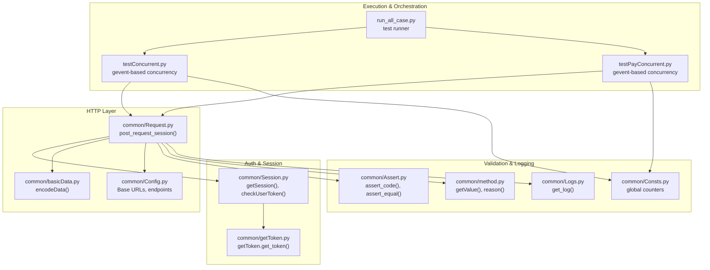
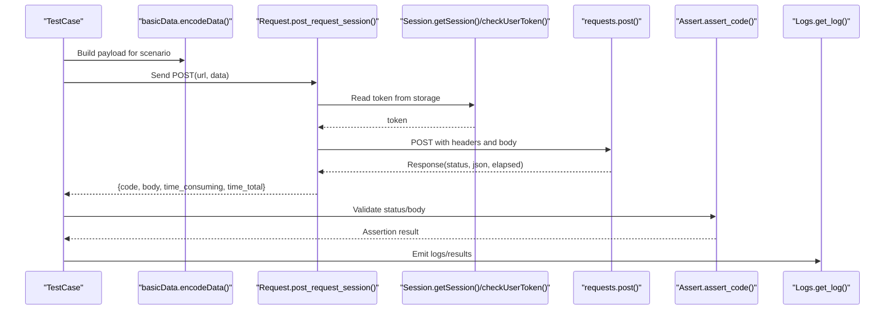
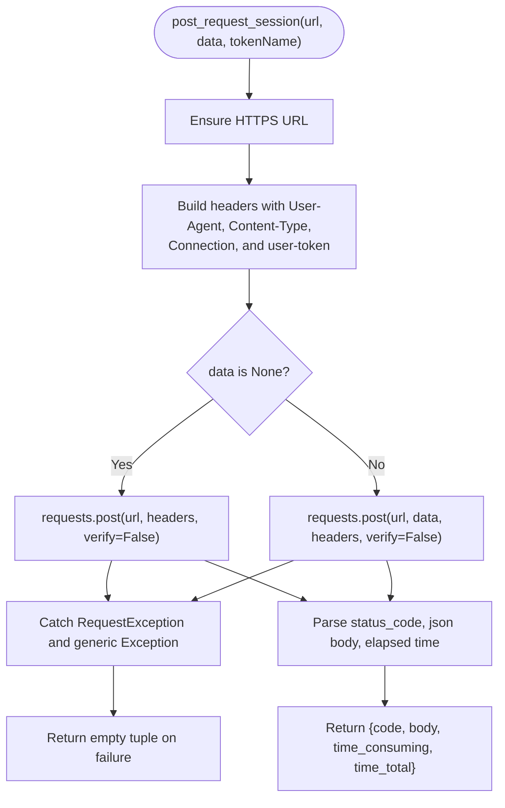
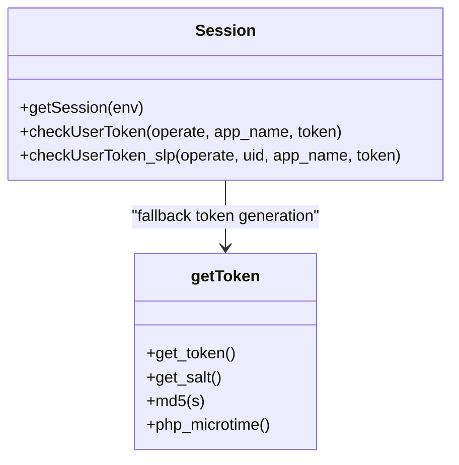
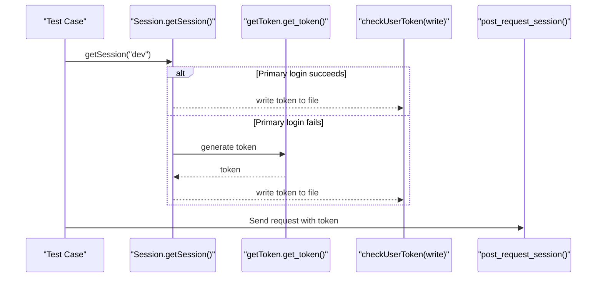
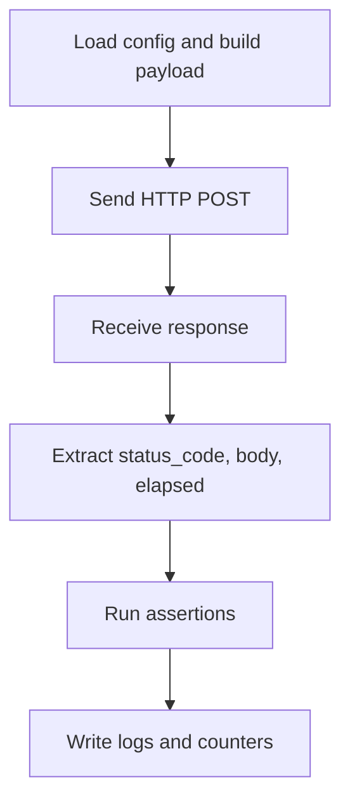
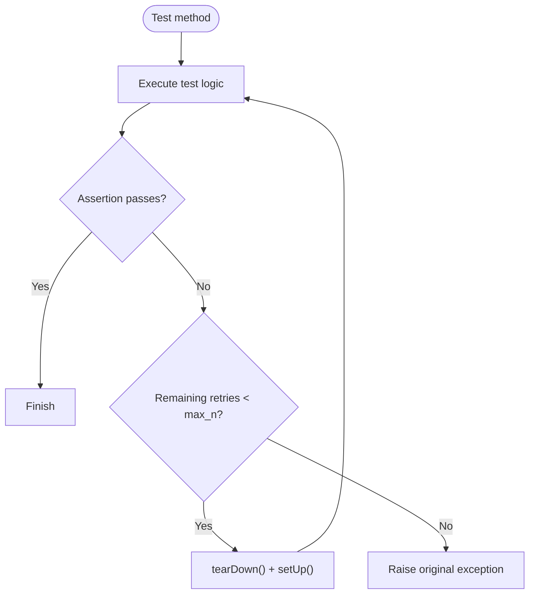
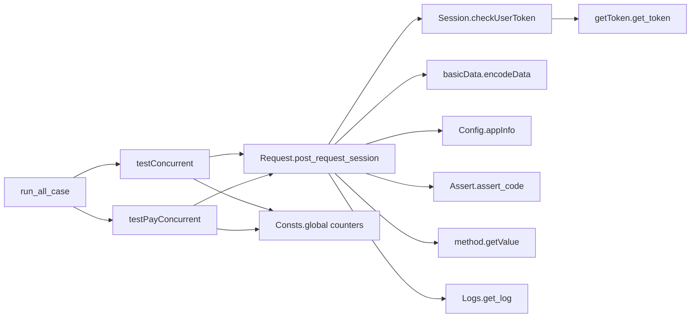

# HTTP Request Handling Architecture

<cite>
**Referenced Files in This Document**
- [common/Request.py](file://common/Request.py)
- [common/Session.py](file://common/Session.py)
- [common/getToken.py](file://common/getToken.py)
- [common/basicData.py](file://common/basicData.py)
- [common/Config.py](file://common/Config.py)
- [common/Logs.py](file://common/Logs.py)
- [common/Assert.py](file://common/Assert.py)
- [common/method.py](file://common/method.py)
- [common/Consts.py](file://common/Consts.py)
- [testConcurrent.py](file://testConcurrent.py)
- [testPayConcurrent.py](file://testPayConcurrent.py)
- [run_all_case.py](file://run_all_case.py)
- [case/test_pay_business.py](file://case/test_pay_business.py)
</cite>

## Table of Contents
1. [Introduction](#introduction)
2. [Project Structure](#project-structure)
3. [Core Components](#core-components)
4. [Architecture Overview](#architecture-overview)
5. [Detailed Component Analysis](#detailed-component-analysis)
6. [Dependency Analysis](#dependency-analysis)
7. [Performance Considerations](#performance-considerations)
8. [Troubleshooting Guide](#troubleshooting-guide)
9. [Conclusion](#conclusion)
10. [Appendices](#appendices)

## Introduction
This document describes the HTTP request handling architecture used for payment and commerce operations across multiple platforms. It explains how requests are constructed, wrapped, and executed; how sessions and tokens are managed; and how authentication and authorization are handled. It also covers the request lifecycle from initialization to response processing, including retry logic, timeout handling, error management, concurrency, and performance optimization techniques.

## Project Structure
The HTTP request handling architecture is centered around a small set of modules:
- Request wrapper and execution
- Session and token management
- Token generation utilities
- Data encoding helpers
- Configuration and logging
- Concurrency orchestration
- Assertions and result evaluation

**Diagram sources**
- [common/Request.py:17-59](file://common/Request.py#L17-L59)
- [common/Session.py:19-166](file://common/Session.py#L19-L166)
- [common/getToken.py:19-63](file://common/getToken.py#L19-L63)
- [common/basicData.py:9-325](file://common/basicData.py#L9-L325)
- [common/Config.py:9-55](file://common/Config.py#L9-L55)
- [testConcurrent.py:17-88](file://testConcurrent.py#L17-L88)
- [testPayConcurrent.py:9-42](file://testPayConcurrent.py#L9-L42)
- [run_all_case.py:12-147](file://run_all_case.py#L12-L147)
- [common/Assert.py:11-48](file://common/Assert.py#L11-L48)
- [common/method.py:94-122](file://common/method.py#L94-L122)
- [common/Logs.py:8-47](file://common/Logs.py#L8-L47)
- [common/Consts.py:4-17](file://common/Consts.py#L4-L17)

**Section sources**
- [common/Request.py:17-59](file://common/Request.py#L17-L59)
- [common/Session.py:19-166](file://common/Session.py#L19-L166)
- [common/getToken.py:19-63](file://common/getToken.py#L19-L63)
- [common/basicData.py:9-325](file://common/basicData.py#L9-L325)
- [common/Config.py:9-55](file://common/Config.py#L9-L55)
- [testConcurrent.py:17-88](file://testConcurrent.py#L17-L88)
- [testPayConcurrent.py:9-42](file://testPayConcurrent.py#L9-L42)
- [run_all_case.py:12-147](file://run_all_case.py#L12-L147)
- [common/Assert.py:11-48](file://common/Assert.py#L11-L48)
- [common/method.py:94-122](file://common/method.py#L94-L122)
- [common/Logs.py:8-47](file://common/Logs.py#L8-L47)
- [common/Consts.py:4-17](file://common/Consts.py#L4-L17)

## Core Components
- Request wrapper: encapsulates HTTP POST construction, header assembly, SSL verification toggling, and response parsing into a normalized dictionary.
- Session manager: obtains platform-specific tokens via login flows, with fallback to generated tokens.
- Token generator: produces platform-appropriate tokens using deterministic signing and encryption routines.
- Data encoder: builds standardized request payloads for various commerce scenarios.
- Concurrency orchestrator: executes tests concurrently using cooperative threading.
- Validation and logging: standardized assertions and logging facilities.

**Section sources**
- [common/Request.py:17-59](file://common/Request.py#L17-L59)
- [common/Session.py:19-166](file://common/Session.py#L19-L166)
- [common/getToken.py:19-63](file://common/getToken.py#L19-L63)
- [common/basicData.py:9-325](file://common/basicData.py#L9-L325)
- [testConcurrent.py:17-88](file://testConcurrent.py#L17-L88)
- [testPayConcurrent.py:9-42](file://testPayConcurrent.py#L9-L42)
- [common/Assert.py:11-48](file://common/Assert.py#L11-L48)
- [common/Logs.py:8-47](file://common/Logs.py#L8-L47)

## Architecture Overview
The request lifecycle follows a predictable flow:
1. Configuration resolution: base URLs and endpoints are loaded from configuration.
2. Payload construction: request parameters are encoded into a standardized form.
3. Authentication: a valid token is injected into the request header.
4. Execution: the HTTP request is sent and response is captured.
5. Parsing: response status, JSON body, and timing metrics are extracted.
6. Validation: assertions compare outcomes against expectations.
7. Logging and reporting: logs are emitted and global counters are updated.

**Diagram sources**
- [common/basicData.py:9-325](file://common/basicData.py#L9-L325)
- [common/Request.py:17-59](file://common/Request.py#L17-L59)
- [common/Session.py:19-166](file://common/Session.py#L19-L166)
- [common/Assert.py:11-48](file://common/Assert.py#L11-L48)
- [common/Logs.py:8-47](file://common/Logs.py#L8-L47)

## Detailed Component Analysis

### Request Wrapper Implementation
The wrapper centralizes HTTP POST execution:
- Header composition includes platform-specific User-Agent, Content-Type, connection policy, and user-token.
- Token sourcing is delegated to the session manager.
- URL normalization ensures HTTPS scheme.
- Robust exception handling returns a normalized dictionary with status code, parsed JSON body, and timing metrics.

**Diagram sources**
- [common/Request.py:17-59](file://common/Request.py#L17-L59)

**Section sources**
- [common/Request.py:17-59](file://common/Request.py#L17-L59)

### Session Management and Token Handling
The session manager supports multiple environments and platforms:
- Environment-driven login flows fetch tokens via platform-specific endpoints.
- Fallback mechanism generates tokens using deterministic signing when primary login fails.
- Token persistence is file-based per environment/app name.

**Diagram sources**
- [common/Session.py:19-166](file://common/Session.py#L19-L166)
- [common/getToken.py:19-63](file://common/getToken.py#L19-L63)

**Section sources**
- [common/Session.py:19-166](file://common/Session.py#L19-L166)
- [common/getToken.py:19-63](file://common/getToken.py#L19-L63)

### Authentication Mechanisms
- Token injection: user-token is placed in the request header for each outbound request.
- Multi-platform support: environment-specific login flows and token storage strategies.
- Fallback strategy: when primary login fails, a generated token is used.

**Diagram sources**
- [common/Session.py:44-67](file://common/Session.py#L44-L67)
- [common/getToken.py:19-63](file://common/getToken.py#L19-L63)
- [common/Session.py:168-182](file://common/Session.py#L168-L182)

**Section sources**
- [common/Session.py:44-67](file://common/Session.py#L44-L67)
- [common/getToken.py:19-63](file://common/getToken.py#L19-L63)
- [common/Session.py:168-182](file://common/Session.py#L168-L182)

### Request Lifecycle: Initialization to Response Processing
- Initialization: configuration loads base URLs and endpoints; payload encoding resolves parameters.
- Execution: request wrapper sends POST with headers and body; SSL verification is disabled for convenience.
- Response processing: status code, JSON body, and timing metrics are captured and returned.
- Validation: assertions enforce expected outcomes; logs record results.

**Diagram sources**
- [common/Config.py:9-55](file://common/Config.py#L9-L55)
- [common/basicData.py:9-325](file://common/basicData.py#L9-L325)
- [common/Request.py:17-59](file://common/Request.py#L17-L59)
- [common/Assert.py:11-48](file://common/Assert.py#L11-L48)
- [common/Logs.py:8-47](file://common/Logs.py#L8-L47)

**Section sources**
- [common/Config.py:9-55](file://common/Config.py#L9-L55)
- [common/basicData.py:9-325](file://common/basicData.py#L9-L325)
- [common/Request.py:17-59](file://common/Request.py#L17-L59)
- [common/Assert.py:11-48](file://common/Assert.py#L11-L48)
- [common/Logs.py:8-47](file://common/Logs.py#L8-L47)

### Retry Logic and Timeout Handling
- Retry decorator: transparently retries failing test methods up to a configurable number of times, re-invoking setUp/tearDown between attempts.
- Timeout handling: explicit timeouts are not configured in the current request wrapper; network-level timeouts would require extending the wrapper.

**Diagram sources**
- [common/runFailed.py:57-78](file://common/runFailed.py#L57-L78)

**Section sources**
- [common/runFailed.py:57-78](file://common/runFailed.py#L57-L78)

### Error Management Patterns
- Request wrapper: broad exception catching returns an empty tuple on failure; caller should check return value.
- Logging: centralized logging facility supports rotating file handlers and console output.
- Assertions: standardized assertion helpers raise exceptions with descriptive messages on mismatch.

**Section sources**
- [common/Request.py:40-45](file://common/Request.py#L40-L45)
- [common/Logs.py:8-47](file://common/Logs.py#L8-L47)
- [common/Assert.py:11-48](file://common/Assert.py#L11-L48)

### Session Persistence System
- File-based persistence: tokens are stored in environment-specific files under the session module path.
- Per-user persistence: separate token files keyed by user identifiers for certain platforms.
- Read/write operations ensure files exist and are flushed immediately after writes.

**Section sources**
- [common/Session.py:168-200](file://common/Session.py#L168-L200)

### Token Refresh Mechanisms
- On-demand refresh: tests trigger session retrieval prior to sending requests.
- Fallback refresh: when primary login fails, a generated token is written to storage and reused.

**Section sources**
- [common/Session.py:60-67](file://common/Session.py#L60-L67)
- [common/Session.py:157-162](file://common/Session.py#L157-L162)

### Multi-Platform Authentication Strategies
- Platform-specific login flows: distinct endpoints and parameters per environment/app.
- Shared token injection: regardless of platform, the token is injected into the same header field.

**Section sources**
- [common/Session.py:44-67](file://common/Session.py#L44-L67)
- [common/Session.py:88-104](file://common/Session.py#L88-L104)
- [common/Session.py:139-162](file://common/Session.py#L139-L162)

### Examples: Request Construction, Response Parsing, Error Handling
- Request construction: payload encoding for “package” purchases and “chat-gift” scenarios.
- Response parsing: wrapper returns structured results including status, body, and timing.
- Error handling: exceptions caught and logged; assertions validate outcomes.

**Section sources**
- [common/basicData.py:9-325](file://common/basicData.py#L9-L325)
- [common/Request.py:17-59](file://common/Request.py#L17-L59)
- [common/Assert.py:11-48](file://common/Assert.py#L11-L48)
- [common/method.py:94-122](file://common/method.py#L94-L122)

### Concurrent Request Handling, Connection Pooling, and Performance Optimization
- Concurrency: gevent-based cooperative threading spawns multiple requests concurrently.
- Connection pooling: requests library maintains a default pool; explicit pool configuration is not present.
- Performance optimization: disable SSL verification reduces overhead; payload encoding minimizes request size; centralized logging avoids excessive I/O.

**Section sources**
- [testConcurrent.py:30-35](file://testConcurrent.py#L30-L35)
- [testPayConcurrent.py:30-35](file://testPayConcurrent.py#L30-L35)
- [common/Request.py:25-31](file://common/Request.py#L25-L31)
- [common/basicData.py:569-570](file://common/basicData.py#L569-L570)

## Dependency Analysis
The following diagram shows key dependencies among modules involved in HTTP request handling.

**Diagram sources**
- [common/Request.py:17-59](file://common/Request.py#L17-L59)
- [common/Session.py:168-182](file://common/Session.py#L168-L182)
- [common/basicData.py:9-325](file://common/basicData.py#L9-L325)
- [common/Config.py:9-55](file://common/Config.py#L9-L55)
- [common/getToken.py:19-63](file://common/getToken.py#L19-L63)
- [testConcurrent.py:17-88](file://testConcurrent.py#L17-L88)
- [testPayConcurrent.py:9-42](file://testPayConcurrent.py#L9-L42)
- [run_all_case.py:12-147](file://run_all_case.py#L12-L147)
- [common/Assert.py:11-48](file://common/Assert.py#L11-L48)
- [common/method.py:94-122](file://common/method.py#L94-L122)
- [common/Logs.py:8-47](file://common/Logs.py#L8-L47)
- [common/Consts.py:4-17](file://common/Consts.py#L4-L17)

**Section sources**
- [common/Request.py:17-59](file://common/Request.py#L17-L59)
- [common/Session.py:168-182](file://common/Session.py#L168-L182)
- [common/basicData.py:9-325](file://common/basicData.py#L9-L325)
- [common/Config.py:9-55](file://common/Config.py#L9-L55)
- [common/getToken.py:19-63](file://common/getToken.py#L19-L63)
- [testConcurrent.py:17-88](file://testConcurrent.py#L17-L88)
- [testPayConcurrent.py:9-42](file://testPayConcurrent.py#L9-L42)
- [run_all_case.py:12-147](file://run_all_case.py#L12-L147)
- [common/Assert.py:11-48](file://common/Assert.py#L11-L48)
- [common/method.py:94-122](file://common/method.py#L94-L122)
- [common/Logs.py:8-47](file://common/Logs.py#L8-L47)
- [common/Consts.py:4-17](file://common/Consts.py#L4-L17)

## Performance Considerations
- Disable SSL verification: reduces TLS overhead but lowers security; acceptable for internal/dev environments.
- Payload size: URL-encoded payloads are compact; avoid unnecessary fields.
- Logging frequency: rotating logs minimize disk contention; consider batching or reducing verbosity in heavy load.
- Concurrency model: gevent cooperative threading reduces context switching overhead compared to OS threads.
- Connection reuse: requests defaults maintain keep-alive; explicit pool tuning is not implemented.

[No sources needed since this section provides general guidance]

## Troubleshooting Guide
- Empty response or malformed JSON: verify URL scheme normalization and ensure HTTPS endpoint availability.
- Missing token: confirm session retrieval runs before request execution and that token files exist and are readable.
- Assertion failures: use standardized assertion helpers and logging to capture detailed failure reasons.
- Network errors: catch and log exceptions; consider adding retry logic at the wrapper level.

**Section sources**
- [common/Request.py:33-34](file://common/Request.py#L33-L34)
- [common/Session.py:168-182](file://common/Session.py#L168-L182)
- [common/Assert.py:11-48](file://common/Assert.py#L11-L48)
- [common/Logs.py:8-47](file://common/Logs.py#L8-L47)

## Conclusion
The HTTP request handling architecture provides a concise, extensible foundation for payment operations across multiple platforms. It centralizes request construction, authentication, and response processing while supporting concurrency and robust error handling. Extending the wrapper with explicit timeouts and connection pooling would further improve reliability and performance.

[No sources needed since this section summarizes without analyzing specific files]

## Appendices
- Example test usage demonstrates how requests are built, executed, validated, and logged.

**Section sources**
- [case/test_pay_business.py:35-46](file://case/test_pay_business.py#L35-L46)
- [run_all_case.py:12-147](file://run_all_case.py#L12-L147)