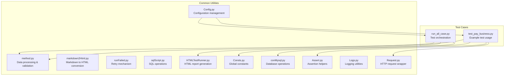
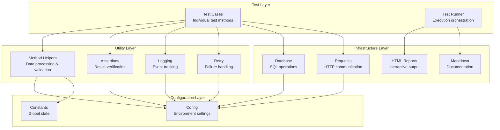
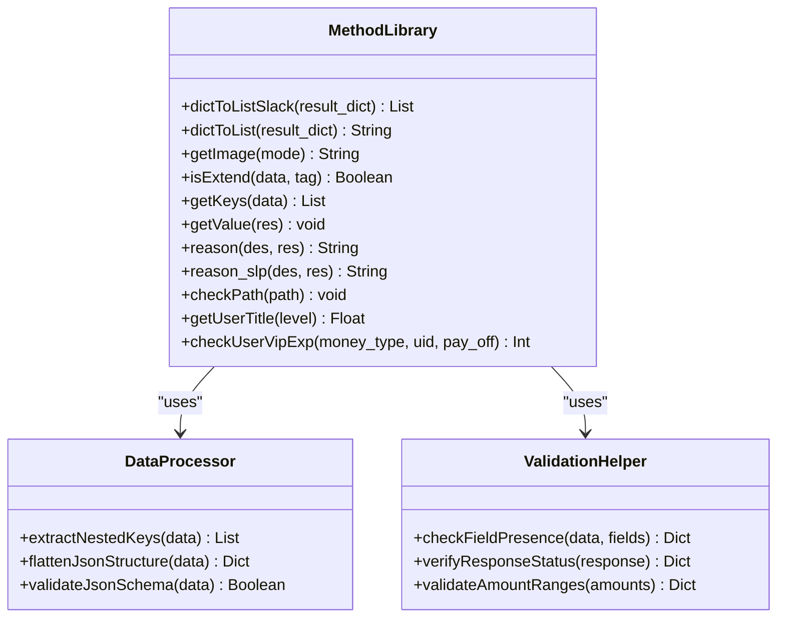
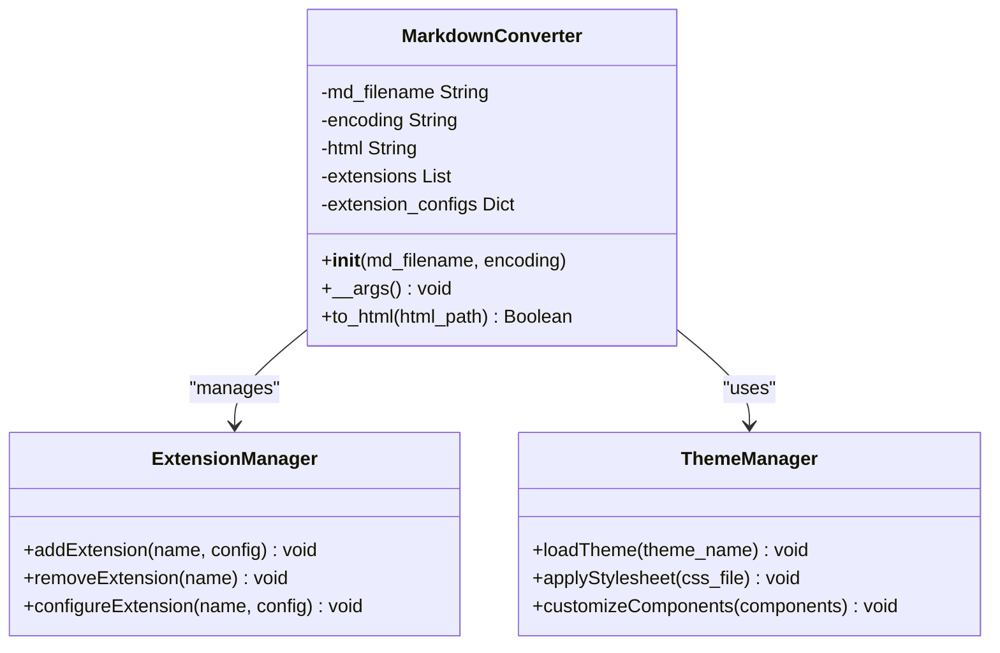
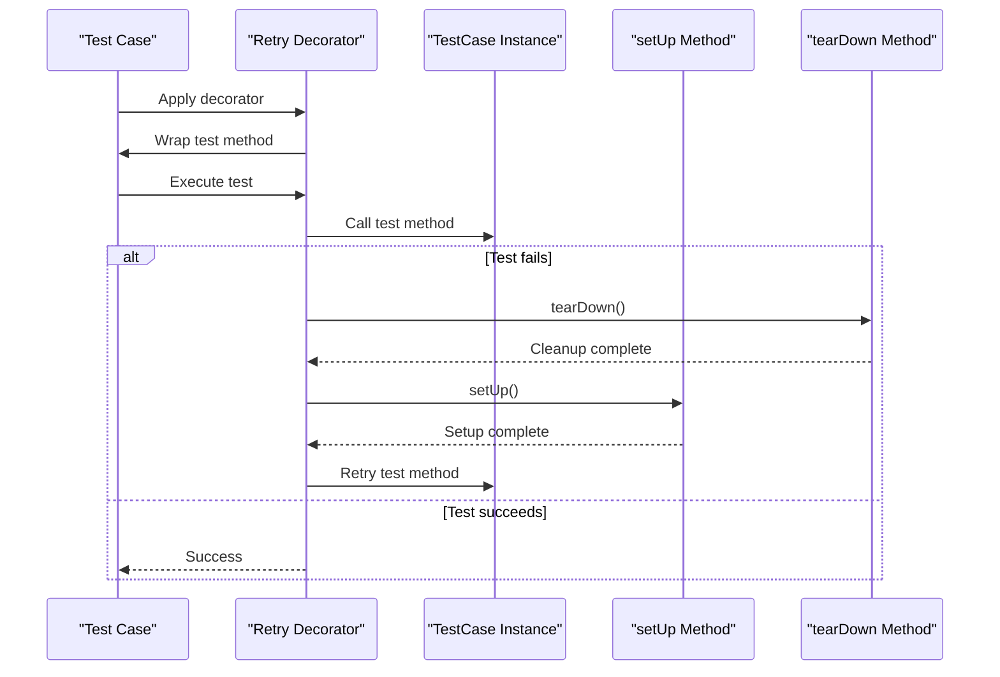
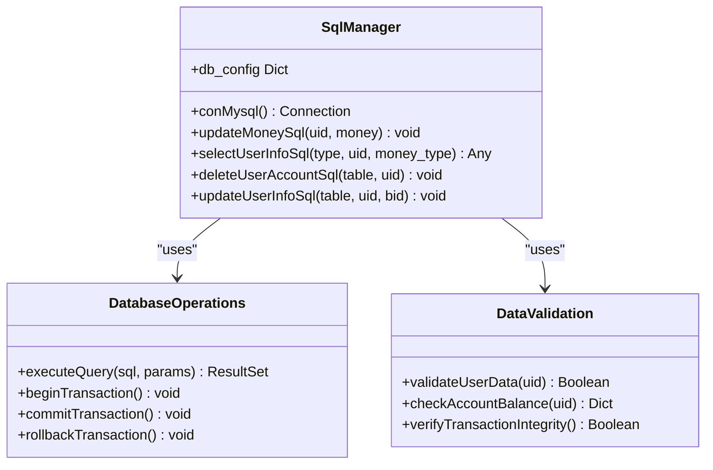
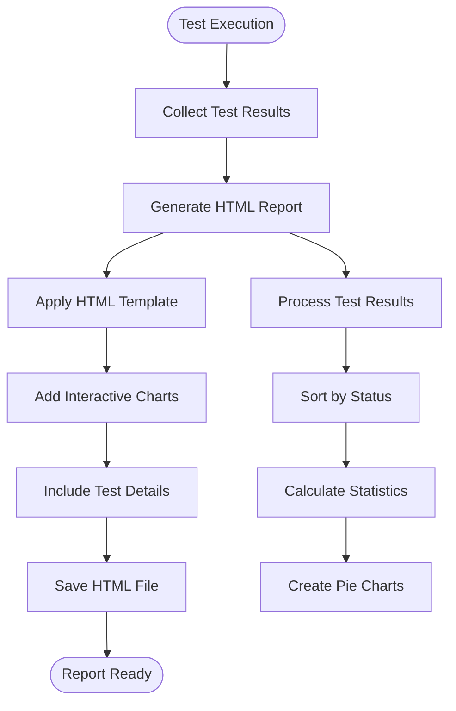
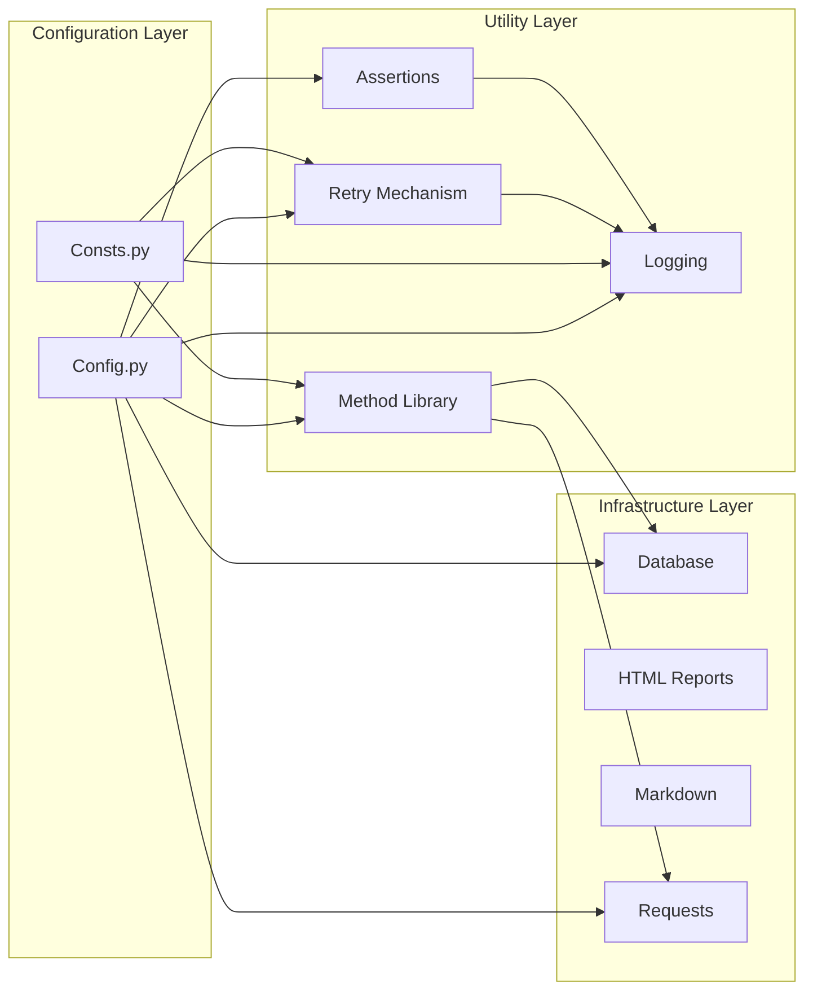
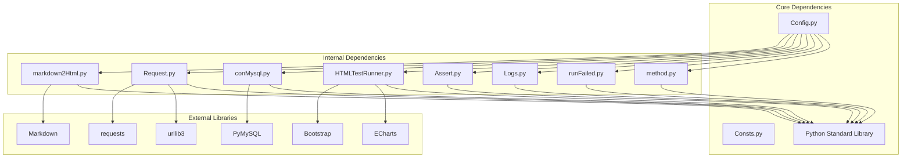

# Utility Functions and Helper Classes

<cite>
**Referenced Files in This Document**
- [method.py](file://common/method.py)
- [markdown2Html.py](file://common/markdown2Html.py)
- [runFailed.py](file://common/runFailed.py)
- [sqlScript.py](file://common/sqlScript.py)
- [HTMLTestRunner.py](file://common/HTMLTestRunner.py)
- [Config.py](file://common/Config.py)
- [Consts.py](file://common/Consts.py)
- [conMysql.py](file://common/conMysql.py)
- [Assert.py](file://common/Assert.py)
- [Logs.py](file://common/Logs.py)
- [Request.py](file://common/Request.py)
- [test_pay_business.py](file://case/test_pay_business.py)
- [run_all_case.py](file://run_all_case.py)
</cite>

## Table of Contents
1. [Introduction](#introduction)
2. [Project Structure](#project-structure)
3. [Core Components](#core-components)
4. [Architecture Overview](#architecture-overview)
5. [Detailed Component Analysis](#detailed-component-analysis)
6. [Dependency Analysis](#dependency-analysis)
7. [Performance Considerations](#performance-considerations)
8. [Troubleshooting Guide](#troubleshooting-guide)
9. [Conclusion](#conclusion)

## Introduction
This document provides comprehensive documentation for the utility functions and helper classes that form the foundation of the testing framework. It covers method libraries for data processing and validation, markdown-to-HTML conversion utilities, test report generation, SQL script management, failed test handling mechanisms, HTML test runner integration, and script execution utilities. The guide includes practical usage examples, custom function development patterns, integration guidelines, performance considerations, error handling strategies, and extensibility recommendations.

## Project Structure
The utility framework is organized primarily under the `common` directory, with test cases located in dedicated folders (`case`, `caseOversea`, `caseSlp`). The core utilities include:
- Method library for data transformation and validation
- Markdown-to-HTML converter with extensive extensions
- Retry mechanism for failed test cases
- SQL script manager for database operations
- HTML test runner for generating interactive reports
- Configuration and constants management
- Logging and assertion helpers
- HTTP request wrapper

**Diagram sources**
- [method.py:1-171](file://common/method.py#L1-L171)
- [markdown2Html.py:1-116](file://common/markdown2Html.py#L1-L116)
- [runFailed.py:1-87](file://common/runFailed.py#L1-L87)
- [sqlScript.py:1-145](file://common/sqlScript.py#L1-L145)
- [HTMLTestRunner.py:1-705](file://common/HTMLTestRunner.py#L1-L705)
- [Config.py:1-133](file://common/Config.py#L1-L133)
- [Consts.py:1-17](file://common/Consts.py#L1-L17)
- [conMysql.py:1-530](file://common/conMysql.py#L1-L530)
- [Assert.py:1-96](file://common/Assert.py#L1-L96)
- [Logs.py:1-48](file://common/Logs.py#L1-L48)
- [Request.py:1-162](file://common/Request.py#L1-L162)
- [test_pay_business.py:1-189](file://case/test_pay_business.py#L1-L189)
- [run_all_case.py:1-159](file://run_all_case.py#L1-L159)

**Section sources**
- [method.py:1-171](file://common/method.py#L1-L171)
- [markdown2Html.py:1-116](file://common/markdown2Html.py#L1-L116)
- [runFailed.py:1-87](file://common/runFailed.py#L1-L87)
- [sqlScript.py:1-145](file://common/sqlScript.py#L1-L145)
- [HTMLTestRunner.py:1-705](file://common/HTMLTestRunner.py#L1-L705)
- [Config.py:1-133](file://common/Config.py#L1-L133)
- [Consts.py:1-17](file://common/Consts.py#L1-L17)
- [conMysql.py:1-530](file://common/conMysql.py#L1-L530)
- [Assert.py:1-96](file://common/Assert.py#L1-L96)
- [Logs.py:1-48](file://common/Logs.py#L1-L48)
- [Request.py:1-162](file://common/Request.py#L1-L162)
- [test_pay_business.py:1-189](file://case/test_pay_business.py#L1-L189)
- [run_all_case.py:1-159](file://run_all_case.py#L1-L159)

## Core Components
The utility framework consists of several interconnected components that work together to support automated testing:

### Method Library
The method library provides essential functions for data processing, validation, and reporting:
- JSON traversal and key extraction utilities
- Image fetching capabilities
- Result validation and failure reason generation
- VIP experience calculation
- Slack message formatting

### Markdown-to-HTML Converter
A robust markdown processor with extensive extensions for creating interactive documentation:
- Comprehensive markdown parsing with syntax highlighting
- Mathematical notation support
- Task lists and checklists
- Mermaid diagram rendering
- Custom CSS and JavaScript integration

### Retry Mechanism
A flexible retry decorator for handling transient failures:
- Class and function decorators
- Configurable retry counts
- Automatic test setup/teardown during retries
- Exception logging and traceback capture

### SQL Script Manager
Database operation utilities with comprehensive CRUD operations:
- Connection pooling and configuration
- Account balance management
- Inventory and commodity tracking
- User profile and relationship management
- Transaction rollback and commit handling

### HTML Test Runner
An enhanced test runner that generates interactive HTML reports:
- Bootstrap-based responsive design
- Interactive pie charts for test statistics
- Expandable test result details
- JavaScript-powered filtering and sorting
- Comprehensive test execution tracking

### Configuration and Constants
Centralized configuration management and global constants:
- Multi-environment configuration
- User and role definitions
- Gift and room configurations
- Global counters and timing metrics

**Section sources**
- [method.py:11-171](file://common/method.py#L11-L171)
- [markdown2Html.py:15-106](file://common/markdown2Html.py#L15-L106)
- [runFailed.py:10-86](file://common/runFailed.py#L10-L86)
- [sqlScript.py:5-145](file://common/sqlScript.py#L5-L145)
- [HTMLTestRunner.py:516-705](file://common/HTMLTestRunner.py#L516-L705)
- [Config.py:6-133](file://common/Config.py#L6-L133)
- [Consts.py:1-17](file://common/Consts.py#L1-L17)

## Architecture Overview
The utility framework follows a layered architecture pattern with clear separation of concerns:

**Diagram sources**
- [test_pay_business.py:13-189](file://case/test_pay_business.py#L13-L189)
- [HTMLTestRunner.py:516-705](file://common/HTMLTestRunner.py#L516-L705)
- [method.py:1-171](file://common/method.py#L1-L171)
- [Assert.py:1-96](file://common/Assert.py#L1-L96)
- [Logs.py:1-48](file://common/Logs.py#L1-L48)
- [runFailed.py:1-87](file://common/runFailed.py#L1-L87)
- [conMysql.py:1-530](file://common/conMysql.py#L1-L530)
- [Request.py:1-162](file://common/Request.py#L1-L162)
- [Config.py:1-133](file://common/Config.py#L1-L133)
- [Consts.py:1-17](file://common/Consts.py#L1-L17)

## Detailed Component Analysis

### Method Library Analysis
The method library serves as the foundation for data processing and validation across the testing framework.

**Diagram sources**
- [method.py:11-171](file://common/method.py#L11-L171)

Key functionalities include:
- **JSON Traversal**: Recursive extraction of all keys from nested JSON structures
- **Image Fetching**: Integration with external APIs for random image retrieval
- **Result Validation**: Comprehensive checking of response structures and success indicators
- **Failure Reason Generation**: Structured error reporting with detailed context
- **VIP Experience Calculation**: Dynamic computation based on user titles and payment amounts

**Section sources**
- [method.py:11-171](file://common/method.py#L11-L171)

### Markdown-to-HTML Conversion Analysis
The markdown converter provides advanced documentation capabilities with extensive customization options.

**Diagram sources**
- [markdown2Html.py:15-106](file://common/markdown2Html.py#L15-L106)

The converter supports:
- **Advanced Extensions**: Mathematical notation, syntax highlighting, task lists
- **Custom Rendering**: Mermaid diagrams, custom fence blocks
- **Responsive Design**: Bootstrap-compatible output
- **Error Handling**: Graceful fallbacks for missing dependencies
- **Encoding Support**: UTF-8 and international character support

**Section sources**
- [markdown2Html.py:15-106](file://common/markdown2Html.py#L15-L106)

### Retry Mechanism Analysis
The retry decorator provides sophisticated failure handling with configurable parameters.

**Diagram sources**
- [runFailed.py:57-86](file://common/runFailed.py#L57-L86)

Key features:
- **Flexible Application**: Works on individual methods or entire classes
- **Configurable Retries**: Adjustable retry counts and prefixes
- **Automatic Cleanup**: Proper setup and teardown between attempts
- **Exception Logging**: Comprehensive error tracking and reporting
- **Traceback Preservation**: Complete stack trace capture for debugging

**Section sources**
- [runFailed.py:10-86](file://common/runFailed.py#L10-L86)

### SQL Script Management Analysis
The SQL manager provides comprehensive database operations with transaction safety.

**Diagram sources**
- [sqlScript.py:5-145](file://common/sqlScript.py#L5-L145)

Database operations include:
- **Account Management**: Balance updates, transfers, and validations
- **Inventory Tracking**: Commodity additions, deletions, and counts
- **User Profile Updates**: Title changes, relationship modifications
- **Transaction Safety**: Automatic rollback on errors, commit on success
- **Bulk Operations**: Efficient handling of multiple user accounts

**Section sources**
- [sqlScript.py:5-145](file://common/sqlScript.py#L5-L145)

### HTML Test Runner Analysis
The HTML test runner generates interactive reports with comprehensive analytics.

**Diagram sources**
- [HTMLTestRunner.py:532-691](file://common/HTMLTestRunner.py#L532-L691)

Report features:
- **Interactive Navigation**: Expandable/collapsible test details
- **Visual Analytics**: ECharts-based pie charts for test distribution
- **Status Filtering**: Filter by pass/fail/error status
- **Responsive Design**: Bootstrap-based mobile-friendly layout
- **JavaScript Interactions**: Dynamic content loading and filtering

**Section sources**
- [HTMLTestRunner.py:516-705](file://common/HTMLTestRunner.py#L516-L705)

### Integration Patterns
The utilities integrate seamlessly through shared configuration and dependency injection patterns.

**Diagram sources**
- [Config.py:1-133](file://common/Config.py#L1-L133)
- [Consts.py:1-17](file://common/Consts.py#L1-L17)
- [method.py:1-171](file://common/method.py#L1-L171)
- [runFailed.py:1-87](file://common/runFailed.py#L1-L87)
- [Logs.py:1-48](file://common/Logs.py#L1-L48)
- [Assert.py:1-96](file://common/Assert.py#L1-L96)
- [conMysql.py:1-530](file://common/conMysql.py#L1-L530)
- [Request.py:1-162](file://common/Request.py#L1-L162)

## Dependency Analysis
The utility framework exhibits strong modularity with clear dependency relationships:

**Diagram sources**
- [Config.py:1-133](file://common/Config.py#L1-L133)
- [method.py:1-171](file://common/method.py#L1-L171)
- [runFailed.py:1-87](file://common/runFailed.py#L1-L87)
- [Logs.py:1-48](file://common/Logs.py#L1-L48)
- [Assert.py:1-96](file://common/Assert.py#L1-L96)
- [HTMLTestRunner.py:1-705](file://common/HTMLTestRunner.py#L1-L705)
- [conMysql.py:1-530](file://common/conMysql.py#L1-L530)
- [Request.py:1-162](file://common/Request.py#L1-L162)
- [markdown2Html.py:1-116](file://common/markdown2Html.py#L1-L116)

**Section sources**
- [Config.py:1-133](file://common/Config.py#L1-L133)
- [method.py:1-171](file://common/method.py#L1-L171)
- [runFailed.py:1-87](file://common/runFailed.py#L1-L87)
- [Logs.py:1-48](file://common/Logs.py#L1-L48)
- [Assert.py:1-96](file://common/Assert.py#L1-L96)
- [HTMLTestRunner.py:1-705](file://common/HTMLTestRunner.py#L1-L705)
- [conMysql.py:1-530](file://common/conMysql.py#L1-L530)
- [Request.py:1-162](file://common/Request.py#L1-L162)
- [markdown2Html.py:1-116](file://common/markdown2Html.py#L1-L116)

## Performance Considerations
The utility framework incorporates several performance optimization strategies:

### Database Connection Management
- **Connection Pooling**: Reuse database connections to minimize overhead
- **Transaction Batching**: Group related operations to reduce round trips
- **Query Optimization**: Use efficient SQL queries with proper indexing
- **Connection Health Checks**: Automatic reconnection for stale connections

### Memory Management
- **Generator Patterns**: Use generators for large datasets to reduce memory footprint
- **Lazy Evaluation**: Defer expensive computations until needed
- **Resource Cleanup**: Automatic cleanup of temporary resources and connections

### Network Optimization
- **Connection Reuse**: Persistent connections for HTTP requests
- **Timeout Configuration**: Balanced timeout settings for reliability
- **Response Caching**: Cache static responses where appropriate

### Reporting Performance
- **Asynchronous Processing**: Generate reports asynchronously when possible
- **Progressive Loading**: Load report components progressively
- **Compression**: Compress large report data where beneficial

## Troubleshooting Guide
Common issues and their solutions:

### Database Connection Issues
**Problem**: Connection timeouts or stale connections
**Solution**: 
- Verify database credentials in configuration
- Check network connectivity to database server
- Implement connection health checks and automatic reconnection

### Markdown Conversion Failures
**Problem**: Missing markdown dependencies or conversion errors
**Solution**:
- Install required packages automatically
- Validate markdown syntax before conversion
- Check file encoding and permissions

### Retry Mechanism Problems
**Problem**: Tests not retrying or setup/teardown failing
**Solution**:
- Verify decorator syntax and parameters
- Check test class inheritance from unittest.TestCase
- Ensure setUp and tearDown methods exist and are callable

### Assertion Failures
**Problem**: Assertion errors not properly captured
**Solution**:
- Use proper assertion methods from Assert module
- Check data types and expected values
- Verify JSON structure and field presence

**Section sources**
- [runFailed.py:57-86](file://common/runFailed.py#L57-L86)
- [Assert.py:11-96](file://common/Assert.py#L11-L96)
- [markdown2Html.py:87-106](file://common/markdown2Html.py#L87-L106)

## Conclusion
The utility functions and helper classes provide a comprehensive foundation for automated testing with robust features for data processing, validation, reporting, and error handling. The modular architecture enables easy extensibility while maintaining strong integration patterns. The framework's emphasis on performance, error handling, and user experience makes it suitable for production testing environments. Future enhancements could include additional database backends, expanded markdown extensions, and enhanced reporting capabilities.