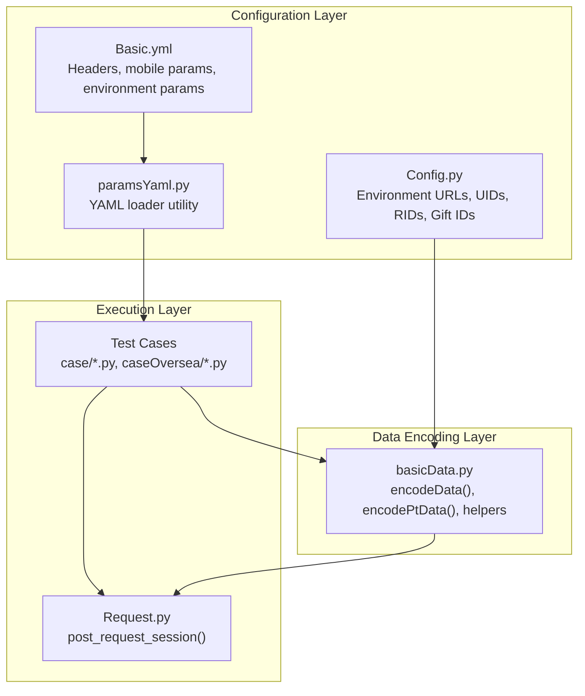
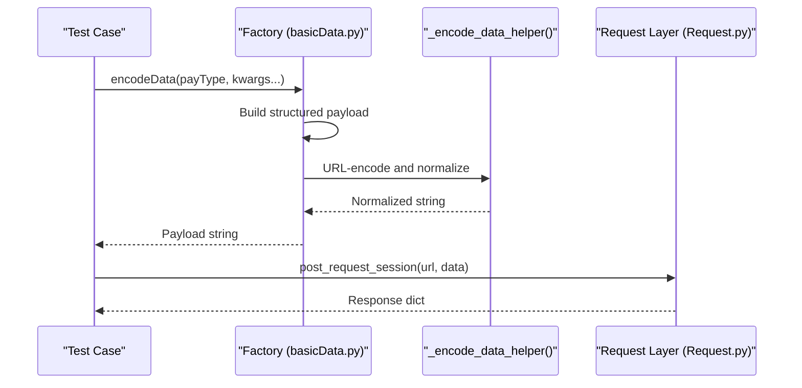
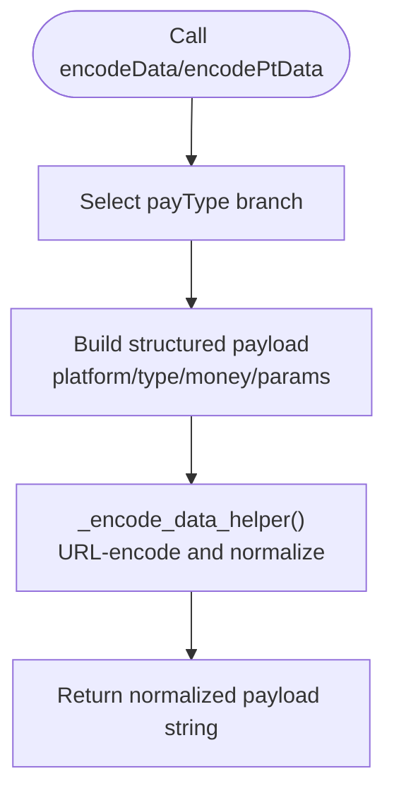
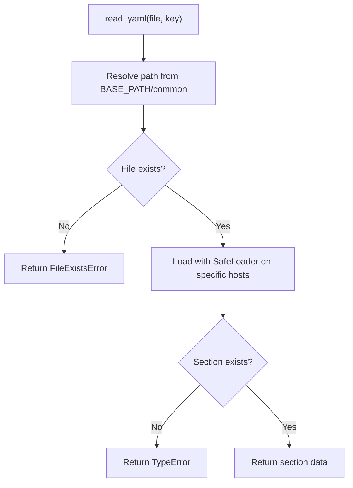
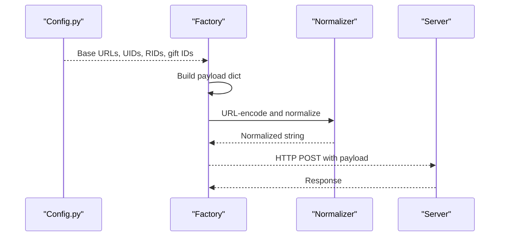
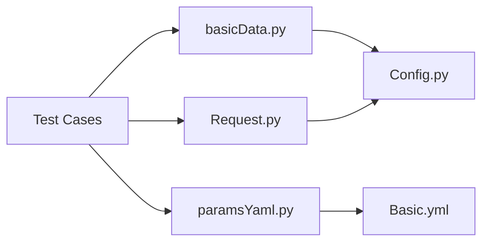

# Data Encoding Factory Pattern

<cite>
**Referenced Files in This Document**
- [basicData.py](file://common/basicData.py)
- [paramsYaml.py](file://common/paramsYaml.py)
- [Config.py](file://common/Config.py)
- [Basic.yml](file://common/Basic.yml)
- [Request.py](file://common/Request.py)
- [test_pay_bean.py](file://case/test_pay_bean.py)
- [test_pay_shopBuy.py](file://case/test_pay_shopBuy.py)
- [test_pay_coin.py](file://case/test_pay_coin.py)
- [test_pt_bean.py](file://caseOversea/test_pt_bean.py)
- [test_pt_enArea.py](file://caseOversea/test_pt_enArea.py)
</cite>

## Table of Contents
1. [Introduction](#introduction)
2. [Project Structure](#project-structure)
3. [Core Components](#core-components)
4. [Architecture Overview](#architecture-overview)
5. [Detailed Component Analysis](#detailed-component-analysis)
6. [Dependency Analysis](#dependency-analysis)
7. [Performance Considerations](#performance-considerations)
8. [Troubleshooting Guide](#troubleshooting-guide)
9. [Conclusion](#conclusion)

## Introduction
This document explains the data encoding factory pattern used in the payment testing framework. It covers how payment payloads are generated for different platforms and scenarios, how YAML configuration supports template-driven data creation, and how the transformation pipeline converts configuration into standardized, executable payloads. It also documents validation, type conversion, error handling, and extensibility patterns for adding new payment types.

## Project Structure
The payment testing framework organizes data generation and configuration in a modular way:
- Data encoding factories: centralized payload builders for domestic and oversea contexts
- YAML configuration: reusable templates for headers, mobile login parameters, and environment-specific values
- Test cases: demonstrate usage of the factories and validate outcomes against database states
- Request layer: encapsulates HTTP transport and token management

**Diagram sources**
- [Config.py:1-133](file://common/Config.py#L1-L133)
- [Basic.yml:1-52](file://common/Basic.yml#L1-L52)
- [paramsYaml.py:1-32](file://common/paramsYaml.py#L1-L32)
- [basicData.py:1-581](file://common/basicData.py#L1-L581)
- [Request.py:1-162](file://common/Request.py#L1-L162)

**Section sources**
- [Config.py:1-133](file://common/Config.py#L1-L133)
- [Basic.yml:1-52](file://common/Basic.yml#L1-L52)
- [paramsYaml.py:1-32](file://common/paramsYaml.py#L1-L32)
- [basicData.py:1-581](file://common/basicData.py#L1-L581)
- [Request.py:1-162](file://common/Request.py#L1-L162)

## Core Components
- Data encoding factories
  - Domestic payments: encodeData(...) builds payloads for room, chat, shop, and special promotions
  - Overseas payments: encodePtData(...) adapts parameters for oversea environments and games
  - Shared helper: _encode_data_helper(...) URL-encodes and normalizes payload strings
- YAML configuration system
  - paramsYaml.Yaml.read_yaml(...) loads environment-specific YAML sections
  - Basic.yml centralizes headers, mobile login credentials, and query params
- Runtime configuration
  - Config.py defines base URLs, user IDs, room IDs, gift IDs, and environment identifiers

Key responsibilities:
- Factory methods select a scenario (payType), assemble a structured payload, and normalize it
- YAML utilities resolve platform-specific templates and parameters
- Tests orchestrate data generation, HTTP requests, and database assertions

**Section sources**
- [basicData.py:8-325](file://common/basicData.py#L8-L325)
- [basicData.py:327-566](file://common/basicData.py#L327-L566)
- [basicData.py:568-571](file://common/basicData.py#L568-L571)
- [paramsYaml.py:8-32](file://common/paramsYaml.py#L8-L32)
- [Basic.yml:1-52](file://common/Basic.yml#L1-L52)
- [Config.py:6-133](file://common/Config.py#L6-L133)

## Architecture Overview
The factory pattern separates payload construction from execution. Tests call encodeData or encodePtData with scenario parameters, receiving a normalized URL-encoded string ready for HTTP transport. Configuration and YAML provide environment-specific defaults and templates.

**Diagram sources**
- [basicData.py:8-325](file://common/basicData.py#L8-L325)
- [basicData.py:568-571](file://common/basicData.py#L568-L571)
- [Request.py:17-59](file://common/Request.py#L17-L59)

## Detailed Component Analysis

### Data Encoding Factories
The factories implement a switch-based factory method pattern:
- encodeData(...): handles domestic scenarios (room packages, chat gifts, shop purchases, defends, titles, exchanges)
- encodePtData(...): handles oversea scenarios (packages, chat gifts, shop buys, coin shop, crazy spin, journey planet draw, chat pay card)
- _encode_data_helper(...): shared normalization via URL encoding and character replacement

Implementation highlights:
- Parameter-driven selection via payType
- Structured payload composition with platform, type, money, and params
- Consistent defaults for versioning, coin usage, guide flags, and scene-specific fields
- Special handling for multi-user packages and exchange flows

**Diagram sources**
- [basicData.py:8-325](file://common/basicData.py#L8-L325)
- [basicData.py:327-566](file://common/basicData.py#L327-L566)
- [basicData.py:568-571](file://common/basicData.py#L568-L571)

**Section sources**
- [basicData.py:8-325](file://common/basicData.py#L8-L325)
- [basicData.py:327-566](file://common/basicData.py#L327-L566)
- [basicData.py:568-571](file://common/basicData.py#L568-L571)

### YAML Configuration System
The YAML system provides environment-specific templates and parameters:
- paramsYaml.Yaml.read_yaml(file, key) resolves a named section from a YAML file located under common/
- Basic.yml contains:
  - Headers for dev, pt, and slp environments
  - Mobile login credentials and query parameters
  - Environment-specific query param sets

Usage pattern:
- Tests or utilities load a YAML section by name
- Values are merged into request headers or query strings as needed

**Diagram sources**
- [paramsYaml.py:8-32](file://common/paramsYaml.py#L8-L32)
- [Config.py:8](file://common/Config.py#L8)

**Section sources**
- [paramsYaml.py:8-32](file://common/paramsYaml.py#L8-L32)
- [Basic.yml:1-52](file://common/Basic.yml#L1-L52)
- [Config.py:8](file://common/Config.py#L8)

### Data Transformation Pipeline
End-to-end transformation from configuration to executable payload:
- Configuration resolution: Config.py supplies base URLs, UIDs, RIDs, gift IDs, and environment constants
- Scenario assembly: Factory methods build a structured payload dictionary
- Standardization: _encode_data_helper(...) ensures consistent URL encoding and character normalization
- Execution: Request.py sends the payload via HTTP with appropriate headers and tokens

**Diagram sources**
- [Config.py:6-133](file://common/Config.py#L6-L133)
- [basicData.py:8-325](file://common/basicData.py#L8-L325)
- [basicData.py:568-571](file://common/basicData.py#L568-L571)
- [Request.py:17-59](file://common/Request.py#L17-L59)

**Section sources**
- [Config.py:6-133](file://common/Config.py#L6-L133)
- [basicData.py:8-325](file://common/basicData.py#L8-L325)
- [basicData.py:568-571](file://common/basicData.py#L568-L571)
- [Request.py:17-59](file://common/Request.py#L17-L59)

### Examples of Payload Generation
- Domestic room package with multiple recipients:
  - Factory call constructs a multi-user package payload with positions and quantities
  - Normalized string prepared for HTTP transport
  - Test validates balances and DB state after payment
- Overseas coin exchange:
  - Factory call builds an oversea exchange payload
  - Test updates account balances and asserts gold coin receipt
- Shop purchase and gift transfer:
  - Factory call builds shop-buy payload with item ID and quantity
  - Test verifies wallet deduction and inventory changes

**Section sources**
- [test_pay_bean.py:37-158](file://case/test_pay_bean.py#L37-L158)
- [test_pay_shopBuy.py:21-94](file://case/test_pay_shopBuy.py#L21-L94)
- [test_pay_coin.py:16-62](file://case/test_pay_coin.py#L16-L62)
- [test_pt_bean.py:19-37](file://caseOversea/test_pt_bean.py#L19-L37)
- [test_pt_enArea.py:108-120](file://caseOversea/test_pt_enArea.py#L108-L120)

### Error Handling in Data Encoding
- Pay type validation:
  - Unknown payType raises an exception in both factories
- YAML loading:
  - Missing file returns a file existence error
  - Missing section returns a type error
  - Exceptions are caught and printed during YAML read
- HTTP transport:
  - Request layer catches request exceptions and returns empty structures
  - JSON parsing failures are handled gracefully

**Section sources**
- [basicData.py:324](file://common/basicData.py#L324)
- [basicData.py:565](file://common/basicData.py#L565)
- [paramsYaml.py:18-31](file://common/paramsYaml.py#L18-L31)
- [Request.py:40-46](file://common/Request.py#L40-L46)

### Extensibility Patterns for New Payment Types
To add a new payment type:
- Define a new payType branch in the appropriate factory (encodeData or encodePtData)
- Add required parameters and defaults
- Ensure the payload includes platform, type, money, and params fields
- If applicable, update Config.py with new UIDs, RIDs, or constants
- Write a test case invoking the factory and asserting outcomes

Validation and normalization:
- Keep parameter names consistent with existing patterns
- Use the shared helper for URL encoding and normalization
- Add explicit tests for edge cases (missing funds, invalid recipients)

**Section sources**
- [basicData.py:8-325](file://common/basicData.py#L8-L325)
- [basicData.py:327-566](file://common/basicData.py#L327-L566)
- [Config.py:6-133](file://common/Config.py#L6-L133)

## Dependency Analysis
The following diagram shows how components depend on each other:

**Diagram sources**
- [basicData.py:1-581](file://common/basicData.py#L1-L581)
- [Config.py:1-133](file://common/Config.py#L1-L133)
- [paramsYaml.py:1-32](file://common/paramsYaml.py#L1-L32)
- [Basic.yml:1-52](file://common/Basic.yml#L1-L52)
- [Request.py:1-162](file://common/Request.py#L1-L162)

**Section sources**
- [basicData.py:1-581](file://common/basicData.py#L1-L581)
- [Config.py:1-133](file://common/Config.py#L1-L133)
- [paramsYaml.py:1-32](file://common/paramsYaml.py#L1-L32)
- [Basic.yml:1-52](file://common/Basic.yml#L1-L52)
- [Request.py:1-162](file://common/Request.py#L1-L162)

## Performance Considerations
- URL encoding overhead: The helper performs URL encoding and character replacements; keep payloads minimal and avoid unnecessary nesting
- Network latency: The request layer measures response time; batch tests where possible to reduce repeated setup costs
- Database checks: Many tests query DB state; ensure indices exist on queried columns to minimize lookup time

## Troubleshooting Guide
Common issues and resolutions:
- Unknown payType:
  - Verify the payType value matches a supported branch
  - Check for typos or missing branches in the factory
- Missing YAML file or section:
  - Confirm the YAML file path under common/ and that the requested key exists
  - Validate host-specific loaders for CI environments
- HTTP errors:
  - Inspect returned status codes and bodies
  - Ensure user tokens are present and valid
- Balance discrepancies:
  - Cross-check gift IDs, quantities, and rates in Config.py
  - Confirm database assertions align with expected payment outcomes

**Section sources**
- [basicData.py:324](file://common/basicData.py#L324)
- [basicData.py:565](file://common/basicData.py#L565)
- [paramsYaml.py:18-31](file://common/paramsYaml.py#L18-L31)
- [Request.py:40-59](file://common/Request.py#L40-L59)

## Conclusion
The payment testing framework’s data encoding factory pattern cleanly separates payload construction from execution. The factories provide a uniform interface for building standardized, URL-encoded payloads across domestic and oversea contexts. YAML configuration and runtime configuration supply environment-specific defaults and parameters. Tests demonstrate practical usage, validation, and extensibility, ensuring reliable and maintainable payment automation.