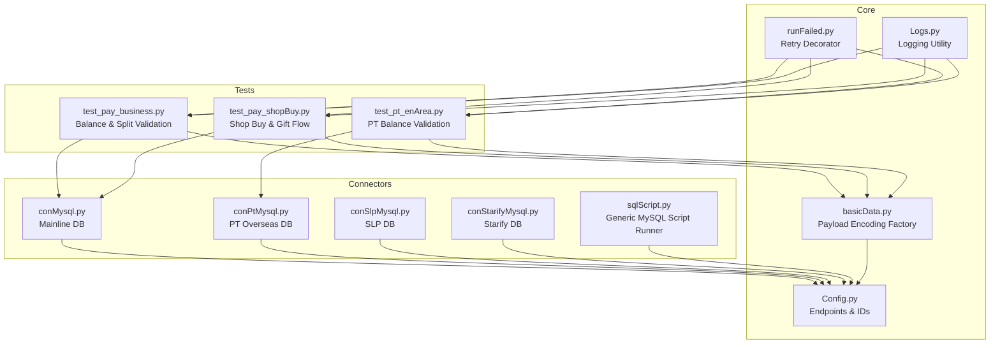
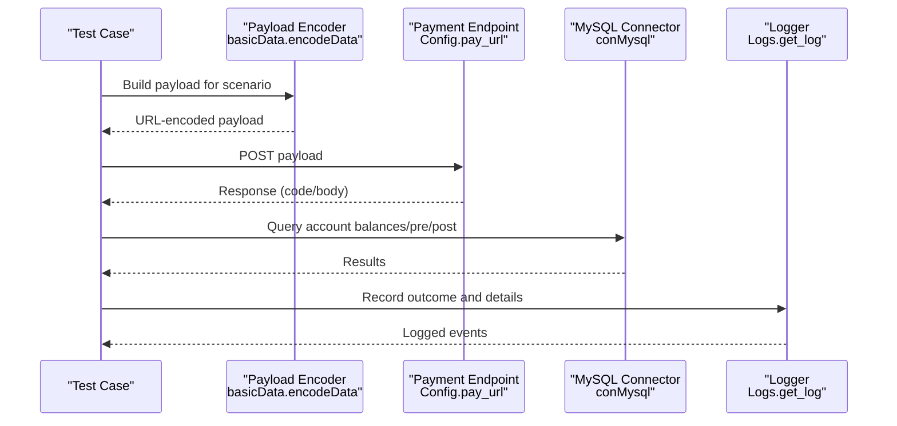
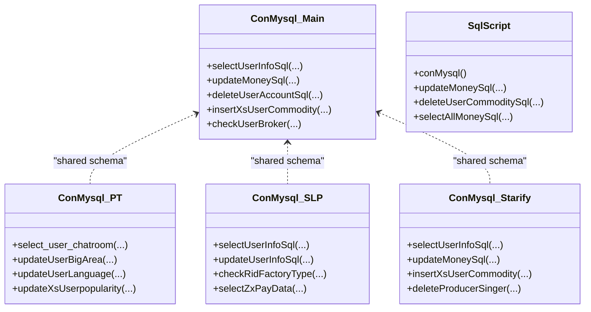
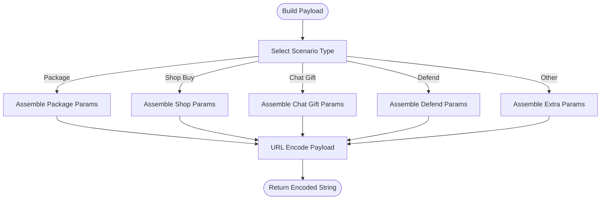
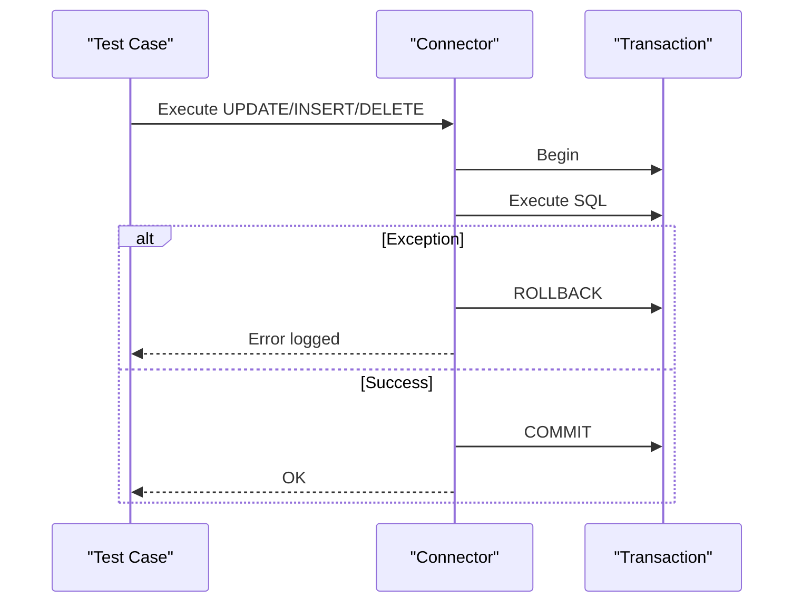
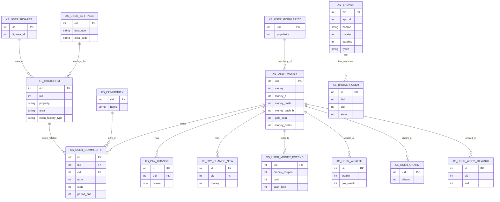
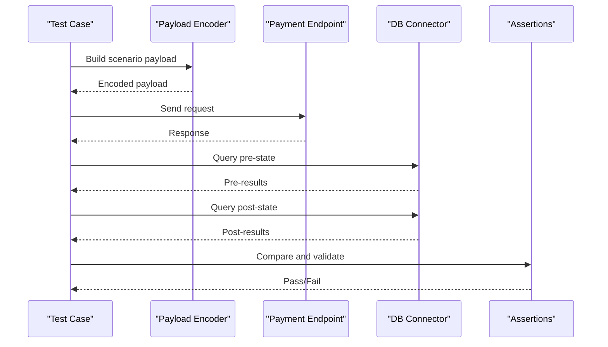
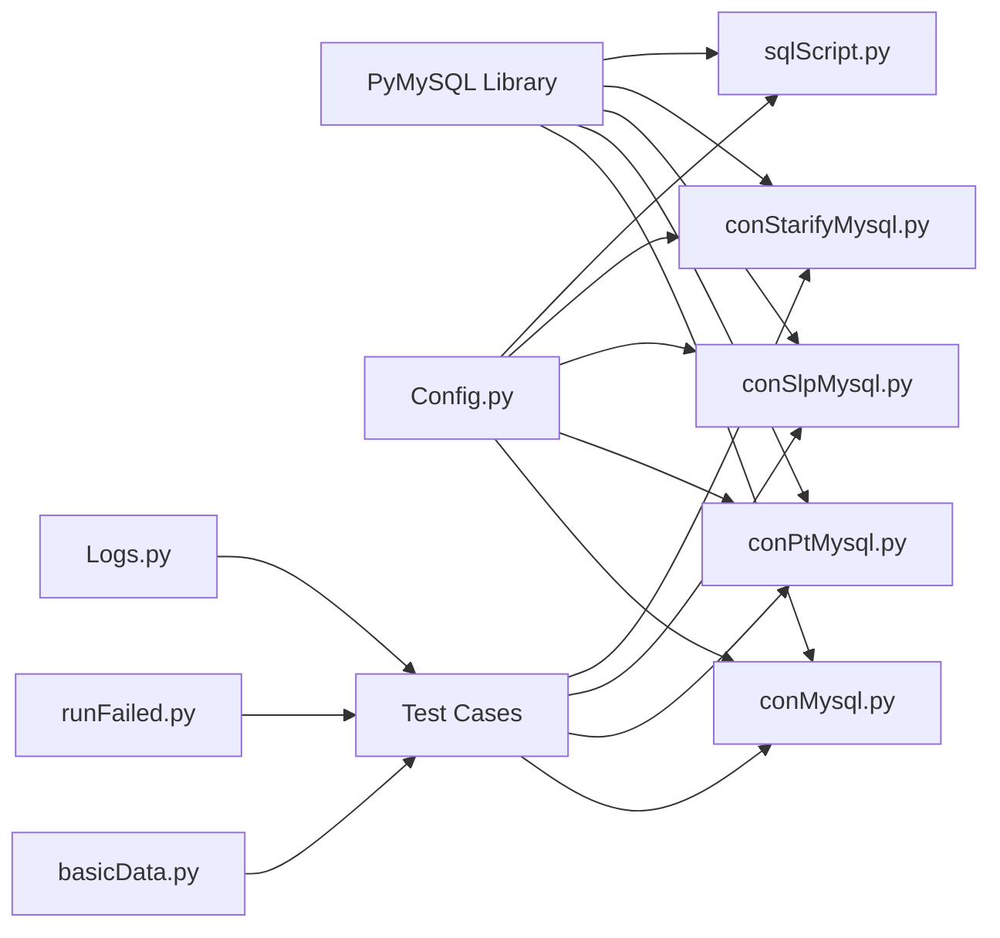

# Data Management

<cite>
**Referenced Files in This Document**
- [conMysql.py](file://common/conMysql.py)
- [conPtMysql.py](file://common/conPtMysql.py)
- [conSlpMysql.py](file://common/conSlpMysql.py)
- [conStarifyMysql.py](file://common/conStarifyMysql.py)
- [sqlScript.py](file://common/sqlScript.py)
- [Config.py](file://common/Config.py)
- [basicData.py](file://common/basicData.py)
- [Logs.py](file://common/Logs.py)
- [runFailed.py](file://common/runFailed.py)
- [test_pay_business.py](file://case/test_pay_business.py)
- [test_pay_shopBuy.py](file://case/test_pay_shopBuy.py)
- [test_pt_enArea.py](file://caseOversea/test_pt_enArea.py)
- [sql.txt](file://caseStarify/sql.txt)
</cite>

## Table of Contents
1. [Introduction](#introduction)
2. [Project Structure](#project-structure)
3. [Core Components](#core-components)
4. [Architecture Overview](#architecture-overview)
5. [Detailed Component Analysis](#detailed-component-analysis)
6. [Dependency Analysis](#dependency-analysis)
7. [Performance Considerations](#performance-considerations)
8. [Troubleshooting Guide](#troubleshooting-guide)
9. [Conclusion](#conclusion)
10. [Appendices](#appendices)

## Introduction
This document explains the data management capabilities of the project, focusing on:
- Multi-platform database connectivity for different environments and game modes
- Account validation and balance verification procedures
- Transaction logging and rollback mechanisms
- Data encoding factory patterns for generating payment payloads
- SQL script execution, validation workflows, and data consistency checks
- Schema considerations and practical connection strategies

It consolidates the database connectors, configuration, payload encoding, and test-driven validation flows to help both technical and non-technical users understand how payments and balances are validated across platforms.

## Project Structure
The data management layer centers around:
- Database connectors for multiple platforms (mainline, PT oversea, SLP, Starify)
- A shared configuration module for endpoints and identifiers
- A data encoding factory that builds platform-specific payment payloads
- Logging and retry utilities for robust test execution
- Test suites validating account updates, transactions, and balances

**Diagram sources**
- [conMysql.py:1-530](file://common/conMysql.py#L1-L530)
- [conPtMysql.py:1-345](file://common/conPtMysql.py#L1-L345)
- [conSlpMysql.py:1-680](file://common/conSlpMysql.py#L1-L680)
- [conStarifyMysql.py:1-148](file://common/conStarifyMysql.py#L1-L148)
- [sqlScript.py:1-145](file://common/sqlScript.py#L1-L145)
- [Config.py:1-133](file://common/Config.py#L1-L133)
- [basicData.py:1-581](file://common/basicData.py#L1-L581)
- [Logs.py:1-48](file://common/Logs.py#L1-L48)
- [runFailed.py:1-87](file://common/runFailed.py#L1-L87)
- [test_pay_business.py:1-189](file://case/test_pay_business.py#L1-L189)
- [test_pay_shopBuy.py:1-124](file://case/test_pay_shopBuy.py#L1-L124)
- [test_pt_enArea.py:104-120](file://caseOversea/test_pt_enArea.py#L104-L120)

**Section sources**
- [README.md:1-38](file://README.md#L1-L38)
- [Config.py:1-133](file://common/Config.py#L1-L133)

## Core Components
- Multi-platform database connectors:
  - Mainline MySQL connector with static methods for queries and updates
  - PT Overseas MySQL connector tailored to regional big-area and chatroom configurations
  - SLP MySQL connector with specialized account and room validations
  - Starify MySQL connector for coin and commodity operations
  - Generic MySQL script runner for ad-hoc SQL execution
- Configuration hub:
  - Centralized endpoints, UIDs, RIDs, gift IDs, and environment-specific URLs
- Payload encoding factory:
  - Platform-aware builders for payment requests across multiple scenarios (packages, shop buys, gifts, defends, etc.)
- Logging and resilience:
  - Structured logging with rotating handlers
  - Retry decorator for transient failures in tests

**Section sources**
- [conMysql.py:8-530](file://common/conMysql.py#L8-L530)
- [conPtMysql.py:6-345](file://common/conPtMysql.py#L6-L345)
- [conSlpMysql.py:8-680](file://common/conSlpMysql.py#L8-L680)
- [conStarifyMysql.py:6-148](file://common/conStarifyMysql.py#L6-L148)
- [sqlScript.py:5-145](file://common/sqlScript.py#L5-L145)
- [Config.py:6-133](file://common/Config.py#L6-L133)
- [basicData.py:8-581](file://common/basicData.py#L8-L581)
- [Logs.py:8-48](file://common/Logs.py#L8-L48)
- [runFailed.py:10-87](file://common/runFailed.py#L10-L87)

## Architecture Overview
The system orchestrates payment flows from payload generation to database validation and logging. Tests drive the flow, invoking the encoding factory to build payloads and the database connectors to validate account states before and after transactions.

**Diagram sources**
- [basicData.py:8-581](file://common/basicData.py#L8-L581)
- [Config.py:49-55](file://common/Config.py#L49-L55)
- [conMysql.py:28-204](file://common/conMysql.py#L28-L204)
- [Logs.py:8-48](file://common/Logs.py#L8-L48)

## Detailed Component Analysis

### Database Connectors and Transaction Logging
- Mainline connector:
  - Provides static methods to select/update/delete/commodity operations
  - Uses a persistent connection with autocommit enabled for convenience
  - Implements per-operation commit/rollback on exceptions
- PT Overseas connector:
  - Specializes in big-area and chatroom region mapping
  - Updates language/big-area settings and clears records for testing
- SLP connector:
  - Supports title/growth/popularity and guild membership checks
  - Includes specialized queries for room factory types and agreement versions
- Starify connector:
  - Dedicated coin/wealth/charm operations and commodity insertions
  - Executes SQL with explicit rollback/commit handling
- Generic script runner:
  - Creates per-call connections and cursors
  - Ensures commit/rollback semantics per operation

**Diagram sources**
- [conMysql.py:28-530](file://common/conMysql.py#L28-L530)
- [conPtMysql.py:26-345](file://common/conPtMysql.py#L26-L345)
- [conSlpMysql.py:31-680](file://common/conSlpMysql.py#L31-L680)
- [conStarifyMysql.py:28-148](file://common/conStarifyMysql.py#L28-L148)
- [sqlScript.py:19-145](file://common/sqlScript.py#L19-L145)

**Section sources**
- [conMysql.py:8-530](file://common/conMysql.py#L8-L530)
- [conPtMysql.py:6-345](file://common/conPtMysql.py#L6-L345)
- [conSlpMysql.py:8-680](file://common/conSlpMysql.py#L8-L680)
- [conStarifyMysql.py:6-148](file://common/conStarifyMysql.py#L6-L148)
- [sqlScript.py:5-145](file://common/sqlScript.py#L5-L145)

### Data Encoding Factory Pattern
- Purpose:
  - Generate platform-specific URL-encoded payloads for payment scenarios
- Inputs:
  - Payment type, amount, room ID, user IDs, gift IDs, quantities, and optional extras
- Outputs:
  - URL-encoded strings ready for HTTP POST
- Validation:
  - Tests assert expected outcomes against database queries before/after requests

**Diagram sources**
- [basicData.py:8-581](file://common/basicData.py#L8-L581)

**Section sources**
- [basicData.py:8-581](file://common/basicData.py#L8-L581)

### Transaction Rollback and Consistency Validation
- Rollback policy:
  - On exceptions during UPDATE/INSERT/DELETE, the connector triggers rollback and commits afterward
  - Generic script runner follows the same pattern per operation
- Consistency checks:
  - Tests compare pre/post balances, commodity counts, and payment change records
  - Assertions validate split ratios and room-type-specific rules

**Diagram sources**
- [conMysql.py:206-272](file://common/conMysql.py#L206-L272)
- [conPtMysql.py:95-143](file://common/conPtMysql.py#L95-L143)
- [conSlpMysql.py:228-321](file://common/conSlpMysql.py#L228-L321)
- [conStarifyMysql.py:43-51](file://common/conStarifyMysql.py#L43-L51)
- [sqlScript.py:35-78](file://common/sqlScript.py#L35-L78)

**Section sources**
- [conMysql.py:206-272](file://common/conMysql.py#L206-L272)
- [conPtMysql.py:95-143](file://common/conPtMysql.py#L95-L143)
- [conSlpMysql.py:228-321](file://common/conSlpMysql.py#L228-L321)
- [conStarifyMysql.py:43-51](file://common/conStarifyMysql.py#L43-L51)
- [sqlScript.py:35-78](file://common/sqlScript.py#L35-L78)

### SQL Script Execution and Schema Considerations
- Execution model:
  - Per-operation connections and cursors
  - Explicit commit/rollback handling
- Schema highlights observed:
  - Accounts: xs_user_money, xs_user_money_extend
  - Commodity and inventory: xs_user_commodity, xs_commodity
  - Room and guild: xs_chatroom, xs_broker, xs_broker_user
  - Payment change and logs: xs_pay_change, xs_pay_change_new
  - Region and settings: xs_user_bigarea, xs_user_settings, xs_user_popularity
  - Starify-specific: xs_user_wealth, xs_user_charm, xs_user_work_reward

**Diagram sources**
- [sql.txt:10-34](file://caseStarify/sql.txt#L10-L34)
- [conMysql.py:29-204](file://common/conMysql.py#L29-L204)
- [conPtMysql.py:27-93](file://common/conPtMysql.py#L27-L93)
- [conSlpMysql.py:31-226](file://common/conSlpMysql.py#L31-L226)
- [conStarifyMysql.py:28-148](file://common/conStarifyMysql.py#L28-L148)

**Section sources**
- [sql.txt:10-34](file://caseStarify/sql.txt#L10-L34)
- [conMysql.py:29-204](file://common/conMysql.py#L29-L204)
- [conPtMysql.py:27-93](file://common/conPtMysql.py#L27-L93)
- [conSlpMysql.py:31-226](file://common/conSlpMysql.py#L31-L226)
- [conStarifyMysql.py:28-148](file://common/conStarifyMysql.py#L28-L148)

### Validation Workflows Across Platforms
- Mainline business room tests:
  - Verify splits (e.g., 62%/70%) and VIP experience gains
  - Validate payment change records and account sums
- Shop buy and gift tests:
  - Confirm commodity counts and balance adjustments
  - Validate insufficient funds scenarios
- PT oversea tests:
  - Regional room selection and currency splits
  - Big-area and language settings updates

**Diagram sources**
- [test_pay_business.py:18-189](file://case/test_pay_business.py#L18-L189)
- [test_pay_shopBuy.py:21-124](file://case/test_pay_shopBuy.py#L21-L124)
- [test_pt_enArea.py:104-120](file://caseOversea/test_pt_enArea.py#L104-L120)
- [basicData.py:8-581](file://common/basicData.py#L8-L581)
- [Config.py:49-55](file://common/Config.py#L49-L55)

**Section sources**
- [test_pay_business.py:18-189](file://case/test_pay_business.py#L18-L189)
- [test_pay_shopBuy.py:21-124](file://case/test_pay_shopBuy.py#L21-L124)
- [test_pt_enArea.py:104-120](file://caseOversea/test_pt_enArea.py#L104-L120)

## Dependency Analysis
- Connectors depend on:
  - PyMySQL for MySQL connectivity
  - Shared configuration for endpoints and identifiers
- Tests depend on:
  - Encoders for payloads
  - Connectors for state validation
  - Retry and logging utilities for reliability and observability

**Diagram sources**
- [conMysql.py:2-5](file://common/conMysql.py#L2-L5)
- [conPtMysql.py:2-3](file://common/conPtMysql.py#L2-L3)
- [conSlpMysql.py:2-5](file://common/conSlpMysql.py#L2-L5)
- [conStarifyMysql.py:2-3](file://common/conStarifyMysql.py#L2-L3)
- [sqlScript.py:2](file://common/sqlScript.py#L2)
- [Config.py:6-133](file://common/Config.py#L6-L133)
- [basicData.py:1-581](file://common/basicData.py#L1-L581)
- [runFailed.py:1-87](file://common/runFailed.py#L1-L87)
- [Logs.py:1-48](file://common/Logs.py#L1-L48)

**Section sources**
- [conMysql.py:2-5](file://common/conMysql.py#L2-L5)
- [conPtMysql.py:2-3](file://common/conPtMysql.py#L2-L3)
- [conSlpMysql.py:2-5](file://common/conSlpMysql.py#L2-L5)
- [conStarifyMysql.py:2-3](file://common/conStarifyMysql.py#L2-L3)
- [sqlScript.py:2](file://common/sqlScript.py#L2)
- [Config.py:6-133](file://common/Config.py#L6-L133)
- [basicData.py:1-581](file://common/basicData.py#L1-L581)
- [runFailed.py:1-87](file://common/runFailed.py#L1-L87)
- [Logs.py:1-48](file://common/Logs.py#L1-L48)

## Performance Considerations
- Connection reuse vs. per-call:
  - Persistent connections reduce overhead but require careful commit/rollback handling
  - Per-call connections simplify isolation but increase connection overhead
- Autocommit behavior:
  - Enabling autocommit simplifies transaction control but can mask partial failures
- Batch operations:
  - Grouping updates within a single transaction reduces round-trips when feasible
- Indexing and queries:
  - Ensure appropriate indexes on frequently queried columns (uid, cid, rid)
- Logging volume:
  - Rotate logs to avoid disk pressure during heavy test runs

[No sources needed since this section provides general guidance]

## Troubleshooting Guide
- Connection errors:
  - Verify host/port/user/password in configuration and network reachability
  - Use ping/reconnect strategies where supported
- Transaction anomalies:
  - Ensure rollback is triggered on exceptions and commit occurs afterward
  - Validate autocommit settings to prevent unexpected implicit commits
- Payload mismatches:
  - Confirm encoder parameters align with backend expectations
  - Inspect encoded payloads for special characters and encoding rules
- Logging:
  - Use structured logs to capture timestamps, filenames, and line numbers
  - Enable rotation to manage log sizes

**Section sources**
- [conMysql.py:17-25](file://common/conMysql.py#L17-L25)
- [conStarifyMysql.py:17-25](file://common/conStarifyMysql.py#L17-L25)
- [Logs.py:8-48](file://common/Logs.py#L8-L48)

## Conclusion
The project’s data management layer integrates platform-specific database connectors, a robust payload encoding factory, and comprehensive validation via tests. It supports multi-environment operations, enforces transaction safety with explicit rollback/commit handling, and maintains clear logs for traceability. By leveraging these components, teams can reliably validate payment flows, account balances, and cross-platform consistency across diverse game modes.

[No sources needed since this section summarizes without analyzing specific files]

## Appendices
- Endpoint and identifier references:
  - Payment endpoints and user/group IDs are centralized in the configuration module
- Retry and logging utilities:
  - Retry decorator wraps tests to improve resilience
  - Logging utility provides console and file handlers with rotation

**Section sources**
- [Config.py:49-133](file://common/Config.py#L49-L133)
- [runFailed.py:10-87](file://common/runFailed.py#L10-L87)
- [Logs.py:8-48](file://common/Logs.py#L8-L48)