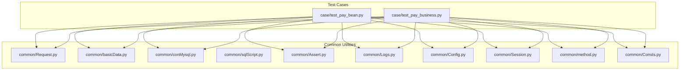
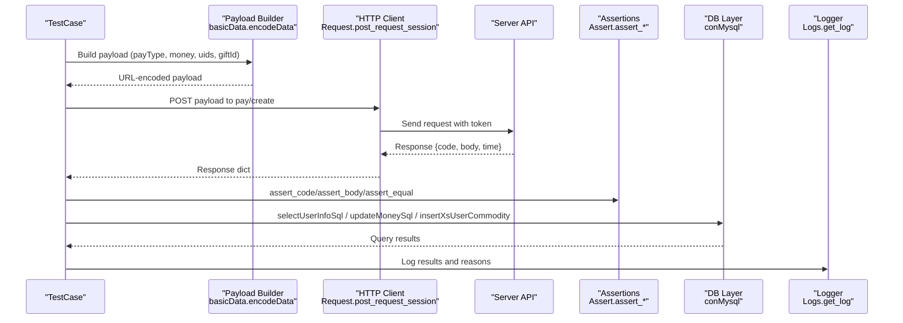
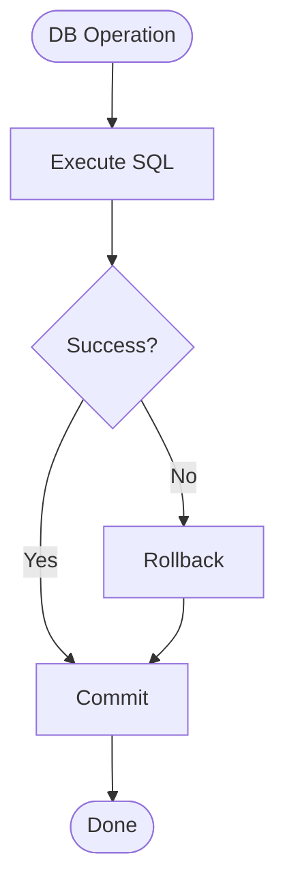
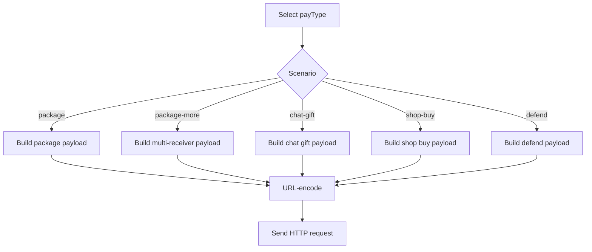
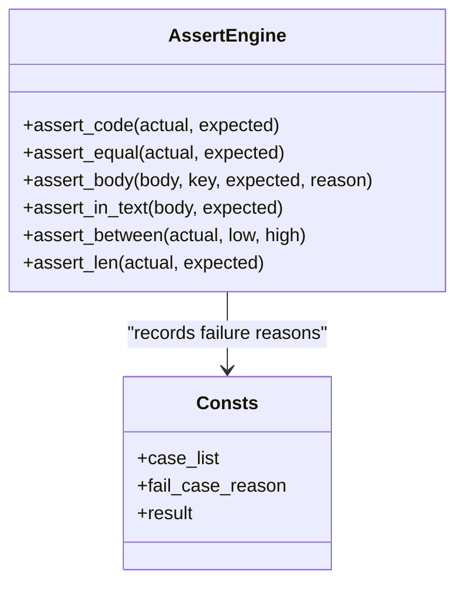
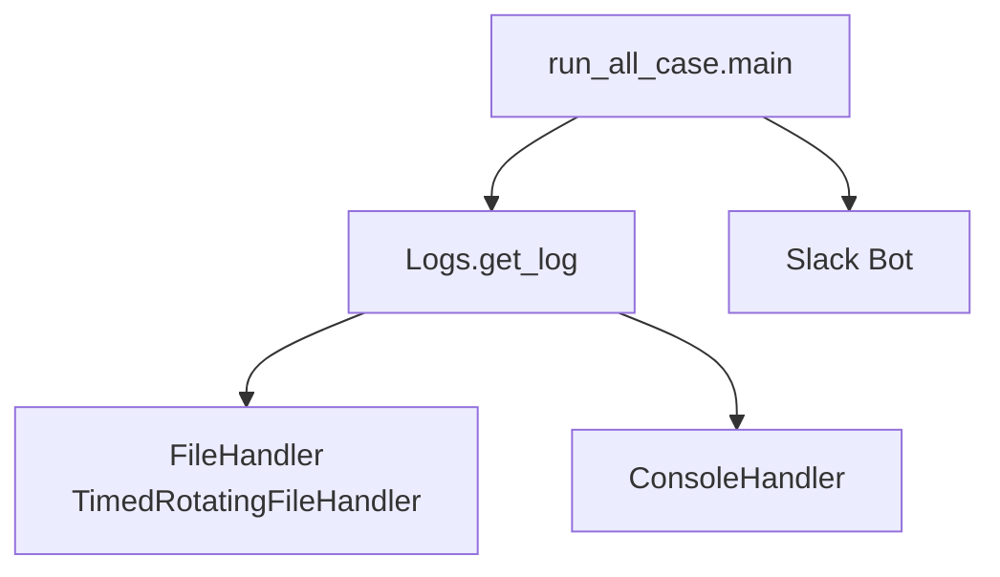
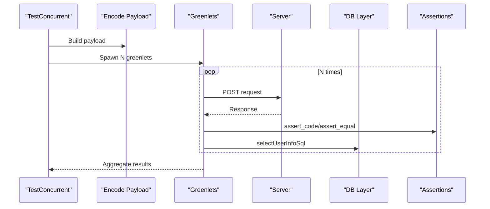
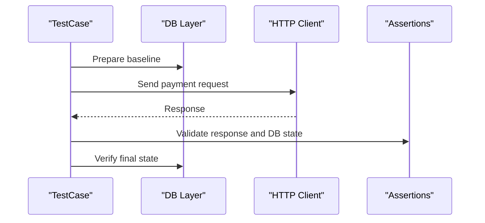
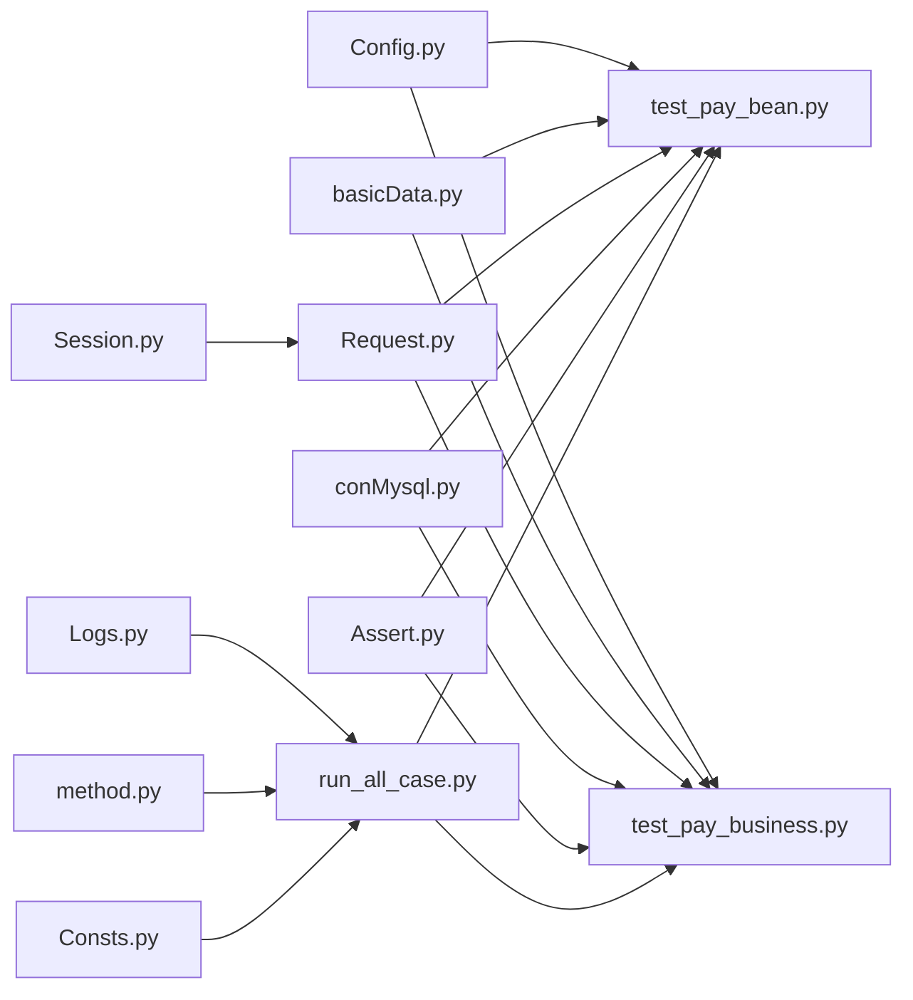

# Data Validation and Transaction Logging

<cite>
**Referenced Files in This Document**
- [Assert.py](file://common/Assert.py)
- [Logs.py](file://common/Logs.py)
- [sqlScript.py](file://common/sqlScript.py)
- [conMysql.py](file://common/conMysql.py)
- [Config.py](file://common/Config.py)
- [test_pay_bean.py](file://case/test_pay_bean.py)
- [test_pay_business.py](file://case/test_pay_business.py)
- [Consts.py](file://common/Consts.py)
- [run_all_case.py](file://run_all_case.py)
- [basicData.py](file://common/basicData.py)
- [method.py](file://common/method.py)
- [Request.py](file://common/Request.py)
- [Session.py](file://common/Session.py)
- [testPayConcurrent.py](file://testPayConcurrent.py)
- [testConcurrent.py](file://testConcurrent.py)
</cite>

## Table of Contents
1. [Introduction](#introduction)
2. [Project Structure](#project-structure)
3. [Core Components](#core-components)
4. [Architecture Overview](#architecture-overview)
5. [Detailed Component Analysis](#detailed-component-analysis)
6. [Dependency Analysis](#dependency-analysis)
7. [Performance Considerations](#performance-considerations)
8. [Troubleshooting Guide](#troubleshooting-guide)
9. [Conclusion](#conclusion)
10. [Appendices](#appendices)

## Introduction
This document explains the data validation and transaction logging mechanisms used in the payment test suite. It covers:
- SQL script execution framework and transaction safety
- Parameter binding via payload builders
- Assertion engine for payment outcomes and account balances
- Logging strategies for audit trails, error tracking, and notifications
- Validation patterns for concurrent transactions and race condition mitigation
- Consistency checks across platforms and environments

## Project Structure
The repository organizes test cases per product area under dedicated folders, with shared utilities for database access, HTTP requests, assertions, logging, and configuration.

**Diagram sources**
- [test_pay_bean.py](file://case/test_pay_bean.py)
- [test_pay_business.py](file://case/test_pay_business.py)
- [Request.py](file://common/Request.py)
- [basicData.py](file://common/basicData.py)
- [conMysql.py](file://common/conMysql.py)
- [sqlScript.py](file://common/sqlScript.py)
- [Assert.py](file://common/Assert.py)
- [Logs.py](file://common/Logs.py)
- [Config.py](file://common/Config.py)
- [Session.py](file://common/Session.py)
- [method.py](file://common/method.py)
- [Consts.py](file://common/Consts.py)

**Section sources**
- [run_all_case.py](file://run_all_case.py)
- [Config.py](file://common/Config.py)

## Core Components
- Assertion Engine: Provides standardized checks for HTTP status, JSON body fields, equality, length thresholds, and ranges.
- Database Access Layer: Centralized MySQL helpers for reads, writes, and cleanup across multiple schemas.
- Payload Builders: Encode structured request payloads for various payment scenarios.
- HTTP Client: Wraps session-based requests with token injection and timing metrics.
- Logging: Rotating logs with console and file handlers for audit and diagnostics.
- Configuration: Centralized endpoints, UIDs, gift IDs, and environment-specific settings.
- Concurrency Utilities: Helpers for concurrent load testing and transaction safety.

**Section sources**
- [Assert.py](file://common/Assert.py)
- [conMysql.py](file://common/conMysql.py)
- [sqlScript.py](file://common/sqlScript.py)
- [basicData.py](file://common/basicData.py)
- [Request.py](file://common/Request.py)
- [Logs.py](file://common/Logs.py)
- [Config.py](file://common/Config.py)
- [Session.py](file://common/Session.py)
- [method.py](file://common/method.py)
- [Consts.py](file://common/Consts.py)

## Architecture Overview
End-to-end flow for payment validation:
- Payload construction → HTTP request → Assertions → Database verification → Logging and notifications

**Diagram sources**
- [basicData.py](file://common/basicData.py)
- [Request.py](file://common/Request.py)
- [Assert.py](file://common/Assert.py)
- [conMysql.py](file://common/conMysql.py)
- [Logs.py](file://common/Logs.py)

## Detailed Component Analysis

### SQL Script Execution Framework and Transaction Safety
- Connection and isolation:
  - Persistent connection with autocommit enabled in the primary MySQL client.
  - Explicit rollback on exceptions and commit in finally blocks for write operations.
- Parameter binding:
  - Payloads are built programmatically and passed to the server; database operations use parameterized queries to avoid injection.
- Transaction rollback strategies:
  - On exceptions during updates/deletes/inserts, rollback is invoked followed by commit to ensure consistency.
- Result verification:
  - Dedicated selectors for balances, commodity counts, and derived sums; assertions compare actual vs expected values.

**Diagram sources**
- [conMysql.py](file://common/conMysql.py)
- [sqlScript.py](file://common/sqlScript.py)

**Section sources**
- [conMysql.py](file://common/conMysql.py)
- [sqlScript.py](file://common/sqlScript.py)

### Parameter Binding and Payload Validation
- Payload builder supports multiple payment scenarios (room gifts, chat gifts, shop buys, defends, etc.) with consistent parameterization.
- Encodes JSON-like structures into URL-encoded form data, ensuring special characters are normalized.
- Validation rules:
  - Money and quantity fields validated against expected ranges.
  - Gift IDs and room IDs sourced from configuration for correctness.
  - Multi-user scenarios construct comma-separated lists for recipients and positions.

**Diagram sources**
- [basicData.py](file://common/basicData.py)
- [Request.py](file://common/Request.py)

**Section sources**
- [basicData.py](file://common/basicData.py)
- [Config.py](file://common/Config.py)

### Assertion Engine Capabilities
- Status code checks, body field assertions, equality comparisons, substring presence checks, and inclusive range validations.
- Failure reasons recorded centrally for reporting and Slack notifications.
- Optional sleep adjustments for RPC latency in specific environments.

**Diagram sources**
- [Assert.py](file://common/Assert.py)
- [Consts.py](file://common/Consts.py)

**Section sources**
- [Assert.py](file://common/Assert.py)
- [Consts.py](file://common/Consts.py)

### Logging Strategies for Audit Trails, Error Tracking, and Notifications
- Rotating file handler with midnight rotation and configurable backup count.
- Structured log entries include timestamp, module path, line number, and level.
- Console handler for INFO-level visibility.
- Aggregated results and failures posted to Slack channels with contextual messages.

**Diagram sources**
- [Logs.py](file://common/Logs.py)
- [run_all_case.py](file://run_all_case.py)

**Section sources**
- [Logs.py](file://common/Logs.py)
- [run_all_case.py](file://run_all_case.py)

### Validation Patterns for Concurrent Transactions and Race Conditions
- Concurrency harness uses greenlets to simulate simultaneous requests.
- Pre/post conditions ensure deterministic state (e.g., clearing commodities, setting balances).
- Assertions verify final counts and sums to detect inconsistencies.

**Diagram sources**
- [testConcurrent.py](file://testConcurrent.py)
- [testPayConcurrent.py](file://testPayConcurrent.py)
- [basicData.py](file://common/basicData.py)
- [conMysql.py](file://common/conMysql.py)
- [Assert.py](file://common/Assert.py)

**Section sources**
- [testConcurrent.py](file://testConcurrent.py)
- [testPayConcurrent.py](file://testPayConcurrent.py)

### End-to-End Payment Validation Examples
- Bean payments, exchange flows, and business room splits are exercised across test suites.
- Each test:
  - Prepares baseline data (balances, commodities)
  - Sends payment request
  - Asserts response fields
  - Verifies database state changes
  - Records outcome and reasons

**Diagram sources**
- [test_pay_bean.py](file://case/test_pay_bean.py)
- [test_pay_business.py](file://case/test_pay_business.py)
- [conMysql.py](file://common/conMysql.py)
- [Request.py](file://common/Request.py)
- [Assert.py](file://common/Assert.py)

**Section sources**
- [test_pay_bean.py](file://case/test_pay_bean.py)
- [test_pay_business.py](file://case/test_pay_business.py)

## Dependency Analysis
- Test cases depend on shared utilities for request building, HTTP transport, DB access, assertions, and logging.
- Configuration centralizes endpoints and identifiers used across tests.
- Run orchestrator aggregates results and posts notifications.

**Diagram sources**
- [Config.py](file://common/Config.py)
- [test_pay_bean.py](file://case/test_pay_bean.py)
- [test_pay_business.py](file://case/test_pay_business.py)
- [basicData.py](file://common/basicData.py)
- [Request.py](file://common/Request.py)
- [conMysql.py](file://common/conMysql.py)
- [Assert.py](file://common/Assert.py)
- [Logs.py](file://common/Logs.py)
- [run_all_case.py](file://run_all_case.py)
- [Session.py](file://common/Session.py)
- [method.py](file://common/method.py)
- [Consts.py](file://common/Consts.py)

**Section sources**
- [run_all_case.py](file://run_all_case.py)
- [Config.py](file://common/Config.py)

## Performance Considerations
- Request timing is captured per response for performance monitoring.
- Logging includes elapsed time metrics for quick diagnosis.
- Concurrency tests help surface contention and race conditions; ensure DB operations are idempotent and properly isolated.

[No sources needed since this section provides general guidance]

## Troubleshooting Guide
- Assertion failures:
  - Review recorded failure reasons and adjust expectations or preconditions.
  - Confirm environment-specific delays and adjust sleep if necessary.
- Database anomalies:
  - Verify rollback/commit sequences around write operations.
  - Ensure cleanup steps are executed after tests to avoid cross-test interference.
- Logging:
  - Inspect rotating log files for stack traces and structured entries.
  - Confirm Slack notifications for aggregated results and failures.
- Token/session issues:
  - Regenerate tokens via session manager and re-run tests.

**Section sources**
- [Assert.py](file://common/Assert.py)
- [conMysql.py](file://common/conMysql.py)
- [Logs.py](file://common/Logs.py)
- [Session.py](file://common/Session.py)
- [run_all_case.py](file://run_all_case.py)

## Conclusion
The test suite integrates robust validation and logging around payment flows. SQL operations enforce transaction safety, payload builders ensure consistent parameterization, and assertions verify outcomes across accounts and rooms. Concurrency utilities expose potential race conditions, while logging and notifications support continuous monitoring and auditing.

[No sources needed since this section summarizes without analyzing specific files]

## Appendices
- Configuration of endpoints, UIDs, and gift IDs is centralized for cross-platform consistency.
- Run orchestrator supports multiple apps and branches, posting results to Slack.

**Section sources**
- [Config.py](file://common/Config.py)
- [run_all_case.py](file://run_all_case.py)