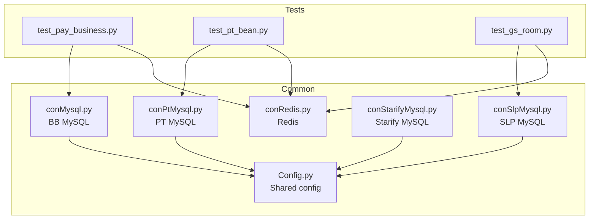
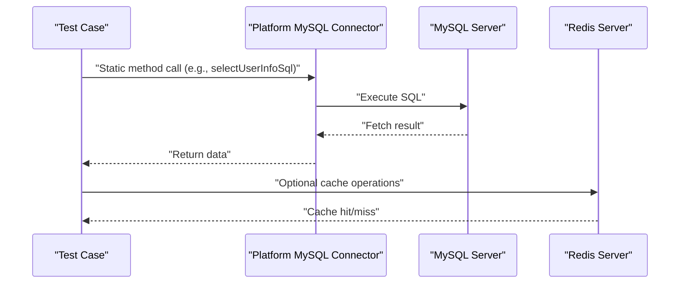
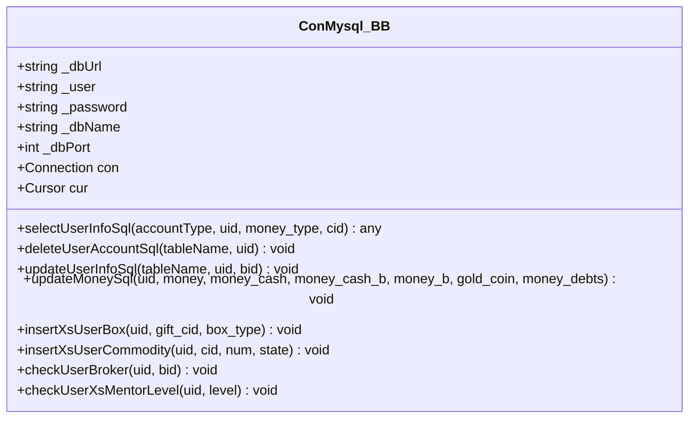
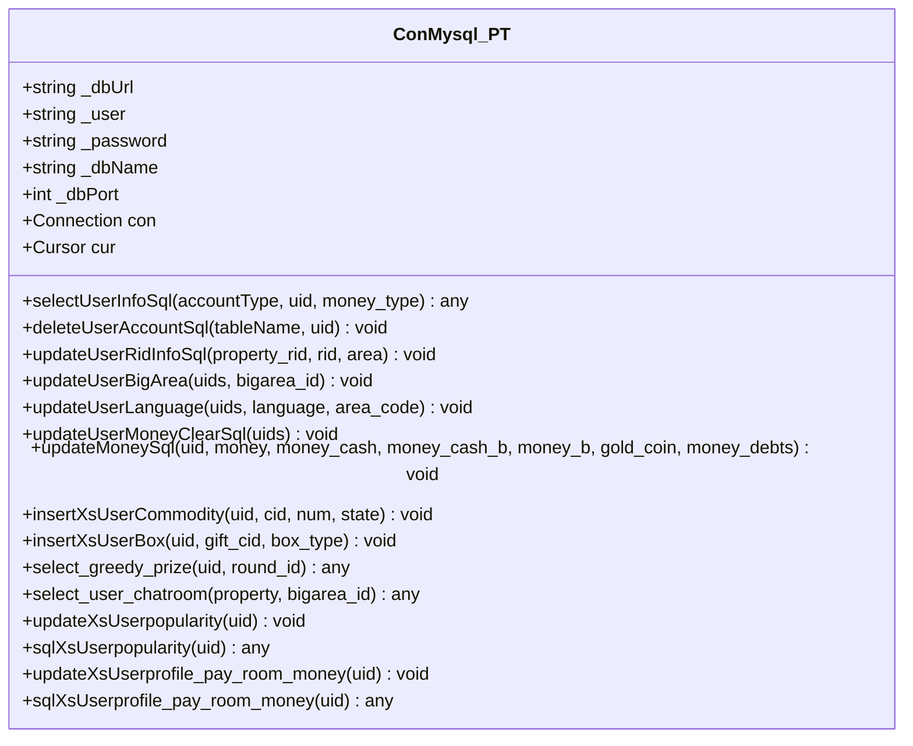
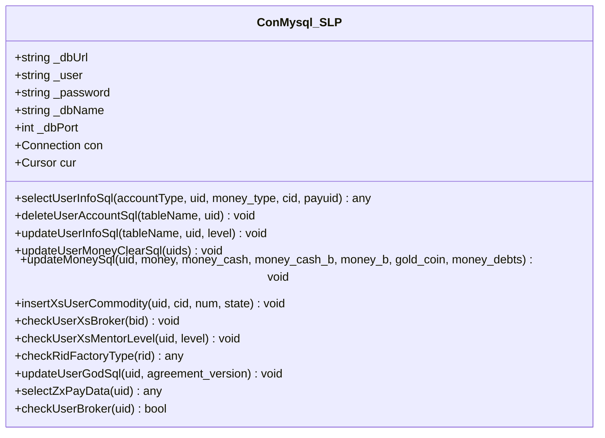
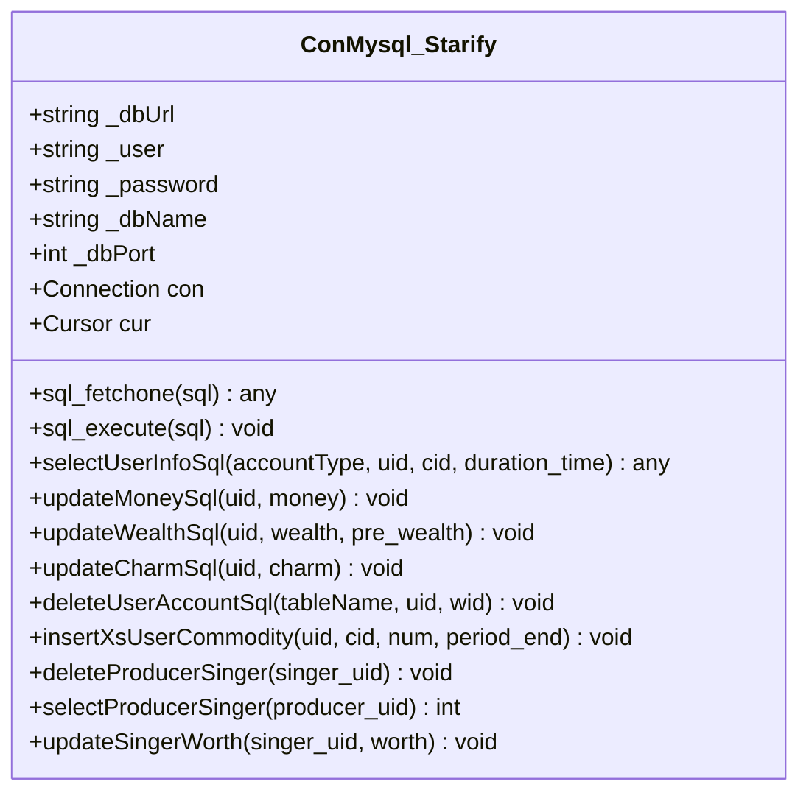
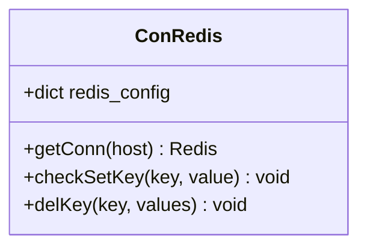
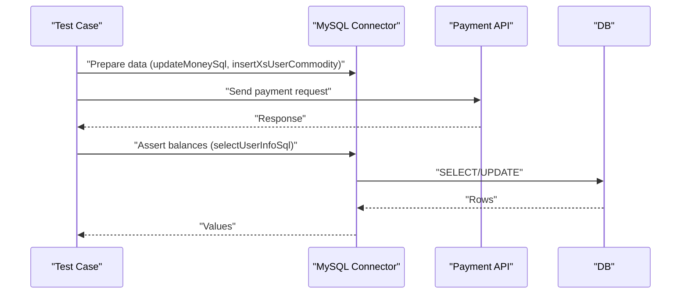
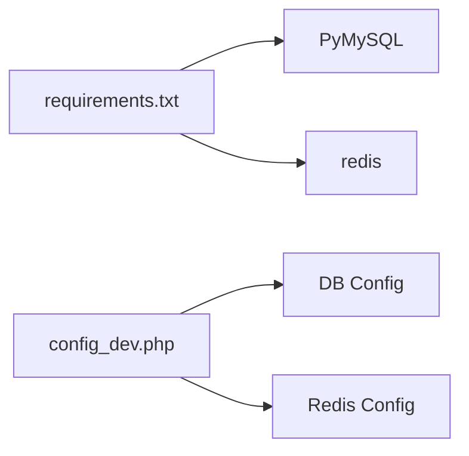

# Database Connectivity

<cite>
**Referenced Files in This Document**
- [conMysql.py](file://common/conMysql.py)
- [conPtMysql.py](file://common/conPtMysql.py)
- [conSlpMysql.py](file://common/conSlpMysql.py)
- [conStarifyMysql.py](file://common/conStarifyMysql.py)
- [conRedis.py](file://common/conRedis.py)
- [Config.py](file://common/Config.py)
- [requirements.txt](file://requirements.txt)
- [config_dev.php](file://others/config_dev.php)
- [test_pay_business.py](file://case/test_pay_business.py)
- [test_pt_bean.py](file://caseOversea/test_pt_bean.py)
- [test_gs_room.py](file://caseSlp/test_gs_room.py)
</cite>

## Table of Contents
1. [Introduction](#introduction)
2. [Project Structure](#project-structure)
3. [Core Components](#core-components)
4. [Architecture Overview](#architecture-overview)
5. [Detailed Component Analysis](#detailed-component-analysis)
6. [Dependency Analysis](#dependency-analysis)
7. [Performance Considerations](#performance-considerations)
8. [Troubleshooting Guide](#troubleshooting-guide)
9. [Conclusion](#conclusion)

## Introduction
This document explains database connectivity management across multiple platforms in the test automation suite. It focuses on:
- MySQL connection pool implementations for BB, PT, SLP, and Starify platforms
- Redis integration for session management and caching strategies
- Connection string formats, authentication mechanisms, and timeout configurations
- Error handling patterns, connection retry logic, and graceful degradation strategies
- Platform-specific connection requirements, SSL configurations, and performance optimization techniques

## Project Structure
The database connectivity is implemented via dedicated connection classes per platform under the common package, with shared configuration and Redis utilities.

**Diagram sources**
- [conMysql.py:8-25](file://common/conMysql.py#L8-L25)
- [conPtMysql.py:6-23](file://common/conPtMysql.py#L6-L23)
- [conSlpMysql.py:8-27](file://common/conSlpMysql.py#L8-L27)
- [conStarifyMysql.py:6-25](file://common/conStarifyMysql.py#L6-L25)
- [conRedis.py:4-15](file://common/conRedis.py#L4-L15)
- [Config.py:6-133](file://common/Config.py#L6-L133)
- [test_pay_business.py:1-11](file://case/test_pay_business.py#L1-L11)
- [test_pt_bean.py:1-9](file://caseOversea/test_pt_bean.py#L1-L9)
- [test_gs_room.py:1-15](file://caseSlp/test_gs_room.py#L1-L15)

**Section sources**
- [conMysql.py:8-25](file://common/conMysql.py#L8-L25)
- [conPtMysql.py:6-23](file://common/conPtMysql.py#L6-L23)
- [conSlpMysql.py:8-27](file://common/conSlpMysql.py#L8-L27)
- [conStarifyMysql.py:6-25](file://common/conStarifyMysql.py#L6-L25)
- [conRedis.py:4-15](file://common/conRedis.py#L4-L15)
- [Config.py:6-133](file://common/Config.py#L6-L133)

## Core Components
- BB MySQL connector: centralized connection and cursor initialized at module load; static methods encapsulate CRUD operations against BB schema.
- PT MySQL connector: similar pattern for PT environment with platform-specific queries and updates.
- SLP MySQL connector: includes additional SLP-specific logic such as guild membership checks and room factory type verification.
- Starify MySQL connector: simplified interface focused on Starify-specific balances and commodity operations.
- Redis connector: connection pooling for Redis with host selection and hash operations.

Key characteristics:
- Single connection per module initialization
- Autocommit enabled
- UTF-8 character set
- Ping-based keepalive on connect
- Manual transaction control via commit/rollback around operations

**Section sources**
- [conMysql.py:8-25](file://common/conMysql.py#L8-L25)
- [conPtMysql.py:6-23](file://common/conPtMysql.py#L6-L23)
- [conSlpMysql.py:8-27](file://common/conSlpMysql.py#L8-L27)
- [conStarifyMysql.py:6-25](file://common/conStarifyMysql.py#L6-L25)
- [conRedis.py:4-15](file://common/conRedis.py#L4-L15)

## Architecture Overview
The system initializes a single MySQL connection per platform module and reuses a shared cursor for all operations. Tests import the platform-specific connector and call static methods to query/update data. Redis is used for lightweight caching and session-related keys.

**Diagram sources**
- [test_pay_business.py:31-46](file://case/test_pay_business.py#L31-L46)
- [test_pt_bean.py:30-36](file://caseOversea/test_pt_bean.py#L30-L36)
- [test_gs_room.py:35-51](file://caseSlp/test_gs_room.py#L35-L51)
- [conMysql.py:28-204](file://common/conMysql.py#L28-L204)
- [conPtMysql.py:26-92](file://common/conPtMysql.py#L26-L92)
- [conSlpMysql.py:29-226](file://common/conSlpMysql.py#L29-L226)
- [conStarifyMysql.py:27-87](file://common/conStarifyMysql.py#L27-L87)
- [conRedis.py:11-28](file://common/conRedis.py#L11-L28)

## Detailed Component Analysis

### BB MySQL Connector (conMysql.py)
- Initialization: Host, user, password, database, port, charset, autocommit configured; selects target database and pings with reconnect.
- Operations: Static methods for selecting user info, deleting/commodities/profile updates, inserting boxes, updating money, clearing accounts, and checking/gifting.
- Transaction model: Uses commit/rollback around each operation; autocommit is enabled at connection level.

**Diagram sources**
- [conMysql.py:8-25](file://common/conMysql.py#L8-L25)
- [conMysql.py:28-530](file://common/conMysql.py#L28-L530)

**Section sources**
- [conMysql.py:8-25](file://common/conMysql.py#L8-L25)
- [conMysql.py:28-530](file://common/conMysql.py#L28-L530)

### PT MySQL Connector (conPtMysql.py)
- Initialization: Similar to BB with platform-specific defaults.
- Operations: Select user info, delete user data, update room/big area/language, clear money, update money, commodity insert, box insert, greedy prize, chatroom queries, popularity/vip updates.

**Diagram sources**
- [conPtMysql.py:6-23](file://common/conPtMysql.py#L6-L23)
- [conPtMysql.py:26-345](file://common/conPtMysql.py#L26-L345)

**Section sources**
- [conPtMysql.py:6-23](file://common/conPtMysql.py#L6-L23)
- [conPtMysql.py:26-345](file://common/conPtMysql.py#L26-L345)

### SLP MySQL Connector (conSlpMysql.py)
- Initialization: Same base pattern with SLP defaults.
- Operations: Extensive user info queries, deletions/updates for profile/popularity/pay change, commodity checks, guild membership verification, god agreement updates, and specialized queries like ZxPayData.

**Diagram sources**
- [conSlpMysql.py:8-27](file://common/conSlpMysql.py#L8-L27)
- [conSlpMysql.py:29-680](file://common/conSlpMysql.py#L29-L680)

**Section sources**
- [conSlpMysql.py:8-27](file://common/conSlpMysql.py#L8-L27)
- [conSlpMysql.py:29-680](file://common/conSlpMysql.py#L29-L680)

### Starify MySQL Connector (conStarifyMysql.py)
- Initialization: Base pattern with Starify defaults.
- Operations: Simplified balance and commodity queries, money/wealth/charm updates, commodity insert/delete, producer/singer relations cleanup and counts.

**Diagram sources**
- [conStarifyMysql.py:6-25](file://common/conStarifyMysql.py#L6-L25)
- [conStarifyMysql.py:27-148](file://common/conStarifyMysql.py#L27-L148)

**Section sources**
- [conStarifyMysql.py:6-25](file://common/conStarifyMysql.py#L6-L25)
- [conStarifyMysql.py:27-148](file://common/conStarifyMysql.py#L27-L148)

### Redis Integration (conRedis.py)
- Connection pooling: Creates a Redis client with a connection pool for a given host/port.
- Utilities: Add/set key if missing; delete hash fields for provided keys/values.

**Diagram sources**
- [conRedis.py:4-15](file://common/conRedis.py#L4-L15)
- [conRedis.py:17-28](file://common/conRedis.py#L17-L28)

**Section sources**
- [conRedis.py:4-15](file://common/conRedis.py#L4-L15)
- [conRedis.py:17-28](file://common/conRedis.py#L17-L28)

### Usage in Tests
- BB: Tests call BB MySQL connector to prepare data and validate balances after payment requests.
- PT: Tests call PT MySQL connector to configure gift settings and validate exchange flows.
- SLP: Tests call SLP MySQL connector to verify guild membership, room types, and payment outcomes.

**Diagram sources**
- [test_pay_business.py:31-46](file://case/test_pay_business.py#L31-L46)
- [test_pt_bean.py:30-36](file://caseOversea/test_pt_bean.py#L30-L36)
- [test_gs_room.py:35-51](file://caseSlp/test_gs_room.py#L35-L51)

**Section sources**
- [test_pay_business.py:18-46](file://case/test_pay_business.py#L18-L46)
- [test_pt_bean.py:19-36](file://caseOversea/test_pt_bean.py#L19-L36)
- [test_gs_room.py:21-52](file://caseSlp/test_gs_room.py#L21-L52)

## Dependency Analysis
- PyMySQL and Redis Python clients are declared in requirements.
- PHP configuration demonstrates additional DB/Redis setups for legacy systems, including charset and ports.

**Diagram sources**
- [requirements.txt:54-65](file://requirements.txt#L54-L65)
- [config_dev.php:29-198](file://others/config_dev.php#L29-L198)

**Section sources**
- [requirements.txt:54-65](file://requirements.txt#L54-L65)
- [config_dev.php:29-198](file://others/config_dev.php#L29-L198)

## Performance Considerations
- Connection reuse: Each platform module maintains a single connection and cursor, avoiding repeated handshake overhead.
- Autocommit: Enabled at connection level reduces transaction overhead for read/write operations.
- Character set: UTF-8 is used consistently; legacy PHP config shows utf8mb4 for broader Unicode support.
- Cursor usage: Shared cursor simplifies operations but may serialize concurrent access; consider per-operation cursors for heavy concurrency.
- Commit/rollback: Manual transaction control ensures atomicity but increases latency; batch operations could reduce round-trips.

[No sources needed since this section provides general guidance]

## Troubleshooting Guide
- Connection failures: The connectors initialize with ping and reconnect; if persistent failures occur, verify host/port credentials and network access.
- Transaction errors: Methods catch exceptions and rollback before committing; inspect logs for error messages printed during failures.
- Graceful degradation: If a specific query fails, the connector prints the error and returns safe defaults (e.g., zero or None) to prevent test crashes.
- Redis connectivity: Ensure Redis host/port match environment; connection pool is created per host.

**Section sources**
- [conMysql.py:39-73](file://common/conMysql.py#L39-L73)
- [conPtMysql.py:37-60](file://common/conPtMysql.py#L37-L60)
- [conSlpMysql.py:41-51](file://common/conSlpMysql.py#L41-L51)
- [conStarifyMysql.py:39-51](file://common/conStarifyMysql.py#L39-L51)
- [conRedis.py:12-15](file://common/conRedis.py#L12-L15)

## Conclusion
The test suite employs straightforward, single-connection-per-platform MySQL connectors with explicit transaction control and a minimal Redis client for caching. While this design is simple and effective for current test loads, consider adding:
- Explicit connection pool configuration for scalability
- Retry/backoff logic for transient failures
- SSL/TLS configuration for secure connections
- Per-operation cursors for concurrent access
- Centralized configuration management for hosts, ports, and credentials

[No sources needed since this section summarizes without analyzing specific files]