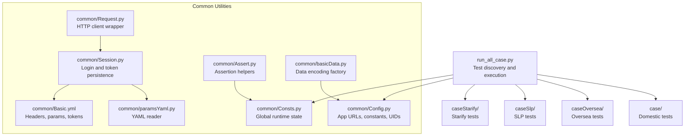
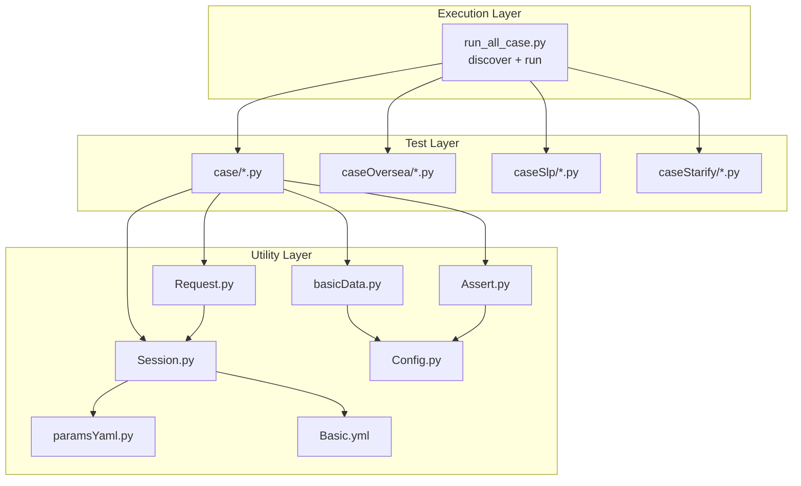
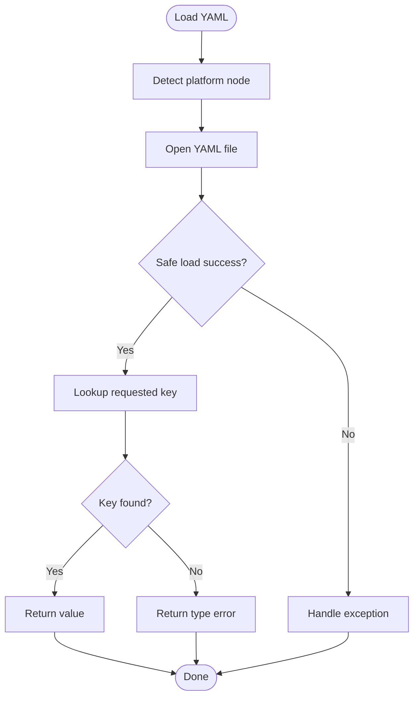
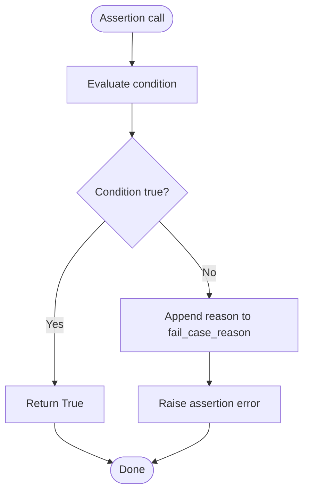
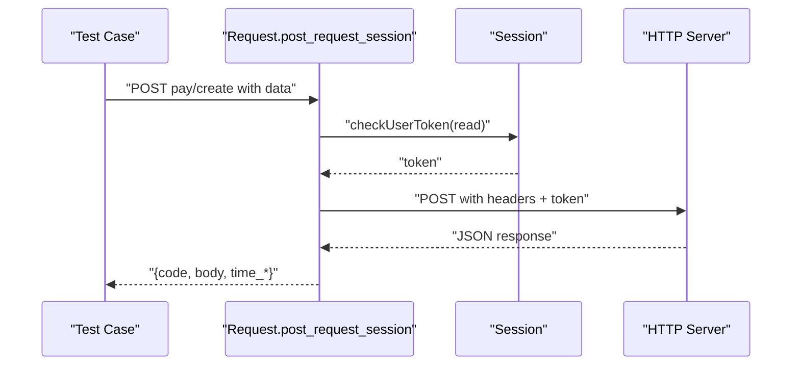
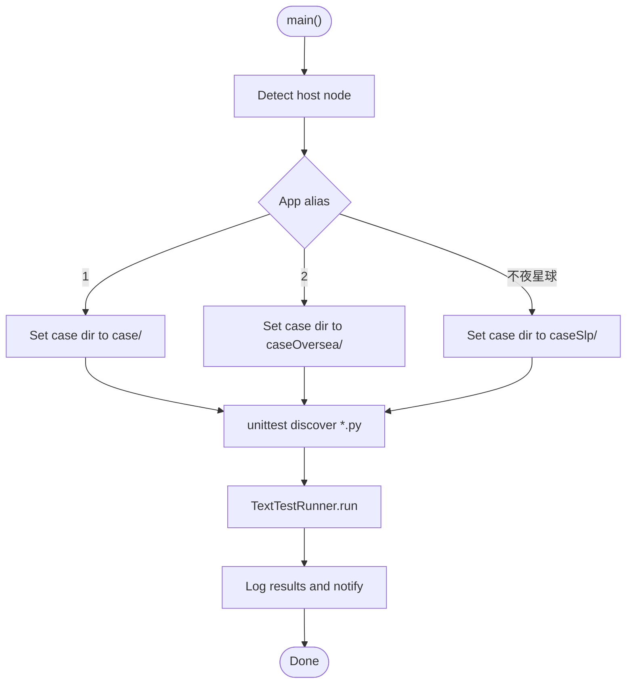
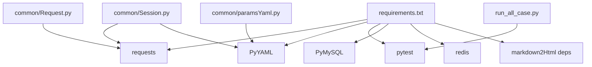

# Development and Extension

<cite>
**Referenced Files in This Document**
- [README.md](file://README.md)
- [requirements.txt](file://requirements.txt)
- [run_all_case.py](file://run_all_case.py)
- [Robot.py](file://Robot.py)
- [common/Config.py](file://common/Config.py)
- [common/Consts.py](file://common/Consts.py)
- [common/Basic.yml](file://common/Basic.yml)
- [common/paramsYaml.py](file://common/paramsYaml.py)
- [common/Session.py](file://common/Session.py)
- [common/Request.py](file://common/Request.py)
- [common/Assert.py](file://common/Assert.py)
- [common/basicData.py](file://common/basicData.py)
- [case/test_pay_bean.py](file://case/test_pay_bean.py)
</cite>

## Table of Contents
1. [Introduction](#introduction)
2. [Project Structure](#project-structure)
3. [Core Components](#core-components)
4. [Architecture Overview](#architecture-overview)
5. [Detailed Component Analysis](#detailed-component-analysis)
6. [Dependency Analysis](#dependency-analysis)
7. [Performance Considerations](#performance-considerations)
8. [Troubleshooting Guide](#troubleshooting-guide)
9. [Conclusion](#conclusion)
10. [Appendices](#appendices)

## Introduction
This document explains how to develop and extend the payment testing framework. It covers:
- Adding new payment scenarios via the data encoding factory
- Platform-specific extensions and configuration inheritance
- Custom assertion development
- Performance optimization techniques
- Plugin-like extension points for platforms and environments
- Guidelines for maintaining backward compatibility and contributing enhancements

The project uses Python with pytest, YAML-based configuration, and modular utilities for requests, sessions, assertions, and data encoding.

## Project Structure
The repository is organized by functional areas:
- common: Shared utilities (configuration, YAML loader, session management, HTTP requests, assertions, constants, data encoders)
- case: Payment test suites for domestic and oversea platforms
- caseOversea: Overseas platform tests
- caseSlp: SLP platform tests
- caseStarify: Starify platform tests
- probabilityTest: Probability-related tests
- tdr: TDR-related artifacts
- others: Environment and auxiliary scripts
- Top-level scripts: Test runner and CI helpers

**Diagram sources**
- [run_all_case.py:126-147](file://run_all_case.py#L126-L147)
- [common/Config.py:6-133](file://common/Config.py#L6-L133)
- [common/Consts.py:1-17](file://common/Consts.py#L1-L17)
- [common/Basic.yml:1-52](file://common/Basic.yml#L1-L52)
- [common/paramsYaml.py:8-32](file://common/paramsYaml.py#L8-L32)
- [common/Session.py:13-200](file://common/Session.py#L13-L200)
- [common/Request.py:17-60](file://common/Request.py#L17-L60)
- [common/Assert.py:11-96](file://common/Assert.py#L11-L96)
- [common/basicData.py:8-581](file://common/basicData.py#L8-L581)

**Section sources**
- [README.md:1-38](file://README.md#L1-L38)
- [run_all_case.py:126-147](file://run_all_case.py#L126-L147)

## Core Components
- Configuration and constants: centralized URLs, UIDs, and environment identifiers
- YAML-driven configuration: headers, login parameters, and tokens
- Session management: environment-aware login flows and token persistence
- HTTP client: request wrapper with timing and JSON parsing
- Assertions: standardized failure reporting and reasons
- Data encoding factory: scenario-driven payload construction
- Test runner: automatic test discovery and cross-platform routing

Key responsibilities:
- common/Config.py: centralizes app URLs, user IDs, room IDs, gift IDs, and environment aliases
- common/Basic.yml: stores platform-specific headers, mobile login params, and tokens
- common/paramsYaml.py: loads YAML safely across environments
- common/Session.py: orchestrates login per environment/app and persists tokens
- common/Request.py: wraps HTTP POST with token injection and timing metrics
- common/Assert.py: uniform assertion helpers with failure reason recording
- common/basicData.py: encodes payloads for multiple payment scenarios and platforms
- run_all_case.py: discovers tests by platform and executes them

**Section sources**
- [common/Config.py:6-133](file://common/Config.py#L6-L133)
- [common/Basic.yml:1-52](file://common/Basic.yml#L1-L52)
- [common/paramsYaml.py:8-32](file://common/paramsYaml.py#L8-L32)
- [common/Session.py:13-200](file://common/Session.py#L13-L200)
- [common/Request.py:17-60](file://common/Request.py#L17-L60)
- [common/Assert.py:11-96](file://common/Assert.py#L11-L96)
- [common/basicData.py:8-581](file://common/basicData.py#L8-L581)
- [run_all_case.py:126-147](file://run_all_case.py#L126-L147)

## Architecture Overview
The framework follows a layered design:
- Test layer: pytest-based test suites under case/, caseOversea/, caseSlp/, caseStarify/
- Utility layer: shared components in common/
- Configuration layer: YAML and Python constants
- Execution layer: run_all_case.py orchestrates discovery and execution

**Diagram sources**
- [run_all_case.py:126-147](file://run_all_case.py#L126-L147)
- [common/Session.py:13-200](file://common/Session.py#L13-L200)
- [common/Request.py:17-60](file://common/Request.py#L17-L60)
- [common/basicData.py:8-581](file://common/basicData.py#L8-L581)
- [common/Assert.py:11-96](file://common/Assert.py#L11-L96)
- [common/paramsYaml.py:8-32](file://common/paramsYaml.py#L8-L32)
- [common/Basic.yml:1-52](file://common/Basic.yml#L1-L52)
- [common/Config.py:6-133](file://common/Config.py#L6-L133)

## Detailed Component Analysis

### YAML Configuration System and Inheritance
- YAML files (common/Basic.yml) define platform-specific headers, mobile login parameters, and tokens.
- paramsYaml.Yaml reads YAML safely and handles platform differences via platform.node() checks.
- Session.getSession routes environment-specific login flows and writes tokens to disk for reuse.

**Diagram sources**
- [common/paramsYaml.py:8-32](file://common/paramsYaml.py#L8-L32)
- [common/Basic.yml:1-52](file://common/Basic.yml#L1-L52)

**Section sources**
- [common/paramsYaml.py:8-32](file://common/paramsYaml.py#L8-L32)
- [common/Basic.yml:1-52](file://common/Basic.yml#L1-L52)
- [common/Session.py:19-166](file://common/Session.py#L19-L166)

### Data Encoding Factory and Payment Scenarios
- basicData.encodeData constructs payloads for domestic scenarios.
- basicData.encodePtData constructs payloads for oversea scenarios.
- Both functions support multiple payType variants (e.g., package, chat-gift, shop-buy, exchange_gold, etc.) and return URL-encoded strings.

```mermaid
flowchart TD
Entry(["encodeData/encodePtData"]) --> SelectType{"payType"}
SelectType --> |package| BuildPkg["Build package payload"]
SelectType --> |package-more| BuildMore["Build multi-receiver payload"]
SelectType --> |package-exchange| BuildExchange["Build exchange payload"]
SelectType --> |chat-gift| BuildChat["Build chat-gift payload"]
SelectType --> |shop-buy| BuildShop["Build shop-buy payload"]
SelectType --> |shop-buy-box| BuildBox["Build shop-buy-box payload"]
SelectType --> |defend| BuildDefend["Build defend payload"]
SelectType --> |defend-upgrade| BuildUpg["Build defend-upgrade payload"]
SelectType --> |defend-break| BuildBreak["Build defend-break payload"]
SelectType --> |title| BuildTitle["Build title payload"]
SelectType --> |exchange_gold| BuildXGold["Build exchange_gold payload"]
SelectType --> |unity-game-buy| BuildUnity["Build unity-game-buy payload"]
SelectType --> |pub-drink-buy| BuildPub["Build pub-drink-buy payload"]
SelectType --> |deco-present| BuildDeco["Build deco-present payload"]
SelectType --> |banban-consume| BuildConsume["Build banban-consume payload"]
SelectType --> |other| RaiseErr["Raise error"]
BuildPkg --> Encode["_encode_data_helper"]
BuildMore --> Encode
BuildExchange --> Encode
BuildChat --> Encode
BuildShop --> Encode
BuildBox --> Encode
BuildDefend --> Encode
BuildUpg --> Encode
BuildBreak --> Encode
BuildTitle --> Encode
BuildXGold --> Encode
BuildUnity --> Encode
BuildPub --> Encode
BuildDeco --> Encode
BuildConsume --> Encode
Encode --> Return(["Return encoded data"])
RaiseErr --> Return
```

**Diagram sources**
- [common/basicData.py:8-581](file://common/basicData.py#L8-L581)

**Section sources**
- [common/basicData.py:8-581](file://common/basicData.py#L8-L581)

### Assertion Development and Failure Reporting
- Assert.assert_code, assert_equal, assert_body, assert_len, assert_between, assert_in_text provide standardized checks.
- On failure, reasons are appended to a global fail reason list for reporting.

**Diagram sources**
- [common/Assert.py:11-96](file://common/Assert.py#L11-L96)
- [common/Consts.py:7-8](file://common/Consts.py#L7-L8)

**Section sources**
- [common/Assert.py:11-96](file://common/Assert.py#L11-L96)
- [common/Consts.py:7-8](file://common/Consts.py#L7-L8)

### HTTP Client and Token Management
- Request.post_request_session injects a user token from Session and returns structured results with timing.
- Session.getSession selects environment-specific headers, params, and login URLs, then persists tokens to files.

**Diagram sources**
- [common/Request.py:17-60](file://common/Request.py#L17-L60)
- [common/Session.py:168-183](file://common/Session.py#L168-L183)

**Section sources**
- [common/Request.py:17-60](file://common/Request.py#L17-L60)
- [common/Session.py:168-183](file://common/Session.py#L168-L183)

### Test Discovery and Cross-Platform Execution
- run_all_case.all_case discovers tests under platform-specific directories.
- run_all_case.main routes execution based on the current host node and app alias.

**Diagram sources**
- [run_all_case.py:12-159](file://run_all_case.py#L12-L159)

**Section sources**
- [run_all_case.py:12-159](file://run_all_case.py#L12-L159)

## Dependency Analysis
External libraries are declared in requirements.txt and used across modules:
- requests: HTTP client
- pyyaml: YAML loading
- pytest: test framework
- Others: logging, MySQL, Redis, Markdown conversion, etc.

**Diagram sources**
- [requirements.txt:1-85](file://requirements.txt#L1-L85)
- [common/Request.py:5-14](file://common/Request.py#L5-L14)
- [common/paramsYaml.py:2-4](file://common/paramsYaml.py#L2-L4)
- [common/Session.py:6-14](file://common/Session.py#L6-L14)
- [run_all_case.py:4-10](file://run_all_case.py#L4-L10)

**Section sources**
- [requirements.txt:1-85](file://requirements.txt#L1-L85)

## Performance Considerations
- Timing measurement: Request wrapper captures millisecond and total time for each call.
- Conditional delays: Assertions introduce small sleeps on non-production nodes to mitigate RPC latency effects.
- Payload construction: URL encoding is centralized to avoid repeated transformations.
- Token reuse: Session persists tokens to reduce redundant login overhead.

Recommendations:
- Batch test runs to minimize repeated logins
- Use token caching and environment-specific login flows
- Avoid excessive retries inside assertions; prefer controlled retry decorators at test level
- Profile slow tests and isolate network-bound steps

**Section sources**
- [common/Request.py:48-59](file://common/Request.py#L48-L59)
- [common/Assert.py:17-18](file://common/Assert.py#L17-L18)
- [common/basicData.py:569-571](file://common/basicData.py#L569-L571)
- [common/Session.py:168-183](file://common/Session.py#L168-L183)

## Troubleshooting Guide
Common issues and resolutions:
- YAML load errors: Ensure keys exist and file paths are correct; verify platform.node() matches configured nodes.
- Missing tokens: Confirm token files exist and are readable; re-run login flow if empty.
- Assertion failures: Inspect fail_case_reason list entries recorded during assertion failures.
- Network errors: Verify HTTPS endpoints, disable SSL warnings only in controlled environments, and check server availability.
- Test discovery mismatch: Confirm platform alias and case directory mapping in run_all_case.

**Section sources**
- [common/paramsYaml.py:17-32](file://common/paramsYaml.py#L17-L32)
- [common/Session.py:168-183](file://common/Session.py#L168-L183)
- [common/Assert.py:23-25](file://common/Assert.py#L23-L25)
- [common/Request.py:35-46](file://common/Request.py#L35-L46)
- [run_all_case.py:126-147](file://run_all_case.py#L126-L147)

## Conclusion
The framework provides a robust foundation for payment testing across multiple platforms. Its modular design enables straightforward extension:
- Add new scenarios via the data encoding factory
- Extend YAML configurations for new environments
- Introduce custom assertions while preserving failure reporting
- Optimize performance through token reuse and careful retry strategies

## Appendices

### A. Extending Payment Scenarios
Steps:
- Define a new payType variant in basicData.encodeData or encodePtData
- Add required parameters and defaults
- Return the encoded payload via _encode_data_helper
- Reference gift/room/user IDs from Config constants where applicable

Best practices:
- Keep defaults consistent with existing patterns
- Validate parameter combinations before encoding
- Add unit tests for the new scenario

**Section sources**
- [common/basicData.py:8-581](file://common/basicData.py#L8-L581)
- [common/Config.py:60-129](file://common/Config.py#L60-L129)

### B. Platform-Specific Extensions
Approach:
- Add a new app alias in Config.appName and corresponding URLs
- Extend Session.getSession to support the new environment
- Add YAML entries for headers, params, and tokens in Basic.yml
- Map case directories and discovery logic in run_all_case

Backward compatibility:
- Preserve existing aliases and defaults
- Avoid changing established payType semantics
- Keep token file naming consistent

**Section sources**
- [common/Config.py:32-45](file://common/Config.py#L32-L45)
- [common/Session.py:19-166](file://common/Session.py#L19-L166)
- [common/Basic.yml:1-52](file://common/Basic.yml#L1-L52)
- [run_all_case.py:126-147](file://run_all_case.py#L126-L147)

### C. Custom Assertion Development
Guidelines:
- Mirror existing assertion signatures and error handling
- Append concise failure reasons to the global list
- Use JSON-safe text extraction for body checks
- Keep assertions focused and reusable

**Section sources**
- [common/Assert.py:11-96](file://common/Assert.py#L11-L96)
- [common/Consts.py:7-8](file://common/Consts.py#L7-L8)

### D. Performance Optimization Techniques
- Reuse tokens via Session persistence
- Minimize network calls inside tight loops
- Use selective waits and retries
- Profile and optimize heavy database or external service calls

**Section sources**
- [common/Session.py:168-183](file://common/Session.py#L168-L183)
- [common/Request.py:48-59](file://common/Request.py#L48-L59)
- [common/Assert.py:17-18](file://common/Assert.py#L17-L18)

### E. Contribution Guidelines
- Follow existing naming and structure conventions
- Add tests for new features
- Keep backward-compatible changes to core APIs
- Document new YAML keys and environment variables
- Update README if introducing major new capabilities

**Section sources**
- [README.md:23-38](file://README.md#L23-L38)