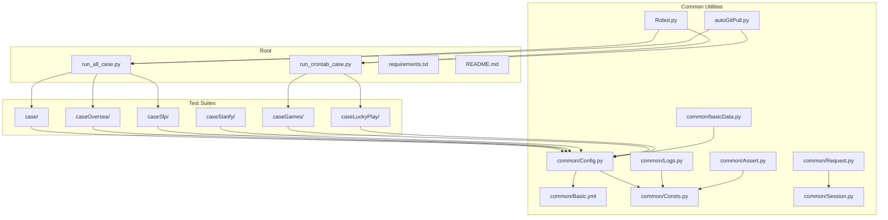
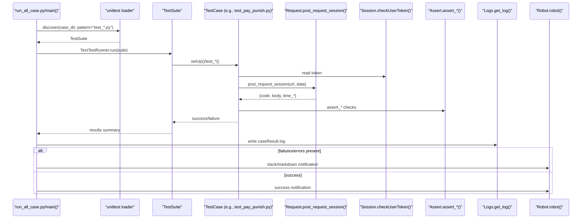
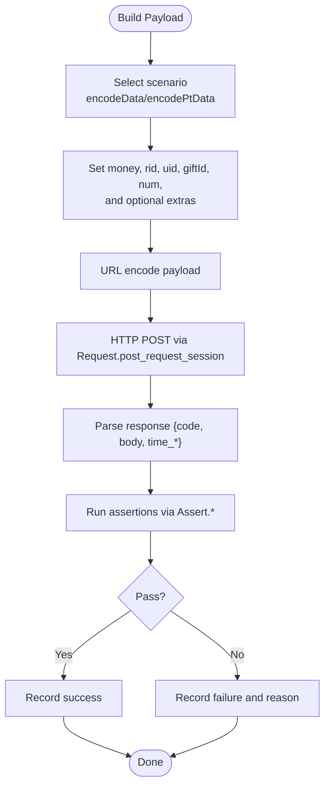
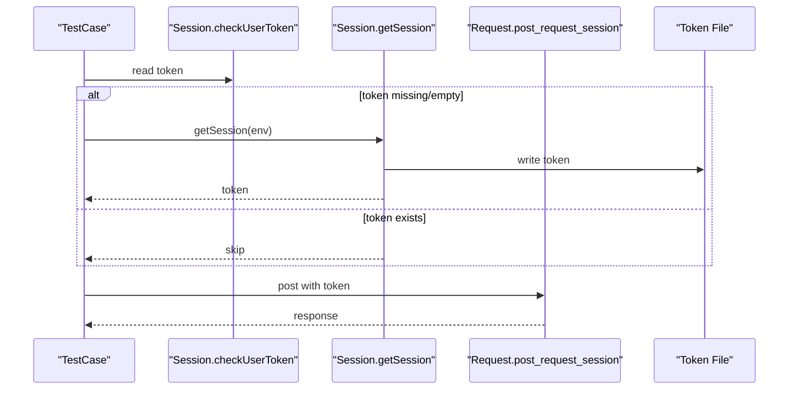
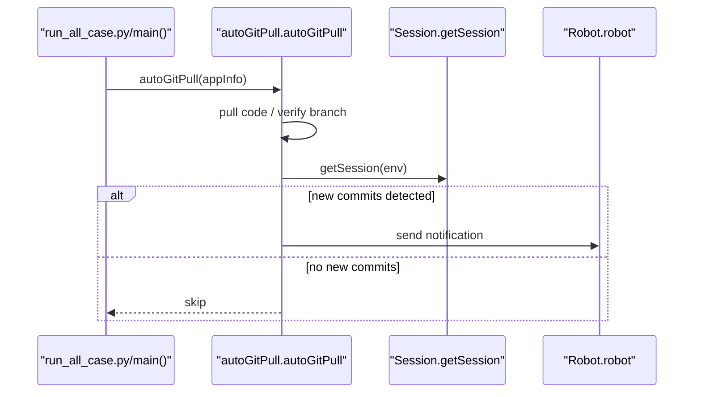
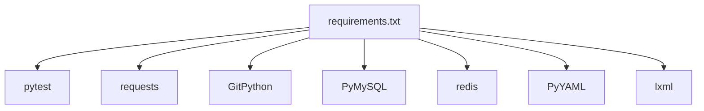

# Getting Started

<cite>
**Referenced Files in This Document**
- [README.md](file://README.md)
- [requirements.txt](file://requirements.txt)
- [run_all_case.py](file://run_all_case.py)
- [run_crontab_case.py](file://run_crontab_case.py)
- [common/Config.py](file://common/Config.py)
- [common/Basic.yml](file://common/Basic.yml)
- [common/Consts.py](file://common/Consts.py)
- [common/Logs.py](file://common/Logs.py)
- [common/Assert.py](file://common/Assert.py)
- [common/Request.py](file://common/Request.py)
- [common/basicData.py](file://common/basicData.py)
- [common/Session.py](file://common/Session.py)
- [Robot.py](file://Robot.py)
- [autoGitPull.py](file://autoGitPull.py)
- [case/test_pay_punish.py](file://case/test_pay_punish.py)
</cite>

## Table of Contents
1. [Introduction](#introduction)
2. [Project Structure](#project-structure)
3. [Core Components](#core-components)
4. [Architecture Overview](#architecture-overview)
5. [Detailed Component Analysis](#detailed-component-analysis)
6. [Dependency Analysis](#dependency-analysis)
7. [Performance Considerations](#performance-considerations)
8. [Troubleshooting Guide](#troubleshooting-guide)
9. [Conclusion](#conclusion)
10. [Appendices](#appendices)

## Introduction
This guide helps you set up and run the QA Payment Testing Framework quickly. It covers prerequisites, environment setup, installation, configuration, test execution, and troubleshooting. The framework supports multiple product lines and automates test discovery and reporting.

## Project Structure
The repository is organized into feature-based and capability-based folders:
- case: Payment test suites for the main product line
- caseOversea: Overseas product payment tests
- caseSlp: “Sleepless” (SLP) product payment tests
- caseStarify: Starify product payment tests
- caseGames, caseLuckyPlay: Additional game and play-related suites
- common: Shared utilities for configuration, HTTP requests, assertions, logging, sessions, and data builders
- probabilityTest: Optional probability-related test assets
- Top-level scripts: run_all_case.py and run_crontab_case.py orchestrate test runs
- Others: auxiliary scripts and configs

**Diagram sources**
- [run_all_case.py:126-147](file://run_all_case.py#L126-L147)
- [run_crontab_case.py:9-24](file://run_crontab_case.py#L9-L24)
- [common/Config.py:6-45](file://common/Config.py#L6-L45)
- [common/Basic.yml:1-52](file://common/Basic.yml#L1-L52)
- [common/Consts.py:4-16](file://common/Consts.py#L4-L16)
- [common/Logs.py:8-47](file://common/Logs.py#L8-L47)
- [common/Assert.py:11-96](file://common/Assert.py#L11-L96)
- [common/Request.py:17-59](file://common/Request.py#L17-L59)
- [common/basicData.py:8-325](file://common/basicData.py#L8-L325)
- [common/Session.py:13-200](file://common/Session.py#L13-L200)
- [Robot.py:6-34](file://Robot.py#L6-L34)
- [autoGitPull.py:114-192](file://autoGitPull.py#L114-L192)

**Section sources**
- [README.md:1-38](file://README.md#L1-L38)
- [run_all_case.py:126-147](file://run_all_case.py#L126-L147)
- [run_crontab_case.py:9-24](file://run_crontab_case.py#L9-L24)

## Core Components
- Configuration and environment: central configuration, environment hosts, UIDs, and paths
- Logging: unified logger with rotating files and console output
- HTTP client: request wrapper with token injection and response parsing
- Data builders: helpers to construct payment payloads for multiple scenarios
- Assertions: standardized assertion helpers for response codes, bodies, equality, and ranges
- Sessions: token acquisition and persistence for multiple apps/environments
- Notifications: Slack/WeChat integrations for test results and code updates
- Automation: automatic Git pulls and branch checks with notifications

Key responsibilities:
- run_all_case.py orchestrates test discovery and execution across suites
- run_crontab_case.py runs targeted suites for scheduled tasks
- common/Config.py defines base paths, hosts, UIDs, and branch settings
- common/Logs.py creates loggers and handlers under ./log
- common/Request.py posts requests with tokens and parses JSON
- common/basicData.py encodes payloads for various payment flows
- common/Assert.py validates outcomes consistently
- common/Session.py obtains and persists tokens per environment/app
- Robot.py sends notifications to configured channels
- autoGitPull.py pulls code, verifies branches, and notifies on changes

**Section sources**
- [common/Config.py:6-133](file://common/Config.py#L6-L133)
- [common/Logs.py:8-47](file://common/Logs.py#L8-L47)
- [common/Request.py:17-59](file://common/Request.py#L17-L59)
- [common/basicData.py:8-325](file://common/basicData.py#L8-L325)
- [common/Assert.py:11-96](file://common/Assert.py#L11-L96)
- [common/Session.py:13-200](file://common/Session.py#L13-L200)
- [Robot.py:6-34](file://Robot.py#L6-L34)
- [autoGitPull.py:114-192](file://autoGitPull.py#L114-L192)

## Architecture Overview
The framework discovers tests automatically, executes them, and reports results. It integrates with external systems for authentication, database checks, and notifications.

**Diagram sources**
- [run_all_case.py:12-124](file://run_all_case.py#L12-L124)
- [run_all_case.py:126-147](file://run_all_case.py#L126-L147)
- [case/test_pay_punish.py:13-42](file://case/test_pay_punish.py#L13-L42)
- [common/Request.py:17-59](file://common/Request.py#L17-L59)
- [common/Session.py:168-182](file://common/Session.py#L168-L182)
- [common/Assert.py:11-96](file://common/Assert.py#L11-L96)
- [common/Logs.py:8-47](file://common/Logs.py#L8-L47)
- [Robot.py:6-34](file://Robot.py#L6-L34)

## Detailed Component Analysis

### Prerequisites and Setup
- Python version: The project uses Python 3. The test runner relies on unittest and pytest packages. Ensure your environment matches the pinned dependencies.
- System dependencies:
  - GitPython for automated code pulls
  - Requests and related HTTP libraries for API calls
  - MySQL connectors and Redis clients as referenced by common modules
- Environment setup:
  - Install dependencies via pip using the provided requirements file
  - Configure environment-specific YAML and tokens as described below

Installation steps:
1. Clone or copy the repository locally
2. Create a virtual environment and activate it
3. Install dependencies:
   - pip install -r requirements.txt
4. Verify installation by running a simple Python import for key modules (requests, git, yaml)
5. Prepare configuration files and tokens (see Configuration section)

Notes:
- The project README highlights pytest usage rules and mentions installing GitPython for specific workflows.

**Section sources**
- [requirements.txt:1-85](file://requirements.txt#L1-L85)
- [README.md:23-37](file://README.md#L23-L37)

### Configuration Options
- Base paths and hosts:
  - BASE_PATH: resolved from the common module’s location
  - appInfo: domain endpoints for different environments
  - codeInfo: local paths and branch names for backend services
  - appName: mapping of identifiers to internal names
  - linux_node: server hostnames for CI-like execution
- Test endpoints:
  - pay_url, pt_mobile_login_url, slp_mobile_login_url
- User and role IDs:
  - bb_user, live_role, pt_user, pt_room, giftId, pt_giftId
- YAML credentials:
  - Basic.yml stores headers, mobile login params, and tokens per environment

How to configure:
- Adjust common/Config.py for your environment’s domains and paths
- Populate tokens via common/Session.py token persistence files
- Ensure Basic.yml contains correct headers and params for your environment

**Section sources**
- [common/Config.py:6-133](file://common/Config.py#L6-L133)
- [common/Basic.yml:1-52](file://common/Basic.yml#L1-L52)

### Test Discovery and Execution
- Automatic discovery:
  - run_all_case.py builds a suite by discovering test files matching test_*.py under selected directories
  - run_crontab_case.py targets specific suites and files for scheduled runs
- Execution:
  - Tests inherit unittest.TestCase and use decorators like @Retry for resilience
  - Each test constructs payloads via common/basicData.py, posts via common/Request.py, and asserts via common/Assert.py
- Logging and notifications:
  - Results logged to ./log with rotating handlers
  - Notifications sent via Robot.py to Slack/WeChat depending on mode

Quick start examples:
- Run all cases for the main product line:
  - python run_all_case.py
- Run crontab suite for overseas games:
  - python run_crontab_case.py

Interpreting results:
- Look for caseResult.log entries summarizing total, failures, and errors
- Review failCase.log for failure/error details
- Inspect Slack/WeChat notifications for quick status

**Section sources**
- [run_all_case.py:126-147](file://run_all_case.py#L126-L147)
- [run_crontab_case.py:9-24](file://run_crontab_case.py#L9-L24)
- [case/test_pay_punish.py:13-42](file://case/test_pay_punish.py#L13-L42)
- [common/Assert.py:11-96](file://common/Assert.py#L11-L96)
- [common/Logs.py:8-47](file://common/Logs.py#L8-L47)
- [Robot.py:6-34](file://Robot.py#L6-L34)

### Data Builders and Assertions
- Payload construction:
  - common/basicData.py provides encodeData and encodePtData to build request payloads for multiple payment scenarios
- Assertions:
  - common/Assert.py offers assert_code, assert_body, assert_equal, assert_len, assert_in_text, and assert_between

**Diagram sources**
- [common/basicData.py:8-325](file://common/basicData.py#L8-L325)
- [common/Request.py:17-59](file://common/Request.py#L17-L59)
- [common/Assert.py:11-96](file://common/Assert.py#L11-L96)

**Section sources**
- [common/basicData.py:8-325](file://common/basicData.py#L8-L325)
- [common/Assert.py:11-96](file://common/Assert.py#L11-L96)

### Authentication and Sessions
- Token acquisition:
  - common/Session.py handles login flows and writes tokens to per-app token files
- Token usage:
  - common/Request.py reads tokens and injects them into outgoing requests
- Fallbacks:
  - If primary login fails, the framework attempts backup token retrieval

**Diagram sources**
- [common/Session.py:168-182](file://common/Session.py#L168-L182)
- [common/Session.py:19-104](file://common/Session.py#L19-L104)
- [common/Request.py:17-59](file://common/Request.py#L17-L59)

**Section sources**
- [common/Session.py:13-200](file://common/Session.py#L13-L200)
- [common/Request.py:17-59](file://common/Request.py#L17-L59)

### Notifications and Automation
- Notifications:
  - Robot.py supports multiple modes (success, fail, markdown, icon, slack, slack_pt) and targets (Slack/WeChat)
- Automated code updates:
  - autoGitPull.py pulls code from configured paths, verifies branches, and notifies on changes

**Diagram sources**
- [run_all_case.py:12-124](file://run_all_case.py#L12-L124)
- [autoGitPull.py:114-192](file://autoGitPull.py#L114-L192)
- [Robot.py:6-34](file://Robot.py#L6-L34)

**Section sources**
- [Robot.py:6-34](file://Robot.py#L6-L34)
- [autoGitPull.py:114-192](file://autoGitPull.py#L114-L192)

## Dependency Analysis
External dependencies are declared in requirements.txt. Core categories include:
- HTTP and networking: requests, urllib3, tornado
- YAML and configuration: pyyaml
- Testing: pytest, pluggy, attrs
- Git integration: GitPython
- Database and cache: PyMySQL, redis
- Utilities: lxml, MarkupSafe, six, typing-extensions, zope.interface

**Diagram sources**
- [requirements.txt:1-85](file://requirements.txt#L1-L85)

**Section sources**
- [requirements.txt:1-85](file://requirements.txt#L1-L85)

## Performance Considerations
- Network latency: Some assertions introduce small delays to accommodate RPC timing; adjust as needed for your environment
- Logging overhead: Rotating file handlers are efficient; avoid excessive debug-level logs in CI
- Payload building: URL encoding is straightforward; keep payload sizes minimal for faster tests
- Concurrency: The project includes concurrent test files; use them judiciously to avoid flakiness

[No sources needed since this section provides general guidance]

## Troubleshooting Guide
Common setup and runtime issues:
- Missing or outdated dependencies:
  - Reinstall with pip install -r requirements.txt
- GitPython errors during automated pulls:
  - Ensure Git is installed and accessible; verify repository paths in common/Config.py
- Token file empty or missing:
  - Run a login flow via Session.getSession to populate token files
- Branch mismatch during code update:
  - Align local branch with expected branch in common/Config.py
- SSL warnings or connection issues:
  - Disable SSL verification only for development; ensure certificates are valid in staging/production
- Test failures due to timing:
  - Add explicit waits or retries around asynchronous events (e.g., NSQ message processing)
- Slack/WeChat notifications not received:
  - Confirm webhook URLs are configured in Robot.py and the correct bot/channel is used

**Section sources**
- [autoGitPull.py:164-167](file://autoGitPull.py#L164-L167)
- [common/Session.py:168-182](file://common/Session.py#L168-L182)
- [Robot.py:6-34](file://Robot.py#L6-L34)

## Conclusion
You now have the essentials to install, configure, and run the QA Payment Testing Framework. Use run_all_case.py for full suite execution and run_crontab_case.py for scheduled tasks. Customize common/Config.py and Basic.yml to match your environment, and rely on the shared utilities for robust, repeatable payment tests.

[No sources needed since this section summarizes without analyzing specific files]

## Appendices

### Quick Start Checklist
- Install dependencies: pip install -r requirements.txt
- Configure environment endpoints and paths in common/Config.py
- Provide tokens via common/Session.py or pre-populate token files
- Run tests:
  - Full suite: python run_all_case.py
  - Crontab suite: python run_crontab_case.py
- Review logs in ./log and notifications in Slack/WeChat

**Section sources**
- [requirements.txt:1-85](file://requirements.txt#L1-L85)
- [common/Config.py:6-133](file://common/Config.py#L6-L133)
- [common/Session.py:168-182](file://common/Session.py#L168-L182)
- [run_all_case.py:150-159](file://run_all_case.py#L150-L159)
- [run_crontab_case.py:74-79](file://run_crontab_case.py#L74-L79)