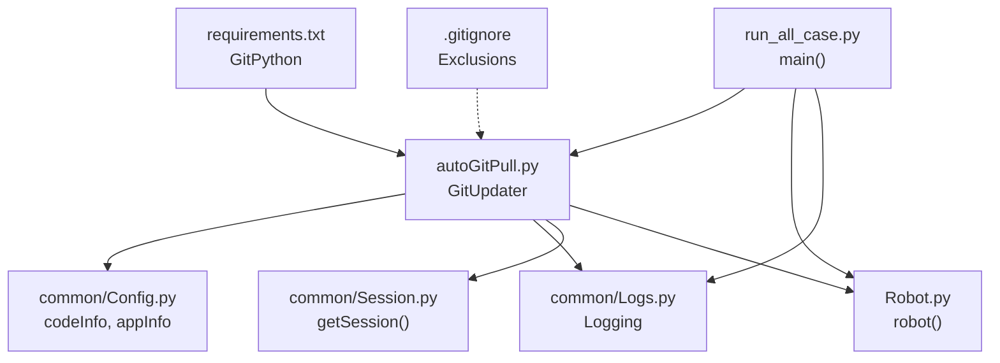
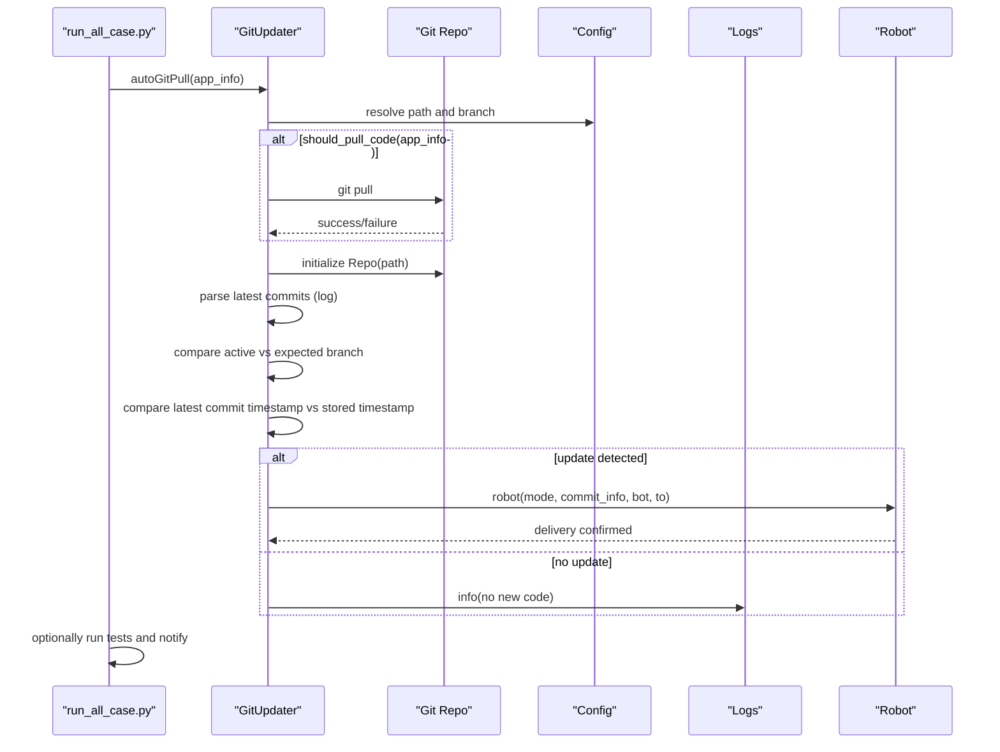
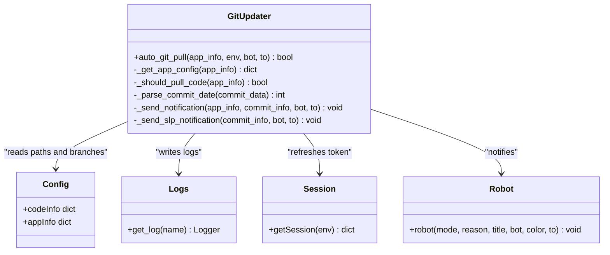
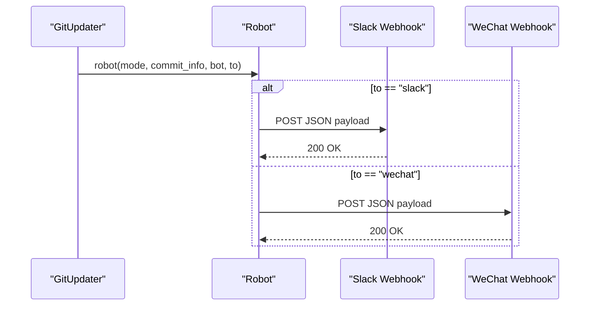
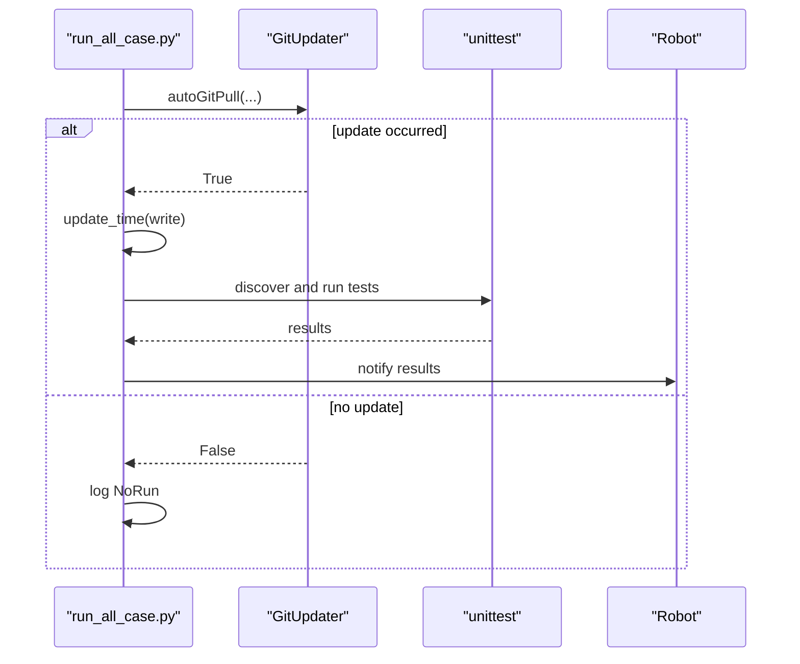
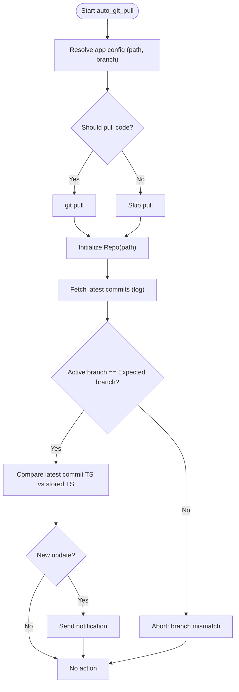
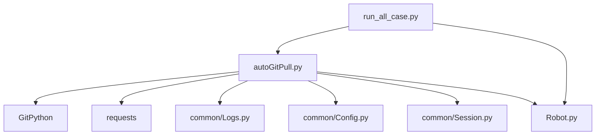
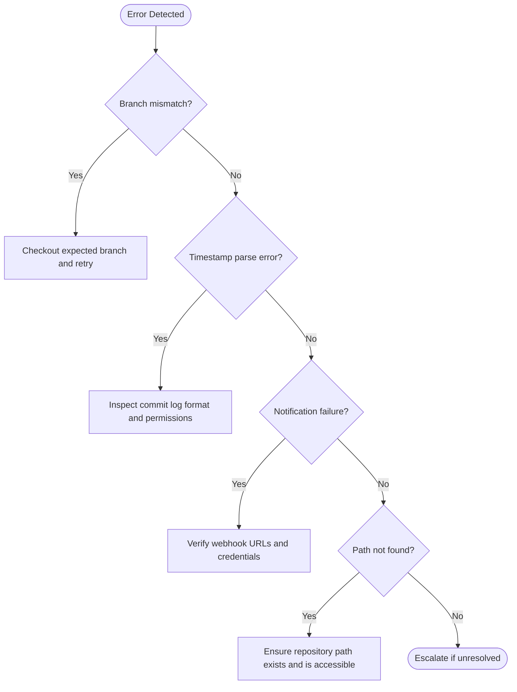

# Git Repository Synchronization

<cite>
**Referenced Files in This Document**
- [autoGitPull.py](file://autoGitPull.py)
- [.gitignore](file://.gitignore)
- [README.md](file://README.md)
- [requirements.txt](file://requirements.txt)
- [Robot.py](file://Robot.py)
- [common/Config.py](file://common/Config.py)
- [common/Consts.py](file://common/Consts.py)
- [common/Session.py](file://common/Session.py)
- [common/Logs.py](file://common/Logs.py)
- [run_all_case.py](file://run_all_case.py)
- [run_crontab_case.py](file://run_crontab_case.py)
- [common/method.py](file://common/method.py)
</cite>

## Table of Contents
1. [Introduction](#introduction)
2. [Project Structure](#project-structure)
3. [Core Components](#core-components)
4. [Architecture Overview](#architecture-overview)
5. [Detailed Component Analysis](#detailed-component-analysis)
6. [Dependency Analysis](#dependency-analysis)
7. [Performance Considerations](#performance-considerations)
8. [Troubleshooting Guide](#troubleshooting-guide)
9. [Conclusion](#conclusion)
10. [Appendices](#appendices)

## Introduction
This document describes an automated Git repository synchronization system designed to monitor, pull, and validate code updates across multiple repositories, and to notify stakeholders upon changes. It focuses on the autoGitPull.py module, its integration with the broader test automation framework, and operational procedures for branch management, conflict resolution, security, and backups.

## Project Structure
The repository integrates a dedicated synchronization module with a test runner and notification infrastructure:
- autoGitPull.py: Implements Git operations, branch verification, and notifications.
- run_all_case.py: Orchestrates automated test runs after code updates.
- Robot.py: Provides messaging integrations (Slack, WeChat) for notifications.
- common/*: Shared utilities for configuration, logging, sessions, constants, and helpers.
- .gitignore: Excludes IDE metadata, logs, temporary timestamps, and sensitive tokens.
- requirements.txt: Declares GitPython and other runtime dependencies.

**Diagram sources**
- [autoGitPull.py:114-191](file://autoGitPull.py#L114-L191)
- [common/Config.py:17-31](file://common/Config.py#L17-L31)
- [common/Logs.py:8-47](file://common/Logs.py#L8-L47)
- [common/Session.py:20-68](file://common/Session.py#L20-L68)
- [Robot.py:6-34](file://Robot.py#L6-L34)
- [run_all_case.py:12-124](file://run_all_case.py#L12-L124)
- [requirements.txt:25](file://requirements.txt#L25)
- [.gitignore:1-10](file://.gitignore#L1-L10)

**Section sources**
- [autoGitPull.py:114-191](file://autoGitPull.py#L114-L191)
- [run_all_case.py:12-124](file://run_all_case.py#L12-L124)
- [.gitignore:1-10](file://.gitignore#L1-L10)
- [requirements.txt:25](file://requirements.txt#L25)

## Core Components
- GitUpdater: Central class performing Git operations, branch checks, commit-time comparisons, and notifications.
- Configuration: Centralized repository paths and branch names via common/Config.py.
- Logging: Structured logs for pull actions, updates, and errors.
- Notifications: Slack/WeChat messaging via Robot.py.
- Test orchestration: run_all_case.py coordinates post-update test runs and notifications.
- Session management: common/Session.py obtains tokens for environment-specific operations.

Key responsibilities:
- Pull code from remote repositories when applicable.
- Verify active branch matches expected branch.
- Compare latest commit timestamp against persisted timestamp.
- Notify stakeholders on updates.
- Integrate with test runner to execute automated suites after updates.

**Section sources**
- [autoGitPull.py:56-191](file://autoGitPull.py#L56-L191)
- [common/Config.py:17-31](file://common/Config.py#L17-L31)
- [common/Logs.py:8-47](file://common/Logs.py#L8-L47)
- [Robot.py:6-34](file://Robot.py#L6-L34)
- [run_all_case.py:12-124](file://run_all_case.py#L12-L124)
- [common/Session.py:20-68](file://common/Session.py#L20-L68)

## Architecture Overview
The system follows a deterministic pipeline per application:
1. Resolve application configuration (paths and branches).
2. Optionally pull code from origin.
3. Initialize repository and compute session token.
4. Fetch recent commits and parse timestamps.
5. Validate active branch against expected branch.
6. Compare latest commit timestamp with stored timestamp.
7. Notify stakeholders if updates are detected.
8. Trigger test suite execution when appropriate.

**Diagram sources**
- [run_all_case.py:12-124](file://run_all_case.py#L12-L124)
- [autoGitPull.py:114-191](file://autoGitPull.py#L114-L191)
- [common/Config.py:17-31](file://common/Config.py#L17-L31)
- [Robot.py:6-34](file://Robot.py#L6-L34)

## Detailed Component Analysis

### GitUpdater Class
Responsibilities:
- Resolve application-specific configuration (path, branch, environment, bot).
- Conditionally pull code from remote.
- Initialize repository and refresh session token.
- Parse commit log and compare timestamps.
- Enforce branch correctness.
- Dispatch notifications for detected updates.

**Diagram sources**
- [autoGitPull.py:56-191](file://autoGitPull.py#L56-L191)
- [common/Config.py:17-31](file://common/Config.py#L17-L31)
- [common/Logs.py:8-47](file://common/Logs.py#L8-L47)
- [common/Session.py:20-68](file://common/Session.py#L20-L68)
- [Robot.py:6-34](file://Robot.py#L6-L34)

**Section sources**
- [autoGitPull.py:56-191](file://autoGitPull.py#L56-L191)

### Notification Pipeline
- Modes: slack, slack_pt, markdown, icon, fail, success.
- Routing depends on application type and target (slack or wechat).
- SLP-specific routing supports slack or markdown targets.

**Diagram sources**
- [autoGitPull.py:93-112](file://autoGitPull.py#L93-L112)
- [Robot.py:6-34](file://Robot.py#L6-L34)

**Section sources**
- [autoGitPull.py:93-112](file://autoGitPull.py#L93-L112)
- [Robot.py:6-34](file://Robot.py#L6-L34)

### Test Orchestration After Updates
- run_all_case.py invokes GitUpdater per application, writes a timestamp on update, and runs test suites.
- Notifications are emitted to Slack channels based on outcomes.

**Diagram sources**
- [run_all_case.py:12-124](file://run_all_case.py#L12-L124)
- [autoGitPull.py:114-191](file://autoGitPull.py#L114-L191)

**Section sources**
- [run_all_case.py:12-124](file://run_all_case.py#L12-L124)

### Branch Management and Conflict Resolution Strategies
- Branch verification: The system compares the active branch with the configured expected branch and aborts if they differ.
- Conflict resolution: The system does not automatically merge or resolve conflicts; it relies on manual intervention to align branches before subsequent runs.
- Pull behavior: Code is pulled only for selected applications; others skip the pull step.

**Diagram sources**
- [autoGitPull.py:114-191](file://autoGitPull.py#L114-L191)

**Section sources**
- [autoGitPull.py:78-80](file://autoGitPull.py#L78-L80)
- [autoGitPull.py:164-167](file://autoGitPull.py#L164-L167)

### .gitignore Configuration
Exclusions:
- IDE metadata and workspace files.
- Log directory.
- Temporary timestamp file used by the updater.
- Sensitive token files for user sessions.
- Python bytecode caches.

These exclusions protect developer environments and CI systems from committing transient or sensitive data.

**Section sources**
- [.gitignore:1-10](file://.gitignore#L1-L10)

### Setup Procedures
- Dependencies: Install GitPython and other packages declared in requirements.txt.
- Remote repositories: Paths in common/Config.py define local working directories; ensure these correspond to repositories initialized with correct remotes.
- Automated schedules: Use external scheduling (e.g., cron) to invoke run_all_case.py or targeted scripts periodically.

Operational notes:
- The updater writes a timestamp file to track last processed commit time.
- On first run, the timestamp file is initialized with a default value if missing.

**Section sources**
- [requirements.txt:25](file://requirements.txt#L25)
- [common/Config.py:17-31](file://common/Config.py#L17-L31)
- [autoGitPull.py:194-228](file://autoGitPull.py#L194-L228)

### Common Git Operations During Synchronization
- Pull: Performed conditionally for supported applications.
- Log parsing: Uses Git log with a structured format to extract commit metadata.
- Branch inspection: Compares active branch to configured branch.
- Timestamp comparison: Ensures notifications are sent only when newer commits are detected.

Examples of operations are referenced in the code paths below.

**Section sources**
- [autoGitPull.py:139-144](file://autoGitPull.py#L139-L144)
- [autoGitPull.py:154-158](file://autoGitPull.py#L154-L158)
- [autoGitPull.py:161-162](file://autoGitPull.py#L161-L162)
- [autoGitPull.py:170-171](file://autoGitPull.py#L170-L171)

## Dependency Analysis
External and internal dependencies:
- GitPython: Used for repository operations and log parsing.
- Requests: Used by Robot.py for webhook delivery.
- Logging and configuration: Provided by common modules.

**Diagram sources**
- [autoGitPull.py:5-14](file://autoGitPull.py#L5-L14)
- [requirements.txt:25](file://requirements.txt#L25)
- [Robot.py:2](file://Robot.py#L2)
- [run_all_case.py:5-6](file://run_all_case.py#L5-L6)

**Section sources**
- [requirements.txt:25](file://requirements.txt#L25)
- [autoGitPull.py:5-14](file://autoGitPull.py#L5-L14)
- [Robot.py:2](file://Robot.py#L2)
- [run_all_case.py:5-6](file://run_all_case.py#L5-L6)

## Performance Considerations
- Minimizing redundant pulls: The updater skips pulling for specific applications, reducing network overhead.
- Efficient timestamp checks: Using a single timestamp file avoids expensive repeated scans.
- Logging rotation: Timed rotating handlers keep log sizes manageable.

Recommendations:
- Keep Git operations scoped to necessary repositories.
- Monitor log file growth and adjust rotation settings as needed.
- Consider batching notifications to reduce webhook traffic.

**Section sources**
- [autoGitPull.py:78-80](file://autoGitPull.py#L78-L80)
- [common/Logs.py:37-47](file://common/Logs.py#L37-L47)

## Troubleshooting Guide
Common issues and resolutions:
- Branch mismatch: If the active branch differs from the expected branch, the process aborts. Align the working branch manually before retrying.
- Commit timestamp parsing errors: Malformed commit metadata can cause parsing failures. Verify repository log format and permissions.
- Missing timestamp file: On first run, the file is initialized with a default timestamp. Subsequent reads rely on this file.
- Notification failures: Review webhook URLs and credentials in Robot.py. Confirm network connectivity and response codes.
- Path errors: Ensure repository paths in common/Config.py exist and are accessible.

**Diagram sources**
- [autoGitPull.py:164-167](file://autoGitPull.py#L164-L167)
- [autoGitPull.py:89-91](file://autoGitPull.py#L89-L91)
- [Robot.py:36-43](file://Robot.py#L36-L43)
- [common/method.py:131-134](file://common/method.py#L131-L134)

**Section sources**
- [autoGitPull.py:164-167](file://autoGitPull.py#L164-L167)
- [autoGitPull.py:89-91](file://autoGitPull.py#L89-L91)
- [Robot.py:36-43](file://Robot.py#L36-L43)
- [common/method.py:131-134](file://common/method.py#L131-L134)

## Conclusion
The automated Git synchronization system provides a robust mechanism to detect and react to code updates across multiple repositories while maintaining strict branch discipline and delivering timely notifications. By combining GitPython for repository operations, structured logging, and a flexible notification pipeline, it integrates seamlessly with the test automation workflow. Adhering to the outlined setup, branch management, and troubleshooting practices ensures reliable and secure automated operations.

## Appendices

### Security Considerations
- Token exposure: Sensitive token files are excluded by .gitignore. Ensure secrets are not committed and restrict file permissions.
- Webhook security: Protect webhook endpoints and consider validating signatures if supported.
- SSH keys: While the updater uses GitPython’s command interface, ensure remote access is secured and credentials are managed securely.

**Section sources**
- [.gitignore:5](file://.gitignore#L5)
- [common/Session.py:168-182](file://common/Session.py#L168-L182)
- [Robot.py:15-16](file://Robot.py#L15-L16)

### Backup Strategies for Repository Integrity
- Local snapshots: Periodically archive working directories to preserve state before major updates.
- Tagging and releases: Use Git tags to mark stable points for rollback.
- Stash and safe mode: For risky updates, stash local changes and verify branch alignment before pulling.

[No sources needed since this section provides general guidance]