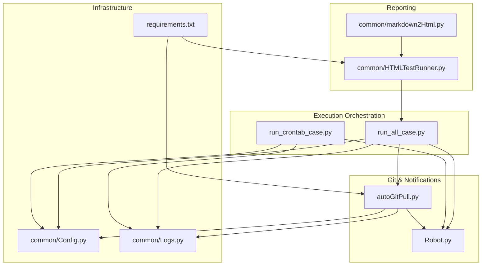
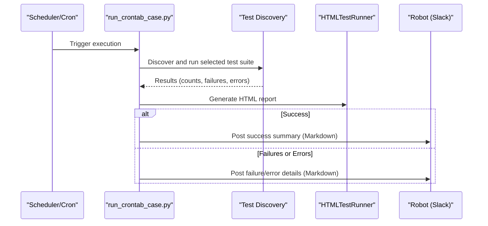
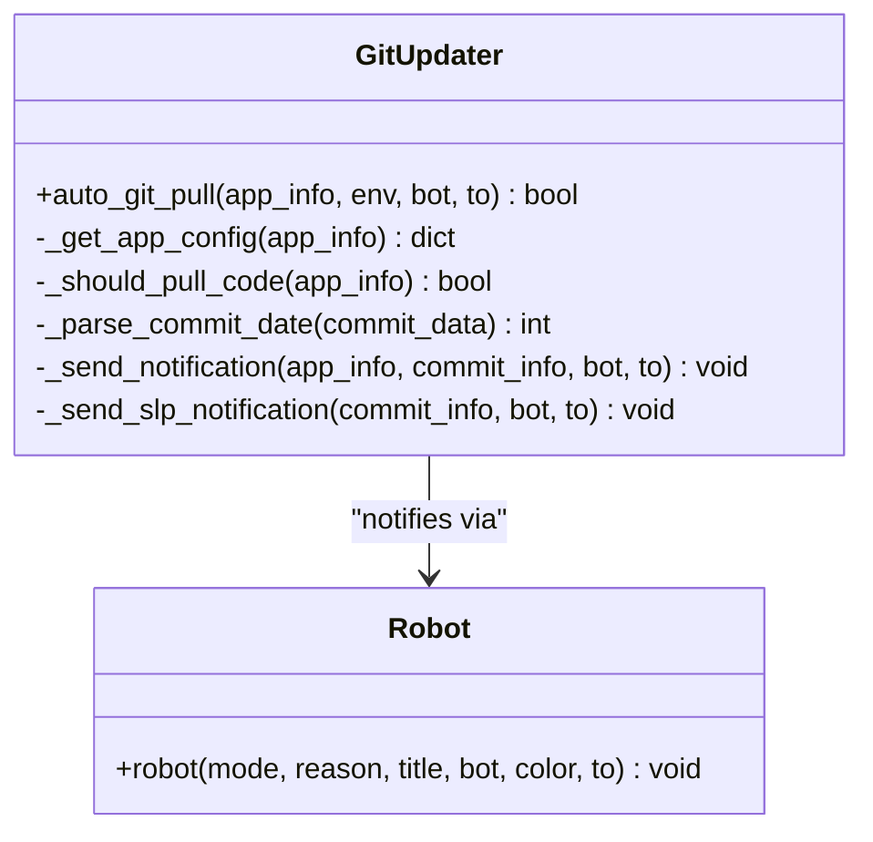
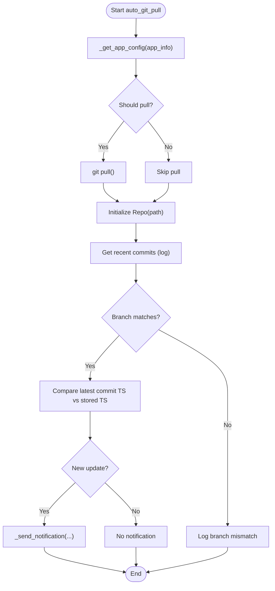
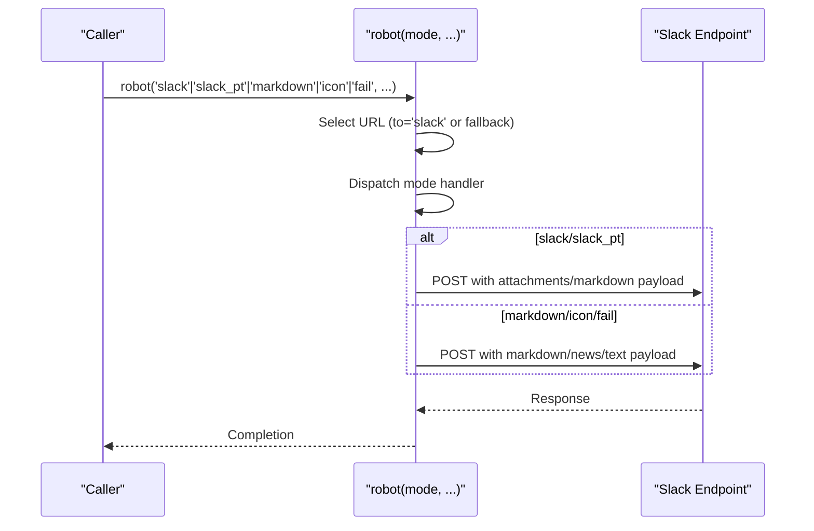
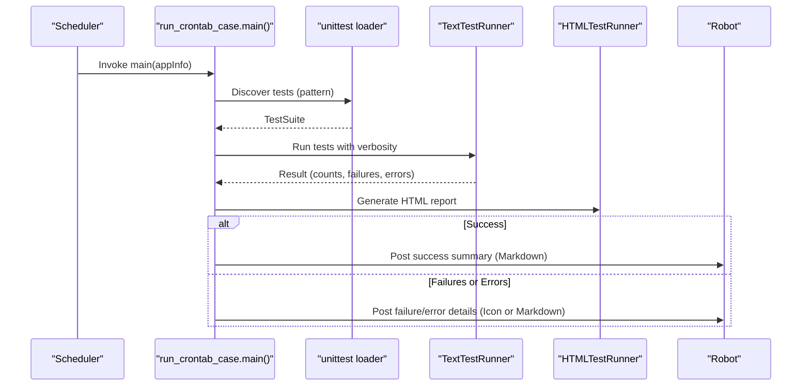
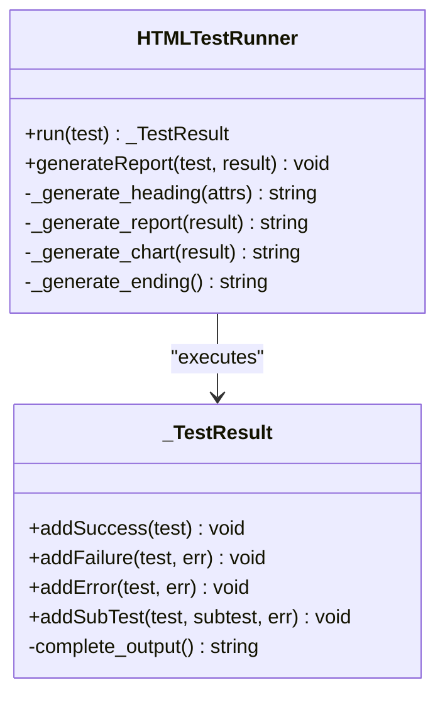
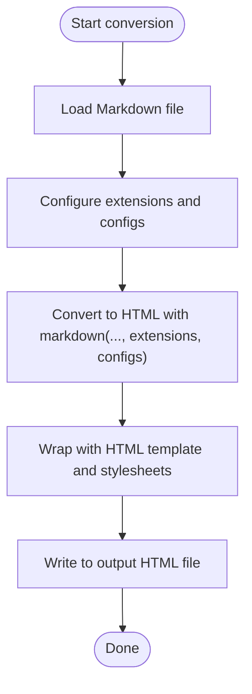
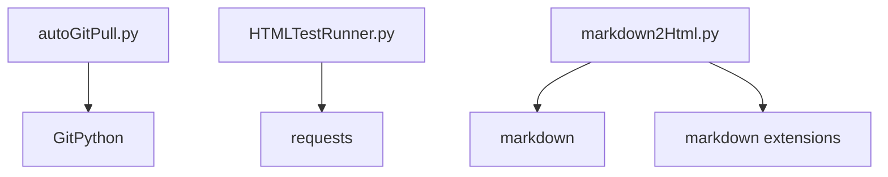

# Integration and Automation

<cite>
**Referenced Files in This Document**
- [run_all_case.py](file://run_all_case.py)
- [autoGitPull.py](file://autoGitPull.py)
- [run_crontab_case.py](file://run_crontab_case.py)
- [Robot.py](file://Robot.py)
- [HTMLTestRunner.py](file://common/HTMLTestRunner.py)
- [markdown2Html.py](file://common/markdown2Html.py)
- [Config.py](file://common/Config.py)
- [Logs.py](file://common/Logs.py)
- [requirements.txt](file://requirements.txt)
- [README.md](file://README.md)
</cite>

## Table of Contents
1. [Introduction](#introduction)
2. [Project Structure](#project-structure)
3. [Core Components](#core-components)
4. [Architecture Overview](#architecture-overview)
5. [Detailed Component Analysis](#detailed-component-analysis)
6. [Dependency Analysis](#dependency-analysis)
7. [Performance Considerations](#performance-considerations)
8. [Troubleshooting Guide](#troubleshooting-guide)
9. [Conclusion](#conclusion)
10. [Appendices](#appendices)

## Introduction
This document explains the integration and automation capabilities of the QA test automation framework, focusing on:
- Real-time Slack notifications for test execution outcomes
- Automated Git repository synchronization with branch verification and commit-time checks
- Scheduled test execution via cron-like triggers
- HTML report generation and Markdown-to-HTML conversion utilities
- Integration patterns with external monitoring systems
- Security considerations, error handling, and maintenance procedures

The goal is to enable both technical and non-technical users to configure, operate, and maintain automated pipelines reliably.

## Project Structure
The automation system centers around several key scripts and modules:
- Test orchestration and execution
- Git synchronization and notifications
- Slack integration
- Reporting and Markdown conversion
- Logging and configuration

**Diagram sources**
- [run_all_case.py](file://run_all_case.py)
- [autoGitPull.py](file://autoGitPull.py)
- [run_crontab_case.py](file://run_crontab_case.py)
- [Robot.py](file://Robot.py)
- [HTMLTestRunner.py](file://common/HTMLTestRunner.py)
- [markdown2Html.py](file://common/markdown2Html.py)
- [Config.py](file://common/Config.py)
- [Logs.py](file://common/Logs.py)
- [requirements.txt](file://requirements.txt)

**Section sources**
- [run_all_case.py](file://run_all_case.py)
- [autoGitPull.py](file://autoGitPull.py)
- [run_crontab_case.py](file://run_crontab_case.py)
- [Robot.py](file://Robot.py)
- [HTMLTestRunner.py](file://common/HTMLTestRunner.py)
- [markdown2Html.py](file://common/markdown2Html.py)
- [Config.py](file://common/Config.py)
- [Logs.py](file://common/Logs.py)
- [requirements.txt](file://requirements.txt)
- [README.md](file://README.md)

## Core Components
- Git synchronization and notification: Pulls code, verifies branch, compares commit timestamps, and posts notifications to Slack or Markdown channels.
- Slack integration: Sends structured messages with attachments and Markdown blocks to configured endpoints.
- Test execution orchestration: Discovers and runs test suites, logs outcomes, and triggers Slack notifications.
- Reporting: Generates HTML reports with charts and interactive tables; converts Markdown to HTML for documentation or dashboards.
- Logging: Centralized logging with timed rotation and console output.
- Configuration: Centralized configuration for paths, branches, app names, and server identifiers.

**Section sources**
- [autoGitPull.py](file://autoGitPull.py)
- [Robot.py](file://Robot.py)
- [run_all_case.py](file://run_all_case.py)
- [HTMLTestRunner.py](file://common/HTMLTestRunner.py)
- [markdown2Html.py](file://common/markdown2Html.py)
- [Config.py](file://common/Config.py)
- [Logs.py](file://common/Logs.py)

## Architecture Overview
The automation pipeline integrates Git synchronization, test execution, and Slack notifications. It also supports scheduled runs and report generation.

**Diagram sources**
- [run_crontab_case.py](file://run_crontab_case.py)
- [HTMLTestRunner.py](file://common/HTMLTestRunner.py)
- [Robot.py](file://Robot.py)

**Section sources**
- [run_crontab_case.py](file://run_crontab_case.py)
- [HTMLTestRunner.py](file://common/HTMLTestRunner.py)
- [Robot.py](file://Robot.py)

## Detailed Component Analysis

### Git Synchronization and Notification
The Git updater pulls code, validates branch, and compares commit timestamps to decide whether to notify. It supports multiple applications and environments.

Key behaviors:
- Pulls code for applicable apps and initializes repository metadata.
- Verifies active branch against expected branch.
- Compares latest commit timestamp with stored timestamp to detect updates.
- Sends notifications to Slack or Markdown channels depending on app type and target.

Operational flow:

**Diagram sources**
- [autoGitPull.py](file://autoGitPull.py)

**Section sources**
- [autoGitPull.py](file://autoGitPull.py)

### Slack Notification Integration
Slack integration is implemented via a unified robot dispatcher that selects endpoints and formats messages based on mode and target.

Message modes:
- slack: Attachment-based with color-coded fields
- slack_pt: Title/value payload
- markdown: Markdown content
- icon: News card with image and mentions
- fail: Text message with optional mentions

Security and reliability:
- Uses HTTPS requests with JSON payloads.
- Error handling prints exceptions and returns None on failure.

**Diagram sources**
- [Robot.py](file://Robot.py)

**Section sources**
- [Robot.py](file://Robot.py)

### Scheduled Test Execution
Scheduled runs are handled by a dedicated runner that executes specific test suites and posts summaries to Slack or Markdown channels.

Supported apps and patterns:
- Partying: caseLuckyPlay with wildcard pattern
- 伴伴: case with specific test file

**Diagram sources**
- [run_crontab_case.py](file://run_crontab_case.py)
- [HTMLTestRunner.py](file://common/HTMLTestRunner.py)
- [Robot.py](file://Robot.py)

**Section sources**
- [run_crontab_case.py](file://run_crontab_case.py)
- [HTMLTestRunner.py](file://common/HTMLTestRunner.py)
- [Robot.py](file://Robot.py)

### HTML Report Generation System
The HTML reporter generates a comprehensive, interactive report with charts and tables. It captures counts, statuses, and output buffers for each test.

Features:
- Status counts (pass/fail/error)
- Charts powered by ECharts
- Expandable test details with output capture
- Bootstrap-based responsive layout

**Diagram sources**
- [HTMLTestRunner.py](file://common/HTMLTestRunner.py)

**Section sources**
- [HTMLTestRunner.py](file://common/HTMLTestRunner.py)

### Markdown to HTML Conversion Utilities
Markdown documents are converted to HTML with extensive extensions for tables, math, task lists, and Mermaid diagrams.

Extensions include:
- Table of contents, extra features
- Math support (KaTeX)
- Task lists and checklist
- Highlighted code blocks
- Mermaid diagrams

**Diagram sources**
- [markdown2Html.py](file://common/markdown2Html.py)

**Section sources**
- [markdown2Html.py](file://common/markdown2Html.py)

### Configuration and Logging
Centralized configuration defines paths, branches, app names, and server identifiers. Logging is set up with rotating files and console handlers.

- Configuration keys:
  - Paths for PHP/Go repositories
  - Expected branch names per app
  - App name mappings
  - Linux node identifiers
- Logging:
  - Timed rotation at midnight
  - UTF-8 encoding
  - Combined console and file handlers

**Section sources**
- [Config.py](file://common/Config.py)
- [Logs.py](file://common/Logs.py)

## Dependency Analysis
External dependencies include GitPython for repository operations and Markdown ecosystem for rendering.

**Diagram sources**
- [autoGitPull.py](file://autoGitPull.py)
- [HTMLTestRunner.py](file://common/HTMLTestRunner.py)
- [markdown2Html.py](file://common/markdown2Html.py)
- [requirements.txt](file://requirements.txt)

**Section sources**
- [requirements.txt](file://requirements.txt)
- [autoGitPull.py](file://autoGitPull.py)
- [HTMLTestRunner.py](file://common/HTMLTestRunner.py)
- [markdown2Html.py](file://common/markdown2Html.py)

## Performance Considerations
- Git operations: Pull and log parsing can be expensive; consider limiting log depth and avoiding unnecessary pulls for SLP targets.
- Slack posting: Batch notifications and avoid excessive retries to prevent rate limits.
- Reports: HTML generation includes chart rendering; keep verbosity moderate during CI runs.
- Logging: Timed rotation prevents disk growth; adjust backup count as needed.

## Troubleshooting Guide
Common issues and resolutions:
- Git branch mismatch: Verify expected branch in configuration and ensure active branch matches.
- Commit timestamp not updating: Confirm timestamp file exists and is writable; reset if corrupted.
- Slack endpoint not responding: Check URL selection logic and network connectivity; validate JSON payload format.
- Markdown conversion failing: Ensure required packages are installed; verify file encodings and extension configurations.
- Logging not rotating: Confirm log directory permissions and rotation parameters.

Operational tips:
- Use centralized logging to diagnose failures quickly.
- For scheduled runs, monitor cron logs and Slack delivery confirmations.
- For Git sync, validate repository paths and credentials.

**Section sources**
- [autoGitPull.py](file://autoGitPull.py)
- [Robot.py](file://Robot.py)
- [Logs.py](file://common/Logs.py)
- [markdown2Html.py](file://common/markdown2Html.py)

## Conclusion
The automation framework provides a robust foundation for continuous integration and monitoring:
- Git synchronization ensures code freshness with branch verification and timestamp comparisons.
- Slack notifications deliver timely insights into test outcomes and code updates.
- HTML reports and Markdown conversion streamline documentation and dashboards.
- Centralized configuration and logging simplify maintenance and troubleshooting.

## Appendices

### Configuration Examples
- Git paths and branches:
  - bb_php_path, bb_go_path, pt_php_path, slp_php_path, slp_common_rpc_path
  - bb_git_branch, bb_go_git_branch, pt_git_branch, slp_git_branch
- App names and server identifiers:
  - appName mappings for orchestrators
  - linux_node identifiers for host detection
- Slack endpoints:
  - Configure URLs in the robot dispatcher for each bot/channel

**Section sources**
- [Config.py](file://common/Config.py)
- [Robot.py](file://Robot.py)

### Webhook Setup Procedures
- Slack:
  - Create a Slack app and add a Bot user to the channel.
  - Copy the incoming webhook URL and configure the robot dispatcher.
  - Use mode 'slack' or 'slack_pt' to post structured messages.
- Markdown notifications:
  - Use mode 'markdown' to send Markdown-formatted messages.
  - For SLP-specific channels, pass to='slack' or to='markdown' accordingly.

**Section sources**
- [Robot.py](file://Robot.py)

### Automation Pipeline Integration Patterns
- Continuous updates:
  - Call the Git updater before test runs to ensure latest code.
  - Use branch verification to prevent running on incorrect branches.
- Scheduled runs:
  - Trigger run_crontab_case.py via cron or scheduler.
  - Select test suites by app and pattern.
- Reporting:
  - Generate HTML reports after test execution.
  - Convert Markdown documents to HTML for documentation pipelines.

**Section sources**
- [run_all_case.py](file://run_all_case.py)
- [run_crontab_case.py](file://run_crontab_case.py)
- [HTMLTestRunner.py](file://common/HTMLTestRunner.py)
- [markdown2Html.py](file://common/markdown2Html.py)

### Security Considerations
- Slack endpoints:
  - Store webhook URLs securely; avoid hardcoding in public repositories.
  - Limit permissions of bots to specific channels.
- Network requests:
  - Validate SSL certificates and handle timeouts gracefully.
- File system:
  - Ensure write permissions for timestamp files and logs.
- Credentials:
  - Use environment variables or secure vaults for sensitive data.

**Section sources**
- [Robot.py](file://Robot.py)
- [autoGitPull.py](file://autoGitPull.py)
- [Logs.py](file://common/Logs.py)

### Maintenance Procedures
- Update dependencies:
  - Review requirements.txt regularly and upgrade GitPython and Markdown ecosystem.
- Monitor logs:
  - Rotate logs and archive old entries.
- Validate configurations:
  - Periodically verify paths, branches, and app mappings.
- Test integrations:
  - Manually trigger Git sync and Slack notifications to ensure end-to-end functionality.

**Section sources**
- [requirements.txt](file://requirements.txt)
- [Logs.py](file://common/Logs.py)
- [Config.py](file://common/Config.py)
- [README.md](file://README.md)