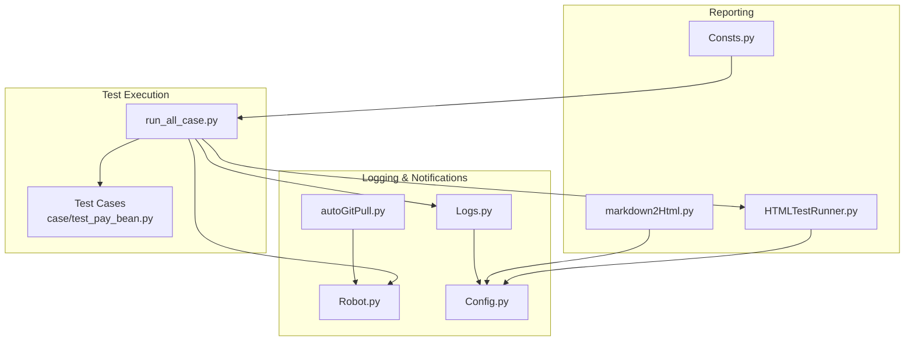
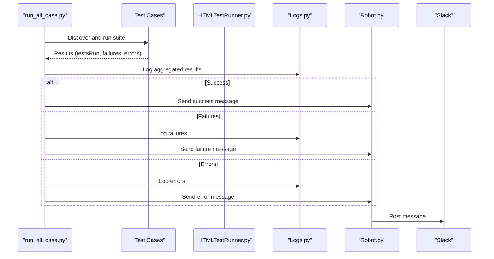
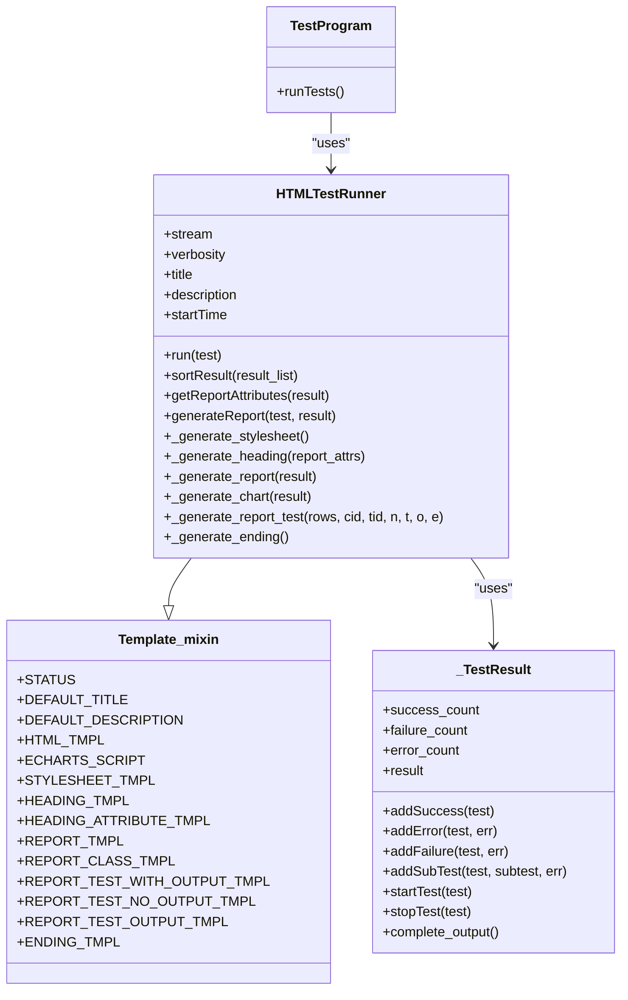
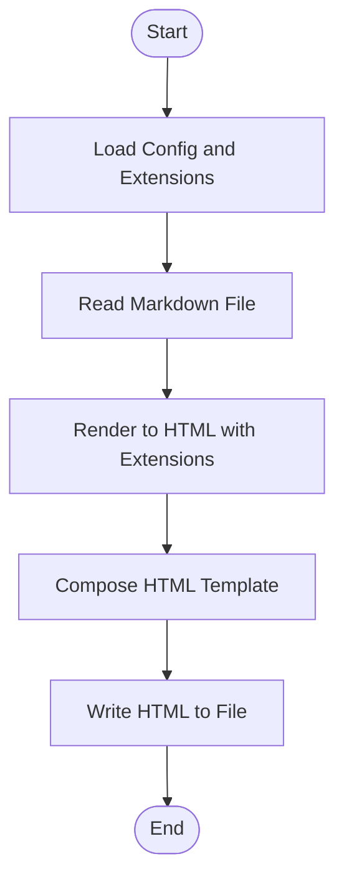
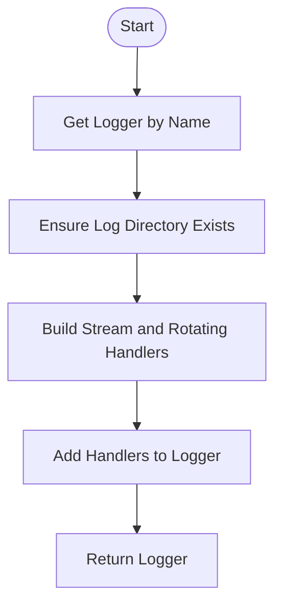
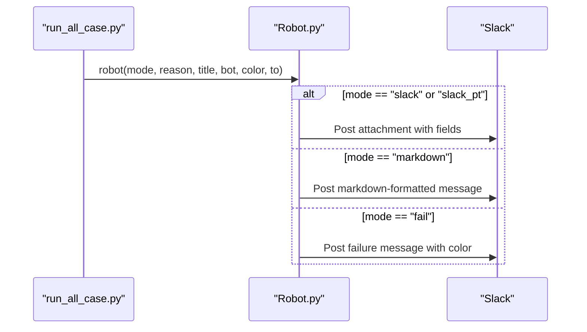
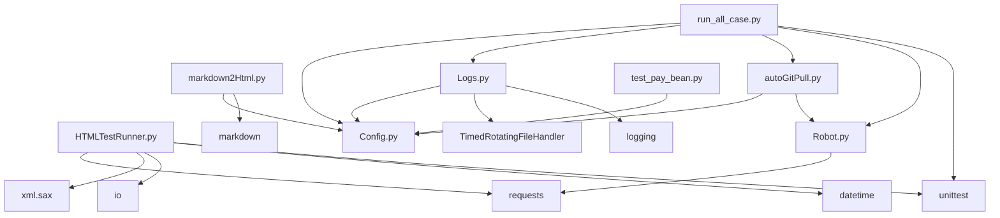

# Report Generation System

<cite>
**Referenced Files in This Document**
- [HTMLTestRunner.py](file://common/HTMLTestRunner.py)
- [markdown2Html.py](file://common/markdown2Html.py)
- [Logs.py](file://common/Logs.py)
- [Config.py](file://common/Config.py)
- [run_all_case.py](file://run_all_case.py)
- [Robot.py](file://Robot.py)
- [autoGitPull.py](file://autoGitPull.py)
- [test_pay_bean.py](file://case/test_pay_bean.py)
- [Consts.py](file://common/Consts.py)
- [README.md](file://README.md)
</cite>

## Table of Contents
1. [Introduction](#introduction)
2. [Project Structure](#project-structure)
3. [Core Components](#core-components)
4. [Architecture Overview](#architecture-overview)
5. [Detailed Component Analysis](#detailed-component-analysis)
6. [Dependency Analysis](#dependency-analysis)
7. [Performance Considerations](#performance-considerations)
8. [Troubleshooting Guide](#troubleshooting-guide)
9. [Conclusion](#conclusion)
10. [Appendices](#appendices)

## Introduction
This document describes the report generation and logging system used in the QA automation framework. It covers:
- HTMLTestRunner.py: A customized HTML test report generator with interactive charts and collapsible details.
- markdown2Html.py: A utility to convert Markdown documentation into HTML with advanced formatting and math support.
- Logs.py: Structured logging with timed rotation for test result tracking and diagnostics.
- Integration with Slack notifications for automated report distribution.
- Report customization, template modification, and output formatting options.
- Report archival strategies, log rotation procedures, and storage optimization.
- Guidance on custom report templates, styling options, and export formats.
- Troubleshooting procedures for report generation failures and log parsing utilities.

## Project Structure
The reporting and logging system spans several modules:
- common/HTMLTestRunner.py: Generates HTML reports with Bootstrap and ECharts.
- common/markdown2Html.py: Converts Markdown to HTML with extensions for math, task lists, and mermaid diagrams.
- common/Logs.py: Provides a configurable logger with timed rotating file handlers.
- common/Config.py: Centralized configuration for base paths and environment settings.
- run_all_case.py: Orchestrates test runs, collects results, and triggers Slack notifications.
- Robot.py: Sends messages to Slack and other channels.
- autoGitPull.py: Pulls code updates and sends notifications.
- case/test_pay_bean.py: Example test module demonstrating test case structure.
- common/Consts.py: Global variables used to track test results and timing.

**Diagram sources**
- [run_all_case.py:12-159](file://run_all_case.py#L12-L159)
- [HTMLTestRunner.py:516-704](file://common/HTMLTestRunner.py#L516-L704)
- [markdown2Html.py:15-116](file://common/markdown2Html.py#L15-L116)
- [Logs.py:8-48](file://common/Logs.py#L8-L48)
- [Config.py:6-133](file://common/Config.py#L6-L133)
- [Robot.py:6-137](file://Robot.py#L6-L137)
- [autoGitPull.py:93-126](file://autoGitPull.py#L93-L126)
- [test_pay_bean.py:13-188](file://case/test_pay_bean.py#L13-L188)
- [Consts.py:1-17](file://common/Consts.py#L1-L17)

**Section sources**
- [README.md:1-38](file://README.md#L1-L38)
- [run_all_case.py:12-159](file://run_all_case.py#L12-L159)
- [HTMLTestRunner.py:516-704](file://common/HTMLTestRunner.py#L516-L704)
- [markdown2Html.py:15-116](file://common/markdown2Html.py#L15-L116)
- [Logs.py:8-48](file://common/Logs.py#L8-L48)
- [Config.py:6-133](file://common/Config.py#L6-L133)
- [Robot.py:6-137](file://Robot.py#L6-L137)
- [autoGitPull.py:93-126](file://autoGitPull.py#L93-L126)
- [test_pay_bean.py:13-188](file://case/test_pay_bean.py#L13-L188)
- [Consts.py:1-17](file://common/Consts.py#L1-L17)

## Core Components
- HTMLTestRunner.py
  - Generates HTML reports with Bootstrap UI and ECharts pie charts.
  - Captures stdout/stderr during test execution and embeds them in collapsible popups.
  - Supports filtering by status (summary, failures, all) and expanding class/test details.
  - Provides customizable title and description, and integrates with the project’s configuration for base paths.

- markdown2Html.py
  - Converts Markdown documents to HTML with extensive extensions:
    - Table of contents, extra syntax, math rendering (KaTeX), task lists, code highlighting, mermaid diagrams, and more.
  - Uses CDN-hosted stylesheets and scripts for responsive rendering.
  - Reads configuration for base paths to locate Markdown files and write HTML outputs.

- Logs.py
  - Creates a logger with both console and timed rotating file handlers.
  - Uses UTF-8 encoding and a standardized formatter.
  - Supports configurable rotation cadence and backup count.

- run_all_case.py
  - Discovers and executes test suites per application context.
  - Aggregates results and sends Slack notifications via Robot.py.
  - Records timing and branch information for traceability.

- Robot.py
  - Sends formatted messages to Slack and other channels.
  - Supports multiple modes: success/failure, markdown, and Slack attachments.

- autoGitPull.py
  - Pulls code updates and dispatches notifications to Slack or markdown targets.

- Config.py
  - Centralizes base paths, application URLs, and environment identifiers used across modules.

- Consts.py
  - Global variables for tracking test results, timing, and failure reasons.

**Section sources**
- [HTMLTestRunner.py:33-285](file://common/HTMLTestRunner.py#L33-L285)
- [HTMLTestRunner.py:516-704](file://common/HTMLTestRunner.py#L516-L704)
- [markdown2Html.py:15-116](file://common/markdown2Html.py#L15-L116)
- [Logs.py:8-48](file://common/Logs.py#L8-L48)
- [run_all_case.py:12-159](file://run_all_case.py#L12-L159)
- [Robot.py:6-137](file://Robot.py#L6-L137)
- [autoGitPull.py:93-126](file://autoGitPull.py#L93-L126)
- [Config.py:6-133](file://common/Config.py#L6-L133)
- [Consts.py:1-17](file://common/Consts.py#L1-L17)

## Architecture Overview
The system integrates test execution, reporting, logging, and notification flows:

**Diagram sources**
- [run_all_case.py:12-159](file://run_all_case.py#L12-L159)
- [Robot.py:6-137](file://Robot.py#L6-L137)
- [Logs.py:8-48](file://common/Logs.py#L8-L48)

## Detailed Component Analysis

### HTMLTestRunner.py
- Purpose: Generate HTML test execution reports with interactive UI and charts.
- Key capabilities:
  - Captures stdout/stderr during test execution and stores them for inclusion in report popups.
  - Produces a pie chart of pass/fail/error counts using ECharts.
  - Provides Bootstrap-styled tables with filtering controls and expandable details.
  - Allows customization of title and description.
- Implementation highlights:
  - Template_mixin defines HTML templates, stylesheets, headings, report tables, and chart scripts.
  - _TestResult subclasses unittest.TestResult to capture outcomes and output streams.
  - HTMLTestRunner orchestrates report generation, sorting results by class, and embedding charts.
  - TestProgram wraps unittest to use HTMLTestRunner by default.

**Diagram sources**
- [HTMLTestRunner.py:33-285](file://common/HTMLTestRunner.py#L33-L285)
- [HTMLTestRunner.py:390-514](file://common/HTMLTestRunner.py#L390-L514)
- [HTMLTestRunner.py:516-704](file://common/HTMLTestRunner.py#L516-L704)

**Section sources**
- [HTMLTestRunner.py:33-285](file://common/HTMLTestRunner.py#L33-L285)
- [HTMLTestRunner.py:390-514](file://common/HTMLTestRunner.py#L390-L514)
- [HTMLTestRunner.py:516-704](file://common/HTMLTestRunner.py#L516-L704)

### markdown2Html.py
- Purpose: Convert Markdown documentation to HTML with advanced formatting and math support.
- Key capabilities:
  - Loads markdown library dynamically and installs missing dependencies if needed.
  - Applies a comprehensive set of extensions: TOC, extra, math (KaTeX), task lists, code highlighting, mermaid diagrams, magic links, and more.
  - Embeds CDN-hosted stylesheets and scripts for responsive rendering.
  - Writes output to a specified HTML file path derived from configuration.

**Diagram sources**
- [markdown2Html.py:15-116](file://common/markdown2Html.py#L15-L116)

**Section sources**
- [markdown2Html.py:15-116](file://common/markdown2Html.py#L15-L116)

### Logs.py
- Purpose: Provide structured logging with timed rotation for test result tracking.
- Key capabilities:
  - Creates a logger with both console and timed rotating file handlers.
  - Uses UTF-8 encoding and a standardized formatter.
  - Supports configurable rotation cadence and backup count.
  - Stores logs under a dedicated log directory resolved from configuration.

**Diagram sources**
- [Logs.py:8-48](file://common/Logs.py#L8-L48)
- [Config.py:6-133](file://common/Config.py#L6-L133)

**Section sources**
- [Logs.py:8-48](file://common/Logs.py#L8-L48)
- [Config.py:6-133](file://common/Config.py#L6-L133)

### Slack Notifications Integration
- run_all_case.py orchestrates test execution and sends Slack notifications:
  - Success: aggregates case lists and branch information.
  - Failure/Error: logs failures and posts detailed messages with titles and colors.
- Robot.py handles Slack posting with attachment formatting and markdown modes.
- autoGitPull.py integrates with Robot.py to notify on code updates.

**Diagram sources**
- [run_all_case.py:97-119](file://run_all_case.py#L97-L119)
- [Robot.py:6-137](file://Robot.py#L6-L137)

**Section sources**
- [run_all_case.py:97-119](file://run_all_case.py#L97-L119)
- [Robot.py:6-137](file://Robot.py#L6-L137)
- [autoGitPull.py:93-126](file://autoGitPull.py#L93-L126)

## Dependency Analysis
- HTMLTestRunner.py depends on unittest, datetime, io, xml.sax, and requests.
- markdown2Html.py depends on markdown and configuration for locating files.
- Logs.py depends on logging and logging.handlers.TimedRotatingFileHandler, plus configuration for paths.
- run_all_case.py depends on unittest, Robot.py, autoGitPull.py, Logs.py, and configuration.
- Robot.py depends on requests and configuration for webhook URLs.
- autoGitPull.py depends on Robot.py and configuration for app-specific notifications.
- test_pay_bean.py demonstrates typical test structure and assertion patterns.

**Diagram sources**
- [HTMLTestRunner.py:5-10](file://common/HTMLTestRunner.py#L5-L10)
- [markdown2Html.py:2-11](file://common/markdown2Html.py#L2-L11)
- [Logs.py:2-5](file://common/Logs.py#L2-L5)
- [run_all_case.py:4-10](file://run_all_case.py#L4-L10)
- [Robot.py:1-4](file://Robot.py#L1-L4)
- [autoGitPull.py:93-126](file://autoGitPull.py#L93-L126)
- [test_pay_bean.py:1-11](file://case/test_pay_bean.py#L1-L11)

**Section sources**
- [HTMLTestRunner.py:5-10](file://common/HTMLTestRunner.py#L5-L10)
- [markdown2Html.py:2-11](file://common/markdown2Html.py#L2-L11)
- [Logs.py:2-5](file://common/Logs.py#L2-L5)
- [run_all_case.py:4-10](file://run_all_case.py#L4-L10)
- [Robot.py:1-4](file://Robot.py#L1-L4)
- [autoGitPull.py:93-126](file://autoGitPull.py#L93-L126)
- [test_pay_bean.py:1-11](file://case/test_pay_bean.py#L1-L11)

## Performance Considerations
- HTML report generation:
  - ECharts rendering occurs client-side; keep the number of test cases manageable to avoid heavy DOM updates.
  - Minimize excessive stdout/stderr output to reduce report size and improve load times.
- Logging:
  - Use appropriate backupCount and rotation cadence to balance disk usage and retention.
  - Consider rotating logs by size or time depending on test volume.
- Markdown conversion:
  - Large Markdown files with many embedded diagrams or math blocks can increase processing time; split documentation into smaller chunks if needed.

[No sources needed since this section provides general guidance]

## Troubleshooting Guide
- HTML report generation fails:
  - Verify that the HTML template placeholders match generated variables.
  - Ensure the report is written to a valid path and encoding is handled correctly.
  - Confirm that ECharts and Bootstrap assets are accessible from the deployed environment.
- Markdown conversion errors:
  - Check that required packages are installed and importable.
  - Validate Markdown syntax and ensure extensions are compatible with the markdown engine.
- Logging issues:
  - Confirm log directory exists and is writable.
  - Verify UTF-8 encoding and formatter alignment with log consumers.
- Slack notification failures:
  - Validate webhook URLs and network connectivity.
  - Inspect response handling for request exceptions and adjust retry logic if needed.
- Test result tracking:
  - Ensure global variables in Consts.py are initialized and updated as expected.
  - Confirm that run_all_case.py aggregates results correctly and logs them via Logs.py.

**Section sources**
- [HTMLTestRunner.py:573-591](file://common/HTMLTestRunner.py#L573-L591)
- [markdown2Html.py:87-104](file://common/markdown2Html.py#L87-L104)
- [Logs.py:18-47](file://common/Logs.py#L18-L47)
- [Robot.py:36-44](file://Robot.py#L36-L44)
- [run_all_case.py:97-119](file://run_all_case.py#L97-L119)
- [Consts.py:1-17](file://common/Consts.py#L1-L17)

## Conclusion
The report generation and logging system combines robust HTML reporting, flexible Markdown-to-HTML conversion, and structured logging with timed rotation. It integrates seamlessly with Slack for automated notifications, enabling efficient test result tracking and communication. By customizing templates, styling, and rotation policies, teams can tailor the system to their needs while maintaining reliability and performance.

[No sources needed since this section summarizes without analyzing specific files]

## Appendices

### Report Customization and Template Modification
- HTMLTestRunner.py:
  - Customize title and description via constructor parameters.
  - Modify styles by editing the stylesheet template and report templates.
  - Extend report attributes by overriding getReportAttributes.
  - Adjust chart data and appearance by updating the ECharts script template.
- markdown2Html.py:
  - Add or remove extensions in the extensions list.
  - Configure extension-specific settings in extension_configs.
  - Change CDN URLs or local assets to fit deployment environments.

**Section sources**
- [HTMLTestRunner.py:518-571](file://common/HTMLTestRunner.py#L518-L571)
- [HTMLTestRunner.py:593-662](file://common/HTMLTestRunner.py#L593-L662)
- [markdown2Html.py:48-84](file://common/markdown2Html.py#L48-L84)

### Output Formatting Options
- HTMLTestRunner.py:
  - Status filtering buttons (summary, failures, all).
  - Expandable test details with collapsible popups.
  - Pie chart for pass/fail/error distribution.
- markdown2Html.py:
  - Math rendering with KaTeX.
  - Task lists, code highlighting, and mermaid diagrams.
  - Table of contents and enhanced text formatting.

**Section sources**
- [HTMLTestRunner.py:307-382](file://common/HTMLTestRunner.py#L307-L382)
- [HTMLTestRunner.py:156-200](file://common/HTMLTestRunner.py#L156-L200)
- [markdown2Html.py:48-84](file://common/markdown2Html.py#L48-L84)

### Integration with Slack Notifications
- run_all_case.py:
  - Sends success and failure notifications with contextual details.
  - Posts branch and timing information for traceability.
- Robot.py:
  - Formats messages as Slack attachments or markdown.
  - Supports multiple bots and channels.
- autoGitPull.py:
  - Integrates code update notifications with Slack or markdown targets.

**Section sources**
- [run_all_case.py:97-119](file://run_all_case.py#L97-L119)
- [Robot.py:6-137](file://Robot.py#L6-L137)
- [autoGitPull.py:93-126](file://autoGitPull.py#L93-L126)

### Report Archival Strategies, Log Rotation Procedures, and Storage Optimization
- Logs.py:
  - TimedRotatingFileHandler rotates logs at midnight by default; adjust when and backupCount to meet retention goals.
  - UTF-8 encoding ensures cross-platform compatibility.
- HTML and Markdown outputs:
  - Store reports under a versioned directory structure to enable archiving.
  - Compress infrequently accessed reports to save space.
- Slack notifications:
  - Use channel-specific bots and threads to organize historical records.
  - Archive or export Slack messages periodically for compliance.

**Section sources**
- [Logs.py:37-47](file://common/Logs.py#L37-L47)
- [Config.py:6-133](file://common/Config.py#L6-L133)

### Guidance on Custom Report Templates, Styling Options, and Export Formats
- HTMLTestRunner.py:
  - Edit STYLESHEET_TMPL for fonts, colors, and layout adjustments.
  - Modify REPORT_TMPL and REPORT_CLASS_TMPL to change column layouts and statuses.
  - Use ECHARTS_SCRIPT to customize chart visuals and legends.
- markdown2Html.py:
  - Replace CDN links with local assets for offline deployments.
  - Add custom CSS/JS to enhance presentation.
- Export formats:
  - HTML reports are self-contained with embedded assets.
  - Markdown can be exported to PDF via external tools if needed.

**Section sources**
- [HTMLTestRunner.py:208-285](file://common/HTMLTestRunner.py#L208-L285)
- [HTMLTestRunner.py:307-382](file://common/HTMLTestRunner.py#L307-L382)
- [HTMLTestRunner.py:156-200](file://common/HTMLTestRunner.py#L156-L200)
- [markdown2Html.py:23-45](file://common/markdown2Html.py#L23-L45)

### Example Usage References
- Example test case structure:
  - Demonstrates test methods, assertions, and result tracking via global variables.
- Test execution orchestration:
  - Shows how tests are discovered, executed, and reported, including Slack notifications.

**Section sources**
- [test_pay_bean.py:13-188](file://case/test_pay_bean.py#L13-L188)
- [run_all_case.py:126-147](file://run_all_case.py#L126-L147)