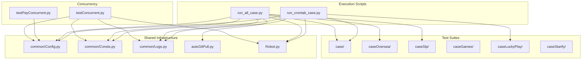
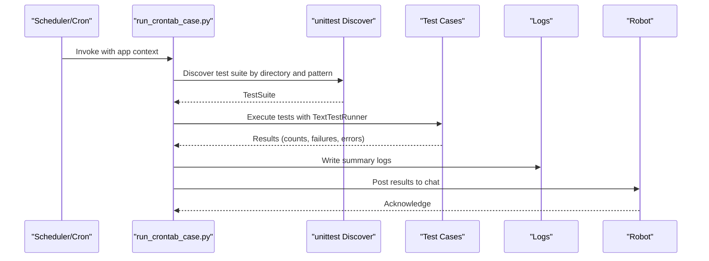
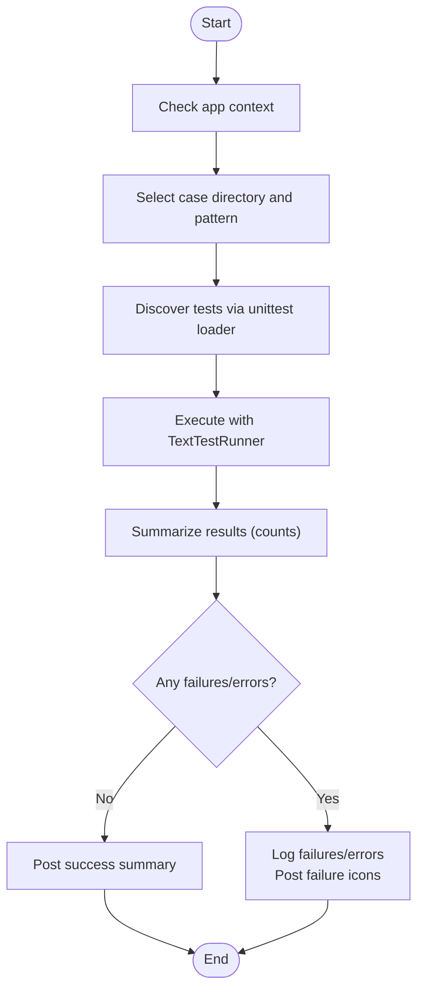
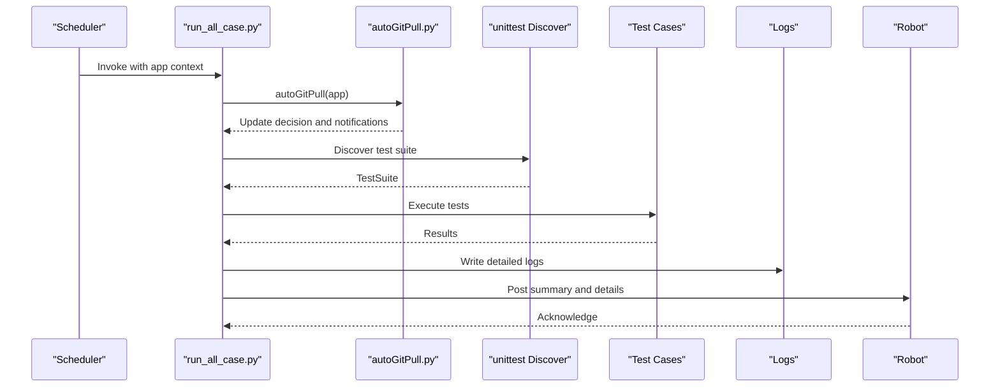
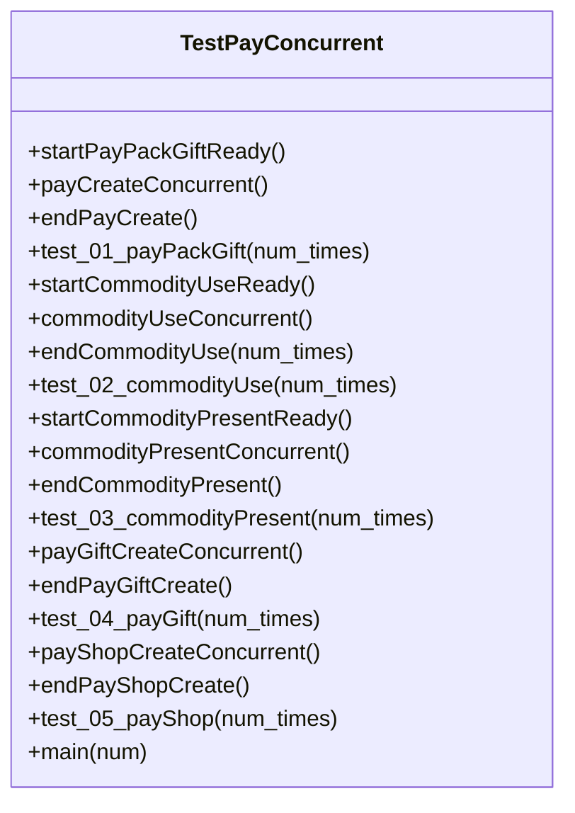
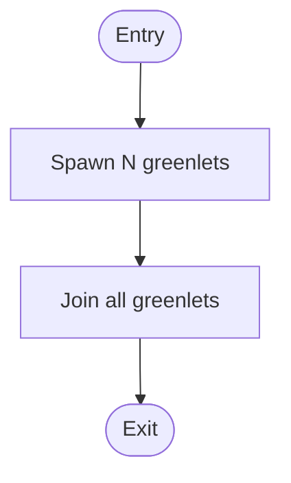
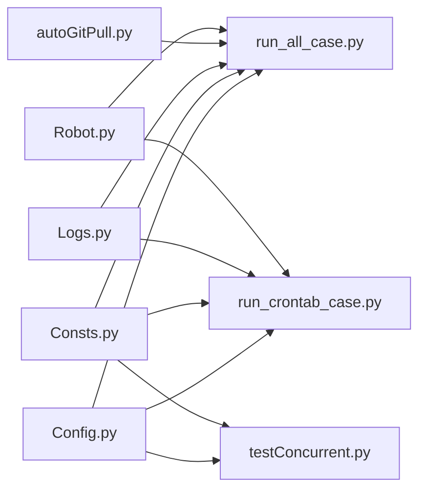
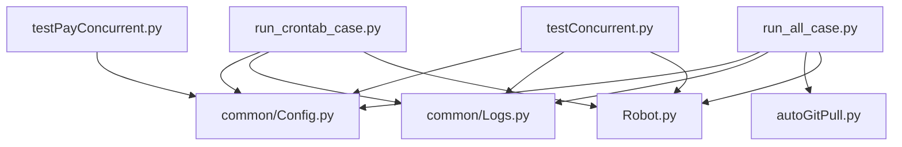

# Scheduled Test Execution

<cite>
**Referenced Files in This Document**
- [run_crontab_case.py](file://run_crontab_case.py)
- [testConcurrent.py](file://testConcurrent.py)
- [testPayConcurrent.py](file://testPayConcurrent.py)
- [run_all_case.py](file://run_all_case.py)
- [common/Config.py](file://common/Config.py)
- [common/Consts.py](file://common/Consts.py)
- [common/Logs.py](file://common/Logs.py)
- [autoGitPull.py](file://autoGitPull.py)
- [Robot.py](file://Robot.py)
- [README.md](file://README.md)
- [requirements.txt](file://requirements.txt)
</cite>

## Table of Contents
1. [Introduction](#introduction)
2. [Project Structure](#project-structure)
3. [Core Components](#core-components)
4. [Architecture Overview](#architecture-overview)
5. [Detailed Component Analysis](#detailed-component-analysis)
6. [Dependency Analysis](#dependency-analysis)
7. [Performance Considerations](#performance-considerations)
8. [Troubleshooting Guide](#troubleshooting-guide)
9. [Conclusion](#conclusion)
10. [Appendices](#appendices)

## Introduction
This document explains the scheduled test execution system built around automated test discovery and execution, with optional cron-based scheduling and concurrent test execution using gevent. It focuses on:
- Automated scheduling and execution of test suites via a dedicated runner
- Cron-compatible invocation patterns and timing considerations
- Concurrent test execution using gevent for parallelism
- Logging, notifications, and integration with system monitoring/alerting
- Performance optimization, resource management, and isolation strategies
- Troubleshooting failed scheduled runs and resource issues

## Project Structure
The repository organizes tests by feature domains under dedicated case folders, with shared infrastructure in the common package. The scheduler and runners are standalone scripts that leverage unittest discovery and configuration-driven routing.

**Diagram sources**
- [run_all_case.py:126-147](file://run_all_case.py#L126-L147)
- [run_crontab_case.py:9-24](file://run_crontab_case.py#L9-L24)
- [testConcurrent.py:17-281](file://testConcurrent.py#L17-L281)
- [testPayConcurrent.py:9-47](file://testPayConcurrent.py#L9-L47)
- [common/Config.py:6-133](file://common/Config.py#L6-L133)
- [common/Consts.py:1-17](file://common/Consts.py#L1-L17)
- [common/Logs.py:8-48](file://common/Logs.py#L8-L48)
- [autoGitPull.py:17-49](file://autoGitPull.py#L17-L49)
- [Robot.py:6-34](file://Robot.py#L6-L34)

**Section sources**
- [README.md:31-38](file://README.md#L31-L38)
- [run_all_case.py:126-147](file://run_all_case.py#L126-L147)
- [run_crontab_case.py:9-24](file://run_crontab_case.py#L9-L24)

## Core Components
- Automated Runner for Full Suite: Orchestrates test discovery, execution, notifications, and git-aware updates.
- Automated Runner for Crontab: Selectively executes subsets of test suites based on application context and logs results with notifications.
- Concurrency Harness: Provides gevent-based parallel execution for payment and item operations with shared state coordination.
- Shared Infrastructure: Configuration, constants, logging with rotation, git update automation, and notification integrations.

Key responsibilities:
- Test Discovery and Execution: Uses unittest discovery to load suites by directory and pattern.
- Conditional Execution: Routes to specific suite directories per application context.
- Notifications: Posts results to Slack/WeChat via webhook integrations.
- Logging: Rotating logs for diagnostics and audit trails.
- Git Integration: Pulls code updates and notifies on changes.

**Section sources**
- [run_all_case.py:12-124](file://run_all_case.py#L12-L124)
- [run_crontab_case.py:27-72](file://run_crontab_case.py#L27-L72)
- [testConcurrent.py:17-281](file://testConcurrent.py#L17-L281)
- [common/Logs.py:8-48](file://common/Logs.py#L8-L48)
- [autoGitPull.py:114-191](file://autoGitPull.py#L114-L191)
- [Robot.py:6-34](file://Robot.py#L6-L34)

## Architecture Overview
The system supports two primary execution modes:
- Full suite execution with git-aware updates and notifications
- Crontab-triggered subset execution with selective test discovery and reporting

**Diagram sources**
- [run_crontab_case.py:27-72](file://run_crontab_case.py#L27-L72)
- [run_crontab_case.py:9-24](file://run_crontab_case.py#L9-L24)
- [common/Logs.py:8-48](file://common/Logs.py#L8-L48)
- [Robot.py:6-34](file://Robot.py#L6-L34)

## Detailed Component Analysis

### Automated Crontab Runner: run_crontab_case.py
Purpose:
- Execute a targeted subset of test cases based on application context
- Log execution summaries and post results to chat
- Support selective test patterns per application

Key behaviors:
- Case selection by application context and directory mapping
- Test discovery via unittest loader with pattern matching
- Execution with verbose runner and result aggregation
- Logging and notification for successes and failures

**Diagram sources**
- [run_crontab_case.py:9-24](file://run_crontab_case.py#L9-L24)
- [run_crontab_case.py:27-72](file://run_crontab_case.py#L27-L72)

**Section sources**
- [run_crontab_case.py:9-24](file://run_crontab_case.py#L9-L24)
- [run_crontab_case.py:27-72](file://run_crontab_case.py#L27-L72)

### Full Suite Runner: run_all_case.py
Purpose:
- Execute full test suites with git-aware updates and comprehensive notifications
- Aggregate results and post detailed reports

Key behaviors:
- Git-aware update checks and notifications
- Suite discovery across multiple directories
- Timing and duration reporting
- Multi-target notifications (Slack/WeChat)

**Diagram sources**
- [run_all_case.py:12-124](file://run_all_case.py#L12-L124)
- [autoGitPull.py:114-191](file://autoGitPull.py#L114-L191)
- [common/Logs.py:8-48](file://common/Logs.py#L8-L48)
- [Robot.py:6-34](file://Robot.py#L6-L34)

**Section sources**
- [run_all_case.py:12-124](file://run_all_case.py#L12-L124)
- [autoGitPull.py:114-191](file://autoGitPull.py#L114-L191)

### Concurrency Harness: testConcurrent.py
Purpose:
- Demonstrate and support parallel execution of payment and item operations using gevent
- Coordinate shared state for success/failure counts across concurrent tasks

Key behaviors:
- Monkey patching for cooperative concurrency
- Spawn multiple greenlets for parallel operations
- Join all greenlets and assert postconditions
- Aggregate results into shared constants for reporting

**Diagram sources**
- [testConcurrent.py:17-281](file://testConcurrent.py#L17-L281)

**Section sources**
- [testConcurrent.py:17-281](file://testConcurrent.py#L17-L281)

### Lightweight Concurrency Example: testPayConcurrent.py
Purpose:
- Minimal example of gevent-based concurrency for HTTP requests

Key behaviors:
- Spawns multiple greenlets to issue concurrent requests
- Demonstrates payload construction and response handling

**Diagram sources**
- [testPayConcurrent.py:30-35](file://testPayConcurrent.py#L30-L35)

**Section sources**
- [testPayConcurrent.py:9-47](file://testPayConcurrent.py#L9-L47)

### Shared Infrastructure
- Configuration: Centralized app URLs, user IDs, gift IDs, and server identifiers
- Constants: Global counters and lists for test results and timing
- Logging: Rotating file handlers with configurable rotation and retention
- Git Updater: Pulls code updates, validates branch, and notifies on changes
- Notifications: Unified robot interface supporting multiple modes and targets

**Diagram sources**
- [common/Config.py:6-133](file://common/Config.py#L6-L133)
- [common/Consts.py:1-17](file://common/Consts.py#L1-L17)
- [common/Logs.py:8-48](file://common/Logs.py#L8-L48)
- [autoGitPull.py:114-191](file://autoGitPull.py#L114-L191)
- [Robot.py:6-34](file://Robot.py#L6-L34)

**Section sources**
- [common/Config.py:6-133](file://common/Config.py#L6-L133)
- [common/Consts.py:1-17](file://common/Consts.py#L1-L17)
- [common/Logs.py:8-48](file://common/Logs.py#L8-L48)
- [autoGitPull.py:114-191](file://autoGitPull.py#L114-L191)
- [Robot.py:6-34](file://Robot.py#L6-L34)

## Dependency Analysis
External dependencies relevant to scheduling and concurrency:
- gevent and greenlet for cooperative concurrency
- requests for HTTP operations
- GitPython for repository operations
- psutil and Glances for system monitoring (installed)

**Diagram sources**
- [run_crontab_case.py:2-6](file://run_crontab_case.py#L2-L6)
- [run_all_case.py:4-8](file://run_all_case.py#L4-L8)
- [testConcurrent.py:1-14](file://testConcurrent.py#L1-L14)
- [testPayConcurrent.py:1-6](file://testPayConcurrent.py#L1-L6)

**Section sources**
- [requirements.txt:23-27](file://requirements.txt#L23-L27)
- [requirements.txt:65-66](file://requirements.txt#L65-L66)
- [requirements.txt:25](file://requirements.txt#L25)
- [requirements.txt:48](file://requirements.txt#L48)

## Performance Considerations
- Concurrency model: gevent’s monkey patch enables cooperative concurrency for I/O-bound operations. Tune the number of concurrent tasks based on network latency and backend capacity.
- Resource contention: Limit concurrent greenlets to avoid overwhelming the API or database. Use shared counters and assertions to validate outcomes consistently.
- Test isolation: Keep state initialization and cleanup explicit per scenario to prevent cross-test interference.
- Logging overhead: Rotating logs reduce disk usage but still incur I/O; avoid excessive debug-level logs during heavy concurrency.
- Network and database limits: Respect upstream rate limits and consider adding jitter or backoff to reduce thundering herd effects.

[No sources needed since this section provides general guidance]

## Troubleshooting Guide
Common issues and resolutions:
- NoRun decisions: When code has not changed, git update checks may skip execution. Verify timestamps and branches.
- Branch mismatches: Git updater logs branch errors; ensure the active branch matches expected configuration.
- Notification failures: Robot mode handlers encapsulate request sending; check webhook URLs and network connectivity.
- Logging gaps: Ensure log directory exists and rotation settings are appropriate for the environment.
- Concurrency anomalies: Validate that shared counters are properly reset and that joinall waits for completion.

Operational steps:
- Inspect logs for git pull/update and branch validation messages
- Confirm webhook endpoints and credentials for notifications
- Review test runner logs for discovery and execution summaries
- Validate configuration keys for app contexts and server identifiers

**Section sources**
- [autoGitPull.py:164-187](file://autoGitPull.py#L164-L187)
- [autoGitPull.py:189-191](file://autoGitPull.py#L189-L191)
- [Robot.py:36-43](file://Robot.py#L36-L43)
- [common/Logs.py:18-21](file://common/Logs.py#L18-L21)
- [run_all_case.py:46](file://run_all_case.py#L46)

## Conclusion
The scheduled test execution system combines unittest-based discovery, configuration-driven routing, and notification integration to automate QA runs. Optional cron scheduling can invoke the crontab runner for targeted suites, while gevent enables efficient parallel execution for I/O-heavy scenarios. Robust logging, git-aware updates, and notification mechanisms support continuous monitoring and alerting. Proper tuning of concurrency and isolation ensures reliable, scalable test execution.

[No sources needed since this section summarizes without analyzing specific files]

## Appendices

### Cron Job Configuration Examples
Note: The following are illustrative patterns. Adapt timing and app context according to deployment needs.

- Daily at 02:15
  - 15 2 * * * cd /path/to/repo && python run_crontab_case.py
- Hourly at minute 5
  - 5 * * * * cd /path/to/repo && python run_crontab_case.py
- Weekdays at 10:00
  - 0 10 * * 1-5 cd /path/to/repo && python run_crontab_case.py

Environment considerations:
- Set working directory to repository root so relative paths resolve correctly
- Ensure Python interpreter and virtual environment are available in cron PATH
- Validate that application context aligns with configured linux_node and app names

[No sources needed since this section provides general guidance]

### Test Selection Criteria
- Application context drives case directory mapping:
  - Partying: caseLuckyPlay with wildcard pattern
  - Other contexts: case directory with specific pattern
- Runner selects directory and pattern dynamically based on configuration

**Section sources**
- [run_crontab_case.py:9-24](file://run_crontab_case.py#L9-L24)
- [common/Config.py:32-39](file://common/Config.py#L32-L39)

### Resource Management and Monitoring
- Logging: Timed rotating file handler supports daily rotation and controlled retention
- Monitoring: Installed packages include psutil and Glances for system metrics
- Notifications: Unified robot interface supports multiple channels and modes

**Section sources**
- [common/Logs.py:8-48](file://common/Logs.py#L8-L48)
- [requirements.txt:48](file://requirements.txt#L48)
- [requirements.txt:26](file://requirements.txt#L26)
- [Robot.py:6-34](file://Robot.py#L6-L34)