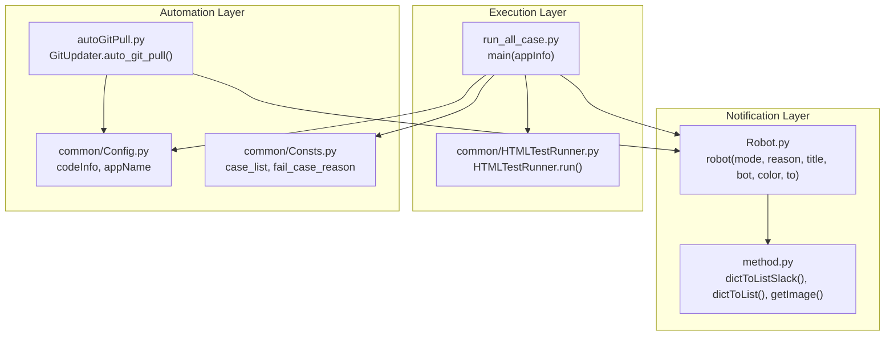
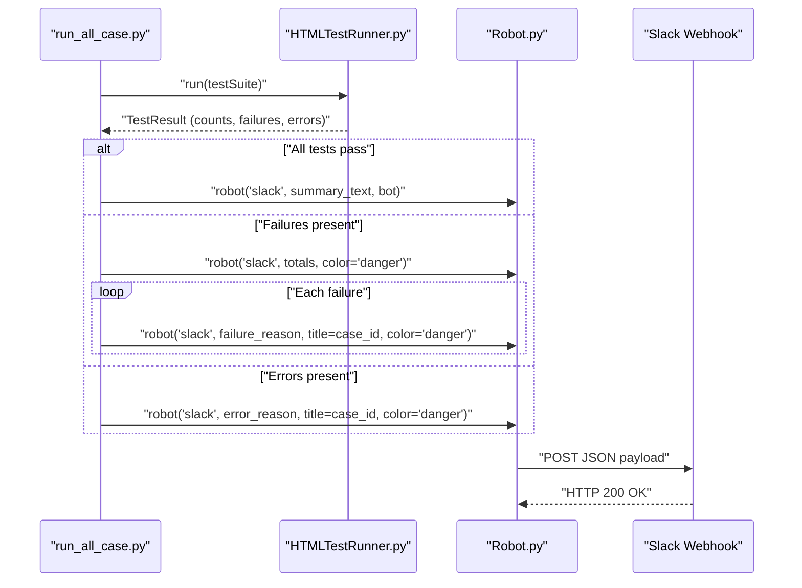
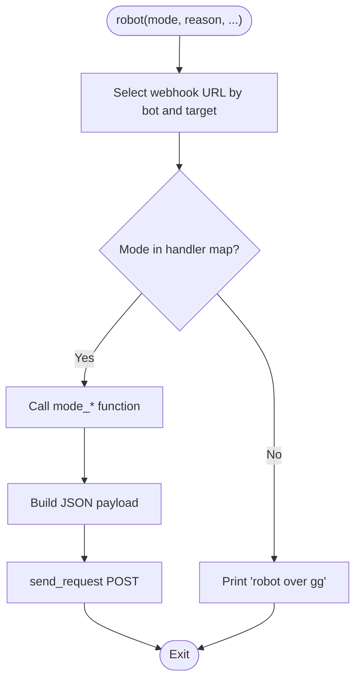
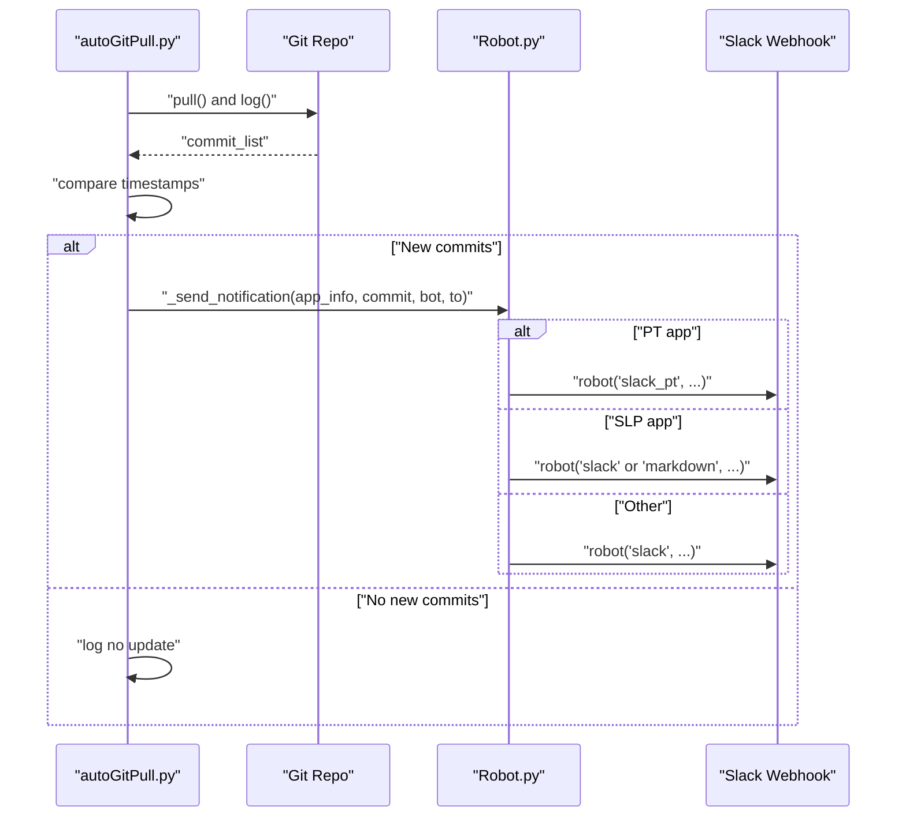
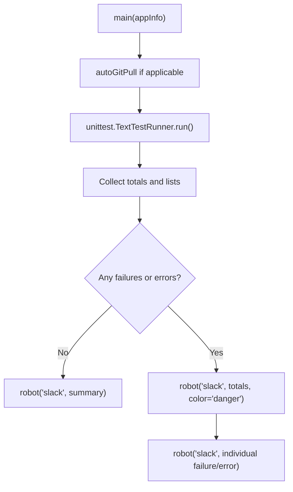
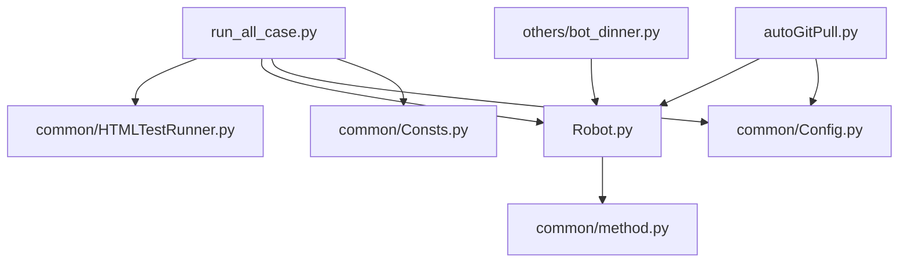

# Slack Notification Integration

<cite>
**Referenced Files in This Document**
- [Robot.py](file://Robot.py)
- [autoGitPull.py](file://autoGitPull.py)
- [run_all_case.py](file://run_all_case.py)
- [HTMLTestRunner.py](file://common/HTMLTestRunner.py)
- [method.py](file://common/method.py)
- [Config.py](file://common/Config.py)
- [Consts.py](file://common/Consts.py)
- [bot_dinner.py](file://others/bot_dinner.py)
</cite>

## Table of Contents
1. [Introduction](#introduction)
2. [Project Structure](#project-structure)
3. [Core Components](#core-components)
4. [Architecture Overview](#architecture-overview)
5. [Detailed Component Analysis](#detailed-component-analysis)
6. [Dependency Analysis](#dependency-analysis)
7. [Performance Considerations](#performance-considerations)
8. [Troubleshooting Guide](#troubleshooting-guide)
9. [Conclusion](#conclusion)
10. [Appendices](#appendices)

## Introduction
This document explains the Slack notification integration system used to report test results and operational events. It covers the Robot.py implementation for sending messages to Slack channels, webhook configuration, message formatting, and notification triggers. It also documents integration with HTMLTestRunner for automated test result reporting, setup procedures for Slack app configuration and webhook URLs, examples of notification types, authentication methods, rate limiting considerations, error handling, and integration patterns with CI/CD pipelines and monitoring systems.

## Project Structure
The Slack integration spans several modules:
- Robot.py: Central notification dispatcher supporting multiple modes and targets
- autoGitPull.py: Automated code update notifier that triggers Slack messages
- run_all_case.py: Orchestrator that runs tests and sends test result notifications
- common/HTMLTestRunner.py: Test runner that generates reports and integrates with notifications
- common/method.py: Utility functions for formatting and image retrieval
- common/Config.py: Global configuration including application names and paths
- common/Consts.py: Global variables for test results and timing
- others/bot_dinner.py: Example of webhook usage (WeChat/Slack-style) for reference

**Diagram sources**
- [Robot.py:6-34](file://Robot.py#L6-L34)
- [run_all_case.py:12-124](file://run_all_case.py#L12-L124)
- [HTMLTestRunner.py:516-538](file://common/HTMLTestRunner.py#L516-L538)
- [autoGitPull.py:56-192](file://autoGitPull.py#L56-L192)
- [method.py:11-38](file://common/method.py#L11-L38)
- [Config.py:6-45](file://common/Config.py#L6-L45)
- [Consts.py:4-16](file://common/Consts.py#L4-L16)

**Section sources**
- [Robot.py:6-34](file://Robot.py#L6-L34)
- [run_all_case.py:12-124](file://run_all_case.py#L12-L124)
- [HTMLTestRunner.py:516-538](file://common/HTMLTestRunner.py#L516-L538)
- [autoGitPull.py:56-192](file://autoGitPull.py#L56-L192)
- [method.py:11-38](file://common/method.py#L11-L38)
- [Config.py:6-45](file://common/Config.py#L6-L45)
- [Consts.py:4-16](file://common/Consts.py#L4-L16)

## Core Components
- Robot.py
  - Provides a unified interface to send notifications to Slack or other platforms
  - Supports multiple modes: success, fail, markdown, icon, slack, slack_pt
  - Uses a handler map to route to specific mode functions
  - Implements a generic send_request wrapper with basic error handling
- autoGitPull.py
  - Pulls code updates and compares timestamps
  - Sends Slack notifications for code changes with app-specific routing
  - Integrates with Config for paths and branches
- run_all_case.py
  - Runs test suites and posts test result summaries to Slack
  - Uses HTMLTestRunner to collect results and formats messages accordingly
  - Supports multiple apps (BB, PT, SLP) with distinct notification styles
- common/HTMLTestRunner.py
  - Generates HTML reports and collects test outcomes
  - Supplies counts and lists used in Slack notifications
- common/method.py
  - Formats dictionaries into Slack-friendly fields
  - Retrieves images for rich message attachments
- common/Config.py and common/Consts.py
  - Provide application metadata, paths, and global counters/state

**Section sources**
- [Robot.py:6-34](file://Robot.py#L6-L34)
- [Robot.py:36-43](file://Robot.py#L36-L43)
- [Robot.py:108-133](file://Robot.py#L108-L133)
- [autoGitPull.py:93-112](file://autoGitPull.py#L93-L112)
- [run_all_case.py:12-124](file://run_all_case.py#L12-L124)
- [HTMLTestRunner.py:516-538](file://common/HTMLTestRunner.py#L516-L538)
- [method.py:11-38](file://common/method.py#L11-L38)
- [Config.py:17-31](file://common/Config.py#L17-L31)
- [Consts.py:4-16](file://common/Consts.py#L4-L16)

## Architecture Overview
The system follows a layered approach:
- Execution layer: run_all_case orchestrates test runs and decides notification content
- Reporting layer: HTMLTestRunner collects and aggregates results
- Notification layer: Robot dispatches messages to Slack via webhook URLs
- Automation layer: autoGitPull monitors code changes and triggers notifications
- Utilities: method provides formatting helpers; Config/Consts supply runtime context

**Diagram sources**
- [run_all_case.py:18-44](file://run_all_case.py#L18-L44)
- [HTMLTestRunner.py:516-538](file://common/HTMLTestRunner.py#L516-L538)
- [Robot.py:108-125](file://Robot.py#L108-L125)

## Detailed Component Analysis

### Robot.py: Notification Dispatcher and Message Builders
Robot.py centralizes all notification logic:
- Function signature: robot(mode, reason, title='', bot='BB', color="good", to='wx')
- URL selection: chooses a webhook URL based on bot and target
- Mode handlers: maps mode to a specific function
- Generic sender: send_request wraps HTTP posting with minimal error logging

Key modes:
- slack: Posts a structured attachment with title and value
- slack_pt: Posts a simple title/value pair
- success/fail/markdown/icon: Legacy modes for other platforms

**Diagram sources**
- [Robot.py:6-34](file://Robot.py#L6-L34)
- [Robot.py:36-43](file://Robot.py#L36-L43)
- [Robot.py:108-133](file://Robot.py#L108-L133)

**Section sources**
- [Robot.py:6-34](file://Robot.py#L6-L34)
- [Robot.py:36-43](file://Robot.py#L36-L43)
- [Robot.py:108-133](file://Robot.py#L108-L133)

### autoGitPull.py: Automated Code Update Notifications
autoGitPull monitors code repositories and sends notifications when updates occur:
- Reads configuration from Config for paths and branches
- Pulls code and logs commit history
- Compares timestamps to decide whether to notify
- Routes notifications by app type (PT vs SLP vs others)
- Calls robot with appropriate mode and bot

**Diagram sources**
- [autoGitPull.py:114-187](file://autoGitPull.py#L114-L187)
- [autoGitPull.py:93-112](file://autoGitPull.py#L93-L112)
- [Robot.py:108-133](file://Robot.py#L108-L133)

**Section sources**
- [autoGitPull.py:114-187](file://autoGitPull.py#L114-L187)
- [autoGitPull.py:93-112](file://autoGitPull.py#L93-L112)
- [Config.py:17-31](file://common/Config.py#L17-L31)

### run_all_case.py: Test Result Reporting
run_all_case coordinates test execution and notification:
- Discovers and runs test suites per app
- Uses HTMLTestRunner to collect results
- Builds summary messages and posts to Slack
- Supports multiple apps with distinct notification styles (BB, PT, SLP)
- Handles success, failure, and error scenarios

**Diagram sources**
- [run_all_case.py:12-124](file://run_all_case.py#L12-L124)
- [HTMLTestRunner.py:516-538](file://common/HTMLTestRunner.py#L516-L538)
- [Robot.py:108-125](file://Robot.py#L108-L125)

**Section sources**
- [run_all_case.py:12-124](file://run_all_case.py#L12-L124)
- [HTMLTestRunner.py:516-538](file://common/HTMLTestRunner.py#L516-L538)

### common/HTMLTestRunner.py: Test Reporting Engine
HTMLTestRunner integrates with the notification system by:
- Running tests and collecting outcomes
- Providing counts and lists used in Slack messages
- Generating HTML reports (not directly used for Slack but supplies data)

Key behaviors:
- Aggregates results per class and test
- Computes totals for pass/failure/error counts
- Supplies data for formatting messages

**Section sources**
- [HTMLTestRunner.py:516-538](file://common/HTMLTestRunner.py#L516-L538)
- [HTMLTestRunner.py:552-571](file://common/HTMLTestRunner.py#L552-L571)

### common/method.py: Formatting and Utilities
method.py supports Slack message formatting:
- dictToListSlack: Converts a dictionary into Slack fields for attachments
- dictToList: Formats a dictionary into a readable string
- getImage: Retrieves a random image URL for rich messages

These utilities are used by Robot and other components to build structured payloads.

**Section sources**
- [method.py:11-38](file://common/method.py#L11-L38)
- [method.py:42-54](file://common/method.py#L42-L54)

### Configuration and Global State
- common/Config.py: Defines application names, code paths, branches, and host URLs
- common/Consts.py: Holds global counters and lists used during test execution

These files provide runtime context for notifications and test runs.

**Section sources**
- [Config.py:17-31](file://common/Config.py#L17-L31)
- [Consts.py:4-16](file://common/Consts.py#L4-L16)

## Dependency Analysis
The following diagram shows key dependencies among components involved in Slack notifications:

**Diagram sources**
- [run_all_case.py:12-124](file://run_all_case.py#L12-L124)
- [HTMLTestRunner.py:516-538](file://common/HTMLTestRunner.py#L516-L538)
- [Robot.py:6-34](file://Robot.py#L6-L34)
- [autoGitPull.py:56-192](file://autoGitPull.py#L56-L192)
- [method.py:11-38](file://common/method.py#L11-L38)
- [bot_dinner.py:18-51](file://others/bot_dinner.py#L18-L51)

**Section sources**
- [run_all_case.py:12-124](file://run_all_case.py#L12-L124)
- [autoGitPull.py:56-192](file://autoGitPull.py#L56-L192)
- [Robot.py:6-34](file://Robot.py#L6-L34)
- [method.py:11-38](file://common/method.py#L11-L38)
- [bot_dinner.py:18-51](file://others/bot_dinner.py#L18-L51)

## Performance Considerations
- Network latency: Each notification posts a separate HTTP request; batching is not implemented
- Rate limits: Slack webhook endpoints may throttle rapid successive posts; consider adding delays between notifications
- Payload size: Large attachments or long lists can increase response times; keep messages concise
- Error handling: Minimal logging is performed; consider adding retry logic and circuit breaker patterns for production use

## Troubleshooting Guide
Common issues and resolutions:
- Webhook URL missing: robot_dict and robot_dict_wechat are empty placeholders; populate with actual Slack webhook URLs
- Authentication: Slack webhooks generally do not require bearer tokens; ensure the URL is correct and the channel is accessible
- Rate limiting: If Slack throttles requests, introduce backoff and retry mechanisms
- Error handling: send_request catches exceptions and logs; expand to capture status codes and retry on transient failures
- Message formatting: Ensure JSON payloads match Slack's expected schema for the chosen mode

Operational checks:
- Verify that to parameter selects the intended target (e.g., 'slack')
- Confirm bot identifiers match configured webhook routes
- Validate that title and reason are properly formatted for readability

**Section sources**
- [Robot.py:12-13](file://Robot.py#L12-L13)
- [Robot.py:16](file://Robot.py#L16)
- [Robot.py:36-43](file://Robot.py#L36-L43)
- [Robot.py:108-133](file://Robot.py#L108-L133)

## Conclusion
The Slack notification integration leverages a modular design:
- Robot.py provides a flexible dispatcher for multiple notification modes
- autoGitPull.py automates code change notifications
- run_all_case.py ties test execution to Slack reporting
- HTMLTestRunner supplies aggregated results
- method.py offers formatting utilities
- Config and Consts provide runtime context

To deploy, configure webhook URLs, set up channel permissions, and integrate with CI/CD pipelines by invoking run_all_case or autoGitPull as appropriate.

## Appendices

### Setup Procedures
- Slack app configuration
  - Create a Slack app in your workspace
  - Add a "Incoming Webhooks" feature and enable it
  - Generate a webhook URL for the desired channel
  - Copy the URL into robot_dict under the appropriate bot key
- Channel permissions
  - Ensure the webhook URL points to a channel the app has permission to post to
  - Invite the app to the channel if necessary
- Webhook URLs and bot mapping
  - Populate robot_dict with entries keyed by bot identifiers used in calls
  - Keep URLs secure; avoid committing secrets to public repositories
- CI/CD integration
  - Invoke run_all_case after test execution to post results
  - Trigger autoGitPull in pipelines to notify on code changes
  - Add retry/backoff logic to handle transient network issues

### Notification Types and Templates
- Success summary
  - Mode: slack
  - Purpose: Post a concise summary of test totals
  - Example invocation: robot('slack', summary_text, bot='BB')
- Failure alert
  - Mode: slack
  - Purpose: Highlight failures with a danger color
  - Example invocation: robot('slack', totals, color='danger', bot='BB')
- Individual failure/error
  - Mode: slack
  - Purpose: Report a single failing or erroneous test case
  - Example invocation: robot('slack', reason, title=case_id, color='danger', bot='BB')
- PT-specific notifications
  - Mode: slack_pt
  - Purpose: Use a simplified title/value format for PT app
  - Example invocation: robot('slack_pt', summary, bot='PT')
- Markdown notifications
  - Mode: markdown
  - Purpose: Send raw markdown content
  - Example invocation: robot('markdown', markdown_content, bot='BB')

### Authentication and Security
- Slack webhooks typically do not require bearer tokens
- Store webhook URLs securely (environment variables or secret managers)
- Restrict channel access to authorized users and bots

### Rate Limiting and Reliability
- Introduce delays between notifications to avoid throttling
- Implement retries with exponential backoff for transient failures
- Monitor HTTP status codes and log meaningful error messages