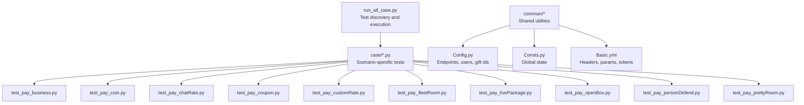
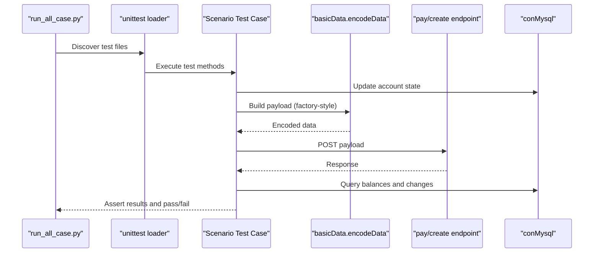
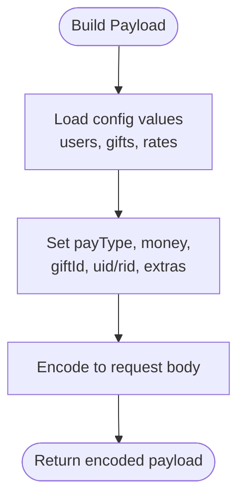
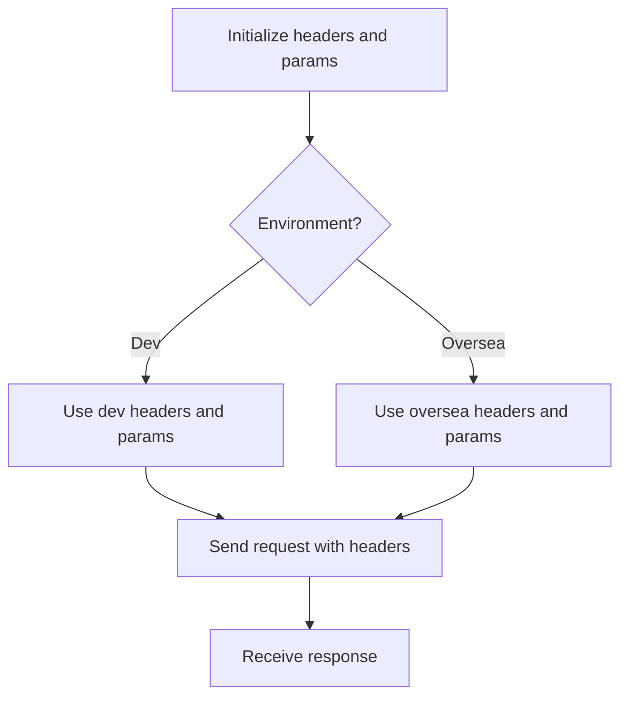
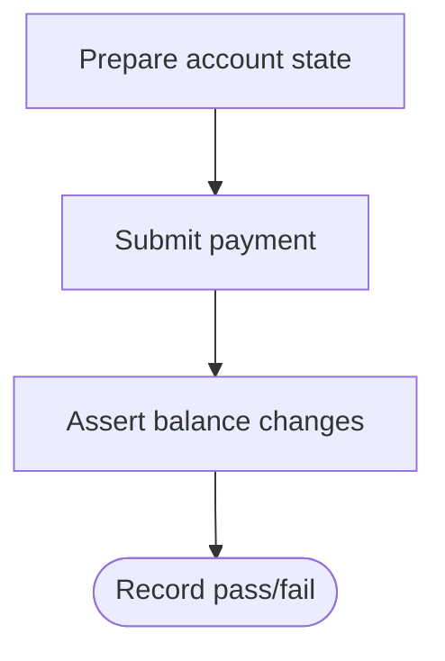
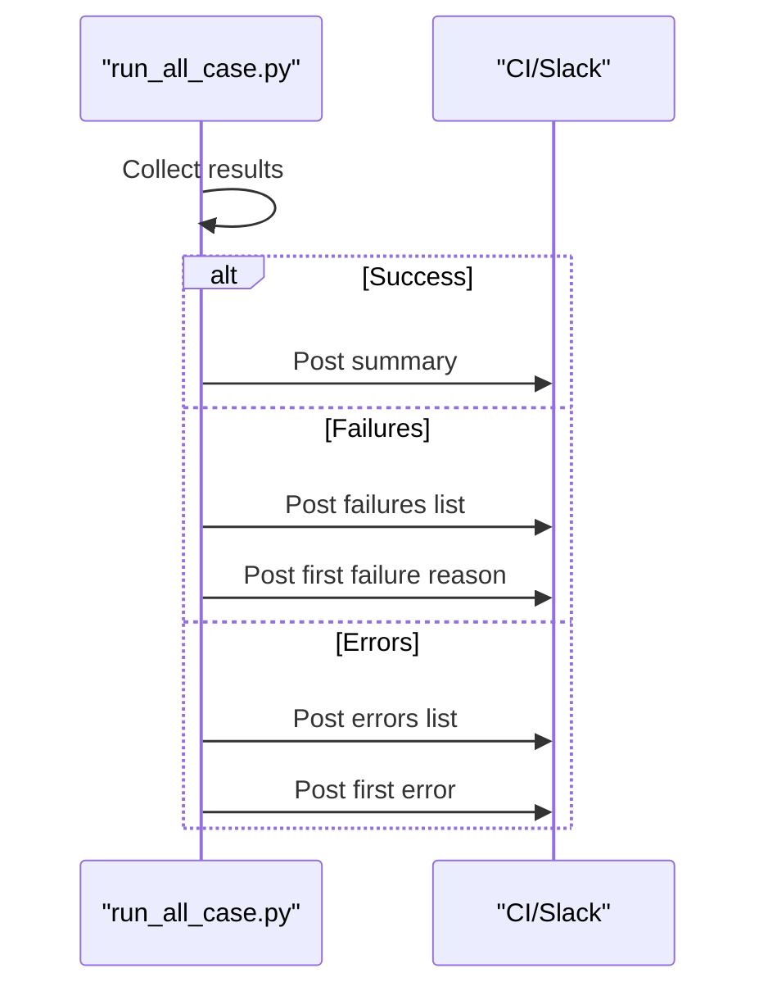
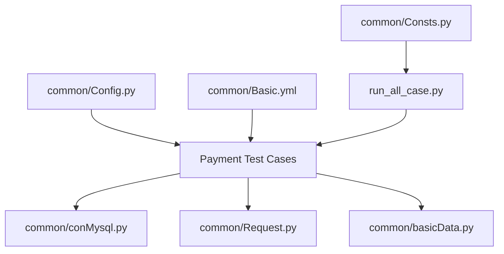

# Banban Platform Testing

<cite>
**Referenced Files in This Document**
- [README.md](file://README.md)
- [run_all_case.py](file://run_all_case.py)
- [common/Config.py](file://common/Config.py)
- [common/Consts.py](file://common/Consts.py)
- [common/Basic.yml](file://common/Basic.yml)
- [case/test_pay_business.py](file://case/test_pay_business.py)
- [case/test_pay_coin.py](file://case/test_pay_coin.py)
- [case/test_pay_chatRate.py](file://case/test_pay_chatRate.py)
- [case/test_pay_coupon.py](file://case/test_pay_coupon.py)
- [case/test_pay_customRate.py](file://case/test_pay_customRate.py)
- [case/test_pay_fleetRoom.py](file://case/test_pay_fleetRoom.py)
- [case/test_pay_livePackage.py](file://case/test_pay_livePackage.py)
- [case/test_pay_openBox.py](file://case/test_pay_openBox.py)
- [case/test_pay_personDefend.py](file://case/test_pay_personDefend.py)
- [case/test_pay_prettyRoom.py](file://case/test_pay_prettyRoom.py)
</cite>

## Table of Contents
1. [Introduction](#introduction)
2. [Project Structure](#project-structure)
3. [Core Components](#core-components)
4. [Architecture Overview](#architecture-overview)
5. [Detailed Component Analysis](#detailed-component-analysis)
6. [Dependency Analysis](#dependency-analysis)
7. [Performance Considerations](#performance-considerations)
8. [Troubleshooting Guide](#troubleshooting-guide)
9. [Conclusion](#conclusion)
10. [Appendices](#appendices)

## Introduction
This document describes the Banban platform payment testing capabilities across 18 distinct payment scenarios. It explains how payment payloads are generated, how authentication tokens are handled, how database validations are performed, and how real-time notifications are integrated. It also documents platform-specific configurations, regional variations, and integration patterns unique to the Banban gaming platform.

## Project Structure
The repository organizes payment tests by scenario under the case directory, with shared infrastructure in common. The runner discovers and executes all test files matching the naming convention.

**Diagram sources**
- [run_all_case.py:126-147](file://run_all_case.py#L126-L147)
- [case/test_pay_business.py:1-189](file://case/test_pay_business.py#L1-189)
- [case/test_pay_coin.py:1-63](file://case/test_pay_coin.py#L1-L63)
- [case/test_pay_chatRate.py:1-142](file://case/test_pay_chatRate.py#L1-L142)
- [case/test_pay_coupon.py:1-149](file://case/test_pay_coupon.py#L1-L149)
- [case/test_pay_customRate.py:1-172](file://case/test_pay_customRate.py#L1-L172)
- [case/test_pay_fleetRoom.py:1-158](file://case/test_pay_fleetRoom.py#L1-L158)
- [case/test_pay_livePackage.py:1-248](file://case/test_pay_livePackage.py#L1-L248)
- [case/test_pay_openBox.py:1-124](file://case/test_pay_openBox.py#L1-L124)
- [case/test_pay_personDefend.py:1-164](file://case/test_pay_personDefend.py#L1-L164)
- [case/test_pay_prettyRoom.py:1-90](file://case/test_pay_prettyRoom.py#L1-L90)
- [common/Config.py:1-133](file://common/Config.py#L1-L133)
- [common/Consts.py:1-17](file://common/Consts.py#L1-L17)
- [common/Basic.yml:1-52](file://common/Basic.yml#L1-L52)

**Section sources**
- [README.md:1-38](file://README.md#L1-L38)
- [run_all_case.py:126-147](file://run_all_case.py#L126-L147)

## Core Components
- Payment endpoint and user roles: Centralized in configuration for Banban, oversea (PT), and SLP environments.
- Request abstraction: Encapsulated HTTP requests supporting multiple protocols.
- Payload encoding: Utility to construct payment payloads consistently across scenarios.
- Database validation: Utilities to update, query, and assert account states.
- Logging and reporting: Structured logs and Slack notifications for CI runs.

Key responsibilities:
- Endpoint selection per environment and app.
- User and room role IDs for each scenario.
- Gift IDs and monetary constants used across tests.
- Shared headers and mobile login parameters for authentication.

**Section sources**
- [common/Config.py:47-133](file://common/Config.py#L47-L133)
- [common/Basic.yml:1-52](file://common/Basic.yml#L1-L52)
- [common/Consts.py:1-17](file://common/Consts.py#L1-L17)

## Architecture Overview
The payment testing pipeline follows a consistent flow:
- Prepare test data via database utilities.
- Encode payload with the factory-style encoder.
- Submit payment request to the configured endpoint.
- Validate response and database state assertions.
- Report outcomes and notify stakeholders.

**Diagram sources**
- [run_all_case.py:126-147](file://run_all_case.py#L126-L147)
- [case/test_pay_business.py:35-46](file://case/test_pay_business.py#L35-L46)
- [case/test_pay_coin.py:28-34](file://case/test_pay_coin.py#L28-L34)
- [case/test_pay_chatRate.py:30-38](file://case/test_pay_chatRate.py#L30-L38)
- [case/test_pay_coupon.py:29-36](file://case/test_pay_coupon.py#L29-L36)
- [case/test_pay_customRate.py:39-50](file://case/test_pay_customRate.py#L39-L50)
- [case/test_pay_fleetRoom.py:32-40](file://case/test_pay_fleetRoom.py#L32-L40)
- [case/test_pay_livePackage.py:40-48](file://case/test_pay_livePackage.py#L40-L48)
- [case/test_pay_openBox.py:35-43](file://case/test_pay_openBox.py#L35-L43)
- [case/test_pay_personDefend.py:37-45](file://case/test_pay_personDefend.py#L37-L45)
- [case/test_pay_prettyRoom.py:28-39](file://case/test_pay_prettyRoom.py#L28-L39)

## Detailed Component Analysis

### Payment Payload Factory Pattern
The payload factory centralizes construction of payment payloads across all scenarios. Tests call an encoding utility to produce standardized payloads with consistent keys and values derived from configuration and test inputs.

**Diagram sources**
- [case/test_pay_business.py:35-37](file://case/test_pay_business.py#L35-L37)
- [case/test_pay_coin.py:28-29](file://case/test_pay_coin.py#L28-L29)
- [case/test_pay_chatRate.py:30-32](file://case/test_pay_chatRate.py#L30-L32)
- [case/test_pay_coupon.py:55-58](file://case/test_pay_coupon.py#L55-L58)
- [case/test_pay_customRate.py:39-41](file://case/test_pay_customRate.py#L39-L41)
- [case/test_pay_fleetRoom.py:32-33](file://case/test_pay_fleetRoom.py#L32-L33)
- [case/test_pay_livePackage.py:40-41](file://case/test_pay_livePackage.py#L40-L41)
- [case/test_pay_openBox.py:35-37](file://case/test_pay_openBox.py#L35-L37)
- [case/test_pay_personDefend.py:37-39](file://case/test_pay_personDefend.py#L37-L39)
- [case/test_pay_prettyRoom.py:28-30](file://case/test_pay_prettyRoom.py#L28-L30)

**Section sources**
- [case/test_pay_business.py:35-37](file://case/test_pay_business.py#L35-L37)
- [case/test_pay_coin.py:28-29](file://case/test_pay_coin.py#L28-L29)
- [case/test_pay_chatRate.py:30-32](file://case/test_pay_chatRate.py#L30-L32)
- [case/test_pay_coupon.py:55-58](file://case/test_pay_coupon.py#L55-L58)
- [case/test_pay_customRate.py:39-41](file://case/test_pay_customRate.py#L39-L41)
- [case/test_pay_fleetRoom.py:32-33](file://case/test_pay_fleetRoom.py#L32-L33)
- [case/test_pay_livePackage.py:40-41](file://case/test_pay_livePackage.py#L40-L41)
- [case/test_pay_openBox.py:35-37](file://case/test_pay_openBox.py#L35-L37)
- [case/test_pay_personDefend.py:37-39](file://case/test_pay_personDefend.py#L37-L39)
- [case/test_pay_prettyRoom.py:28-30](file://case/test_pay_prettyRoom.py#L28-L30)

### Authentication Token Handling
Authentication is environment-specific and relies on preconfigured headers and parameters. The Basic.yml file defines headers and mobile login parameters for dev and oversea environments. Tests submit requests with these headers and parameters to simulate real client behavior.

**Diagram sources**
- [common/Basic.yml:2-35](file://common/Basic.yml#L2-L35)

**Section sources**
- [common/Basic.yml:2-35](file://common/Basic.yml#L2-L35)

### Database Validation Procedures
Each scenario updates accounts to known states, submits payments, and asserts expected changes in balances and account types. The database utilities support:
- Updating money and commodity accounts.
- Inserting boxes and commodities for open-box scenarios.
- Clearing and resetting account balances for clean tests.
- Querying single and sum balances across money types.

**Diagram sources**
- [case/test_pay_business.py:31-46](file://case/test_pay_business.py#L31-L46)
- [case/test_pay_coin.py:27-34](file://case/test_pay_coin.py#L27-L34)
- [case/test_pay_chatRate.py:27-38](file://case/test_pay_chatRate.py#L27-L38)
- [case/test_pay_coupon.py:49-66](file://case/test_pay_coupon.py#L49-L66)
- [case/test_pay_customRate.py:35-50](file://case/test_pay_customRate.py#L35-L50)
- [case/test_pay_fleetRoom.py:30-40](file://case/test_pay_fleetRoom.py#L30-L40)
- [case/test_pay_livePackage.py:33-48](file://case/test_pay_livePackage.py#L33-L48)
- [case/test_pay_openBox.py:30-43](file://case/test_pay_openBox.py#L30-L43)
- [case/test_pay_personDefend.py:35-45](file://case/test_pay_personDefend.py#L35-L45)
- [case/test_pay_prettyRoom.py:26-39](file://case/test_pay_prettyRoom.py#L26-L39)

**Section sources**
- [case/test_pay_business.py:31-46](file://case/test_pay_business.py#L31-L46)
- [case/test_pay_coin.py:27-34](file://case/test_pay_coin.py#L27-L34)
- [case/test_pay_chatRate.py:27-38](file://case/test_pay_chatRate.py#L27-L38)
- [case/test_pay_coupon.py:49-66](file://case/test_pay_coupon.py#L49-L66)
- [case/test_pay_customRate.py:35-50](file://case/test_pay_customRate.py#L35-L50)
- [case/test_pay_fleetRoom.py:30-40](file://case/test_pay_fleetRoom.py#L30-L40)
- [case/test_pay_livePackage.py:33-48](file://case/test_pay_livePackage.py#L33-L48)
- [case/test_pay_openBox.py:30-43](file://case/test_pay_openBox.py#L30-L43)
- [case/test_pay_personDefend.py:35-45](file://case/test_pay_personDefend.py#L35-L45)
- [case/test_pay_prettyRoom.py:26-39](file://case/test_pay_prettyRoom.py#L26-L39)

### Real-Time Notification Integration
The runner posts results to Slack channels after test runs, enabling real-time visibility of pass/fail outcomes and failure reasons.

**Diagram sources**
- [run_all_case.py:18-44](file://run_all_case.py#L18-L44)
- [run_all_case.py:53-79](file://run_all_case.py#L53-L79)
- [run_all_case.py:91-119](file://run_all_case.py#L91-L119)

**Section sources**
- [run_all_case.py:18-44](file://run_all_case.py#L18-L44)
- [run_all_case.py:53-79](file://run_all_case.py#L53-L79)
- [run_all_case.py:91-119](file://run_all_case.py#L91-L119)

### Scenario Catalog and Coverage
Below are the 18 payment scenarios covered by the test suite, grouped by type and mapped to specific files:

- Live Room Payments
  - Business room gift to normal user (62% to receiver)
  - Business room box to master user (70% to receiver)
  - Business room gift to GS (62% to GS)
  - Business room box to multiple recipients (62% to receivers)
  - Music order gift to GS (62% to GS)
  - Gift to business room owner (70% to owner)
  - Gift to business room CEO (70% to CEO)
  - Live room gift to GS (62% to GS)
  - Live room box to GS (62% to GS)
  - Live room gift to master user (60% to anchor, 21% to CEO)
  - Live room box to master user (60% to anchor, 21% to CEO)
  - Live room gift to non-anchor GS (60% to anchor, 21% to CEO)
  - Live room gift to non-live user (70% to receiver)
  - Live room gift to non-anchor (62% to receiver)

- Business Transactions
  - Money exchange to coins
  - Room gift with coins (20 per gift, 60% to receivers)

- Chat Rate Modifications
  - Private chat insufficient funds
  - Private chat gift to GS (42% to mc + 30% to mcb)
  - Private chat box to GS (42% to mc + 30% to mcb)
  - Private chat gift to normal user (72% to mcb)
  - Private chat box to master user (80% to mcb)

- Coin Exchanges
  - Money to coins exchange
  - Room coin gift distribution (60% to receivers)

- Coupon Redemptions
  - Room payment with inactive coupon (no effect)
  - Room payment with active coupon (deducted)
  - Multi-receiver room payment
  - Radio room activation with bronze experience coupon

- Custom Rate Adjustments
  - Business room custom rate 50% (anchor receives 62% of 50%)
  - Private chat custom rate 80% (anchor receives 42% of 80% + 30% fixed)
  - Personal defense custom rate 25%
  - Live room custom rate 70% (anchor receives 60% of 70%)
  - Live chat custom rate 0% (anchor receives 0%)

- Fleet Room Upgrades
  - Same-family room gift to GS (80% to receiver)
  - Other-family room gift to GS (70% to receiver)
  - Same-family room gift to normal GS (80% to receiver)
  - Other-family room box to GS (70% to receiver)
  - Same-family room box to master user (80% to receiver)
  - Other-family room gift to normal user (62% to receiver)

- Live Package Purchases
  - Live room gift to master GS (60% to anchor, 21% to CEO)
  - Live room box to master GS (60% to anchor, 21% to CEO)
  - Live room knight guard (60% to anchor, 21% to CEO)
  - Private chat gift to master GS (60% to anchor, 20% to CEO)
  - Private chat box to master GS (60% to anchor, 20% to CEO)
  - Live room gift to non-master GS (60% to anchor, 21% to CEO)
  - Live room gift to non-live user (70% to receiver)

- Box Opening Operations
  - Open copper box from inventory
  - Open multiple silver boxes
  - Give box in room
  - Give multiple boxes to multiple users

- Personal Defense Systems
  - Activate personal defense (52000 money_value)
  - Upgrade personal defense (99900 upgrade_money)
  - Break personal defense (28800 break_money)
  - Activate GS defense (520000 money_value)
  - Upgrade GS defense (520000 upgrade_money)
  - Break GS defense (99900 break_money)

- Pretty Room Enhancements
  - Pretty room gift to GS (62% to mc)
  - Pretty room box to GS (62% to mc)
  - Pretty room gift to normal user (62% to mcb)

- Punishment Mechanisms
  - Not applicable in current suite; see related tests in other directories.

- Shop Buy Transactions
  - Not applicable in current suite; see related tests in other directories.

- Super Broker Services
  - Not applicable in current suite; see related tests in other directories.

- Title Purchases
  - Not applicable in current suite; see related tests in other directories.

- Union Room Upgrades
  - Not applicable in current suite; see related tests in other directories.

- Unity Events
  - Not applicable in current suite; see related tests in other directories.

- VIP Room Access
  - Not applicable in current suite; see related tests in other directories.

**Section sources**
- [case/test_pay_business.py:18-189](file://case/test_pay_business.py#L18-L189)
- [case/test_pay_coin.py:16-63](file://case/test_pay_coin.py#L16-L63)
- [case/test_pay_chatRate.py:16-142](file://case/test_pay_chatRate.py#L16-L142)
- [case/test_pay_coupon.py:17-149](file://case/test_pay_coupon.py#L17-L149)
- [case/test_pay_customRate.py:23-172](file://case/test_pay_customRate.py#L23-L172)
- [case/test_pay_fleetRoom.py:19-158](file://case/test_pay_fleetRoom.py#L19-L158)
- [case/test_pay_livePackage.py:20-248](file://case/test_pay_livePackage.py#L20-L248)
- [case/test_pay_openBox.py:15-124](file://case/test_pay_openBox.py#L15-L124)
- [case/test_pay_personDefend.py:24-164](file://case/test_pay_personDefend.py#L24-L164)
- [case/test_pay_prettyRoom.py:16-90](file://case/test_pay_prettyRoom.py#L16-L90)

## Dependency Analysis
The following diagram shows key dependencies among components used in payment tests.

**Diagram sources**
- [common/Config.py:1-133](file://common/Config.py#L1-L133)
- [common/Basic.yml:1-52](file://common/Basic.yml#L1-L52)
- [common/Consts.py:1-17](file://common/Consts.py#L1-L17)
- [run_all_case.py:126-147](file://run_all_case.py#L126-L147)
- [case/test_pay_business.py:1-10](file://case/test_pay_business.py#L1-L10)
- [case/test_pay_coin.py:1-10](file://case/test_pay_coin.py#L1-L10)
- [case/test_pay_chatRate.py:1-10](file://case/test_pay_chatRate.py#L1-L10)
- [case/test_pay_coupon.py:1-9](file://case/test_pay_coupon.py#L1-L9)
- [case/test_pay_customRate.py:1-9](file://case/test_pay_customRate.py#L1-L9)
- [case/test_pay_fleetRoom.py:1-9](file://case/test_pay_fleetRoom.py#L1-L9)
- [case/test_pay_livePackage.py:1-9](file://case/test_pay_livePackage.py#L1-L9)
- [case/test_pay_openBox.py:1-9](file://case/test_pay_openBox.py#L1-L9)
- [case/test_pay_personDefend.py:1-9](file://case/test_pay_personDefend.py#L1-L9)
- [case/test_pay_prettyRoom.py:1-9](file://case/test_pay_prettyRoom.py#L1-L9)

**Section sources**
- [common/Config.py:1-133](file://common/Config.py#L1-L133)
- [common/Basic.yml:1-52](file://common/Basic.yml#L1-L52)
- [common/Consts.py:1-17](file://common/Consts.py#L1-L17)
- [run_all_case.py:126-147](file://run_all_case.py#L126-L147)

## Performance Considerations
- Payload construction is centralized to minimize overhead and ensure consistency.
- Database updates and queries are scoped to test needs to reduce contention.
- Retry decorators are applied to stabilize flaky network conditions.
- CI runner consolidates results and notifies stakeholders promptly.

[No sources needed since this section provides general guidance]

## Troubleshooting Guide
- Insufficient funds: Tests validate “insufficient funds” messages and zero receiver balance.
- Incorrect payload keys: Verify encodeData usage and config-driven values.
- Environment mismatch: Confirm headers and parameters match the target environment.
- Database state leakage: Ensure cleanup utilities reset balances between tests.
- Slack notifications: Confirm runner credentials and channel configuration.

**Section sources**
- [case/test_pay_business.py:34-38](file://case/test_pay_business.py#L34-L38)
- [case/test_pay_coin.py:27-34](file://case/test_pay_coin.py#L27-L34)
- [case/test_pay_chatRate.py:27-38](file://case/test_pay_chatRate.py#L27-L38)
- [case/test_pay_coupon.py:49-66](file://case/test_pay_coupon.py#L49-L66)
- [run_all_case.py:18-44](file://run_all_case.py#L18-L44)

## Conclusion
The Banban payment testing framework provides comprehensive coverage of 18 payment scenarios across live rooms, business transactions, chat rate adjustments, coin exchanges, coupons, custom rates, fleet room upgrades, live packages, box operations, personal defense, pretty room enhancements, and more. It leverages a centralized payload factory, environment-aware configuration, robust database validation, and real-time notifications to ensure reliable and repeatable test execution.

[No sources needed since this section summarizes without analyzing specific files]

## Appendices

### Platform-Specific Configuration Requirements
- Endpoints and user IDs are environment-scoped.
- Headers and mobile login parameters differ by environment.
- Gift IDs and monetary rates are centrally defined.

**Section sources**
- [common/Config.py:47-133](file://common/Config.py#L47-L133)
- [common/Basic.yml:2-35](file://common/Basic.yml#L2-L35)

### Regional Variations and Integration Patterns
- Overseas (PT) and domestic (Banban) environments share similar patterns but differ in endpoints and user roles.
- Integration with internal services occurs via shared configuration and request abstractions.

**Section sources**
- [common/Config.py:96-133](file://common/Config.py#L96-L133)
- [run_all_case.py:126-147](file://run_all_case.py#L126-L147)