# Live Room Payment Scenarios

<cite>
**Referenced Files in This Document**
- [README.md](file://README.md)
- [case/test_pay_bean.py](file://case/test_pay_bean.py)
- [case/test_pay_chatRate.py](file://case/test_pay_chatRate.py)
- [case/test_pay_livePackage.py](file://case/test_pay_livePackage.py)
- [case/test_pay_vipRoom.py](file://case/test_pay_vipRoom.py)
- [case/test_pay_fleetRoom.py](file://case/test_pay_fleetRoom.py)
- [case/test_pay_unionRoom.py](file://case/test_pay_unionRoom.py)
- [case/test_pay_shopBuy.py](file://case/test_pay_shopBuy.py)
- [common/Config.py](file://common/Config.py)
- [common/basicData.py](file://common/basicData.py)
- [common/Request.py](file://common/Request.py)
- [common/conMysql.py](file://common/conMysql.py)
- [common/Session.py](file://common/Session.py)
- [common/method.py](file://common/method.py)
- [common/Consts.py](file://common/Consts.py)
</cite>

## Table of Contents
1. [Introduction](#introduction)
2. [Project Structure](#project-structure)
3. [Core Components](#core-components)
4. [Architecture Overview](#architecture-overview)
5. [Detailed Component Analysis](#detailed-component-analysis)
6. [Dependency Analysis](#dependency-analysis)
7. [Performance Considerations](#performance-considerations)
8. [Troubleshooting Guide](#troubleshooting-guide)
9. [Conclusion](#conclusion)

## Introduction
This document explains the live room payment scenarios in the Banban platform, focusing on the gift purchasing system and room-based interactions. It covers:
- Gold bean gifts and diamond gift transactions
- Chat rate modifications and live package purchases
- Tip distribution algorithms, platform fee calculations, and VIP room access controls
- Factory pattern implementation for generating payment payloads
- Authentication token handling for room sessions
- Real-time validation of gift delivery
- Database validation procedures for tracking transactions, user balance updates, and reward recipient verification

The content is derived from the test suite and shared utilities that orchestrate payment flows across rooms, chats, and packages.

## Project Structure
The repository organizes payment tests by scenario under the case directory, with shared utilities in common. Tests exercise room-based gift payments, chat gift rates, VIP room distributions, fleet/union room rules, and shop purchases.

```mermaid
graph TB
subgraph "Tests"
T1["case/test_pay_bean.py"]
T2["case/test_pay_chatRate.py"]
T3["case/test_pay_livePackage.py"]
T4["case/test_pay_vipRoom.py"]
T5["case/test_pay_fleetRoom.py"]
T6["case/test_pay_unionRoom.py"]
T7["case/test_pay_shopBuy.py"]
end
subgraph "Common Utilities"
U1["common/Config.py"]
U2["common/basicData.py"]
U3["common/Request.py"]
U4["common/conMysql.py"]
U5["common/Session.py"]
U6["common/method.py"]
U7["common/Consts.py"]
end
T1 --> U1
T2 --> U1
T3 --> U1
T4 --> U1
T5 --> U1
T6 --> U1
T7 --> U1
T1 --> U2
T2 --> U2
T3 --> U2
T4 --> U2
T5 --> U2
T6 --> U2
T7 --> U2
T1 --> U3
T2 --> U3
T3 --> U3
T4 --> U3
T5 --> U3
T6 --> U3
T7 --> U3
T1 --> U4
T2 --> U4
T3 --> U4
T4 --> U4
T5 --> U4
T6 --> U4
T7 --> U4
T1 --> U5
T2 --> U5
T3 --> U5
T4 --> U5
T5 --> U5
T6 --> U5
T7 --> U5
T1 --> U6
T2 --> U6
T3 --> U6
T4 --> U6
T5 --> U6
T6 --> U6
T7 --> U6
T1 --> U7
T2 --> U7
T3 --> U7
T4 --> U7
T5 --> U7
T6 --> U7
T7 --> U7
```

**Diagram sources**
- [README.md:1-38](file://README.md#L1-L38)
- [case/test_pay_bean.py:1-188](file://case/test_pay_bean.py#L1-L188)
- [case/test_pay_chatRate.py:1-142](file://case/test_pay_chatRate.py#L1-L142)
- [case/test_pay_livePackage.py:1-248](file://case/test_pay_livePackage.py#L1-L248)
- [case/test_pay_vipRoom.py:1-90](file://case/test_pay_vipRoom.py#L1-L90)
- [case/test_pay_fleetRoom.py:1-158](file://case/test_pay_fleetRoom.py#L1-L158)
- [case/test_pay_unionRoom.py:1-119](file://case/test_pay_unionRoom.py#L1-L119)
- [case/test_pay_shopBuy.py:1-124](file://case/test_pay_shopBuy.py#L1-L124)
- [common/Config.py:1-133](file://common/Config.py#L1-L133)
- [common/basicData.py:1-581](file://common/basicData.py#L1-L581)
- [common/Request.py:1-162](file://common/Request.py#L1-L162)
- [common/conMysql.py:1-530](file://common/conMysql.py#L1-L530)
- [common/Session.py:1-200](file://common/Session.py#L1-L200)
- [common/method.py:1-171](file://common/method.py#L1-L171)
- [common/Consts.py:1-17](file://common/Consts.py#L1-L17)

**Section sources**
- [README.md:1-38](file://README.md#L1-L38)

## Core Components
- Payment payload factory: Encodes payment requests for various scenarios (room packages, chat gifts, shop buys, knight defend, etc.) using a centralized encoder.
- Request orchestration: Sends signed POST requests with a user token header to the payment endpoint.
- Database validators: Updates and queries user balances, commodity counts, broker roles, mentor levels, and room ownership to validate outcomes.
- Token management: Generates or retrieves session tokens for authenticated room sessions.
- Rate and VIP helpers: Computes VIP experience gains and applies chat rate tiers for guild and individual recipients.

Key responsibilities:
- Encode payment payloads for room-based and chat-based gift transactions
- Authenticate via token and submit to the payment endpoint
- Validate balances, commodity counts, and role-based distributions
- Apply platform fee and rate rules per room type and user tier

**Section sources**
- [common/basicData.py:8-325](file://common/basicData.py#L8-L325)
- [common/Request.py:17-59](file://common/Request.py#L17-L59)
- [common/conMysql.py:27-204](file://common/conMysql.py#L27-L204)
- [common/Session.py:167-182](file://common/Session.py#L167-L182)
- [common/method.py:163-171](file://common/method.py#L163-L171)

## Architecture Overview
The payment flow follows a consistent pattern across scenarios:
- Prepare test data (balances, roles, commodities)
- Encode payload via the factory
- Submit request with a user token
- Validate response and database state

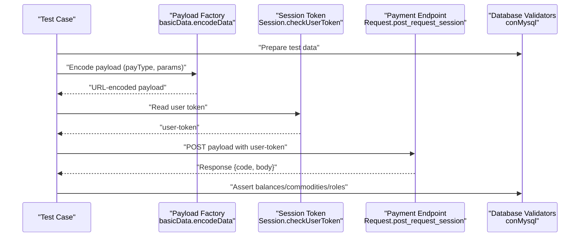

**Diagram sources**
- [common/basicData.py:8-325](file://common/basicData.py#L8-L325)
- [common/Request.py:17-59](file://common/Request.py#L17-L59)
- [common/conMysql.py:27-204](file://common/conMysql.py#L27-L204)
- [common/Session.py:167-182](file://common/Session.py#L167-L182)

## Detailed Component Analysis

### Gift Purchasing System: Beans, Diamonds, and Shop Buys
- Bean-based gift purchases:
  - Insufficient beans: payment fails with a message indicating insufficient funds; recipient bean balance remains zero.
  - Sufficient beans: bean balance reduces accordingly; recipient receives half of the gift value as bean credit.
  - Partial bean coverage with diamond conversion: remaining cost deducted from diamonds; VIP experience increases based on bean contribution.
- Diamond-based gift purchases:
  - Private chat gift: beans no longer offset platform fees; diamonds fully deducted; recipient receives reduced amount after adjustments.
  - Room gift: beans may still offset fees depending on rules; diamonds cover remainder; recipient receives adjusted amount.
- Shop purchases:
  - Buy single or multiple items; validate wallet and commodity inventory.
  - Gift stored items in rooms; validate item count reduction and recipient earnings.

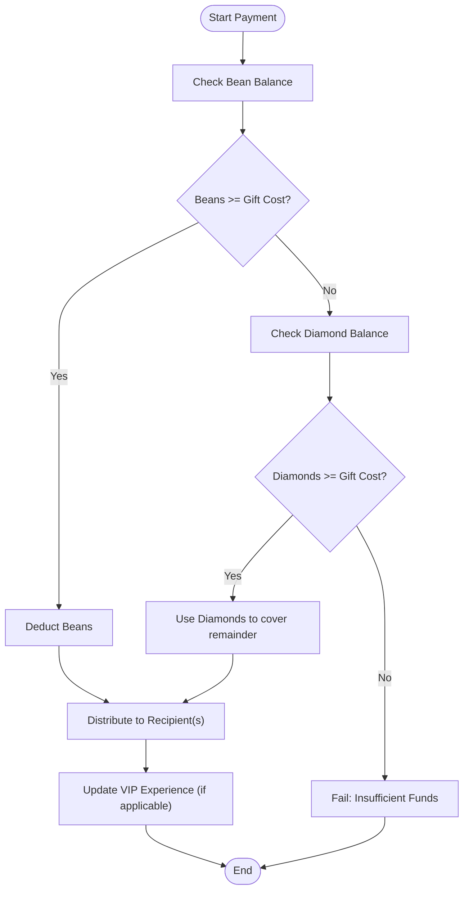

**Diagram sources**
- [case/test_pay_bean.py:37-110](file://case/test_pay_bean.py#L37-L110)
- [case/test_pay_bean.py:112-158](file://case/test_pay_bean.py#L112-L158)
- [case/test_pay_shopBuy.py:21-42](file://case/test_pay_shopBuy.py#L21-L42)
- [case/test_pay_shopBuy.py:44-67](file://case/test_pay_shopBuy.py#L44-L67)
- [case/test_pay_shopBuy.py:70-94](file://case/test_pay_shopBuy.py#L70-L94)
- [case/test_pay_shopBuy.py:97-123](file://case/test_pay_shopBuy.py#L97-L123)

**Section sources**
- [case/test_pay_bean.py:37-110](file://case/test_pay_bean.py#L37-L110)
- [case/test_pay_bean.py:112-158](file://case/test_pay_bean.py#L112-L158)
- [case/test_pay_shopBuy.py:21-42](file://case/test_pay_shopBuy.py#L21-L42)
- [case/test_pay_shopBuy.py:44-67](file://case/test_pay_shopBuy.py#L44-L67)
- [case/test_pay_shopBuy.py:70-94](file://case/test_pay_shopBuy.py#L70-L94)
- [case/test_pay_shopBuy.py:97-123](file://case/test_pay_shopBuy.py#L97-L123)

### Chat Rate Modifications and Private vs Public Room Differences
- Private chat gift:
  - Beans do not offset platform fees; diamonds fully cover cost; recipient receives a reduced share compared to room scenarios.
- Public room chat gift:
  - Beans may offset fees; diamonds cover remainder; recipient receives adjusted share based on room rules.
- Broker and mentor tiers:
  - Guild streamers receive higher shares in certain rooms; mentor tiers influence rates in private chat.

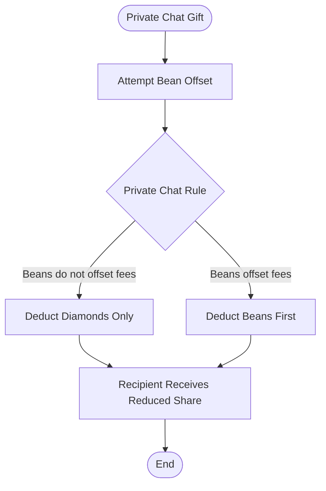

**Diagram sources**
- [case/test_pay_chatRate.py:16-38](file://case/test_pay_chatRate.py#L16-L38)
- [case/test_pay_chatRate.py:40-66](file://case/test_pay_chatRate.py#L40-L66)
- [case/test_pay_chatRate.py:68-93](file://case/test_pay_chatRate.py#L68-L93)
- [case/test_pay_chatRate.py:95-114](file://case/test_pay_chatRate.py#L95-L114)
- [case/test_pay_chatRate.py:116-139](file://case/test_pay_chatRate.py#L116-L139)

**Section sources**
- [case/test_pay_chatRate.py:16-38](file://case/test_pay_chatRate.py#L16-L38)
- [case/test_pay_chatRate.py:40-66](file://case/test_pay_chatRate.py#L40-L66)
- [case/test_pay_chatRate.py:68-93](file://case/test_pay_chatRate.py#L68-L93)
- [case/test_pay_chatRate.py:95-114](file://case/test_pay_chatRate.py#L95-L114)
- [case/test_pay_chatRate.py:116-139](file://case/test_pay_chatRate.py#L116-L139)

### Live Package Purchases and Tip Distribution Algorithms
- Live room gift distribution:
  - Guild streamer with brokerage: split between streamer and guild leader according to configured ratios.
  - Non-guild streamer: personal charm accrues to the streamer.
- Private chat gift distribution:
  - Adjusted ratios apply for guild streamers and non-guild streamers.
- Box gifts:
  - Minimum thresholds and rounded distributions verified against database balances.

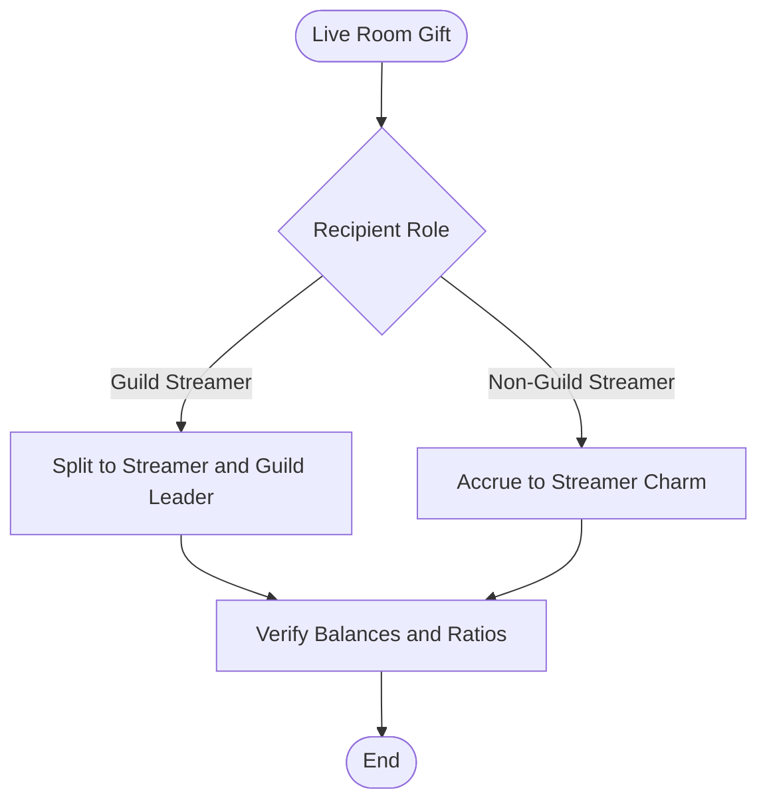

**Diagram sources**
- [case/test_pay_livePackage.py:20-48](file://case/test_pay_livePackage.py#L20-L48)
- [case/test_pay_livePackage.py:50-81](file://case/test_pay_livePackage.py#L50-L81)
- [case/test_pay_livePackage.py:83-112](file://case/test_pay_livePackage.py#L83-L112)
- [case/test_pay_livePackage.py:114-140](file://case/test_pay_livePackage.py#L114-L140)
- [case/test_pay_livePackage.py:142-172](file://case/test_pay_livePackage.py#L142-L172)
- [case/test_pay_livePackage.py:174-202](file://case/test_pay_livePackage.py#L174-L202)
- [case/test_pay_livePackage.py:204-225](file://case/test_pay_livePackage.py#L204-L225)
- [case/test_pay_livePackage.py:227-247](file://case/test_pay_livePackage.py#L227-L247)

**Section sources**
- [case/test_pay_livePackage.py:20-48](file://case/test_pay_livePackage.py#L20-L48)
- [case/test_pay_livePackage.py:50-81](file://case/test_pay_livePackage.py#L50-L81)
- [case/test_pay_livePackage.py:83-112](file://case/test_pay_livePackage.py#L83-L112)
- [case/test_pay_livePackage.py:114-140](file://case/test_pay_livePackage.py#L114-L140)
- [case/test_pay_livePackage.py:142-172](file://case/test_pay_livePackage.py#L142-L172)
- [case/test_pay_livePackage.py:174-202](file://case/test_pay_livePackage.py#L174-L202)
- [case/test_pay_livePackage.py:204-225](file://case/test_pay_livePackage.py#L204-L225)
- [case/test_pay_livePackage.py:227-247](file://case/test_pay_livePackage.py#L227-L247)

### VIP Room Access Controls and Earnings
- VIP room gift earnings:
  - Recipients receive a fixed ratio to personal charm accounts.
  - Remaining balance reflects the paid amount minus distribution.
- Box gifts:
  - Minimum thresholds and rounded distributions verified against database balances.

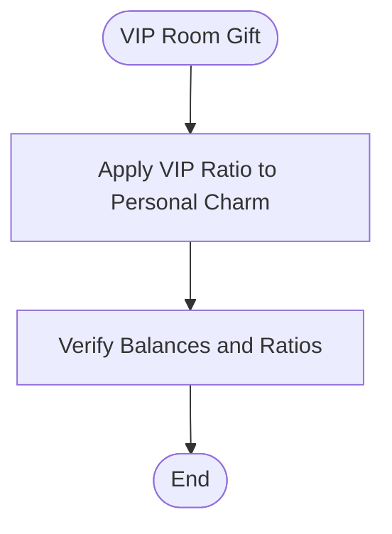

**Diagram sources**
- [case/test_pay_vipRoom.py:18-40](file://case/test_pay_vipRoom.py#L18-L40)
- [case/test_pay_vipRoom.py:41-66](file://case/test_pay_vipRoom.py#L41-L66)
- [case/test_pay_vipRoom.py:67-90](file://case/test_pay_vipRoom.py#L67-L90)

**Section sources**
- [case/test_pay_vipRoom.py:18-40](file://case/test_pay_vipRoom.py#L18-L40)
- [case/test_pay_vipRoom.py:41-66](file://case/test_pay_vipRoom.py#L41-L66)
- [case/test_pay_vipRoom.py:67-90](file://case/test_pay_vipRoom.py#L67-L90)

### Fleet Room and Union Room Access Controls
- Fleet room:
  - Same-family room: guild streamers receive higher shares; non-guild streamers receive slightly lower shares.
  - Other-family room: different share percentages apply for guild and non-guild recipients.
- Union room:
  - Guild streamers receive a fixed guild share; non-guild recipients receive personal charm shares.

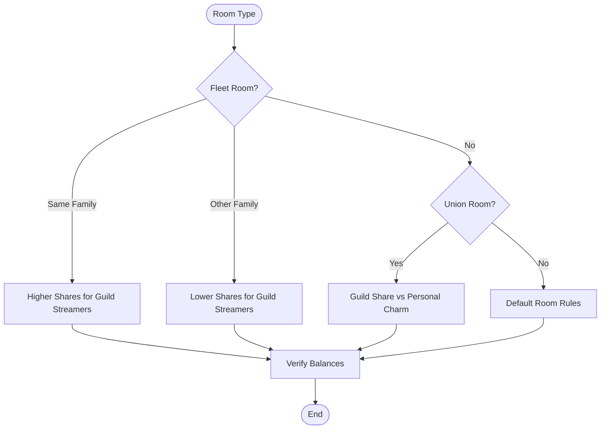

**Diagram sources**
- [case/test_pay_fleetRoom.py:19-41](file://case/test_pay_fleetRoom.py#L19-L41)
- [case/test_pay_fleetRoom.py:42-63](file://case/test_pay_fleetRoom.py#L42-L63)
- [case/test_pay_fleetRoom.py:65-86](file://case/test_pay_fleetRoom.py#L65-L86)
- [case/test_pay_fleetRoom.py:88-111](file://case/test_pay_fleetRoom.py#L88-L111)
- [case/test_pay_fleetRoom.py:113-136](file://case/test_pay_fleetRoom.py#L113-L136)
- [case/test_pay_fleetRoom.py:138-157](file://case/test_pay_fleetRoom.py#L138-L157)
- [case/test_pay_unionRoom.py:21-45](file://case/test_pay_unionRoom.py#L21-L45)
- [case/test_pay_unionRoom.py:47-69](file://case/test_pay_unionRoom.py#L47-L69)
- [case/test_pay_unionRoom.py:71-97](file://case/test_pay_unionRoom.py#L71-L97)
- [case/test_pay_unionRoom.py:99-118](file://case/test_pay_unionRoom.py#L99-L118)

**Section sources**
- [case/test_pay_fleetRoom.py:19-41](file://case/test_pay_fleetRoom.py#L19-L41)
- [case/test_pay_fleetRoom.py:42-63](file://case/test_pay_fleetRoom.py#L42-L63)
- [case/test_pay_fleetRoom.py:65-86](file://case/test_pay_fleetRoom.py#L65-L86)
- [case/test_pay_fleetRoom.py:88-111](file://case/test_pay_fleetRoom.py#L88-L111)
- [case/test_pay_fleetRoom.py:113-136](file://case/test_pay_fleetRoom.py#L113-L136)
- [case/test_pay_fleetRoom.py:138-157](file://case/test_pay_fleetRoom.py#L138-L157)
- [case/test_pay_unionRoom.py:21-45](file://case/test_pay_unionRoom.py#L21-L45)
- [case/test_pay_unionRoom.py:47-69](file://case/test_pay_unionRoom.py#L47-L69)
- [case/test_pay_unionRoom.py:71-97](file://case/test_pay_unionRoom.py#L71-L97)
- [case/test_pay_unionRoom.py:99-118](file://case/test_pay_unionRoom.py#L99-L118)

### Platform Fee Calculations and VIP Experience Gains
- VIP experience gain:
  - Based on payment amount and user title multiplier; bean payments receive a fixed multiplier.
- Platform fee offsets:
  - Private chat: beans no longer offset platform fees.
  - Room chat: beans may offset fees depending on rules.

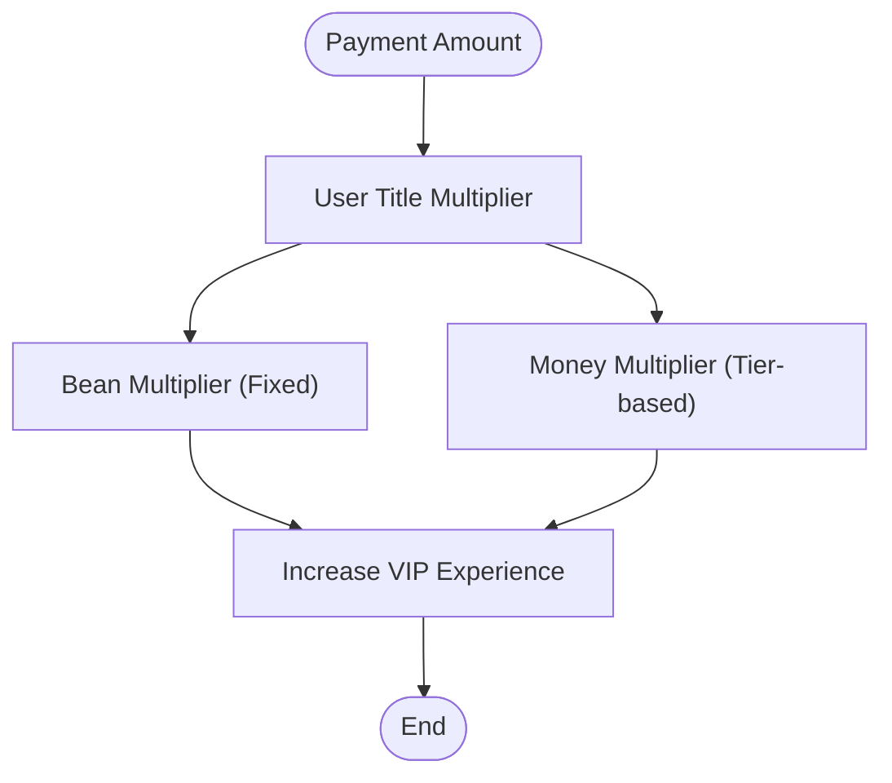

**Diagram sources**
- [common/method.py:163-171](file://common/method.py#L163-L171)
- [case/test_pay_bean.py:83-110](file://case/test_pay_bean.py#L83-L110)
- [case/test_pay_chatRate.py:53-66](file://case/test_pay_chatRate.py#L53-L66)

**Section sources**
- [common/method.py:163-171](file://common/method.py#L163-L171)
- [case/test_pay_bean.py:83-110](file://case/test_pay_bean.py#L83-L110)
- [case/test_pay_chatRate.py:53-66](file://case/test_pay_chatRate.py#L53-L66)

### Factory Pattern Implementation for Payment Payloads
The payload factory centralizes encoding for multiple payment types:
- Room packages (single/multi recipients, exchange mode)
- Chat gifts
- Shop buys (single/multiple items, boxes)
- Defend upgrades and other specialized types

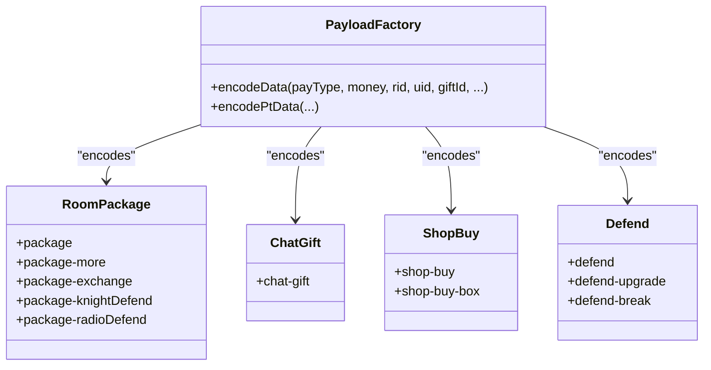

**Diagram sources**
- [common/basicData.py:8-325](file://common/basicData.py#L8-L325)

**Section sources**
- [common/basicData.py:8-325](file://common/basicData.py#L8-L325)

### Authentication Token Handling for Room Sessions
- Token retrieval:
  - Reads a persisted token file or falls back to a generated token based on user index.
- Header injection:
  - Attaches user-token to the request header for authenticated payment submissions.

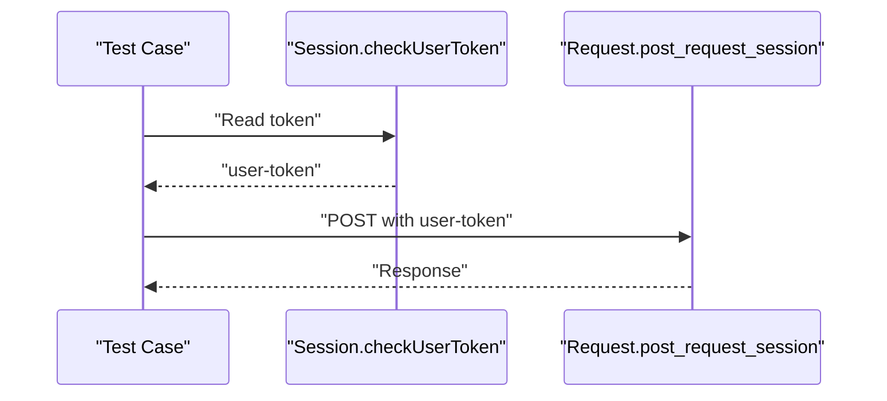

**Diagram sources**
- [common/Session.py:167-182](file://common/Session.py#L167-L182)
- [common/Request.py:17-59](file://common/Request.py#L17-L59)

**Section sources**
- [common/Session.py:167-182](file://common/Session.py#L167-L182)
- [common/Request.py:17-59](file://common/Request.py#L17-L59)

### Real-Time Validation of Gift Delivery
- Immediate checks:
  - Validate response success and messages.
  - Assert database balances and commodity counts.
- Role and room validations:
  - Confirm broker roles, mentor levels, and room ownership before asserting outcomes.

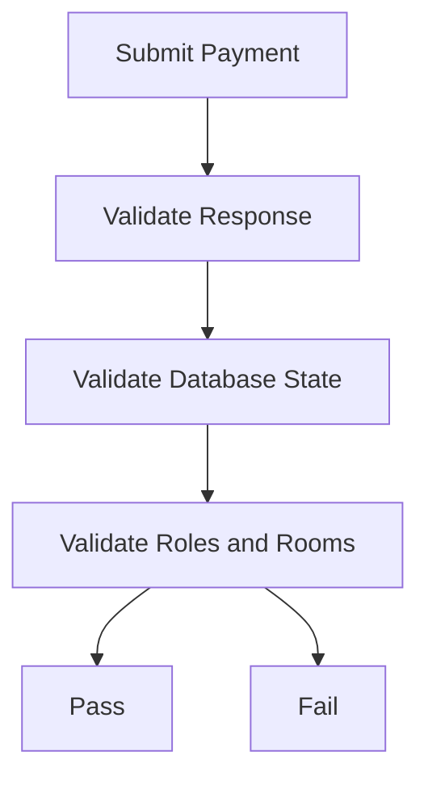

**Diagram sources**
- [case/test_pay_bean.py:23-36](file://case/test_pay_bean.py#L23-L36)
- [case/test_pay_shopBuy.py:32-42](file://case/test_pay_shopBuy.py#L32-L42)
- [common/conMysql.py:27-204](file://common/conMysql.py#L27-L204)

**Section sources**
- [case/test_pay_bean.py:23-36](file://case/test_pay_bean.py#L23-L36)
- [case/test_pay_shopBuy.py:32-42](file://case/test_pay_shopBuy.py#L32-L42)
- [common/conMysql.py:27-204](file://common/conMysql.py#L27-L204)

### Database Validation Procedures
- Account queries:
  - Sum of all money accounts, single account balances, bean/diamond balances, commodity totals.
- Account updates:
  - Reset balances, insert/update bean amounts, update room ownership, broker roles, mentor levels.
- Commodity management:
  - Insert, delete, and query commodity entries for shop and gift scenarios.

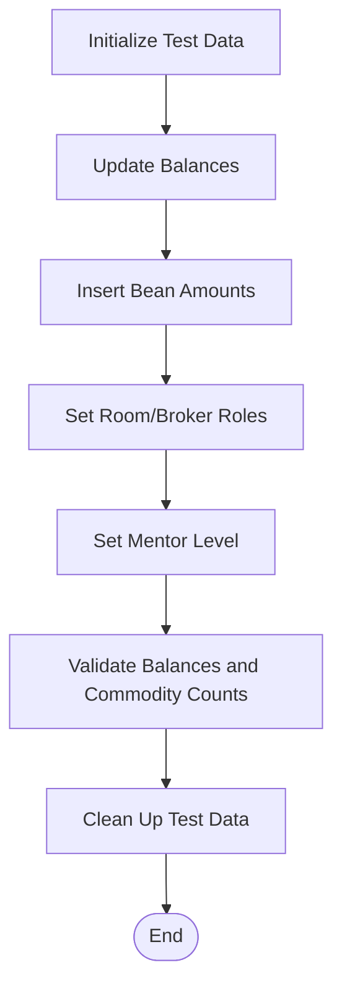

**Diagram sources**
- [common/conMysql.py:27-204](file://common/conMysql.py#L27-L204)
- [common/conMysql.py:336-388](file://common/conMysql.py#L336-L388)
- [common/conMysql.py:424-475](file://common/conMysql.py#L424-L475)

**Section sources**
- [common/conMysql.py:27-204](file://common/conMysql.py#L27-L204)
- [common/conMysql.py:336-388](file://common/conMysql.py#L336-L388)
- [common/conMysql.py:424-475](file://common/conMysql.py#L424-L475)

## Dependency Analysis
The tests depend on shared utilities for configuration, payload encoding, HTTP requests, database operations, token management, and helper functions.

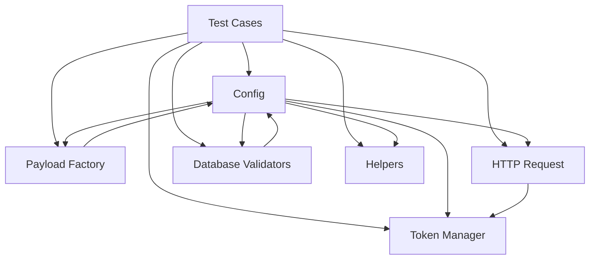

**Diagram sources**
- [common/Config.py:1-133](file://common/Config.py#L1-L133)
- [common/basicData.py:8-325](file://common/basicData.py#L8-L325)
- [common/Request.py:17-59](file://common/Request.py#L17-L59)
- [common/conMysql.py:27-204](file://common/conMysql.py#L27-L204)
- [common/Session.py:167-182](file://common/Session.py#L167-L182)
- [common/method.py:163-171](file://common/method.py#L163-L171)

**Section sources**
- [common/Config.py:1-133](file://common/Config.py#L1-L133)
- [common/basicData.py:8-325](file://common/basicData.py#L8-L325)
- [common/Request.py:17-59](file://common/Request.py#L17-L59)
- [common/conMysql.py:27-204](file://common/conMysql.py#L27-L204)
- [common/Session.py:167-182](file://common/Session.py#L167-L182)
- [common/method.py:163-171](file://common/method.py#L163-L171)

## Performance Considerations
- Minimize repeated database writes by batching updates where possible.
- Reuse encoded payloads to avoid redundant encoding overhead.
- Use token caching to reduce repeated token generation.
- Parallelize independent test cases to improve throughput while respecting shared resource constraints.

## Troubleshooting Guide
- Insufficient funds:
  - Bean-only purchase fails with a message indicating insufficient funds; verify bean and diamond balances.
- Diamond-only purchase:
  - If diamonds are insufficient, payment fails; ensure sufficient diamond balance before attempting.
- Bean-to-diamond conversion:
  - Validate that remaining cost is deducted from diamonds and VIP experience increases appropriately.
- Private chat vs room differences:
  - Confirm that beans do not offset fees in private chat; verify adjusted recipient shares.
- Room-specific rules:
  - Validate guild shares in union/fleet rooms and personal charm accrual in VIP rooms.
- Database state mismatches:
  - Ensure balances, commodity counts, and role flags are reset before assertions.

**Section sources**
- [case/test_pay_bean.py:37-57](file://case/test_pay_bean.py#L37-L57)
- [case/test_pay_bean.py:83-110](file://case/test_pay_bean.py#L83-L110)
- [case/test_pay_bean.py:112-158](file://case/test_pay_bean.py#L112-L158)
- [case/test_pay_chatRate.py:16-38](file://case/test_pay_chatRate.py#L16-L38)
- [case/test_pay_shopBuy.py:97-123](file://case/test_pay_shopBuy.py#L97-L123)

## Conclusion
The Banban live room payment system integrates a robust payload factory, authenticated requests, and comprehensive database validation to support diverse payment scenarios. Rules vary by room type, user role, and payment method, with beans and diamonds applying different offset and conversion behaviors. The test suite ensures correctness across tip distributions, VIP experience gains, and room-specific sharing models.