# Room and Defense Systems

<cite>
**Referenced Files in This Document**
- [test_pay_fleetRoom.py](file://case/test_pay_fleetRoom.py)
- [test_pay_personDefend.py](file://case/test_pay_personDefend.py)
- [test_pay_prettyRoom.py](file://case/test_pay_prettyRoom.py)
- [test_pay_unionRoom.py](file://case/test_pay_unionRoom.py)
- [test_pay_vipRoom.py](file://case/test_pay_vipRoom.py)
- [test_pay_unity.py](file://case/test_pay_unity.py)
- [Config.py](file://common/Config.py)
- [basicData.py](file://common/basicData.py)
- [conMysql.py](file://common/conMysql.py)
- [Consts.py](file://common/Consts.py)
- [test_gs_room.py](file://caseSlp/test_gs_room.py)
- [test_gs_room_defend.py](file://caseSlp/test_gs_room_defend.py)
- [test_many_people_room.py](file://caseSlp/test_many_people_room.py)
</cite>

## Table of Contents
1. [Introduction](#introduction)
2. [Project Structure](#project-structure)
3. [Core Components](#core-components)
4. [Architecture Overview](#architecture-overview)
5. [Detailed Component Analysis](#detailed-component-analysis)
6. [Dependency Analysis](#dependency-analysis)
7. [Performance Considerations](#performance-considerations)
8. [Troubleshooting Guide](#troubleshooting-guide)
9. [Conclusion](#conclusion)

## Introduction
This document explains the room enhancement and defense system payments in the Banban platform. It covers:
- Fleet room upgrade and sharing mechanics
- Personal defense mechanisms and lifecycle (upgrade/break)
- Pretty room decoration and contribution flows
- Union room contributions and guild revenue sharing
- VIP room access and participation rules
- Unity event participation payments
It also documents the hierarchical room system architecture, ownership verification, upgrade prerequisites, defensive capability calculations, decorative item effects, payment validation logic, resource allocation, factory-style room enhancement patterns, multi-user participation handling, and database synchronization for room state management. Integration with room defense algorithms, player interaction limits, and community room governance are included.

## Project Structure
The repository organizes room and defense payment tests under the case directory, with shared utilities in common. Room-specific tests include fleet rooms, personal defense, pretty rooms, union rooms, VIP rooms, and a placeholder for unity events. Shared utilities provide configuration, request encoding, MySQL helpers, and global constants.

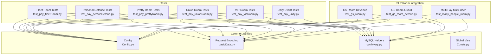

**Diagram sources**
- [test_pay_fleetRoom.py:1-158](file://case/test_pay_fleetRoom.py#L1-L158)
- [test_pay_personDefend.py:1-164](file://case/test_pay_personDefend.py#L1-L164)
- [test_pay_prettyRoom.py:1-90](file://case/test_pay_prettyRoom.py#L1-L90)
- [test_pay_unionRoom.py:1-119](file://case/test_pay_unionRoom.py#L1-L119)
- [test_pay_vipRoom.py:1-90](file://case/test_pay_vipRoom.py#L1-L90)
- [test_pay_unity.py:1-13](file://case/test_pay_unity.py#L1-L13)
- [Config.py:1-133](file://common/Config.py#L1-L133)
- [basicData.py:1-581](file://common/basicData.py#L1-L581)
- [conMysql.py:1-530](file://common/conMysql.py#L1-L530)
- [Consts.py:1-17](file://common/Consts.py#L1-L17)
- [test_gs_room.py:1-589](file://caseSlp/test_gs_room.py#L1-L589)
- [test_gs_room_defend.py:1-59](file://caseSlp/test_gs_room_defend.py#L1-L59)
- [test_many_people_room.py:1-57](file://caseSlp/test_many_people_room.py#L1-L57)

**Section sources**
- [test_pay_fleetRoom.py:1-158](file://case/test_pay_fleetRoom.py#L1-L158)
- [test_pay_personDefend.py:1-164](file://case/test_pay_personDefend.py#L1-L164)
- [test_pay_prettyRoom.py:1-90](file://case/test_pay_prettyRoom.py#L1-L90)
- [test_pay_unionRoom.py:1-119](file://case/test_pay_unionRoom.py#L1-L119)
- [test_pay_vipRoom.py:1-90](file://case/test_pay_vipRoom.py#L1-L90)
- [test_pay_unity.py:1-13](file://case/test_pay_unity.py#L1-L13)
- [Config.py:1-133](file://common/Config.py#L1-L133)
- [basicData.py:1-581](file://common/basicData.py#L1-L581)
- [conMysql.py:1-530](file://common/conMysql.py#L1-L530)
- [Consts.py:1-17](file://common/Consts.py#L1-L17)
- [test_gs_room.py:1-589](file://caseSlp/test_gs_room.py#L1-L589)
- [test_gs_room_defend.py:1-59](file://caseSlp/test_gs_room_defend.py#L1-L59)
- [test_many_people_room.py:1-57](file://caseSlp/test_many_people_room.py#L1-L57)

## Core Components
- Payment request encoder: Encodes room payment payloads with payType, room ID, gift metadata, and user lists.
- Room configuration: Centralized room IDs, gift IDs, and default revenue rates.
- MySQL helpers: Account queries, updates, and room state checks.
- Test suites: Feature-specific validations for fleet, pretty, union, VIP rooms, and personal defense.

Key responsibilities:
- Ownership verification via room property and room factory type
- Upgrade prerequisites and defensive capability calculations
- Decorative item effects and contribution flows
- Resource allocation and revenue distribution per room type
- Multi-user participation and per-recipient distribution

**Section sources**
- [basicData.py:8-325](file://common/basicData.py#L8-L325)
- [Config.py:49-94](file://common/Config.py#L49-L94)
- [conMysql.py:27-204](file://common/conMysql.py#L27-L204)

## Architecture Overview
The payment pipeline follows a consistent flow:
- Prepare payload via encodeData with payType and room/gift parameters
- Send request to internal payment endpoint
- Validate response and assert balances against expected distributions
- Use MySQL helpers to query/update user accounts and room state

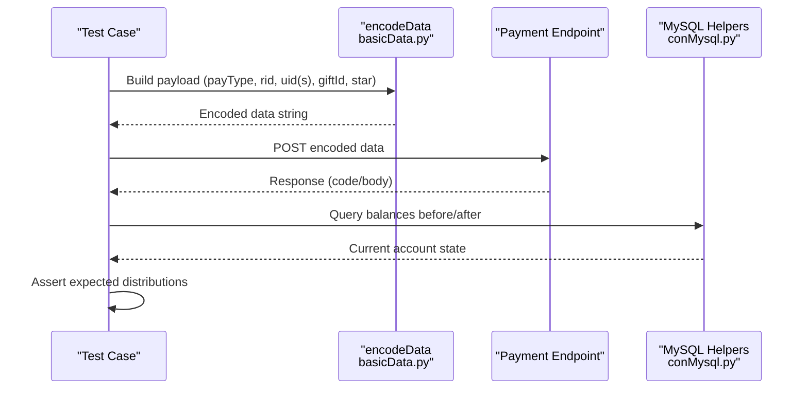

**Diagram sources**
- [basicData.py:8-325](file://common/basicData.py#L8-L325)
- [conMysql.py:27-204](file://common/conMysql.py#L27-L204)
- [Config.py:49-94](file://common/Config.py#L49-L94)

## Detailed Component Analysis

### Fleet Room Enhancement and Sharing
Fleet rooms implement family-based sharing with differentiated rates depending on whether the recipient belongs to the same family room.

Key behaviors:
- Same-family room: 80% to recipient’s personal charm
- Other-family room: 70% to recipient’s personal charm
- Normal users (non-generation master): 62% to personal charm in other-family rooms
- Gift and box handling validated for both family and non-family contexts

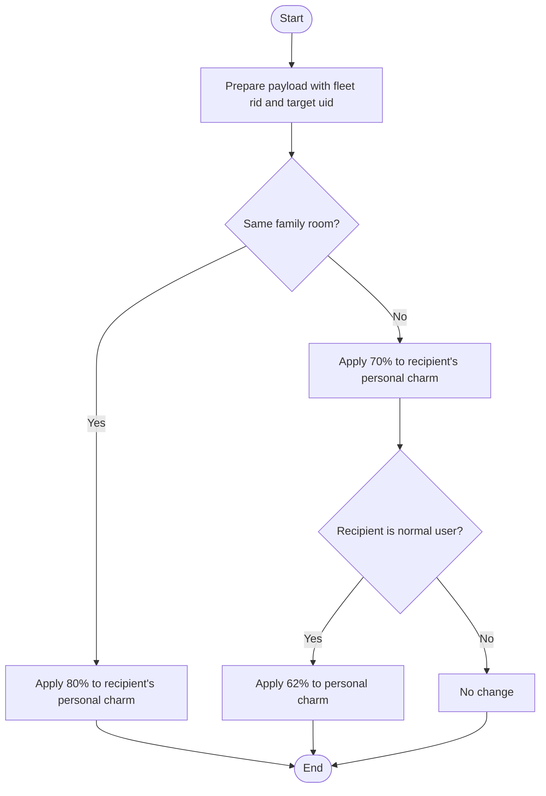

**Diagram sources**
- [test_pay_fleetRoom.py:19-157](file://case/test_pay_fleetRoom.py#L19-L157)

**Section sources**
- [test_pay_fleetRoom.py:1-158](file://case/test_pay_fleetRoom.py#L1-L158)
- [Config.py:57-68](file://common/Config.py#L57-L68)

### Personal Defense Mechanisms
Personal defense supports three lifecycle stages:
- Open defense: initial purchase with configured money value
- Upgrade: advanced tier purchase with upgrade cost
- Break: forced termination returning remaining balance to payer

Revenue distribution:
- Non-generation master recipients: 62% to personal charm
- GS recipients: 62% to guild charm (money_cash)
- Break scenarios: official retention of unclaimed value

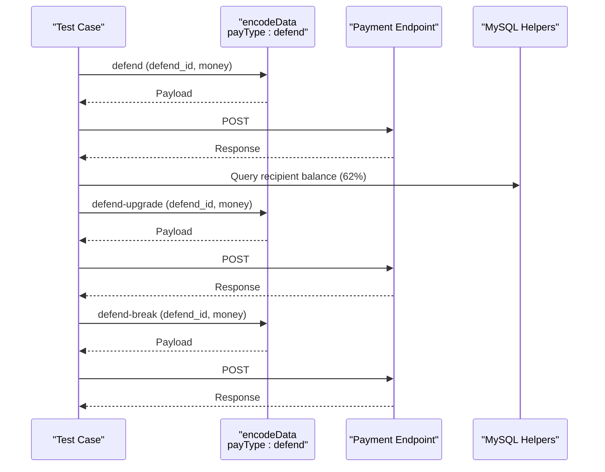

**Diagram sources**
- [test_pay_personDefend.py:23-162](file://case/test_pay_personDefend.py#L23-L162)
- [basicData.py:195-232](file://common/basicData.py#L195-L232)

**Section sources**
- [test_pay_personDefend.py:1-164](file://case/test_pay_personDefend.py#L1-L164)
- [conMysql.py:142-164](file://common/conMysql.py#L142-L164)

### Pretty Room Decoration and Contributions
Pretty rooms distribute rewards to recipients with a fixed rate:
- GS recipients: 62% to guild charm (money_cash)
- Normal users: 62% to personal charm
- Box gifts validated for minimum thresholds

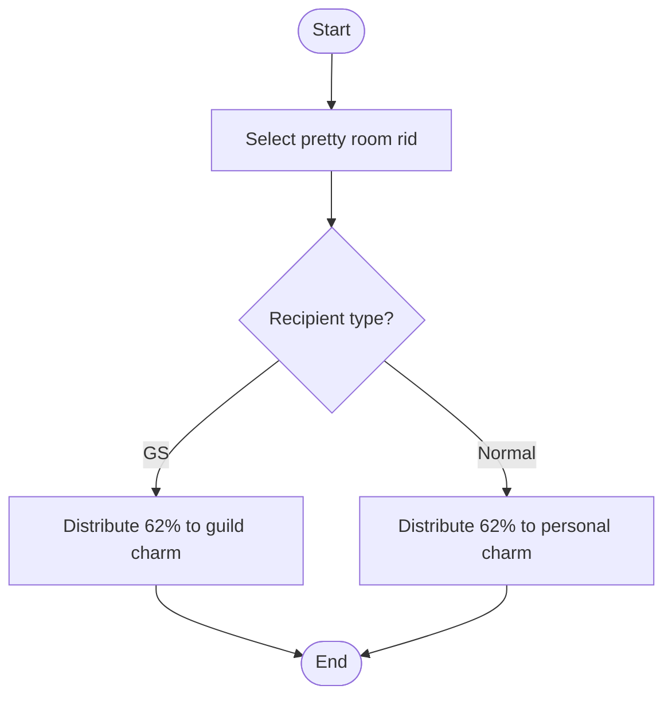

**Diagram sources**
- [test_pay_prettyRoom.py:16-89](file://case/test_pay_prettyRoom.py#L16-L89)

**Section sources**
- [test_pay_prettyRoom.py:1-90](file://case/test_pay_prettyRoom.py#L1-L90)
- [Config.py:57-68](file://common/Config.py#L57-L68)

### Union Room Contributions
Union rooms (singer rooms) apply guild revenue sharing:
- Live guild streamers: 60% to guild charm (money_cash)
- Normal guild members: 62% to guild charm (money_cash)
- Boxes validated for minimum thresholds
- Non-guild users receive 62% personal charm

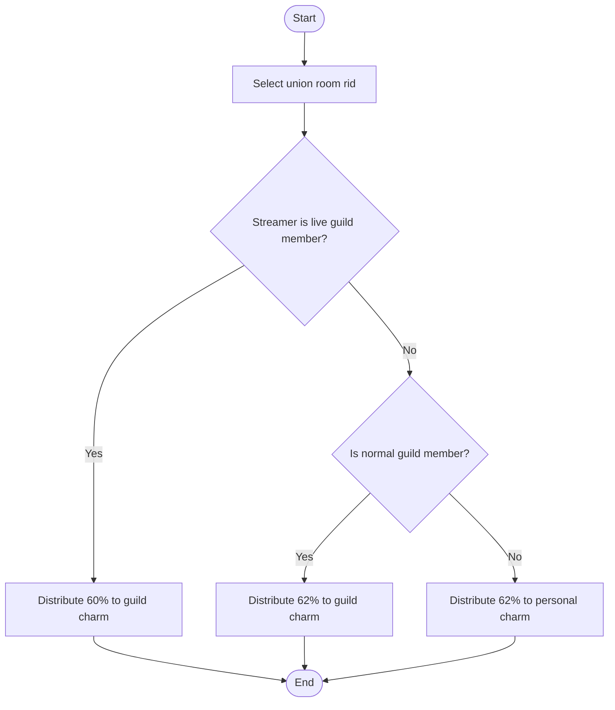

**Diagram sources**
- [test_pay_unionRoom.py:21-118](file://case/test_pay_unionRoom.py#L21-L118)

**Section sources**
- [test_pay_unionRoom.py:1-119](file://case/test_pay_unionRoom.py#L1-L119)
- [Config.py:57-76](file://common/Config.py#L57-L76)

### VIP Room Access and Participation
VIP rooms enforce personal distribution with 62% to personal charm for both gifts and boxes, and special handling for GS recipients at 70% personal charm.

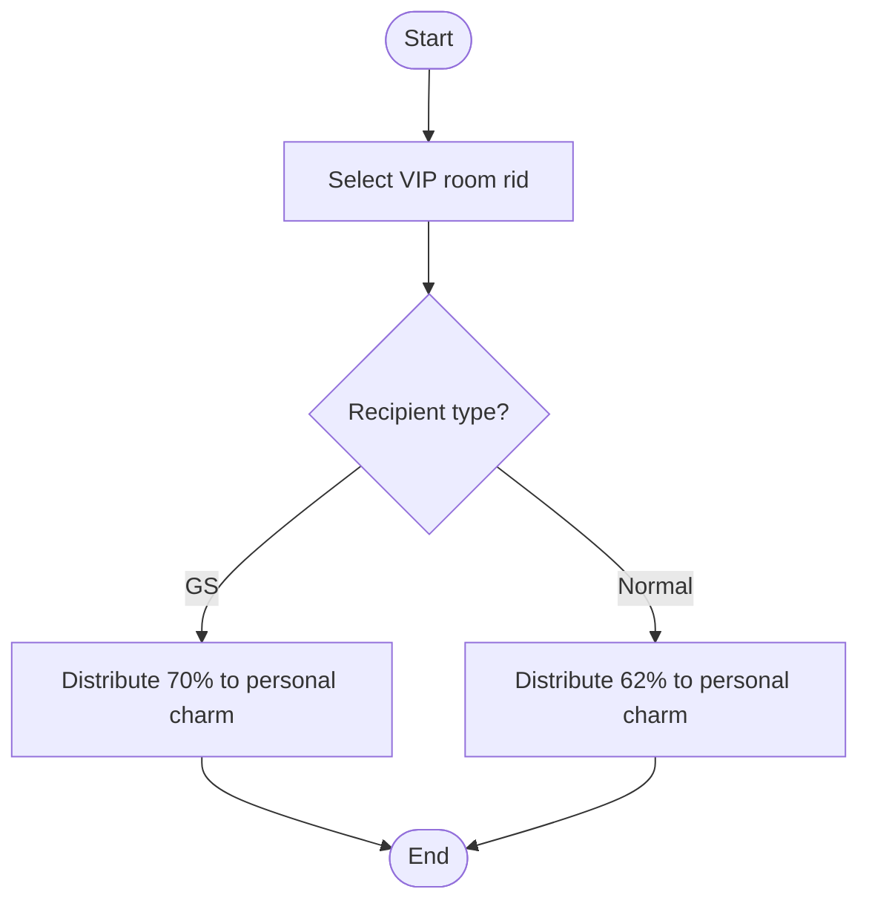

**Diagram sources**
- [test_pay_vipRoom.py:18-89](file://case/test_pay_vipRoom.py#L18-L89)

**Section sources**
- [test_pay_vipRoom.py:1-90](file://case/test_pay_vipRoom.py#L1-L90)
- [Config.py:57-68](file://common/Config.py#L57-L68)

### Unity Event Participation Payments
A placeholder test exists for unity game purchases. No implementation details are present in the current repository snapshot.

**Section sources**
- [test_pay_unity.py:1-13](file://case/test_pay_unity.py#L1-L13)

### Room Enhancement Factory Pattern
The system uses a factory-like pattern via encodeData to construct room payment payloads:
- package: standard room gift/box payments
- package-more: multi-user, multi-gift distribution
- package-knightDefend: room guard payment
- package-radioDefend: radio-type guard
- defend/defend-upgrade/defend-break: personal defense lifecycle

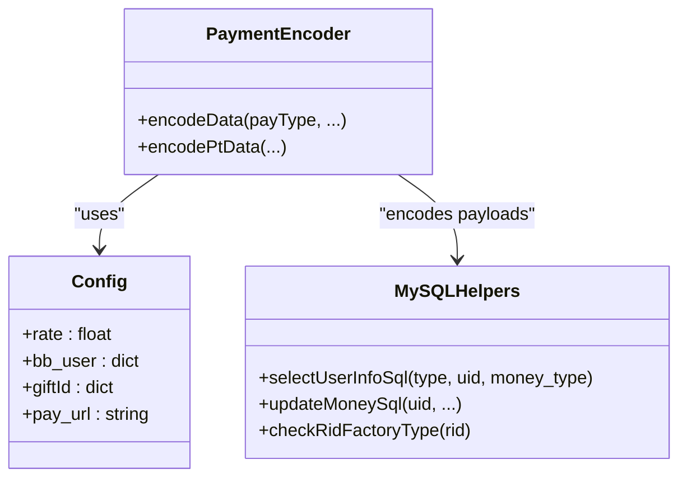

**Diagram sources**
- [basicData.py:8-325](file://common/basicData.py#L8-L325)
- [Config.py:49-94](file://common/Config.py#L49-L94)
- [conMysql.py:27-204](file://common/conMysql.py#L27-L204)

**Section sources**
- [basicData.py:8-325](file://common/basicData.py#L8-L325)
- [Config.py:49-94](file://common/Config.py#L49-L94)
- [conMysql.py:62-73](file://common/conMysql.py#L62-L73)

### Multi-User Room Participation Handling
The system supports multi-user room payments:
- package-more payload aggregates multiple recipients
- Distribution applies per-recipient rates (GS 60–62%, normal 62%)
- Tests validate aggregated payouts and per-user balances

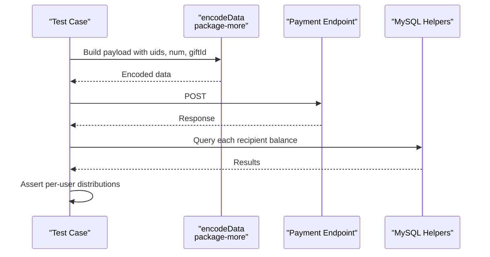

**Diagram sources**
- [test_many_people_room.py:21-56](file://caseSlp/test_many_people_room.py#L21-L56)
- [basicData.py:41-73](file://common/basicData.py#L41-L73)

**Section sources**
- [test_many_people_room.py:1-57](file://caseSlp/test_many_people_room.py#L1-L57)
- [basicData.py:41-73](file://common/basicData.py#L41-L73)

### Database Synchronization for Room State Management
Room state and account synchronization rely on:
- Room factory type checks to ensure correct room category
- Account queries for single and total balances
- Pre/post assertions to validate state transitions after payments

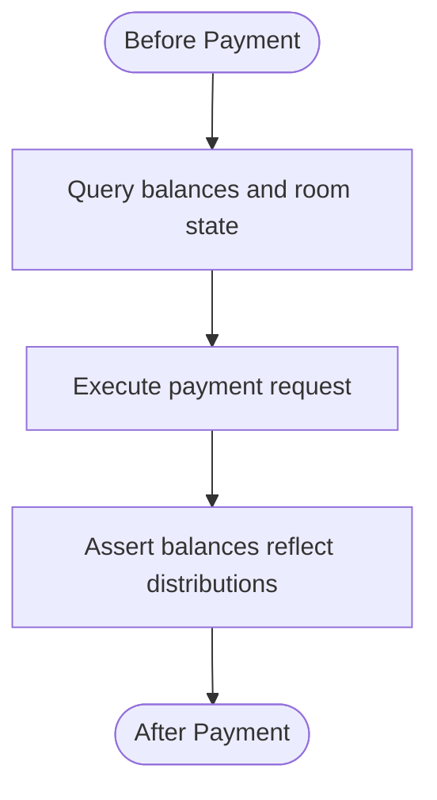

**Diagram sources**
- [conMysql.py:27-204](file://common/conMysql.py#L27-L204)
- [test_gs_room.py:21-589](file://caseSlp/test_gs_room.py#L21-L589)

**Section sources**
- [conMysql.py:27-204](file://common/conMysql.py#L27-L204)
- [test_gs_room.py:1-589](file://caseSlp/test_gs_room.py#L1-L589)

### Integration with Room Defense Algorithms and Governance
- Room guard payments (package-knightDefend) integrate with room factory types and guild roles
- Governance rules prevent guild leaders from receiving reductions in certain commercial rooms
- Multi-user participation respects guild membership and generation master status

**Section sources**
- [test_gs_room_defend.py:21-58](file://caseSlp/test_gs_room_defend.py#L21-L58)
- [test_many_people_room.py:21-56](file://caseSlp/test_many_people_room.py#L21-L56)

## Dependency Analysis
The tests depend on:
- Config for URLs, rates, room IDs, and gift IDs
- basicData for payload construction
- conMysql for account and room state queries
- Consts for result tracking

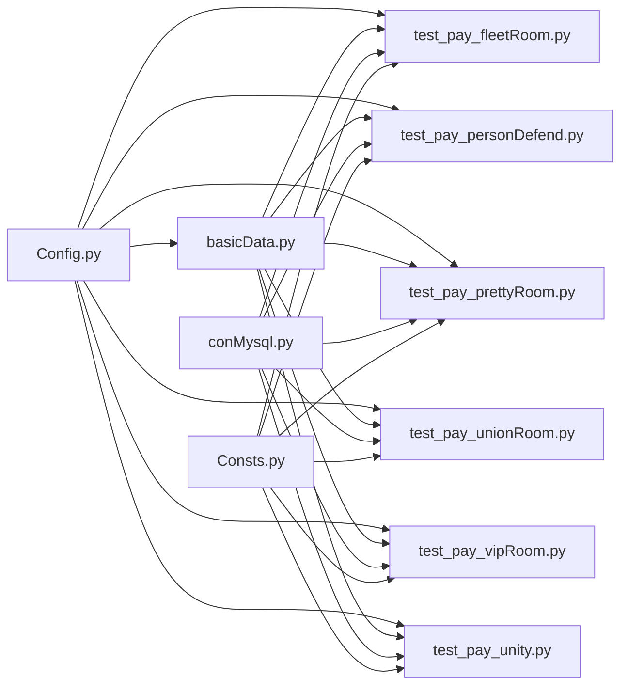

**Diagram sources**
- [Config.py:49-94](file://common/Config.py#L49-L94)
- [basicData.py:8-325](file://common/basicData.py#L8-L325)
- [conMysql.py:1-530](file://common/conMysql.py#L1-L530)
- [Consts.py:1-17](file://common/Consts.py#L1-L17)
- [test_pay_fleetRoom.py:1-158](file://case/test_pay_fleetRoom.py#L1-L158)
- [test_pay_personDefend.py:1-164](file://case/test_pay_personDefend.py#L1-L164)
- [test_pay_prettyRoom.py:1-90](file://case/test_pay_prettyRoom.py#L1-L90)
- [test_pay_unionRoom.py:1-119](file://case/test_pay_unionRoom.py#L1-L119)
- [test_pay_vipRoom.py:1-90](file://case/test_pay_vipRoom.py#L1-L90)
- [test_pay_unity.py:1-13](file://case/test_pay_unity.py#L1-L13)

**Section sources**
- [Config.py:49-94](file://common/Config.py#L49-L94)
- [basicData.py:8-325](file://common/basicData.py#L8-L325)
- [conMysql.py:1-530](file://common/conMysql.py#L1-L530)
- [Consts.py:1-17](file://common/Consts.py#L1-L17)

## Performance Considerations
- Batch multi-user payments reduce round-trips via package-more
- Pre-check room factory types avoids unnecessary requests
- Minimize repeated DB queries by caching frequently accessed room IDs and rates
- Use targeted balance queries (single_money vs sum_money) to avoid heavy aggregations

## Troubleshooting Guide
Common issues and resolutions:
- Wrong room type: Verify room factory type before payment
- Insufficient balance: Ensure payer has sufficient funds before asserting deductions
- Recipient role mismatch: Confirm GS membership and generation master status for correct rates
- Payload misconfiguration: Validate payType, giftId, and recipient lists

Validation utilities:
- Use selectUserInfoSql for precise balance checks
- Use checkRidFactoryType to confirm room category
- Use updateUserMoneyClearSql to reset balances during preconditions

**Section sources**
- [conMysql.py:27-204](file://common/conMysql.py#L27-L204)
- [conMysql.py:335-361](file://common/conMysql.py#L335-L361)

## Conclusion
The Banban platform implements a robust, configurable room and defense payment system with clear ownership verification, tiered revenue sharing, and multi-user support. The factory-style payload encoder and shared MySQL helpers enable consistent behavior across fleet, pretty, union, and VIP rooms, while personal defense lifecycle operations provide flexible protection mechanisms. Governance rules and rate configurations ensure fair distribution among guilds, families, and individuals.