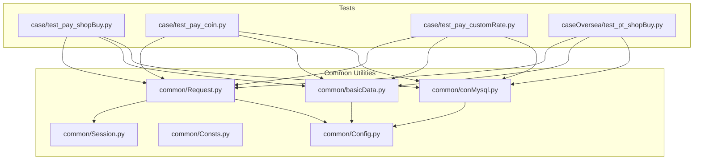
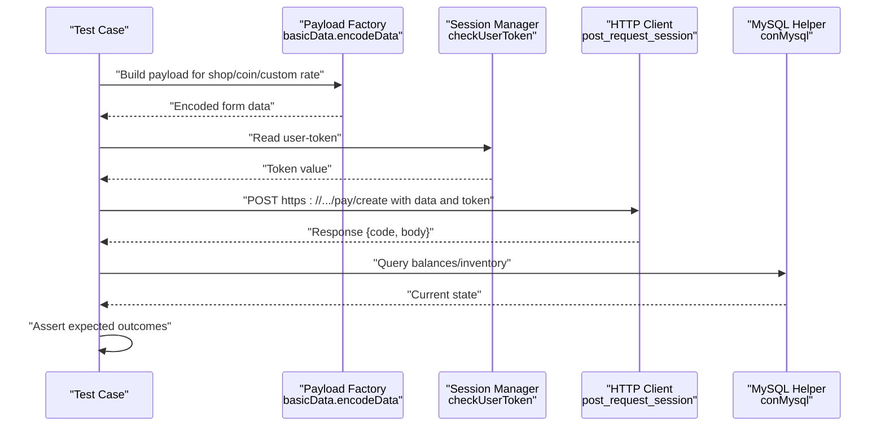
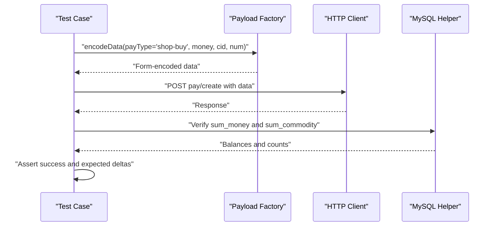
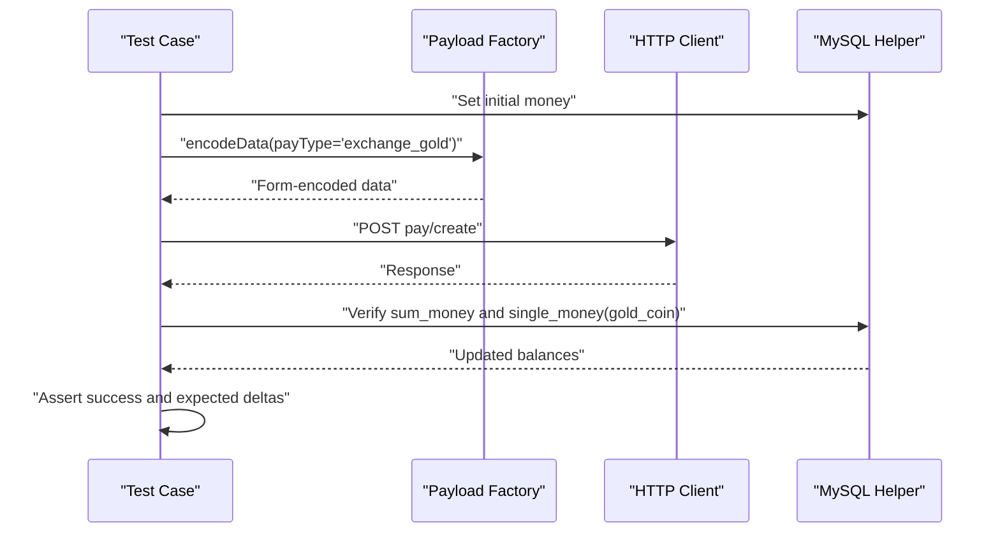
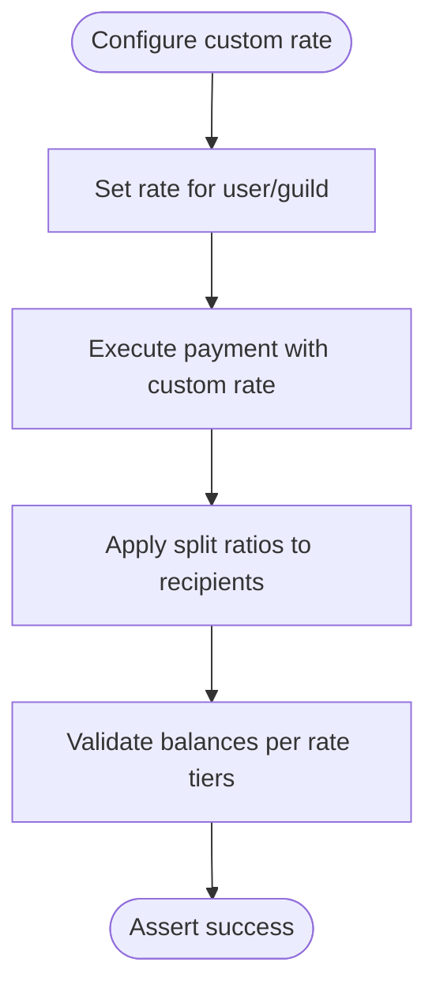
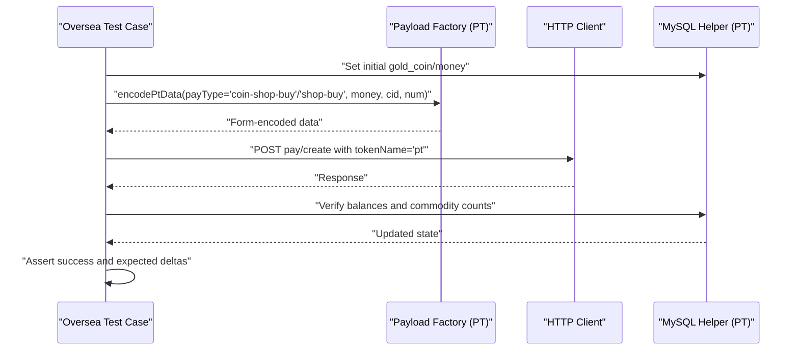
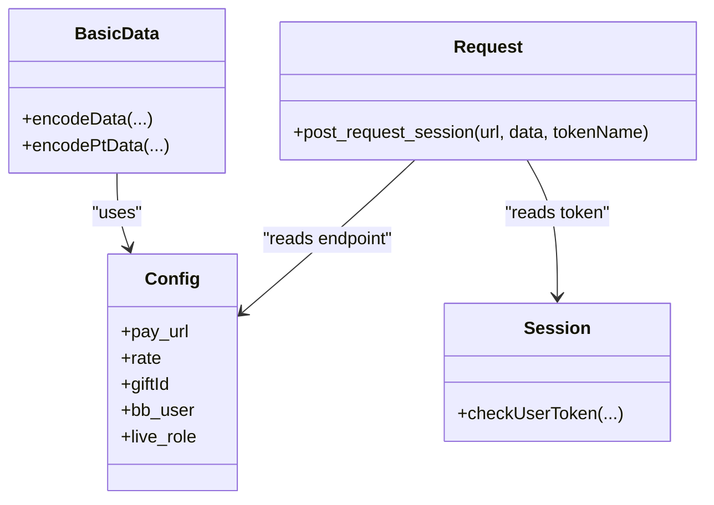
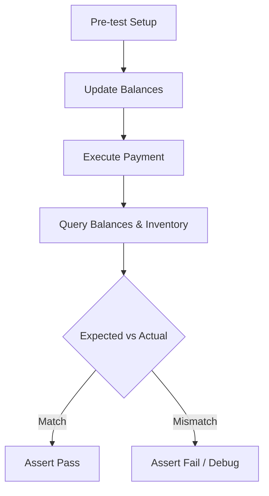
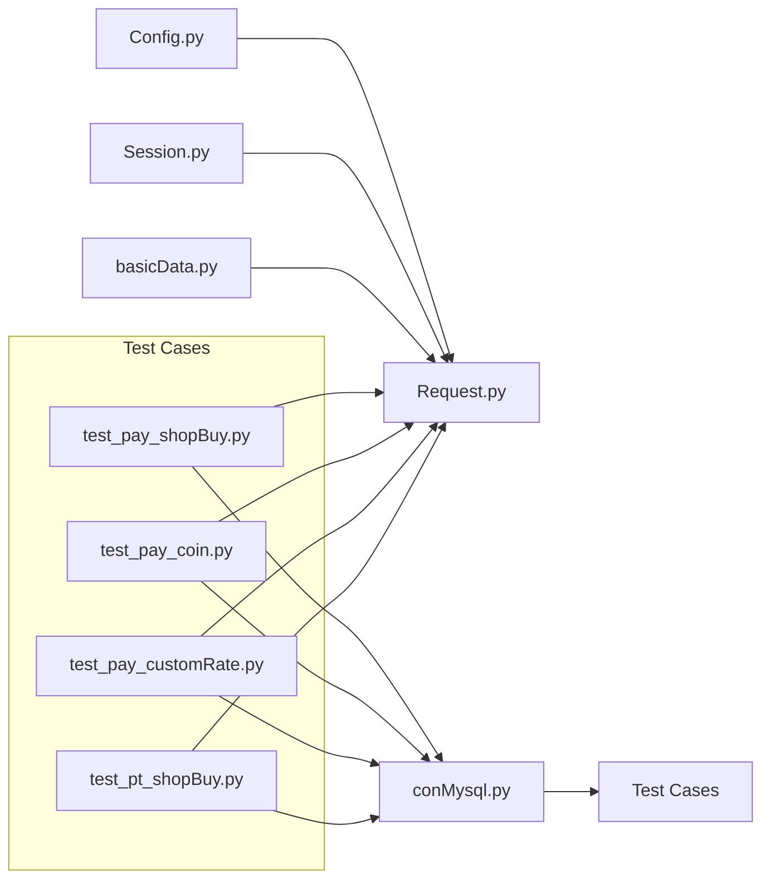

# Shop and Currency Exchange

<cite>
**Referenced Files in This Document**
- [README.md](file://README.md)
- [common/Config.py](file://common/Config.py)
- [common/Consts.py](file://common/Consts.py)
- [common/Session.py](file://common/Session.py)
- [common/Request.py](file://common/Request.py)
- [common/basicData.py](file://common/basicData.py)
- [common/conMysql.py](file://common/conMysql.py)
- [case/test_pay_shopBuy.py](file://case/test_pay_shopBuy.py)
- [case/test_pay_coin.py](file://case/test_pay_coin.py)
- [case/test_pay_customRate.py](file://case/test_pay_customRate.py)
- [caseOversea/test_pt_shopBuy.py](file://caseOversea/test_pt_shopBuy.py)
</cite>

## Table of Contents
1. [Introduction](#introduction)
2. [Project Structure](#project-structure)
3. [Core Components](#core-components)
4. [Architecture Overview](#architecture-overview)
5. [Detailed Component Analysis](#detailed-component-analysis)
6. [Dependency Analysis](#dependency-analysis)
7. [Performance Considerations](#performance-considerations)
8. [Troubleshooting Guide](#troubleshooting-guide)
9. [Conclusion](#conclusion)

## Introduction
This document explains the shop transactions and currency exchange mechanisms in the Banban platform. It covers:
- Bean-to-diamond conversions and coin exchange flows
- Dynamic custom rate adjustments for guild/union splitting
- Shop purchase workflows for both diamonds and coins
- Payment gateway integration via session-based authentication and payload generation
- Database validation for inventory tracking and financial reconciliation
- Edge cases such as insufficient balance, exchange rate impacts, and concurrent transactions

## Project Structure
The repository organizes tests and utilities around payment flows:
- Tests under case/ and caseOversea/ exercise shop buy, coin exchange, and custom rate scenarios
- Utilities in common/ encapsulate configuration, session tokens, HTTP requests, data encoding, and MySQL helpers
- README.md outlines the common framework and testing conventions

**Diagram sources**
- [case/test_pay_shopBuy.py:1-124](file://case/test_pay_shopBuy.py#L1-L124)
- [case/test_pay_coin.py:1-63](file://case/test_pay_coin.py#L1-L63)
- [case/test_pay_customRate.py:1-172](file://case/test_pay_customRate.py#L1-L172)
- [caseOversea/test_pt_shopBuy.py:1-58](file://caseOversea/test_pt_shopBuy.py#L1-L58)
- [common/Request.py:17-59](file://common/Request.py#L17-L59)
- [common/basicData.py:8-325](file://common/basicData.py#L8-L325)
- [common/conMysql.py:27-204](file://common/conMysql.py#L27-L204)
- [common/Config.py:47-94](file://common/Config.py#L47-L94)
- [common/Consts.py:1-17](file://common/Consts.py#L1-L17)

**Section sources**
- [README.md:1-38](file://README.md#L1-L38)

## Core Components
- Configuration and constants define endpoints, user roles, gift IDs, and default rates
- Session management generates and persists user tokens for secure requests
- Request utility posts encoded payloads to the payment gateway with session headers
- Payload factory encodes shop buy, coin exchange, and other payment scenarios
- MySQL helper validates balances, inventory, and updates financial records

Key responsibilities:
- Payment gateway integration: [common/Request.py:17-59](file://common/Request.py#L17-L59)
- Payload construction: [common/basicData.py:8-325](file://common/basicData.py#L8-L325)
- Session-based authentication: [common/Session.py:168-182](file://common/Session.py#L168-L182)
- Database validation and updates: [common/conMysql.py:27-204](file://common/conMysql.py#L27-L204)

**Section sources**
- [common/Config.py:47-94](file://common/Config.py#L47-L94)
- [common/Session.py:168-182](file://common/Session.py#L168-L182)
- [common/Request.py:17-59](file://common/Request.py#L17-L59)
- [common/basicData.py:8-325](file://common/basicData.py#L8-L325)
- [common/conMysql.py:27-204](file://common/conMysql.py#L27-L204)

## Architecture Overview
The payment flow follows a consistent pattern:
- Prepare payload via factory methods
- Authenticate via session token
- Post to payment endpoint
- Validate results against database state

**Diagram sources**
- [common/basicData.py:8-325](file://common/basicData.py#L8-L325)
- [common/Session.py:168-182](file://common/Session.py#L168-L182)
- [common/Request.py:17-59](file://common/Request.py#L17-L59)
- [common/conMysql.py:27-204](file://common/conMysql.py#L27-L204)

## Detailed Component Analysis

### Shop Purchase Workflows
Two primary flows are exercised:
- Diamonds to shop items (money-type)
- Coins to shop items (coin-type)

Key behaviors validated:
- Single-item purchase reduces money and increases commodity count
- Bulk purchase scales price and quantity accordingly
- Gift-to-user scenarios demonstrate fractional distribution and remaining inventory

**Diagram sources**
- [case/test_pay_shopBuy.py:20-42](file://case/test_pay_shopBuy.py#L20-L42)
- [case/test_pay_shopBuy.py:44-67](file://case/test_pay_shopBuy.py#L44-L67)
- [case/test_pay_shopBuy.py:70-94](file://case/test_pay_shopBuy.py#L70-L94)
- [case/test_pay_shopBuy.py:96-123](file://case/test_pay_shopBuy.py#L96-L123)
- [common/basicData.py:177-194](file://common/basicData.py#L177-L194)
- [common/conMysql.py:52-92](file://common/conMysql.py#L52-L92)

**Section sources**
- [case/test_pay_shopBuy.py:20-123](file://case/test_pay_shopBuy.py#L20-L123)
- [common/basicData.py:177-194](file://common/basicData.py#L177-L194)
- [common/conMysql.py:52-92](file://common/conMysql.py#L52-L92)

### Coin Exchange Mechanism
The coin exchange converts money into gold_coin and vice versa, validating balance reductions and increments.

Validation highlights:
- Money balance decreases after exchange
- Gold coin balance increases correspondingly
- Room chat gift payments use gold_coin and distribute portions to recipients

**Diagram sources**
- [case/test_pay_coin.py:16-34](file://case/test_pay_coin.py#L16-L34)
- [case/test_pay_coin.py:36-62](file://case/test_pay_coin.py#L36-L62)
- [common/basicData.py:249-258](file://common/basicData.py#L249-L258)
- [common/conMysql.py:52-73](file://common/conMysql.py#L52-L73)

**Section sources**
- [case/test_pay_coin.py:16-62](file://case/test_pay_coin.py#L16-L62)
- [common/basicData.py:249-258](file://common/basicData.py#L249-L258)
- [common/conMysql.py:52-73](file://common/conMysql.py#L52-L73)

### Custom Rate Adjustment System
Dynamic guild/union splitting rates alter recipient distributions. Tests configure rates and verify splits across recipients.

Highlights:
- Room, chat, and personal defense payments support custom rates
- Ratios impact both total and guild charm value distributions
- Cleanup restores default rates after tests

**Diagram sources**
- [case/test_pay_customRate.py:19-50](file://case/test_pay_customRate.py#L19-L50)
- [case/test_pay_customRate.py:52-79](file://case/test_pay_customRate.py#L52-L79)
- [case/test_pay_customRate.py:81-109](file://case/test_pay_customRate.py#L81-L109)
- [case/test_pay_customRate.py:111-140](file://case/test_pay_customRate.py#L111-L140)
- [case/test_pay_customRate.py:142-171](file://case/test_pay_customRate.py#L142-L171)
- [common/conMysql.py:504-529](file://common/conMysql.py#L504-L529)

**Section sources**
- [case/test_pay_customRate.py:19-171](file://case/test_pay_customRate.py#L19-L171)
- [common/conMysql.py:504-529](file://common/conMysql.py#L504-L529)

### Overseas Shop Buy (Coins and Diamonds)
Overseas tests mirror domestic flows but target coin-based and diamond-based shop purchases.

**Diagram sources**
- [caseOversea/test_pt_shopBuy.py:13-34](file://caseOversea/test_pt_shopBuy.py#L13-L34)
- [caseOversea/test_pt_shopBuy.py:36-57](file://caseOversea/test_pt_shopBuy.py#L36-L57)
- [common/basicData.py:441-492](file://common/basicData.py#L441-L492)

**Section sources**
- [caseOversea/test_pt_shopBuy.py:13-57](file://caseOversea/test_pt_shopBuy.py#L13-L57)
- [common/basicData.py:441-492](file://common/basicData.py#L441-L492)

### Payment Gateway Integration and Payload Factory
The payload factory centralizes building request bodies for diverse payment scenarios, while the HTTP client injects session tokens and posts to the payment endpoint.

**Diagram sources**
- [common/Config.py:47-94](file://common/Config.py#L47-L94)
- [common/basicData.py:8-325](file://common/basicData.py#L8-L325)
- [common/Session.py:168-182](file://common/Session.py#L168-L182)
- [common/Request.py:17-59](file://common/Request.py#L17-L59)

**Section sources**
- [common/basicData.py:8-325](file://common/basicData.py#L8-L325)
- [common/Request.py:17-59](file://common/Request.py#L17-L59)
- [common/Session.py:168-182](file://common/Session.py#L168-L182)
- [common/Config.py:47-94](file://common/Config.py#L47-L94)

### Database Validation and Financial Reconciliation
The MySQL helper supports:
- Selecting aggregated and individual account balances
- Verifying commodity counts and IDs
- Clearing and updating balances for deterministic test runs
- Managing guild user rate configurations

**Diagram sources**
- [common/conMysql.py:27-204](file://common/conMysql.py#L27-L204)
- [common/conMysql.py:349-360](file://common/conMysql.py#L349-L360)
- [common/conMysql.py:337-347](file://common/conMysql.py#L337-L347)

**Section sources**
- [common/conMysql.py:27-204](file://common/conMysql.py#L27-L204)
- [common/conMysql.py:337-360](file://common/conMysql.py#L337-L360)

## Dependency Analysis
High-level dependencies among core components:

**Diagram sources**
- [common/Config.py:47-94](file://common/Config.py#L47-L94)
- [common/Session.py:168-182](file://common/Session.py#L168-L182)
- [common/Request.py:17-59](file://common/Request.py#L17-L59)
- [common/basicData.py:8-325](file://common/basicData.py#L8-L325)
- [common/conMysql.py:27-204](file://common/conMysql.py#L27-L204)
- [case/test_pay_shopBuy.py:1-124](file://case/test_pay_shopBuy.py#L1-L124)
- [case/test_pay_coin.py:1-63](file://case/test_pay_coin.py#L1-L63)
- [case/test_pay_customRate.py:1-172](file://case/test_pay_customRate.py#L1-L172)
- [caseOversea/test_pt_shopBuy.py:1-58](file://caseOversea/test_pt_shopBuy.py#L1-L58)

**Section sources**
- [common/Config.py:47-94](file://common/Config.py#L47-L94)
- [common/Session.py:168-182](file://common/Session.py#L168-L182)
- [common/Request.py:17-59](file://common/Request.py#L17-L59)
- [common/basicData.py:8-325](file://common/basicData.py#L8-L325)
- [common/conMysql.py:27-204](file://common/conMysql.py#L27-L204)

## Performance Considerations
- Minimize repeated database queries by batching assertions per scenario
- Prefer deterministic initial states to avoid flaky timing-sensitive checks
- Use lightweight payload construction and avoid unnecessary re-encoding
- Limit concurrent transactions during shared-state validations to reduce contention

## Troubleshooting Guide
Common issues and resolutions:
- Token errors: Ensure session token persistence and freshness; verify token file existence and content
  - See: [common/Session.py:168-182](file://common/Session.py#L168-L182)
- Insufficient balance: Validate preconditions and expected deltas before asserting
  - See: [common/conMysql.py:349-360](file://common/conMysql.py#L349-L360)
- Exchange rate impacts: Confirm rate constants and expected distribution math align with tests
  - See: [common/Config.py:57-88](file://common/Config.py#L57-L88)
- Overlapping transactions: Isolate concurrent runs or serialize critical sections to prevent race conditions
  - See: [common/Consts.py:14-16](file://common/Consts.py#L14-L16)

**Section sources**
- [common/Session.py:168-182](file://common/Session.py#L168-L182)
- [common/conMysql.py:349-360](file://common/conMysql.py#L349-L360)
- [common/Config.py:57-88](file://common/Config.py#L57-L88)
- [common/Consts.py:14-16](file://common/Consts.py#L14-L16)

## Conclusion
The shop and currency exchange system integrates a robust payload factory, session-based authentication, and strict database validation to ensure accurate financial reconciliation. Tests cover core flows (shop buys, coin exchange), dynamic custom rates, and overseas variants. Adhering to deterministic setups and cautious concurrency practices helps maintain reliability across scenarios.