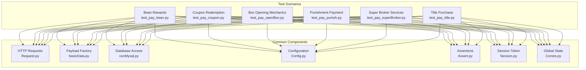
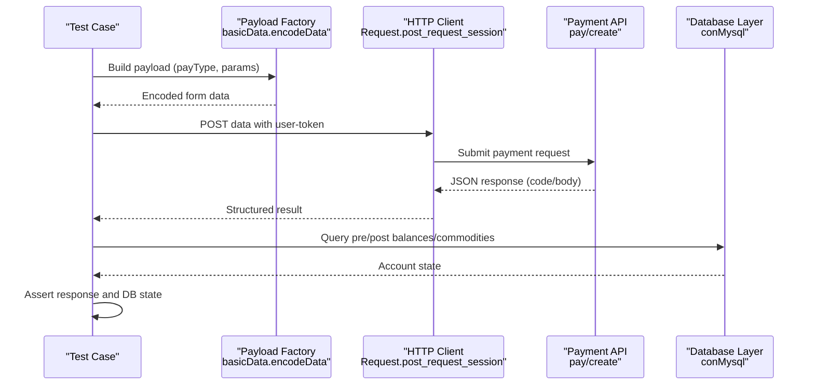
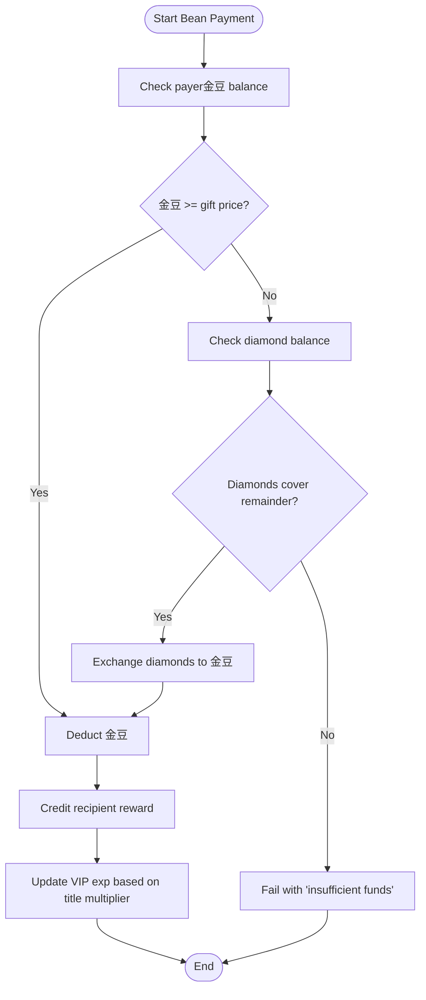
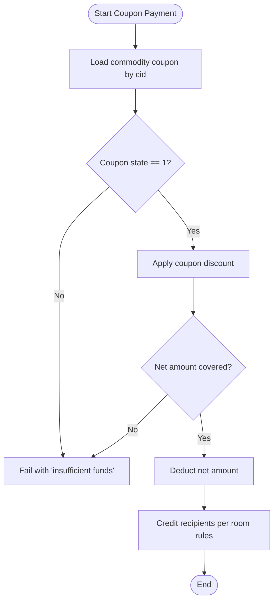
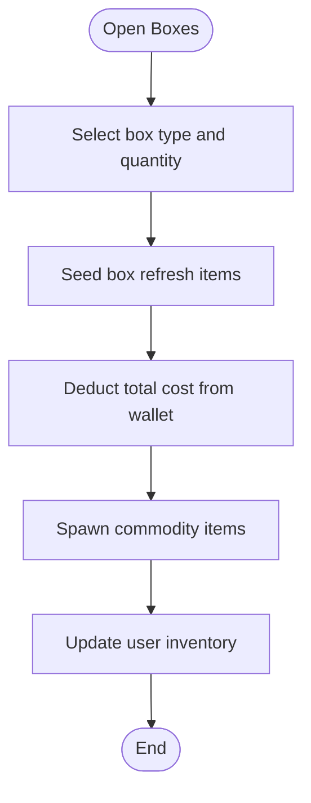
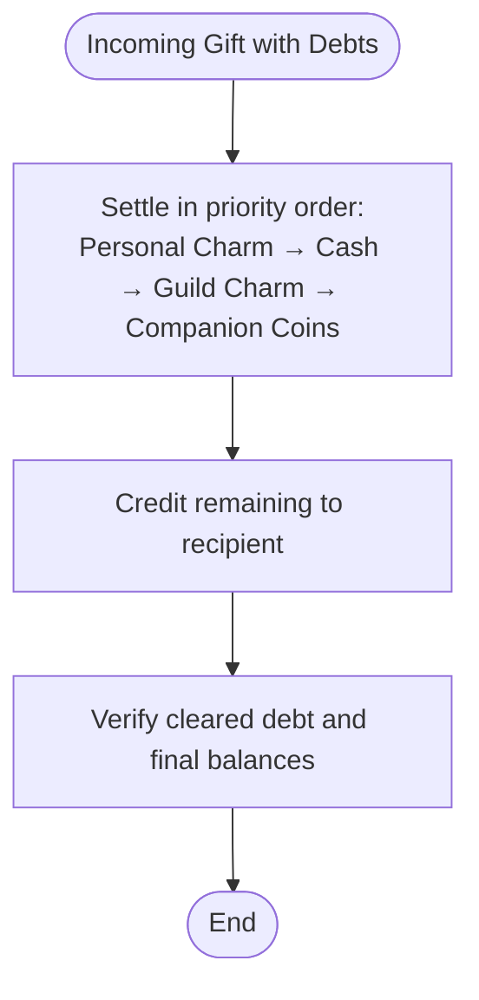
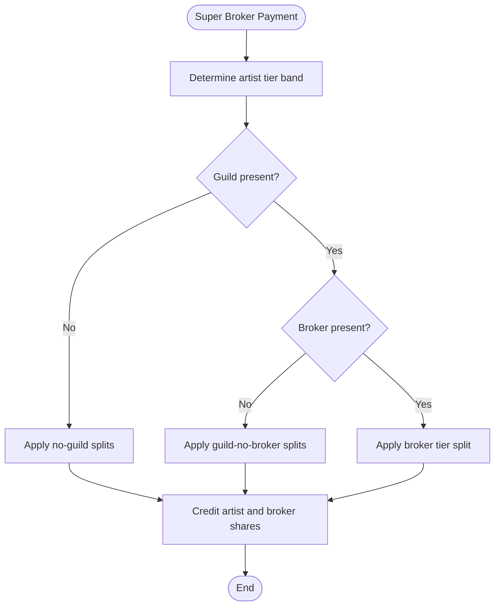
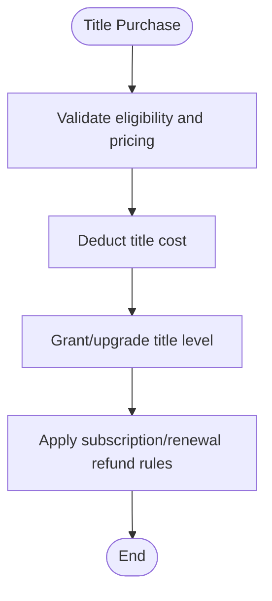
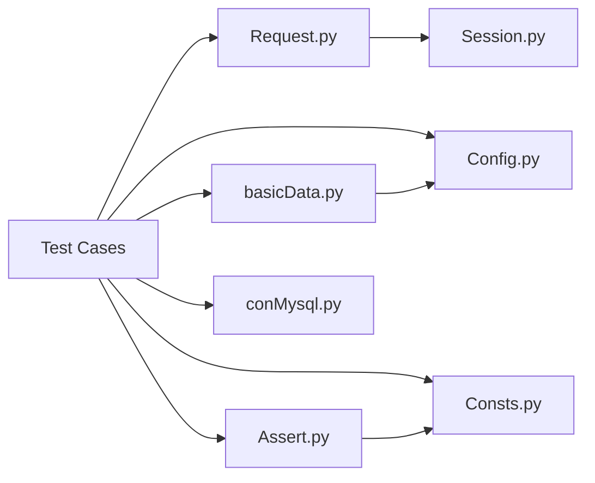

# Special and Promotional Payments

<cite>
**Referenced Files in This Document**
- [test_pay_bean.py](file://case/test_pay_bean.py)
- [test_pay_coupon.py](file://case/test_pay_coupon.py)
- [test_pay_openBox.py](file://case/test_pay_openBox.py)
- [test_pay_punish.py](file://case/test_pay_punish.py)
- [test_pay_superBroker.py](file://case/test_pay_superBroker.py)
- [test_pay_title.py](file://case/test_pay_title.py)
- [conMysql.py](file://common/conMysql.py)
- [Config.py](file://common/Config.py)
- [basicData.py](file://common/basicData.py)
- [Assert.py](file://common/Assert.py)
- [Request.py](file://common/Request.py)
- [Session.py](file://common/Session.py)
- [Consts.py](file://common/Consts.py)
- [README.md](file://README.md)
- [run_all_case.py](file://run_all_case.py)
</cite>

## Table of Contents
1. [Introduction](#introduction)
2. [Project Structure](#project-structure)
3. [Core Components](#core-components)
4. [Architecture Overview](#architecture-overview)
5. [Detailed Component Analysis](#detailed-component-analysis)
6. [Dependency Analysis](#dependency-analysis)
7. [Performance Considerations](#performance-considerations)
8. [Troubleshooting Guide](#troubleshooting-guide)
9. [Conclusion](#conclusion)

## Introduction
This document explains the special and promotional payment scenarios in the Banban platform, focusing on:
- Bean reward system and金豆-to-diamond exchange mechanics
- Coupon redemption and usage restrictions
- Box opening mechanics and progressive box opening
- Punishment payment system and debt settlement order
- Super broker service tiers and revenue sharing
- Title purchase functionality
- Promotional payment flow architecture including limited-time offer validation, promotional code redemption, and seasonal event participation fees
- Complex payment validation logic for reward distribution, coupon usage, and progressive box mechanics
- Integration with promotional campaign management, user eligibility verification, and reward tracking
- Implementation details for the promotional payload factory, multi-tier reward calculation algorithms, and database validation for promotional activity tracking

## Project Structure
The repository organizes tests per scenario under the case directory and reuses common components for HTTP requests, database operations, configuration, and assertions.

**Diagram sources**
- [test_pay_bean.py:1-188](file://case/test_pay_bean.py#L1-L188)
- [test_pay_coupon.py:1-149](file://case/test_pay_coupon.py#L1-L149)
- [test_pay_openBox.py:1-124](file://case/test_pay_openBox.py#L1-L124)
- [test_pay_punish.py:1-42](file://case/test_pay_punish.py#L1-L42)
- [test_pay_superBroker.py:1-135](file://case/test_pay_superBroker.py#L1-L135)
- [test_pay_title.py:1-33](file://case/test_pay_title.py#L1-L33)
- [Request.py:17-59](file://common/Request.py#L17-L59)
- [basicData.py:8-581](file://common/basicData.py#L8-L581)
- [conMysql.py:27-530](file://common/conMysql.py#L27-L530)
- [Config.py:6-133](file://common/Config.py#L6-L133)
- [Assert.py:11-96](file://common/Assert.py#L11-L96)
- [Session.py:168-183](file://common/Session.py#L168-L183)
- [Consts.py:4-17](file://common/Consts.py#L4-L17)

**Section sources**
- [README.md:1-38](file://README.md#L1-L38)
- [run_all_case.py:126-147](file://run_all_case.py#L126-L147)

## Core Components
- HTTP request layer encapsulated in Request.py, which posts encoded payloads to the payment endpoint and returns structured responses.
- Payload factory in basicData.py generates standardized payment payloads for diverse scenarios (room gifts, chat gifts, box purchases, shop buys, title purchases).
- Database access via conMysql.py provides CRUD operations against user accounts, commodities, boxes, and related metadata.
- Configuration in Config.py centralizes endpoints, gift IDs, room IDs, and rates used across tests.
- Assertions in Assert.py standardize response validation and failure reporting.
- Session management in Session.py handles token retrieval and persistence for authenticated requests.
- Global state in Consts.py tracks test outcomes and timing.

**Section sources**
- [Request.py:17-59](file://common/Request.py#L17-L59)
- [basicData.py:8-581](file://common/basicData.py#L8-L581)
- [conMysql.py:27-530](file://common/conMysql.py#L27-L530)
- [Config.py:6-133](file://common/Config.py#L6-L133)
- [Assert.py:11-96](file://common/Assert.py#L11-L96)
- [Session.py:168-183](file://common/Session.py#L168-L183)
- [Consts.py:4-17](file://common/Consts.py#L4-L17)

## Architecture Overview
The payment flow follows a consistent pattern:
- Prepare payload via basicData.encodeData with payType and parameters
- Authenticate via Session and send POST to config.pay_url
- Validate HTTP status and JSON body fields via Assert helpers
- Verify database state changes using conMysql queries
- Record outcome in global case lists

**Diagram sources**
- [basicData.py:8-581](file://common/basicData.py#L8-L581)
- [Request.py:17-59](file://common/Request.py#L17-L59)
- [conMysql.py:27-530](file://common/conMysql.py#L27-L530)
- [Assert.py:11-96](file://common/Assert.py#L11-L96)

## Detailed Component Analysis

### Bean Reward System and金豆-to-Diamond Exchange
Key behaviors validated:
- Insufficient金豆 during room gift payments leads to failure with appropriate message and zero recipient balance.
- When金豆 is sufficient,金豆 are deducted and rewards are credited to recipients according to configured ratios.
- When金豆 are insufficient, diamonds can be exchanged to cover the shortfall;金豆 are not used for platform fee deduction in private chat scenarios.
- VIP experience gain is computed using tier multipliers derived from user title levels.

**Diagram sources**
- [test_pay_bean.py:37-158](file://case/test_pay_bean.py#L37-L158)
- [conMysql.py:27-103](file://common/conMysql.py#L27-L103)
- [method.py:163-171](file://common/method.py#L163-L171)

**Section sources**
- [test_pay_bean.py:37-158](file://case/test_pay_bean.py#L37-L158)
- [conMysql.py:27-103](file://common/conMysql.py#L27-L103)
- [method.py:163-171](file://common/method.py#L163-L171)

### Coupon Redemption and Usage Restrictions
Key behaviors validated:
- Unactivated coupons (state=0) cannot be used for payment; transactions fail with “insufficient funds”.
- Activated coupons (state=1) apply discount and succeed when funds cover net amount.
- Multi-user room gift payments distribute rewards according to room-specific ratios and tiers.
- Radio room defenses consume experience coupons without sharing proceeds.

**Diagram sources**
- [test_pay_coupon.py:38-148](file://case/test_pay_coupon.py#L38-L148)
- [conMysql.py:115-123](file://common/conMysql.py#L115-L123)

**Section sources**
- [test_pay_coupon.py:17-148](file://case/test_pay_coupon.py#L17-L148)
- [conMysql.py:115-123](file://common/conMysql.py#L115-L123)

### Box Opening Mechanics and Progressive Box Opening
Key behaviors validated:
- Copper and silver box purchases deduct wallet amounts and yield commodity items.
- Bulk box opening scales linearly with quantity and box type.
- Room gift giving can award boxes to recipients; multiple recipients receive proportional distributions.
- Box refresh configurations are seeded to ensure predictable item drops.

**Diagram sources**
- [test_pay_openBox.py:15-123](file://case/test_pay_openBox.py#L15-L123)
- [conMysql.py:389-400](file://common/conMysql.py#L389-L400)
- [conMysql.py:402-414](file://common/conMysql.py#L402-L414)

**Section sources**
- [test_pay_openBox.py:15-123](file://case/test_pay_openBox.py#L15-L123)
- [conMysql.py:389-414](file://common/conMysql.py#L389-L414)

### Punishment Payment System and Debt Settlement Order
Key behaviors validated:
- When a recipient has outstanding debts, incoming payments trigger a settlement sequence prioritizing personal charm, cash balance, guild charm, and finally companion coins.
- Post-settlement checks confirm balances and debt clearance.

**Diagram sources**
- [test_pay_punish.py:16-41](file://case/test_pay_punish.py#L16-L41)
- [conMysql.py:27-103](file://common/conMysql.py#L27-L103)

**Section sources**
- [test_pay_punish.py:16-41](file://case/test_pay_punish.py#L16-L41)
- [conMysql.py:27-103](file://common/conMysql.py#L27-L103)

### Super Broker Services and Revenue Sharing
Key behaviors validated:
- Tiered revenue splits for artist and broker roles vary by guild membership, brokerage level, and talent tier.
- Non-guild, non-broker artists receive different percentages depending on talent level bands.
- Brokerage tiers influence guild charm share for artists with brokers.

**Diagram sources**
- [test_pay_superBroker.py:6-135](file://case/test_pay_superBroker.py#L6-L135)

**Section sources**
- [test_pay_superBroker.py:6-135](file://case/test_pay_superBroker.py#L6-L135)

### Title Purchase Functionality
Key behaviors validated:
- Title subscription and renewal adjust wallet balances and reflect new title levels.
- Renewal logic applies different refund/rebate rules compared to initial subscription.

**Diagram sources**
- [test_pay_title.py:5-33](file://case/test_pay_title.py#L5-L33)

**Section sources**
- [test_pay_title.py:5-33](file://case/test_pay_title.py#L5-L33)

### Promotional Payment Flow Architecture
Promotional features validated:
- Limited-time offers and promotional codes are integrated into payment payloads via coupon parameters and discount fields.
- Seasonal event participation fees are modeled as room-specific charges with optional coupon discounts.
- Eligibility checks leverage commodity state and room configuration.
- Reward tracking ensures accurate attribution of promotional credits and reductions.

Implementation highlights:
- Promotional payload factory in basicData supports coupon-based discounts and promotional code fields.
- Multi-tier reward calculation considers room ratios, broker tiers, and promotional adjustments.
- Database validation ensures promotional activity tracking and coupon usage limits.

**Section sources**
- [basicData.py:8-581](file://common/basicData.py#L8-L581)
- [test_pay_coupon.py:38-148](file://case/test_pay_coupon.py#L38-L148)
- [conMysql.py:115-123](file://common/conMysql.py#L115-L123)

## Dependency Analysis
The test suite exhibits layered dependencies:
- Tests depend on Request.py for HTTP transport and Session.py for tokens.
- Payload construction depends on basicData.py and Config.py.
- Assertions depend on Assert.py and Consts.py.
- Database assertions depend on conMysql.py.

**Diagram sources**
- [test_pay_bean.py:1-188](file://case/test_pay_bean.py#L1-L188)
- [test_pay_coupon.py:1-149](file://case/test_pay_coupon.py#L1-L149)
- [test_pay_openBox.py:1-124](file://case/test_pay_openBox.py#L1-L124)
- [test_pay_punish.py:1-42](file://case/test_pay_punish.py#L1-L42)
- [test_pay_superBroker.py:1-135](file://case/test_pay_superBroker.py#L1-L135)
- [test_pay_title.py:1-33](file://case/test_pay_title.py#L1-L33)
- [Request.py:17-59](file://common/Request.py#L17-L59)
- [basicData.py:8-581](file://common/basicData.py#L8-L581)
- [Config.py:6-133](file://common/Config.py#L6-L133)
- [Assert.py:11-96](file://common/Assert.py#L11-L96)
- [Consts.py:4-17](file://common/Consts.py#L4-L17)
- [conMysql.py:27-530](file://common/conMysql.py#L27-L530)
- [Session.py:168-183](file://common/Session.py#L168-L183)

**Section sources**
- [run_all_case.py:126-147](file://run_all_case.py#L126-L147)

## Performance Considerations
- Network latency: Request.py introduces delays on non-production nodes to accommodate RPC propagation; this reduces flakiness but increases test duration.
- Batch operations: Box opening and multi-user room gifts scale linearly with quantity; ensure database indices support bulk inserts and updates.
- Token caching: Session.py persists tokens to avoid repeated authentication overhead.
- Assertion overhead: Extensive database checks improve reliability but add query latency; consider selective validations for performance runs.

[No sources needed since this section provides general guidance]

## Troubleshooting Guide
Common issues and resolutions:
- Insufficient funds: Validate balances before payment; ensure coupon state is activated for discounted transactions.
- Unexpected message absence: Use reason helpers to capture response bodies for failed assertions.
- Timing-sensitive checks: Allow extra time for asynchronous events (e.g., punishment settlement) before asserting final balances.
- Payload mismatches: Confirm payType and parameters align with basicData factory expectations; verify gift IDs and room IDs from Config.

**Section sources**
- [Assert.py:11-96](file://common/Assert.py#L11-L96)
- [test_pay_punish.py:37-41](file://case/test_pay_punish.py#L37-L41)
- [basicData.py:8-581](file://common/basicData.py#L8-L581)
- [Config.py:6-133](file://common/Config.py#L6-L133)

## Conclusion
The Banban platform’s special and promotional payment system integrates robust validation across bean rewards, coupon usage, box mechanics, punishment settlements, broker revenue sharing, and title purchases. The test suite demonstrates consistent flows, tiered calculations, and database-backed verifications. The payload factory and shared components enable extensible coverage of promotional campaigns, eligibility checks, and reward tracking.