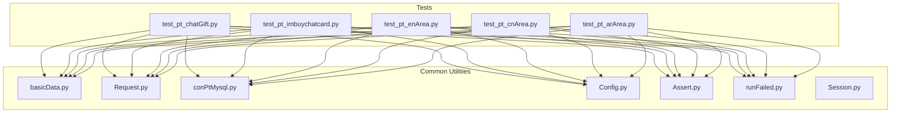
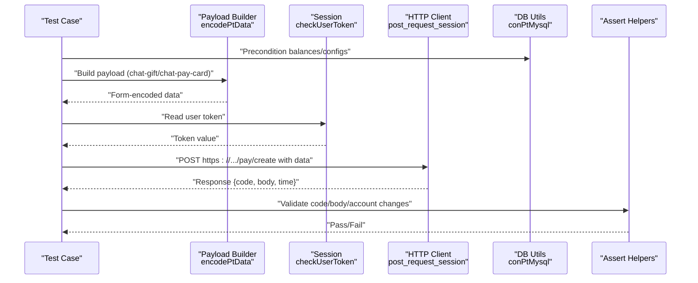
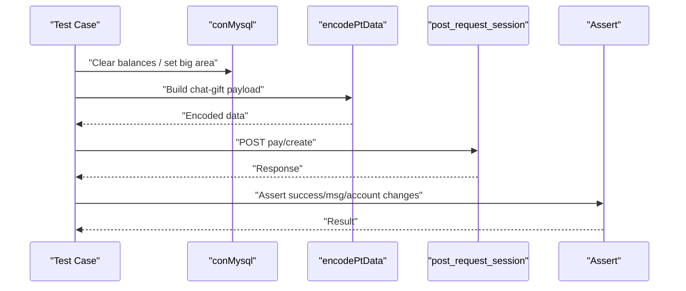
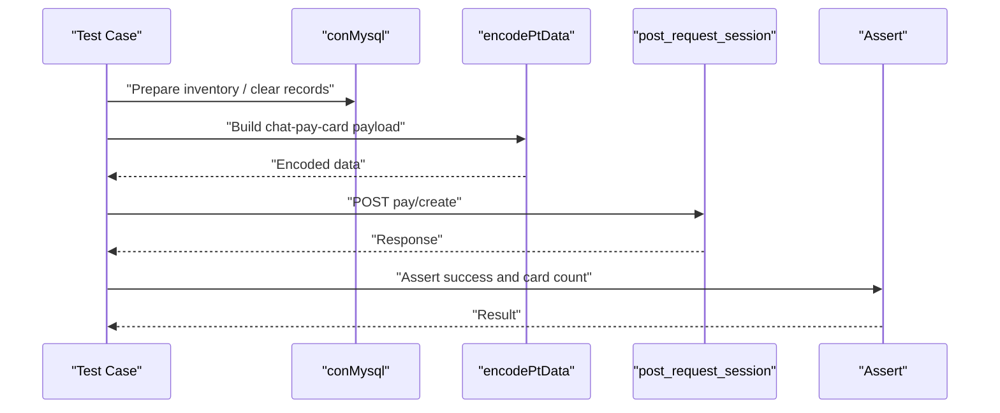
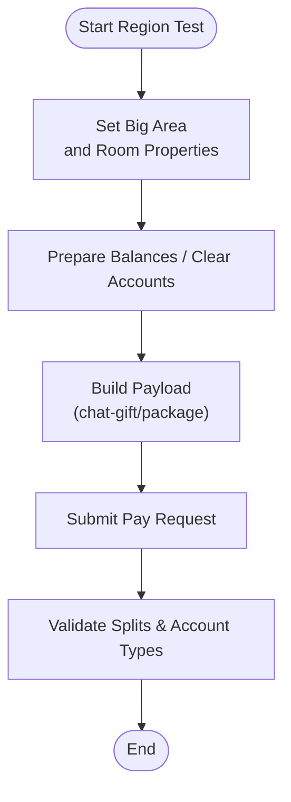
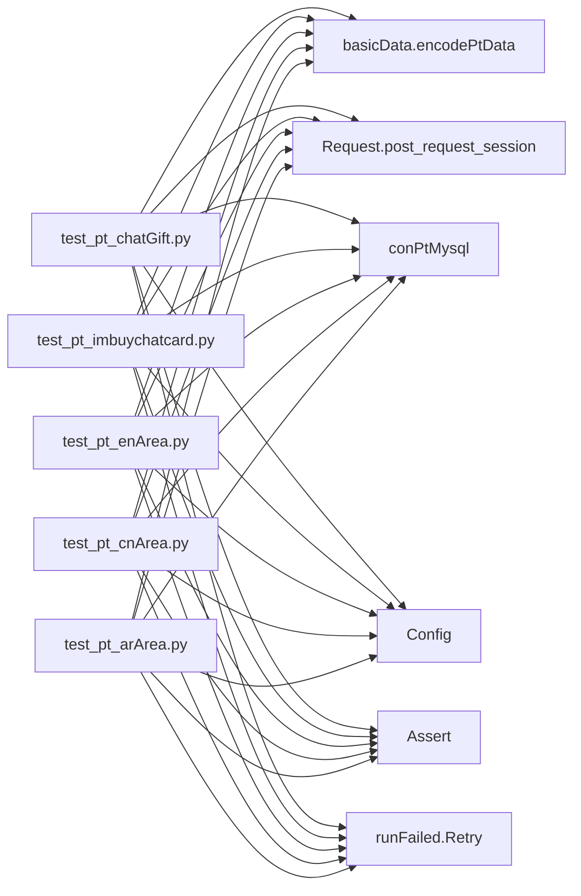

# Communication and Integration Scenarios

<cite>
**Referenced Files in This Document**
- [test_pt_chatGift.py](file://caseOversea/test_pt_chatGift.py)
- [test_pt_imbuychatcard.py](file://caseOversea/test_pt_imbuychatcard.py)
- [test_pt_enArea.py](file://caseOversea/test_pt_enArea.py)
- [test_pt_cnArea.py](file://caseOversea/test_pt_cnArea.py)
- [test_pt_arArea.py](file://caseOversea/test_pt_arArea.py)
- [basicData.py](file://common/basicData.py)
- [Request.py](file://common/Request.py)
- [conPtMysql.py](file://common/conPtMysql.py)
- [Config.py](file://common/Config.py)
- [Assert.py](file://common/Assert.py)
- [runFailed.py](file://common/runFailed.py)
- [Session.py](file://common/Session.py)
</cite>

## Table of Contents
1. [Introduction](#introduction)
2. [Project Structure](#project-structure)
3. [Core Components](#core-components)
4. [Architecture Overview](#architecture-overview)
5. [Detailed Component Analysis](#detailed-component-analysis)
6. [Dependency Analysis](#dependency-analysis)
7. [Performance Considerations](#performance-considerations)
8. [Troubleshooting Guide](#troubleshooting-guide)
9. [Conclusion](#conclusion)

## Introduction
This document focuses on PT Overseas communication and integration payment scenarios with an emphasis on:
- Chat gift transactions (private chat gifting)
- Integrated chat card purchases (private chat card acquisition via balance)
- Regionalized monetization flows across PT big areas (English, Chinese, Arabic)
- Coordination between payment processing and chat functionality
- Message delivery validation and regional integration points

It consolidates test-driven flows, payload construction, request orchestration, database assertions, and retry mechanisms to provide a practical guide for configuring, executing, and validating payment-enabled chat interactions.

## Project Structure
The repository organizes overseas payment tests under the caseOversea directory, with shared utilities in common. The key areas for communication and integration payments are:
- Payment test suites for chat gifts and chat cards
- Payload builders for PT Overseas
- HTTP request orchestration and token management
- Database utilities for preconditions and assertions
- Assertion helpers and retry decorators

**Diagram sources**
- [test_pt_chatGift.py:1-89](file://caseOversea/test_pt_chatGift.py#L1-L89)
- [test_pt_imbuychatcard.py:1-40](file://caseOversea/test_pt_imbuychatcard.py#L1-L40)
- [test_pt_enArea.py:1-121](file://caseOversea/test_pt_enArea.py#L1-L121)
- [test_pt_cnArea.py:1-194](file://caseOversea/test_pt_cnArea.py#L1-L194)
- [test_pt_arArea.py:1-120](file://caseOversea/test_pt_arArea.py#L1-L120)
- [basicData.py:327-566](file://common/basicData.py#L327-L566)
- [Request.py:17-59](file://common/Request.py#L17-L59)
- [conPtMysql.py:25-345](file://common/conPtMysql.py#L25-L345)
- [Config.py:95-130](file://common/Config.py#L95-L130)
- [Assert.py:11-96](file://common/Assert.py#L11-L96)
- [runFailed.py:10-87](file://common/runFailed.py#L10-L87)

**Section sources**
- [test_pt_chatGift.py:1-89](file://caseOversea/test_pt_chatGift.py#L1-L89)
- [test_pt_imbuychatcard.py:1-40](file://caseOversea/test_pt_imbuychatcard.py#L1-L40)
- [test_pt_enArea.py:1-121](file://caseOversea/test_pt_enArea.py#L1-L121)
- [test_pt_cnArea.py:1-194](file://caseOversea/test_pt_cnArea.py#L1-L194)
- [test_pt_arArea.py:1-120](file://caseOversea/test_pt_arArea.py#L1-L120)
- [basicData.py:327-566](file://common/basicData.py#L327-L566)
- [Request.py:17-59](file://common/Request.py#L17-L59)
- [conPtMysql.py:25-345](file://common/conPtMysql.py#L25-L345)
- [Config.py:95-130](file://common/Config.py#L95-L130)
- [Assert.py:11-96](file://common/Assert.py#L11-L96)
- [runFailed.py:10-87](file://common/runFailed.py#L10-L87)

## Core Components
- Payload builder for PT Overseas:
  - Encodes chat-gift and chat-pay-card payloads with parameters such as recipient, gift ID, quantity, and flags.
  - Supports region-specific defaults and optional extras (e.g., hideErrorToast).
- HTTP client:
  - Sends POST requests with form-encoded data and a user token header.
  - Normalizes URLs to HTTPS and captures timing metrics.
- Database utilities:
  - Updates balances, clears accounts, checks gift configs, and queries account totals and commodity counts.
  - Provides helpers to set big area and room properties for regional tests.
- Assertions and retries:
  - Standardized assertion helpers for response codes, equality, length thresholds, and JSON body fields.
  - Retry decorator to re-run flaky tests with setUp/tearDown hooks.

**Section sources**
- [basicData.py:327-566](file://common/basicData.py#L327-L566)
- [Request.py:17-59](file://common/Request.py#L17-L59)
- [conPtMysql.py:25-345](file://common/conPtMysql.py#L25-L345)
- [Assert.py:11-96](file://common/Assert.py#L11-L96)
- [runFailed.py:10-87](file://common/runFailed.py#L10-L87)

## Architecture Overview
The payment flow for PT Overseas chat integrates:
- Test orchestration (per-scenario test classes)
- Payload construction (encodePtData)
- Authentication (Session token management)
- HTTP request submission (post_request_session)
- Database preconditioning and validation (conPtMysql)
- Outcome verification (Assert helpers)

**Diagram sources**
- [test_pt_chatGift.py:24-89](file://caseOversea/test_pt_chatGift.py#L24-L89)
- [test_pt_imbuychatcard.py:19-40](file://caseOversea/test_pt_imbuychatcard.py#L19-L40)
- [basicData.py:327-566](file://common/basicData.py#L327-L566)
- [Request.py:17-59](file://common/Request.py#L17-L59)
- [conPtMysql.py:25-345](file://common/conPtMysql.py#L25-L345)
- [Assert.py:11-96](file://common/Assert.py#L11-L96)
- [Session.py:168-182](file://common/Session.py#L168-L182)

## Detailed Component Analysis

### Chat Gift Transactions (Private Chat Gifting)
This scenario covers:
- Private chat gift purchase with insufficient funds (validation)
- Private chat gift purchase with sufficient funds (split accounting)
- Private chat gift purchase of a gift box (random item extraction implied by regional expectations)

Key behaviors:
- Payload uses chat-gift type with recipient UID and gift selection.
- Tests assert success flag, messages, and final account balances.
- Regional variants adjust split ratios and target account types.

**Diagram sources**
- [test_pt_chatGift.py:24-89](file://caseOversea/test_pt_chatGift.py#L24-L89)
- [basicData.py:419-440](file://common/basicData.py#L419-L440)
- [Request.py:17-59](file://common/Request.py#L17-L59)
- [conPtMysql.py:25-345](file://common/conPtMysql.py#L25-L345)
- [Assert.py:11-96](file://common/Assert.py#L11-L96)

**Section sources**
- [test_pt_chatGift.py:24-89](file://caseOversea/test_pt_chatGift.py#L24-L89)
- [basicData.py:419-440](file://common/basicData.py#L419-L440)
- [conPtMysql.py:25-345](file://common/conPtMysql.py#L25-L345)
- [Assert.py:11-96](file://common/Assert.py#L11-L96)

### Integrated Chat Card Purchases (Balance Exchange)
This scenario covers:
- Exchanging balance to acquire private chat cards (chat-pay-card).
- Preparing user inventory and verifying card balance after purchase.

Key behaviors:
- Payload uses chat-pay-card type with predefined CID and quantity.
- Tests assert successful exchange and updated commodity count.

**Diagram sources**
- [test_pt_imbuychatcard.py:19-40](file://caseOversea/test_pt_imbuychatcard.py#L19-L40)
- [basicData.py:556-563](file://common/basicData.py#L556-L563)
- [Request.py:17-59](file://common/Request.py#L17-L59)
- [conPtMysql.py:25-345](file://common/conPtMysql.py#L25-L345)
- [Assert.py:11-96](file://common/Assert.py#L11-L96)

**Section sources**
- [test_pt_imbuychatcard.py:19-40](file://caseOversea/test_pt_imbuychatcard.py#L19-L40)
- [basicData.py:556-563](file://common/basicData.py#L556-L563)
- [conPtMysql.py:25-345](file://common/conPtMysql.py#L25-L345)
- [Assert.py:11-96](file://common/Assert.py#L11-L96)

### Regionalized Monetization Flows
Regional tests demonstrate area-specific splits and room-type effects:
- English big area: private chat and family room splits at 50% for recipients.
- Chinese big area: VIP rooms, business halls, and private chats apply distinct splits and account types.
- Arabic big area: business rooms, private chats, and union rooms follow area-specific splits.

**Diagram sources**
- [test_pt_enArea.py:20-121](file://caseOversea/test_pt_enArea.py#L20-L121)
- [test_pt_cnArea.py:26-194](file://caseOversea/test_pt_cnArea.py#L26-L194)
- [test_pt_arArea.py:22-120](file://caseOversea/test_pt_arArea.py#L22-L120)
- [conPtMysql.py:157-184](file://common/conPtMysql.py#L157-L184)
- [basicData.py:327-566](file://common/basicData.py#L327-L566)
- [Request.py:17-59](file://common/Request.py#L17-L59)
- [Assert.py:11-96](file://common/Assert.py#L11-L96)

**Section sources**
- [test_pt_enArea.py:20-121](file://caseOversea/test_pt_enArea.py#L20-L121)
- [test_pt_cnArea.py:26-194](file://caseOversea/test_pt_cnArea.py#L26-L194)
- [test_pt_arArea.py:22-120](file://caseOversea/test_pt_arArea.py#L22-L120)
- [conPtMysql.py:157-184](file://common/conPtMysql.py#L157-L184)
- [basicData.py:327-566](file://common/basicData.py#L327-L566)
- [Request.py:17-59](file://common/Request.py#L17-L59)
- [Assert.py:11-96](file://common/Assert.py#L11-L96)

## Dependency Analysis
The following diagram highlights the primary dependencies among components involved in payment-enabled chat flows.

**Diagram sources**
- [test_pt_chatGift.py:1-89](file://caseOversea/test_pt_chatGift.py#L1-L89)
- [test_pt_imbuychatcard.py:1-40](file://caseOversea/test_pt_imbuychatcard.py#L1-L40)
- [test_pt_enArea.py:1-121](file://caseOversea/test_pt_enArea.py#L1-L121)
- [test_pt_cnArea.py:1-194](file://caseOversea/test_pt_cnArea.py#L1-L194)
- [test_pt_arArea.py:1-120](file://caseOversea/test_pt_arArea.py#L1-L120)
- [basicData.py:327-566](file://common/basicData.py#L327-L566)
- [Request.py:17-59](file://common/Request.py#L17-L59)
- [conPtMysql.py:25-345](file://common/conPtMysql.py#L25-L345)
- [Config.py:95-130](file://common/Config.py#L95-L130)
- [Assert.py:11-96](file://common/Assert.py#L11-L96)
- [runFailed.py:10-87](file://common/runFailed.py#L10-L87)

**Section sources**
- [test_pt_chatGift.py:1-89](file://caseOversea/test_pt_chatGift.py#L1-L89)
- [test_pt_imbuychatcard.py:1-40](file://caseOversea/test_pt_imbuychatcard.py#L1-L40)
- [test_pt_enArea.py:1-121](file://caseOversea/test_pt_enArea.py#L1-L121)
- [test_pt_cnArea.py:1-194](file://caseOversea/test_pt_cnArea.py#L1-L194)
- [test_pt_arArea.py:1-120](file://caseOversea/test_pt_arArea.py#L1-L120)
- [basicData.py:327-566](file://common/basicData.py#L327-L566)
- [Request.py:17-59](file://common/Request.py#L17-L59)
- [conPtMysql.py:25-345](file://common/conPtMysql.py#L25-L345)
- [Config.py:95-130](file://common/Config.py#L95-L130)
- [Assert.py:11-96](file://common/Assert.py#L11-L96)
- [runFailed.py:10-87](file://common/runFailed.py#L10-L87)

## Performance Considerations
- Network latency and retries:
  - The retry mechanism attempts failed tests up to a configured number of times with setUp/tearDown resets.
  - Assertions introduce a small delay on non-target hosts to mitigate RPC timing inconsistencies.
- Request overhead:
  - Requests are sent as form-encoded payloads with explicit user tokens; ensure minimal payload size and avoid unnecessary fields.
- Database operations:
  - Batch updates and deletions are committed per operation; keep preconditions concise to reduce DB contention during concurrent runs.

[No sources needed since this section provides general guidance]

## Troubleshooting Guide
Common failure categories and remedies:
- Payment rejected due to insufficient balance:
  - Verify initial balances are cleared and set appropriately before each test.
  - Confirm the success flag and message match expected outcomes.
- Split ratio mismatches by region:
  - Ensure the user’s big area is set before building payloads.
  - Validate target account types (e.g., personal vs. cash) align with regional rules.
- Chat card purchase not reflected:
  - Confirm commodity record deletion and chat card record cleanup prior to purchase.
  - Check commodity count after exchange matches expected quantity.
- Flaky network or RPC timing:
  - Use the retry decorator to rerun failing tests.
  - On non-target hosts, assertion delays help stabilize results.

Operational tips:
- Token management:
  - Ensure the user token is present and readable from storage before sending requests.
- Payload correctness:
  - Validate payload keys and values (recipient, giftId, num) against regional defaults.
- Database assertions:
  - Prefer targeted queries for single accounts and totals to minimize ambiguity.

**Section sources**
- [test_pt_chatGift.py:24-89](file://caseOversea/test_pt_chatGift.py#L24-L89)
- [test_pt_imbuychatcard.py:19-40](file://caseOversea/test_pt_imbuychatcard.py#L19-L40)
- [test_pt_enArea.py:20-121](file://caseOversea/test_pt_enArea.py#L20-L121)
- [test_pt_cnArea.py:26-194](file://caseOversea/test_pt_cnArea.py#L26-L194)
- [test_pt_arArea.py:22-120](file://caseOversea/test_pt_arArea.py#L22-L120)
- [runFailed.py:10-87](file://common/runFailed.py#L10-L87)
- [Assert.py:11-96](file://common/Assert.py#L11-L96)
- [conPtMysql.py:25-345](file://common/conPtMysql.py#L25-L345)
- [Session.py:168-182](file://common/Session.py#L168-L182)

## Conclusion
The PT Overseas communication and integration payment suite provides robust, region-aware coverage for chat gift transactions and chat card purchases. By combining payload builders, tokenized HTTP requests, deterministic database preconditions, and standardized assertions with retry logic, teams can reliably validate monetization flows across big areas. Adhering to the configuration and troubleshooting guidance herein ensures predictable outcomes and efficient debugging when payment-related chat features encounter issues.