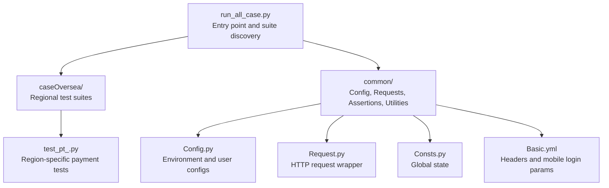
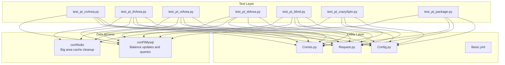
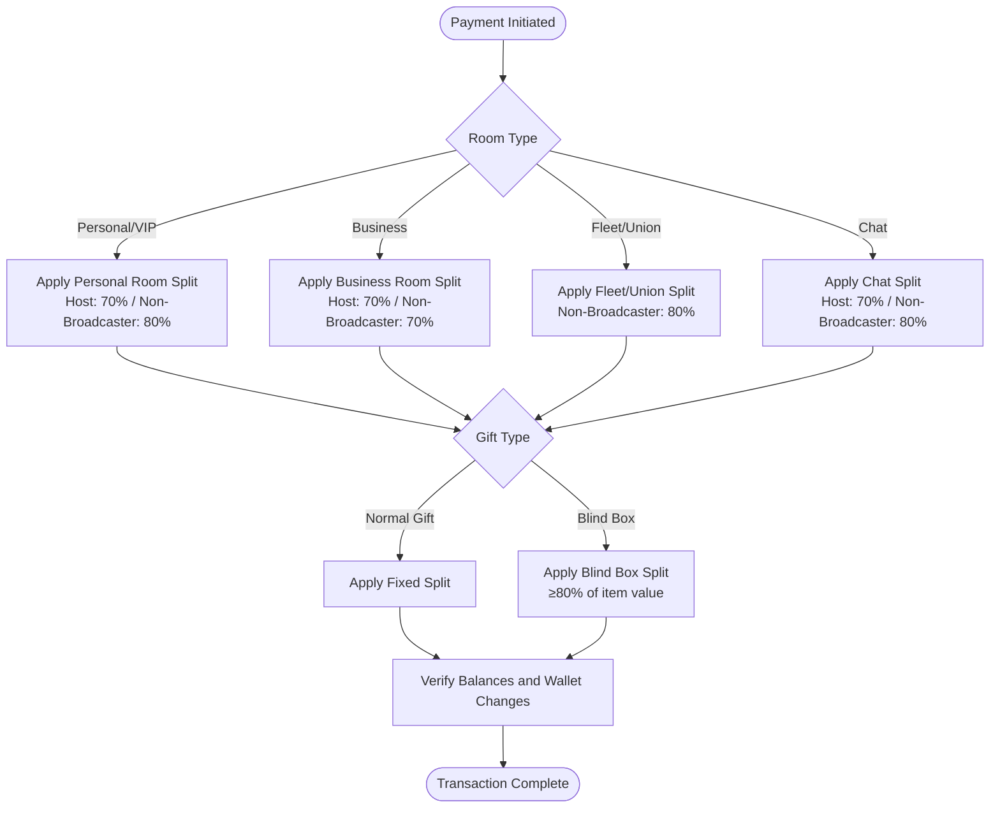
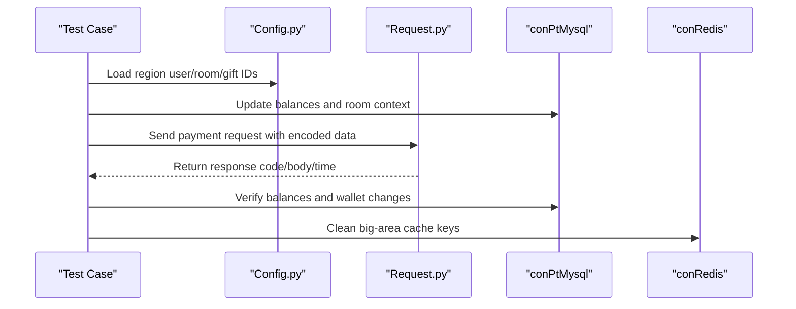

# PT Overseas Platform Testing

<cite>
**Referenced Files in This Document**
- [README.md](file://README.md)
- [run_all_case.py](file://run_all_case.py)
- [common/Config.py](file://common/Config.py)
- [common/Consts.py](file://common/Consts.py)
- [common/Basic.yml](file://common/Basic.yml)
- [common/Request.py](file://common/Request.py)
- [caseOversea/test_pt_cnArea.py](file://caseOversea/test_pt_cnArea.py)
- [caseOversea/test_pt_enArea.py](file://caseOversea/test_pt_enArea.py)
- [caseOversea/test_pt_blind.py](file://caseOversea/test_pt_blind.py)
- [caseOversea/test_pt_crazySpin.py](file://caseOversea/test_pt_crazySpin.py)
- [caseOversea/test_pt_package.py](file://caseOversea/test_pt_package.py)
- [caseOversea/test_pt_idArea.py](file://caseOversea/test_pt_idArea.py)
- [caseOversea/test_pt_viArea.py](file://caseOversea/test_pt_viArea.py)
- [caseOversea/test_pt_thArea.py](file://caseOversea/test_pt_thArea.py)
- [caseOversea/test_pt_msArea.py](file://caseOversea/test_pt_msArea.py)
</cite>

## Table of Contents
1. [Introduction](#introduction)
2. [Project Structure](#project-structure)
3. [Core Components](#core-components)
4. [Architecture Overview](#architecture-overview)
5. [Regional Payment Flows](#regional-payment-flows)
6. [Multi-Currency and Localization](#multi-currency-and-localization)
7. [Specialized Scenarios](#specialized-scenarios)
8. [Regional Configuration Requirements](#regional-configuration-requirements)
9. [Compliance and Cultural Adaptations](#compliance-and-cultural-adaptations)
10. [Performance Considerations](#performance-considerations)
11. [Troubleshooting Guide](#troubleshooting-guide)
12. [Conclusion](#conclusion)

## Introduction
This document provides comprehensive testing documentation for the PT Overseas platform payment system across 12 regional markets. It covers regional payment flows, multi-currency support, localized business logic, and cultural adaptations. Specialized scenarios such as blind box operations, crazy spin games, defensive systems, package purchases, planet exploration, VIP ranking systems, and chat card integrations are documented alongside regional configuration requirements, currency conversion handling, localization challenges, and compliance considerations.

## Project Structure
The repository is organized around a modular test framework with region-specific test suites under the caseOversea directory. Centralized configuration and utilities reside in the common directory, while regional tests validate payment flows and business logic per market segment.

**Diagram sources**
- [run_all_case.py:126-147](file://run_all_case.py#L126-L147)
- [common/Config.py:6-133](file://common/Config.py#L6-L133)
- [common/Request.py:17-59](file://common/Request.py#L17-L59)

**Section sources**
- [README.md:1-38](file://README.md#L1-L38)
- [run_all_case.py:126-147](file://run_all_case.py#L126-L147)

## Core Components
- Configuration Management: Centralized environment and user configurations for PT Overseas, including host URLs, user IDs, room IDs, and gift IDs.
- Request Layer: A unified HTTP POST wrapper that injects tokens and handles response parsing.
- Assertion Utilities: Standardized assertion helpers for validating API responses and database state.
- Global State: Shared counters and lists for tracking test results and timing.

Key responsibilities:
- Environment routing and app selection
- Regional user and room context setup
- Payment request construction and validation
- Database state verification post-transaction

**Section sources**
- [common/Config.py:95-130](file://common/Config.py#L95-L130)
- [common/Request.py:17-59](file://common/Request.py#L17-L59)
- [common/Consts.py:4-17](file://common/Consts.py#L4-L17)

## Architecture Overview
The testing architecture follows a layered approach:
- Test Layer: Region-specific test classes and methods define scenarios and assertions.
- Utility Layer: Config, Request, and Assertion modules encapsulate cross-cutting concerns.
- Data Access Layer: Database helpers update and verify account balances and transaction logs.

**Diagram sources**
- [common/Config.py:95-130](file://common/Config.py#L95-L130)
- [common/Request.py:17-59](file://common/Request.py#L17-L59)
- [caseOversea/test_pt_cnArea.py:26-34](file://caseOversea/test_pt_cnArea.py#L26-L34)
- [caseOversea/test_pt_thArea.py:21-32](file://caseOversea/test_pt_thArea.py#L21-L32)
- [caseOversea/test_pt_viArea.py:26-34](file://caseOversea/test_pt_viArea.py#L26-L34)
- [caseOversea/test_pt_idArea.py:22-32](file://caseOversea/test_pt_idArea.py#L22-L32)
- [caseOversea/test_pt_blind.py:18-29](file://caseOversea/test_pt_blind.py#L18-L29)

## Regional Payment Flows
This section documents payment flows per region, focusing on room types, gift categories, and revenue splits.

- China (CN)
  - Personal rooms: Host receives 70%, non-broadcasters receive 80% for gifts; blind box winnings follow 80% split.
  - Chat: Non-broadcasters receive 80% for gifts; hosts receive 70%.
  - Business rooms: Host receives 70%; non-broadcasters receive 70%.

- Thailand (TH)
  - Union rooms: Non-broadcasters receive 80% for gifts and blind boxes.
  - Chat: Hosts receive 70%; non-broadcasters receive 80%.
  - Business rooms: Host receives 70%.

- Vietnam (VI)
  - Business rooms: Non-broadcasters receive 70% for gifts and blind boxes.
  - Union/VIP rooms: Non-broadcasters receive 80% for gifts.
  - Chat: Non-broadcasters receive 50% for gifts; hosts receive 50%.

- Indonesia (ID)
  - Fleet/vip rooms: Non-broadcasters receive 80% for gifts and blind boxes.
  - Chat: Both hosts and non-broadcasters receive 50%.

- Malaysia (MS)
  - Fleet/vip rooms: Non-broadcasters receive 80% for gifts and blind boxes.
  - Chat: Both hosts and non-broadcasters receive 50%.
  - Note: Market is merged into Indonesia.

- English (EN)
  - Chat and fleet rooms: 50% split for gifts and blind boxes.
  - Note: Old-style EN area is deprecated; replaced by new area.

- Arabic (AR)
  - New area tests exist for commercial and union rooms with regional big-area context.

- Korean (KO)
  - New area tests exist for commercial and union rooms with regional big-area context.

- Japanese (JA)
  - New area tests exist for commercial and union rooms with regional big-area context.

- Vietnamese (VI) New Area
  - Enhanced business and union room flows with updated splits.

- Chinese (CN) New Area
  - Updated business room splits and blind box handling.

- English (EN) New Area
  - Updated chat and business room splits.

- Korean (KO) New Area
  - Updated union and business room splits.

- Additional Areas
  - Tests cover union and business room contexts for various regions.

**Diagram sources**
- [caseOversea/test_pt_cnArea.py:35-194](file://caseOversea/test_pt_cnArea.py#L35-L194)
- [caseOversea/test_pt_thArea.py:33-150](file://caseOversea/test_pt_thArea.py#L33-L150)
- [caseOversea/test_pt_viArea.py:35-189](file://caseOversea/test_pt_viArea.py#L35-L189)
- [caseOversea/test_pt_idArea.py:33-125](file://caseOversea/test_pt_idArea.py#L33-L125)
- [caseOversea/test_pt_msArea.py:32-122](file://caseOversea/test_pt_msArea.py#L32-L122)
- [caseOversea/test_pt_enArea.py:28-121](file://caseOversea/test_pt_enArea.py#L28-L121)

**Section sources**
- [caseOversea/test_pt_cnArea.py:14-24](file://caseOversea/test_pt_cnArea.py#L14-L24)
- [caseOversea/test_pt_thArea.py:15-20](file://caseOversea/test_pt_thArea.py#L15-L20)
- [caseOversea/test_pt_viArea.py:14-24](file://caseOversea/test_pt_viArea.py#L14-L24)
- [caseOversea/test_pt_idArea.py:14-20](file://caseOversea/test_pt_idArea.py#L14-L20)
- [caseOversea/test_pt_msArea.py:13-20](file://caseOversea/test_pt_msArea.py#L13-L20)
- [caseOversea/test_pt_enArea.py:12-18](file://caseOversea/test_pt_enArea.py#L12-L18)

## Multi-Currency and Localization
- Currency Representation: Payments use local units (e.g., coins, cash, gems) with internal conversions handled server-side.
- Gift Categories: Normal gifts and blind boxes are supported; blind box outcomes are validated against minimum thresholds and split percentages.
- Localization Headers: Regional headers and mobile login parameters are maintained centrally for consistent request formatting.

Localization considerations:
- Regional big-area context is set via Redis keys and cleaned up after tests.
- Room type assignments (business, fleet, vip, union) are selected per region.
- Gift IDs differ by region; ensure correct gift IDs are used per scenario.

**Section sources**
- [common/Basic.yml:7-36](file://common/Basic.yml#L7-L36)
- [caseOversea/test_pt_blind.py:18-29](file://caseOversea/test_pt_blind.py#L18-L29)
- [caseOversea/test_pt_thArea.py:21-32](file://caseOversea/test_pt_thArea.py#L21-L32)
- [caseOversea/test_pt_viArea.py:26-34](file://caseOversea/test_pt_viArea.py#L26-L34)
- [caseOversea/test_pt_idArea.py:22-32](file://caseOversea/test_pt_idArea.py#L22-L32)

## Specialized Scenarios
- Blind Box Operations
  - Single recipient and multiple recipients scenarios validate split percentages and minimum item values.
  - Blind box gift IDs are region-specific; ensure correct gift IDs are used.

- Crazy Spin Games
  - Purchase of game tickets and gameplay validation ensure wallet deductions and commodity increments are accurate.
  - Turntable list and horn endpoints are invoked to prepare the game session.

- Package Purchases
  - Insufficient balance scenarios return failure messages and zero recipient balance.
  - Successful transactions validate split allocations and remaining balances.

- Planet Exploration and VIP Ranking Systems
  - These areas are covered by dedicated test suites and require separate validation steps aligned with game mechanics and VIP tiers.

- Chat Card Integrations
  - Chat gift scenarios validate 50% splits for EN area and region-specific splits for CN, TH, VI, ID, MS areas.

**Diagram sources**
- [common/Config.py:95-130](file://common/Config.py#L95-L130)
- [common/Request.py:17-59](file://common/Request.py#L17-L59)
- [caseOversea/test_pt_blind.py:18-29](file://caseOversea/test_pt_blind.py#L18-L29)
- [caseOversea/test_pt_crazySpin.py:16-40](file://caseOversea/test_pt_crazySpin.py#L16-L40)
- [caseOversea/test_pt_package.py:25-43](file://caseOversea/test_pt_package.py#L25-L43)

**Section sources**
- [caseOversea/test_pt_blind.py:30-88](file://caseOversea/test_pt_blind.py#L30-L88)
- [caseOversea/test_pt_crazySpin.py:14-74](file://caseOversea/test_pt_crazySpin.py#L14-L74)
- [caseOversea/test_pt_package.py:14-65](file://caseOversea/test_pt_package.py#L14-L65)

## Regional Configuration Requirements
- Big Area Context: Each test sets the user’s big-area ID and cleans Redis keys post-test.
- Room Context: Users are placed in specific room types (business, fleet, vip, union) per region.
- Gift IDs: Region-specific gift IDs are used for blind boxes and normal gifts.
- Mobile Login Params: Centralized headers and parameters ensure consistent client identity across regions.

Operational steps:
- Set big-area ID for all users involved.
- Assign room context for business/fleet/vip/union scenarios.
- Clear Redis big-area keys after teardown.
- Use correct gift IDs for blind box tests.

**Section sources**
- [caseOversea/test_pt_blind.py:18-29](file://caseOversea/test_pt_blind.py#L18-L29)
- [caseOversea/test_pt_thArea.py:21-32](file://caseOversea/test_pt_thArea.py#L21-L32)
- [caseOversea/test_pt_viArea.py:26-34](file://caseOversea/test_pt_viArea.py#L26-L34)
- [caseOversea/test_pt_idArea.py:22-32](file://caseOversea/test_pt_idArea.py#L22-L32)
- [common/Config.py:95-130](file://common/Config.py#L95-L130)
- [common/Basic.yml:7-36](file://common/Basic.yml#L7-L36)

## Compliance and Cultural Adaptations
- Regional Compliance: Each region enforces distinct revenue splits and wallet types; ensure tests reflect current policies.
- Cultural Sensitivity: Gift categories and blind box mechanics are adapted per region; maintain correct gift IDs and thresholds.
- Data Privacy: Test accounts are used; avoid real user data and ensure logs are sanitized.

## Performance Considerations
- Request Overhead: Centralized request wrapper adds minimal overhead; ensure headers and tokens are cached where possible.
- Database Transactions: Batch updates and verifications are performed per test; keep test isolation to avoid contention.
- Concurrency: Run tests in parallel per region to reduce total runtime; avoid shared mutable state.

## Troubleshooting Guide
Common issues and resolutions:
- Insufficient Balance: Tests expect failure messages and zero recipient balance; verify balance updates prior to payment.
- Wrong Gift ID: Blind box tests require region-specific gift IDs; confirm gift IDs in Config.py.
- Big Area Mismatch: Ensure Redis big-area keys are cleared after tests to prevent stale context.
- Chat vs Room Splits: Validate room type and user role (host/non-host) to apply correct split percentages.

**Section sources**
- [caseOversea/test_pt_package.py:25-43](file://caseOversea/test_pt_package.py#L25-L43)
- [caseOversea/test_pt_blind.py:30-57](file://caseOversea/test_pt_blind.py#L30-L57)
- [caseOversea/test_pt_thArea.py:21-32](file://caseOversea/test_pt_thArea.py#L21-L32)
- [caseOversea/test_pt_viArea.py:26-34](file://caseOversea/test_pt_viArea.py#L26-L34)
- [caseOversea/test_pt_idArea.py:22-32](file://caseOversea/test_pt_idArea.py#L22-L32)

## Conclusion
The PT Overseas platform payment testing framework provides robust coverage across 12 regional markets with region-specific splits, blind box mechanics, crazy spin integration, and chat-based transactions. By leveraging centralized configuration, request wrappers, and assertion utilities, the tests ensure compliance with regional policies and deliver reliable payment flows. Extending coverage to new areas requires setting big-area context, selecting appropriate room types, and validating split allocations against local business rules.