# Regional Area Testing

<cite>
**Referenced Files in This Document**
- [test_pt_ArnewArea.py](file://caseOversea/test_pt_ArnewArea.py)
- [test_pt_arArea.py](file://caseOversea/test_pt_arArea.py)
- [test_pt_cnArea.py](file://caseOversea/test_pt_cnArea.py)
- [test_pt_enArea.py](file://caseOversea/test_pt_enArea.py)
- [test_pt_en_NewArea.py](file://caseOversea/test_pt_en_NewArea.py)
- [test_pt_idArea.py](file://caseOversea/test_pt_idArea.py)
- [test_pt_jaArea.py](file://caseOversea/test_pt_jaArea.py)
- [test_pt_koNewArea.py](file://caseOversea/test_pt_koNewArea.py)
- [test_pt_msArea.py](file://caseOversea/test_pt_msArea.py)
- [test_pt_thArea.py](file://caseOversea/test_pt_thArea.py)
- [test_pt_viArea.py](file://caseOversea/test_pt_viArea.py)
- [Config.py](file://common/Config.py)
- [conPtMysql.py](file://common/conPtMysql.py)
- [basicData.py](file://common/basicData.py)
- [run_all_case.py](file://run_all_case.py)
</cite>

## Table of Contents
1. [Introduction](#introduction)
2. [Project Structure](#project-structure)
3. [Core Components](#core-components)
4. [Architecture Overview](#architecture-overview)
5. [Detailed Component Analysis](#detailed-component-analysis)
6. [Dependency Analysis](#dependency-analysis)
7. [Performance Considerations](#performance-considerations)
8. [Troubleshooting Guide](#troubleshooting-guide)
9. [Conclusion](#conclusion)
10. [Appendices](#appendices)

## Introduction
This document describes the regional area testing framework for PT Overseas markets. It focuses on payment flows, currency handling, localization, and market-specific business logic across 11 regions: Argentina (AR), China (CN), England (EN), Indonesia (ID), Vietnam (VI), Thailand (TH), Malaysia (MS), Japan (JA), and Korea (KO). It also documents new area implementations and provides setup procedures, test scenarios, expected outcomes, and troubleshooting guidance for regional payment processing.

## Project Structure
The regional tests reside under the caseOversea directory and share a common testing infrastructure:
- Case modules per region define test scenarios and assertions.
- Common modules provide configuration, database helpers, payload builders, and test runner orchestration.

```mermaid
graph TB
subgraph "Regional Test Modules"
ARN["test_pt_ArnewArea.py"]
AR["test_pt_arArea.py"]
CN["test_pt_cnArea.py"]
EN["test_pt_enArea.py"]
ENN["test_pt_en_NewArea.py"]
ID["test_pt_idArea.py"]
JA["test_pt_jaArea.py"]
KO["test_pt_koNewArea.py"]
MS["test_pt_msArea.py"]
TH["test_pt_thArea.py"]
VI["test_pt_viArea.py"]
end
subgraph "Common Infrastructure"
CFG["Config.py"]
DB["conPtMysql.py"]
DATA["basicData.py"]
RUN["run_all_case.py"]
end
ARN --> CFG
ARN --> DB
ARN --> DATA
ARN --> RUN
AR --> CFG
AR --> DB
AR --> DATA
AR --> RUN
CN --> CFG
CN --> DB
CN --> DATA
CN --> RUN
EN --> CFG
EN --> DB
EN --> DATA
EN --> RUN
ENN --> CFG
ENN --> DB
ENN --> DATA
ENN --> RUN
ID --> CFG
ID --> DB
ID --> DATA
ID --> RUN
JA --> CFG
JA --> DB
JA --> DATA
JA --> RUN
KO --> CFG
KO --> DB
KO --> DATA
KO --> RUN
MS --> CFG
MS --> DB
MS --> DATA
MS --> RUN
TH --> CFG
TH --> DB
TH --> DATA
TH --> RUN
VI --> CFG
VI --> DB
VI --> DATA
VI --> RUN
```

**Diagram sources**
- [test_pt_ArnewArea.py:1-166](file://caseOversea/test_pt_ArnewArea.py#L1-L166)
- [test_pt_arArea.py:1-120](file://caseOversea/test_pt_arArea.py#L1-L120)
- [test_pt_cnArea.py:1-194](file://caseOversea/test_pt_cnArea.py#L1-L194)
- [test_pt_enArea.py:1-121](file://caseOversea/test_pt_enArea.py#L1-L121)
- [test_pt_en_NewArea.py:1-167](file://caseOversea/test_pt_en_NewArea.py#L1-L167)
- [test_pt_idArea.py:1-125](file://caseOversea/test_pt_idArea.py#L1-L125)
- [test_pt_jaArea.py:1-125](file://caseOversea/test_pt_jaArea.py#L1-L125)
- [test_pt_koNewArea.py:1-122](file://caseOversea/test_pt_koNewArea.py#L1-L122)
- [test_pt_msArea.py:1-122](file://caseOversea/test_pt_msArea.py#L1-L122)
- [test_pt_thArea.py:1-150](file://caseOversea/test_pt_thArea.py#L1-L150)
- [test_pt_viArea.py:1-189](file://caseOversea/test_pt_viArea.py#L1-L189)
- [Config.py:1-133](file://common/Config.py#L1-L133)
- [conPtMysql.py:1-345](file://common/conPtMysql.py#L1-L345)
- [basicData.py:1-581](file://common/basicData.py#L1-L581)
- [run_all_case.py:1-159](file://run_all_case.py#L1-L159)

**Section sources**
- [run_all_case.py:126-147](file://run_all_case.py#L126-L147)
- [Config.py:96-130](file://common/Config.py#L96-L130)

## Core Components
- Regional test classes encapsulate scenario-driven tests for payment flows, gift transactions, and box/gift opening events. Each module sets up big area and room context, prepares balances, executes payment requests, and asserts expected financial outcomes.
- Database helpers manage user balances, room properties, and big area assignments to simulate regional contexts.
- Payload builders construct standardized payment payloads for packages, chat gifts, shop buys, and box opens.
- Configuration centralizes endpoints, user IDs, room IDs, gift IDs, and environment settings.

Key responsibilities:
- Payment flow orchestration via encoded payloads and session-based requests.
- Currency and balance assertions against wallet and extended wallet accounts.
- Room-type and big-area scoping to emulate regional environments.

**Section sources**
- [test_pt_viArea.py:26-34](file://caseOversea/test_pt_viArea.py#L26-L34)
- [conPtMysql.py:146-171](file://common/conPtMysql.py#L146-L171)
- [basicData.py:327-565](file://common/basicData.py#L327-L565)
- [Config.py:96-130](file://common/Config.py#L96-L130)

## Architecture Overview
The regional testing architecture follows a layered approach:
- Test modules depend on common configuration and utilities.
- Database helpers update and query user wallets and room metadata.
- Payload builders generate standardized request bodies.
- Test runner discovers and executes regional test suites.

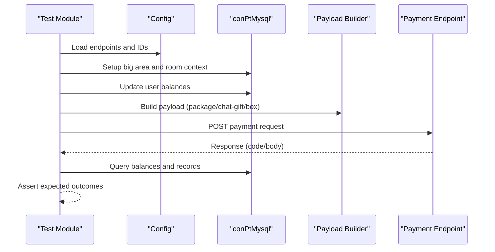

**Diagram sources**
- [test_pt_en_NewArea.py:28-47](file://caseOversea/test_pt_en_NewArea.py#L28-L47)
- [conPtMysql.py:146-171](file://common/conPtMysql.py#L146-L171)
- [basicData.py:327-565](file://common/basicData.py#L327-L565)
- [Config.py:47-55](file://common/Config.py#L47-L55)

## Detailed Component Analysis

### Argentina (AR) New Area
- Focus: Gift and box rewards in business rooms and union rooms; differentiated splits for broker/non-broker hosts and personal cash accounts.
- Scenarios:
  - Business room gift to broker host: 50% split to money_cash.
  - Business room box open: 50% of box value to money_cash.
  - Private chat gift to broker host: 50% split to money_cash.
  - Union room gift to broker host: 50% split to money_cash.
  - Non-broker host in business room: 70% to money_cash_personal.
  - Non-broker host in private chat: 70% to money_cash_personal.

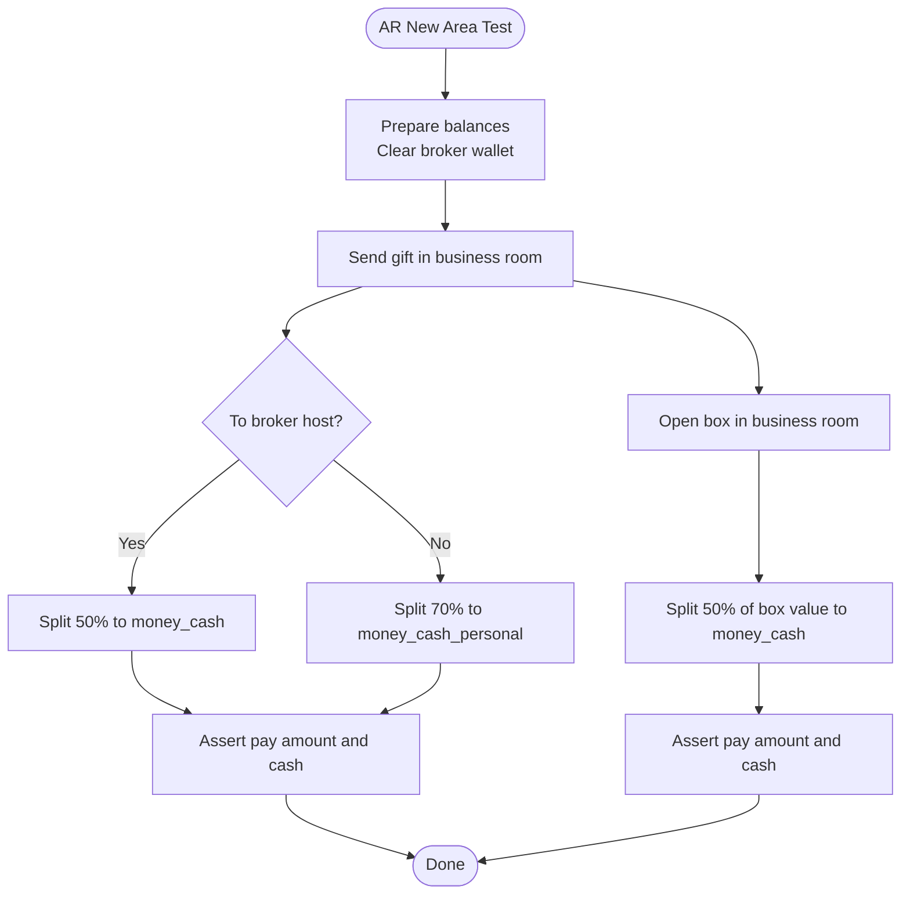

**Diagram sources**
- [test_pt_ArnewArea.py:33-121](file://caseOversea/test_pt_ArnewArea.py#L33-L121)

**Section sources**
- [test_pt_ArnewArea.py:12-22](file://caseOversea/test_pt_ArnewArea.py#L12-L22)
- [test_pt_ArnewArea.py:33-121](file://caseOversea/test_pt_ArnewArea.py#L33-L121)

### Argentina (AR) Legacy Area
- Focus: Legacy split model with different ratios for business room gifts, box opens, private chat, and union room.
- Scenarios:
  - Business room gift to non-broker host: 70% split to money_cash.
  - Business room box open to non-broker host: 70% split to money_cash_b.
  - Private chat gift to non-broker host: 80% split to money_cash.
  - Union room gift to non-broker host: 30% split to money_cash.

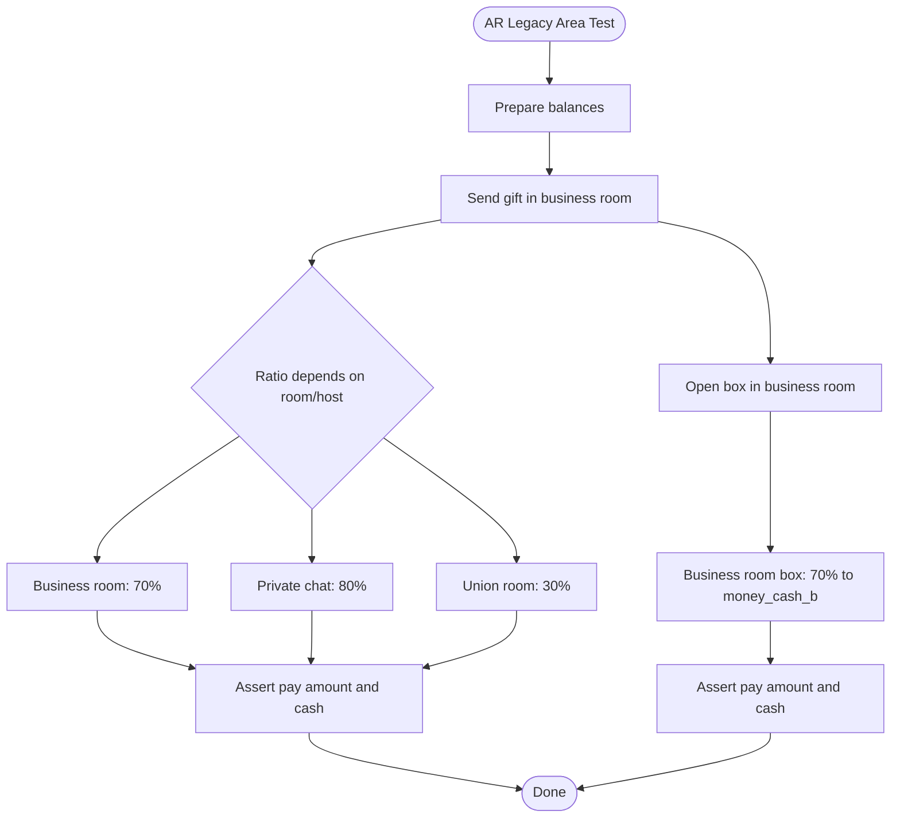

**Diagram sources**
- [test_pt_arArea.py:31-119](file://caseOversea/test_pt_arArea.py#L31-L119)

**Section sources**
- [test_pt_arArea.py:12-20](file://caseOversea/test_pt_arArea.py#L12-L20)
- [test_pt_arArea.py:31-119](file://caseOversea/test_pt_arArea.py#L31-L119)

### China (CN)
- Focus: Personal room and business hall splits; chat splits differ by host type; personal cash vs. business cash destinations.
- Scenarios:
  - Personal room gift to broker host: 70% to money_cash_b.
  - Personal room gift to non-broker host: 80% to money_cash_personal.
  - Personal room box open to non-broker host: 80% to money_cash_personal.
  - Private chat gift to non-broker host: 80% to money_cash_personal.
  - Private chat gift to broker host: 70% to money_cash_b.
  - Business hall gift to broker host: 70% to money_cash_b.
  - Business hall gift to non-broker host: 70% to money_cash_personal.

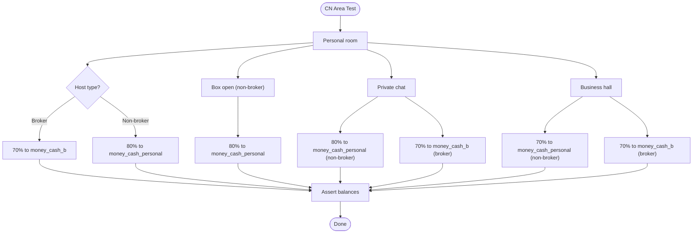

**Diagram sources**
- [test_pt_cnArea.py:35-192](file://caseOversea/test_pt_cnArea.py#L35-L192)

**Section sources**
- [test_pt_cnArea.py:14-24](file://caseOversea/test_pt_cnArea.py#L14-L24)
- [test_pt_cnArea.py:35-192](file://caseOversea/test_pt_cnArea.py#L35-L192)

### England (EN) New Area
- Focus: Differentiated chat and box splits by host type; family room splits consistent.
- Scenarios:
  - Private chat gift to broker host: 50% to money_cash.
  - Private chat gift to non-broker host: 70% to money_cash_personal.
  - Private chat box open to non-broker host: 70% to money_cash_personal.
  - Private chat box open to broker host: 50% to money_cash.
  - Family room gift to broker host: 50% to money_cash.
  - Family room box open to non-broker host: 70% to money_cash_personal.

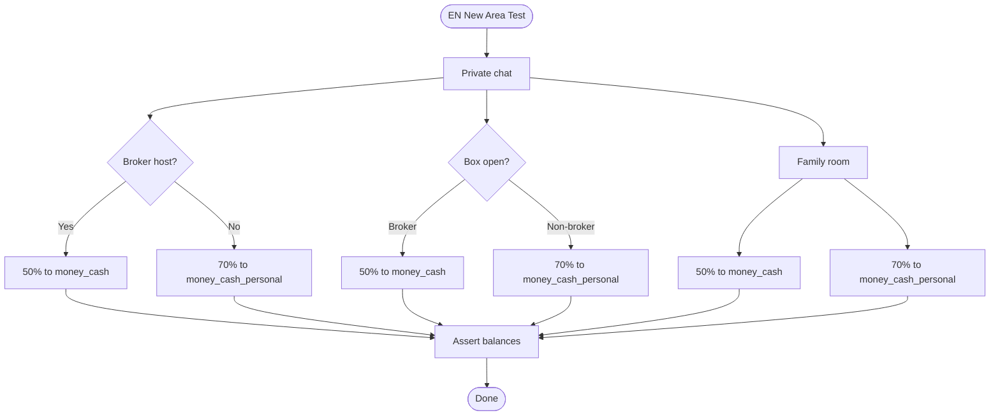

**Diagram sources**
- [test_pt_en_NewArea.py:28-166](file://caseOversea/test_pt_en_NewArea.py#L28-L166)

**Section sources**
- [test_pt_en_NewArea.py:13-18](file://caseOversea/test_pt_en_NewArea.py#L13-L18)
- [test_pt_en_NewArea.py:28-166](file://caseOversea/test_pt_en_NewArea.py#L28-L166)

### England (EN) Legacy Area
- Focus: Legacy chat and family room splits at 50% for both broker and non-broker hosts.
- Scenarios:
  - Private chat gift: 50% split.
  - Private chat box open: 50% split.
  - Family room gift: 50% split.
  - Family room box open: 50% split.

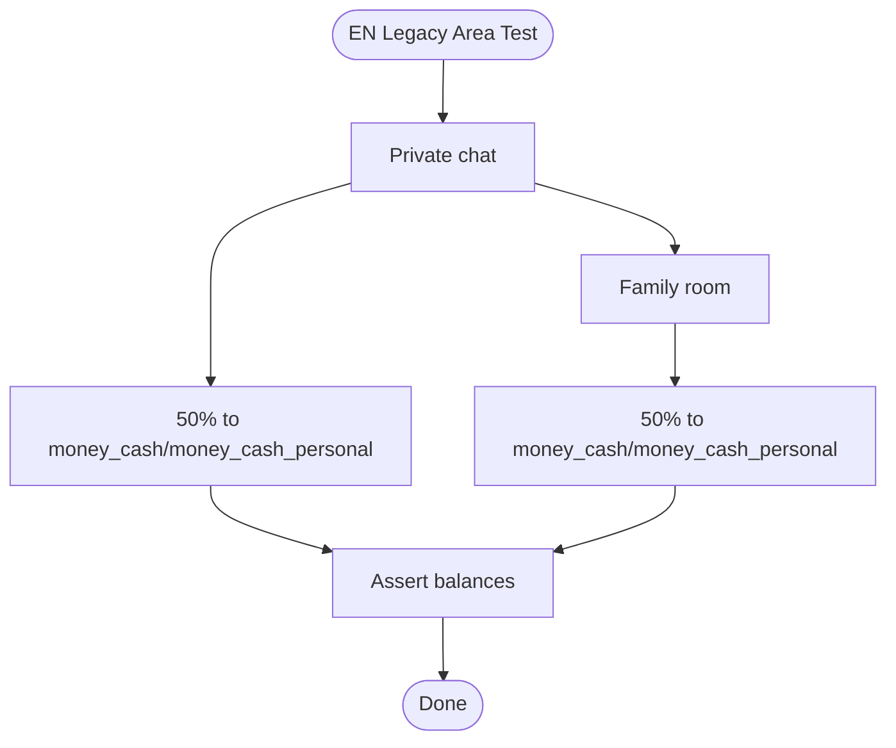

**Diagram sources**
- [test_pt_enArea.py:28-93](file://caseOversea/test_pt_enArea.py#L28-L93)

**Section sources**
- [test_pt_enArea.py:12-18](file://caseOversea/test_pt_enArea.py#L12-L18)
- [test_pt_enArea.py:28-93](file://caseOversea/test_pt_enArea.py#L28-L93)

### Indonesia (ID)
- Focus: Family room and personal room splits; chat splits fixed at 50% regardless of host type.
- Scenarios:
  - Family room gift to non-broker host: 80% to money_cash_personal.
  - Family room box open to non-broker host: 80% to money_cash_personal.
  - Private chat gift to broker host: 50% to money_cash_b.
  - Private chat gift to non-broker host: 50% to money_cash_personal.

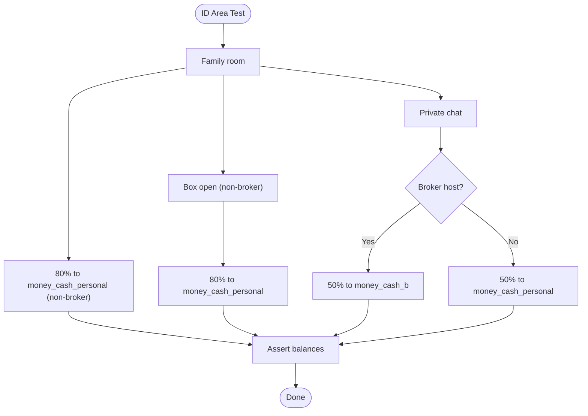

**Diagram sources**
- [test_pt_idArea.py:33-124](file://caseOversea/test_pt_idArea.py#L33-L124)

**Section sources**
- [test_pt_idArea.py:14-20](file://caseOversea/test_pt_idArea.py#L14-L20)
- [test_pt_idArea.py:33-124](file://caseOversea/test_pt_idArea.py#L33-L124)

### Japan (JA)
- Focus: Chat splits vary by broker membership; room splits depend on property and broker status.
- Scenarios:
  - Private chat gift to non-broker host: 70% to money_cash_personal.
  - Private chat box open to broker host: 60% to money_cash_b.
  - Room gift to non-broker host: 70% to money_cash_personal.
  - Room box open to broker host: 60% to money_cash_b.

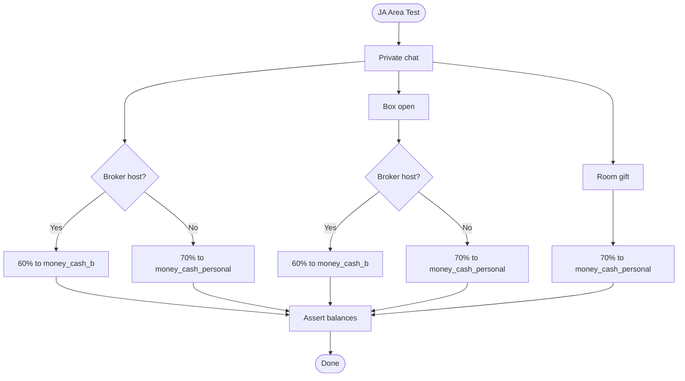

**Diagram sources**
- [test_pt_jaArea.py:28-124](file://caseOversea/test_pt_jaArea.py#L28-L124)

**Section sources**
- [test_pt_jaArea.py:13-18](file://caseOversea/test_pt_jaArea.py#L13-L18)
- [test_pt_jaArea.py:28-124](file://caseOversea/test_pt_jaArea.py#L28-L124)

### Korea (KO) New Area
- Focus: Chat splits by broker membership; family room splits by host type.
- Scenarios:
  - Private chat gift to non-broker host: 75% to money_cash_personal.
  - Private chat gift to broker host: 70% to money_cash_b.
  - Family room gift to broker host: 70% to money_cash_b.
  - Family room box open to non-broker host: 75% to money_cash_personal.

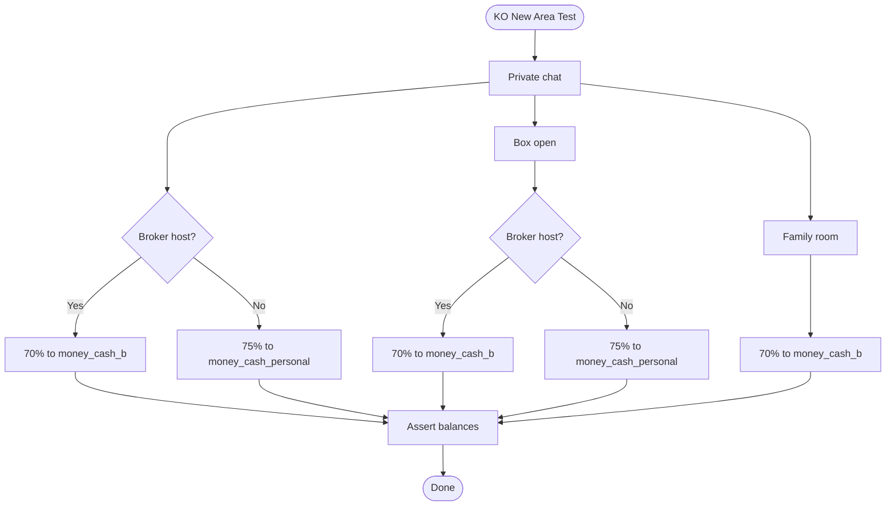

**Diagram sources**
- [test_pt_koNewArea.py:28-121](file://caseOversea/test_pt_koNewArea.py#L28-L121)

**Section sources**
- [test_pt_koNewArea.py:13-18](file://caseOversea/test_pt_koNewArea.py#L13-L18)
- [test_pt_koNewArea.py:28-121](file://caseOversea/test_pt_koNewArea.py#L28-L121)

### Malaysia (MS)
- Status: Region is marked as closed and merged into Indonesia; legacy tests remain for historical reference.
- Scenarios mirror ID patterns but are skipped in current runs.

**Section sources**
- [test_pt_msArea.py:13-20](file://caseOversea/test_pt_msArea.py#L13-L20)
- [test_pt_msArea.py:32-121](file://caseOversea/test_pt_msArea.py#L32-L121)

### Thailand (TH)
- Focus: Union room splits at 80% for non-broker hosts; chat splits vary by host type.
- Scenarios:
  - Union room gift to non-broker host: 80% to money_cash_personal.
  - Union room box open to non-broker host: 80% to money_cash_personal.
  - Private chat gift to broker host: 70% to money_cash_b.
  - Union room gift to broker host: 70% to money_cash_b.
  - Private chat gift to non-broker host: 80% to money_cash_personal.

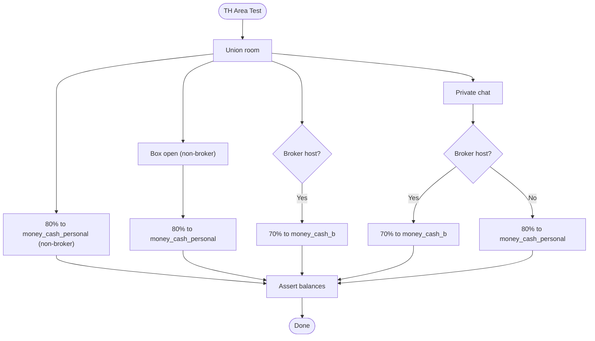

**Diagram sources**
- [test_pt_thArea.py:33-149](file://caseOversea/test_pt_thArea.py#L33-L149)

**Section sources**
- [test_pt_thArea.py:15-19](file://caseOversea/test_pt_thArea.py#L15-L19)
- [test_pt_thArea.py:33-149](file://caseOversea/test_pt_thArea.py#L33-L149)

### Vietnam (VI)
- Focus: Business room non-broker splits at 70%; chat splits at 50%; union/personal room non-broker at 80%; broker splits at 70%.
- Scenarios:
  - Business room gift to non-broker host: 70% to money_cash_personal.
  - Business room box open to non-broker host: 70% to money_cash_personal.
  - Private chat gift to non-broker host: 50% to money_cash_personal.
  - Union/Personal room gift to non-broker host: 80% to money_cash_personal.
  - Business/Union/Personal room gift to broker host: 70% to money_cash_b.
  - Private chat gift to broker host: 50% to money_cash_b.

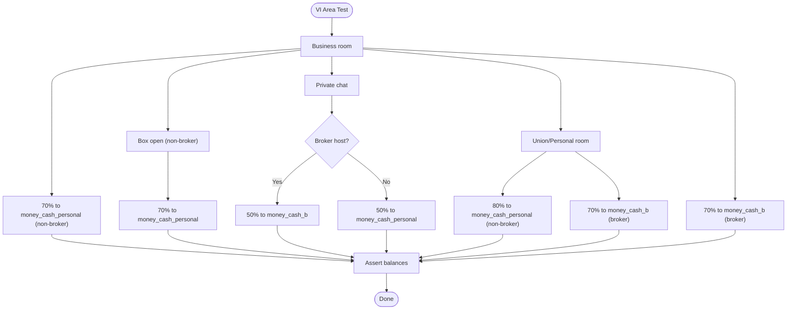

**Diagram sources**
- [test_pt_viArea.py:35-188](file://caseOversea/test_pt_viArea.py#L35-L188)

**Section sources**
- [test_pt_viArea.py:14-24](file://caseOversea/test_pt_viArea.py#L14-L24)
- [test_pt_viArea.py:35-188](file://caseOversea/test_pt_viArea.py#L35-L188)

## Dependency Analysis
- Test modules depend on shared configuration for endpoints and IDs.
- Database helpers centralize SQL operations for balances, room updates, and big area assignments.
- Payload builders standardize request construction across regions.
- Test runner aggregates regional suites and executes them.

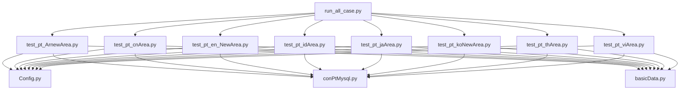

**Diagram sources**
- [run_all_case.py:126-147](file://run_all_case.py#L126-L147)
- [test_pt_ArnewArea.py:1-10](file://caseOversea/test_pt_ArnewArea.py#L1-L10)
- [test_pt_cnArea.py:1-10](file://caseOversea/test_pt_cnArea.py#L1-L10)
- [test_pt_en_NewArea.py:1-10](file://caseOversea/test_pt_en_NewArea.py#L1-L10)
- [test_pt_idArea.py:1-10](file://caseOversea/test_pt_idArea.py#L1-L10)
- [test_pt_jaArea.py:1-10](file://caseOversea/test_pt_jaArea.py#L1-L10)
- [test_pt_koNewArea.py:1-10](file://caseOversea/test_pt_koNewArea.py#L1-L10)
- [test_pt_thArea.py:1-10](file://caseOversea/test_pt_thArea.py#L1-L10)
- [test_pt_viArea.py:1-10](file://caseOversea/test_pt_viArea.py#L1-L10)

**Section sources**
- [run_all_case.py:126-147](file://run_all_case.py#L126-L147)
- [Config.py:96-130](file://common/Config.py#L96-L130)
- [conPtMysql.py:146-171](file://common/conPtMysql.py#L146-L171)
- [basicData.py:327-565](file://common/basicData.py#L327-L565)

## Performance Considerations
- Database operations are executed synchronously; ensure minimal concurrent writes during test runs to avoid contention.
- Room and big area updates are batched per test class; keep test isolation to prevent cross-test interference.
- Payload building and request posting are lightweight; focus on database queries for bottleneck identification.

## Troubleshooting Guide
Common issues and resolutions:
- Incorrect big area or room property:
  - Symptom: Unexpected split ratios.
  - Resolution: Verify big area assignment and room property updates prior to payment.
  - Reference: [conPtMysql.updateUserBigArea:158-170](file://common/conPtMysql.py#L158-L170), [conPtMysql.updateUserRidInfoSql:146-155](file://common/conPtMysql.py#L146-L155)
- Insufficient user balance:
  - Symptom: Payment failure or partial deduction.
  - Resolution: Set balances before each test using [conPtMysql.updateMoneySql:214-225](file://common/conPtMysql.py#L214-L225).
- Wallet destination mismatch:
  - Symptom: Earnings not credited to expected field (money_cash vs. money_cash_personal vs. money_cash_b).
  - Resolution: Confirm host type and room property; consult region-specific scenarios.
- Box open value splits:
  - Symptom: Split does not match declared percentage of box value.
  - Resolution: Ensure box items are inserted and validated via [conPtMysql.insertXsUserBox:253-263](file://common/conPtMysql.py#L253-L263) and compare against latest [conPtMysql.selectUserInfoSql:50-59](file://common/conPtMysql.py#L50-L59) record.
- Redis cache invalidation:
  - Symptom: Stale big area cache affecting routing.
  - Resolution: Clear big area keys after setup using Redis helpers if applicable.

**Section sources**
- [conPtMysql.py:146-171](file://common/conPtMysql.py#L146-L171)
- [conPtMysql.py:214-225](file://common/conPtMysql.py#L214-L225)
- [conPtMysql.py:253-263](file://common/conPtMysql.py#L253-L263)
- [conPtMysql.py:50-59](file://common/conPtMysql.py#L50-L59)

## Conclusion
The regional area testing suite provides comprehensive coverage of payment flows across PT Overseas markets. By leveraging shared configuration, database helpers, and payload builders, each region’s unique splitting rules, localization nuances, and business logic are validated consistently. Adhering to the setup procedures, expected outcomes, and troubleshooting steps outlined here ensures reliable regional payment processing validation.

## Appendices

### Setup Procedures
- Environment:
  - Select target application (PT Overseas) and ensure endpoints are configured in [Config.py:47-55](file://common/Config.py#L47-L55).
- User and room preparation:
  - Assign big area IDs and room properties using [conPtMysql.updateUserBigArea:158-170](file://common/conPtMysql.py#L158-L170) and [conPtMysql.updateUserRidInfoSql:146-155](file://common/conPtMysql.py#L146-L155).
  - Fund test accounts with required balances via [conPtMysql.updateMoneySql:214-225](file://common/conPtMysql.py#L214-L225).
- Payload construction:
  - Build standardized payloads using [basicData.encodePtData:327-565](file://common/basicData.py#L327-L565) with appropriate payType and parameters.
- Execution:
  - Run regional suites via [run_all_case.py:126-147](file://run_all_case.py#L126-L147) to discover and execute all test_*.py files under caseOversea.

**Section sources**
- [Config.py:47-55](file://common/Config.py#L47-L55)
- [conPtMysql.py:146-171](file://common/conPtMysql.py#L146-L171)
- [conPtMysql.py:214-225](file://common/conPtMysql.py#L214-L225)
- [basicData.py:327-565](file://common/basicData.py#L327-L565)
- [run_all_case.py:126-147](file://run_all_case.py#L126-L147)

### Regional Test Scenarios Index
- Argentina (AR):
  - New area: [test_pt_ArnewArea.py:33-166](file://caseOversea/test_pt_ArnewArea.py#L33-L166)
  - Legacy area: [test_pt_arArea.py:31-119](file://caseOversea/test_pt_arArea.py#L31-L119)
- China (CN): [test_pt_cnArea.py:35-192](file://caseOversea/test_pt_cnArea.py#L35-L192)
- England (EN):
  - New area: [test_pt_en_NewArea.py:28-166](file://caseOversea/test_pt_en_NewArea.py#L28-L166)
  - Legacy area: [test_pt_enArea.py:28-93](file://caseOversea/test_pt_enArea.py#L28-L93)
- Indonesia (ID): [test_pt_idArea.py:33-124](file://caseOversea/test_pt_idArea.py#L33-L124)
- Japan (JA): [test_pt_jaArea.py:28-124](file://caseOversea/test_pt_jaArea.py#L28-L124)
- Korea (KO): [test_pt_koNewArea.py:28-121](file://caseOversea/test_pt_koNewArea.py#L28-L121)
- Malaysia (MS): [test_pt_msArea.py:32-121](file://caseOversea/test_pt_msArea.py#L32-L121)
- Thailand (TH): [test_pt_thArea.py:33-149](file://caseOversea/test_pt_thArea.py#L33-L149)
- Vietnam (VI): [test_pt_viArea.py:35-188](file://caseOversea/test_pt_viArea.py#L35-L188)