# Specialized Payment Scenarios

<cite>
**Referenced Files in This Document**
- [test_pt_bean.py](file://caseOversea/test_pt_bean.py)
- [test_pt_blind.py](file://caseOversea/test_pt_blind.py)
- [test_pt_crazySpin.py](file://caseOversea/test_pt_crazySpin.py)
- [test_pt_defend.py](file://caseOversea/test_pt_defend.py)
- [test_pt_openBox.py](file://caseOversea/test_pt_openBox.py)
- [test_pt_package.py](file://caseOversea/test_pt_package.py)
- [test_pt_planet.py](file://caseOversea/test_pt_planet.py)
- [test_pt_shopBuy.py](file://caseOversea/test_pt_shopBuy.py)
- [test_pt_vipRenqi.py](file://caseOversea/test_pt_vipRenqi.py)
- [Crazyspin.py](file://common/Crazyspin.py)
- [basicData.py](file://common/basicData.py)
- [conPtMysql.py](file://common/conPtMysql.py)
- [Config.py](file://common/Config.py)
- [Request.py](file://common/Request.py)
- [Consts.py](file://common/Consts.py)
</cite>

## Table of Contents
1. [Introduction](#introduction)
2. [Project Structure](#project-structure)
3. [Core Components](#core-components)
4. [Architecture Overview](#architecture-overview)
5. [Detailed Component Analysis](#detailed-component-analysis)
6. [Dependency Analysis](#dependency-analysis)
7. [Performance Considerations](#performance-considerations)
8. [Troubleshooting Guide](#troubleshooting-guide)
9. [Conclusion](#conclusion)

## Introduction
This document describes specialized PT Overseas payment scenarios validated by automated test suites. It focuses on bean transactions, blind box operations, crazy spin games, defensive systems, box opening mechanics, package purchases, planet exploration features, shop buying processes, and VIP ranking systems. For each scenario, we outline payment flows, validation requirements, expected behaviors, edge cases, and integration patterns with regional markets. The document also includes troubleshooting guidance for complex payment chains and multi-step transaction validations.

## Project Structure
The repository organizes overseas payment tests under the caseOversea directory, with shared utilities in common. Each scenario is implemented as a unit test class with setup/teardown hooks to prepare database state and validate outcomes against database assertions.

```mermaid
graph TB
subgraph "Case Oversea"
TBean["test_pt_bean.py"]
TBlind["test_pt_blind.py"]
TCrazy["test_pt_crazySpin.py"]
TDefend["test_pt_defend.py"]
TOpenBox["test_pt_openBox.py"]
TPackage["test_pt_package.py"]
TPlanet["test_pt_planet.py"]
TShop["test_pt_shopBuy.py"]
TVip["test_pt_vipRenqi.py"]
end
subgraph "Common Utilities"
BData["basicData.py"]
Mysql["conPtMysql.py"]
Cfg["Config.py"]
Req["Request.py"]
Consts["Consts.py"]
CS["Crazyspin.py"]
end
TBean --> BData
TBlind --> BData
TCrazy --> BData
TDefend --> BData
TOpenBox --> BData
TPackage --> BData
TPlanet --> BData
TShop --> BData
TVip --> BData
TBean --> Mysql
TBlind --> Mysql
TCrazy --> Mysql
TDefend --> Mysql
TOpenBox --> Mysql
TPackage --> Mysql
TPlanet --> Mysql
TShop --> Mysql
TVip --> Mysql
TBean --> Cfg
TBlind --> Cfg
TCrazy --> Cfg
TDefend --> Cfg
TOpenBox --> Cfg
TPackage --> Cfg
TPlanet --> Cfg
TShop --> Cfg
TVip --> Cfg
TCrazy --> CS
TBean --> Req
TBlind --> Req
TCrazy --> Req
TDefend --> Req
TOpenBox --> Req
TPackage --> Req
TPlanet --> Req
TShop --> Req
TVip --> Req
```

**Diagram sources**
- [test_pt_bean.py:1-38](file://caseOversea/test_pt_bean.py#L1-L38)
- [test_pt_blind.py:1-88](file://caseOversea/test_pt_blind.py#L1-L88)
- [test_pt_crazySpin.py:1-74](file://caseOversea/test_pt_crazySpin.py#L1-L74)
- [test_pt_defend.py:1-65](file://caseOversea/test_pt_defend.py#L1-L65)
- [test_pt_openBox.py:1-133](file://caseOversea/test_pt_openBox.py#L1-L133)
- [test_pt_package.py:1-65](file://caseOversea/test_pt_package.py#L1-L65)
- [test_pt_planet.py:1-39](file://caseOversea/test_pt_planet.py#L1-L39)
- [test_pt_shopBuy.py:1-58](file://caseOversea/test_pt_shopBuy.py#L1-L58)
- [test_pt_vipRenqi.py:1-70](file://caseOversea/test_pt_vipRenqi.py#L1-L70)
- [basicData.py:327-566](file://common/basicData.py#L327-L566)
- [conPtMysql.py:1-345](file://common/conPtMysql.py#L1-L345)
- [Config.py:1-133](file://common/Config.py#L1-L133)
- [Request.py:17-59](file://common/Request.py#L17-L59)
- [Consts.py:1-17](file://common/Consts.py#L1-L17)
- [Crazyspin.py:1-98](file://common/Crazyspin.py#L1-L98)

**Section sources**
- [test_pt_bean.py:1-38](file://caseOversea/test_pt_bean.py#L1-L38)
- [test_pt_blind.py:1-88](file://caseOversea/test_pt_blind.py#L1-L88)
- [test_pt_crazySpin.py:1-74](file://caseOversea/test_pt_crazySpin.py#L1-L74)
- [test_pt_defend.py:1-65](file://caseOversea/test_pt_defend.py#L1-L65)
- [test_pt_openBox.py:1-133](file://caseOversea/test_pt_openBox.py#L1-L133)
- [test_pt_package.py:1-65](file://caseOversea/test_pt_package.py#L1-L65)
- [test_pt_planet.py:1-39](file://caseOversea/test_pt_planet.py#L1-L39)
- [test_pt_shopBuy.py:1-58](file://caseOversea/test_pt_shopBuy.py#L1-L58)
- [test_pt_vipRenqi.py:1-70](file://caseOversea/test_pt_vipRenqi.py#L1-L70)
- [basicData.py:327-566](file://common/basicData.py#L327-L566)
- [conPtMysql.py:1-345](file://common/conPtMysql.py#L1-L345)
- [Config.py:1-133](file://common/Config.py#L1-L133)
- [Request.py:17-59](file://common/Request.py#L17-L59)
- [Consts.py:1-17](file://common/Consts.py#L1-L17)
- [Crazyspin.py:1-98](file://common/Crazyspin.py#L1-L98)

## Core Components
- Payment request encoder: Encodes scenario-specific payloads for PT Overseas payments via a unified encoder that supports package purchases, chat gifts, shop buys, box opens, exchanges, defends, crazy spin actions, and planet draws.
- Database preparation and assertions: Prepares user balances, inventory, and room/area metadata, then asserts post-payment outcomes in the database.
- Request orchestration: Issues HTTPS POST requests with standardized headers and token retrieval.
- Regional configuration: Centralizes host URLs, user IDs, room IDs, and gift IDs for PT Overseas markets.

Key responsibilities:
- Encode payment payloads per scenario (package, shop-buy, shop-buy-box, coin-shop-buy, exchange_gold, defend, shop-buy-crazyspin, play-crazyspin, journey_planet_draw).
- Prepare test data (balances, commodities, boxes, rooms, big areas).
- Invoke payment endpoints and validate HTTP status and JSON body fields.
- Verify database state changes (balances, commodity counts, pay change records, popularity, VIP metrics).

**Section sources**
- [basicData.py:327-566](file://common/basicData.py#L327-L566)
- [conPtMysql.py:25-92](file://common/conPtMysql.py#L25-L92)
- [Request.py:17-59](file://common/Request.py#L17-L59)
- [Config.py:47-133](file://common/Config.py#L47-L133)

## Architecture Overview
The payment flow follows a consistent pattern across scenarios:
- Prepare test data via database helpers.
- Construct payload using the PT encoder.
- Post to the payment endpoint with session tokens.
- Validate response and database state.

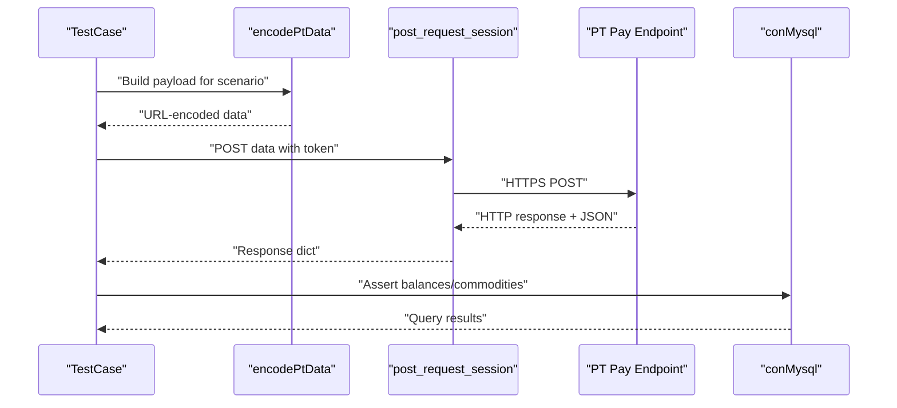

**Diagram sources**
- [basicData.py:327-566](file://common/basicData.py#L327-L566)
- [Request.py:17-59](file://common/Request.py#L17-L59)
- [conPtMysql.py:25-92](file://common/conPtMysql.py#L25-L92)

## Detailed Component Analysis

### Bean Transactions (Balance Exchange to Gold Coins)
- Purpose: Convert wallet balance to gold coins.
- Flow:
  - Set user money to a known value.
  - Encode exchange payload.
  - Post to payment endpoint.
  - Assert success and verify new gold coin balance and cleared money.
- Validation:
  - HTTP success code.
  - Body indicates success.
  - Database checks for zero money and expected gold coin amount.
- Edge cases:
  - Insufficient money handled by prior setup; ensure money is set before exchange.
- Regional integration:
  - Uses PT host and user IDs configured for oversea markets.

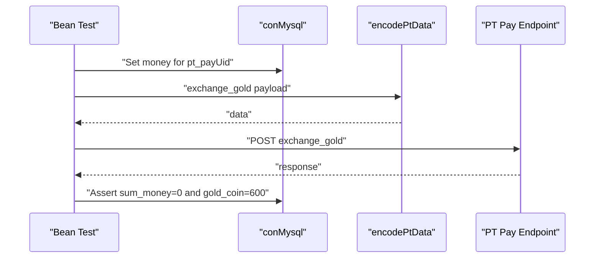

**Diagram sources**
- [test_pt_bean.py:19-37](file://caseOversea/test_pt_bean.py#L19-L37)
- [basicData.py:493-502](file://common/basicData.py#L493-L502)
- [conPtMysql.py:25-49](file://common/conPtMysql.py#L25-L49)

**Section sources**
- [test_pt_bean.py:1-38](file://caseOversea/test_pt_bean.py#L1-L38)
- [basicData.py:493-502](file://common/basicData.py#L493-L502)
- [conPtMysql.py:25-49](file://common/conPtMysql.py#L25-L49)

### Blind Box Operations (Room Gift and Multi-Person Distribution)
- Purpose: Send blind boxes in rooms, single and multi-user modes.
- Flow:
  - Update wallets and clear non-broadcaster money extension.
  - Encode package/package-more payloads with blind box gift IDs.
  - Post to payment endpoint.
  - Assert success and recipient personal cash increases.
- Validation:
  - HTTP success code and success body flag.
  - Recipient personal cash equals expected increments.
  - Pay change record matches personal cash increase.
- Edge cases:
  - Multi-user distribution scales cost and quantities accordingly.
  - Room type and area IDs configured for oversea regions.

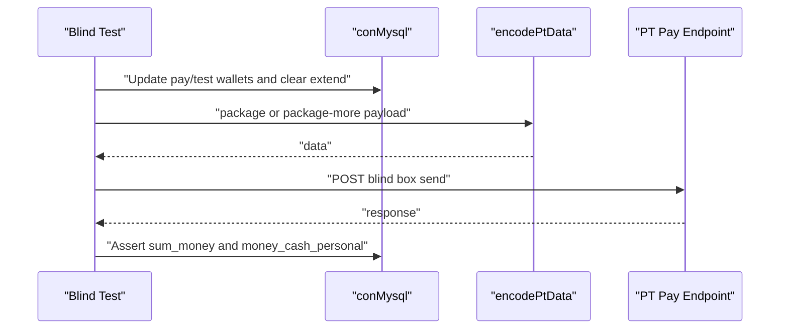

**Diagram sources**
- [test_pt_blind.py:30-57](file://caseOversea/test_pt_blind.py#L30-L57)
- [test_pt_blind.py:59-87](file://caseOversea/test_pt_blind.py#L59-L87)
- [basicData.py:332-390](file://common/basicData.py#L332-L390)
- [conPtMysql.py:77-84](file://common/conPtMysql.py#L77-L84)

**Section sources**
- [test_pt_blind.py:1-88](file://caseOversea/test_pt_blind.py#L1-L88)
- [basicData.py:332-390](file://common/basicData.py#L332-L390)
- [conPtMysql.py:77-84](file://common/conPtMysql.py#L77-L84)

### Crazy Spin Games (Purchase Tickets and Play)
- Purpose: Purchase turntable tickets with diamonds and draw rewards.
- Flow:
  - Clear commodity and set money.
  - Call crazy spin buy endpoint builder and post payload.
  - Optionally prepare turntable list/horn before play.
  - Post play payload and verify commodity adjustments.
- Validation:
  - HTTP success code and success body flag.
  - Diamond balance decremented by ticket cost × count.
  - Commodity count reflects purchased tickets.
- Edge cases:
  - Play scenario currently skipped pending backend service.

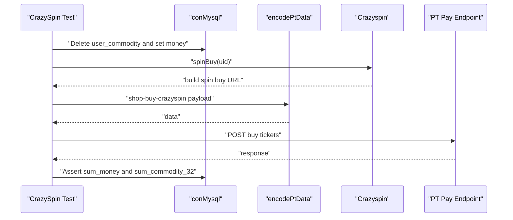

**Diagram sources**
- [test_pt_crazySpin.py:16-40](file://caseOversea/test_pt_crazySpin.py#L16-L40)
- [test_pt_crazySpin.py:42-73](file://caseOversea/test_pt_crazySpin.py#L42-L73)
- [Crazyspin.py:10-25](file://common/Crazyspin.py#L10-L25)
- [basicData.py:518-535](file://common/basicData.py#L518-L535)
- [conPtMysql.py:61-76](file://common/conPtMysql.py#L61-L76)

**Section sources**
- [test_pt_crazySpin.py:1-74](file://caseOversea/test_pt_crazySpin.py#L1-L74)
- [Crazyspin.py:1-98](file://common/Crazyspin.py#L1-L98)
- [basicData.py:518-535](file://common/basicData.py#L518-L535)
- [conPtMysql.py:61-76](file://common/conPtMysql.py#L61-L76)

### Defensive Systems (Personal Guard Subscription)
- Purpose: Subscribe to personal guard with revenue split configurations.
- Flow:
  - Set payer money and clear recipient extend balance.
  - Encode defend payload with target UID.
  - Post to payment endpoint.
  - Assert payer balance cleared and recipient receives split.
- Validation:
  - Payer money equals zero after subscription.
  - Recipient personal cash equals subscription amount × split ratio.
- Edge cases:
  - Split ratios differ for non-broadcaster vs broadcaster recipients.

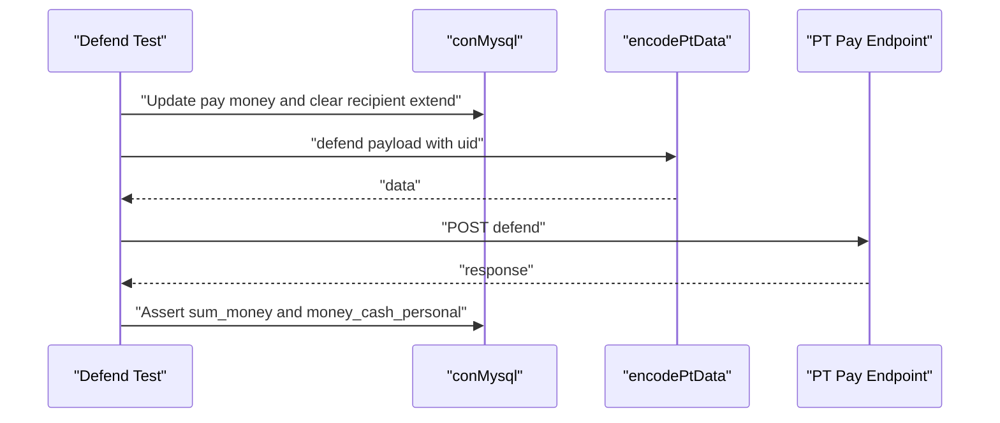

**Diagram sources**
- [test_pt_defend.py:23-43](file://caseOversea/test_pt_defend.py#L23-L43)
- [test_pt_defend.py:45-64](file://caseOversea/test_pt_defend.py#L45-L64)
- [basicData.py:503-517](file://common/basicData.py#L503-L517)
- [conPtMysql.py:77-84](file://common/conPtMysql.py#L77-L84)

**Section sources**
- [test_pt_defend.py:1-65](file://caseOversea/test_pt_defend.py#L1-L65)
- [basicData.py:503-517](file://common/basicData.py#L503-L517)
- [conPtMysql.py:77-84](file://common/conPtMysql.py#L77-L84)

### Box Opening Mechanics (Shop Buy Boxes and Room Gifts)
- Purpose: Open copper/silver boxes from inventory and distribute as gifts.
- Flow:
  - Clear user commodity/box tables and insert target box items.
  - Insert box refresh data and set money.
  - Encode shop-buy-box payload with quantity and box type.
  - Post to payment endpoint.
  - Assert balance reduction and commodity increments.
- Validation:
  - HTTP success code and success body flag.
  - Sum money reduced by price × quantity.
  - Sum commodity increased by quantity.
- Edge cases:
  - Multi-open scenarios scale costs and quantities.
  - Room gift variants send boxes to recipients with personal cash increases.

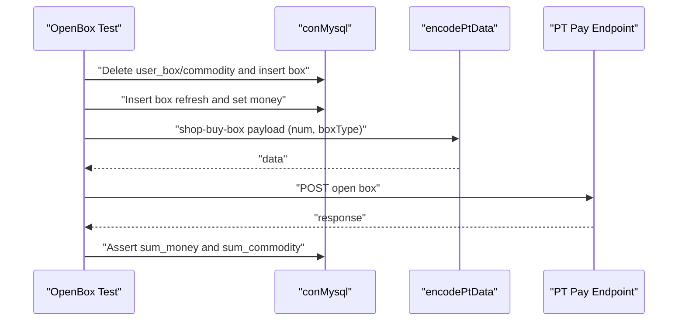

**Diagram sources**
- [test_pt_openBox.py:23-49](file://caseOversea/test_pt_openBox.py#L23-L49)
- [test_pt_openBox.py:51-81](file://caseOversea/test_pt_openBox.py#L51-L81)
- [test_pt_openBox.py:83-105](file://caseOversea/test_pt_openBox.py#L83-L105)
- [test_pt_openBox.py:107-132](file://caseOversea/test_pt_openBox.py#L107-L132)
- [basicData.py:458-477](file://common/basicData.py#L458-L477)
- [conPtMysql.py:61-76](file://common/conPtMysql.py#L61-L76)

**Section sources**
- [test_pt_openBox.py:1-133](file://caseOversea/test_pt_openBox.py#L1-L133)
- [basicData.py:458-477](file://common/basicData.py#L458-L477)
- [conPtMysql.py:61-76](file://common/conPtMysql.py#L61-L76)

### Package Purchases (Room One-on-One and Multi-Person)
- Purpose: Room gift transactions with insufficient funds and proper splits.
- Flow:
  - Clear both payer and payee accounts for baseline.
  - Encode package payload for room gift.
  - Post to payment endpoint.
  - Assert failure message for insufficient funds and zero payee balance.
- Validation:
  - HTTP success code and failure body flag with region-specific message.
  - Payee balance remains zero.
- Edge cases:
  - Sufficient funds variant ensures payee receives split and payer balance adjusted.

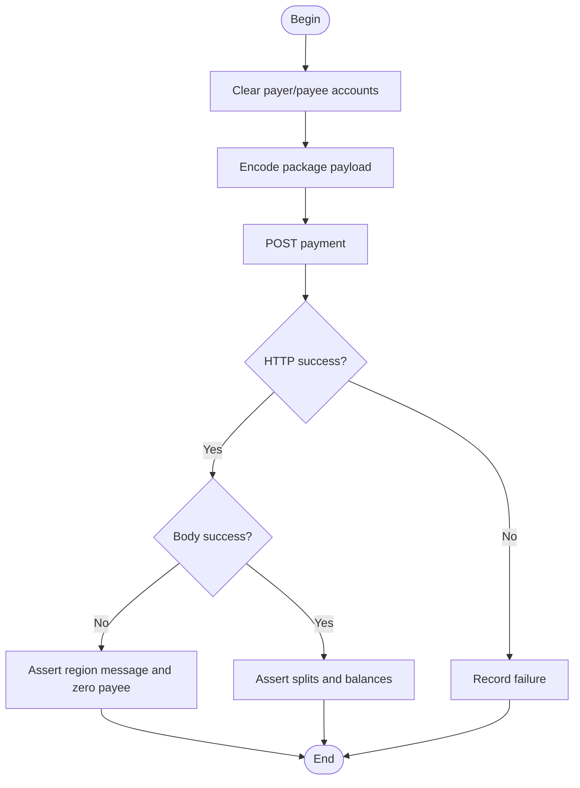

**Diagram sources**
- [test_pt_package.py:25-43](file://caseOversea/test_pt_package.py#L25-L43)
- [test_pt_package.py:45-64](file://caseOversea/test_pt_package.py#L45-L64)
- [basicData.py:332-357](file://common/basicData.py#L332-L357)
- [conPtMysql.py:77-84](file://common/conPtMysql.py#L77-L84)

**Section sources**
- [test_pt_package.py:1-65](file://caseOversea/test_pt_package.py#L1-L65)
- [basicData.py:332-357](file://common/basicData.py#L332-L357)
- [conPtMysql.py:77-84](file://common/conPtMysql.py#L77-L84)

### Planet Exploration Features (Journey Planet Draw)
- Purpose: Deduct diamonds for a draw action and receive rewards.
- Flow:
  - Clear commodity and journey planet records.
  - Set money and encode journey_planet_draw payload.
  - Post to payment endpoint.
  - Assert diamond balance reduction and commodity gain.
- Validation:
  - HTTP success code and success body flag.
  - Sum money reflects draw cost.
  - Sum commodity reflects received item.
- Edge cases:
  - Test currently skipped pending feature fix.

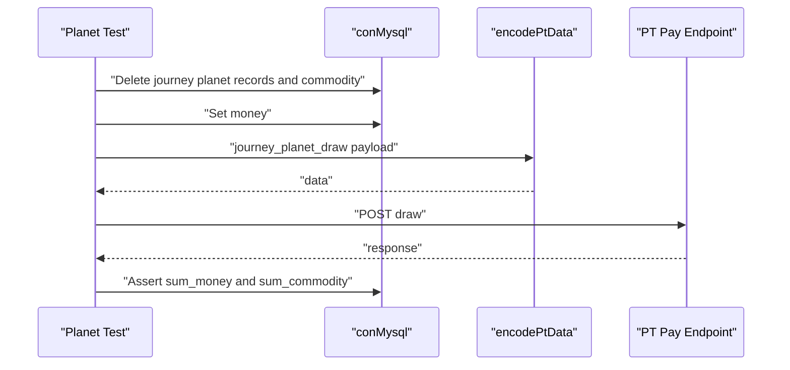

**Diagram sources**
- [test_pt_planet.py:14-38](file://caseOversea/test_pt_planet.py#L14-L38)
- [basicData.py:543-555](file://common/basicData.py#L543-L555)
- [conPtMysql.py:61-76](file://common/conPtMysql.py#L61-L76)

**Section sources**
- [test_pt_planet.py:1-39](file://caseOversea/test_pt_planet.py#L1-L39)
- [basicData.py:543-555](file://common/basicData.py#L543-L555)
- [conPtMysql.py:61-76](file://common/conPtMysql.py#L61-L76)

### Shop Buying Processes (Diamonds and Gold Coins)
- Purpose: Purchase items with diamonds and gold coins.
- Flow:
  - Set money and clear commodity.
  - Encode shop-buy or coin-shop-buy payloads with item CID and quantity.
  - Post to payment endpoint.
  - Assert balance reductions and commodity additions.
- Validation:
  - HTTP success code and success body flag.
  - Diamond/gold coin balances reflect purchase cost.
  - Commodity count reflects purchased items.
- Edge cases:
  - Different money types (money vs gold_coin) require correct payload selection.

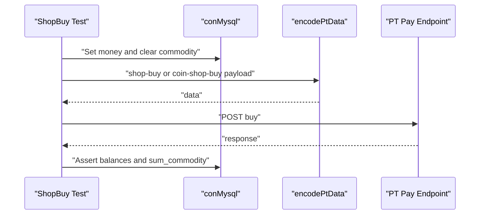

**Diagram sources**
- [test_pt_shopBuy.py:13-34](file://caseOversea/test_pt_shopBuy.py#L13-L34)
- [test_pt_shopBuy.py:36-57](file://caseOversea/test_pt_shopBuy.py#L36-L57)
- [basicData.py:441-492](file://common/basicData.py#L441-L492)
- [conPtMysql.py:61-76](file://common/conPtMysql.py#L61-L76)

**Section sources**
- [test_pt_shopBuy.py:1-58](file://caseOversea/test_pt_shopBuy.py#L1-L58)
- [basicData.py:441-492](file://common/basicData.py#L441-L492)
- [conPtMysql.py:61-76](file://common/conPtMysql.py#L61-L76)

### VIP Ranking Systems (Room and Chat Gift Impact)
- Purpose: Validate VIP pay_room_money accumulation and recipient popularity gains.
- Flow:
  - Set money and reset VIP pay_room_money and recipient popularity.
  - Encode package or chat-gift payload.
  - Post to payment endpoint.
  - Assert VIP accumulation and popularity increment.
- Validation:
  - Payer VIP pay_room_money updated.
  - Recipient popularity incremented by expected amount.
- Edge cases:
  - No noble relationship and no acceleration modifiers assumed.

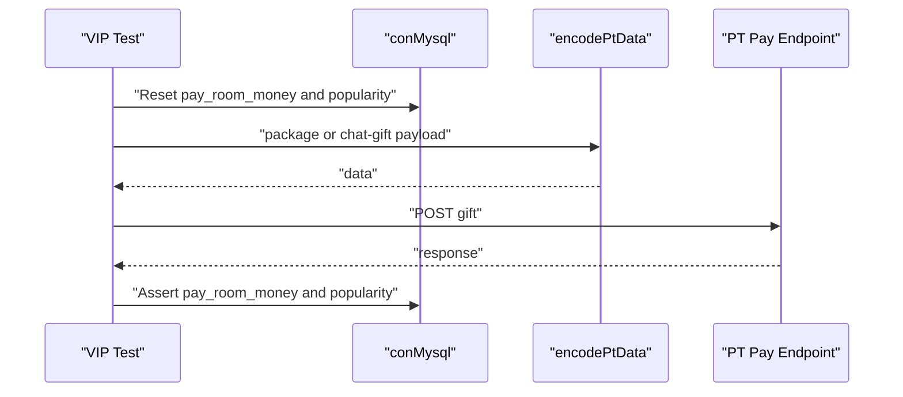

**Diagram sources**
- [test_pt_vipRenqi.py:21-44](file://caseOversea/test_pt_vipRenqi.py#L21-L44)
- [test_pt_vipRenqi.py:46-69](file://caseOversea/test_pt_vipRenqi.py#L46-L69)
- [basicData.py:332-357](file://common/basicData.py#L332-L357)
- [conPtMysql.py:294-344](file://common/conPtMysql.py#L294-L344)

**Section sources**
- [test_pt_vipRenqi.py:1-70](file://caseOversea/test_pt_vipRenqi.py#L1-L70)
- [basicData.py:332-357](file://common/basicData.py#L332-L357)
- [conPtMysql.py:294-344](file://common/conPtMysql.py#L294-L344)

## Dependency Analysis
Payment scenarios depend on:
- Payload encoding for PT Overseas (scenario-specific params).
- Database helpers for pre/post conditions.
- Request orchestration with session tokens.
- Regional configuration for hosts, UIDs, room IDs, and gift IDs.

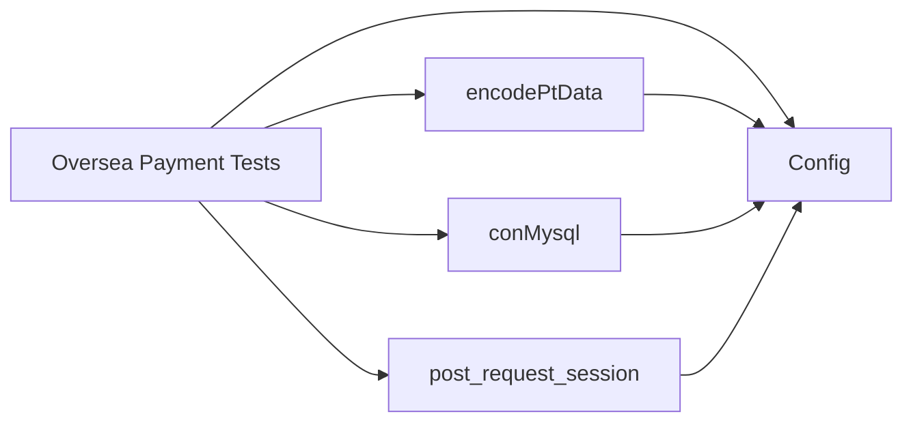

**Diagram sources**
- [basicData.py:327-566](file://common/basicData.py#L327-L566)
- [conPtMysql.py:1-345](file://common/conPtMysql.py#L1-L345)
- [Request.py:17-59](file://common/Request.py#L17-L59)
- [Config.py:1-133](file://common/Config.py#L1-L133)

**Section sources**
- [basicData.py:327-566](file://common/basicData.py#L327-L566)
- [conPtMysql.py:1-345](file://common/conPtMysql.py#L1-L345)
- [Request.py:17-59](file://common/Request.py#L17-L59)
- [Config.py:1-133](file://common/Config.py#L1-L133)

## Performance Considerations
- Network latency: Requests disable SSL verification and use connection close; ensure stable network for reliable timings.
- Batch operations: Multi-person blind box and box opens scale costs linearly; monitor DB commit performance during teardown.
- Asynchronous updates: VIP popularity and task-driven metrics may require short sleeps before assertions.

## Troubleshooting Guide
Common issues and resolutions:
- Payment fails with insufficient funds:
  - Ensure payer money is set appropriately before package purchase tests.
  - Confirm room gift payload parameters (rid, giftId, num).
- Blind box recipients not receiving funds:
  - Verify non-broadcaster money extension is cleared before sending.
  - Confirm recipient UID and room ID match oversea configuration.
- Crazy spin play not supported:
  - Play scenario is skipped pending backend service; focus on buy flow.
- Box opening yields unexpected commodity counts:
  - Validate box type and quantity parameters in payload.
  - Ensure box refresh entries exist for the user.
- VIP popularity not updating immediately:
  - Allow short delay for task-driven updates before asserting.
- Planet draw skipped:
  - Feature under maintenance; re-enable when fixed.

Operational tips:
- Use database helpers to reset state before each test.
- Log response bodies and status codes for failed requests.
- Validate regional configuration keys (host, UIDs, room IDs, gift IDs) align with target market.

**Section sources**
- [test_pt_package.py:25-43](file://caseOversea/test_pt_package.py#L25-L43)
- [test_pt_blind.py:30-57](file://caseOversea/test_pt_blind.py#L30-L57)
- [test_pt_crazySpin.py:42-73](file://caseOversea/test_pt_crazySpin.py#L42-L73)
- [test_pt_openBox.py:23-49](file://caseOversea/test_pt_openBox.py#L23-L49)
- [test_pt_vipRenqi.py:42-43](file://caseOversea/test_pt_vipRenqi.py#L42-L43)
- [test_pt_planet.py:11-11](file://caseOversea/test_pt_planet.py#L11-L11)

## Conclusion
These specialized PT Overseas payment scenarios demonstrate robust validation of bean exchanges, blind box distributions, crazy spin mechanics, defensive subscriptions, box openings, room and chat purchases, planet draws, shop buys, and VIP metrics. The modular design leverages a unified payload encoder, centralized configuration, and database-driven assertions to ensure correctness across regional markets. The troubleshooting guide and performance notes help maintain reliability in complex, multi-step payment chains.