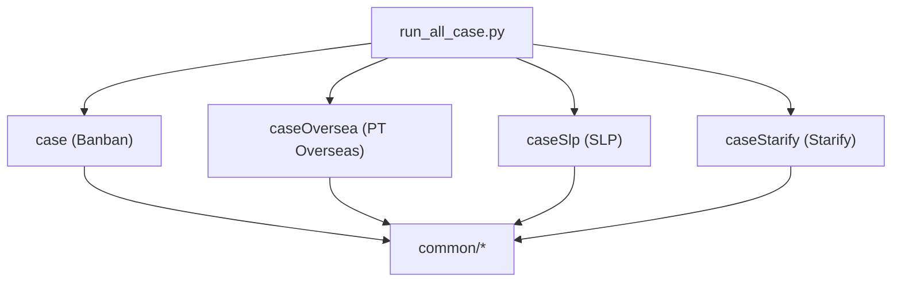
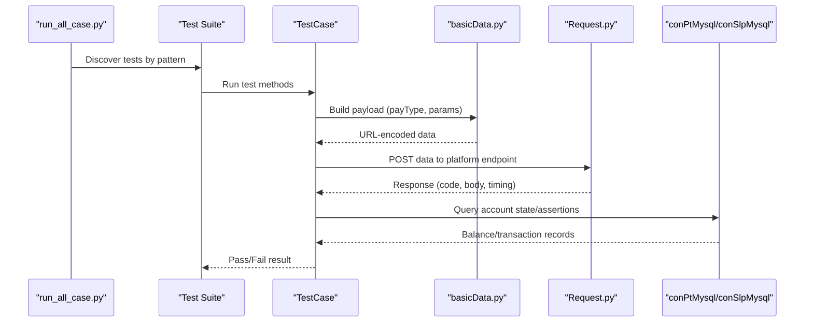
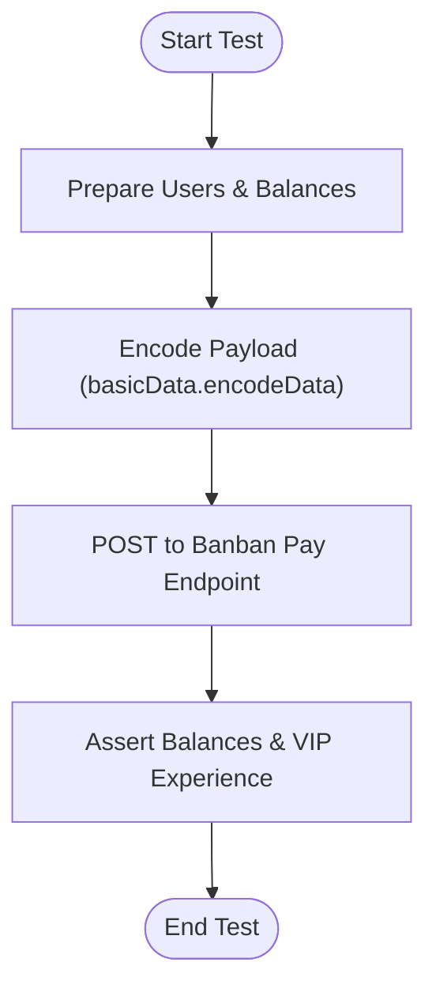
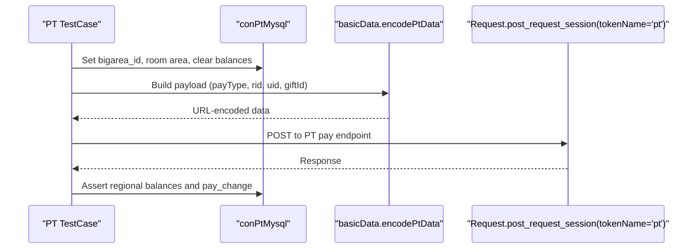
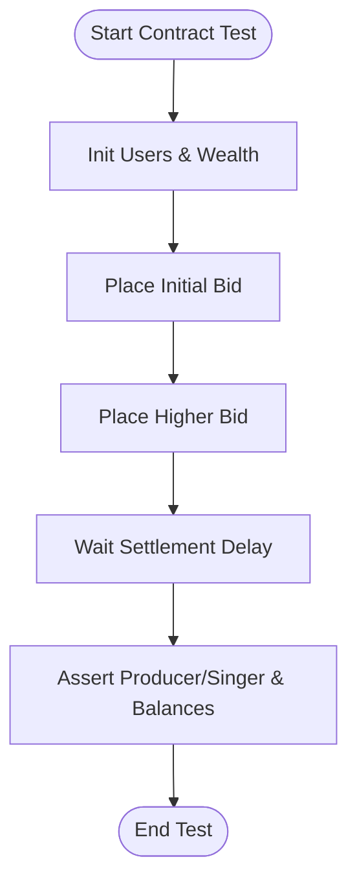
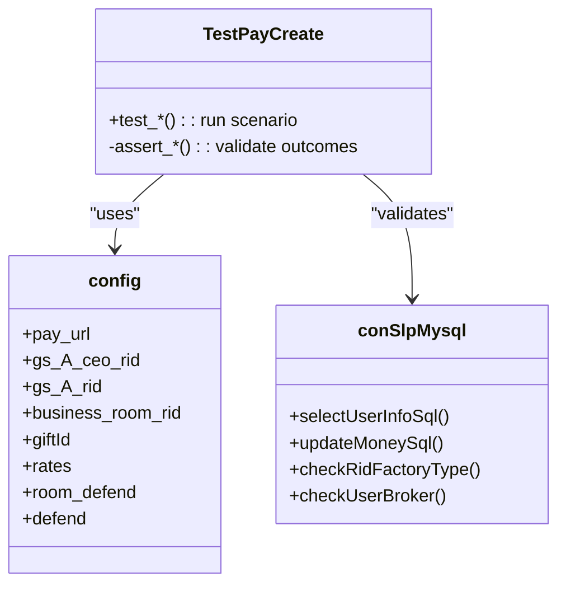
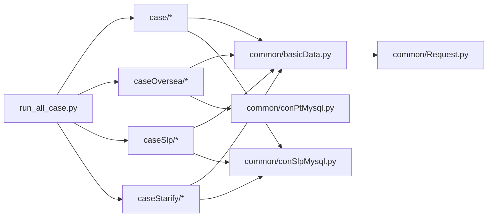

# Platform-Specific Testing

<cite>
**Referenced Files in This Document**
- [README.md](file://README.md)
- [run_all_case.py](file://run_all_case.py)
- [common/Config.py](file://common/Config.py)
- [common/Consts.py](file://common/Consts.py)
- [common/Basic.yml](file://common/Basic.yml)
- [common/Request.py](file://common/Request.py)
- [common/basicData.py](file://common/basicData.py)
- [common/conPtMysql.py](file://common/conPtMysql.py)
- [common/conSlpMysql.py](file://common/conSlpMysql.py)
- [case/test_pay_business.py](file://case/test_pay_business.py)
- [caseOversea/test_pt_cnArea.py](file://caseOversea/test_pt_cnArea.py)
- [caseSlp/test_gs_room.py](file://caseSlp/test_gs_room.py)
- [caseSlp/config.py](file://caseSlp/config.py)
- [caseStarify/test_starify_contractPay.py](file://caseStarify/test_starify_contractPay.py)
- [caseStarify/tools.py](file://caseStarify/tools.py)
</cite>

## Table of Contents
1. [Introduction](#introduction)
2. [Project Structure](#project-structure)
3. [Core Components](#core-components)
4. [Architecture Overview](#architecture-overview)
5. [Detailed Component Analysis](#detailed-component-analysis)
6. [Dependency Analysis](#dependency-analysis)
7. [Performance Considerations](#performance-considerations)
8. [Troubleshooting Guide](#troubleshooting-guide)
9. [Conclusion](#conclusion)

## Introduction
This document explains platform-specific testing capabilities across three major gaming platforms supported by the repository:
- Banban (domestic): Room payments, gifts, shop transactions, room defenses, and related business flows.
- PT Overseas (regional): Multi-area coverage (CN, EN, AR, ID, VI, TH, MS, KO) with regional variants and multi-currency support.
- Starify: Specialized contract and auction payment scenarios.
- SLP Sleepless Planet: Advanced features including guild rooms, room defenses, personal defenses, and special box mechanics.

It covers configuration requirements, authentication methods, regional differences, and practical execution patterns for each platform.

## Project Structure
The repository organizes tests by platform under dedicated directories:
- case: Banban domestic tests.
- caseOversea: PT Overseas regional tests.
- caseSlp: SLP advanced features.
- caseStarify: Starify contract and auction tests.
- common: Shared utilities for configuration, HTTP requests, database access, and data encoding.

**Diagram sources**
- [run_all_case.py:126-147](file://run_all_case.py#L126-L147)

**Section sources**
- [README.md:31-38](file://README.md#L31-L38)
- [run_all_case.py:126-147](file://run_all_case.py#L126-L147)

## Core Components
- Configuration and constants: Centralized platform endpoints, user IDs, gift IDs, and room IDs.
- Request abstraction: Unified HTTP client with token injection per platform.
- Data encoding: Payload builders for each platform’s payment scenarios.
- Database access: MySQL wrappers to prepare and validate test accounts and balances.

Key responsibilities:
- config.py: Host URLs, user IDs, gift IDs, room IDs, and platform-specific endpoints.
- Request.py: Sends POST requests with appropriate headers and tokens.
- basicData.py: Encodes payloads for room payments, gifts, shop buys, defenses, and more.
- conPtMysql.py and conSlpMysql.py: Prepare test accounts and validate outcomes via database assertions.

**Section sources**
- [common/Config.py:6-133](file://common/Config.py#L6-L133)
- [common/Request.py:17-59](file://common/Request.py#L17-L59)
- [common/basicData.py:8-581](file://common/basicData.py#L8-L581)
- [common/conPtMysql.py:6-345](file://common/conPtMysql.py#L6-L345)
- [common/conSlpMysql.py:8-680](file://common/conSlpMysql.py#L8-L680)

## Architecture Overview
The test framework orchestrates platform-specific flows:
- Execution dispatcher selects platform and test suite.
- Tests construct payloads via basicData.py and send requests via Request.py.
- Database checks validate balances and transaction outcomes.

**Diagram sources**
- [run_all_case.py:126-147](file://run_all_case.py#L126-L147)
- [common/basicData.py:8-581](file://common/basicData.py#L8-L581)
- [common/Request.py:17-59](file://common/Request.py#L17-L59)
- [common/conPtMysql.py:25-93](file://common/conPtMysql.py#L25-L93)
- [common/conSlpMysql.py:29-226](file://common/conSlpMysql.py#L29-L226)

## Detailed Component Analysis

### Banban Platform Testing
Focus areas:
- Business room gift payments and box giveaways with师徒分成 splits.
- VIP room chat gift payments.
- Shop buy and exchange flows.
- Room defenses (knight/radio defend).

Execution pattern:
- Configure test users and balances via database helpers.
- Encode payloads using basicData.encodeData with payType values such as package, package-more, chat-gift, shop-buy, defend, defend-upgrade, defend-break.
- Send requests to config.pay_url and assert balances and VIP experience.

Representative scenarios:
- Business room gift to normal user: 62% to receiver,师徒分成 5% to GS.
- Business room box to GS: 62% to GS money_cash.
- VIP room chat gift to broker: 70% to broker money_cash_b.
- Shop buy and exchange: validate commodity counts and money deductions.

**Diagram sources**
- [case/test_pay_business.py:13-189](file://case/test_pay_business.py#L13-L189)
- [common/basicData.py:8-210](file://common/basicData.py#L8-L210)
- [common/Request.py:17-59](file://common/Request.py#L17-L59)
- [common/conSlpMysql.py:423-448](file://common/conSlpMysql.py#L423-L448)

**Section sources**
- [case/test_pay_business.py:13-189](file://case/test_pay_business.py#L13-L189)
- [common/basicData.py:8-210](file://common/basicData.py#L8-L210)
- [common/Request.py:17-59](file://common/Request.py#L17-L59)
- [common/conSlpMysql.py:423-448](file://common/conSlpMysql.py#L423-L448)

### PT Overseas Platform Regional Testing
Coverage:
- CN, EN, AR, ID, VI, TH, MS, KO regions with differentiated payment rules.
- Multi-currency support via regional bigarea_id and room area settings.

Execution pattern:
- Set bigarea_id and room area for test users.
- Encode payloads using basicData.encodePtData with payType values such as package, chat-gift, shop-buy, shop-buy-box, coin-shop-buy, journey_planet_draw, chat-pay-card.
- Send requests to config.pt_pay_url with tokenName='pt'.

Regional scenarios:
- CN area: VIP room gift to broker 70%, to non-broker 80%; chat-gift to broker 70%, to non-broker 80%; business room gift to broker 70%.
- ID area: Similar room and chat rules with regional currency and item availability.
- AR/VN/TH/MS/KO areas: Variant room types and gift availability; shop-buy-box and coin-shop-buy validated.

**Diagram sources**
- [caseOversea/test_pt_cnArea.py:12-194](file://caseOversea/test_pt_cnArea.py#L12-L194)
- [common/conPtMysql.py:146-345](file://common/conPtMysql.py#L146-L345)
- [common/basicData.py:327-565](file://common/basicData.py#L327-L565)
- [common/Request.py:17-59](file://common/Request.py#L17-L59)

**Section sources**
- [caseOversea/test_pt_cnArea.py:12-194](file://caseOversea/test_pt_cnArea.py#L12-L194)
- [common/conPtMysql.py:146-345](file://common/conPtMysql.py#L146-L345)
- [common/basicData.py:327-565](file://common/basicData.py#L327-L565)
- [common/Request.py:17-59](file://common/Request.py#L17-L59)

### Starify Platform Contract Payment Scenarios
Focus areas:
- Auction-based contract renewals with bid increments and freeze/refund logic.
- Validation of producer/singer splits and quota limits.

Execution pattern:
- Prepare test users and wealth/contract state.
- Use deal_pay_contract_data to build payloads for audition_contract actions.
- Send requests to config.starify_pay_url with tokenName='starify' and uid context.
- Assert star_coin balances and producer/singer relations after settlement delay.

**Diagram sources**
- [caseStarify/test_starify_contractPay.py:13-487](file://caseStarify/test_starify_contractPay.py#L13-L487)
- [caseStarify/tools.py:23-37](file://caseStarify/tools.py#L23-L37)

**Section sources**
- [caseStarify/test_starify_contractPay.py:13-487](file://caseStarify/test_starify_contractPay.py#L13-L487)
- [caseStarify/tools.py:23-37](file://caseStarify/tools.py#L23-L37)

### SLP Sleepless Planet Advanced Features
Focus areas:
- Guild room gift payments and chat gift payments with 60% GS splits.
- Personal and room defenses with tiered pricing and upgrades/breaks.
- Special box mechanics and commodity validation.

Execution pattern:
- Use caseSlp/config.py for room IDs, gift IDs, defense tiers, and rates.
- Encode payloads via basicData.encodeData for package, chat-gift, shop-buy, defend, defend-upgrade, defend-break.
- Validate balances, commodity counts, and VIP experience via conSlpMysql.

**Diagram sources**
- [caseSlp/test_gs_room.py:18-589](file://caseSlp/test_gs_room.py#L18-L589)
- [caseSlp/config.py:1-263](file://caseSlp/config.py#L1-L263)
- [common/conSlpMysql.py:29-226](file://common/conSlpMysql.py#L29-L226)

**Section sources**
- [caseSlp/test_gs_room.py:18-589](file://caseSlp/test_gs_room.py#L18-L589)
- [caseSlp/config.py:1-263](file://caseSlp/config.py#L1-L263)
- [common/conSlpMysql.py:29-226](file://common/conSlpMysql.py#L29-L226)

## Dependency Analysis
- Execution selection: run_all_case.py chooses platform and discovers tests by pattern.
- Test-to-data: Tests depend on basicData encoders for platform-specific payloads.
- Test-to-request: Tests depend on Request.post_request_session with tokenName routing.
- Test-to-db: Tests depend on conPtMysql or conSlpMysql for preconditions and validations.

**Diagram sources**
- [run_all_case.py:126-147](file://run_all_case.py#L126-L147)
- [common/basicData.py:8-581](file://common/basicData.py#L8-L581)
- [common/Request.py:17-59](file://common/Request.py#L17-L59)
- [common/conPtMysql.py:6-345](file://common/conPtMysql.py#L6-L345)
- [common/conSlpMysql.py:8-680](file://common/conSlpMysql.py#L8-L680)

**Section sources**
- [run_all_case.py:126-147](file://run_all_case.py#L126-L147)
- [common/basicData.py:8-581](file://common/basicData.py#L8-L581)
- [common/Request.py:17-59](file://common/Request.py#L17-L59)
- [common/conPtMysql.py:6-345](file://common/conPtMysql.py#L6-L345)
- [common/conSlpMysql.py:8-680](file://common/conSlpMysql.py#L8-L680)

## Performance Considerations
- Network latency: Response timing captured in Request.post_request_session; monitor for slow endpoints.
- Database operations: Batch updates and commits in conPtMysql/conSlpMysql; ensure minimal transaction overhead during setup.
- Concurrency: run_all_case.py supports batch execution; avoid simultaneous heavy DB writes to prevent lock contention.

[No sources needed since this section provides general guidance]

## Troubleshooting Guide
Common issues and resolutions:
- Token errors: Ensure tokenName matches platform ('dev'/'pt'/'slp'/'starify') and Session tokens are valid.
- Payload mismatches: Verify payType and params align with platform expectations; refer to basicData encoders.
- Database inconsistencies: Reset user balances and room states via conPtMysql/conSlpMysql before tests.
- Regional discrepancies: Confirm bigarea_id and room area are set correctly for PT tests.

**Section sources**
- [common/Request.py:17-59](file://common/Request.py#L17-L59)
- [common/basicData.py:8-581](file://common/basicData.py#L8-L581)
- [common/conPtMysql.py:146-345](file://common/conPtMysql.py#L146-L345)
- [common/conSlpMysql.py:29-226](file://common/conSlpMysql.py#L29-L226)

## Conclusion
This repository provides a structured, reusable framework for platform-specific payment testing:
- Banban: Robust room and shop flows with师徒分成 validation.
- PT Overseas: Regional variants with multi-currency and room-type differences.
- Starify: Auction-based contract flows with freeze/refund semantics.
- SLP: Advanced guild and defense features with precise balance assertions.

Execution follows a consistent pattern: prepare test data, encode payloads, send requests, and validate outcomes against database records.