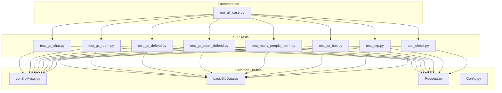
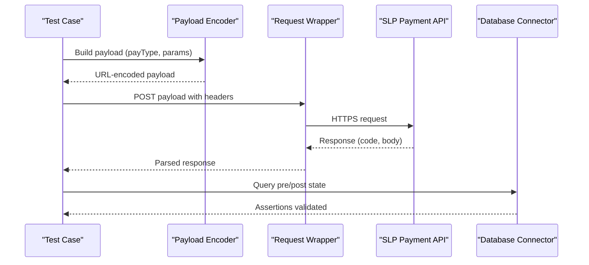
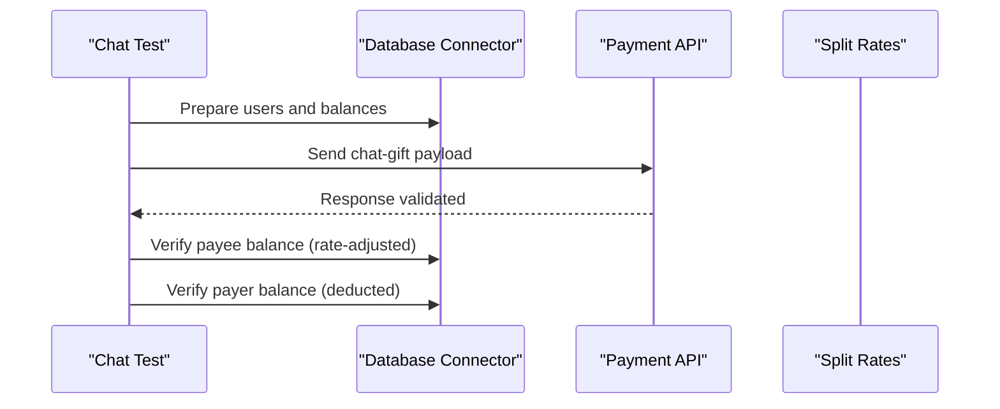
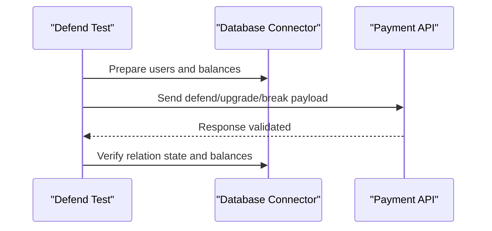
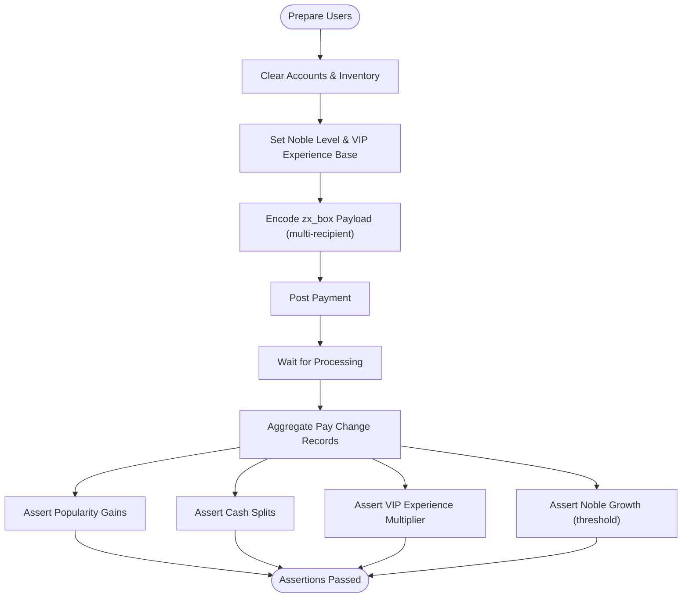
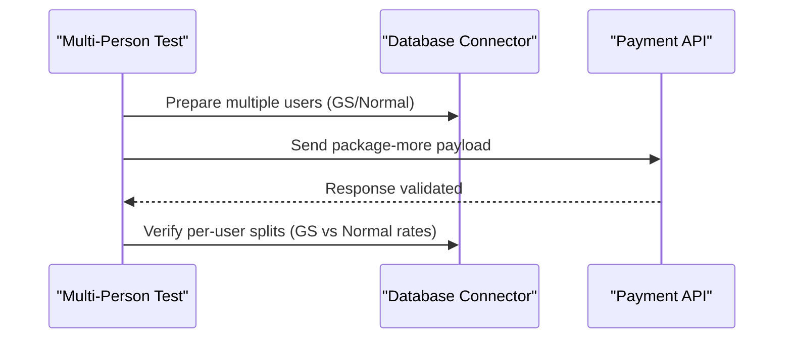
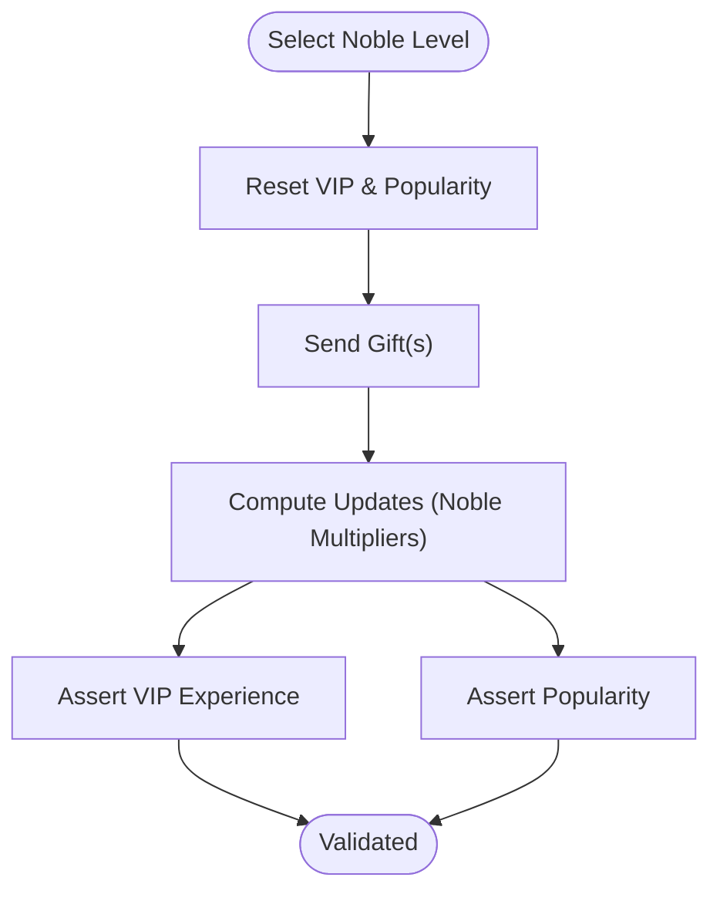
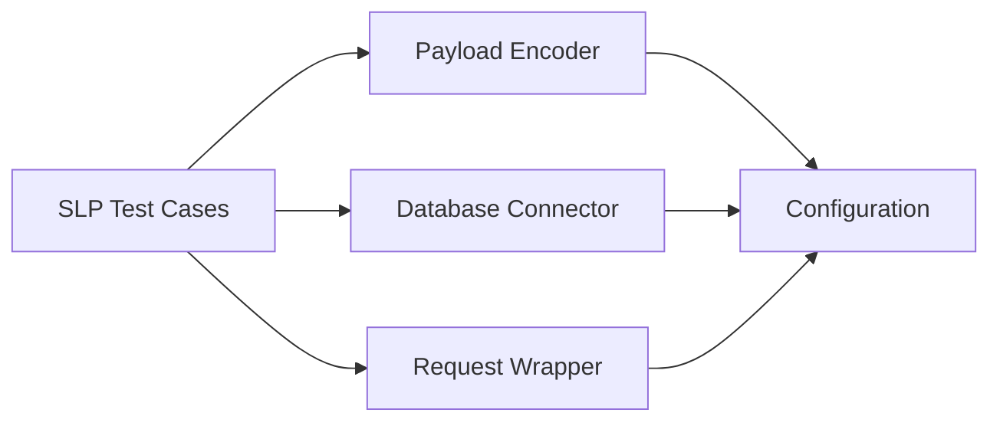

# SLP Sleepless Planet Platform Testing

<cite>
**Referenced Files in This Document**
- [config.py](file://caseSlp/config.py)
- [test_gs_chat.py](file://caseSlp/test_gs_chat.py)
- [test_gs_defend.py](file://caseSlp/test_gs_defend.py)
- [test_gs_room.py](file://caseSlp/test_gs_room.py)
- [test_gs_room_defend.py](file://caseSlp/test_gs_room_defend.py)
- [test_many_people_room.py](file://caseSlp/test_many_people_room.py)
- [test_zx_box.py](file://caseSlp/test_zx_box.py)
- [test_exp.py](file://caseSlp/test_exp.py)
- [test_check.py](file://caseSlp/test_check.py)
- [conSlpMysql.py](file://common/conSlpMysql.py)
- [basicSlpData.py](file://common/basicSlpData.py)
- [Request.py](file://common/Request.py)
- [run_all_case.py](file://run_all_case.py)
- [Config.py](file://common/Config.py)
</cite>

## Table of Contents
1. [Introduction](#introduction)
2. [Project Structure](#project-structure)
3. [Core Components](#core-components)
4. [Architecture Overview](#architecture-overview)
5. [Detailed Component Analysis](#detailed-component-analysis)
6. [Dependency Analysis](#dependency-analysis)
7. [Performance Considerations](#performance-considerations)
8. [Troubleshooting Guide](#troubleshooting-guide)
9. [Conclusion](#conclusion)

## Introduction
This document describes the advanced payment testing capabilities for the Sleepless Planet (SLP) platform. It focuses on chat room payment systems, defensive mechanism transactions, room upgrade operations, and box opening mechanics. It also documents specialized configuration requirements, multi-person room testing scenarios, experience point calculations, and defensive system validations. The guide explains the integration between chat payments, room defenses, and player progression systems, and outlines platform-specific testing methodologies, data validation procedures, and performance considerations tailored to SLP’s gaming ecosystem.

## Project Structure
The SLP payment testing suite is organized by functional areas under the caseSlp directory, with shared utilities in common. The most relevant components for payment testing include:
- Payment scenario tests: chat room payments, personal and room defenses, multi-person rooms, and box mechanics
- Shared utilities: database connectors, request wrappers, payload encoders, and configuration
- Orchestration: centralized runner to execute SLP test suites

**Diagram sources**
- [test_gs_chat.py:1-52](file://caseSlp/test_gs_chat.py#L1-L52)
- [test_gs_room.py:1-589](file://caseSlp/test_gs_room.py#L1-L589)
- [test_gs_defend.py:1-113](file://caseSlp/test_gs_defend.py#L1-L113)
- [test_gs_room_defend.py:1-59](file://caseSlp/test_gs_room_defend.py#L1-L59)
- [test_many_people_room.py:1-57](file://caseSlp/test_many_people_room.py#L1-L57)
- [test_zx_box.py:1-113](file://caseSlp/test_zx_box.py#L1-L113)
- [test_exp.py:1-327](file://caseSlp/test_exp.py#L1-L327)
- [test_check.py:1-295](file://caseSlp/test_check.py#L1-L295)
- [conSlpMysql.py:1-680](file://common/conSlpMysql.py#L1-L680)
- [basicSlpData.py:1-470](file://common/basicSlpData.py#L1-L470)
- [Request.py:1-162](file://common/Request.py#L1-L162)
- [run_all_case.py:1-159](file://run_all_case.py#L1-L159)
- [Config.py:1-133](file://common/Config.py#L1-L133)

**Section sources**
- [run_all_case.py:126-147](file://run_all_case.py#L126-L147)

## Core Components
- Payment configuration and fixtures
  - Payment endpoints, default amounts, user fixtures, room identifiers, gift configurations, defense tiers, rates, titles, and box mechanics are defined centrally.
- Payload encoder
  - Encodes structured payment requests for different transaction types (chat-gift, package, package-more, package-knightDefend, defend variants, zx_box).
- Database connector
  - Provides CRUD and query helpers for balances, inventory, relations, room types, and progress metrics.
- Request wrapper
  - Sends signed requests to the SLP payment endpoint and captures response metadata.
- Test suites
  - Chat room payments, personal and room defenses, multi-person rooms, box mechanics, experience calculations, and boundary checks.

**Section sources**
- [config.py:1-263](file://caseSlp/config.py#L1-L263)
- [basicSlpData.py:6-345](file://common/basicSlpData.py#L6-L345)
- [conSlpMysql.py:29-680](file://common/conSlpMysql.py#L29-L680)
- [Request.py:17-59](file://common/Request.py#L17-L59)

## Architecture Overview
The testing architecture follows a layered approach:
- Test layer: orchestrates scenarios and assertions
- Payload layer: builds request payloads per transaction type
- Transport layer: posts to the SLP payment endpoint
- Persistence layer: validates balances, inventory, relations, and progress

**Diagram sources**
- [basicSlpData.py:6-345](file://common/basicSlpData.py#L6-L345)
- [Request.py:17-59](file://common/Request.py#L17-L59)
- [conSlpMysql.py:29-680](file://common/conSlpMysql.py#L29-L680)

## Detailed Component Analysis

### Chat Room Payment Systems
This covers private chat gifting and room-based gifting scenarios, validating splits and balances.

**Diagram sources**
- [test_gs_chat.py:21-51](file://caseSlp/test_gs_chat.py#L21-L51)
- [config.py:149-167](file://caseSlp/config.py#L149-L167)
- [conSlpMysql.py:29-105](file://common/conSlpMysql.py#L29-L105)

Key validations:
- Private chat gifting splits to the recipient’s cash account according to configured rates.
- Room-based chat gifting follows the same split model.

**Section sources**
- [test_gs_chat.py:21-51](file://caseSlp/test_gs_chat.py#L21-L51)
- [config.py:149-167](file://caseSlp/config.py#L149-L167)

### Defensive Mechanism Transactions
This includes personal and room defenses, covering activation, upgrades, and dissolution.

**Diagram sources**
- [test_gs_defend.py:23-112](file://caseSlp/test_gs_defend.py#L23-L112)
- [test_gs_room_defend.py:21-58](file://caseSlp/test_gs_room_defend.py#L21-L58)
- [conSlpMysql.py:153-175](file://common/conSlpMysql.py#L153-L175)

Personal defense:
- Activation, upgrade, and dissolution flows with tiered pricing and break fees.
- Split validation against configured rates.

Room defense:
- Room knight defense activation with tiered pricing and duration levels.

**Section sources**
- [test_gs_defend.py:23-112](file://caseSlp/test_gs_defend.py#L23-L112)
- [test_gs_room_defend.py:21-58](file://caseSlp/test_gs_room_defend.py#L21-L58)
- [config.py:45-97](file://caseSlp/config.py#L45-L97)

### Room Upgrade Operations
Room upgrade operations are covered under room defense activation, ensuring correct room factory types and split distributions.

Validation highlights:
- Distinguish between live and non-live rooms.
- Verify splits for GS and non-GS recipients depending on guild membership and god agreement.

**Section sources**
- [test_gs_room.py:21-589](file://caseSlp/test_gs_room.py#L21-L589)
- [conSlpMysql.py:621-631](file://common/conSlpMysql.py#L621-L631)

### Box Opening Mechanics
The box opening test validates multi-user distribution, popularity accumulation, VIP experience gains, and noble growth contributions.

**Diagram sources**
- [test_zx_box.py:21-112](file://caseSlp/test_zx_box.py#L21-L112)
- [config.py:216-252](file://caseSlp/config.py#L216-L252)
- [conSlpMysql.py:647-658](file://common/conSlpMysql.py#L647-L658)

**Section sources**
- [test_zx_box.py:21-112](file://caseSlp/test_zx_box.py#L21-L112)
- [config.py:216-252](file://caseSlp/config.py#L216-L252)

### Multi-Person Room Testing Scenarios
Validates multi-recipient room gifting with mixed roles (GS vs. normal), ensuring correct splits per recipient type.

**Diagram sources**
- [test_many_people_room.py:21-56](file://caseSlp/test_many_people_room.py#L21-L56)
- [conSlpMysql.py:663-674](file://common/conSlpMysql.py#L663-L674)

**Section sources**
- [test_many_people_room.py:21-56](file://caseSlp/test_many_people_room.py#L21-L56)
- [config.py:149-167](file://caseSlp/config.py#L149-L167)

### Experience Point Calculations
Validates VIP experience accumulation and popularity increases based on noble levels and gift values.

**Diagram sources**
- [test_exp.py:22-326](file://caseSlp/test_exp.py#L22-L326)
- [config.py:168-215](file://caseSlp/config.py#L168-L215)
- [conSlpMysql.py:95-143](file://common/conSlpMysql.py#L95-L143)

**Section sources**
- [test_exp.py:22-326](file://caseSlp/test_exp.py#L22-L326)
- [config.py:168-215](file://caseSlp/config.py#L168-L215)

### Defensive System Validations
Ensures correct relation states, balances, and split outcomes for personal and room defenses.

**Section sources**
- [test_gs_defend.py:23-112](file://caseSlp/test_gs_defend.py#L23-L112)
- [test_gs_room_defend.py:21-58](file://caseSlp/test_gs_room_defend.py#L21-L58)

### Specialized Configuration Requirements
- Payment endpoint and token handling are managed via shared configuration and session utilities.
- Room factory types are verified before applying room-specific logic.
- Noble levels and multipliers are applied to VIP experience and growth computations.

**Section sources**
- [Config.py:49-58](file://common/Config.py#L49-L58)
- [conSlpMysql.py:621-631](file://common/conSlpMysql.py#L621-L631)
- [config.py:168-215](file://caseSlp/config.py#L168-L215)

## Dependency Analysis
The test suite exhibits clear separation of concerns:
- Tests depend on shared encoders, request wrappers, and database connectors
- Encoders depend on configuration for rates, gifts, and box mechanics
- Database connector depends on environment configuration for connection parameters

**Diagram sources**
- [basicSlpData.py:6-345](file://common/basicSlpData.py#L6-L345)
- [conSlpMysql.py:8-27](file://common/conSlpMysql.py#L8-L27)
- [Request.py:17-59](file://common/Request.py#L17-L59)
- [Config.py:8-31](file://common/Config.py#L8-L31)

**Section sources**
- [basicSlpData.py:6-345](file://common/basicSlpData.py#L6-L345)
- [conSlpMysql.py:8-27](file://common/conSlpMysql.py#L8-L27)
- [Request.py:17-59](file://common/Request.py#L17-L59)
- [Config.py:8-31](file://common/Config.py#L8-L31)

## Performance Considerations
- Network latency and response times are captured during HTTP requests; use these metrics to detect regressions.
- Batch operations (multi-person room gifting) increase payload sizes; monitor throughput and memory usage.
- Database queries are executed before and after transactions; ensure connection pooling and minimal query overhead.
- Payload encoding and signing steps add CPU overhead; cache static configuration where safe.

[No sources needed since this section provides general guidance]

## Troubleshooting Guide
Common issues and resolutions:
- Insufficient balance
  - Validate balances prior to payment and expect failure messages when funds are below gift cost.
- Self-payment attempts
  - Expect explicit failure messages when attempting to pay oneself.
- Deduction order
  - Confirm deduction precedence (money > mcb > mc) and verify residual balances after batch payments.
- Room type mismatches
  - Ensure room factory types match expected live/non-live behavior before running room tests.
- Data cleanup
  - Use database utilities to reset accounts, inventory, and relations between runs to avoid cross-test contamination.

**Section sources**
- [test_check.py:20-295](file://caseSlp/test_check.py#L20-L295)
- [conSlpMysql.py:228-321](file://common/conSlpMysql.py#L228-L321)

## Conclusion
The SLP payment testing framework provides comprehensive coverage for chat room payments, personal and room defenses, multi-person gifting, box mechanics, experience calculations, and defensive validations. By leveraging shared encoders, request wrappers, and database connectors, the suite ensures reliable, repeatable, and data-driven validation of payment flows. Adhering to the documented methodologies and validations enables robust testing of Sleepless Planet’s unique gaming ecosystem.