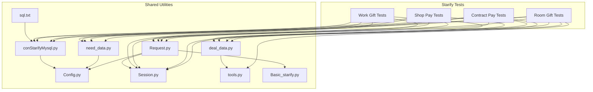
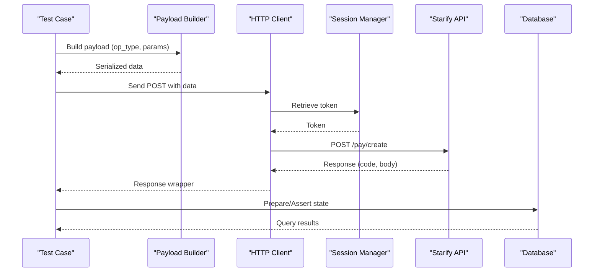
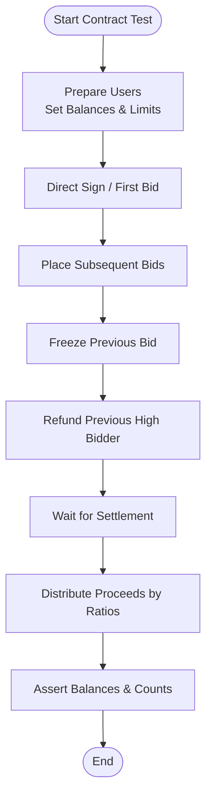
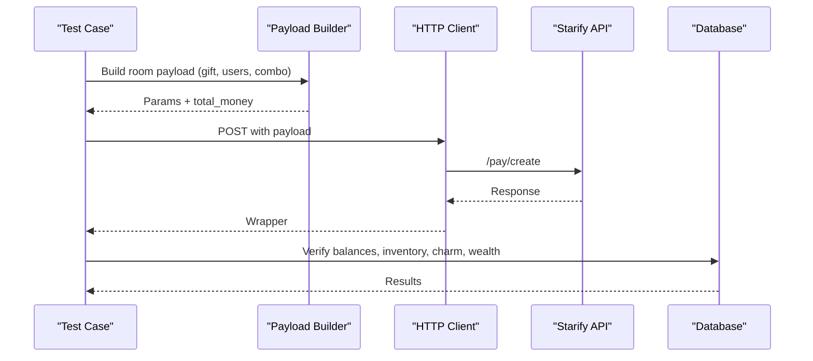
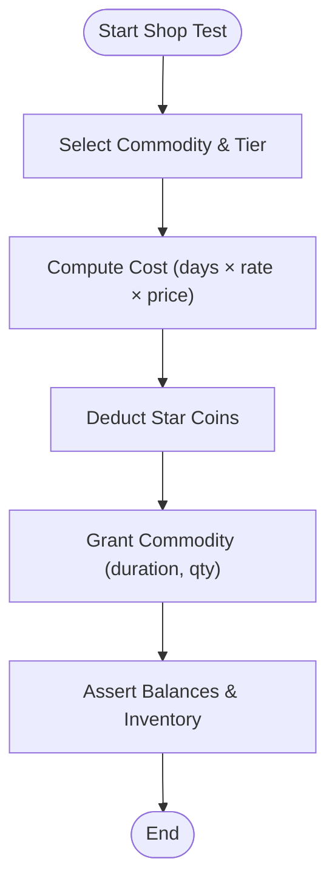
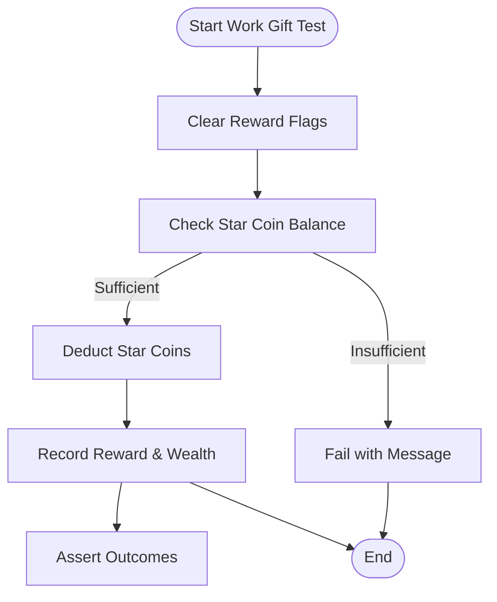
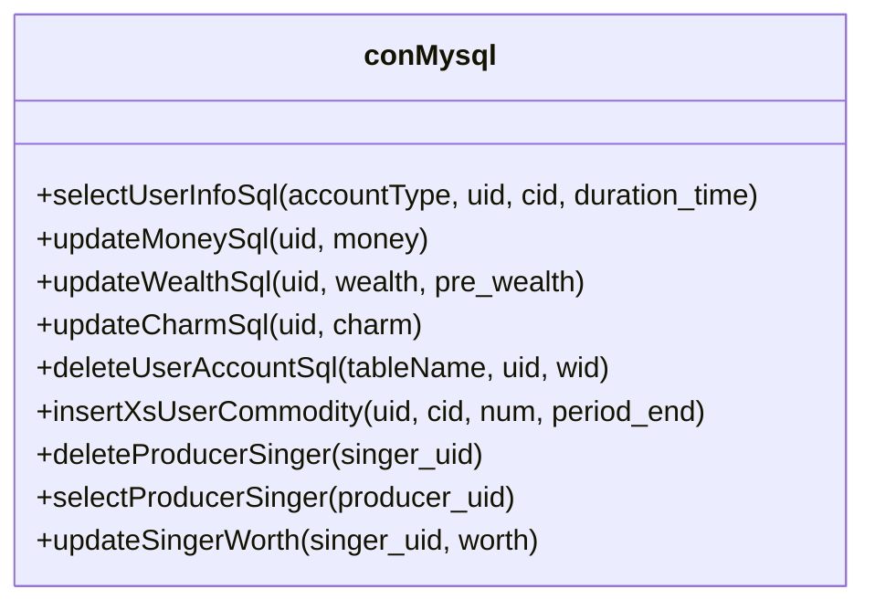
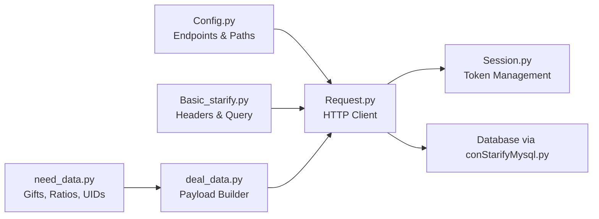
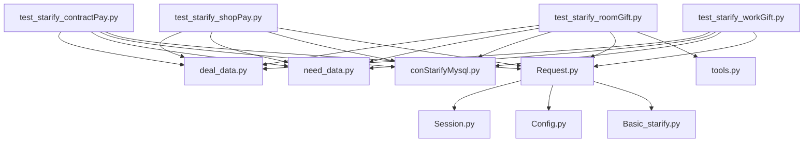

# Starify Platform Testing

<cite>
**Referenced Files in This Document**
- [test_starify_contractPay.py](file://caseStarify/test_starify_contractPay.py)
- [test_starify_roomGift.py](file://caseStarify/test_starify_roomGift.py)
- [test_starify_shopPay.py](file://caseStarify/test_starify_shopPay.py)
- [test_starify_workGift.py](file://caseStarify/test_starify_workGift.py)
- [deal_data.py](file://caseStarify/deal_data.py)
- [need_data.py](file://caseStarify/need_data.py)
- [conStarifyMysql.py](file://common/conStarifyMysql.py)
- [Config.py](file://common/Config.py)
- [Basic_starify.py](file://common/Basic_starify.py)
- [Request.py](file://common/Request.py)
- [Session.py](file://common/Session.py)
- [tools.py](file://caseStarify/tools.py)
- [sql.txt](file://caseStarify/sql.txt)
- [README.md](file://README.md)
</cite>

## Table of Contents
1. [Introduction](#introduction)
2. [Project Structure](#project-structure)
3. [Core Components](#core-components)
4. [Architecture Overview](#architecture-overview)
5. [Detailed Component Analysis](#detailed-component-analysis)
6. [Dependency Analysis](#dependency-analysis)
7. [Performance Considerations](#performance-considerations)
8. [Troubleshooting Guide](#troubleshooting-guide)
9. [Conclusion](#conclusion)
10. [Appendices](#appendices)

## Introduction
This document describes the Starify platform’s specialized payment testing capabilities. It focuses on contract-based payment systems, room gift transactions, shop payment workflows, and work gift mechanisms. It also documents the specialized data handling procedures, SQL script integration, and platform-specific validation requirements. The guide explains how contract payments relate to room gift systems, how work gift distribution works, and how shop payment processing is validated. Platform-specific configuration parameters, data validation approaches, and integration patterns unique to Starify’s entertainment and social gaming features are included.

## Project Structure
The Starify testing suite is organized around feature-specific test modules under the caseStarify directory, with shared utilities in common. The structure supports:
- Contract payment tests
- Room gift transaction tests
- Shop purchase tests
- Work gift tests
- Shared data preparation and database utilities
- Request and session management
- Platform-specific configuration and constants

**Diagram sources**
- [test_starify_contractPay.py](file://caseStarify/test_starify_contractPay.py)
- [test_starify_roomGift.py](file://caseStarify/test_starify_roomGift.py)
- [test_starify_shopPay.py](file://caseStarify/test_starify_shopPay.py)
- [test_starify_workGift.py](file://caseStarify/test_starify_workGift.py)
- [deal_data.py](file://caseStarify/deal_data.py)
- [need_data.py](file://caseStarify/need_data.py)
- [conStarifyMysql.py](file://common/conStarifyMysql.py)
- [Config.py](file://common/Config.py)
- [Basic_starify.py](file://common/Basic_starify.py)
- [Request.py](file://common/Request.py)
- [Session.py](file://common/Session.py)
- [tools.py](file://caseStarify/tools.py)
- [sql.txt](file://caseStarify/sql.txt)

**Section sources**
- [README.md](file://README.md)

## Core Components
- Contract Payment System: Tests validate auction-style contract purchases, bid increments, freeze/refund semantics, and post-settlement distributions between producer and singer according to predefined ratios.
- Room Gift Transactions: Tests validate star coin usage, backpack gift combinations, multi-user rewards, combo mechanics, and charm/wealth adjustments.
- Shop Payment Workflows: Tests validate purchase of avatar frames, entrance banners, and ring effects with tiered pricing and discount rates.
- Work Gift Mechanisms: Tests validate single-use work rewards and duplicate protection rules.
- Data Preparation and Validation: Centralized helpers build request payloads, manage database state, and assert outcomes against expected balances, inventory, and metadata.
- Platform Integration: Request orchestration, session/token management, and platform-specific headers/signatures are encapsulated for Starify.

**Section sources**
- [test_starify_contractPay.py](file://caseStarify/test_starify_contractPay.py)
- [test_starify_roomGift.py](file://caseStarify/test_starify_roomGift.py)
- [test_starify_shopPay.py](file://caseStarify/test_starify_shopPay.py)
- [test_starify_workGift.py](file://caseStarify/test_starify_workGift.py)
- [deal_data.py](file://caseStarify/deal_data.py)
- [need_data.py](file://caseStarify/need_data.py)
- [conStarifyMysql.py](file://common/conStarifyMysql.py)
- [Config.py](file://common/Config.py)
- [Basic_starify.py](file://common/Basic_starify.py)
- [Request.py](file://common/Request.py)
- [Session.py](file://common/Session.py)
- [tools.py](file://caseStarify/tools.py)

## Architecture Overview
The Starify payment testing architecture follows a layered pattern:
- Test Layer: Feature-specific test suites define scenarios and assertions.
- Data Layer: Test data and configuration (gifts, tiers, ratios) are centralized.
- Payload Builder: Utility functions construct standardized request payloads.
- Execution Layer: Requests are sent via a unified HTTP client with session tokens.
- Persistence Layer: Database utilities prepare and verify state changes.

**Diagram sources**
- [deal_data.py](file://caseStarify/deal_data.py)
- [Request.py](file://common/Request.py)
- [Session.py](file://common/Session.py)
- [conStarifyMysql.py](file://common/conStarifyMysql.py)

## Detailed Component Analysis

### Contract Payment System
Contract payments emulate an auction model where producers compete to sign singers. The tests validate:
- Direct signing and bidding sequences
- Freeze/refund behavior during active auctions
- Settlement logic distributing proceeds to producer and singer according to fixed ratios
- Constraints such as minimum bid increments and maximum signed singer limits

Key behaviors validated:
- Producer capacity tracking via database queries
- Balance updates for producer and singer accounts
- Ratio-based profit distribution after settlement delay

**Diagram sources**
- [test_starify_contractPay.py](file://caseStarify/test_starify_contractPay.py)
- [conStarifyMysql.py](file://common/conStarifyMysql.py)
- [need_data.py](file://caseStarify/need_data.py)

**Section sources**
- [test_starify_contractPay.py](file://caseStarify/test_starify_contractPay.py)
- [conStarifyMysql.py](file://common/conStarifyMysql.py)
- [need_data.py](file://caseStarify/need_data.py)

### Room Gift Transactions
Room gift tests validate:
- Star coin balance checks and deductions
- Backpack gift usage and inventory adjustments
- Multi-user reward distribution with configurable lower/upper bounds
- Combo mechanics scaling rewards by hit offset
- Charm and wealth adjustments per recipient and multiplier

Validation includes:
- Exact balance assertions after transactions
- Range-based assertions for randomized reward bounds
- Inventory counts for backpack items

**Diagram sources**
- [deal_data.py](file://caseStarify/deal_data.py)
- [test_starify_roomGift.py](file://caseStarify/test_starify_roomGift.py)
- [conStarifyMysql.py](file://common/conStarifyMysql.py)
- [tools.py](file://caseStarify/tools.py)

**Section sources**
- [test_starify_roomGift.py](file://caseStarify/test_starify_roomGift.py)
- [deal_data.py](file://caseStarify/deal_data.py)
- [conStarifyMysql.py](file://common/conStarifyMysql.py)
- [tools.py](file://caseStarify/tools.py)

### Shop Payment Workflows
Shop payment tests validate:
- Purchase of avatar frames, entrance banners, and ring effects
- Tiered pricing with day-based durations and discount rates
- Wealth accumulation equal to effective cost
- Backpack item creation with correct duration and quantity

**Diagram sources**
- [test_starify_shopPay.py](file://caseStarify/test_starify_shopPay.py)
- [deal_data.py](file://caseStarify/deal_data.py)
- [conStarifyMysql.py](file://common/conStarifyMysql.py)
- [need_data.py](file://caseStarify/need_data.py)

**Section sources**
- [test_starify_shopPay.py](file://caseStarify/test_starify_shopPay.py)
- [deal_data.py](file://caseStarify/deal_data.py)
- [conStarifyMysql.py](file://common/conStarifyMysql.py)
- [need_data.py](file://caseStarify/need_data.py)

### Work Gift Mechanisms
Work gift tests validate:
- Single-use reward per work with duplicate protection
- Star coin deduction and wealth accumulation
- Failure modes when balances are insufficient

**Diagram sources**
- [test_starify_workGift.py](file://caseStarify/test_starify_workGift.py)
- [conStarifyMysql.py](file://common/conStarifyMysql.py)
- [deal_data.py](file://caseStarify/deal_data.py)

**Section sources**
- [test_starify_workGift.py](file://caseStarify/test_starify_workGift.py)
- [conStarifyMysql.py](file://common/conStarifyMysql.py)
- [deal_data.py](file://caseStarify/deal_data.py)

### Data Handling and SQL Integration
The suite uses a dedicated MySQL client to:
- Prepare test accounts with controlled balances and inventory
- Clear or insert backpack items and reward flags
- Track producer–singer relationships and signed counts
- Query balances, inventory quantities, charm, and wealth

SQL script templates and table references are maintained for reproducibility.

**Diagram sources**
- [conStarifyMysql.py](file://common/conStarifyMysql.py)
- [sql.txt](file://caseStarify/sql.txt)

**Section sources**
- [conStarifyMysql.py](file://common/conStarifyMysql.py)
- [sql.txt](file://caseStarify/sql.txt)

### Platform-Specific Configuration and Validation
- Gift configurations define prices, charm, wealth, and reward ranges for room gifts and shop items.
- Contract ratios govern producer–singer profit splits.
- Request headers and query parameters are standardized for Starify.
- Session management provides tokens for authenticated requests.

**Diagram sources**
- [need_data.py](file://caseStarify/need_data.py)
- [deal_data.py](file://caseStarify/deal_data.py)
- [Config.py](file://common/Config.py)
- [Basic_starify.py](file://common/Basic_starify.py)
- [Request.py](file://common/Request.py)
- [Session.py](file://common/Session.py)
- [conStarifyMysql.py](file://common/conStarifyMysql.py)

**Section sources**
- [need_data.py](file://caseStarify/need_data.py)
- [deal_data.py](file://caseStarify/deal_data.py)
- [Config.py](file://common/Config.py)
- [Basic_starify.py](file://common/Basic_starify.py)
- [Request.py](file://common/Request.py)
- [Session.py](file://common/Session.py)
- [conStarifyMysql.py](file://common/conStarifyMysql.py)

## Dependency Analysis
The test modules depend on shared utilities for payload construction, database operations, and HTTP communication. There are no circular dependencies among the Starify test files; each test module composes the shared utilities.

**Diagram sources**
- [test_starify_contractPay.py](file://caseStarify/test_starify_contractPay.py)
- [test_starify_roomGift.py](file://caseStarify/test_starify_roomGift.py)
- [test_starify_shopPay.py](file://caseStarify/test_starify_shopPay.py)
- [test_starify_workGift.py](file://caseStarify/test_starify_workGift.py)
- [deal_data.py](file://caseStarify/deal_data.py)
- [need_data.py](file://caseStarify/need_data.py)
- [conStarifyMysql.py](file://common/conStarifyMysql.py)
- [Request.py](file://common/Request.py)
- [Session.py](file://common/Session.py)
- [tools.py](file://caseStarify/tools.py)
- [Config.py](file://common/Config.py)
- [Basic_starify.py](file://common/Basic_starify.py)

**Section sources**
- [test_starify_contractPay.py](file://caseStarify/test_starify_contractPay.py)
- [test_starify_roomGift.py](file://caseStarify/test_starify_roomGift.py)
- [test_starify_shopPay.py](file://caseStarify/test_starify_shopPay.py)
- [test_starify_workGift.py](file://caseStarify/test_starify_workGift.py)
- [deal_data.py](file://caseStarify/deal_data.py)
- [need_data.py](file://caseStarify/need_data.py)
- [conStarifyMysql.py](file://common/conStarifyMysql.py)
- [Request.py](file://common/Request.py)
- [Session.py](file://common/Session.py)
- [tools.py](file://caseStarify/tools.py)
- [Config.py](file://common/Config.py)
- [Basic_starify.py](file://common/Basic_starify.py)

## Performance Considerations
- Batch operations: Group multiple room gift transactions to minimize round-trips.
- Concurrency: Use the built-in retry mechanism judiciously to avoid overwhelming the API.
- Database cleanup: Ensure test data is reset between runs to prevent cascading failures.
- Precision handling: Use the provided rounding utility to avoid floating-point discrepancies in cost calculations.

## Troubleshooting Guide
Common issues and resolutions:
- Insufficient star coin balance: Ensure balances are initialized before tests; verify deductions match expected costs.
- Backpack item shortages: Confirm insertions and deletions are executed prior to assertions.
- Duplicate work gift attempts: Expect failure messages for repeated rewards on the same work.
- Auction settlement timing: Allow the required delay before asserting final balances and counts.
- Session token errors: Validate token persistence and refresh mechanisms if reads fail.

**Section sources**
- [test_starify_roomGift.py](file://caseStarify/test_starify_roomGift.py)
- [test_starify_workGift.py](file://caseStarify/test_starify_workGift.py)
- [test_starify_contractPay.py](file://caseStarify/test_starify_contractPay.py)
- [conStarifyMysql.py](file://common/conStarifyMysql.py)
- [Session.py](file://common/Session.py)

## Conclusion
The Starify platform testing suite provides comprehensive coverage of contract payments, room gift transactions, shop purchases, and work gift mechanisms. By centralizing data preparation, payload building, and database validation, the suite ensures reliable and repeatable verification of platform-specific payment workflows. Adhering to the documented configuration parameters, validation approaches, and integration patterns enables accurate testing of Starify’s entertainment and social gaming features.

## Appendices
- Configuration parameters:
  - Gift configurations, tiers, and reward ranges
  - Contract ratios for producer–singer splits
  - Endpoint URLs and platform identifiers
- SQL templates and table references for test data setup and cleanup

**Section sources**
- [need_data.py](file://caseStarify/need_data.py)
- [Config.py](file://common/Config.py)
- [sql.txt](file://caseStarify/sql.txt)