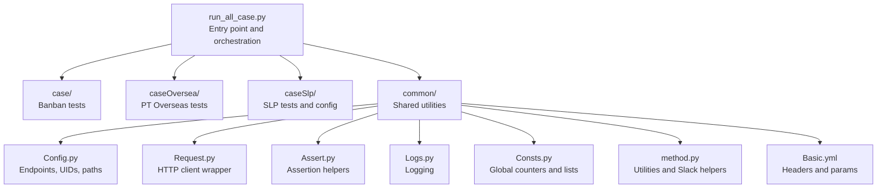
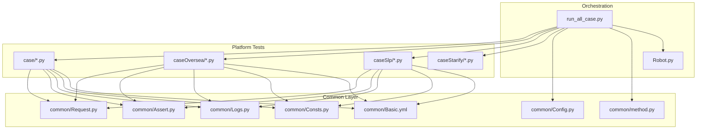
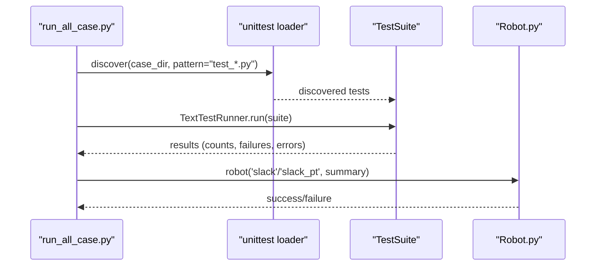
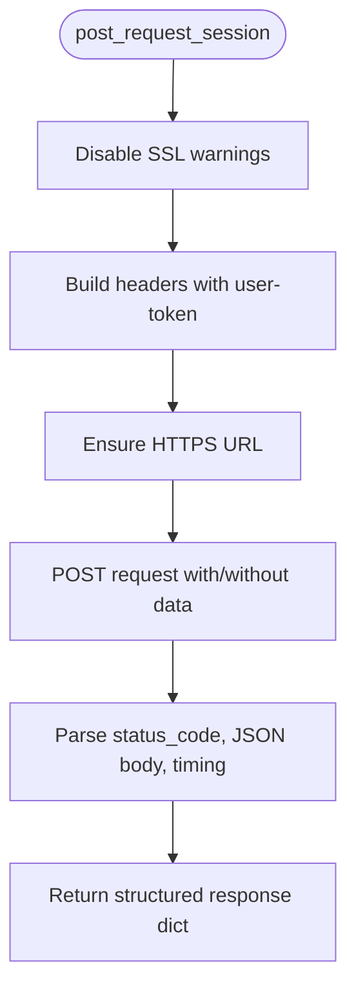
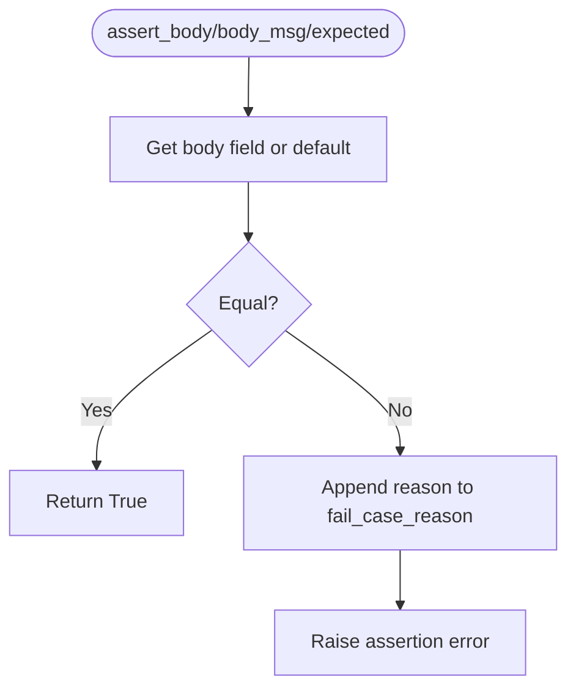
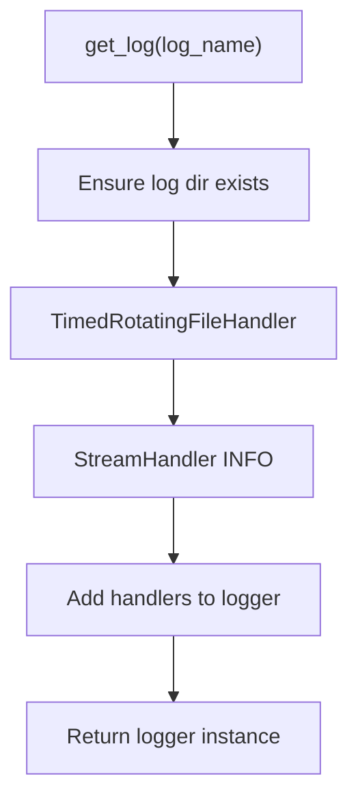
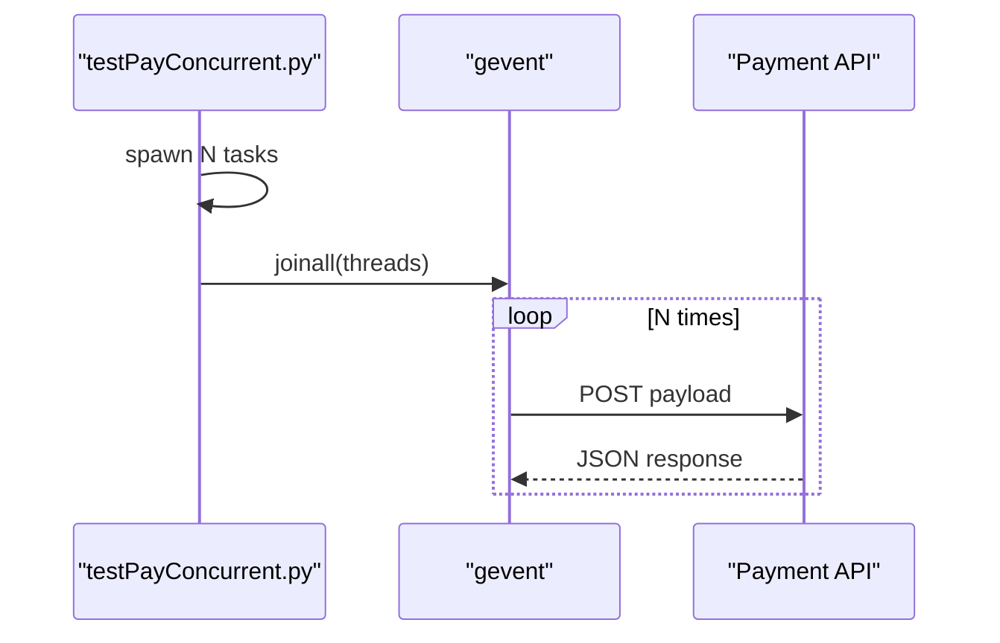
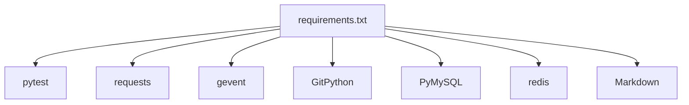

# Project Overview

<cite>
**Referenced Files in This Document**
- [README.md](file://README.md)
- [requirements.txt](file://requirements.txt)
- [run_all_case.py](file://run_all_case.py)
- [Robot.py](file://Robot.py)
- [common/Config.py](file://common/Config.py)
- [common/Basic.yml](file://common/Basic.yml)
- [common/Consts.py](file://common/Consts.py)
- [common/Logs.py](file://common/Logs.py)
- [common/Request.py](file://common/Request.py)
- [common/Assert.py](file://common/Assert.py)
- [common/method.py](file://common/method.py)
- [case/test_pay_bean.py](file://case/test_pay_bean.py)
- [caseOversea/test_pt_bean.py](file://caseOversea/test_pt_bean.py)
- [caseSlp/config.py](file://caseSlp/config.py)
- [testPayConcurrent.py](file://testPayConcurrent.py)
</cite>

## Table of Contents
1. [Introduction](#introduction)
2. [Project Structure](#project-structure)
3. [Core Components](#core-components)
4. [Architecture Overview](#architecture-overview)
5. [Detailed Component Analysis](#detailed-component-analysis)
6. [Dependency Analysis](#dependency-analysis)
7. [Performance Considerations](#performance-considerations)
8. [Troubleshooting Guide](#troubleshooting-guide)
9. [Conclusion](#conclusion)
10. [Appendices](#appendices)

## Introduction
The QA Payment Testing Framework is an automated payment testing solution designed to validate payment flows across multiple gaming platforms. It supports Banban, PT Overseas, Starify, and SLP Sleepless Planet, enabling cross-platform regression and smoke testing. The framework emphasizes:
- Multi-platform support with platform-specific configurations and endpoints
- Automated test discovery and execution via pytest
- Concurrent testing capabilities for load and stress validation
- Integrated Slack notifications and Git pull automation for CI-like behavior
- Centralized assertion helpers and logging for reliable validation and reporting

The framework was developed to address the complexity and variability of payment flows in gaming environments, where differences in authentication, currency types, room mechanics, and backend integrations require robust, repeatable, and scalable testing.

## Project Structure
The repository is organized by feature and platform:
- case: Core payment tests for Banban
- caseOversea: Payment tests for PT Overseas
- caseSlp: Payment tests and configuration for SLP Sleepless Planet
- caseStarify: Payment tests and utilities for Starify
- common: Shared modules for configuration, HTTP requests, assertions, logging, database connectivity, and utilities
- probabilityTest: Optional modules for probability-related validations
- Root scripts: Orchestration for running tests, Slack notifications, and Git updates

**Diagram sources**
- [run_all_case.py:126-147](file://run_all_case.py#L126-L147)
- [common/Config.py:6-133](file://common/Config.py#L6-L133)
- [common/Request.py:17-59](file://common/Request.py#L17-L59)
- [common/Assert.py:11-96](file://common/Assert.py#L11-L96)
- [common/Logs.py:8-47](file://common/Logs.py#L8-L47)
- [common/Consts.py:4-17](file://common/Consts.py#L4-L17)
- [common/method.py:26-38](file://common/method.py#L26-L38)
- [common/Basic.yml:1-52](file://common/Basic.yml#L1-L52)

**Section sources**
- [README.md:31-38](file://README.md#L31-L38)
- [run_all_case.py:126-147](file://run_all_case.py#L126-L147)

## Core Components
- Configuration and Endpoints
  - Centralized configuration defines base paths, app names, server hosts, payment URLs, and user/room identifiers per platform.
  - Example paths: [common/Config.py:9-133](file://common/Config.py#L9-L133)

- HTTP Request Wrapper
  - A unified POST request method with token injection and response parsing for consistent API calls.
  - Example paths: [common/Request.py:17-59](file://common/Request.py#L17-L59)

- Assertions and Validation
  - Assertion helpers for HTTP status, JSON body fields, equality, length, substring presence, and ranges.
  - Example paths: [common/Assert.py:11-96](file://common/Assert.py#L11-L96)

- Logging and Global State
  - Structured logging with rotating files and global counters for success/failure tracking.
  - Example paths: [common/Logs.py:8-47](file://common/Logs.py#L8-L47), [common/Consts.py:4-17](file://common/Consts.py#L4-L17)

- Utilities and Slack Integration
  - Utility functions for dictionary-to-slack conversion, image retrieval, and path checks; Slack notification dispatchers.
  - Example paths: [common/method.py:26-38](file://common/method.py#L26-L38), [Robot.py:6-34](file://Robot.py#L6-L34)

- Test Orchestration
  - Automatic test discovery and execution across platforms, Git pull triggers, and Slack reporting.
  - Example paths: [run_all_case.py:12-124](file://run_all_case.py#L12-L124), [run_all_case.py:126-147](file://run_all_case.py#L126-L147)

**Section sources**
- [common/Config.py:6-133](file://common/Config.py#L6-L133)
- [common/Request.py:17-59](file://common/Request.py#L17-L59)
- [common/Assert.py:11-96](file://common/Assert.py#L11-L96)
- [common/Logs.py:8-47](file://common/Logs.py#L8-L47)
- [common/Consts.py:4-17](file://common/Consts.py#L4-L17)
- [common/method.py:26-38](file://common/method.py#L26-L38)
- [Robot.py:6-34](file://Robot.py#L6-L34)
- [run_all_case.py:12-124](file://run_all_case.py#L12-L124)
- [run_all_case.py:126-147](file://run_all_case.py#L126-L147)

## Architecture Overview
The framework follows a layered architecture:
- Test Layer: Platform-specific test suites under case/, caseOversea/, caseSlp/, and caseStarify/
- Common Layer: Shared utilities for configuration, HTTP, assertions, logging, and methods
- Orchestration Layer: Entry point script that discovers tests, runs them, and reports outcomes
- Integration Layer: Slack notifications and optional Git pull automation

**Diagram sources**
- [run_all_case.py:12-124](file://run_all_case.py#L12-L124)
- [run_all_case.py:126-147](file://run_all_case.py#L126-L147)
- [Robot.py:6-34](file://Robot.py#L6-L34)
- [common/Config.py:6-133](file://common/Config.py#L6-L133)
- [common/Request.py:17-59](file://common/Request.py#L17-L59)
- [common/Assert.py:11-96](file://common/Assert.py#L11-L96)
- [common/Logs.py:8-47](file://common/Logs.py#L8-L47)
- [common/Consts.py:4-17](file://common/Consts.py#L4-L17)
- [common/method.py:26-38](file://common/method.py#L26-L38)
- [common/Basic.yml:1-52](file://common/Basic.yml#L1-L52)

## Detailed Component Analysis

### Test Orchestration and Slack Reporting
The runner script discovers platform-specific test suites, executes them, aggregates results, and posts summaries to Slack. It also optionally pulls latest code from Git repositories before running.

**Diagram sources**
- [run_all_case.py:126-147](file://run_all_case.py#L126-L147)
- [run_all_case.py:12-124](file://run_all_case.py#L12-L124)
- [Robot.py:6-34](file://Robot.py#L6-L34)

**Section sources**
- [run_all_case.py:12-124](file://run_all_case.py#L12-L124)
- [run_all_case.py:126-147](file://run_all_case.py#L126-L147)
- [Robot.py:6-34](file://Robot.py#L6-L34)

### HTTP Request Wrapper
The request wrapper centralizes HTTP POST calls, injects tokens, normalizes URLs, and parses responses for consistent downstream validation.

**Diagram sources**
- [common/Request.py:17-59](file://common/Request.py#L17-L59)

**Section sources**
- [common/Request.py:17-59](file://common/Request.py#L17-L59)

### Assertions and Validation
Assertions provide strict checks for HTTP status codes, JSON body fields, equality, and ranges, with failure reasons recorded globally for reporting.

**Diagram sources**
- [common/Assert.py:70-85](file://common/Assert.py#L70-L85)

**Section sources**
- [common/Assert.py:11-96](file://common/Assert.py#L11-L96)

### Logging and Global State
Logging is configured with rotating handlers and global counters for success/failure aggregation across runs.

**Diagram sources**
- [common/Logs.py:8-47](file://common/Logs.py#L8-L47)

**Section sources**
- [common/Logs.py:8-47](file://common/Logs.py#L8-L47)
- [common/Consts.py:4-17](file://common/Consts.py#L4-L17)

### Concurrent Testing Capability
The framework demonstrates concurrent execution using gevent to simulate load and measure throughput.

**Diagram sources**
- [testPayConcurrent.py:30-35](file://testPayConcurrent.py#L30-L35)

**Section sources**
- [testPayConcurrent.py:1-47](file://testPayConcurrent.py#L1-L47)

### Platform-Specific Examples
- Banban (case/)
  - Example test validates payment scenarios with bean/gold coin exchanges and DB checks.
  - Example paths: [case/test_pay_bean.py:37-110](file://case/test_pay_bean.py#L37-L110)

- PT Overseas (caseOversea/)
  - Example test covers exchange flow for PT users.
  - Example paths: [caseOversea/test_pt_bean.py:19-37](file://caseOversea/test_pt_bean.py#L19-L37)

- SLP Sleepless Planet (caseSlp/)
  - Example configuration defines users, rooms, gifts, rates, and roles for SLP payment flows.
  - Example paths: [caseSlp/config.py:1-263](file://caseSlp/config.py#L1-L263)

**Section sources**
- [case/test_pay_bean.py:37-110](file://case/test_pay_bean.py#L37-L110)
- [caseOversea/test_pt_bean.py:19-37](file://caseOversea/test_pt_bean.py#L19-L37)
- [caseSlp/config.py:1-263](file://caseSlp/config.py#L1-L263)

## Dependency Analysis
External dependencies are managed via requirements.txt and include pytest, requests, gevent, GitPython, and related packages.

**Diagram sources**
- [requirements.txt:1-85](file://requirements.txt#L1-L85)

**Section sources**
- [requirements.txt:1-85](file://requirements.txt#L1-L85)

## Performance Considerations
- Concurrent execution: Use gevent-based spawning to increase throughput during load testing.
- Logging overhead: Rotating file handlers are efficient but avoid excessive debug-level logs in production runs.
- Network latency: The request wrapper captures timing; consider batching or connection pooling for high-volume runs.
- Database checks: Prefer targeted queries and minimize redundant DB calls within test steps.

## Troubleshooting Guide
- Slack notifications not sent
  - Verify webhook URLs and modes in the Slack integration module.
  - Example paths: [Robot.py:6-34](file://Robot.py#L6-L34)

- Git pull failures or missing code paths
  - Confirm code paths and branch configurations in configuration.
  - Example paths: [common/Config.py:17-31](file://common/Config.py#L17-L31), [run_all_case.py:48-50](file://run_all_case.py#L48-L50)

- Assertion failures
  - Inspect recorded reasons appended to global failure lists.
  - Example paths: [common/Assert.py:24](file://common/Assert.py#L24), [common/Assert.py:84](file://common/Assert.py#L84)

- Logging issues
  - Ensure log directory exists and permissions are sufficient.
  - Example paths: [common/Logs.py:18-21](file://common/Logs.py#L18-L21)

**Section sources**
- [Robot.py:6-34](file://Robot.py#L6-L34)
- [common/Config.py:17-31](file://common/Config.py#L17-L31)
- [run_all_case.py:48-50](file://run_all_case.py#L48-L50)
- [common/Assert.py:24](file://common/Assert.py#L24)
- [common/Assert.py:84](file://common/Assert.py#L84)
- [common/Logs.py:18-21](file://common/Logs.py#L18-L21)

## Conclusion
The QA Payment Testing Framework provides a scalable, multi-platform solution for automated payment validation in gaming environments. Its modular design, centralized configuration, robust assertions, and integrated reporting streamline QA workflows while supporting concurrent execution and CI-friendly automation.

## Appendices

### Technology Stack Overview
- Python testing: pytest
- HTTP client: requests
- Concurrency: gevent
- Git integration: GitPython
- Notifications: Slack webhooks
- Logging: standard logging with rotating handlers
- Database connectivity: PyMySQL
- Message queue: redis (optional)
- Markdown rendering: Markdown

**Section sources**
- [requirements.txt:1-85](file://requirements.txt#L1-L85)

### Licensing Information
- No explicit license file was found in the repository. Users should consult the repository’s legal notices or contact maintainers for licensing terms before use.

### Contribution Guidelines
- Test file naming: test_* (supports *_test.py)
- Classes: Test* without __init__
- Functions: test_*
- Git integration: Install gitpython for automated pulls

**Section sources**
- [README.md:23-30](file://README.md#L23-L30)
- [README.md:35](file://README.md#L35)