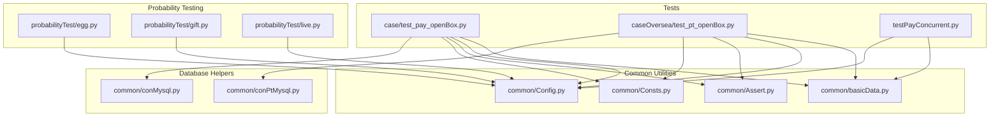
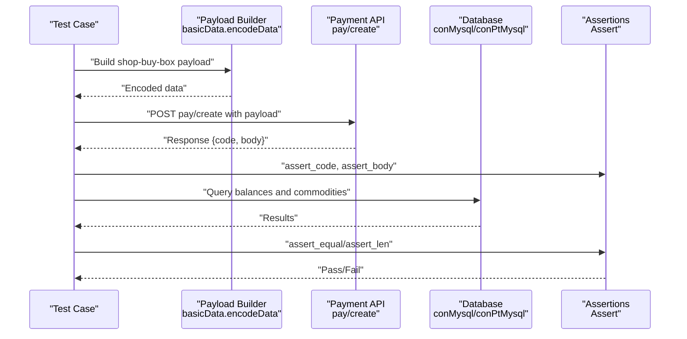
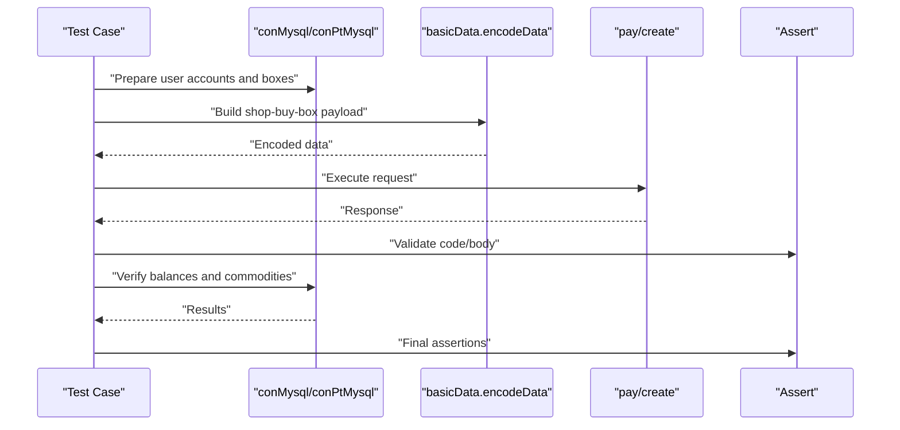
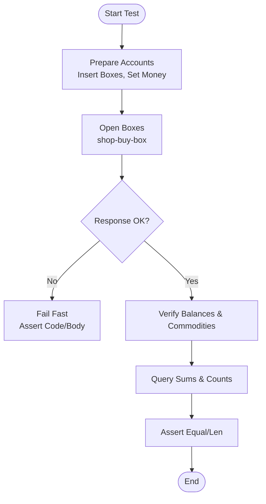
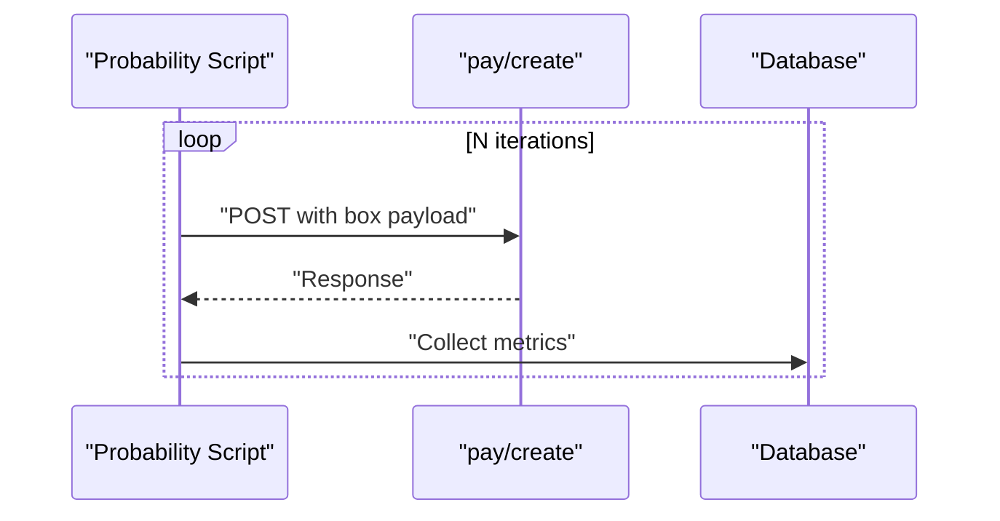
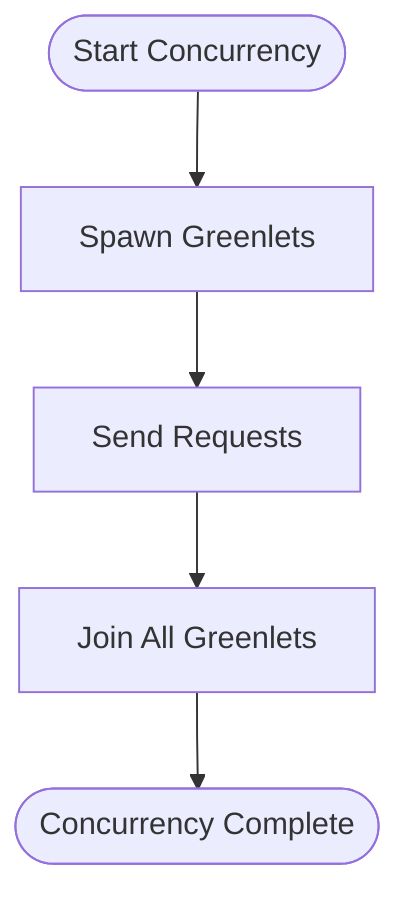
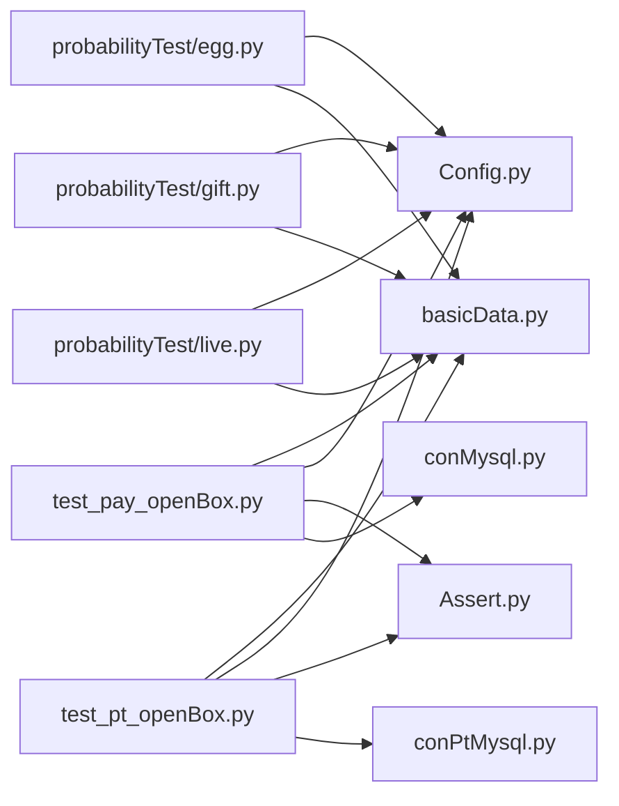

# Box Opening Validation

<cite>
**Referenced Files in This Document**
- [test_pay_openBox.py](file://case/test_pay_openBox.py)
- [test_pt_openBox.py](file://caseOversea/test_pt_openBox.py)
- [basicData.py](file://common/basicData.py)
- [Config.py](file://common/Config.py)
- [Assert.py](file://common/Assert.py)
- [Consts.py](file://common/Consts.py)
- [conMysql.py](file://common/conMysql.py)
- [conPtMysql.py](file://common/conPtMysql.py)
- [testPayConcurrent.py](file://testPayConcurrent.py)
- [egg.py](file://probabilityTest/egg.py)
- [gift.py](file://probabilityTest/gift.py)
- [live.py](file://probabilityTest/live.py)
</cite>

## Table of Contents
1. [Introduction](#introduction)
2. [Project Structure](#project-structure)
3. [Core Components](#core-components)
4. [Architecture Overview](#architecture-overview)
5. [Detailed Component Analysis](#detailed-component-analysis)
6. [Dependency Analysis](#dependency-analysis)
7. [Performance Considerations](#performance-considerations)
8. [Troubleshooting Guide](#troubleshooting-guide)
9. [Conclusion](#conclusion)
10. [Appendices](#appendices)

## Introduction
This document describes comprehensive validation for box opening workflows across silver, gold, and diamond tiers. It covers the end-to-end box opening process, reward distribution, inventory management, and statistical validation via probability testing. It also documents configuration parameters, reward calculation logic, and concurrent testing procedures. Examples include successful scenarios, reward verification, and probability analysis, alongside failure cases, refunds, and concurrency considerations.

## Project Structure
The repository organizes box opening tests under dedicated modules:
- Local box opening tests: case/test_pay_openBox.py
- Overseas box opening tests: caseOversea/test_pt_openBox.py
- Shared utilities: common/basicData.py, common/Config.py, common/Assert.py, common/Consts.py
- Database helpers: common/conMysql.py, common/conPtMysql.py
- Concurrency tests: testPayConcurrent.py
- Probability testing modules: probabilityTest/egg.py, probabilityTest/gift.py, probabilityTest/live.py

**Diagram sources**
- [test_pay_openBox.py:1-124](file://case/test_pay_openBox.py#L1-L124)
- [test_pt_openBox.py:1-133](file://caseOversea/test_pt_openBox.py#L1-L133)
- [basicData.py:157-176](file://common/basicData.py#L157-L176)
- [Config.py:49-133](file://common/Config.py#L49-L133)
- [Assert.py:1-96](file://common/Assert.py#L1-L96)
- [Consts.py:1-17](file://common/Consts.py#L1-L17)
- [conMysql.py:1-530](file://common/conMysql.py#L1-L530)
- [conPtMysql.py:1-345](file://common/conPtMysql.py#L1-L345)
- [testPayConcurrent.py:1-47](file://testPayConcurrent.py#L1-L47)
- [egg.py:1-259](file://probabilityTest/egg.py#L1-L259)
- [gift.py:1-112](file://probabilityTest/gift.py#L1-L112)
- [live.py:1-40](file://probabilityTest/live.py#L1-L40)

**Section sources**
- [test_pay_openBox.py:1-124](file://case/test_pay_openBox.py#L1-L124)
- [test_pt_openBox.py:1-133](file://caseOversea/test_pt_openBox.py#L1-L133)
- [basicData.py:157-176](file://common/basicData.py#L157-L176)
- [Config.py:49-133](file://common/Config.py#L49-L133)
- [Assert.py:1-96](file://common/Assert.py#L1-L96)
- [Consts.py:1-17](file://common/Consts.py#L1-L17)
- [conMysql.py:1-530](file://common/conMysql.py#L1-L530)
- [conPtMysql.py:1-345](file://common/conPtMysql.py#L1-L345)
- [testPayConcurrent.py:1-47](file://testPayConcurrent.py#L1-L47)
- [egg.py:1-259](file://probabilityTest/egg.py#L1-L259)
- [gift.py:1-112](file://probabilityTest/gift.py#L1-L112)
- [live.py:1-40](file://probabilityTest/live.py#L1-L40)

## Core Components
- Box opening request builder: constructs shop-buy-box payloads with boxType, money, num, cid, and opennum.
- Payment endpoint: pay/create with encoded parameters.
- Database assertions: balance checks, commodity counts, and payment change records.
- Probability testing: automated load and concurrency scripts for statistical validation.

Key responsibilities:
- Build box opening payloads with correct parameters (boxType, money, num, cid).
- Execute payment requests and validate response codes and body messages.
- Verify balances and inventory after box opening.
- Integrate with probability testing for long-running statistical validation.

**Section sources**
- [basicData.py:157-176](file://common/basicData.py#L157-L176)
- [test_pay_openBox.py:35-42](file://case/test_pay_openBox.py#L35-L42)
- [test_pt_openBox.py:43-48](file://caseOversea/test_pt_openBox.py#L43-L48)
- [Assert.py:11-85](file://common/Assert.py#L11-L85)
- [conMysql.py:52-92](file://common/conMysql.py#L52-L92)
- [conPtMysql.py:28-92](file://common/conPtMysql.py#L28-L92)

## Architecture Overview
The box opening validation pipeline integrates test orchestration, request construction, payment processing, and database verification.

**Diagram sources**
- [basicData.py:157-176](file://common/basicData.py#L157-L176)
- [test_pay_openBox.py:35-42](file://case/test_pay_openBox.py#L35-L42)
- [Assert.py:11-85](file://common/Assert.py#L11-L85)
- [conMysql.py:52-92](file://common/conMysql.py#L52-L92)

## Detailed Component Analysis

### Box Opening Workflow and Reward Distribution
- Local box opening:
  - Prepares user accounts, inserts boxes into inventory, sets money balances.
  - Calls shop-buy-box with boxType and num.
  - Verifies response success and asserts final balances and commodity totals.
- Overseas box opening:
  - Similar steps with region-specific tokens and endpoints.
  - Validates personal cash and payment change records.

**Diagram sources**
- [test_pay_openBox.py:30-43](file://case/test_pay_openBox.py#L30-L43)
- [test_pt_openBox.py:38-50](file://caseOversea/test_pt_openBox.py#L38-L50)
- [basicData.py:157-176](file://common/basicData.py#L157-L176)
- [conMysql.py:350-414](file://common/conMysql.py#L350-L414)
- [conPtMysql.py:214-263](file://common/conPtMysql.py#L214-L263)
- [Assert.py:11-85](file://common/Assert.py#L11-L85)

**Section sources**
- [test_pay_openBox.py:15-43](file://case/test_pay_openBox.py#L15-L43)
- [test_pt_openBox.py:23-50](file://caseOversea/test_pt_openBox.py#L23-L50)
- [basicData.py:157-176](file://common/basicData.py#L157-L176)
- [conMysql.py:350-414](file://common/conMysql.py#L350-L414)
- [conPtMysql.py:214-263](file://common/conPtMysql.py#L214-L263)
- [Assert.py:11-85](file://common/Assert.py#L11-L85)

### Box Opening Configuration Parameters
- Payload keys for shop-buy-box:
  - num: number of boxes to open
  - cid: commodity id of the box item
  - price: unit price per box
  - type: box tier (copper/silver/gold/diamond)
  - opennum: total opens
  - version, star, show_pac_man_guide, useCoin

These parameters are constructed in the payload builder and validated by tests.

**Section sources**
- [basicData.py:157-176](file://common/basicData.py#L157-L176)

### Reward Calculation Logic and Inventory Management
- Balances:
  - Sum of money accounts is checked after transactions.
  - Personal cash fields are verified for overseas scenarios.
- Commodities:
  - Total commodity count is asserted after box opening.
  - Specific commodity ids and quantities are inserted prior to tests.
- Payment change:
  - Payment change records are queried to validate distribution amounts.

**Diagram sources**
- [test_pay_openBox.py:30-43](file://case/test_pay_openBox.py#L30-L43)
- [test_pt_openBox.py:38-50](file://caseOversea/test_pt_openBox.py#L38-L50)
- [conMysql.py:52-92](file://common/conMysql.py#L52-L92)
- [conPtMysql.py:28-92](file://common/conPtMysql.py#L28-L92)

**Section sources**
- [conMysql.py:52-92](file://common/conMysql.py#L52-L92)
- [conPtMysql.py:28-92](file://common/conPtMysql.py#L28-L92)
- [Assert.py:42-95](file://common/Assert.py#L42-L95)

### Probability Validation Procedures
- Automated scripts simulate repeated box openings to collect statistical samples.
- Concurrency scripts spawn multiple greenlet workers to stress-test endpoints.
- Probability modules demonstrate request composition and payload encoding.

**Diagram sources**
- [egg.py:19-72](file://probabilityTest/egg.py#L19-L72)
- [gift.py:9-53](file://probabilityTest/gift.py#L9-L53)
- [live.py:9-26](file://probabilityTest/live.py#L9-L26)

**Section sources**
- [egg.py:19-72](file://probabilityTest/egg.py#L19-L72)
- [gift.py:9-53](file://probabilityTest/gift.py#L9-L53)
- [live.py:9-26](file://probabilityTest/live.py#L9-L26)

### Concurrent Box Opening Testing
- Spawns multiple greenlets to send concurrent requests.
- Demonstrates endpoint throughput and stability under load.

**Diagram sources**
- [testPayConcurrent.py:18-35](file://testPayConcurrent.py#L18-L35)

**Section sources**
- [testPayConcurrent.py:1-47](file://testPayConcurrent.py#L1-L47)

### Box Opening Failure Cases and Refund Procedures
- Failure detection:
  - Assert failures on response code or body message mismatch.
  - Assertions for equality and length thresholds.
- Refunds:
  - Tests do not explicitly trigger refunds; they validate outcomes after transactions.
  - If refunds occur, they would be reflected in reduced balances and commodity counts.

**Section sources**
- [Assert.py:11-95](file://common/Assert.py#L11-L95)
- [test_pay_openBox.py:39-43](file://case/test_pay_openBox.py#L39-L43)
- [test_pt_openBox.py:46-50](file://caseOversea/test_pt_openBox.py#L46-L50)

### Relationship Between Box Opening and Probability Testing
- Probability testing complements deterministic validations by generating large datasets for statistical analysis.
- Scripts reuse payload builders and configuration to maintain consistency with box opening logic.

**Section sources**
- [basicData.py:157-176](file://common/basicData.py#L157-L176)
- [Config.py:49-133](file://common/Config.py#L49-L133)
- [egg.py:19-72](file://probabilityTest/egg.py#L19-L72)
- [gift.py:9-53](file://probabilityTest/gift.py#L9-L53)
- [live.py:9-26](file://probabilityTest/live.py#L9-L26)

## Dependency Analysis
- Test modules depend on shared utilities for payload building, configuration, assertions, and database helpers.
- Probability scripts depend on configuration and payload builders to maintain parity with production payloads.

**Diagram sources**
- [test_pay_openBox.py:1-124](file://case/test_pay_openBox.py#L1-L124)
- [test_pt_openBox.py:1-133](file://caseOversea/test_pt_openBox.py#L1-L133)
- [basicData.py:157-176](file://common/basicData.py#L157-L176)
- [Config.py:49-133](file://common/Config.py#L49-L133)
- [Assert.py:1-96](file://common/Assert.py#L1-L96)
- [conMysql.py:1-530](file://common/conMysql.py#L1-L530)
- [conPtMysql.py:1-345](file://common/conPtMysql.py#L1-L345)
- [egg.py:1-259](file://probabilityTest/egg.py#L1-L259)
- [gift.py:1-112](file://probabilityTest/gift.py#L1-L112)
- [live.py:1-40](file://probabilityTest/live.py#L1-L40)

**Section sources**
- [test_pay_openBox.py:1-124](file://case/test_pay_openBox.py#L1-L124)
- [test_pt_openBox.py:1-133](file://caseOversea/test_pt_openBox.py#L1-L133)
- [basicData.py:157-176](file://common/basicData.py#L157-L176)
- [Config.py:49-133](file://common/Config.py#L49-L133)
- [Assert.py:1-96](file://common/Assert.py#L1-L96)
- [conMysql.py:1-530](file://common/conMysql.py#L1-L530)
- [conPtMysql.py:1-345](file://common/conPtMysql.py#L1-L345)
- [egg.py:1-259](file://probabilityTest/egg.py#L1-L259)
- [gift.py:1-112](file://probabilityTest/gift.py#L1-L112)
- [live.py:1-40](file://probabilityTest/live.py#L1-L40)

## Performance Considerations
- Concurrency:
  - Use greenlets to increase request throughput during load testing.
- Network and RPC delays:
  - Assertions include platform-aware sleep to mitigate transient RPC latency.
- Database operations:
  - Batch updates and commits are used to reduce overhead; ensure proper rollback on errors.

[No sources needed since this section provides general guidance]

## Troubleshooting Guide
- Assertion failures:
  - Review assert_code and assert_body for mismatches.
  - Use assert_len for threshold checks on balances.
- Database discrepancies:
  - Confirm commodity insertions and box refresh configurations.
  - Verify payment change records align with expected distributions.
- Concurrency issues:
  - Ensure headers and tokens are valid for target environments.
  - Monitor response rates and adjust spawn counts accordingly.

**Section sources**
- [Assert.py:11-95](file://common/Assert.py#L11-L95)
- [conMysql.py:390-414](file://common/conMysql.py#L390-L414)
- [conPtMysql.py:252-263](file://common/conPtMysql.py#L252-L263)
- [testPayConcurrent.py:13-28](file://testPayConcurrent.py#L13-L28)

## Conclusion
The box opening validation suite ensures reliable operation across local and overseas environments, with robust assertions on balances, commodities, and payment changes. Probability testing and concurrency scripts provide statistical and load validation. Together, these components form a comprehensive framework for validating box opening workflows, reward distribution, and system resilience.

[No sources needed since this section summarizes without analyzing specific files]

## Appendices
- Example scenarios:
  - Copper box single open and multi-open cases.
  - Silver box multi-open with expected commodity totals.
  - Room-given box scenarios verifying receiver balances.
- Probability analysis:
  - Automated scripts for sustained sampling and concurrency.
- Configuration references:
  - Endpoint URLs, gift ids, and user ids are centralized in configuration.

[No sources needed since this section provides general guidance]