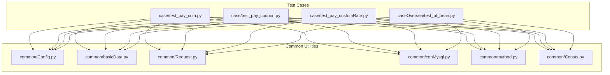
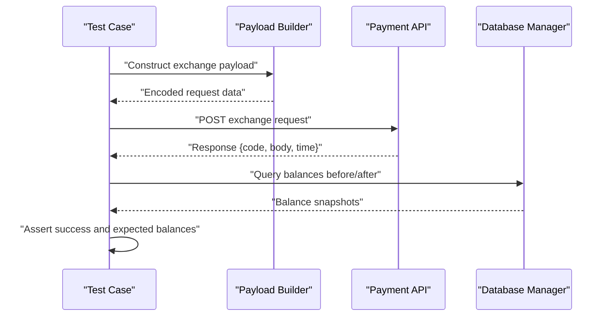
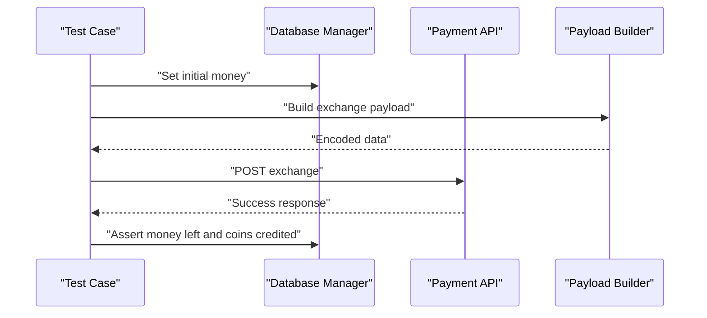
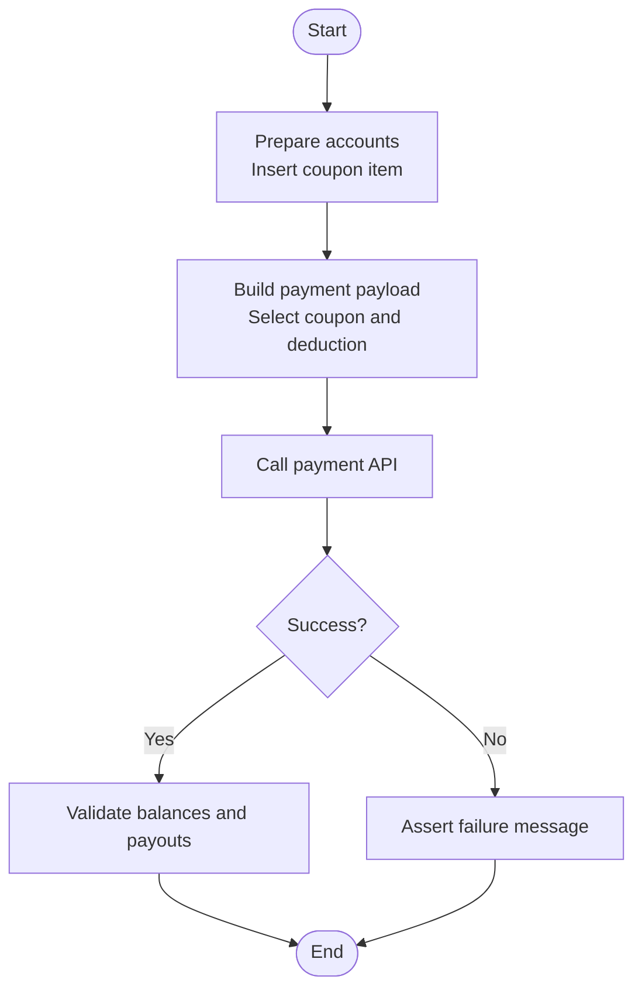
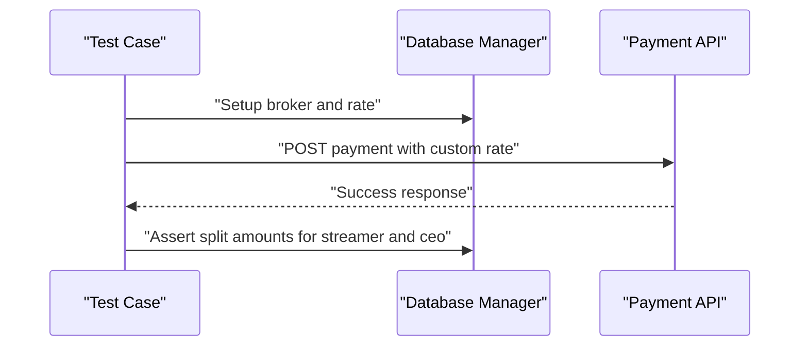
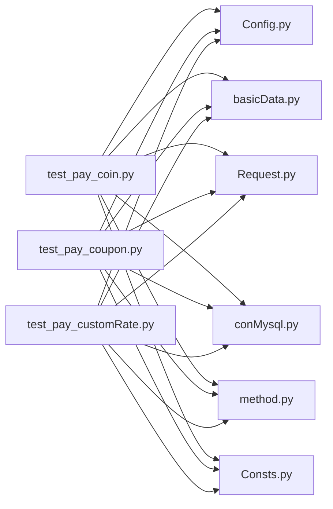

# Currency Exchange Operations

<cite>
**Referenced Files in This Document**
- [README.md](file://README.md)
- [test_pay_coin.py](file://case/test_pay_coin.py)
- [test_pay_coupon.py](file://case/test_pay_coupon.py)
- [test_pay_customRate.py](file://case/test_pay_customRate.py)
- [Config.py](file://common/Config.py)
- [basicData.py](file://common/basicData.py)
- [Request.py](file://common/Request.py)
- [conMysql.py](file://common/conMysql.py)
- [method.py](file://common/method.py)
- [Consts.py](file://common/Consts.py)
</cite>

## Table of Contents
1. [Introduction](#introduction)
2. [Project Structure](#project-structure)
3. [Core Components](#core-components)
4. [Architecture Overview](#architecture-overview)
5. [Detailed Component Analysis](#detailed-component-analysis)
6. [Dependency Analysis](#dependency-analysis)
7. [Performance Considerations](#performance-considerations)
8. [Troubleshooting Guide](#troubleshooting-guide)
9. [Conclusion](#conclusion)
10. [Appendices](#appendices)

## Introduction
This document explains the currency exchange operations implemented in the test suite, focusing on:
- Coin exchanges (balance-to-coin conversions)
- Coupon redemptions (discount/redemption via coupons)
- Custom rate conversions (guild broker splits and overrides)
- Exchange rate validation and configuration
- Currency conversion workflows and balance adjustments
- Exchange operation validation logic, rate limits, and exchange history tracking
- Examples of successful exchanges, rate verification, and balance reconciliation
- Failure handling, rate calculation errors, and audit procedures

The repository organizes tests under the case directory and supports multiple regions and currencies. Exchange logic is orchestrated by test scripts that prepare user accounts, construct exchange payloads, call payment APIs, and validate database balances.

## Project Structure
The repository is organized around reusable components and region-specific test suites:
- common: shared utilities for configuration, HTTP requests, database operations, and helpers
- case: region-specific exchange tests (coins, coupons, custom rates)
- caseOversea: overseas region exchange tests (beans-to-coins)
- Others: auxiliary configuration and documentation

**Diagram sources**
- [test_pay_coin.py:1-63](file://case/test_pay_coin.py#L1-L63)
- [test_pay_coupon.py:1-149](file://case/test_pay_coupon.py#L1-L149)
- [test_pay_customRate.py:1-172](file://case/test_pay_customRate.py#L1-L172)
- [Config.py:1-133](file://common/Config.py#L1-L133)
- [basicData.py:1-581](file://common/basicData.py#L1-L581)
- [Request.py:1-162](file://common/Request.py#L1-L162)
- [conMysql.py:1-530](file://common/conMysql.py#L1-L530)
- [method.py:1-171](file://common/method.py#L1-L171)
- [Consts.py:1-17](file://common/Consts.py#L1-L17)

**Section sources**
- [README.md:1-38](file://README.md#L1-L38)

## Core Components
- Configuration and constants define base URLs, exchange rates, user roles, gift IDs, and room IDs used across tests.
- Payload builder constructs exchange requests with parameters such as money amount, gift ID/type, coupon usage, and exchange flags.
- HTTP client sends signed requests to payment endpoints and captures response metadata.
- Database manager updates and queries user balances, coupons, guild broker rates, and exchange history.
- Helpers validate responses, compute VIP/exp-based adjustments, and manage retry logic.

Key responsibilities:
- Exchange rate configuration: central rate constant and per-scenario overrides
- Exchange payload construction: exchange type, money, gift, coupon, and multi-user distribution
- Payment API invocation: session-based request with token and response parsing
- Balance validation: pre/post checks against multiple money accounts
- History tracking: exchange reason inspection via recent payment change records

**Section sources**
- [Config.py:49-88](file://common/Config.py#L49-L88)
- [basicData.py:9-325](file://common/basicData.py#L9-L325)
- [Request.py:17-59](file://common/Request.py#L17-L59)
- [conMysql.py:27-204](file://common/conMysql.py#L27-L204)
- [method.py:115-171](file://common/method.py#L115-L171)

## Architecture Overview
The exchange workflow follows a consistent pattern across coin, coupon, and custom rate scenarios:

**Diagram sources**
- [test_pay_coin.py:27-33](file://case/test_pay_coin.py#L27-L33)
- [test_pay_coupon.py:28-35](file://case/test_pay_coupon.py#L28-L35)
- [test_pay_customRate.py:35-50](file://case/test_pay_customRate.py#L35-L50)
- [basicData.py:9-325](file://common/basicData.py#L9-L325)
- [Request.py:17-59](file://common/Request.py#L17-L59)
- [conMysql.py:27-73](file://common/conMysql.py#L27-L73)

## Detailed Component Analysis

### Exchange Rate Configuration and Validation
- Centralized rate constant defines the default commercial room split ratio used in multiple scenarios.
- Tests override or query guild broker rates to validate custom splits and verify final distributions.

Validation steps:
- Confirm default rate constant presence and value
- Verify broker rate insertion/update and retrieval
- Cross-check computed payouts against configured rates

**Section sources**
- [Config.py:57-58](file://common/Config.py#L57-L58)
- [test_pay_customRate.py:38-50](file://case/test_pay_customRate.py#L38-L50)
- [conMysql.py:504-529](file://common/conMysql.py#L504-L529)

### Coin Exchanges (Balance-to-Coin Conversions)
Workflow:
- Prepare user account with initial money
- Construct exchange payload for coin conversion
- Call payment endpoint and assert success
- Verify remaining money and credited coin balances

Examples:
- Successful coin exchange reduces money and credits coins as expected
- Room gift payments distribute coins among recipients with VIP-based adjustments

**Section sources**
- [test_pay_coin.py:16-33](file://case/test_pay_coin.py#L16-L33)
- [test_pay_coin.py:36-62](file://case/test_pay_coin.py#L36-L62)
- [basicData.py:249-258](file://common/basicData.py#L249-L258)
- [conMysql.py:349-360](file://common/conMysql.py#L349-L360)

### Coupon Redemptions
Workflow:
- Prepare user accounts and insert coupon items with activation state
- Construct payment payload with coupon selection and deduction amount
- Execute payment and validate success/failure messages
- Verify final balances and coupon consumption

Coupon scenarios validated:
- Insufficient balance triggers payment failure
- Unactivated coupon prevents discount usage
- Activated coupon applies discount and distributes proceeds

**Section sources**
- [test_pay_coupon.py:17-36](file://case/test_pay_coupon.py#L17-L36)
- [test_pay_coupon.py:38-66](file://case/test_pay_coupon.py#L38-L66)
- [test_pay_coupon.py:68-94](file://case/test_pay_coupon.py#L68-L94)
- [test_pay_coupon.py:96-120](file://case/test_pay_coupon.py#L96-L120)
- [test_pay_coupon.py:122-148](file://case/test_pay_coupon.py#L122-L148)
- [conMysql.py:403-414](file://common/conMysql.py#L403-L414)

### Custom Rate Conversions (Guild Broker Splits)
Workflow:
- Configure guild broker relationship and custom rate
- Execute payment and validate split distribution
- Verify balances for streamer and guild ceo according to custom rate

Scenarios covered:
- Commercial room gifts with 50% custom split
- Private chat gifts with 80% custom split
- Personal defend gifts with 25% custom split
- Live guild room/private chat with 70%/0% custom splits

**Section sources**
- [test_pay_customRate.py:23-50](file://case/test_pay_customRate.py#L23-L50)
- [test_pay_customRate.py:52-79](file://case/test_pay_customRate.py#L52-L79)
- [test_pay_customRate.py:81-109](file://case/test_pay_customRate.py#L81-L109)
- [test_pay_customRate.py:111-140](file://case/test_pay_customRate.py#L111-L140)
- [test_pay_customRate.py:142-171](file://case/test_pay_customRate.py#L142-L171)
- [conMysql.py:477-501](file://common/conMysql.py#L477-L501)
- [conMysql.py:504-529](file://common/conMysql.py#L504-L529)

### Exchange Operation Validation Logic
Validation includes:
- Response code and success flag checks
- Message assertions for insufficient balance scenarios
- Balance assertions across multiple money accounts
- VIP/exp-based adjustments for gift payouts

**Section sources**
- [test_pay_coin.py:30-33](file://case/test_pay_coin.py#L30-L33)
- [test_pay_coin.py:55-58](file://case/test_pay_coin.py#L55-L58)
- [test_pay_coupon.py:32-35](file://case/test_pay_coupon.py#L32-L35)
- [test_pay_coupon.py:61-65](file://case/test_pay_coupon.py#L61-L65)
- [method.py:115-122](file://common/method.py#L115-L122)
- [method.py:163-170](file://common/method.py#L163-L170)

### Rate Limit Enforcement
- Retry decorator applied to selected test methods to mitigate transient failures
- No explicit server-side rate limiting observed in the test code; focus is on correctness and balance reconciliation

**Section sources**
- [test_pay_coin.py:13-13](file://case/test_pay_coin.py#L13-L13)
- [test_pay_coupon.py:12-12](file://case/test_pay_coupon.py#L12-L12)
- [test_pay_customRate.py:12-12](file://case/test_pay_customRate.py#L12-L12)

### Exchange History Tracking
- Exchange reason inspection leverages recent payment change records
- Tests record pass/fail outcomes and timestamps for reporting

**Section sources**
- [conMysql.py:189-201](file://common/conMysql.py#L189-L201)
- [Consts.py:4-16](file://common/Consts.py#L4-L16)

## Dependency Analysis
The exchange tests depend on shared utilities for configuration, payload building, HTTP requests, and database operations.

**Diagram sources**
- [test_pay_coin.py:1-10](file://case/test_pay_coin.py#L1-L10)
- [test_pay_coupon.py:1-9](file://case/test_pay_coupon.py#L1-L9)
- [test_pay_customRate.py:1-9](file://case/test_pay_customRate.py#L1-L9)
- [Config.py:1-133](file://common/Config.py#L1-L133)
- [basicData.py:1-581](file://common/basicData.py#L1-L581)
- [Request.py:1-162](file://common/Request.py#L1-L162)
- [conMysql.py:1-530](file://common/conMysql.py#L1-L530)
- [method.py:1-171](file://common/method.py#L1-L171)
- [Consts.py:1-17](file://common/Consts.py#L1-L17)

**Section sources**
- [test_pay_coin.py:1-10](file://case/test_pay_coin.py#L1-L10)
- [test_pay_coupon.py:1-9](file://case/test_pay_coupon.py#L1-L9)
- [test_pay_customRate.py:1-9](file://case/test_pay_customRate.py#L1-L9)

## Performance Considerations
- Network latency and response times are captured during API calls; tests do not enforce strict SLAs
- Database operations use batch updates and commits; ensure test isolation to avoid contention
- Payload building is lightweight; most overhead comes from network and database round-trips

[No sources needed since this section provides general guidance]

## Troubleshooting Guide
Common issues and resolutions:
- Payment failures due to insufficient balance: verify initial money setup and coupon availability
- Coupon redemption errors: confirm coupon state and insertion; ensure deduction amount aligns with coupon value
- Custom rate discrepancies: validate broker setup and rate configuration before execution
- Balance mismatches: cross-check multiple money accounts and exchange history records

Audit and compliance:
- Record pass/fail outcomes and reasons for each scenario
- Track exchange timestamps and payment change reasons for reconciliation
- Re-run flaky tests using retry decorators to reduce false negatives

**Section sources**
- [test_pay_coin.py:17-36](file://case/test_pay_coin.py#L17-L36)
- [test_pay_coupon.py:17-36](file://case/test_pay_coupon.py#L17-L36)
- [test_pay_customRate.py:23-50](file://case/test_pay_customRate.py#L23-L50)
- [method.py:115-122](file://common/method.py#L115-L122)
- [Consts.py:4-16](file://common/Consts.py#L4-L16)

## Conclusion
The test suite provides comprehensive coverage of currency exchange operations across coin exchanges, coupon redemptions, and custom rate conversions. It validates exchange rate configuration, conversion workflows, and balance adjustments while offering robust validation logic, retry mechanisms, and history tracking. The modular design of shared utilities enables maintainable and extensible testing for diverse regional and currency contexts.

[No sources needed since this section summarizes without analyzing specific files]

## Appendices

### Example Scenarios and Expected Outcomes
- Coin exchange: money reduced by exchanged amount; coins credited accordingly
- Room gift payment: payer’s coins deducted; recipients’ coins distributed per configuration and VIP adjustments
- Coupon redemption: activated coupon applies discount; unactivated coupon blocks payment
- Custom rate split: guild ceo and streamer receive shares based on configured rate

**Section sources**
- [test_pay_coin.py:16-33](file://case/test_pay_coin.py#L16-L33)
- [test_pay_coin.py:36-62](file://case/test_pay_coin.py#L36-L62)
- [test_pay_coupon.py:68-94](file://case/test_pay_coupon.py#L68-L94)
- [test_pay_customRate.py:23-50](file://case/test_pay_customRate.py#L23-L50)