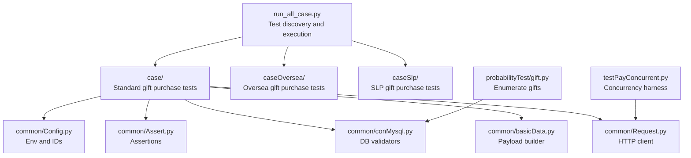
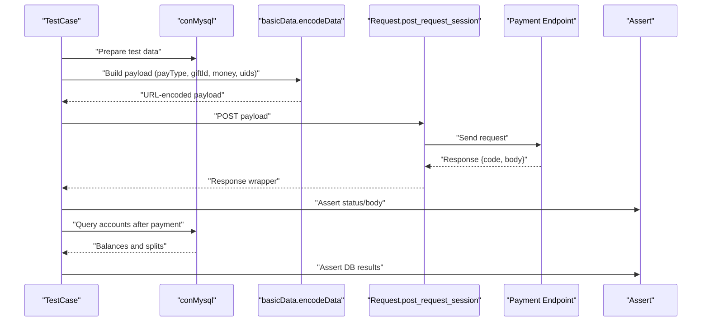
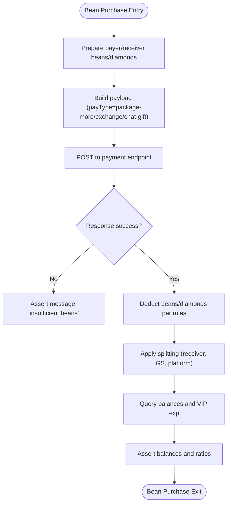
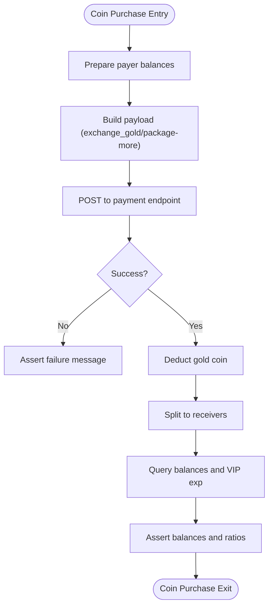
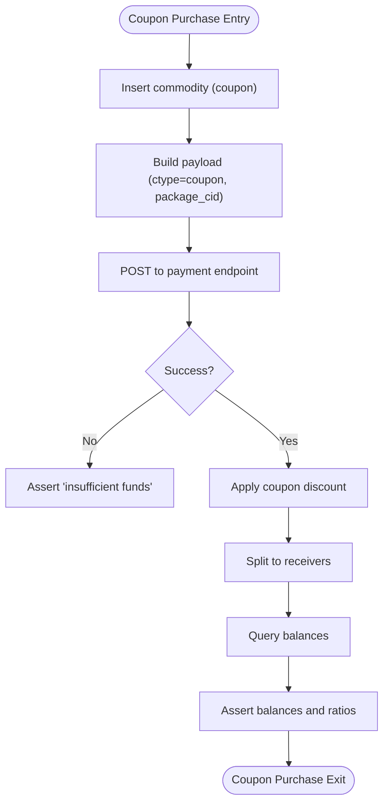
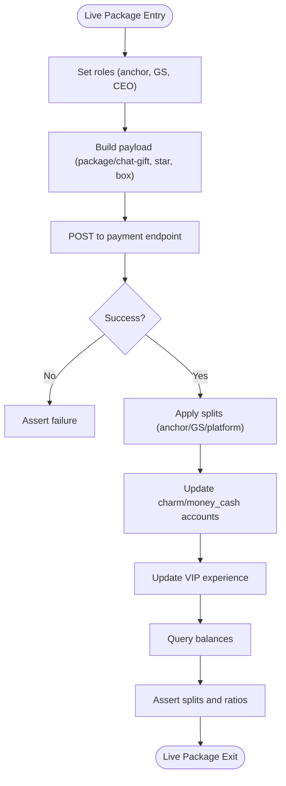
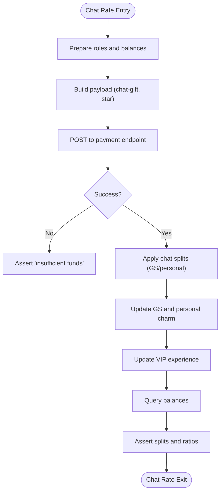
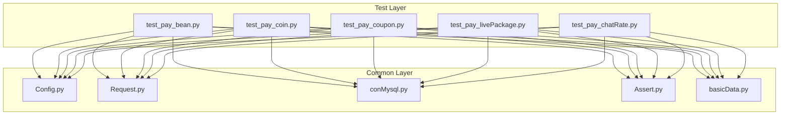

# Gift Purchase Testing

<cite>
**Referenced Files in This Document**
- [README.md](file://README.md)
- [run_all_case.py](file://run_all_case.py)
- [common/Config.py](file://common/Config.py)
- [common/Consts.py](file://common/Consts.py)
- [common/Assert.py](file://common/Assert.py)
- [common/basicData.py](file://common/basicData.py)
- [common/conMysql.py](file://common/conMysql.py)
- [common/Request.py](file://common/Request.py)
- [case/test_pay_bean.py](file://case/test_pay_bean.py)
- [case/test_pay_coin.py](file://case/test_pay_coin.py)
- [case/test_pay_coupon.py](file://case/test_pay_coupon.py)
- [case/test_pay_livePackage.py](file://case/test_pay_livePackage.py)
- [case/test_pay_chatRate.py](file://case/test_pay_chatRate.py)
- [probabilityTest/gift.py](file://probabilityTest/gift.py)
- [testPayConcurrent.py](file://testPayConcurrent.py)
</cite>

## Table of Contents
1. [Introduction](#introduction)
2. [Project Structure](#project-structure)
3. [Core Components](#core-components)
4. [Architecture Overview](#architecture-overview)
5. [Detailed Component Analysis](#detailed-component-analysis)
6. [Dependency Analysis](#dependency-analysis)
7. [Performance Considerations](#performance-considerations)
8. [Troubleshooting Guide](#troubleshooting-guide)
9. [Conclusion](#conclusion)
10. [Appendices](#appendices)

## Introduction
This document describes comprehensive gift purchase testing scenarios across multiple platforms and environments. It covers single-user gift purchases, multi-user transactions, chat room gift systems, and specialized gift types including beans, coins, coupons, and live packages. It explains validation logic, payment flow verification, and recipient account updates. It also documents configuration requirements, expected outcomes, database validation procedures, examples of success/failure scenarios, integration with the assertion engine, error handling, refunds, and concurrent gift purchase testing.

## Project Structure
The repository organizes test suites per product area under dedicated directories. Gift purchase tests are primarily located under:
- case/: Standard product tests for gift purchases (beans, coins, coupons, live packages, chat rates)
- caseOversea/: Overseas product tests (PT) for gift purchases
- caseSlp/: SLP product tests
- common/: Shared utilities for configuration, assertions, HTTP requests, database helpers, and data encoding
- probabilityTest/: Utility scripts for gift enumeration and load-style testing
- Root scripts: Execution orchestration and concurrency utilities

**Diagram sources**
- [run_all_case.py:126-147](file://run_all_case.py#L126-L147)
- [common/basicData.py:8-325](file://common/basicData.py#L8-L325)
- [common/Request.py:17-59](file://common/Request.py#L17-L59)
- [common/conMysql.py:8-530](file://common/conMysql.py#L8-L530)
- [common/Assert.py:11-96](file://common/Assert.py#L11-L96)
- [common/Config.py:6-133](file://common/Config.py#L6-L133)
- [probabilityTest/gift.py:9-112](file://probabilityTest/gift.py#L9-L112)
- [testPayConcurrent.py:9-47](file://testPayConcurrent.py#L9-L47)

**Section sources**
- [README.md:1-38](file://README.md#L1-L38)
- [run_all_case.py:126-147](file://run_all_case.py#L126-L147)

## Core Components
- Configuration and constants: Centralized environment URLs, user IDs, gift IDs, and rate constants.
- Payload builder: Encodes request payloads for various gift types and scenarios (room, chat, exchange, shop buy, etc.).
- HTTP client: Sends POST requests to payment endpoints with session tokens.
- Database validators: Reads and writes user balances, commodities, profiles, and related metadata.
- Assertions: Provides standardized assertion helpers for status codes, equality, ranges, and JSON body checks.
- Test runners: Discover and execute tests per product area; support retries and reporting.

Key responsibilities:
- Validate payment endpoint responses and side effects in the database.
- Enforce gift-type-specific rules (beans vs coins vs coupons vs live packages).
- Verify splitting logic across recipients (individual, GS, union, fleet, platform).

**Section sources**
- [common/Config.py:6-133](file://common/Config.py#L6-L133)
- [common/basicData.py:8-325](file://common/basicData.py#L8-L325)
- [common/Request.py:17-59](file://common/Request.py#L17-L59)
- [common/conMysql.py:28-204](file://common/conMysql.py#L28-L204)
- [common/Assert.py:11-96](file://common/Assert.py#L11-L96)

## Architecture Overview
The gift purchase testing pipeline follows a consistent flow:
- Prepare test data via database helpers.
- Build request payload using the payload builder.
- Send HTTP request to the payment endpoint.
- Validate HTTP status and response body.
- Query database to confirm account updates and splits.
- Record results and reasons for failures.

**Diagram sources**
- [common/basicData.py:8-325](file://common/basicData.py#L8-L325)
- [common/Request.py:17-59](file://common/Request.py#L17-L59)
- [common/conMysql.py:28-204](file://common/conMysql.py#L28-L204)
- [common/Assert.py:11-96](file://common/Assert.py#L11-L96)

## Detailed Component Analysis

### Beans (Gold/Beans Gift Type)
Focus areas:
- Insufficient bean balance handling.
- Bean-to-diamond conversion scenarios.
- Private chat vs room differences in fee deduction.
- Multi-user distribution and VIP experience updates.

Representative tests:
- Insufficient beans for bean gift.
- Successful bean gift with sufficient balance.
- Bean-to-diamond exchange with partial coverage.
- Private chat gift with beans not offsetting fees.
- Room gift with beans not offsetting fees.

Validation targets:
- Response success flag and messages.
- Payer’s bean balance and diamond balance.
- Recipient(s) bean balance.
- VIP experience increments.

**Diagram sources**
- [case/test_pay_bean.py:37-158](file://case/test_pay_bean.py#L37-L158)
- [common/basicData.py:8-156](file://common/basicData.py#L8-L156)
- [common/conMysql.py:28-103](file://common/conMysql.py#L28-L103)
- [common/Assert.py:11-96](file://common/Assert.py#L11-L96)

**Section sources**
- [case/test_pay_bean.py:37-158](file://case/test_pay_bean.py#L37-L158)

### Coins (Gold Coin Gift Type)
Focus areas:
- Exchange money to gold coin.
- Room gift with gold coin payment.
- Multi-user distribution and VIP experience updates.

Representative tests:
- Money-to-gold-coin exchange.
- Room gift with gold coin payment and splitting.

Validation targets:
- Exchange correctness and balances.
- Splitting to receivers and VIP experience.

**Diagram sources**
- [case/test_pay_coin.py:16-62](file://case/test_pay_coin.py#L16-L62)
- [common/basicData.py:249-258](file://common/basicData.py#L249-L258)
- [common/conMysql.py:28-103](file://common/conMysql.py#L28-L103)
- [common/Assert.py:11-96](file://common/Assert.py#L11-L96)

**Section sources**
- [case/test_pay_coin.py:16-62](file://case/test_pay_coin.py#L16-L62)

### Coupons (Coupon Gift Type)
Focus areas:
- Unactivated coupon usage.
- Activated coupon usage with discount.
- Multi-user room gift with coupons.
- Radio/defend room usage with coupons.

Representative tests:
- No money but coupon not activated.
- Coupon activated and applied.
- Multi-user room gift with coupon discount.
- Radio room with bronze experience coupon.

Validation targets:
- Message “insufficient funds” when coupon not usable.
- Correct discount application and remaining balances.
- Distribution to multiple recipients and GS cuts.

**Diagram sources**
- [case/test_pay_coupon.py:17-148](file://case/test_pay_coupon.py#L17-L148)
- [common/basicData.py:8-325](file://common/basicData.py#L8-L325)
- [common/conMysql.py:28-103](file://common/conMysql.py#L28-L103)
- [common/Assert.py:11-96](file://common/Assert.py#L11-L96)

**Section sources**
- [case/test_pay_coupon.py:17-148](file://case/test_pay_coupon.py#L17-L148)

### Live Packages (Room-based Gift Packages)
Focus areas:
- Live room gift with GS/union/fleet splits.
- Chat gift with GS/union/fleet splits.
- Box gifts with star multipliers.
- Knight defend and radio defend with coupons.

Representative tests:
- Live room gift with CEO split (60:21).
- Live room box gift with CEOSplit (60:21).
- Knight defend with GS cut (60:21).
- Chat gift with GS split (60:20).
- Chat box gift with GS split (60:20).
- Non-live room gift to personal charm (70%).
- Under-role gift with 62:38 split.

Validation targets:
- Exact splits to anchor, GS, and platform.
- Charm account updates and VIP experience.

**Diagram sources**
- [case/test_pay_livePackage.py:20-247](file://case/test_pay_livePackage.py#L20-L247)
- [common/basicData.py:8-325](file://common/basicData.py#L8-L325)
- [common/conMysql.py:28-103](file://common/conMysql.py#L28-L103)
- [common/Assert.py:11-96](file://common/Assert.py#L11-L96)

**Section sources**
- [case/test_pay_livePackage.py:20-247](file://case/test_pay_livePackage.py#L20-L247)

### Chat Rates (Private Chat Gift System)
Focus areas:
- Private chat gift with insufficient funds.
- Private chat gift with GS receiving 72% (42% GS charm + 30% personal charm).
- Private chat box gift with GS split.
- Private chat gift to normal user (72% personal charm).
- Private chat box gift to master (80% personal charm).

Representative tests:
- Private chat gift with insufficient funds.
- Private chat gift to GS with mixed charm splits.
- Private chat box gift to GS.
- Private chat gift to normal user.
- Private chat box gift to master.

Validation targets:
- Message “insufficient funds” when balance low.
- Correct GS and personal charm distributions.
- VIP experience updates.

**Diagram sources**
- [case/test_pay_chatRate.py:16-141](file://case/test_pay_chatRate.py#L16-L141)
- [common/basicData.py:134-156](file://common/basicData.py#L134-L156)
- [common/conMysql.py:28-103](file://common/conMysql.py#L28-L103)
- [common/Assert.py:11-96](file://common/Assert.py#L11-L96)

**Section sources**
- [case/test_pay_chatRate.py:16-141](file://case/test_pay_chatRate.py#L16-L141)

### Overseas (PT) Gift Tests
Overview:
- PT tests mirror standard gift flows with PT-specific IDs and rooms.
- Payload builder supports PT variants (package, package-more, exchange_gold, chat-gift, shop-buy, shop-buy-box, coin-shop-buy, exchange_gold).

Execution:
- Tests are discovered and executed similarly to standard tests.

**Section sources**
- [common/basicData.py:327-565](file://common/basicData.py#L327-L565)
- [run_all_case.py:126-147](file://run_all_case.py#L126-L147)

### SLP Gift Tests
Overview:
- SLP tests reside under caseSlp and follow similar patterns with SLP-specific IDs and configurations.

Execution:
- Tests are discovered and executed similarly to standard tests.

**Section sources**
- [run_all_case.py:126-147](file://run_all_case.py#L126-L147)

## Dependency Analysis
Key dependencies and interactions:
- Test classes depend on shared utilities for payload building, HTTP requests, database validation, and assertions.
- Payment endpoint URLs and user/gift IDs are centralized in configuration.
- Database helpers encapsulate SQL queries and updates to maintain test isolation and repeatability.
- Concurrency harness uses gevent to simulate concurrent gift purchases.

**Diagram sources**
- [case/test_pay_bean.py:14-188](file://case/test_pay_bean.py#L14-L188)
- [case/test_pay_coin.py:13-63](file://case/test_pay_coin.py#L13-L63)
- [case/test_pay_coupon.py:12-149](file://case/test_pay_coupon.py#L12-L149)
- [case/test_pay_livePackage.py:12-248](file://case/test_pay_livePackage.py#L12-L248)
- [case/test_pay_chatRate.py:13-142](file://case/test_pay_chatRate.py#L13-L142)
- [common/Config.py:6-133](file://common/Config.py#L6-L133)
- [common/Request.py:17-59](file://common/Request.py#L17-L59)
- [common/conMysql.py:8-530](file://common/conMysql.py#L8-L530)
- [common/Assert.py:11-96](file://common/Assert.py#L11-L96)
- [common/basicData.py:8-325](file://common/basicData.py#L8-L325)

**Section sources**
- [common/Config.py:6-133](file://common/Config.py#L6-L133)
- [common/Request.py:17-59](file://common/Request.py#L17-L59)
- [common/conMysql.py:8-530](file://common/conMysql.py#L8-L530)
- [common/Assert.py:11-96](file://common/Assert.py#L11-L96)
- [common/basicData.py:8-325](file://common/basicData.py#L8-L325)

## Performance Considerations
- Network latency: Assertions introduce small delays on non-production nodes to accommodate RPC timing.
- Database operations: Batch updates and commits are used to minimize overhead; ensure proper rollback on exceptions.
- Concurrency: Use gevent-based harness to simulate bursts; monitor endpoint throughput and error rates.
- Payload generation: Reuse encoded payloads and avoid unnecessary recomputation.

[No sources needed since this section provides general guidance]

## Troubleshooting Guide
Common issues and resolutions:
- Insufficient funds:
  - Validate balances before payment and assert failure messages.
  - Check coupon activation state and discount eligibility.
- Bean-related issues:
  - Confirm bean/diamond conversion rules and fee offsets in private vs room contexts.
- Multi-user splits:
  - Verify uids and positions; ensure correct distribution to receivers and GS.
- VIP experience:
  - Confirm VIP experience increments align with paid amounts.
- Database inconsistencies:
  - Use cleanup helpers to reset accounts and commodities prior to tests.
- Concurrency anomalies:
  - Run isolated test sets; monitor for race conditions and endpoint throttling.

**Section sources**
- [common/Assert.py:11-96](file://common/Assert.py#L11-L96)
- [common/conMysql.py:206-272](file://common/conMysql.py#L206-L272)
- [case/test_pay_bean.py:37-158](file://case/test_pay_bean.py#L37-L158)
- [case/test_pay_coupon.py:17-148](file://case/test_pay_coupon.py#L17-L148)
- [case/test_pay_livePackage.py:20-247](file://case/test_pay_livePackage.py#L20-L247)
- [case/test_pay_chatRate.py:16-141](file://case/test_pay_chatRate.py#L16-L141)

## Conclusion
The gift purchase testing suite provides robust coverage across multiple platforms and gift types. By leveraging shared utilities for payload construction, HTTP requests, database validation, and assertions, the suite ensures consistent validation of payment flows, splits, and account updates. The modular design allows easy extension to new gift types and environments, while concurrency and retry mechanisms improve reliability and throughput.

[No sources needed since this section summarizes without analyzing specific files]

## Appendices

### Configuration Requirements
- Environment URLs and user IDs:
  - Payment endpoint URLs and user IDs are centralized for standard and overseas products.
- Gift IDs:
  - Gift IDs for beans, coins, coupons, and live packages are maintained centrally.
- Rates:
  - Platform and GS split rates are configured for accurate distribution calculations.

**Section sources**
- [common/Config.py:6-133](file://common/Config.py#L6-L133)

### Expected Transaction Outcomes
- Success:
  - Response success flag set; balances updated; splits applied.
- Failure:
  - Response success flag unset; appropriate message asserted; balances unchanged.

**Section sources**
- [common/Assert.py:11-96](file://common/Assert.py#L11-L96)
- [case/test_pay_bean.py:37-158](file://case/test_pay_bean.py#L37-L158)
- [case/test_pay_coin.py:16-62](file://case/test_pay_coin.py#L16-L62)
- [case/test_pay_coupon.py:17-148](file://case/test_pay_coupon.py#L17-L148)
- [case/test_pay_livePackage.py:20-247](file://case/test_pay_livePackage.py#L20-L247)
- [case/test_pay_chatRate.py:16-141](file://case/test_pay_chatRate.py#L16-L141)

### Database Validation Procedures
- Selectors:
  - Retrieve bean, cash, sum money, single money, commodity counts, VIP experience, and related metadata.
- Updaters:
  - Reset balances, insert beans, update user profiles, and manage commodities.
- Cleanup:
  - Remove commodities and reset user money before/after tests.

**Section sources**
- [common/conMysql.py:28-204](file://common/conMysql.py#L28-L204)
- [common/conMysql.py:274-530](file://common/conMysql.py#L274-L530)

### Examples of Gift Purchase Execution
- Single-user room gift with beans and diamonds.
- Multi-user room gift with coins and coupons.
- Private chat gift with GS receiving mixed charm splits.
- Live package with knight defend and radio defend.

**Section sources**
- [case/test_pay_bean.py:37-158](file://case/test_pay_bean.py#L37-L158)
- [case/test_pay_coin.py:16-62](file://case/test_pay_coin.py#L16-L62)
- [case/test_pay_coupon.py:17-148](file://case/test_pay_coupon.py#L17-L148)
- [case/test_pay_livePackage.py:20-247](file://case/test_pay_livePackage.py#L20-L247)
- [case/test_pay_chatRate.py:16-141](file://case/test_pay_chatRate.py#L16-L141)

### Integration with Assertion Engine
- Status code assertions.
- Body field assertions.
- Equality and range assertions.
- Text containment checks.

**Section sources**
- [common/Assert.py:11-96](file://common/Assert.py#L11-L96)

### Gift-Specific Error Handling and Refunds
- Insufficient funds:
  - Assert failure and message; verify no balance changes.
- Coupon not activated:
  - Assert failure and message; verify coupon remains unused.
- VIP experience adjustments:
  - Validate increments based on paid amounts.

**Section sources**
- [case/test_pay_bean.py:37-158](file://case/test_pay_bean.py#L37-L158)
- [case/test_pay_coupon.py:17-148](file://case/test_pay_coupon.py#L17-L148)

### Concurrent Gift Purchase Testing
- Harness:
  - Uses gevent to spawn multiple concurrent requests.
- Best practices:
  - Isolate test data; monitor endpoint response times and error rates.

**Section sources**
- [testPayConcurrent.py:9-47](file://testPayConcurrent.py#L9-L47)