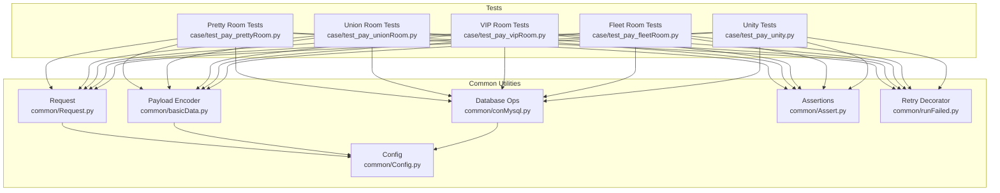
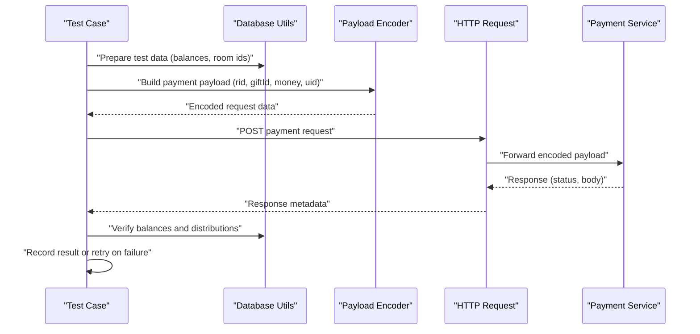
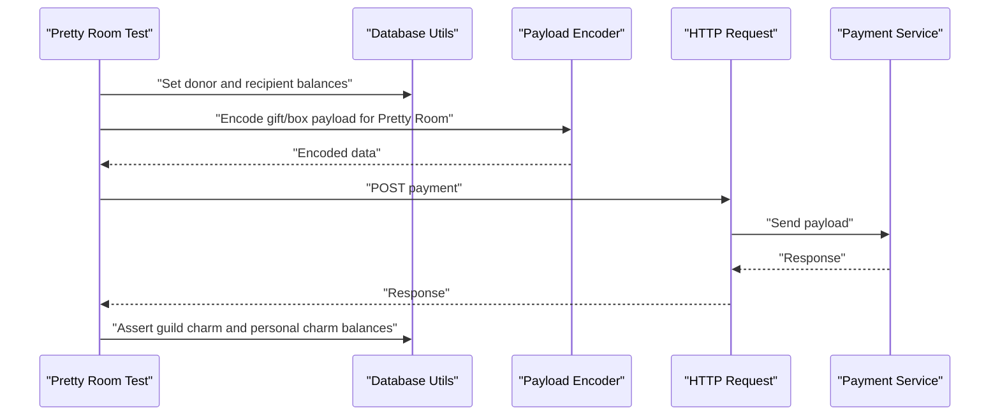
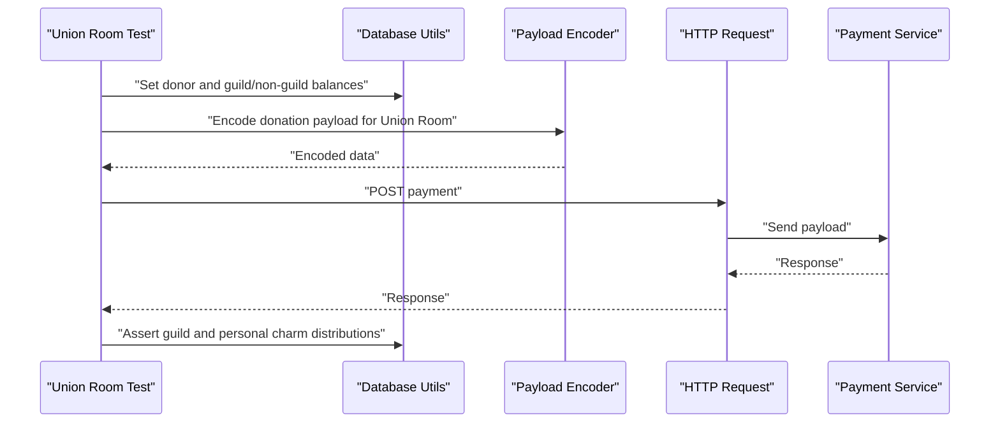
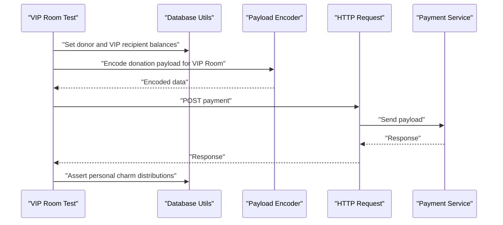
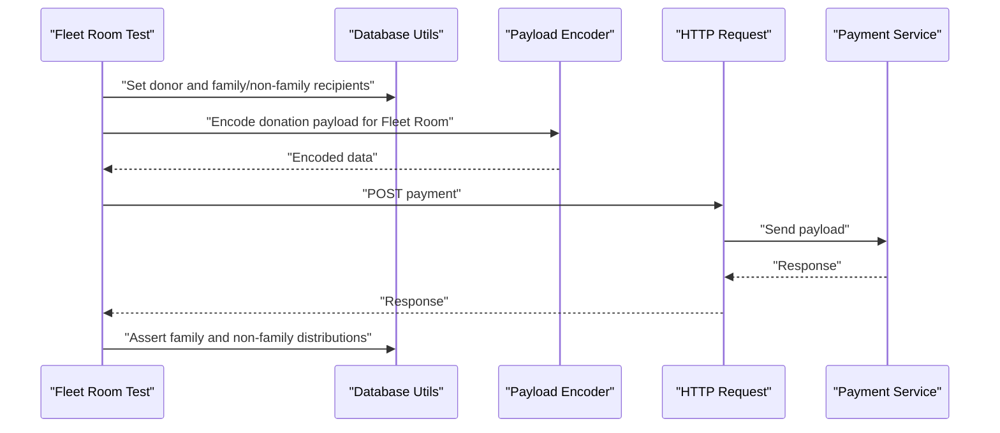
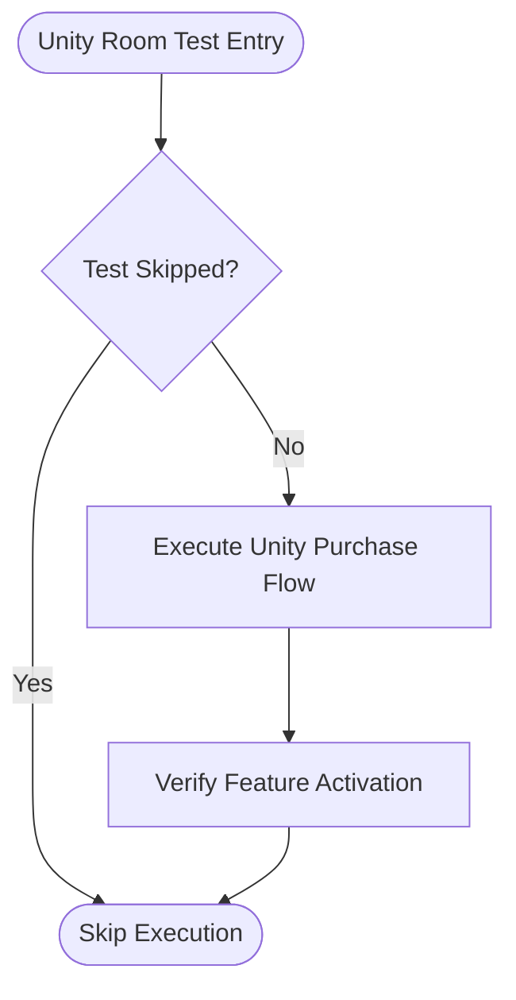
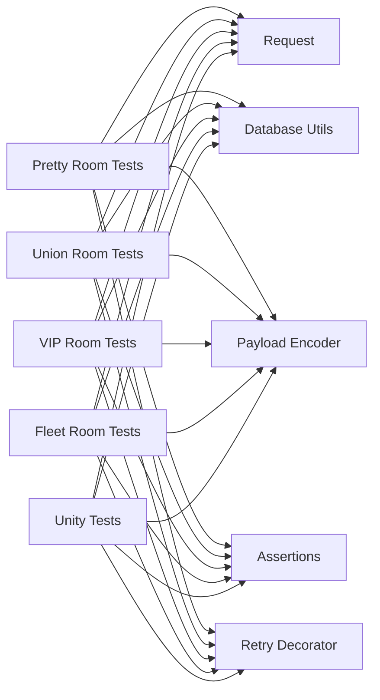

# Room Upgrade Scenarios

<cite>
**Referenced Files in This Document**
- [test_pay_prettyRoom.py](file://case/test_pay_prettyRoom.py)
- [test_pay_unionRoom.py](file://case/test_pay_unionRoom.py)
- [test_pay_vipRoom.py](file://case/test_pay_vipRoom.py)
- [test_pay_fleetRoom.py](file://case/test_pay_fleetRoom.py)
- [test_pay_unity.py](file://case/test_pay_unity.py)
- [Config.py](file://common/Config.py)
- [basicData.py](file://common/basicData.py)
- [Request.py](file://common/Request.py)
- [conMysql.py](file://common/conMysql.py)
- [Assert.py](file://common/Assert.py)
- [runFailed.py](file://common/runFailed.py)
- [README.md](file://README.md)
</cite>

## Table of Contents
1. [Introduction](#introduction)
2. [Project Structure](#project-structure)
3. [Core Components](#core-components)
4. [Architecture Overview](#architecture-overview)
5. [Detailed Component Analysis](#detailed-component-analysis)
6. [Dependency Analysis](#dependency-analysis)
7. [Performance Considerations](#performance-considerations)
8. [Troubleshooting Guide](#troubleshooting-guide)
9. [Conclusion](#conclusion)

## Introduction
This document explains room upgrade scenarios across Pretty Rooms, Union Rooms, VIP Rooms, Fleet Rooms, and Unity Rooms. It documents upgrade workflows, enhancement validation, and facility improvement procedures. It also covers room-specific upgrade requirements, cost calculations, feature activation processes, configuration parameters, facility validation logic, and user permission checks. Examples of successful upgrades, feature activation verification, and room status updates are included, alongside failure handling, partial upgrade scenarios, and rollback procedures.

## Project Structure
The repository organizes payment-related room tests under the case directory, with shared infrastructure in common. Tests for each room type focus on payment flows, room-specific rates, and balances after transactions. Shared utilities handle request construction, database operations, assertions, and retries.

**Diagram sources**
- [test_pay_prettyRoom.py:1-90](file://case/test_pay_prettyRoom.py#L1-L90)
- [test_pay_unionRoom.py:1-119](file://case/test_pay_unionRoom.py#L1-L119)
- [test_pay_vipRoom.py:1-90](file://case/test_pay_vipRoom.py#L1-L90)
- [test_pay_fleetRoom.py:1-158](file://case/test_pay_fleetRoom.py#L1-L158)
- [test_pay_unity.py:1-13](file://case/test_pay_unity.py#L1-L13)
- [Config.py:1-133](file://common/Config.py#L1-L133)
- [basicData.py:1-581](file://common/basicData.py#L1-L581)
- [Request.py:1-162](file://common/Request.py#L1-L162)
- [conMysql.py:1-530](file://common/conMysql.py#L1-L530)
- [Assert.py:1-96](file://common/Assert.py#L1-L96)
- [runFailed.py:1-87](file://common/runFailed.py#L1-L87)

**Section sources**
- [README.md:1-38](file://README.md#L1-L38)

## Core Components
- Room-specific test suites validate payment flows and distribution rates per room type.
- Payload encoding constructs standardized payment requests with room ID, gift ID, amount, and target users.
- Request abstraction posts payments and captures response metadata.
- Database utilities update and query user balances, room ownership, and related configurations.
- Assertions validate HTTP status, response body fields, and numeric outcomes.
- Retry decorator enables automatic re-execution of flaky tests.

**Section sources**
- [test_pay_prettyRoom.py:1-90](file://case/test_pay_prettyRoom.py#L1-L90)
- [test_pay_unionRoom.py:1-119](file://case/test_pay_unionRoom.py#L1-L119)
- [test_pay_vipRoom.py:1-90](file://case/test_pay_vipRoom.py#L1-L90)
- [test_pay_fleetRoom.py:1-158](file://case/test_pay_fleetRoom.py#L1-L158)
- [basicData.py:1-581](file://common/basicData.py#L1-L581)
- [Request.py:1-162](file://common/Request.py#L1-L162)
- [conMysql.py:1-530](file://common/conMysql.py#L1-L530)
- [Assert.py:1-96](file://common/Assert.py#L1-L96)
- [runFailed.py:1-87](file://common/runFailed.py#L1-L87)

## Architecture Overview
The room upgrade workflow follows a consistent pattern:
- Prepare test data by updating user balances and room ownership via database utilities.
- Construct a payment payload with room ID, gift ID, amount, and optional targets.
- Post the payment request and validate response.
- Verify balance changes and distribution according to room-specific rules.
- Record results and handle failures with retry logic.

**Diagram sources**
- [conMysql.py:349-361](file://common/conMysql.py#L349-L361)
- [basicData.py:8-39](file://common/basicData.py#L8-L39)
- [Request.py:17-59](file://common/Request.py#L17-L59)
- [Assert.py:11-85](file://common/Assert.py#L11-L85)
- [runFailed.py:57-78](file://common/runFailed.py#L57-L78)

## Detailed Component Analysis

### Pretty Room Upgrade Scenario
Pretty Rooms distribute rewards with a fixed rate for guild members and personal charm for non-guild users. The tests validate:
- Gift and box donations to guild members yield a guild charm share.
- Gift donations to non-guild users yield personal charm.
- Balances reflect expected distributions after transactions.

**Diagram sources**
- [test_pay_prettyRoom.py:16-39](file://case/test_pay_prettyRoom.py#L16-L39)
- [test_pay_prettyRoom.py:41-65](file://case/test_pay_prettyRoom.py#L41-L65)
- [test_pay_prettyRoom.py:67-89](file://case/test_pay_prettyRoom.py#L67-L89)
- [basicData.py:8-39](file://common/basicData.py#L8-L39)
- [conMysql.py:349-361](file://common/conMysql.py#L349-L361)
- [Request.py:17-59](file://common/Request.py#L17-L59)

**Section sources**
- [test_pay_prettyRoom.py:1-90](file://case/test_pay_prettyRoom.py#L1-L90)
- [Config.py:57-68](file://common/Config.py#L57-L68)

### Union Room Upgrade Scenario
Union Rooms apply distinct rates for guild members versus non-guild users. Tests cover:
- Live guild member donations to a guild channel receive a guild charm share.
- Normal guild member donations receive a guild charm share.
- Box donations follow similar distribution rules.
- Non-guild users receive personal charm shares.

**Diagram sources**
- [test_pay_unionRoom.py:21-45](file://case/test_pay_unionRoom.py#L21-L45)
- [test_pay_unionRoom.py:47-69](file://case/test_pay_unionRoom.py#L47-L69)
- [test_pay_unionRoom.py:71-97](file://case/test_pay_unionRoom.py#L71-L97)
- [test_pay_unionRoom.py:99-118](file://case/test_pay_unionRoom.py#L99-L118)
- [basicData.py:8-39](file://common/basicData.py#L8-L39)
- [conMysql.py:349-361](file://common/conMysql.py#L349-L361)
- [Request.py:17-59](file://common/Request.py#L17-L59)

**Section sources**
- [test_pay_unionRoom.py:1-119](file://case/test_pay_unionRoom.py#L1-L119)
- [Config.py:57-68](file://common/Config.py#L57-L68)

### VIP Room Upgrade Scenario
VIP Rooms enforce room-specific rates for different user categories:
- Personal room donations to non-guild users allocate a personal charm share.
- Box donations adjust donor and recipient balances accordingly.
- Donations to guild users allocate a different personal charm share.

**Diagram sources**
- [test_pay_vipRoom.py:18-39](file://case/test_pay_vipRoom.py#L18-L39)
- [test_pay_vipRoom.py:41-65](file://case/test_pay_vipRoom.py#L41-L65)
- [test_pay_vipRoom.py:67-89](file://case/test_pay_vipRoom.py#L67-L89)
- [basicData.py:8-39](file://common/basicData.py#L8-L39)
- [conMysql.py:349-361](file://common/conMysql.py#L349-L361)
- [Request.py:17-59](file://common/Request.py#L17-L59)

**Section sources**
- [test_pay_vipRoom.py:1-90](file://case/test_pay_vipRoom.py#L1-L90)
- [Config.py:57-68](file://common/Config.py#L57-L68)

### Fleet Room Upgrade Scenario
Fleet Rooms differentiate rates by family membership and user category:
- Same-family room donations to live guild users yield a higher personal charm share.
- Other-family room donations to live guild users yield a lower personal charm share.
- Normal guild and non-guild donations follow respective rates.
- One-generation masters receive special rates in same-family rooms.

**Diagram sources**
- [test_pay_fleetRoom.py:19-40](file://case/test_pay_fleetRoom.py#L19-L40)
- [test_pay_fleetRoom.py:42-63](file://case/test_pay_fleetRoom.py#L42-L63)
- [test_pay_fleetRoom.py:65-86](file://case/test_pay_fleetRoom.py#L65-L86)
- [test_pay_fleetRoom.py:88-111](file://case/test_pay_fleetRoom.py#L88-L111)
- [test_pay_fleetRoom.py:113-136](file://case/test_pay_fleetRoom.py#L113-L136)
- [test_pay_fleetRoom.py:138-157](file://case/test_pay_fleetRoom.py#L138-L157)
- [basicData.py:8-39](file://common/basicData.py#L8-L39)
- [conMysql.py:349-361](file://common/conMysql.py#L349-L361)
- [Request.py:17-59](file://common/Request.py#L17-L59)

**Section sources**
- [test_pay_fleetRoom.py:1-158](file://case/test_pay_fleetRoom.py#L1-L158)
- [Config.py:57-68](file://common/Config.py#L57-L68)

### Unity Room Upgrade Scenario
Unity Rooms are represented by a placeholder test suite indicating current skip status. The suite is intended to validate in-room purchases and feature activation within Unity-based environments.

**Diagram sources**
- [test_pay_unity.py:4-12](file://case/test_pay_unity.py#L4-L12)

**Section sources**
- [test_pay_unity.py:1-13](file://case/test_pay_unity.py#L1-L13)

## Dependency Analysis
Room upgrade tests depend on shared utilities for:
- Request construction and posting.
- Database preparation and verification.
- Assertion helpers and retry mechanisms.

**Diagram sources**
- [test_pay_prettyRoom.py:1-90](file://case/test_pay_prettyRoom.py#L1-L90)
- [test_pay_unionRoom.py:1-119](file://case/test_pay_unionRoom.py#L1-L119)
- [test_pay_vipRoom.py:1-90](file://case/test_pay_vipRoom.py#L1-L90)
- [test_pay_fleetRoom.py:1-158](file://case/test_pay_fleetRoom.py#L1-L158)
- [test_pay_unity.py:1-13](file://case/test_pay_unity.py#L1-L13)
- [Request.py:1-162](file://common/Request.py#L1-L162)
- [conMysql.py:1-530](file://common/conMysql.py#L1-L530)
- [basicData.py:1-581](file://common/basicData.py#L1-L581)
- [Assert.py:1-96](file://common/Assert.py#L1-L96)
- [runFailed.py:1-87](file://common/runFailed.py#L1-L87)

**Section sources**
- [Request.py:1-162](file://common/Request.py#L1-L162)
- [conMysql.py:1-530](file://common/conMysql.py#L1-L530)
- [basicData.py:1-581](file://common/basicData.py#L1-L581)
- [Assert.py:1-96](file://common/Assert.py#L1-L96)
- [runFailed.py:1-87](file://common/runFailed.py#L1-L87)

## Performance Considerations
- Network latency and RPC delays are mitigated by assertion logic and retry decorators.
- Batch operations on balances and room ownership should minimize repeated queries.
- Payload encoding and request posting are lightweight; avoid redundant encodings in a single test.

[No sources needed since this section provides general guidance]

## Troubleshooting Guide
Common issues and resolutions:
- Payment failures due to insufficient balance: verify donor balances before posting payments.
- Incorrect room ID or gift ID: confirm room IDs and gift IDs from configuration.
- Rate discrepancies: ensure room-specific rates align with test expectations.
- Flaky network responses: rely on retry decorator to re-run failing tests.

Validation steps:
- Use database utilities to reset and set balances prior to each test.
- Confirm response status and body fields match expected values.
- Record and review failure reasons captured by assertion helpers.

**Section sources**
- [conMysql.py:349-361](file://common/conMysql.py#L349-L361)
- [Assert.py:11-85](file://common/Assert.py#L11-L85)
- [runFailed.py:57-78](file://common/runFailed.py#L57-L78)

## Conclusion
Room upgrade scenarios are validated through targeted test suites that exercise room-specific payment flows, distribution rates, and balance updates. Shared utilities provide consistent request construction, database preparation, assertions, and retry logic. While Unity Rooms are currently skipped, the framework supports future extension. Adhering to the documented workflows ensures reliable upgrade validation, accurate feature activation, and robust failure handling.