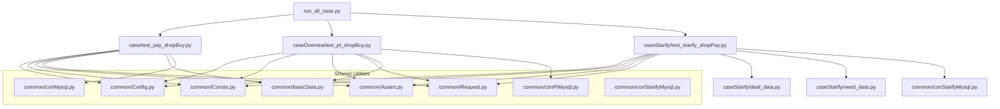
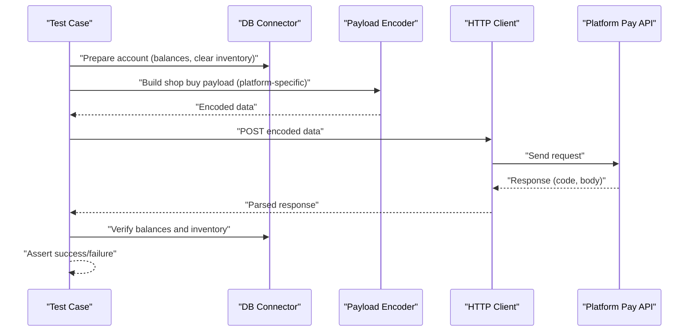
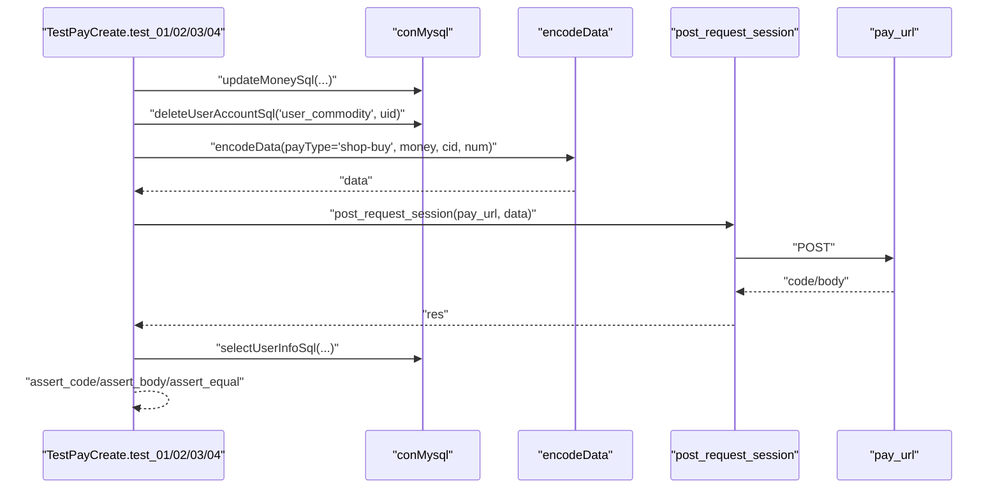
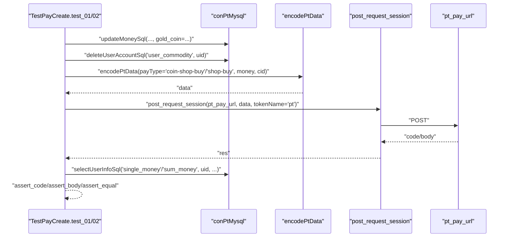
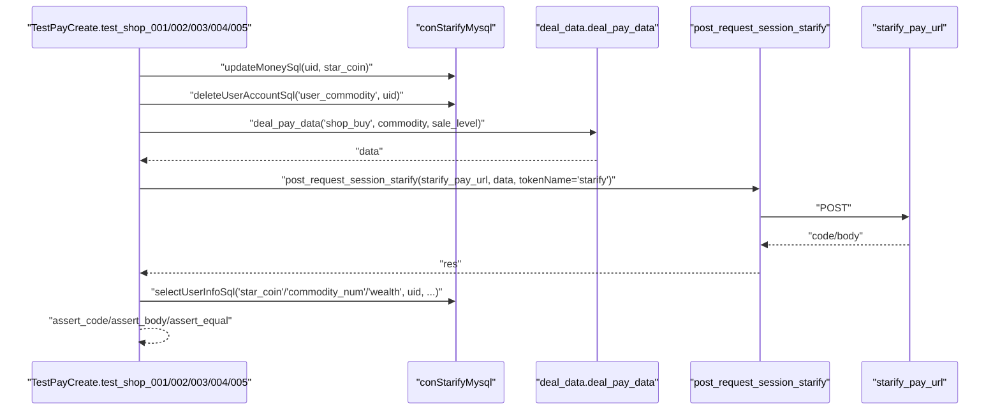
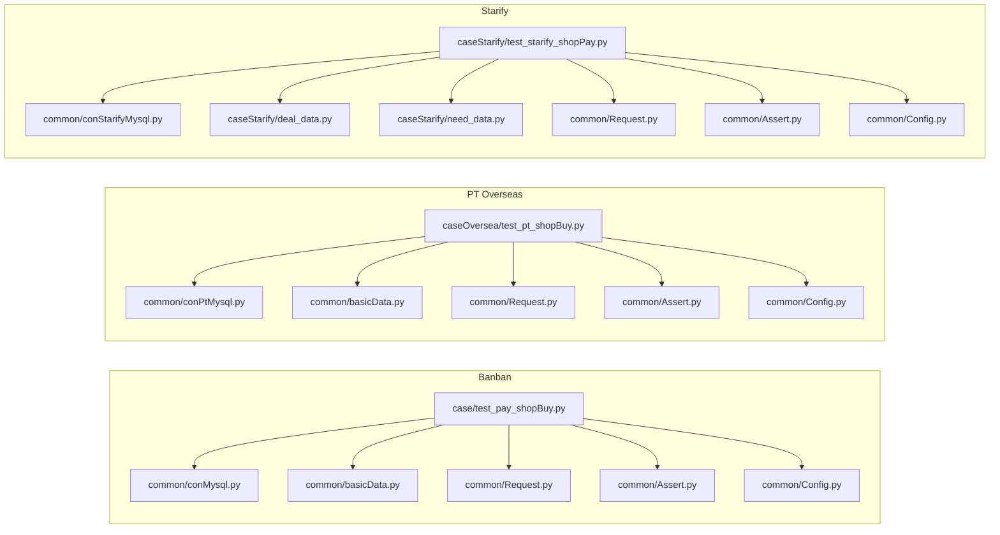

# Shop Transaction Testing

<cite>
**Referenced Files in This Document**
- [README.md](file://README.md)
- [run_all_case.py](file://run_all_case.py)
- [common/Config.py](file://common/Config.py)
- [common/Consts.py](file://common/Consts.py)
- [common/Assert.py](file://common/Assert.py)
- [common/Request.py](file://common/Request.py)
- [common/basicData.py](file://common/basicData.py)
- [common/conMysql.py](file://common/conMysql.py)
- [common/conPtMysql.py](file://common/conPtMysql.py)
- [common/conStarifyMysql.py](file://common/conStarifyMysql.py)
- [case/test_pay_shopBuy.py](file://case/test_pay_shopBuy.py)
- [caseOversea/test_pt_shopBuy.py](file://caseOversea/test_pt_shopBuy.py)
- [caseStarify/test_starify_shopPay.py](file://caseStarify/test_starify_shopPay.py)
- [caseStarify/deal_data.py](file://caseStarify/deal_data.py)
- [caseStarify/need_data.py](file://caseStarify/need_data.py)
</cite>

## Table of Contents
1. [Introduction](#introduction)
2. [Project Structure](#project-structure)
3. [Core Components](#core-components)
4. [Architecture Overview](#architecture-overview)
5. [Detailed Component Analysis](#detailed-component-analysis)
6. [Dependency Analysis](#dependency-analysis)
7. [Performance Considerations](#performance-considerations)
8. [Troubleshooting Guide](#troubleshooting-guide)
9. [Conclusion](#conclusion)
10. [Appendices](#appendices)

## Introduction
This document describes shop transaction testing across three supported platforms: Banban, PT Overseas, and Starify. It covers item purchase workflows, inventory validation, and payment processing for shop categories. It also explains platform-specific configurations, currency handling, regional variations, item validation procedures, stock deduction logic, and delivery confirmation processes. Examples of successful purchases, item delivery verification, and platform-specific transaction handling are included, along with failure scenarios, refund processing, and inventory synchronization across platforms.

## Project Structure
The repository organizes tests by platform under dedicated directories and reuses shared utilities for configuration, assertions, HTTP requests, and database operations. The main entry point discovers and runs platform-specific test suites.

**Diagram sources**
- [run_all_case.py:126-147](file://run_all_case.py#L126-L147)
- [case/test_pay_shopBuy.py:1-124](file://case/test_pay_shopBuy.py#L1-L124)
- [caseOversea/test_pt_shopBuy.py:1-58](file://caseOversea/test_pt_shopBuy.py#L1-L58)
- [caseStarify/test_starify_shopPay.py:1-132](file://caseStarify/test_starify_shopPay.py#L1-L132)
- [common/Config.py:6-133](file://common/Config.py#L6-L133)
- [common/Consts.py:1-17](file://common/Consts.py#L1-L17)
- [common/Assert.py:1-96](file://common/Assert.py#L1-L96)
- [common/Request.py:1-162](file://common/Request.py#L1-L162)
- [common/basicData.py:1-581](file://common/basicData.py#L1-L581)
- [common/conMysql.py:1-530](file://common/conMysql.py#L1-L530)
- [common/conPtMysql.py:1-345](file://common/conPtMysql.py#L1-L345)
- [common/conStarifyMysql.py:1-148](file://common/conStarifyMysql.py#L1-L148)
- [caseStarify/deal_data.py:1-103](file://caseStarify/deal_data.py#L1-L103)
- [caseStarify/need_data.py:1-290](file://caseStarify/need_data.py#L1-L290)

**Section sources**
- [README.md:1-38](file://README.md#L1-L38)
- [run_all_case.py:126-147](file://run_all_case.py#L126-L147)

## Core Components
- Configuration and URLs: Centralized platform endpoints and identifiers.
- Assertions: Unified assertion helpers for response codes, bodies, equality, and ranges.
- Requests: HTTP client wrapper with token injection and response parsing.
- Payload builders: Platform-specific encoders for shop buy operations.
- Database connectors: SQL helpers to prepare test accounts, clear inventories, and validate balances and items.

Key responsibilities:
- Validate HTTP response codes and body fields.
- Prepare test accounts with controlled balances and inventories.
- Encode shop buy payloads per platform.
- Query database after transactions to confirm balances, commodities, and wealth metrics.

**Section sources**
- [common/Config.py:47-133](file://common/Config.py#L47-L133)
- [common/Assert.py:11-96](file://common/Assert.py#L11-L96)
- [common/Request.py:17-59](file://common/Request.py#L17-L59)
- [common/basicData.py:177-194](file://common/basicData.py#L177-L194)
- [common/basicData.py:441-457](file://common/basicData.py#L441-L457)
- [common/conMysql.py:27-204](file://common/conMysql.py#L27-L204)
- [common/conPtMysql.py:25-93](file://common/conPtMysql.py#L25-L93)
- [common/conStarifyMysql.py:54-87](file://common/conStarifyMysql.py#L54-L87)

## Architecture Overview
The shop transaction testing pipeline follows a consistent flow across platforms:
- Initialize test accounts via SQL updates.
- Clear inventories to ensure clean state.
- Build payload using platform-specific encoder.
- Send HTTP request to platform endpoint.
- Validate response and record outcome.
- Query database to confirm balances, commodity counts, and related metrics.

**Diagram sources**
- [common/conMysql.py:350-360](file://common/conMysql.py#L350-L360)
- [common/conPtMysql.py:213-225](file://common/conPtMysql.py#L213-L225)
- [common/conStarifyMysql.py:72-87](file://common/conStarifyMysql.py#L72-L87)
- [common/basicData.py:177-194](file://common/basicData.py#L177-L194)
- [common/basicData.py:441-457](file://common/basicData.py#L441-L457)
- [common/Request.py:17-59](file://common/Request.py#L17-L59)
- [common/Assert.py:11-96](file://common/Assert.py#L11-L96)

## Detailed Component Analysis

### Banban Shop Transactions
Focus areas:
- Item purchase workflow with single and multiple quantities.
- Gift-to-user transfer and sharing ratios.
- Inventory validation and balance checks.

Key steps:
- Set initial balances and clear backpack.
- Build shop buy payload with item ID and quantity.
- Submit request and assert success.
- Verify final balances and commodity counts.

Validation highlights:
- Deduct correct amount from wallet.
- Increase commodity count by purchased quantity.
- Transfer shares when gifting from backpack follow expected ratios.

**Diagram sources**
- [case/test_pay_shopBuy.py:20-124](file://case/test_pay_shopBuy.py#L20-L124)
- [common/conMysql.py:350-360](file://common/conMysql.py#L350-L360)
- [common/basicData.py:177-194](file://common/basicData.py#L177-L194)
- [common/Request.py:17-59](file://common/Request.py#L17-L59)
- [common/Assert.py:11-96](file://common/Assert.py#L11-L96)

**Section sources**
- [case/test_pay_shopBuy.py:20-124](file://case/test_pay_shopBuy.py#L20-L124)
- [common/conMysql.py:27-204](file://common/conMysql.py#L27-L204)
- [common/basicData.py:177-194](file://common/basicData.py#L177-L194)

### PT Overseas Shop Transactions
Focus areas:
- Gold coin and diamond purchases.
- Regional and currency-specific item IDs.
- Balance verification per currency type.

Key steps:
- Set gold coin balance for PT user.
- Clear backpack.
- Build coin or shop buy payload.
- Submit request and assert success.
- Verify final single-money and commodity totals.

**Diagram sources**
- [caseOversea/test_pt_shopBuy.py:11-58](file://caseOversea/test_pt_shopBuy.py#L11-L58)
- [common/conPtMysql.py:213-225](file://common/conPtMysql.py#L213-L225)
- [common/basicData.py:441-457](file://common/basicData.py#L441-L457)
- [common/Request.py:17-59](file://common/Request.py#L17-L59)

**Section sources**
- [caseOversea/test_pt_shopBuy.py:11-58](file://caseOversea/test_pt_shopBuy.py#L11-L58)
- [common/conPtMysql.py:25-93](file://common/conPtMysql.py#L25-L93)
- [common/basicData.py:327-566](file://common/basicData.py#L327-L566)

### Starify Shop Transactions
Focus areas:
- Star coin purchases for cosmetic items (avatar frames, entrance banners, rings).
- Tiered durations and discounts per sale level.
- Wealth accumulation aligned to purchase value.

Key steps:
- Prepare star coin balance and clear backpack.
- Build shop buy payload via deal_data with commodity and sale level.
- Submit request and assert success.
- Verify star coin balance reduction, commodity count, and wealth increase.

**Diagram sources**
- [caseStarify/test_starify_shopPay.py:16-132](file://caseStarify/test_starify_shopPay.py#L16-L132)
- [caseStarify/deal_data.py:7-68](file://caseStarify/deal_data.py#L7-L68)
- [caseStarify/need_data.py:170-251](file://caseStarify/need_data.py#L170-L251)
- [common/conStarifyMysql.py:72-87](file://common/conStarifyMysql.py#L72-L87)

**Section sources**
- [caseStarify/test_starify_shopPay.py:16-132](file://caseStarify/test_starify_shopPay.py#L16-L132)
- [caseStarify/deal_data.py:7-68](file://caseStarify/deal_data.py#L7-L68)
- [caseStarify/need_data.py:170-251](file://caseStarify/need_data.py#L170-L251)
- [common/conStarifyMysql.py:54-87](file://common/conStarifyMysql.py#L54-L87)

### Platform-Specific Configurations and Currency Handling
- Banban
  - Wallet types include base money and bonuses.
  - Shop buy payload uses money type and price fields.
- PT Overseas
  - Distinct gold coin and diamond balances.
  - Separate shop buy and coin shop buy payloads.
- Starify
  - Star coin as primary currency.
  - Wealth metric increases proportionally to purchase value.

**Section sources**
- [common/conMysql.py:27-204](file://common/conMysql.py#L27-L204)
- [common/conPtMysql.py:25-93](file://common/conPtMysql.py#L25-L93)
- [common/conStarifyMysql.py:54-87](file://common/conStarifyMysql.py#L54-L87)
- [common/basicData.py:177-194](file://common/basicData.py#L177-L194)
- [common/basicData.py:441-457](file://common/basicData.py#L441-L457)

### Item Validation Procedures and Stock Deduction Logic
- Pre-checks:
  - Clear existing backpack entries to avoid carryover.
  - Set known baseline balances for deterministic outcomes.
- Post-checks:
  - Query total commodity counts and specific item counts.
  - Validate wallet reductions match expected prices and quantities.
- Deduction logic:
  - Single purchase deducts price × quantity.
  - Backpack gift transfers reduce sender’s item count and distribute rewards according to configured ratios.

**Section sources**
- [case/test_pay_shopBuy.py:32-42](file://case/test_pay_shopBuy.py#L32-L42)
- [case/test_pay_shopBuy.py:56-67](file://case/test_pay_shopBuy.py#L56-L67)
- [case/test_pay_shopBuy.py:81-94](file://case/test_pay_shopBuy.py#L81-L94)
- [common/conMysql.py:206-272](file://common/conMysql.py#L206-L272)
- [common/conMysql.py:350-360](file://common/conMysql.py#L350-L360)

### Delivery Confirmation Processes
- Banban:
  - Confirm commodity count increments by purchased quantity.
  - Verify wallet balance reflects paid amount.
- PT Overseas:
  - Confirm single-money fields reflect currency-specific deductions.
  - Confirm commodity totals increment accordingly.
- Starify:
  - Confirm star coin balance reduced by computed cost.
  - Confirm commodity entries with correct duration windows.
  - Confirm wealth metric updated to cost value.

**Section sources**
- [case/test_pay_shopBuy.py:40-41](file://case/test_pay_shopBuy.py#L40-L41)
- [case/test_pay_shopBuy.py:64-66](file://case/test_pay_shopBuy.py#L64-L66)
- [caseOversea/test_pt_shopBuy.py:32-33](file://caseOversea/test_pt_shopBuy.py#L32-L33)
- [caseOversea/test_pt_shopBuy.py:55-56](file://caseOversea/test_pt_shopBuy.py#L55-L56)
- [caseStarify/test_starify_shopPay.py:34-38](file://caseStarify/test_starify_shopPay.py#L34-L38)
- [caseStarify/test_starify_shopPay.py:57-61](file://caseStarify/test_starify_shopPay.py#L57-L61)
- [caseStarify/test_starify_shopPay.py:103-107](file://caseStarify/test_starify_shopPay.py#L103-L107)
- [caseStarify/test_starify_shopPay.py:126-130](file://caseStarify/test_starify_shopPay.py#L126-L130)

### Examples of Successful Shop Purchases
- Banban:
  - Single-item purchase reduces wallet by item price and increases backpack count by one.
  - Multi-item purchase scales deduction and count by quantity.
- PT Overseas:
  - Gold coin purchase reduces gold coin balance by item price.
  - Diamond purchase reduces diamond balance by item price.
- Starify:
  - Avatar frame purchase reduces star coins by computed tiered price and adds a time-bound commodity.
  - Entrance banner and ring purchases follow similar validation patterns.

**Section sources**
- [case/test_pay_shopBuy.py:20-67](file://case/test_pay_shopBuy.py#L20-L67)
- [caseOversea/test_pt_shopBuy.py:13-57](file://caseOversea/test_pt_shopBuy.py#L13-L57)
- [caseStarify/test_starify_shopPay.py:18-85](file://caseStarify/test_starify_shopPay.py#L18-L85)
- [caseStarify/test_starify_shopPay.py:87-131](file://caseStarify/test_starify_shopPay.py#L87-L131)

### Platform-Specific Transaction Handling
- Headers and tokens:
  - Tests inject user tokens via session utilities and send requests with standardized headers.
- Payload construction:
  - Platform-specific encoders set type, price, quantity, and scene-specific parameters.
- Endpoint routing:
  - Tests target platform-specific pay URLs configured centrally.

**Section sources**
- [common/Request.py:17-59](file://common/Request.py#L17-L59)
- [common/basicData.py:177-194](file://common/basicData.py#L177-L194)
- [common/basicData.py:441-457](file://common/basicData.py#L441-L457)
- [common/Config.py:47-56](file://common/Config.py#L47-L56)

## Dependency Analysis
The test suite exhibits layered dependencies:
- Test cases depend on shared configuration, assertion helpers, request wrappers, and payload encoders.
- Database connectors are isolated per platform but share common patterns for updates and queries.
- Starify tests additionally rely on platform-specific data builders and configuration dictionaries.

**Diagram sources**
- [case/test_pay_shopBuy.py:1-124](file://case/test_pay_shopBuy.py#L1-L124)
- [caseOversea/test_pt_shopBuy.py:1-58](file://caseOversea/test_pt_shopBuy.py#L1-L58)
- [caseStarify/test_starify_shopPay.py:1-132](file://caseStarify/test_starify_shopPay.py#L1-L132)
- [common/conMysql.py:1-530](file://common/conMysql.py#L1-L530)
- [common/conPtMysql.py:1-345](file://common/conPtMysql.py#L1-L345)
- [common/conStarifyMysql.py:1-148](file://common/conStarifyMysql.py#L1-L148)
- [common/basicData.py:1-581](file://common/basicData.py#L1-L581)
- [common/Request.py:1-162](file://common/Request.py#L1-L162)
- [common/Assert.py:1-96](file://common/Assert.py#L1-L96)
- [common/Config.py:1-133](file://common/Config.py#L1-L133)
- [caseStarify/deal_data.py:1-103](file://caseStarify/deal_data.py#L1-L103)
- [caseStarify/need_data.py:1-290](file://caseStarify/need_data.py#L1-L290)

**Section sources**
- [run_all_case.py:126-147](file://run_all_case.py#L126-L147)

## Performance Considerations
- Network latency: The request layer measures elapsed time and logs response timing; tests introduce small delays on non-production nodes to mitigate RPC timing inconsistencies.
- Database operations: Batched updates and commits are used to minimize overhead during test preparation.
- Concurrency: Global counters track successes and failures; while individual shop tests are sequential, the runner supports aggregated reporting.

[No sources needed since this section provides general guidance]

## Troubleshooting Guide
Common issues and resolutions:
- Assertion failures:
  - Verify expected vs. actual values and inspect recorded failure reasons.
  - Check payload construction for correct money type and price fields.
- Database mismatches:
  - Ensure balances are prepared before each test and inventories cleared.
  - Confirm correct selection keys for platform-specific money types.
- Network errors:
  - Confirm endpoint URLs and tokens are correctly injected.
  - Validate SSL verification settings and request timeouts.

**Section sources**
- [common/Assert.py:11-96](file://common/Assert.py#L11-L96)
- [common/Request.py:17-59](file://common/Request.py#L17-L59)
- [common/conMysql.py:350-360](file://common/conMysql.py#L350-L360)
- [common/conPtMysql.py:213-225](file://common/conPtMysql.py#L213-L225)
- [common/conStarifyMysql.py:72-87](file://common/conStarifyMysql.py#L72-L87)

## Conclusion
The shop transaction testing framework provides a unified, repeatable process to validate purchases, inventory updates, and balances across Banban, PT Overseas, and Starify. By leveraging platform-specific encoders, centralized configuration, and robust assertions, teams can confidently verify payment flows, item delivery, and financial reconciliation across diverse currencies and regions.

[No sources needed since this section summarizes without analyzing specific files]

## Appendices

### Example Workflows Summary
- Banban single purchase: Deduct wallet by unit price, increase backpack count by one.
- Banban bulk purchase: Deduct wallet by unit price × quantity, increase backpack count by quantity.
- PT gold coin purchase: Deduct gold coin balance by item price, increase backpack count by one.
- PT diamond purchase: Deduct diamond balance by item price, increase backpack count by one.
- Starify avatar frame purchase: Deduct star coins by computed tiered price, add time-bound commodity, increase wealth by cost.

**Section sources**
- [case/test_pay_shopBuy.py:20-67](file://case/test_pay_shopBuy.py#L20-L67)
- [caseOversea/test_pt_shopBuy.py:13-57](file://caseOversea/test_pt_shopBuy.py#L13-L57)
- [caseStarify/test_starify_shopPay.py:18-85](file://caseStarify/test_starify_shopPay.py#L18-L85)
- [caseStarify/test_starify_shopPay.py:87-131](file://caseStarify/test_starify_shopPay.py#L87-L131)