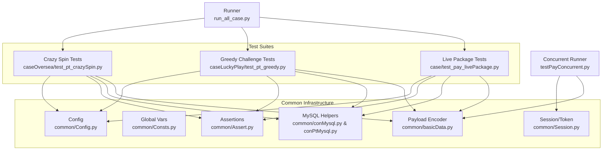
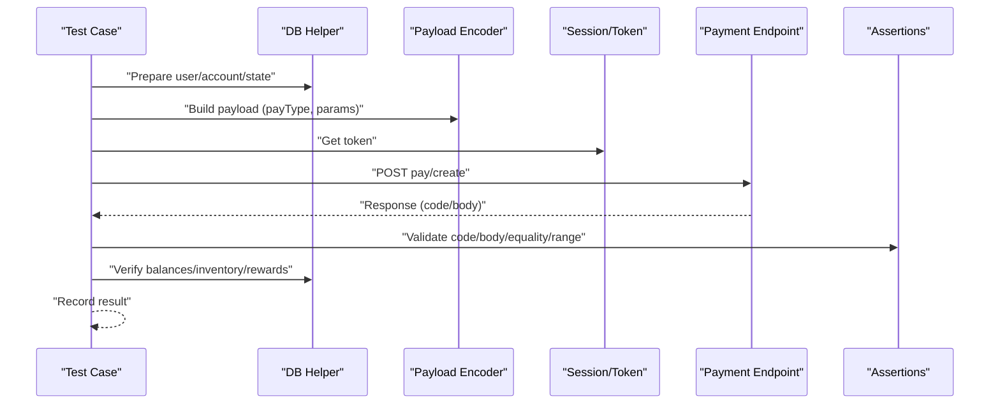
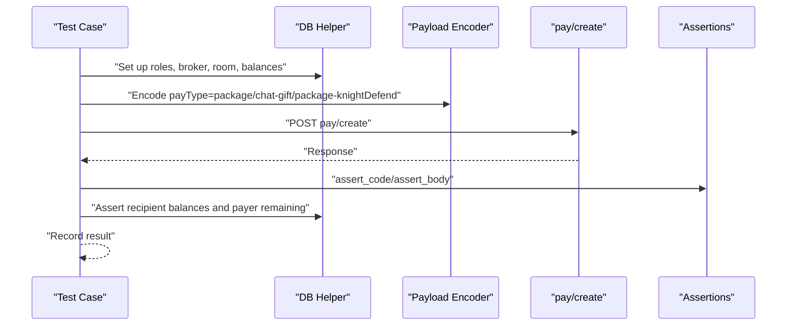
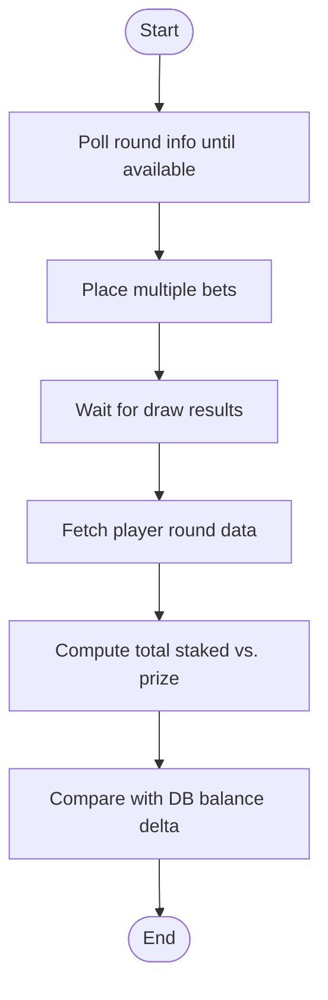
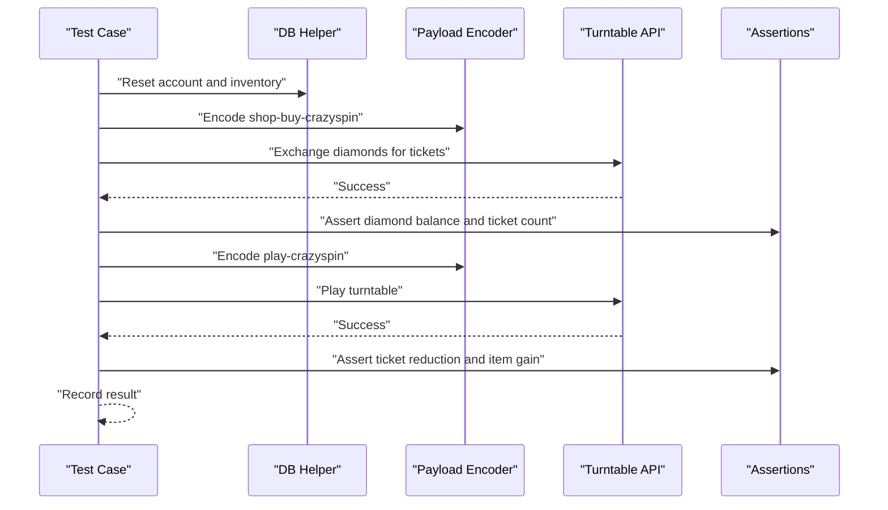
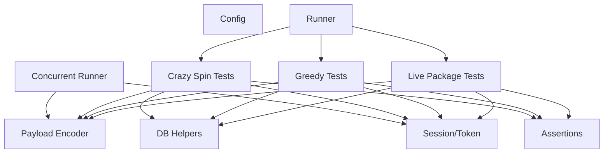

# Special Event Participation

<cite>
**Referenced Files in This Document**
- [README.md](file://README.md)
- [run_all_case.py](file://run_all_case.py)
- [testPayConcurrent.py](file://testPayConcurrent.py)
- [common/Config.py](file://common/Config.py)
- [common/Consts.py](file://common/Consts.py)
- [common/Assert.py](file://common/Assert.py)
- [common/basicData.py](file://common/basicData.py)
- [common/Session.py](file://common/Session.py)
- [common/conMysql.py](file://common/conMysql.py)
- [common/conPtMysql.py](file://common/conPtMysql.py)
- [case/test_pay_livePackage.py](file://case/test_pay_livePackage.py)
- [caseLuckyPlay/test_pt_greedy.py](file://caseLuckyPlay/test_pt_greedy.py)
- [caseOversea/test_pt_crazySpin.py](file://caseOversea/test_pt_crazySpin.py)
- [common/Greedy.py](file://common/Greedy.py)
- [common/Crazyspin.py](file://common/Crazyspin.py)
</cite>

## Table of Contents
1. [Introduction](#introduction)
2. [Project Structure](#project-structure)
3. [Core Components](#core-components)
4. [Architecture Overview](#architecture-overview)
5. [Detailed Component Analysis](#detailed-component-analysis)
6. [Dependency Analysis](#dependency-analysis)
7. [Performance Considerations](#performance-considerations)
8. [Troubleshooting Guide](#troubleshooting-guide)
9. [Conclusion](#conclusion)
10. [Appendices](#appendices)

## Introduction
This document provides a comprehensive guide to special event participation testing for live packages, crazy spin events, greedy challenges, and other promotional activities. It explains event participation workflows, entry fee validation, reward distribution mechanisms, configuration requirements, participation limits, timing restrictions, validation procedures, reward calculation logic, participant tracking, and failure/refund handling. It also covers concurrent participation testing for high-volume scenarios.

## Project Structure
The repository organizes test suites by domain and region:
- Live package tests under case/test_pay_livePackage.py
- Greedy challenge tests under caseLuckyPlay/test_pt_greedy.py
- Crazy spin tests under caseOversea/test_pt_crazySpin.py
- Shared infrastructure under common/* (configuration, assertions, database helpers, encoders, sessions)

**Diagram sources**
- [run_all_case.py:126-147](file://run_all_case.py#L126-L147)
- [case/test_pay_livePackage.py:12-248](file://case/test_pay_livePackage.py#L12-L248)
- [caseLuckyPlay/test_pt_greedy.py:14-64](file://caseLuckyPlay/test_pt_greedy.py#L14-L64)
- [caseOversea/test_pt_crazySpin.py:13-74](file://caseOversea/test_pt_crazySpin.py#L13-L74)
- [common/basicData.py:8-581](file://common/basicData.py#L8-L581)
- [common/conMysql.py:8-530](file://common/conMysql.py#L8-L530)
- [common/conPtMysql.py:6-345](file://common/conPtMysql.py#L6-L345)
- [common/Assert.py:11-96](file://common/Assert.py#L11-L96)
- [common/Config.py:6-133](file://common/Config.py#L6-L133)
- [common/Consts.py:4-17](file://common/Consts.py#L4-L17)
- [testPayConcurrent.py:9-47](file://testPayConcurrent.py#L9-L47)

**Section sources**
- [README.md:1-38](file://README.md#L1-L38)
- [run_all_case.py:126-147](file://run_all_case.py#L126-L147)

## Core Components
- Configuration and constants define endpoints, user roles, gift IDs, room IDs, and environment settings.
- Payload encoder builds standardized request bodies for different payment types and event actions.
- Database helpers prepare and verify balances, inventory, and event-specific records.
- Assertions validate HTTP status codes, response body fields, equality, and ranges.
- Session/token manager retrieves and persists tokens for authenticated requests.
- Runner aggregates and executes test suites per environment.
- Concurrent runner demonstrates high-volume load testing using greenlets.

**Section sources**
- [common/Config.py:6-133](file://common/Config.py#L6-L133)
- [common/basicData.py:8-581](file://common/basicData.py#L8-L581)
- [common/conMysql.py:8-530](file://common/conMysql.py#L8-L530)
- [common/conPtMysql.py:6-345](file://common/conPtMysql.py#L6-L345)
- [common/Assert.py:11-96](file://common/Assert.py#L11-L96)
- [common/Session.py:19-200](file://common/Session.py#L19-L200)
- [run_all_case.py:12-159](file://run_all_case.py#L12-L159)
- [testPayConcurrent.py:9-47](file://testPayConcurrent.py#L9-L47)

## Architecture Overview
The event participation pipeline follows a consistent flow:
- Prepare participants and environment via database helpers.
- Encode payload with appropriate payType and parameters.
- Send authenticated request to payment endpoint.
- Validate response and enforce assertions.
- Verify reward distribution against expected ratios and limits.
- Track outcomes and record results.

**Diagram sources**
- [case/test_pay_livePackage.py:20-248](file://case/test_pay_livePackage.py#L20-L248)
- [caseLuckyPlay/test_pt_greedy.py:23-63](file://caseLuckyPlay/test_pt_greedy.py#L23-L63)
- [caseOversea/test_pt_crazySpin.py:16-40](file://caseOversea/test_pt_crazySpin.py#L16-L40)
- [common/basicData.py:8-581](file://common/basicData.py#L8-L581)
- [common/Session.py:19-200](file://common/Session.py#L19-L200)
- [common/Assert.py:11-96](file://common/Assert.py#L11-L96)
- [common/conMysql.py:27-204](file://common/conMysql.py#L27-L204)

## Detailed Component Analysis

### Live Packages (Live Room, Chat, Knight Defend)
Event workflows:
- Live room gift/streaming donations with broker/settlement channel rules.
- Chat gift donations with distinct ratios.
- Knight defend subscriptions distributing revenue among host, broker, and platform.

Entry fee validation and reward distribution:
- Deduct from payer’s balance and distribute to recipient(s) according to configured ratios.
- Broker/settlement channel affects revenue split and account types credited.
- Validation checks include exact recipient credits and remaining payer balance.

Participation limits and timing:
- Tests simulate single transactions; concurrency testing is covered separately.

Participant tracking:
- Database queries verify account totals, single-money accounts, and commodity counts.

Examples:
- Live room gift with 60:21:19 split for brokerage/live channel.
- Chat gift with 60:20:20 split for brokerage/non-live channel.
- Knight defend subscription with 60:21:19 split.

Failures and refunds:
- If balances mismatch expectations, assertion failures indicate potential refund or reversal needs.

**Diagram sources**
- [case/test_pay_livePackage.py:20-248](file://case/test_pay_livePackage.py#L20-L248)
- [common/basicData.py:8-233](file://common/basicData.py#L8-L233)
- [common/conMysql.py:27-204](file://common/conMysql.py#L27-L204)
- [common/Assert.py:11-96](file://common/Assert.py#L11-L96)

**Section sources**
- [case/test_pay_livePackage.py:20-248](file://case/test_pay_livePackage.py#L20-L248)
- [common/basicData.py:8-233](file://common/basicData.py#L8-L233)
- [common/conMysql.py:27-204](file://common/conMysql.py#L27-L204)
- [common/Assert.py:11-96](file://common/Assert.py#L11-L96)

### Greedy Challenges (Wheel of Fortune)
Event workflow:
- Poll for round availability and counter range.
- Place bets across multiple rounds.
- Wait for draw results and compute net change.

Reward calculation logic:
- Total staked minus total won equals expected delta in account balance.

Validation:
- Query player round records and compare counters and prizes.
- Compare database balance with computed expectation.

**Diagram sources**
- [common/Greedy.py:29-69](file://common/Greedy.py#L29-L69)
- [caseLuckyPlay/test_pt_greedy.py:23-63](file://caseLuckyPlay/test_pt_greedy.py#L23-L63)
- [common/conPtMysql.py:265-277](file://common/conPtMysql.py#L265-L277)

**Section sources**
- [caseLuckyPlay/test_pt_greedy.py:23-63](file://caseLuckyPlay/test_pt_greedy.py#L23-L63)
- [common/Greedy.py:29-69](file://common/Greedy.py#L29-L69)
- [common/conPtMysql.py:265-277](file://common/conPtMysql.py#L265-L277)

### Crazy Spin Events
Event workflow:
- Exchange diamonds for turntable tickets.
- Optionally open turntable panel and play to consume tickets and receive rewards.

Entry fee validation:
- Deduct diamonds from payer and confirm ticket acquisition.

Reward distribution:
- Inventory updates reflect ticket consumption and new items received.

Timing and limits:
- Turntable list/horn endpoints initialize state; tests demonstrate pre-play setup.

**Diagram sources**
- [caseOversea/test_pt_crazySpin.py:16-73](file://caseOversea/test_pt_crazySpin.py#L16-L73)
- [common/Crazyspin.py:8-98](file://common/Crazyspin.py#L8-L98)
- [common/basicData.py:518-542](file://common/basicData.py#L518-L542)
- [common/conPtMysql.py:61-76](file://common/conPtMysql.py#L61-L76)

**Section sources**
- [caseOversea/test_pt_crazySpin.py:16-73](file://caseOversea/test_pt_crazySpin.py#L16-L73)
- [common/Crazyspin.py:8-98](file://common/Crazyspin.py#L8-L98)
- [common/basicData.py:518-542](file://common/basicData.py#L518-L542)
- [common/conPtMysql.py:61-76](file://common/conPtMysql.py#L61-L76)

### Event-Specific Configuration Requirements
- Payment endpoints and app identifiers are centralized in configuration.
- Gift IDs, room IDs, and user roles are defined for event contexts.
- Token retrieval and persistence are handled by the session module.

**Section sources**
- [common/Config.py:47-133](file://common/Config.py#L47-L133)
- [common/Session.py:168-200](file://common/Session.py#L168-L200)

### Participation Limits and Timing Restrictions
- Live package tests validate ratios and account types but do not enforce per-user daily caps in the tested steps.
- Greedy challenge polling waits for eligible rounds; draw results are awaited before validation.
- Crazy spin exchange requires sufficient diamonds and initializes turntable state before play.

**Section sources**
- [caseLuckyPlay/test_pt_greedy.py:36-62](file://caseLuckyPlay/test_pt_greedy.py#L36-L62)
- [caseOversea/test_pt_crazySpin.py:30-39](file://caseOversea/test_pt_crazySpin.py#L30-L39)

### Event Participation Validation Procedures
- Pre-test preparation: clear/reset accounts, set roles, and configure rooms/gifts.
- Payload construction: use encoder to build payType-specific parameters.
- Request execution: send authenticated POST to payment endpoint.
- Assertion suite: validate HTTP code, response body fields, and numeric equality/ranges.
- Post-test verification: query database for final balances and inventory.

**Section sources**
- [common/basicData.py:8-581](file://common/basicData.py#L8-L581)
- [common/Assert.py:11-96](file://common/Assert.py#L11-L96)
- [common/conMysql.py:27-204](file://common/conMysql.py#L27-L204)

### Reward Calculation Logic
- Live packages: split ratios applied to gross donation; payer balance reduced accordingly.
- Greedy: total stake minus prize equals expected DB delta.
- Crazy spin: ticket cost deducted; inventory reflects ticket consumption and new items.

**Section sources**
- [case/test_pay_livePackage.py:33-47](file://case/test_pay_livePackage.py#L33-L47)
- [caseLuckyPlay/test_pt_greedy.py:36-41](file://caseLuckyPlay/test_pt_greedy.py#L36-L41)
- [caseOversea/test_pt_crazySpin.py:36-39](file://caseOversea/test_pt_crazySpin.py#L36-L39)

### Participant Tracking Systems
- Database helpers encapsulate SELECT/UPDATE/INSERT operations for balances, commodities, and event-specific records.
- Global result lists track pass/fail outcomes and reasons.

**Section sources**
- [common/conMysql.py:27-204](file://common/conMysql.py#L27-L204)
- [common/conPtMysql.py:265-277](file://common/conPtMysql.py#L265-L277)
- [common/Consts.py:4-17](file://common/Consts.py#L4-L17)

### Examples of Successful Participation and Outcome Validation
- Live room gift: verify host receives 60%, broker receives 21%, and payer remaining is zero.
- Chat gift: verify host receives 60%, broker receives 20%, and payer remaining is zero.
- Greedy bet: verify DB balance matches initial minus stake plus prize.
- Crazy spin exchange: verify diamond deduction and ticket acquisition.

**Section sources**
- [case/test_pay_livePackage.py:33-47](file://case/test_pay_livePackage.py#L33-L47)
- [case/test_pay_livePackage.py:133-139](file://case/test_pay_livePackage.py#L133-L139)
- [caseLuckyPlay/test_pt_greedy.py:36-41](file://caseLuckyPlay/test_pt_greedy.py#L36-L41)
- [caseOversea/test_pt_crazySpin.py:36-39](file://caseOversea/test_pt_crazySpin.py#L36-L39)

### Event Participation Failures, Refunds, and Concurrent Testing
- Failures: assertion mismatches indicate incorrect splits, missing receipts, or invalid balances.
- Refunds: while not explicitly modeled in current tests, failing assertions imply corrective actions (e.g., reversing transactions or re-issuing credits).
- Concurrency: the concurrent runner spawns multiple greenlets to simulate high-volume participation.

**Section sources**
- [common/Assert.py:11-96](file://common/Assert.py#L11-L96)
- [testPayConcurrent.py:30-35](file://testPayConcurrent.py#L30-L35)

## Dependency Analysis
The following diagram highlights key dependencies among components during event participation.

**Diagram sources**
- [run_all_case.py:126-147](file://run_all_case.py#L126-L147)
- [case/test_pay_livePackage.py:12-248](file://case/test_pay_livePackage.py#L12-L248)
- [caseLuckyPlay/test_pt_greedy.py:14-64](file://caseLuckyPlay/test_pt_greedy.py#L14-L64)
- [caseOversea/test_pt_crazySpin.py:13-74](file://caseOversea/test_pt_crazySpin.py#L13-L74)
- [common/basicData.py:8-581](file://common/basicData.py#L8-L581)
- [common/conMysql.py:8-530](file://common/conMysql.py#L8-L530)
- [common/conPtMysql.py:6-345](file://common/conPtMysql.py#L6-L345)
- [common/Assert.py:11-96](file://common/Assert.py#L11-L96)
- [common/Session.py:19-200](file://common/Session.py#L19-L200)
- [testPayConcurrent.py:9-47](file://testPayConcurrent.py#L9-L47)

**Section sources**
- [run_all_case.py:126-147](file://run_all_case.py#L126-L147)
- [testPayConcurrent.py:9-47](file://testPayConcurrent.py#L9-L47)

## Performance Considerations
- Network latency: assertions include a small delay on specific nodes to mitigate RPC timing issues.
- Concurrency: greenlet-based parallelism increases throughput; ensure backend can handle bursts.
- Database operations: batch updates and commits are used to minimize overhead.

**Section sources**
- [common/Assert.py:17-18](file://common/Assert.py#L17-L18)
- [testPayConcurrent.py:30-35](file://testPayConcurrent.py#L30-L35)
- [common/conMysql.py:190-198](file://common/conMysql.py#L190-L198)
- [common/conPtMysql.py:95-142](file://common/conPtMysql.py#L95-L142)

## Troubleshooting Guide
- Assertion failures: review fail_case_reason logs and adjust expectations or environment setup.
- Token issues: regenerate tokens via session manager and persist to disk for reuse.
- Database inconsistencies: reset accounts and re-run setup steps; verify SQL scripts.
- Concurrency anomalies: reduce spawn count or stagger requests to avoid throttling.

**Section sources**
- [common/Assert.py:23-25](file://common/Assert.py#L23-L25)
- [common/Session.py:168-200](file://common/Session.py#L168-L200)
- [common/conMysql.py:190-198](file://common/conMysql.py#L190-L198)
- [run_all_case.py:34-44](file://run_all_case.py#L34-L44)

## Conclusion
This testing framework provides robust coverage for live packages, greedy challenges, and crazy spin events. By leveraging standardized payload encoding, database helpers, assertions, and session management, teams can validate participation workflows, enforce reward distributions, and scale tests under load. Adjustments to configuration, limits, and timing can be introduced incrementally while maintaining reliable validation.

## Appendices
- Runner invocation selects test suites by environment and reports aggregated results.
- Concurrent runner demonstrates scalable execution patterns for high-volume scenarios.

**Section sources**
- [run_all_case.py:12-159](file://run_all_case.py#L12-L159)
- [testPayConcurrent.py:30-35](file://testPayConcurrent.py#L30-L35)