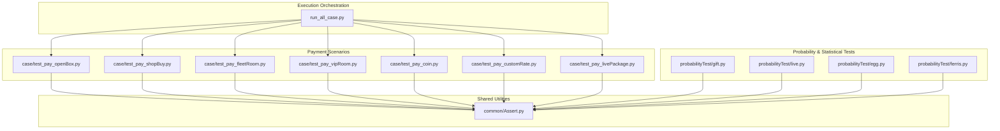
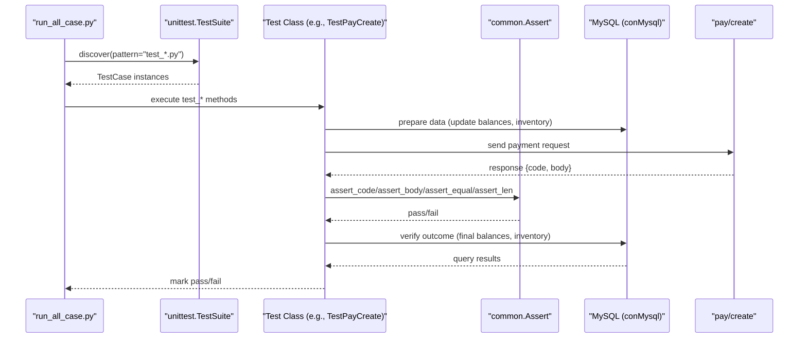
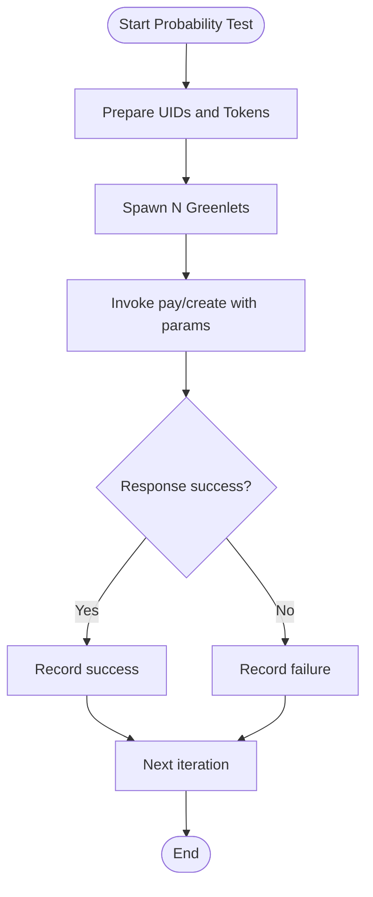
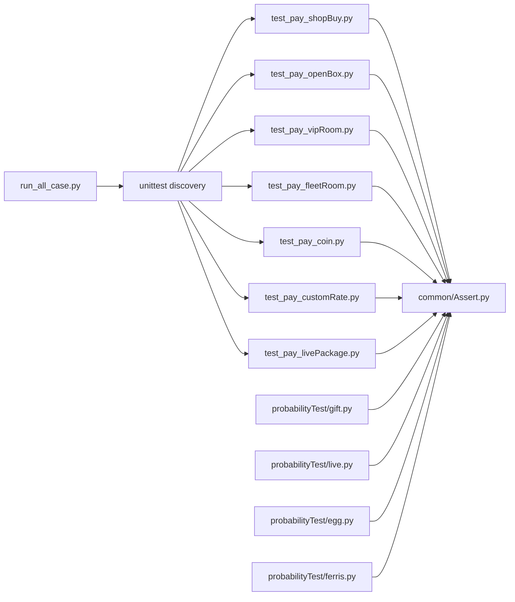

# Test Scenario Categories

<cite>
**Referenced Files in This Document**
- [README.md](file://README.md)
- [run_all_case.py](file://run_all_case.py)
- [testPayConcurrent.py](file://testPayConcurrent.py)
- [probabilityTest/gift.py](file://probabilityTest/gift.py)
- [probabilityTest/live.py](file://probabilityTest/live.py)
- [probabilityTest/egg.py](file://probabilityTest/egg.py)
- [probabilityTest/ferris.py](file://probabilityTest/ferris.py)
- [case/test_pay_openBox.py](file://case/test_pay_openBox.py)
- [case/test_pay_shopBuy.py](file://case/test_pay_shopBuy.py)
- [case/test_pay_fleetRoom.py](file://case/test_pay_fleetRoom.py)
- [case/test_pay_vipRoom.py](file://case/test_pay_vipRoom.py)
- [case/test_pay_coin.py](file://case/test_pay_coin.py)
- [case/test_pay_customRate.py](file://case/test_pay_customRate.py)
- [case/test_pay_livePackage.py](file://case/test_pay_livePackage.py)
- [common/Assert.py](file://common/Assert.py)
</cite>

## Table of Contents
1. [Introduction](#introduction)
2. [Project Structure](#project-structure)
3. [Core Components](#core-components)
4. [Architecture Overview](#architecture-overview)
5. [Detailed Component Analysis](#detailed-component-analysis)
6. [Dependency Analysis](#dependency-analysis)
7. [Performance Considerations](#performance-considerations)
8. [Troubleshooting Guide](#troubleshooting-guide)
9. [Conclusion](#conclusion)
10. [Appendices](#appendices)

## Introduction
This document describes comprehensive test scenario categories for payment validation across multiple product domains. It covers gift purchase workflows, box opening validation, shop transactions, room upgrade scenarios, currency exchange operations, special event participation, and probability/statistical analysis. It also documents scenario-specific configuration requirements, expected outcomes, validation criteria, and integration with the assertion engine. Guidance on concurrent testing and performance validation is included.

## Project Structure
The repository organizes payment-related tests by functional domain under dedicated folders, with shared utilities for assertions, database access, HTTP requests, and configuration. Execution orchestration is centralized to discover and run tests per application context.

**Diagram sources**
- [run_all_case.py:126-147](file://run_all_case.py#L126-L147)
- [case/test_pay_openBox.py:12-44](file://case/test_pay_openBox.py#L12-L44)
- [case/test_pay_shopBuy.py:13-42](file://case/test_pay_shopBuy.py#L13-L42)
- [case/test_pay_fleetRoom.py:12-40](file://case/test_pay_fleetRoom.py#L12-L40)
- [case/test_pay_vipRoom.py:12-39](file://case/test_pay_vipRoom.py#L12-L39)
- [case/test_pay_coin.py:13-34](file://case/test_pay_coin.py#L13-L34)
- [case/test_pay_customRate.py:12-50](file://case/test_pay_customRate.py#L12-L50)
- [case/test_pay_livePackage.py:12-48](file://case/test_pay_livePackage.py#L12-L48)
- [probabilityTest/gift.py:9-53](file://probabilityTest/gift.py#L9-L53)
- [probabilityTest/live.py:9-27](file://probabilityTest/live.py#L9-L27)
- [probabilityTest/egg.py:19-73](file://probabilityTest/egg.py#L19-L73)
- [probabilityTest/ferris.py:11-23](file://probabilityTest/ferris.py#L11-L23)
- [common/Assert.py:11-96](file://common/Assert.py#L11-L96)

**Section sources**
- [README.md:1-38](file://README.md#L1-L38)
- [run_all_case.py:126-147](file://run_all_case.py#L126-L147)

## Core Components
- Assertion Engine: Provides standardized assertion helpers for HTTP status, JSON body checks, equality, length thresholds, and value ranges.
- Payment Scenario Modules: Each module encapsulates a category of payment validations with deterministic setup, execution, and verification steps.
- Probability & Statistical Tools: Dedicated scripts for stress and distribution validation via concurrent requests and controlled gift/bean distributions.

Key responsibilities:
- Validation Criteria: Assertions enforce exact matches, minimum thresholds, and message presence.
- Data Setup: Pre-test database updates ensure repeatable conditions (balances, inventory, room roles).
- Outcome Verification: Post-test queries confirm financial and inventory changes align with expected ratios and amounts.

**Section sources**
- [common/Assert.py:11-96](file://common/Assert.py#L11-L96)
- [case/test_pay_openBox.py:15-43](file://case/test_pay_openBox.py#L15-L43)
- [case/test_pay_shopBuy.py:21-42](file://case/test_pay_shopBuy.py#L21-L42)
- [case/test_pay_fleetRoom.py:19-40](file://case/test_pay_fleetRoom.py#L19-L40)
- [case/test_pay_vipRoom.py:18-39](file://case/test_pay_vipRoom.py#L18-L39)
- [case/test_pay_coin.py:16-34](file://case/test_pay_coin.py#L16-L34)
- [case/test_pay_customRate.py:23-50](file://case/test_pay_customRate.py#L23-L50)
- [case/test_pay_livePackage.py:20-48](file://case/test_pay_livePackage.py#L20-L48)

## Architecture Overview
The test suite follows a layered approach:
- Orchestration layer discovers and runs test modules per environment/app.
- Scenario layer defines test classes and methods for each payment domain.
- Assertion layer centralizes validation logic.
- Data layer prepares and verifies state via SQL and HTTP interactions.

**Diagram sources**
- [run_all_case.py:126-147](file://run_all_case.py#L126-L147)
- [case/test_pay_shopBuy.py:32-42](file://case/test_pay_shopBuy.py#L32-L42)
- [common/Assert.py:11-96](file://common/Assert.py#L11-L96)

## Detailed Component Analysis

### Gift Purchase Testing Workflows
Focus: Shop purchases, gift transfers, and insufficient balance handling.

Validation criteria:
- HTTP status and body success flag.
- Wallet and inventory changes after single and bulk purchases.
- Transfer of purchased gifts within rooms with expected ratios.

Scenario-specific configuration:
- Product identifiers (gift cids), room ids, and user roles are sourced from configuration and database helpers.
- Bulk purchases require explicit quantity parameters.

Expected outcomes:
- Exact wallet balance reduction.
- Inventory increments match purchase quantities.
- Room transfer reduces sender’s inventory and increases recipients’ balances according to configured ratios.

Integration with assertion engine:
- assert_code, assert_body, assert_equal, assert_len.

Example execution paths:
- Single purchase: [test_pay_shopBuy.py:32-42](file://case/test_pay_shopBuy.py#L32-L42)
- Multiple purchases: [test_pay_shopBuy.py:56-67](file://case/test_pay_shopBuy.py#L56-L67)
- Transfer with insufficient stock: [test_pay_shopBuy.py:108-123](file://case/test_pay_shopBuy.py#L108-L123)

**Section sources**
- [case/test_pay_shopBuy.py:21-123](file://case/test_pay_shopBuy.py#L21-L123)
- [common/Assert.py:11-96](file://common/Assert.py#L11-L96)

### Box Opening Validation Procedures
Focus: Copper/silver box opening mechanics, gift acquisition, and room-given boxes.

Validation criteria:
- Successful response and precise balance adjustments.
- Inventory reflects opened items (e.g., avatar frames and gifts).
- Multi-box scenarios validate cumulative cost and item counts.

Expected outcomes:
- Deducted total cost equals unit price × quantity.
- Inventory increases by expected number of items.
- Room-given boxes distribute rewards to receivers with thresholds.

Integration with assertion engine:
- assert_code, assert_body, assert_equal, assert_len.

Example execution paths:
- Copper box single open: [test_pay_openBox.py:30-43](file://case/test_pay_openBox.py#L30-L43)
- Silver box multiple opens: [test_pay_openBox.py:60-75](file://case/test_pay_openBox.py#L60-L75)
- Room-given box: [test_pay_openBox.py:88-98](file://case/test_pay_openBox.py#L88-L98)

**Section sources**
- [case/test_pay_openBox.py:15-123](file://case/test_pay_openBox.py#L15-L123)
- [common/Assert.py:11-96](file://common/Assert.py#L11-L96)

### Shop Transaction Testing
Focus: Exchange currency, room coin payments, and VIP room gift transactions.

Validation criteria:
- Exchange operations verify money-to-gold conversions.
- Coin-based room payments validate per-recipient splits and VIP room multipliers.

Expected outcomes:
- Money deducted and coin credited after exchange.
- Recipients receive proportional shares; VIP room multipliers adjust totals.

Integration with assertion engine:
- assert_code, assert_body, assert_equal.

Example execution paths:
- Exchange money to coin: [test_pay_coin.py:27-34](file://case/test_pay_coin.py#L27-L34)
- Room coin gift split: [test_pay_coin.py:47-62](file://case/test_pay_coin.py#L47-L62)

**Section sources**
- [case/test_pay_coin.py:16-62](file://case/test_pay_coin.py#L16-L62)
- [common/Assert.py:11-96](file://common/Assert.py#L11-L96)

### Room Upgrade Scenarios
Focus: VIP room gift payments and GS (Guild Service) distributions.

Validation criteria:
- VIP room gift payments allocate income to personal charm accounts with fixed ratios.
- GS receives predetermined percentages depending on room type and relationship.

Expected outcomes:
- Payer’s balance reduced by paid amount.
- Recipient’s personal charm account increased per ratio.
- GS receives share according to room type rules.

Integration with assertion engine:
- assert_code, assert_body, assert_equal, assert_len.

Example execution paths:
- VIP room gift: [test_pay_vipRoom.py:28-39](file://case/test_pay_vipRoom.py#L28-L39)
- VIP room box: [test_pay_vipRoom.py:52-65](file://case/test_pay_vipRoom.py#L52-L65)
- VIP room GS gift: [test_pay_vipRoom.py:77-89](file://case/test_pay_vipRoom.py#L77-L89)

**Section sources**
- [case/test_pay_vipRoom.py:18-89](file://case/test_pay_vipRoom.py#L18-L89)
- [common/Assert.py:11-96](file://common/Assert.py#L11-L96)

### Currency Exchange Operations
Focus: Money-to-gold conversion and room coin usage.

Validation criteria:
- Exchange validates exact balance shifts.
- Room coin payments verify per-recipient distributions and VIP multiplier effects.

Expected outcomes:
- Money decreased and coin credited after exchange.
- Room coin payments reduce payer’s coin and increase recipients’ coin with ratios.

Integration with assertion engine:
- assert_code, assert_body, assert_equal.

Example execution paths:
- Exchange: [test_pay_coin.py:27-34](file://case/test_pay_coin.py#L27-L34)
- Room coin gift: [test_pay_coin.py:47-62](file://case/test_pay_coin.py#L47-L62)

**Section sources**
- [case/test_pay_coin.py:16-62](file://case/test_pay_coin.py#L16-L62)
- [common/Assert.py:11-96](file://common/Assert.py#L11-L96)

### Special Event Participation Testing
Focus: Live room packages, knight defend upgrades, and chat room distributions.

Validation criteria:
- Live room gift and box payments allocate to host, guild leader, and platform according to predefined ratios.
- Knight defend upgrades validate host, guild leader, and platform shares.
- Chat room distributions follow distinct ratios.

Expected outcomes:
- Host receives designated percentage of gross.
- Guild leader receives configured share.
- Platform retains remainder.
- Knight defend upgrades reflect multipliers and ratios.

Integration with assertion engine:
- assert_code, assert_body, assert_equal, assert_len.

Example execution paths:
- Live room gift 60:21:19: [test_pay_livePackage.py:33-48](file://case/test_pay_livePackage.py#L33-L48)
- Live room box 60:21:19: [test_pay_livePackage.py:63-81](file://case/test_pay_livePackage.py#L63-L81)
- Knight defend 60:21:19: [test_pay_livePackage.py:95-112](file://case/test_pay_livePackage.py#L95-L112)
- Chat room gift 60:20:20: [test_pay_livePackage.py:126-140](file://case/test_pay_livePackage.py#L126-L140)
- Chat room box 60:20:20: [test_pay_livePackage.py:154-172](file://case/test_pay_livePackage.py#L154-L172)
- Non-live room 70% to personal charm: [test_pay_livePackage.py:238-247](file://case/test_pay_livePackage.py#L238-L247)

**Section sources**
- [case/test_pay_livePackage.py:20-248](file://case/test_pay_livePackage.py#L20-L248)
- [common/Assert.py:11-96](file://common/Assert.py#L11-L96)

### Probability and Statistical Analysis
Focus: Stress testing and distribution validation using concurrent requests and controlled gift beans.

Capabilities:
- Concurrent execution via greenlets to simulate load.
- Controlled gift bean distributions to validate outcomes.
- Live room and KTV gift distributions across multiple recipients.

Validation approaches:
- Concurrency: spawn N greenlets to invoke payment creation endpoints.
- Distribution: iterate through gift sets and verify success responses.
- Threshold checks: assert minimum balances or ratios for statistical validity.

Example execution paths:
- Concurrent gift purchases: [probabilityTest/gift.py:101-112](file://probabilityTest/gift.py#L101-L112)
- Live room distribution: [probabilityTest/live.py:29-40](file://probabilityTest/live.py#L29-L40)
- Lucky egg distribution: [probabilityTest/egg.py:247-259](file://probabilityTest/egg.py#L247-L259)
- Multi-user package: [probabilityTest/ferris.py:11-23](file://probabilityTest/ferris.py#L11-L23)

**Diagram sources**
- [probabilityTest/egg.py:239-254](file://probabilityTest/egg.py#L239-L254)
- [probabilityTest/gift.py:9-53](file://probabilityTest/gift.py#L9-L53)

**Section sources**
- [probabilityTest/gift.py:9-112](file://probabilityTest/gift.py#L9-L112)
- [probabilityTest/live.py:9-40](file://probabilityTest/live.py#L9-L40)
- [probabilityTest/egg.py:19-73](file://probabilityTest/egg.py#L19-L73)
- [probabilityTest/egg.py:239-259](file://probabilityTest/egg.py#L239-L259)
- [probabilityTest/ferris.py:11-23](file://probabilityTest/ferris.py#L11-L23)

### Custom Rate and Brokerage Scenarios
Focus: Self-negotiated rates among hosts, guild leaders, and platform.

Validation criteria:
- Ratios applied to host and guild leader shares.
- Platform retains remainder after host and guild portions.
- Private chat, live room, and guard payment scenarios tested.

Expected outcomes:
- Host receives configured percentage of net share.
- Guild leader receives remainder portion.
- Platform keeps designated cut.

Example execution paths:
- Commercial room custom rate 50%: [test_pay_customRate.py:35-50](file://case/test_pay_customRate.py#L35-L50)
- Private chat custom rate 80%: [test_pay_customRate.py:65-79](file://case/test_pay_customRate.py#L65-L79)
- Guard payment custom rate 25%: [test_pay_customRate.py:93-109](file://case/test_pay_customRate.py#L93-L109)
- Live room GS custom rate 70%: [test_pay_customRate.py:123-140](file://case/test_pay_customRate.py#L123-L140)
- Private chat GS custom rate 0%: [test_pay_customRate.py:154-171](file://case/test_pay_customRate.py#L154-L171)

**Section sources**
- [case/test_pay_customRate.py:23-171](file://case/test_pay_customRate.py#L23-L171)
- [common/Assert.py:11-96](file://common/Assert.py#L11-L96)

### Family and Non-Family Room Scenarios
Focus: Fleet room gift distributions and ratios across family and non-family contexts.

Validation criteria:
- Same-family room yields higher host ratios than cross-family rooms.
- GS and master user shares vary by room type and relationship.

Expected outcomes:
- Payer’s balance reduced by paid amount.
- Recipient receives proportionally adjusted shares.
- Cross-family rooms apply lower thresholds.

Example execution paths:
- Same-family GS 80%: [test_pay_fleetRoom.py:30-40](file://case/test_pay_fleetRoom.py#L30-L40)
- Other-family GS 70%: [test_pay_fleetRoom.py:54-63](file://case/test_pay_fleetRoom.py#L54-L63)
- Same-family normal user 80%: [test_pay_fleetRoom.py:76-86](file://case/test_pay_fleetRoom.py#L76-L86)
- Other-family box 70%: [test_pay_fleetRoom.py:99-111](file://case/test_pay_fleetRoom.py#L99-L111)
- Same-family master user 80%: [test_pay_fleetRoom.py:124-136](file://case/test_pay_fleetRoom.py#L124-L136)
- Other-family general 62%: [test_pay_fleetRoom.py:149-157](file://case/test_pay_fleetRoom.py#L149-L157)

**Section sources**
- [case/test_pay_fleetRoom.py:19-158](file://case/test_pay_fleetRoom.py#L19-L158)
- [common/Assert.py:11-96](file://common/Assert.py#L11-L96)

## Dependency Analysis
The suite exhibits clear separation of concerns:
- Orchestration depends on discovery and environment configuration.
- Scenario modules depend on shared assertion utilities and database helpers.
- Probability tests depend on concurrency libraries and HTTP clients.

**Diagram sources**
- [run_all_case.py:126-147](file://run_all_case.py#L126-L147)
- [common/Assert.py:11-96](file://common/Assert.py#L11-L96)

**Section sources**
- [run_all_case.py:126-147](file://run_all_case.py#L126-L147)
- [common/Assert.py:11-96](file://common/Assert.py#L11-L96)

## Performance Considerations
- Concurrency: Probability tests demonstrate concurrent execution using greenlets to simulate load and validate throughput.
- Timing: Assertions introduce small delays on non-production nodes to mitigate RPC latency flakiness.
- Iterative validation: Probability scripts run thousands of iterations to gather statistical confidence.

Recommendations:
- Use controlled concurrency levels to avoid overwhelming upstream systems.
- Introduce jitter and backoff to stabilize repeated requests.
- Monitor response times and error rates during mass executions.

**Section sources**
- [testPayConcurrent.py:30-35](file://testPayConcurrent.py#L30-L35)
- [probabilityTest/egg.py:239-254](file://probabilityTest/egg.py#L239-L254)
- [common/Assert.py:17-18](file://common/Assert.py#L17-L18)

## Troubleshooting Guide
Common issues and resolutions:
- Assertion failures: Review reason messages appended to failure logs to pinpoint mismatches in code, body fields, or expected values.
- Network latency: On non-production nodes, assertion delays are applied to reduce false negatives caused by RPC timing.
- Insufficient funds: Scenarios explicitly validate “insufficient balance” responses and zero recipient gains.
- Data setup inconsistencies: Ensure pre-test database updates are executed before assertions.

Operational tips:
- Use retry decorators around flaky tests to improve stability.
- Log and report failure reasons for quick triage.
- Validate environment tokens and URLs before running suites.

**Section sources**
- [common/Assert.py:17-25](file://common/Assert.py#L17-L25)
- [case/test_pay_shopBuy.py:108-123](file://case/test_pay_shopBuy.py#L108-L123)

## Conclusion
This suite comprehensively validates payment flows across gift purchases, box openings, shop transactions, room upgrades, currency exchanges, and special events. It integrates robust assertions, deterministic data preparation, and concurrency-driven statistical validation. The modular structure supports targeted regression coverage and scalable performance testing.

## Appendices
- Execution orchestration: Centralized discovery and runner logic.
- Assertion library: Unified validation helpers for consistent test outcomes.
- Probability tools: Scripts for concurrent load and distribution validation.

**Section sources**
- [README.md:23-38](file://README.md#L23-L38)
- [run_all_case.py:126-147](file://run_all_case.py#L126-L147)
- [common/Assert.py:11-96](file://common/Assert.py#L11-L96)