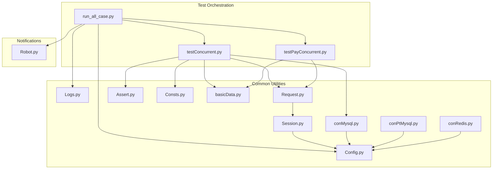
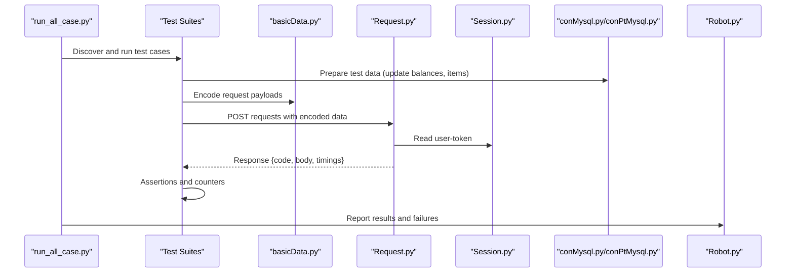
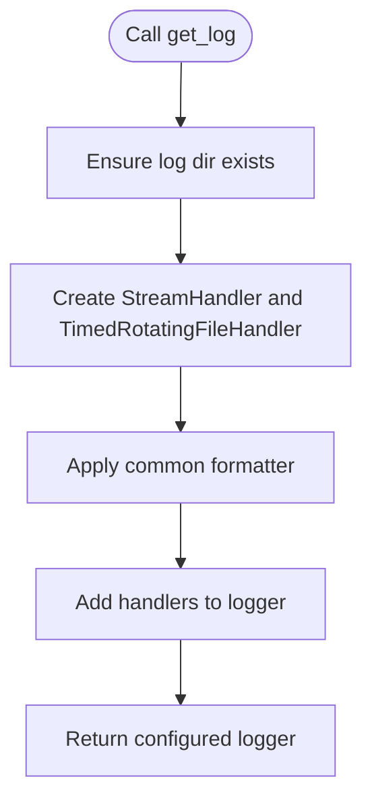
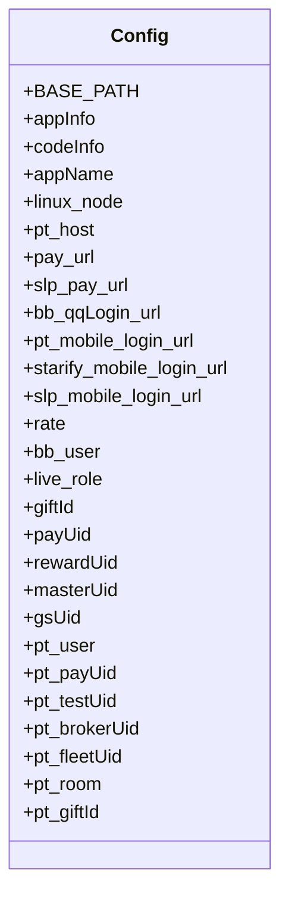
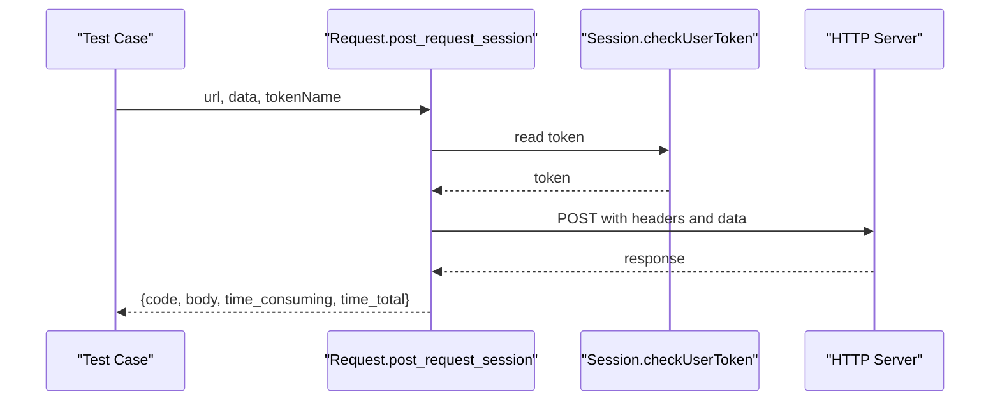
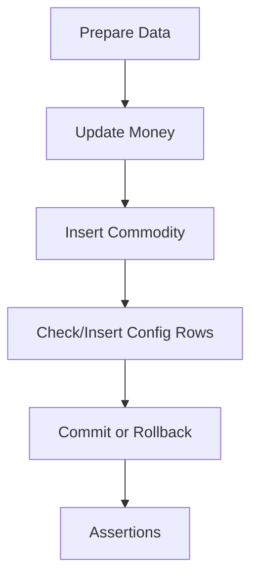
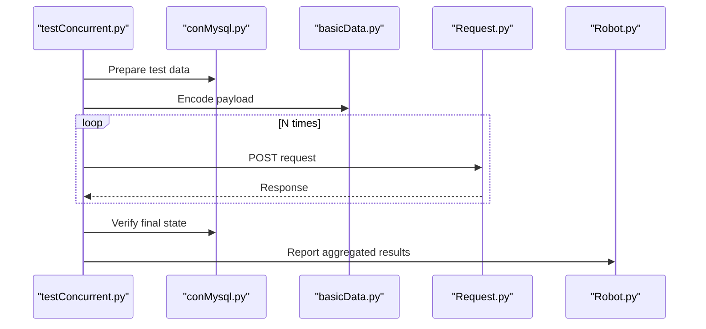
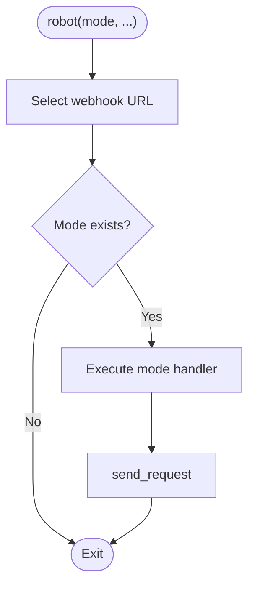
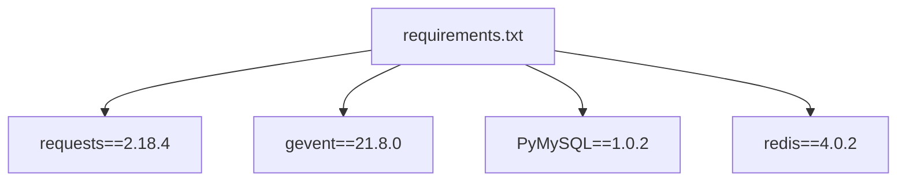

# Troubleshooting and Maintenance

<cite>
**Referenced Files in This Document**
- [README.md](file://README.md)
- [requirements.txt](file://requirements.txt)
- [common/Logs.py](file://common/Logs.py)
- [common/Config.py](file://common/Config.py)
- [common/Consts.py](file://common/Consts.py)
- [common/Assert.py](file://common/Assert.py)
- [common/basicData.py](file://common/basicData.py)
- [common/Request.py](file://common/Request.py)
- [common/Session.py](file://common/Session.py)
- [common/conMysql.py](file://common/conMysql.py)
- [common/conPtMysql.py](file://common/conPtMysql.py)
- [common/conRedis.py](file://common/conRedis.py)
- [run_all_case.py](file://run_all_case.py)
- [testConcurrent.py](file://testConcurrent.py)
- [testPayConcurrent.py](file://testPayConcurrent.py)
- [Robot.py](file://Robot.py)
</cite>

## Table of Contents
1. [Introduction](#introduction)
2. [Project Structure](#project-structure)
3. [Core Components](#core-components)
4. [Architecture Overview](#architecture-overview)
5. [Detailed Component Analysis](#detailed-component-analysis)
6. [Dependency Analysis](#dependency-analysis)
7. [Performance Considerations](#performance-considerations)
8. [Troubleshooting Guide](#troubleshooting-guide)
9. [Maintenance Procedures](#maintenance-procedures)
10. [Conclusion](#conclusion)
11. [Appendices](#appendices)

## Introduction
This document provides comprehensive troubleshooting and maintenance guidance for the automated payment test suite. It covers logging strategies, error diagnosis, performance monitoring, concurrent testing debugging, database connection maintenance, configuration updates, and framework upgrade practices. It also documents recovery procedures for common failure scenarios and escalation steps for complex issues.

## Project Structure
The repository organizes test automation around reusable components:
- Common utilities for configuration, logging, assertions, HTTP requests, sessions, and database/Redis connectivity
- Application-specific test suites under dedicated directories
- Orchestration scripts to run tests and report outcomes via chat bots

**Diagram sources**
- [run_all_case.py:12-159](file://run_all_case.py#L12-L159)
- [testConcurrent.py:17-281](file://testConcurrent.py#L17-L281)
- [testPayConcurrent.py:1-47](file://testPayConcurrent.py#L1-L47)
- [common/Config.py:6-133](file://common/Config.py#L6-L133)
- [common/Logs.py:8-48](file://common/Logs.py#L8-L48)
- [common/Request.py:17-59](file://common/Request.py#L17-L59)
- [common/Session.py:19-200](file://common/Session.py#L19-L200)
- [common/conMysql.py:8-530](file://common/conMysql.py#L8-L530)
- [common/conPtMysql.py:6-345](file://common/conPtMysql.py#L6-L345)
- [common/conRedis.py:4-34](file://common/conRedis.py#L4-L34)
- [common/Assert.py:11-96](file://common/Assert.py#L11-L96)
- [common/Consts.py:4-17](file://common/Consts.py#L4-L17)
- [common/basicData.py:9-581](file://common/basicData.py#L9-L581)
- [Robot.py:6-138](file://Robot.py#L6-L138)

**Section sources**
- [run_all_case.py:12-159](file://run_all_case.py#L12-L159)
- [testConcurrent.py:17-281](file://testConcurrent.py#L17-L281)
- [testPayConcurrent.py:1-47](file://testPayConcurrent.py#L1-L47)

## Core Components
- Logging: Centralized logger factory with rotating file handlers and console output
- Configuration: Environment and service endpoints, user/account constants, and server identifiers
- Assertions: Unified assertion helpers with standardized failure reasons
- HTTP Requests: Session-based POST requests with timing metrics and error handling
- Sessions: Token acquisition and persistence with fallback mechanisms
- Database Connectivity: MySQL connectors for main and oversea environments
- Redis Connectivity: Redis client utilities for key operations
- Concurrency: Gevent-based concurrent test runner
- Notifications: Chat-bot integrations for test results and alerts

**Section sources**
- [common/Logs.py:8-48](file://common/Logs.py#L8-L48)
- [common/Config.py:6-133](file://common/Config.py#L6-L133)
- [common/Assert.py:11-96](file://common/Assert.py#L11-L96)
- [common/Request.py:17-59](file://common/Request.py#L17-L59)
- [common/Session.py:19-200](file://common/Session.py#L19-L200)
- [common/conMysql.py:8-530](file://common/conMysql.py#L8-L530)
- [common/conPtMysql.py:6-345](file://common/conPtMysql.py#L6-L345)
- [common/conRedis.py:4-34](file://common/conRedis.py#L4-L34)
- [testConcurrent.py:17-281](file://testConcurrent.py#L17-L281)
- [Robot.py:6-138](file://Robot.py#L6-L138)

## Architecture Overview
The system orchestrates test runs, prepares data via database operations, executes HTTP requests with session tokens, validates responses, and reports outcomes.

**Diagram sources**
- [run_all_case.py:12-159](file://run_all_case.py#L12-L159)
- [testConcurrent.py:17-281](file://testConcurrent.py#L17-L281)
- [common/basicData.py:9-581](file://common/basicData.py#L9-L581)
- [common/Request.py:17-59](file://common/Request.py#L17-L59)
- [common/Session.py:168-183](file://common/Session.py#L168-L183)
- [common/conMysql.py:350-361](file://common/conMysql.py#L350-L361)
- [Robot.py:6-138](file://Robot.py#L6-L138)

## Detailed Component Analysis

### Logging Strategy
- Logger factory creates rotating file handlers and console handlers
- Log level defaults to debug; console level set to info
- Logs written under a log directory derived from base path
- Recommended usage: create separate loggers per functional area (e.g., database, HTTP, concurrency)

**Diagram sources**
- [common/Logs.py:8-48](file://common/Logs.py#L8-L48)

**Section sources**
- [common/Logs.py:8-48](file://common/Logs.py#L8-L48)

### Configuration Management
- Centralized constants for endpoints, user IDs, gift IDs, and server identifiers
- Environment-aware selection of apps and branches
- Linux node identification for orchestration

**Diagram sources**
- [common/Config.py:6-133](file://common/Config.py#L6-L133)

**Section sources**
- [common/Config.py:6-133](file://common/Config.py#L6-L133)

### HTTP Request and Session Handling
- POST requests with user-agent, content-type, and connection close
- Automatic HTTPS normalization and SSL warning suppression
- Token injection from persisted session file
- Response metadata includes status code, JSON body, and timing metrics

**Diagram sources**
- [common/Request.py:17-59](file://common/Request.py#L17-L59)
- [common/Session.py:168-183](file://common/Session.py#L168-L183)

**Section sources**
- [common/Request.py:17-59](file://common/Request.py#L17-L59)
- [common/Session.py:19-200](file://common/Session.py#L19-L200)

### Database Connectivity and Data Preparation
- MySQL connectors for main and oversea environments
- Methods to update balances, insert commodities, clean accounts, and prepare test data
- Transaction safety with rollback and commit patterns
- Ping to ensure connectivity and reconnect

**Diagram sources**
- [common/conMysql.py:350-361](file://common/conMysql.py#L350-L361)
- [common/conMysql.py:403-414](file://common/conMysql.py#L403-L414)
- [common/conMysql.py:324-333](file://common/conMysql.py#L324-L333)

**Section sources**
- [common/conMysql.py:8-530](file://common/conMysql.py#L8-L530)
- [common/conPtMysql.py:6-345](file://common/conPtMysql.py#L6-L345)

### Concurrent Testing Debugging
- Gevent-based concurrency for high-throughput scenarios
- Shared counters and global state for success/failure tracking
- Encoded payloads and repeated POST requests
- Results aggregated and logged with notifications

**Diagram sources**
- [testConcurrent.py:17-281](file://testConcurrent.py#L17-L281)
- [common/basicData.py:9-581](file://common/basicData.py#L9-L581)
- [common/Request.py:17-59](file://common/Request.py#L17-L59)
- [common/conMysql.py:350-361](file://common/conMysql.py#L350-L361)
- [Robot.py:6-138](file://Robot.py#L6-L138)

**Section sources**
- [testConcurrent.py:17-281](file://testConcurrent.py#L17-L281)
- [testPayConcurrent.py:1-47](file://testPayConcurrent.py#L1-L47)

### Notifications and Reporting
- Modes for success, failure, markdown, icon, Slack, and PT-specific channels
- Request sending with error handling and status checks
- Integration points for Slack and WeChat bots

**Diagram sources**
- [Robot.py:6-138](file://Robot.py#L6-L138)

**Section sources**
- [Robot.py:6-138](file://Robot.py#L6-L138)

## Dependency Analysis
External dependencies include HTTP clients, concurrency libraries, database drivers, and Redis client. These influence stability, performance, and maintainability.

**Diagram sources**
- [requirements.txt:1-85](file://requirements.txt#L1-L85)

**Section sources**
- [requirements.txt:1-85](file://requirements.txt#L1-L85)

## Performance Considerations
- Concurrency scaling: Use gevent workers judiciously; monitor resource limits and adjust worker counts
- Network latency: Capture response timings from request module; correlate with failures
- Database throughput: Batch updates and minimize transaction durations; ensure proper commits/rollbacks
- Logging overhead: Prefer rotating file handlers; avoid excessive debug-level logs in production runs
- Token refresh: Ensure token validity; implement retry with fallback when token retrieval fails

[No sources needed since this section provides general guidance]

## Troubleshooting Guide

### Logging Strategies
- Use distinct loggers per module (database, HTTP, concurrency)
- Adjust log levels during investigations (e.g., DEBUG for detailed traces)
- Monitor log rotation and disk usage; configure backup counts appropriately

**Section sources**
- [common/Logs.py:8-48](file://common/Logs.py#L8-L48)

### Error Diagnosis Approaches
- Status code mismatches: Validate expected vs. actual codes; capture failure reasons via assertions
- Assertion failures: Inspect standardized failure messages and recorded reasons
- Network errors: Check request exceptions and SSL warnings; verify endpoint reachability
- Session/token issues: Confirm token persistence and fallback mechanisms

**Section sources**
- [common/Assert.py:11-96](file://common/Assert.py#L11-L96)
- [common/Request.py:35-59](file://common/Request.py#L35-L59)
- [common/Session.py:60-67](file://common/Session.py#L60-L67)

### Systematic Debugging Workflows
- Reproduce locally: Run targeted test cases; isolate failing scenarios
- Validate data preparation: Confirm database updates and commodity inserts
- Inspect payloads: Verify encoded data correctness and parameterization
- Trace HTTP calls: Review response metadata and error logs
- Review notifications: Use chat-bot reports to triage failures quickly

**Section sources**
- [testConcurrent.py:17-281](file://testConcurrent.py#L17-L281)
- [common/basicData.py:9-581](file://common/basicData.py#L9-L581)
- [common/Request.py:17-59](file://common/Request.py#L17-L59)
- [Robot.py:6-138](file://Robot.py#L6-L138)

### Performance Monitoring Techniques
- Measure response times: Use elapsed microseconds/seconds from request responses
- Track concurrency: Observe success/failure counters and adjust worker counts
- Database profiling: Monitor update/query durations and transaction sizes

**Section sources**
- [common/Request.py:48-59](file://common/Request.py#L48-L59)
- [testConcurrent.py:17-281](file://testConcurrent.py#L17-L281)

### Memory Usage Optimization
- Minimize global state: Limit reliance on shared counters; reset after runs
- Close connections: Ensure database and Redis connections are reused via pools
- Avoid large payloads: Keep request bodies concise and validated

**Section sources**
- [common/Consts.py:4-17](file://common/Consts.py#L4-L17)
- [common/conRedis.py:11-15](file://common/conRedis.py#L11-L15)

### Concurrent Testing Debugging
- Isolate race conditions: Reduce concurrent load to identify contention
- Validate atomicity: Ensure database operations are properly committed
- Use structured counters: Track successes/failures consistently across threads

**Section sources**
- [testConcurrent.py:17-281](file://testConcurrent.py#L17-L281)
- [common/conMysql.py:350-361](file://common/conMysql.py#L350-L361)

### Common Failure Scenarios and Recovery
- Database connectivity: Re-ping and reconnect; rollback on errors; re-run failed transactions
- Token invalidation: Trigger fallback token retrieval; persist new tokens
- Network instability: Retry with backoff; suppress SSL warnings only in controlled environments

**Section sources**
- [common/conMysql.py:24-25](file://common/conMysql.py#L24-L25)
- [common/Session.py:60-67](file://common/Session.py#L60-L67)
- [common/Request.py:25-27](file://common/Request.py#L25-L27)

### Escalation Procedures
- Initial: Verify environment configuration and endpoints
- Intermediate: Collect logs, request traces, and assertion reasons
- Advanced: Enable higher verbosity, reproduce with minimal concurrency, and profile database operations

**Section sources**
- [common/Config.py:6-133](file://common/Config.py#L6-L133)
- [run_all_case.py:12-159](file://run_all_case.py#L12-L159)

## Maintenance Procedures

### Database Connections
- Health checks: Use ping with reconnect to ensure availability
- Transactions: Wrap DML operations with rollback/commit blocks
- Cleanup: Reset test data after runs to prevent cross-test interference

**Section sources**
- [common/conMysql.py:24-25](file://common/conMysql.py#L24-L25)
- [common/conMysql.py:350-361](file://common/conMysql.py#L350-L361)
- [common/conMysql.py:403-414](file://common/conMysql.py#L403-L414)

### Configuration Updates
- Endpoint changes: Update configuration constants and re-run environment-specific setups
- User/test data: Refresh IDs and room configurations as needed

**Section sources**
- [common/Config.py:6-133](file://common/Config.py#L6-L133)

### Framework Upgrades
- Dependency alignment: Align HTTP, concurrency, and database libraries with supported versions
- Compatibility testing: Validate request/response handling and session token flows after upgrades

**Section sources**
- [requirements.txt:1-85](file://requirements.txt#L1-L85)

### Preventive Maintenance Practices
- Regular log rotation and cleanup
- Scheduled health checks for database and Redis
- Periodic review of token persistence and fallback strategies

**Section sources**
- [common/Logs.py:8-48](file://common/Logs.py#L8-L48)
- [common/conRedis.py:11-15](file://common/conRedis.py#L11-L15)
- [common/Session.py:168-183](file://common/Session.py#L168-L183)

## Conclusion
This guide consolidates practical troubleshooting and maintenance practices for the payment test automation suite. By leveraging structured logging, robust assertions, resilient HTTP/session handling, and disciplined database operations, teams can effectively diagnose issues, optimize performance, and sustain reliable test runs across environments.

[No sources needed since this section summarizes without analyzing specific files]

## Appendices

### Diagnostic Tools Usage
- Chat-bot reporting: Use notification modes to surface failures and summaries
- Request tracing: Capture response codes and timings for performance insights
- Assertion logs: Record standardized failure reasons for quick triage

**Section sources**
- [Robot.py:6-138](file://Robot.py#L6-L138)
- [common/Request.py:48-59](file://common/Request.py#L48-L59)
- [common/Assert.py:11-96](file://common/Assert.py#L11-L96)

### Log Analysis Techniques
- Filter by timestamp and level to isolate incidents
- Correlate request IDs with assertion failures
- Rotate logs regularly to manage storage and retention

**Section sources**
- [common/Logs.py:8-48](file://common/Logs.py#L8-L48)