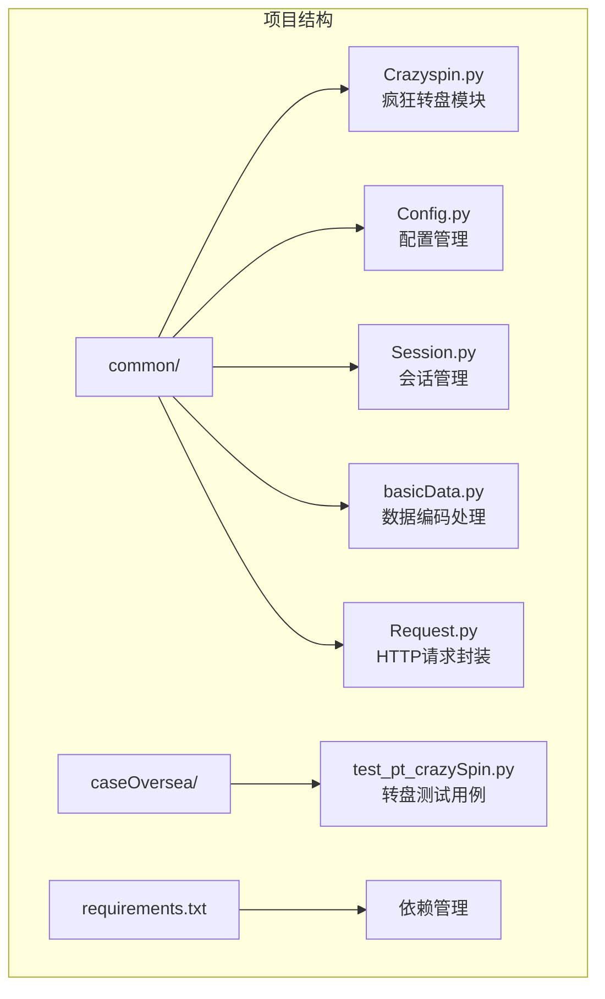
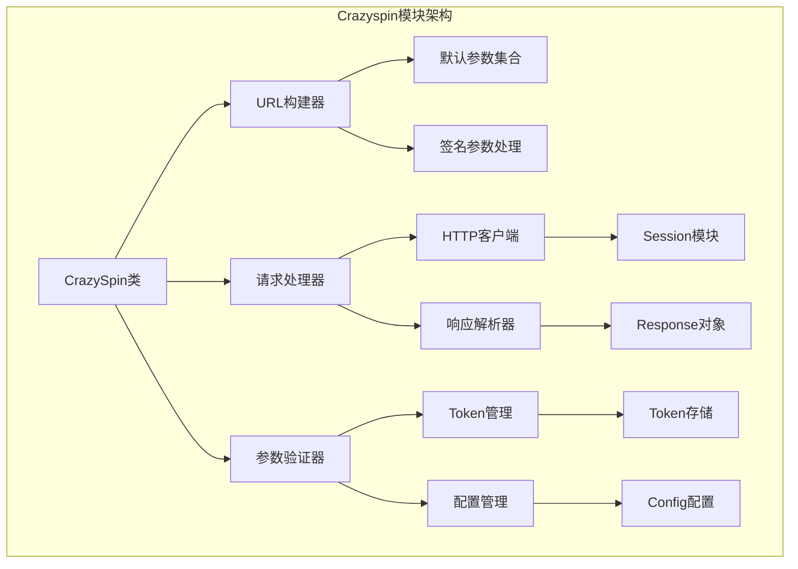
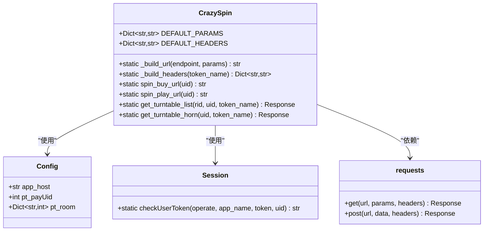
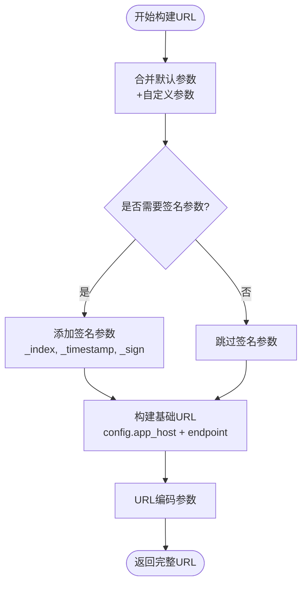
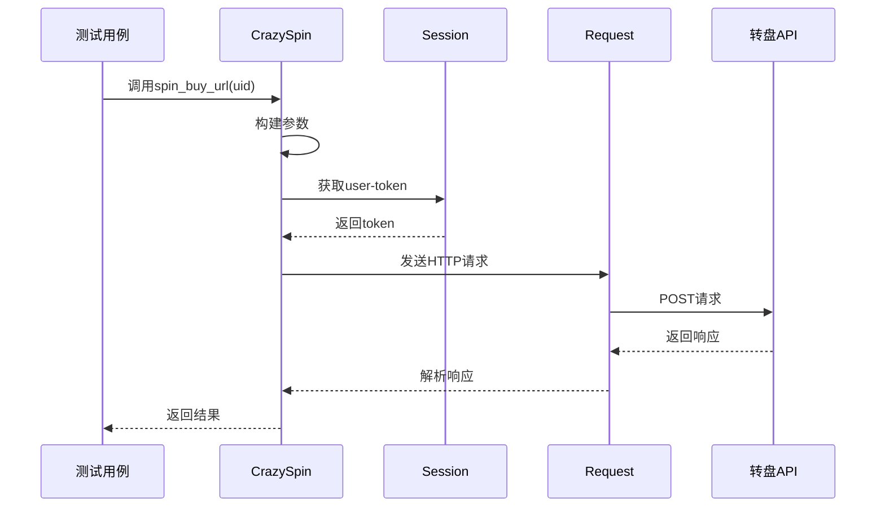
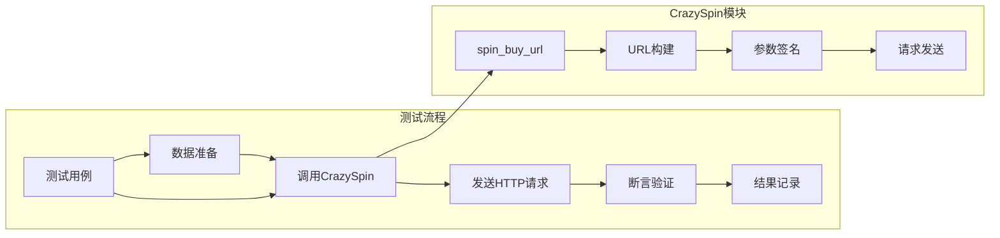
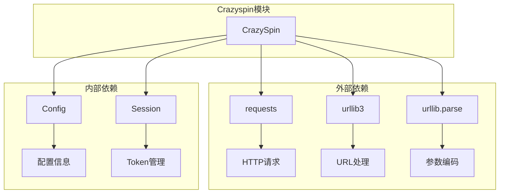

# Crazyspin模块文档

<cite>
**本文档引用的文件**
- [Crazyspin.py](file://common/Crazyspin.py)
- [test_pt_crazySpin.py](file://caseOversea/test_pt_crazySpin.py)
- [Config.py](file://common/Config.py)
- [Session.py](file://common/Session.py)
- [basicData.py](file://common/basicData.py)
- [Request.py](file://common/Request.py)
- [README.md](file://README.md)
- [requirements.txt](file://requirements.txt)
</cite>

## 目录
1. [简介](#简介)
2. [项目结构](#项目结构)
3. [核心组件](#核心组件)
4. [架构概览](#架构概览)
5. [详细组件分析](#详细组件分析)
6. [依赖关系分析](#依赖关系分析)
7. [性能考虑](#性能考虑)
8. [故障排除指南](#故障排除指南)
9. [结论](#结论)

## 简介

Crazyspin模块是QA-PayTest支付测试自动化框架中的一个重要组成部分，专门负责处理"疯狂转盘"游戏功能的测试。该模块提供了完整的转盘抽奖相关URL构建和HTTP请求功能，支持购买欢乐券、进行转盘抽奖等核心业务场景。

该模块基于Python 3开发，采用面向对象的设计模式，通过静态方法提供简洁易用的API接口，便于在测试用例中集成和使用。

## 项目结构

Crazyspin模块在整体项目架构中位于`common`目录下，作为核心公共类之一，为各个测试场景提供基础功能支持。

**图表来源**
- [Crazyspin.py:1-152](file://common/Crazyspin.py#L1-L152)
- [test_pt_crazySpin.py:1-74](file://caseOversea/test_pt_crazySpin.py#L1-L74)

**章节来源**
- [README.md:1-103](file://README.md#L1-L103)
- [requirements.txt:1-91](file://requirements.txt#L1-L91)

## 核心组件

Crazyspin模块的核心是一个名为`CrazySpin`的类，提供以下主要功能：

### 主要功能特性

1. **URL构建功能**：动态构建各种转盘相关API的完整URL
2. **HTTP请求处理**：封装GET和POST请求，自动添加必要的请求头和参数
3. **参数签名验证**：支持带签名参数的请求构建
4. **会话管理集成**：与Session模块无缝集成，自动获取和管理用户Token

### 关键方法概览

- `spin_buy_url(uid)`: 获取购买URL，用于购买欢乐券
- `spin_play_url(uid)`: 获取抽奖URL，用于进行转盘抽奖
- `get_turntable_list(rid, uid, token_name)`: 获取转盘列表
- `get_turntable_horn(uid, token_name)`: 获取转盘喇叭信息

**章节来源**
- [Crazyspin.py:36-152](file://common/Crazyspin.py#L36-L152)

## 架构概览

Crazyspin模块采用分层架构设计，各组件职责明确，耦合度低，便于维护和扩展。

**图表来源**
- [Crazyspin.py:36-152](file://common/Crazyspin.py#L36-L152)
- [Session.py:16-144](file://common/Session.py#L16-L144)
- [Config.py:121-241](file://common/Config.py#L121-L241)

## 详细组件分析

### CrazySpin类详细分析

CrazySpin类是整个模块的核心，采用了静态方法设计，避免了实例化的需求，提高了使用便利性。

**图表来源**
- [Crazyspin.py:36-152](file://common/Crazyspin.py#L36-L152)
- [Config.py:121-241](file://common/Config.py#L121-L241)
- [Session.py:124-144](file://common/Session.py#L124-L144)

#### URL构建流程

CrazySpin模块的URL构建遵循统一的流程：

**图表来源**
- [Crazyspin.py:40-51](file://common/Crazyspin.py#L40-L51)
- [Crazyspin.py:77-84](file://common/Crazyspin.py#L77-L84)

#### 请求处理流程

**图表来源**
- [test_pt_crazySpin.py:32-35](file://caseOversea/test_pt_crazySpin.py#L32-L35)
- [Crazyspin.py:68-84](file://common/Crazyspin.py#L68-L84)
- [Session.py:124-144](file://common/Session.py#L124-L144)

**章节来源**
- [Crazyspin.py:36-152](file://common/Crazyspin.py#L36-L152)
- [test_pt_crazySpin.py:14-73](file://caseOversea/test_pt_crazySpin.py#L14-L73)

### 参数配置系统

Crazyspin模块使用统一的参数配置系统，确保请求的一致性和可维护性。

#### 默认参数配置

| 参数名 | 默认值 | 用途 |
|--------|--------|------|
| `package` | `com.imbb.oversea.android` | 应用包名标识 |
| `_ipv` | `0` | IP版本标识 |
| `_platform` | `android` | 平台类型 |
| `_model` | `Pixel 3a` | 设备型号 |
| `_abi` | `arm64-v8a` | CPU架构 |
| `format` | `json` | 响应格式 |

#### 签名参数系统

签名参数是Crazyspin模块的重要安全特性，每个请求都包含特定的签名参数：

- `_index`: 请求索引标识
- `_timestamp`: 时间戳
- `_sign`: 签名值

这些参数确保了请求的完整性和防重放攻击能力。

**章节来源**
- [Crazyspin.py:18-33](file://common/Crazyspin.py#L18-L33)
- [Crazyspin.py:77-103](file://common/Crazyspin.py#L77-L103)

### 测试用例集成

Crazyspin模块与测试用例的集成体现了良好的设计原则：

**图表来源**
- [test_pt_crazySpin.py:16-40](file://caseOversea/test_pt_crazySpin.py#L16-L40)
- [test_pt_crazySpin.py:42-73](file://caseOversea/test_pt_crazySpin.py#L42-L73)

**章节来源**
- [test_pt_crazySpin.py:14-73](file://caseOversea/test_pt_crazySpin.py#L14-L73)

## 依赖关系分析

Crazyspin模块的依赖关系清晰明确，遵循了单一职责原则和依赖倒置原则。

**图表来源**
- [Crazyspin.py:7-12](file://common/Crazyspin.py#L7-L12)
- [Config.py:121-241](file://common/Config.py#L121-L241)
- [Session.py:16-144](file://common/Session.py#L16-L144)

### 关键依赖说明

1. **requests库**：提供HTTP请求功能，支持GET和POST方法
2. **urllib3**：处理SSL证书验证和网络连接
3. **Config模块**：提供应用配置信息，包括主机地址等
4. **Session模块**：管理用户Token，确保请求的安全性

**章节来源**
- [requirements.txt:11-14](file://requirements.txt#L11-L14)
- [Crazyspin.py:7-12](file://common/Crazyspin.py#L7-L12)

## 性能考虑

Crazyspin模块在设计时充分考虑了性能优化：

### 连接管理
- 使用`Connection: close`头部确保每次请求后连接及时释放
- 避免长连接造成的资源浪费

### 参数优化
- 使用字典合并操作符(`**`)提高参数构建效率
- 预分配默认参数，减少重复创建开销

### 缓存策略
- Token通过文件系统缓存，避免频繁的网络请求
- 配置信息采用单例模式，确保全局唯一性

## 故障排除指南

### 常见问题及解决方案

#### 1. Token相关错误
**问题症状**：请求返回认证失败
**解决方法**：
- 检查Token文件是否存在且有效
- 验证Token是否过期
- 确认Token对应的用户ID正确

#### 2. URL构建错误
**问题症状**：请求地址格式不正确
**解决方法**：
- 验证`config.app_host`配置正确
- 检查参数编码是否正确
- 确认签名参数完整性

#### 3. 网络连接问题
**问题症状**：请求超时或连接失败
**解决方法**：
- 检查网络连接状态
- 验证目标服务器可达性
- 调整请求超时时间

**章节来源**
- [Session.py:124-144](file://common/Session.py#L124-L144)
- [Crazyspin.py:40-51](file://common/Crazyspin.py#L40-L51)

## 结论

Crazyspin模块作为QA-PayTest框架的重要组成部分，展现了优秀的软件工程实践：

### 设计优势
1. **模块化设计**：功能职责明确，易于维护和扩展
2. **安全性考虑**：内置签名验证和Token管理机制
3. **易用性**：提供简洁的API接口，降低使用复杂度
4. **可测试性**：良好的抽象层次，便于单元测试和集成测试

### 技术特点
- 采用静态方法设计，避免不必要的实例化开销
- 统一的参数管理和URL构建机制
- 与Session和Config模块的深度集成
- 完善的错误处理和日志记录机制

### 应用价值
Crazyspin模块不仅满足了当前的测试需求，还为未来的功能扩展奠定了坚实的基础。其设计原则和实现模式可以作为其他类似模块的参考模板，有助于提升整个测试框架的质量和稳定性。