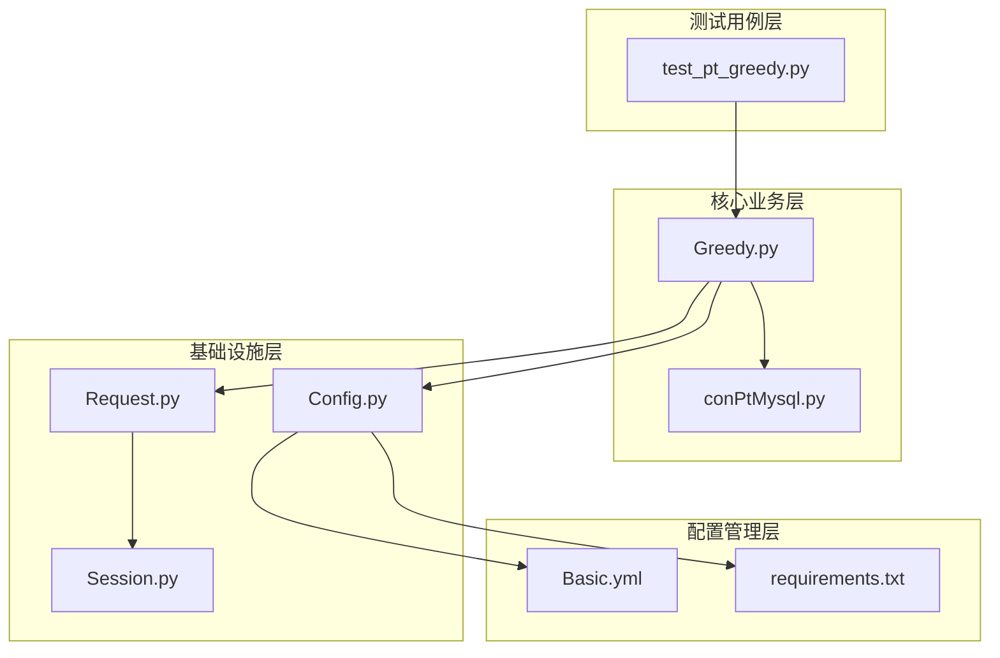
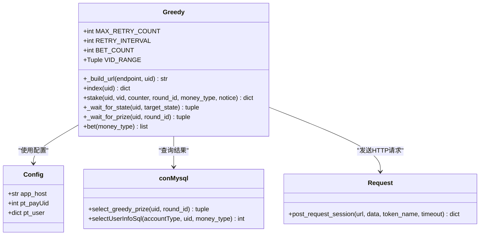
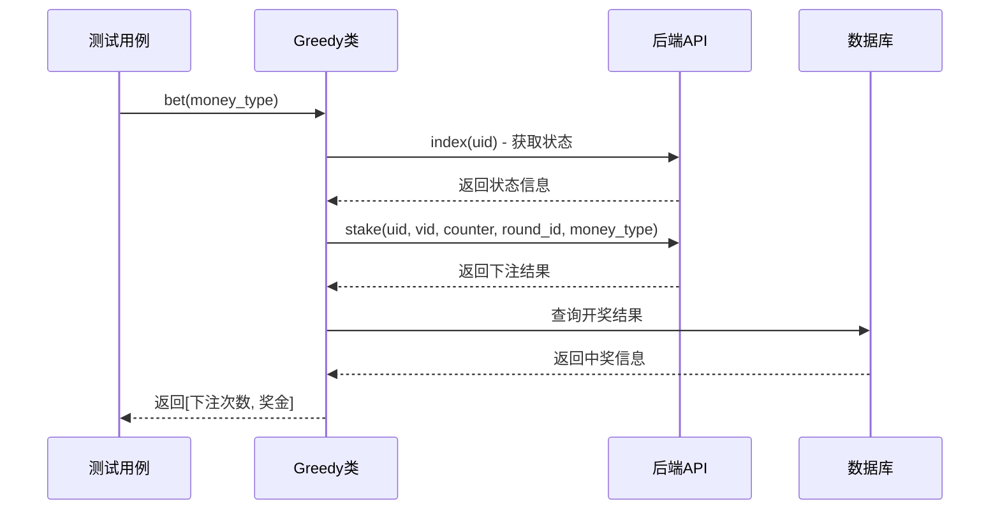
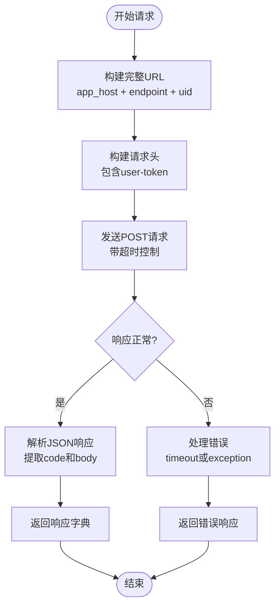
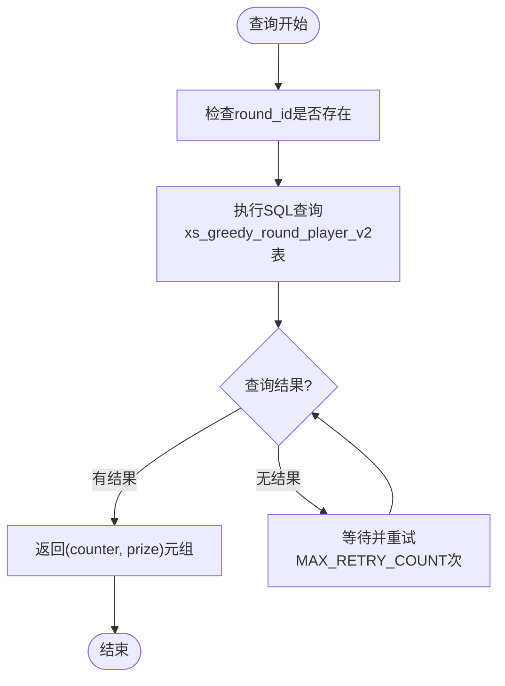
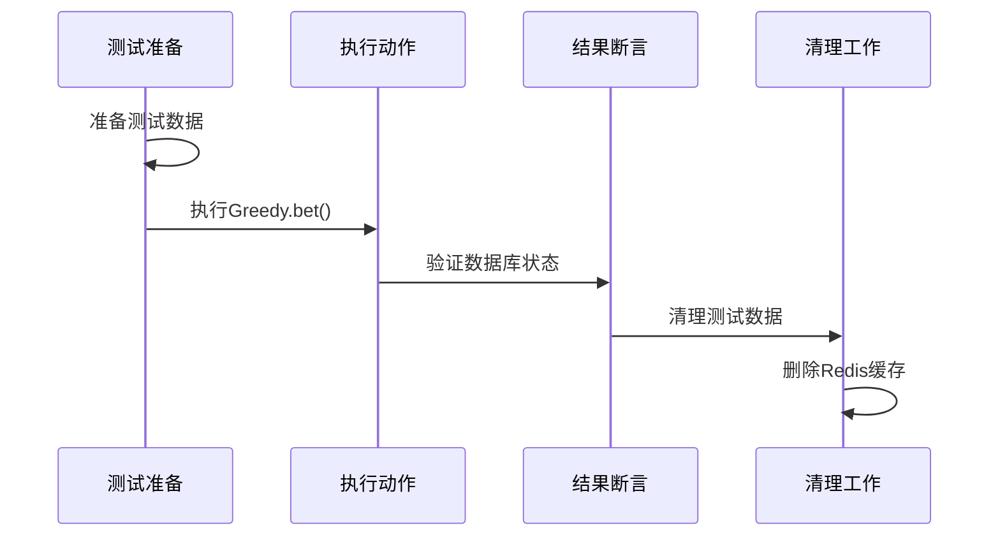
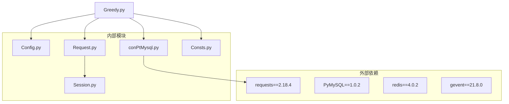

# Greedy模块文档

<cite>
**本文档引用的文件**
- [Greedy.py](file://common/Greedy.py)
- [test_pt_greedy.py](file://caseLuckyPlay/test_pt_greedy.py)
- [Config.py](file://common/Config.py)
- [conPtMysql.py](file://common/conPtMysql.py)
- [Request.py](file://common/Request.py)
- [Session.py](file://common/Session.py)
- [Consts.py](file://common/Consts.py)
- [README.md](file://README.md)
- [requirements.txt](file://requirements.txt)
- [run_all_case.py](file://run_all_case.py)
</cite>

## 目录
1. [简介](#简介)
2. [项目结构](#项目结构)
3. [核心组件](#核心组件)
4. [架构概览](#架构概览)
5. [详细组件分析](#详细组件分析)
6. [依赖关系分析](#依赖关系分析)
7. [性能考虑](#性能考虑)
8. [故障排除指南](#故障排除指南)
9. [结论](#结论)

## 简介

Greedy模块是QA-PayTest支付测试自动化框架中的一个核心组件，专门用于实现"摩天轮"游戏的自动化测试功能。该模块提供了完整的下注、查询和结果验证流程，支持多种货币类型的测试场景，包括金豆和钻石等不同币种。

该模块采用面向对象的设计模式，通过HTTP请求与后端服务进行交互，并通过数据库查询验证业务逻辑的正确性。整个系统支持多环境配置，包括开发环境、测试环境和生产环境的不同设置。

## 项目结构

项目采用分层架构设计，主要分为以下几个层次：

**图表来源**
- [test_pt_greedy.py:1-106](file://caseLuckyPlay/test_pt_greedy.py#L1-L106)
- [Greedy.py:1-141](file://common/Greedy.py#L1-L141)
- [Config.py:1-247](file://common/Config.py#L1-L247)

**章节来源**
- [README.md:1-103](file://README.md#L1-L103)
- [requirements.txt:1-91](file://requirements.txt#L1-L91)

## 核心组件

### Greedy类设计

Greedy类是整个模块的核心，提供了完整的摩天轮游戏自动化测试功能。该类采用静态方法设计，便于在测试环境中直接调用。

**图表来源**
- [Greedy.py:23-141](file://common/Greedy.py#L23-L141)
- [Config.py:203-241](file://common/Config.py#L203-L241)
- [conPtMysql.py:194-200](file://common/conPtMysql.py#L194-L200)
- [Request.py:71-107](file://common/Request.py#L71-L107)

### 配置常量设计

模块定义了多个关键的配置常量，用于控制测试行为：

| 常量名 | 值 | 用途 |
|--------|-----|------|
| MAX_RETRY_COUNT | 10 | 最大重试次数 |
| RETRY_INTERVAL | 5 | 重试间隔（秒） |
| BET_COUNT | 6 | 单次下注次数 |
| VID_RANGE | (1, 8) | 下注选项范围 |

**章节来源**
- [Greedy.py:16-21](file://common/Greedy.py#L16-L21)

## 架构概览

整个Greedy模块的架构遵循分层设计原则，各层职责明确：

**图表来源**
- [test_pt_greedy.py:64](file://caseLuckyPlay/test_pt_greedy.py#L64)
- [Greedy.py:113-141](file://common/Greedy.py#L113-L141)

## 详细组件分析

### HTTP请求处理机制

Greedy模块通过统一的HTTP请求封装来与后端服务通信。该机制支持多种认证方式和错误处理策略。

**图表来源**
- [Request.py:71-107](file://common/Request.py#L71-L107)
- [Greedy.py:27-50](file://common/Greedy.py#L27-L50)

### 数据库查询优化

模块通过专门的数据库查询方法来获取摩天轮游戏的结果数据，支持多种查询场景：

**图表来源**
- [conPtMysql.py:194-200](file://common/conPtMysql.py#L194-L200)
- [Greedy.py:95-110](file://common/Greedy.py#L95-L110)

### 测试用例设计模式

测试用例采用了标准的AAA（Arrange-Act-Assert）模式，确保测试的可维护性和可读性：

**图表来源**
- [test_pt_greedy.py:23-43](file://caseLuckyPlay/test_pt_greedy.py#L23-L43)
- [test_pt_greedy.py:16-22](file://caseLuckyPlay/test_pt_greedy.py#L16-L22)

**章节来源**
- [test_pt_greedy.py:44-106](file://caseLuckyPlay/test_pt_greedy.py#L44-L106)

## 依赖关系分析

### 外部依赖关系

Greedy模块依赖于多个外部库和内部模块，形成了完整的测试生态系统：

**图表来源**
- [requirements.txt:11-23](file://requirements.txt#L11-L23)
- [Greedy.py:11-13](file://common/Greedy.py#L11-L13)

### 内部模块耦合度分析

模块间的耦合关系相对松散，主要通过配置类进行解耦：

| 模块 | 主要依赖 | 耦合程度 | 说明 |
|------|----------|----------|------|
| Greedy.py | Config.py, Request.py, conPtMysql.py | 低 | 通过配置类解耦 |
| test_pt_greedy.py | Greedy.py, conPtMysql.py, Consts.py | 中等 | 测试用例依赖核心功能 |
| Request.py | Session.py | 中等 | HTTP请求依赖会话管理 |
| conPtMysql.py | Config.py | 低 | 通过配置类访问数据库 |

**章节来源**
- [requirements.txt:1-91](file://requirements.txt#L1-L91)

## 性能考虑

### 并发处理能力

系统支持高并发测试场景，通过以下机制保证性能：

1. **异步请求处理**：使用gevent库实现协程并发
2. **连接池管理**：数据库连接自动复用和重连
3. **超时控制**：HTTP请求设置合理的超时时间
4. **重试机制**：智能重试避免临时性网络问题

### 内存管理优化

- 使用生成器表达式减少内存占用
- 及时清理测试数据避免内存泄漏
- 合理的连接关闭策略

## 故障排除指南

### 常见问题及解决方案

| 问题类型 | 症状 | 可能原因 | 解决方案 |
|----------|------|----------|----------|
| 网络超时 | Request timeout | 网络不稳定或服务器响应慢 | 增加超时时间，检查网络连接 |
| 认证失败 | Token无效 | Token过期或配置错误 | 更新Token配置，重新登录 |
| 数据库连接失败 | Query error | 数据库服务不可用 | 检查数据库连接配置，重启服务 |
| 重试超时 | 返回[0, 0] | 状态未达到目标 | 检查目标状态配置，延长等待时间 |

### 调试技巧

1. **启用详细日志**：查看HTTP请求和响应详情
2. **检查配置文件**：确认环境配置正确性
3. **验证数据库连接**：确保测试数据准备正确
4. **监控系统资源**：避免资源耗尽导致的问题

**章节来源**
- [Request.py:98-106](file://common/Request.py#L98-L106)
- [Greedy.py:138-140](file://common/Greedy.py#L138-L140)

## 结论

Greedy模块作为QA-PayTest框架的重要组成部分，展现了良好的软件工程实践：

1. **模块化设计**：清晰的职责分离和接口定义
2. **可扩展性**：支持多种货币类型和游戏场景
3. **稳定性**：完善的错误处理和重试机制
4. **可维护性**：标准化的测试流程和配置管理

该模块为支付测试自动化提供了坚实的基础，能够有效支持复杂的业务场景测试需求。通过持续的优化和改进，可以进一步提升测试效率和质量。