# Planet Journey Tests

<cite>
**本文档引用的文件**
- [README.md](file://README.md)
- [run_all_case.py](file://run_all_case.py)
- [Robot.py](file://Robot.py)
- [common/Config.py](file://common/Config.py)
- [common/Consts.py](file://common/Consts.py)
- [common/Request.py](file://common/Request.py)
- [common/Assert.py](file://common/Assert.py)
- [common/Session.py](file://common/Session.py)
- [common/conMysql.py](file://common/conMysql.py)
- [common/Logs.py](file://common/Logs.py)
- [autoGitPull.py](file://autoGitPull.py)
- [common/getToken.py](file://common/getToken.py)
- [requirements.txt](file://requirements.txt)
- [case/test_pay_shopBuy.py](file://case/test_pay_shopBuy.py)
- [case/test_pay_openBox.py](file://case/test_pay_openBox.py)
</cite>

## 目录
1. [简介](#简介)
2. [项目结构](#项目结构)
3. [核心组件](#核心组件)
4. [架构概览](#架构概览)
5. [详细组件分析](#详细组件分析)
6. [依赖分析](#依赖分析)
7. [性能考虑](#性能考虑)
8. [故障排除指南](#故障排除指南)
9. [结论](#结论)

## 简介

Planet Journey支付测试自动化框架是一个全面的测试解决方案，专门用于验证支付模块的各种场景。该框架支持多种支付场景的自动化测试，包括金豆支付、金币支付、商城购买、房间支付等。

### 主要特性

- **多应用支持**：支持伴伴、Planet Journey（PT）、不夜星球等多个应用的测试
- **多环境配置**：支持开发、测试、生产等不同环境的配置管理
- **自动化通知**：集成机器人通知系统，支持微信和Slack消息推送
- **数据库集成**：内置数据库连接和操作功能，支持复杂的测试数据准备
- **断言验证**：提供丰富的断言方法，支持多种验证场景
- **并发测试**：支持并发测试执行，提高测试效率

## 项目结构

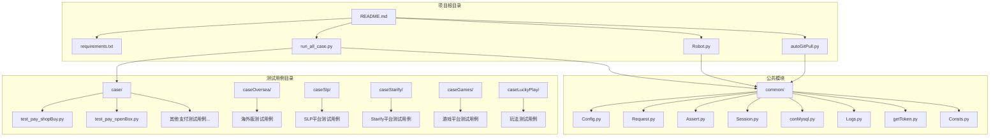

**图表来源**
- [README.md:1-103](file://README.md#L1-L103)
- [run_all_case.py:1-240](file://run_all_case.py#L1-L240)

### 目录组织说明

- **case/**：核心支付测试用例目录，包含各种支付场景的测试
- **caseOversea/**：海外版本测试用例，支持多地区支付场景
- **caseSlp/**：SLP平台专用测试用例
- **caseStarify/**：Starify平台测试用例
- **caseGames/**：游戏相关支付测试
- **caseLuckyPlay/**：各种玩法测试用例
- **common/**：公共模块，包含框架的核心功能

**章节来源**
- [README.md:7-103](file://README.md#L7-L103)
- [run_all_case.py:18-45](file://run_all_case.py#L18-L45)

## 核心组件

### 配置管理系统

配置管理是整个测试框架的基础，负责管理各种环境配置和全局设置。

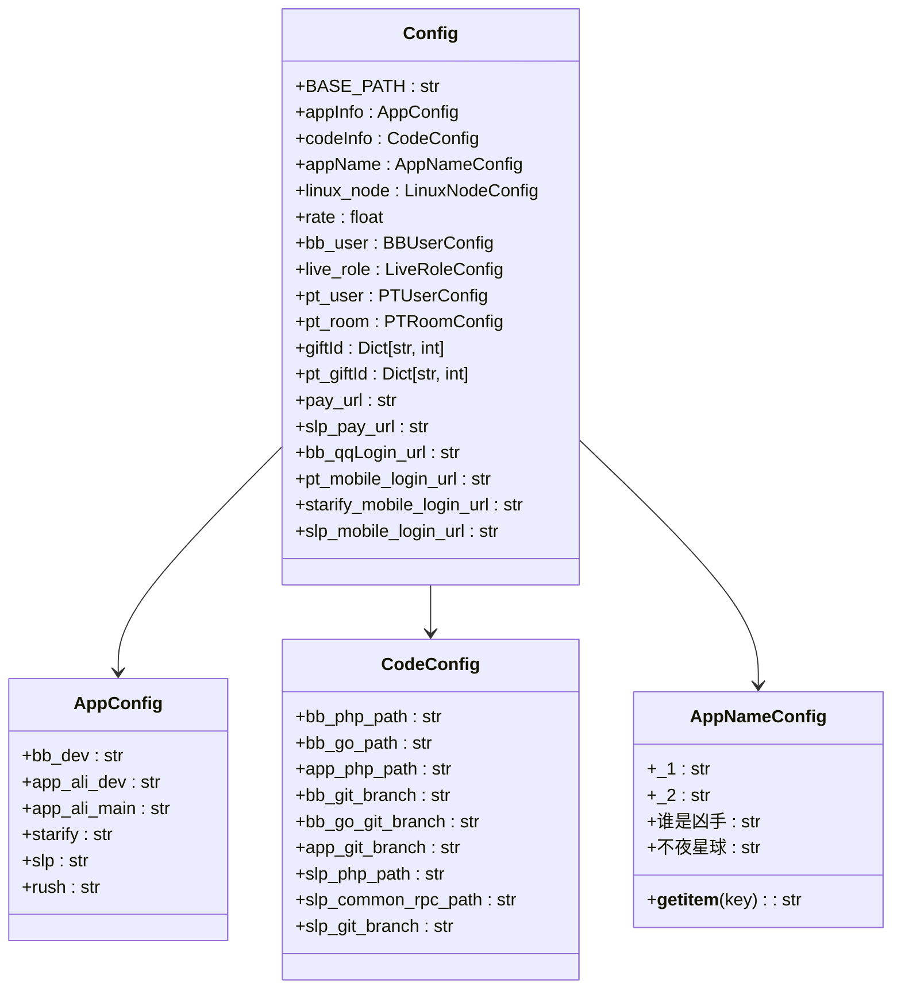

**图表来源**
- [common/Config.py:15-241](file://common/Config.py#L15-L241)

### HTTP请求封装

统一的HTTP请求处理，支持多种认证方式和错误处理。

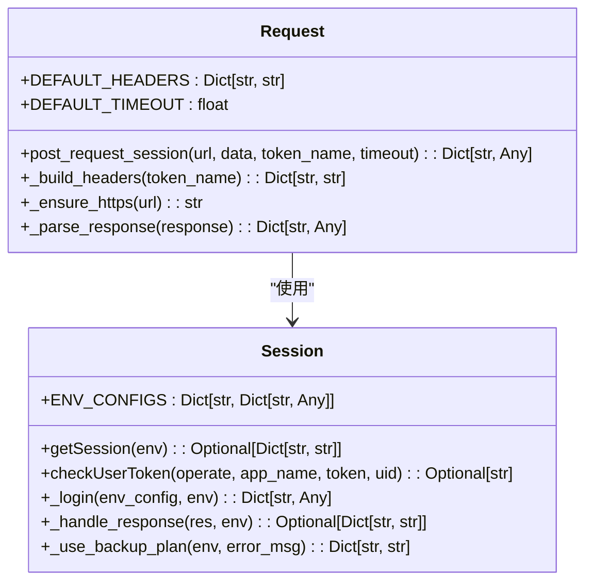

**图表来源**
- [common/Request.py:27-107](file://common/Request.py#L27-L107)
- [common/Session.py:19-191](file://common/Session.py#L19-L191)

### 断言验证系统

提供多种断言方法，支持复杂的验证场景。

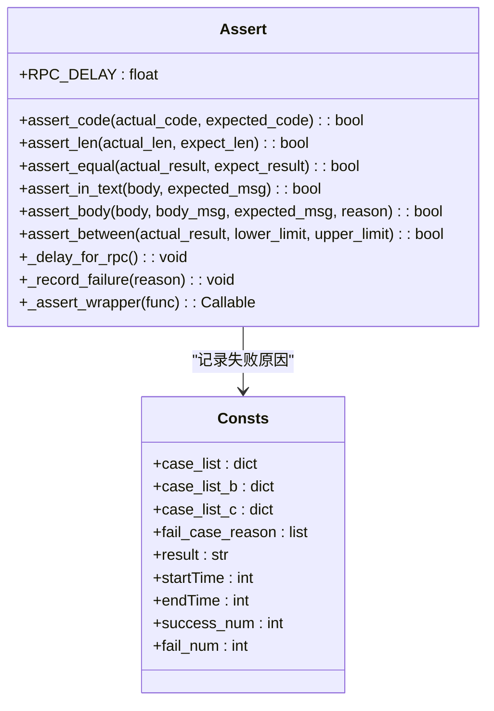

**图表来源**
- [common/Assert.py:16-167](file://common/Assert.py#L16-L167)
- [common/Consts.py:1-17](file://common/Consts.py#L1-17)

**章节来源**
- [common/Config.py:121-241](file://common/Config.py#L121-L241)
- [common/Request.py:1-119](file://common/Request.py#L1-L119)
- [common/Assert.py:1-167](file://common/Assert.py#L1-L167)
- [common/Consts.py:1-17](file://common/Consts.py#L1-L17)

## 架构概览

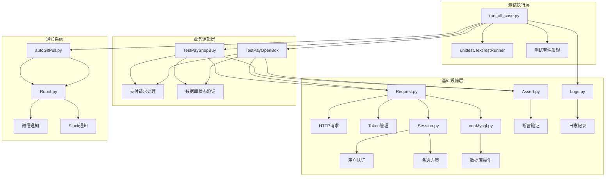

**图表来源**
- [run_all_case.py:48-77](file://run_all_case.py#L48-L77)
- [common/Request.py:71-107](file://common/Request.py#L71-L107)
- [common/Session.py:126-153](file://common/Session.py#L126-L153)
- [common/conMysql.py:8-204](file://common/conMysql.py#L8-L204)

### 测试执行流程

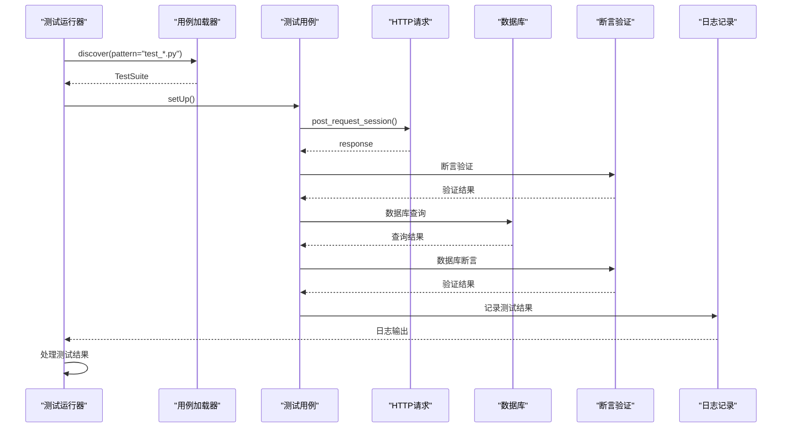

**图表来源**
- [run_all_case.py:48-77](file://run_all_case.py#L48-L77)
- [case/test_pay_shopBuy.py:45-79](file://case/test_pay_shopBuy.py#L45-L79)

## 详细组件分析

### 商城购买测试组件

商城购买测试组件验证了商城购买道具的各种场景，包括单个购买、批量购买、礼物赠送等功能。

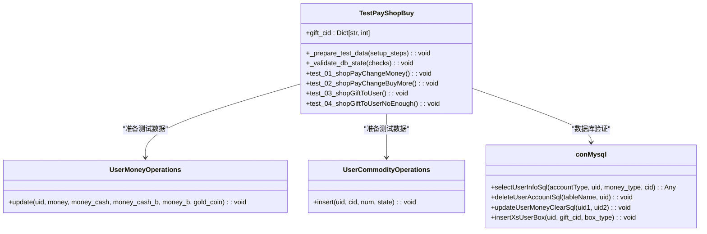

**图表来源**
- [case/test_pay_shopBuy.py:13-191](file://case/test_pay_shopBuy.py#L13-L191)
- [common/conMysql.py:28-204](file://common/conMysql.py#L28-L204)

#### 测试流程分析

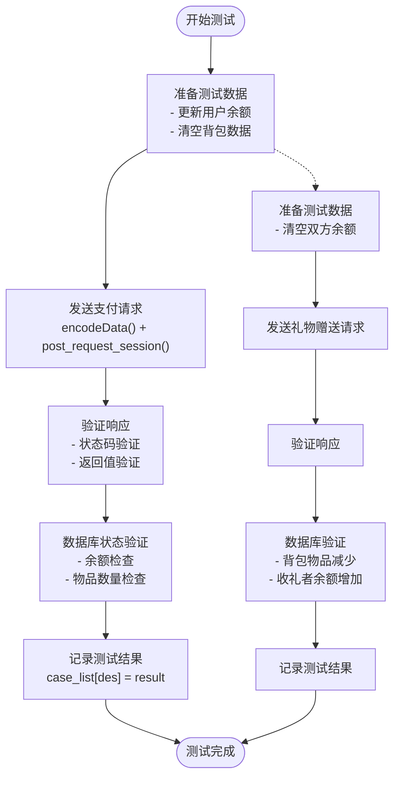

**图表来源**
- [case/test_pay_shopBuy.py:45-191](file://case/test_pay_shopBuy.py#L45-L191)

**章节来源**
- [case/test_pay_shopBuy.py:13-191](file://case/test_pay_shopBuy.py#L13-L191)

### 开箱子测试组件

开箱子测试组件验证了背包内开箱子的各种场景，包括单次开箱、批量开箱、房间内送箱等功能。

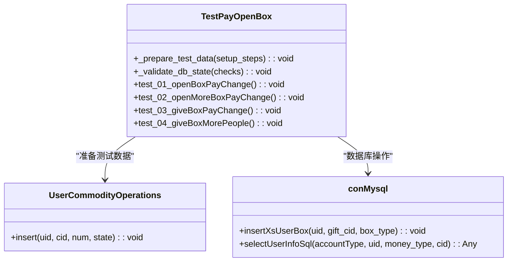

**图表来源**
- [case/test_pay_openBox.py:12-193](file://case/test_pay_openBox.py#L12-L193)
- [common/conMysql.py:389-401](file://common/conMysql.py#L389-L401)

#### 开箱场景验证

```mermaid
sequenceDiagram
participant Test as "测试用例"
participant Data as "测试数据准备"
participant Box as "箱子操作"
participant DB as "数据库验证"
participant Assert as "断言验证"
Test->>Data : 准备测试数据
Data->>DB : 清空用户背包
Data->>DB : 插入箱子物品
Data->>DB : 设置用户余额
Test->>Box : 发送开箱请求
Box-->>Test : 返回开箱结果
Test->>Assert : 验证响应状态
Assert-->>Test : 断言通过
Test->>DB : 查询余额变化
DB-->>Test : 返回余额数据
Test->>Assert : 验证余额
Assert-->>Test : 断言通过
Test->>DB : 查询物品数量
DB-->>Test : 返回物品数据
Test->>Assert : 验证物品数量
Assert-->>Test : 断言通过
```

**图表来源**
- [case/test_pay_openBox.py:40-80](file://case/test_pay_openBox.py#L40-L80)

**章节来源**
- [case/test_pay_openBox.py:12-193](file://case/test_pay_openBox.py#L12-L193)

### 通知系统组件

通知系统负责测试结果的通知和消息推送。

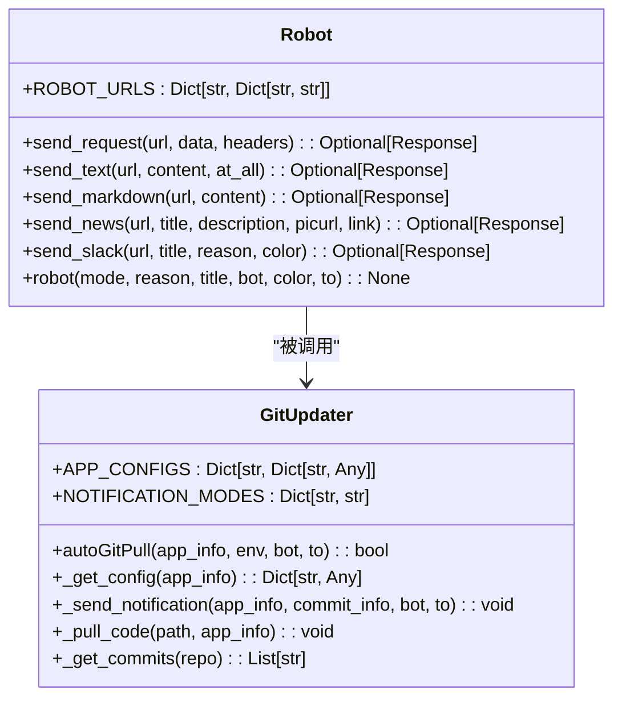

**图表来源**
- [Robot.py:13-169](file://Robot.py#L13-L169)
- [autoGitPull.py:23-136](file://autoGitPull.py#L23-L136)

**章节来源**
- [Robot.py:1-170](file://Robot.py#L1-L170)
- [autoGitPull.py:1-169](file://autoGitPull.py#L1-L169)

## 依赖分析

### 核心依赖关系

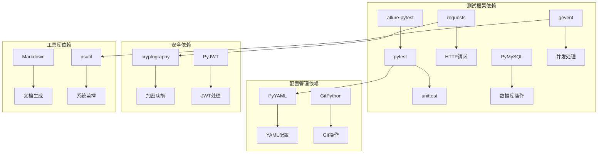

**图表来源**
- [requirements.txt:1-91](file://requirements.txt#L1-L91)

### 组件耦合度分析

| 组件 | 内聚性 | 耦合度 | 依赖关系 |
|------|--------|--------|----------|
| Config | 高 | 低 | 基础配置 |
| Request | 中 | 中 | Session, Config |
| Session | 中 | 中 | Config, YAML |
| Assert | 高 | 低 | Consts |
| conMysql | 高 | 中 | Config |
| Robot | 中 | 中 | Requests |
| GitUpdater | 中 | 中 | GitPython, Robot |

**章节来源**
- [requirements.txt:1-91](file://requirements.txt#L1-L91)

## 性能考虑

### 并发测试优化

框架支持并发测试执行，通过以下机制优化性能：

1. **连接池管理**：合理管理数据库连接，避免连接泄漏
2. **请求超时控制**：设置合理的请求超时时间，防止阻塞
3. **资源清理**：测试结束后及时清理临时数据和连接
4. **日志异步**：使用异步日志记录，减少I/O阻塞

### 数据库性能优化

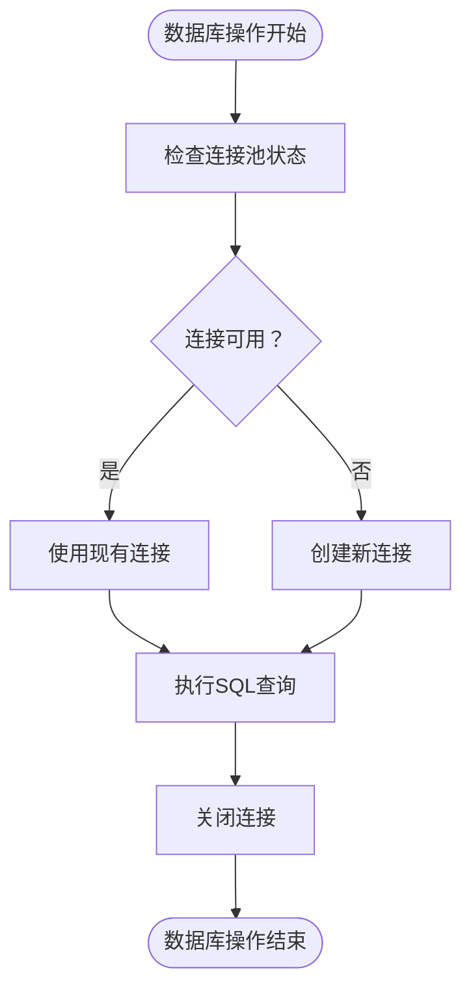

**图表来源**
- [common/conMysql.py:8-26](file://common/conMysql.py#L8-L26)

## 故障排除指南

### 常见问题及解决方案

#### 1. Token获取失败

**问题症状**：测试执行时报错提示Token无效或过期

**解决方案**：
- 检查Session配置是否正确
- 验证备选方案是否正常工作
- 确认数据库中的用户信息是否存在

#### 2. 数据库连接异常

**问题症状**：数据库操作报连接超时或连接拒绝

**解决方案**：
- 检查数据库服务状态
- 验证连接配置参数
- 确认防火墙设置

#### 3. HTTP请求超时

**问题症状**：支付请求长时间无响应

**解决方案**：
- 增加请求超时时间
- 检查网络连接
- 验证目标服务器状态

#### 4. 断言失败

**问题症状**：测试用例执行失败，断言不通过

**解决方案**：
- 检查测试数据准备是否正确
- 验证期望值设置
- 查看失败原因记录

**章节来源**
- [common/Session.py:105-153](file://common/Session.py#L105-L153)
- [common/conMysql.py:8-26](file://common/conMysql.py#L8-L26)
- [common/Request.py:98-106](file://common/Request.py#L98-L106)

## 结论

Planet Journey支付测试自动化框架是一个功能完整、结构清晰的测试解决方案。该框架具有以下特点：

### 优势

1. **模块化设计**：各个组件职责明确，便于维护和扩展
2. **配置灵活**：支持多环境配置，适应不同的测试需求
3. **自动化程度高**：从测试执行到结果通知全程自动化
4. **数据完整性**：完善的数据库操作和验证机制
5. **错误处理完善**：全面的异常处理和故障恢复机制

### 改进建议

1. **测试数据管理**：可以考虑引入更强大的测试数据生成工具
2. **报告增强**：可以集成更丰富的测试报告生成功能
3. **监控集成**：可以添加实时监控和告警功能
4. **容器化部署**：可以考虑支持Docker容器化部署

该框架为支付模块的自动化测试提供了坚实的基础，能够有效提高测试效率和质量，减少人工干预，确保支付功能的稳定性和可靠性。