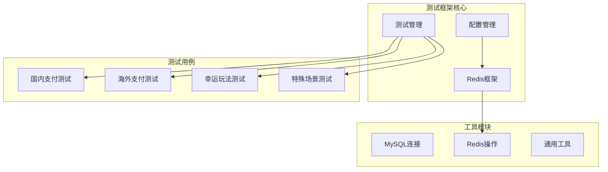
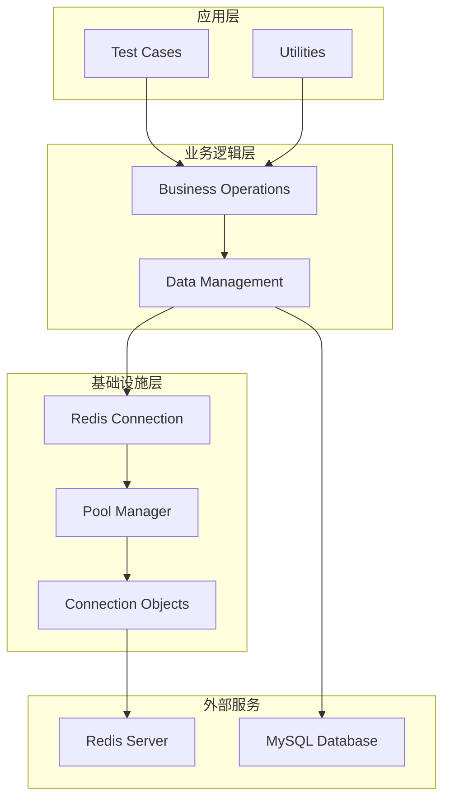
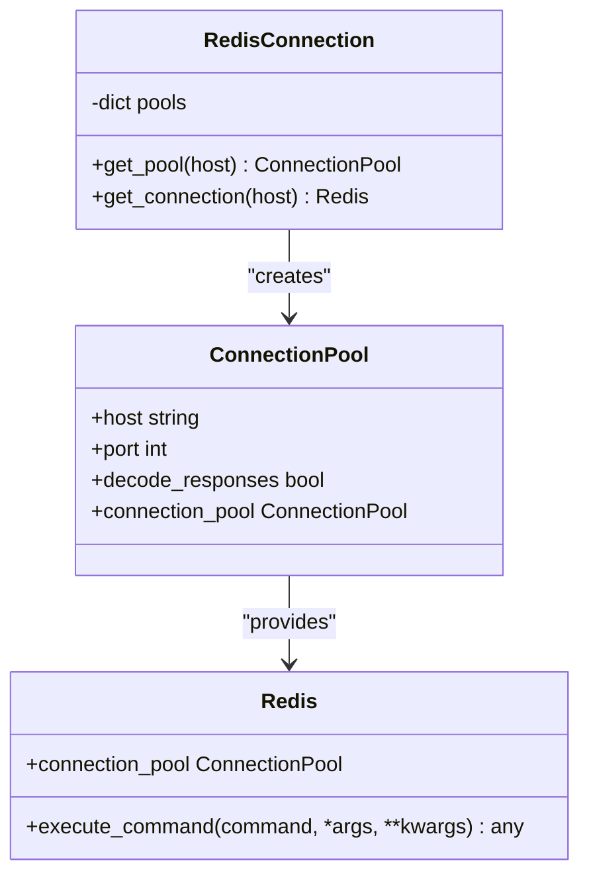
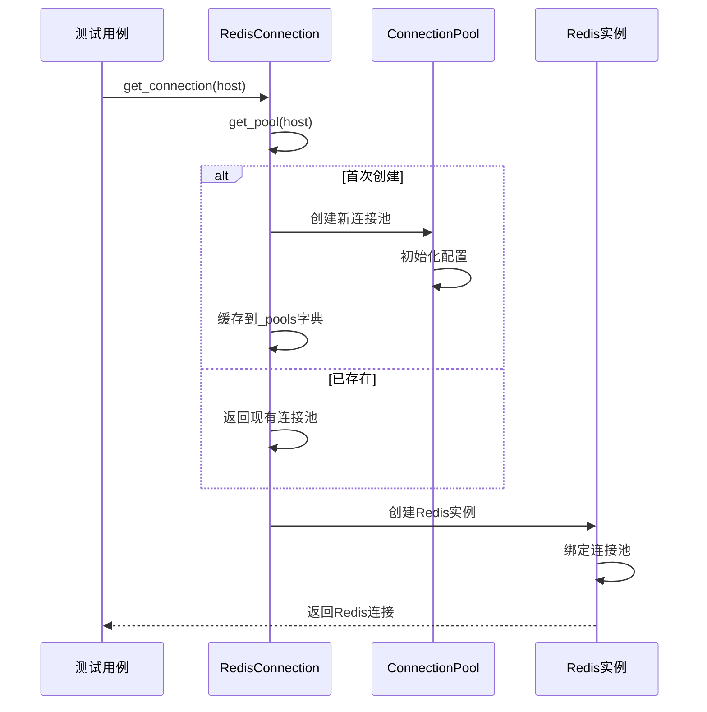
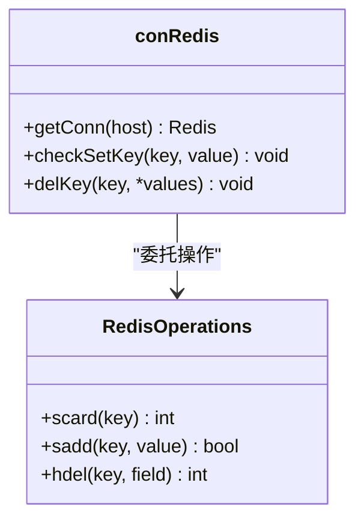
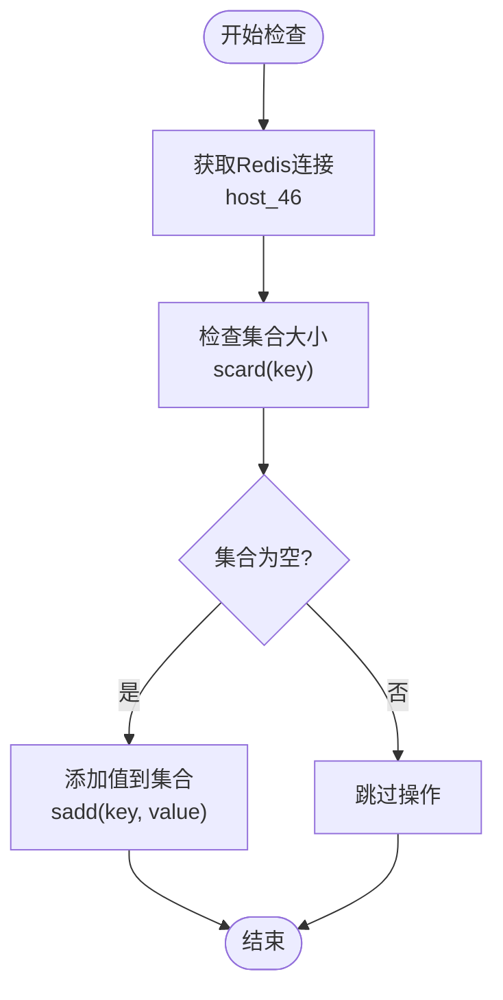
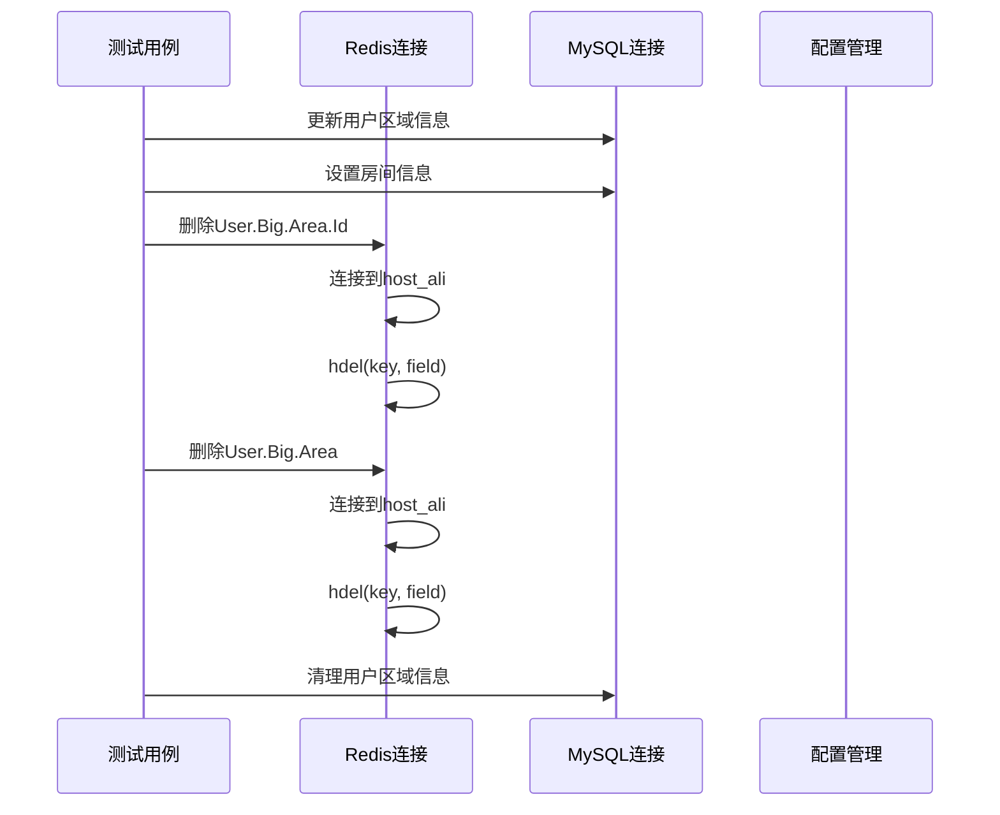
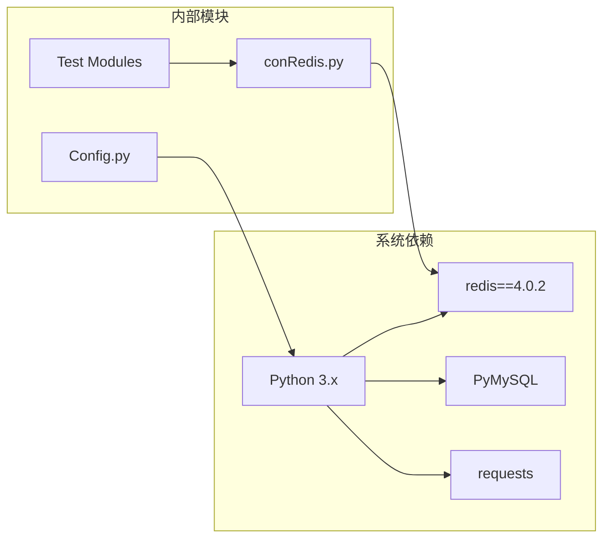
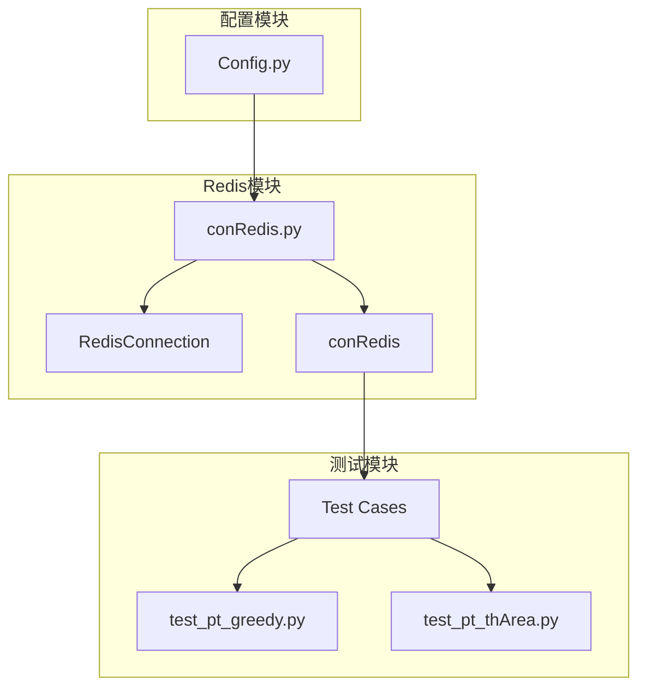
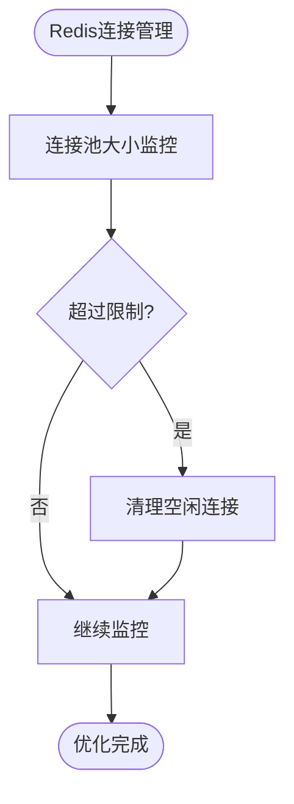

# Redis连接管理

<cite>
**本文档引用的文件**
- [conRedis.py](file://common/conRedis.py)
- [Config.py](file://common/Config.py)
- [test_pt_greedy.py](file://caseLuckyPlay/test_pt_greedy.py)
- [test_pt_thArea.py](file://caseOversea/test_pt_thArea.py)
- [requirements.txt](file://requirements.txt)
- [config_dev.php](file://others/config_dev.php)
- [run_all_case.py](file://run_all_case.py)
</cite>

## 目录
1. [简介](#简介)
2. [项目结构](#项目结构)
3. [核心组件](#核心组件)
4. [架构概览](#架构概览)
5. [详细组件分析](#详细组件分析)
6. [依赖关系分析](#依赖关系分析)
7. [性能考虑](#性能考虑)
8. [故障排除指南](#故障排除指南)
9. [结论](#结论)

## 简介

本项目是一个自动化测试框架，专门用于支付功能的测试验证。Redis连接管理是该系统的重要组成部分，负责管理Redis数据库的连接池和操作。本文档深入分析了Redis连接管理的实现、架构设计以及在测试环境中的应用。

## 项目结构

该项目采用模块化的测试框架结构，主要包含以下关键目录：

**图表来源**
- [conRedis.py:1-64](file://common/conRedis.py#L1-L64)
- [Config.py:118-244](file://common/Config.py#L118-L244)

**章节来源**
- [conRedis.py:1-64](file://common/conRedis.py#L1-L64)
- [Config.py:1-244](file://common/Config.py#L1-L244)

## 核心组件

### Redis连接管理器

Redis连接管理器实现了单例模式的连接池管理，确保应用程序能够高效地复用Redis连接。

### 连接池配置

系统支持多主机连接配置，包括：
- 主机46：192.168.11.46（生产环境）
- 主机阿里：127.0.0.1（本地开发环境）

### Redis操作类

提供常用的Redis操作方法，包括键值检查、集合操作和哈希字段删除。

**章节来源**
- [conRedis.py:16-60](file://common/conRedis.py#L16-L60)

## 架构概览

系统采用分层架构设计，Redis连接管理位于基础设施层，为上层测试逻辑提供数据存储服务。

**图表来源**
- [conRedis.py:16-36](file://common/conRedis.py#L16-L36)

## 详细组件分析

### RedisConnection类分析

RedisConnection类实现了完整的连接池管理机制：

**图表来源**
- [conRedis.py:16-36](file://common/conRedis.py#L16-L36)

#### 单例模式实现

连接池采用类变量 `_pools` 存储，确保每个主机地址只有一个连接池实例：

**图表来源**
- [conRedis.py:21-35](file://common/conRedis.py#L21-L35)

**章节来源**
- [conRedis.py:16-36](file://common/conRedis.py#L16-L36)

### conRedis类分析

conRedis类提供了高层的Redis操作接口：

**图表来源**
- [conRedis.py:38-60](file://common/conRedis.py#L38-L60)

#### 键值检查操作

checkSetKey方法实现了条件性键值设置，避免重复操作：

**图表来源**
- [conRedis.py:47-51](file://common/conRedis.py#L47-L51)

**章节来源**
- [conRedis.py:38-60](file://common/conRedis.py#L38-L60)

### 测试用例中的Redis使用

在多个测试用例中，Redis连接被用于清理测试数据：

**图表来源**
- [test_pt_greedy.py:17-21](file://caseLuckyPlay/test_pt_greedy.py#L17-L21)
- [test_pt_thArea.py:27-31](file://caseOversea/test_pt_thArea.py#L27-L31)

**章节来源**
- [test_pt_greedy.py:17-21](file://caseLuckyPlay/test_pt_greedy.py#L17-L21)
- [test_pt_thArea.py:27-31](file://caseOversea/test_pt_thArea.py#L27-L31)

## 依赖关系分析

### 外部依赖

系统依赖Redis客户端库进行连接管理：

**图表来源**
- [requirements.txt:23](file://requirements.txt#L23)
- [conRedis.py:4](file://common/conRedis.py#L4)

### 内部模块依赖

**图表来源**
- [conRedis.py:16-60](file://common/conRedis.py#L16-L60)
- [Config.py:118-244](file://common/Config.py#L118-L244)

**章节来源**
- [requirements.txt:1-91](file://requirements.txt#L1-L91)
- [conRedis.py:1-64](file://common/conRedis.py#L1-L64)

## 性能考虑

### 连接池优化

系统通过连接池实现连接复用，减少连接建立开销：

- **连接复用**：单例连接池避免重复创建连接
- **内存管理**：合理管理连接池大小，防止内存泄漏
- **超时设置**：配置适当的连接超时时间

### 并发处理

在测试环境中，Redis连接需要支持高并发访问：

- **线程安全**：连接池本身是线程安全的
- **连接限制**：根据Redis服务器能力调整最大连接数
- **错误重试**：实现连接失败时的自动重试机制

### 内存优化

## 故障排除指南

### 常见问题及解决方案

#### 连接失败

**症状**：Redis连接无法建立
**原因**：
- Redis服务器未启动
- 网络连接问题
- 主机地址配置错误

**解决方案**：
1. 验证Redis服务状态
2. 检查网络连通性
3. 确认主机配置正确

#### 连接池耗尽

**症状**：大量请求阻塞等待连接
**原因**：
- 连接池大小不足
- 连接泄漏
- 请求处理时间过长

**解决方案**：
1. 增加连接池大小
2. 检查连接释放逻辑
3. 优化请求处理性能

#### 数据一致性问题

**症状**：测试数据清理不完整
**原因**：
- Redis键值清理失败
- 并发访问冲突

**解决方案**：
1. 实现幂等的数据清理操作
2. 添加重试机制
3. 使用事务保证原子性

**章节来源**
- [conRedis.py:47-59](file://common/conRedis.py#L47-L59)

## 结论

Redis连接管理系统在本测试框架中发挥着关键作用，通过高效的连接池管理和简洁的操作接口，为各种支付测试场景提供了可靠的数据存储支持。系统的单例连接池设计有效减少了资源消耗，而清晰的模块划分便于维护和扩展。

未来可以考虑的改进方向包括：
- 添加连接健康检查机制
- 实现更精细的连接池配置选项
- 增强错误处理和日志记录功能
- 支持Redis集群和哨兵模式