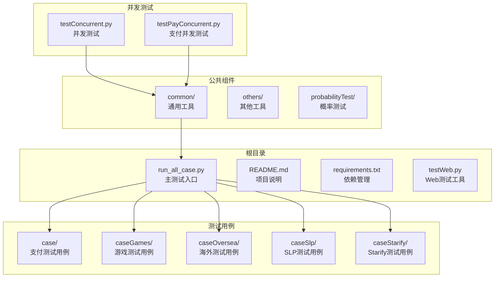
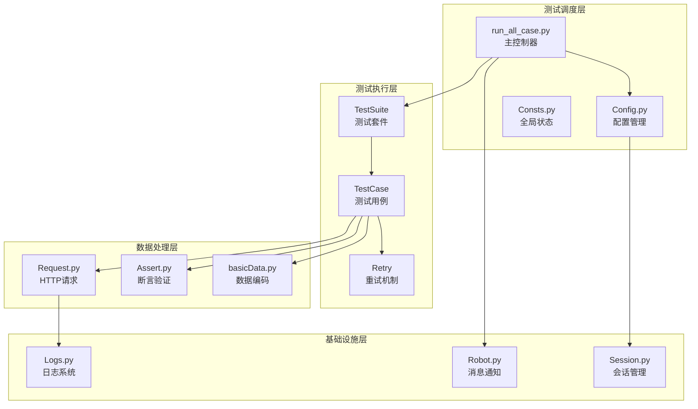
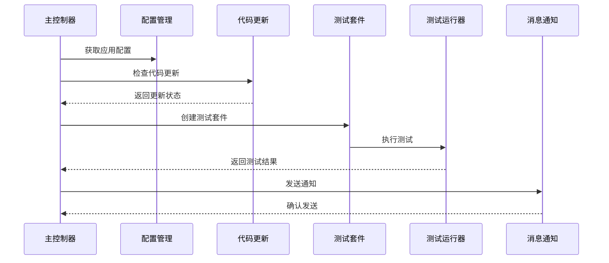
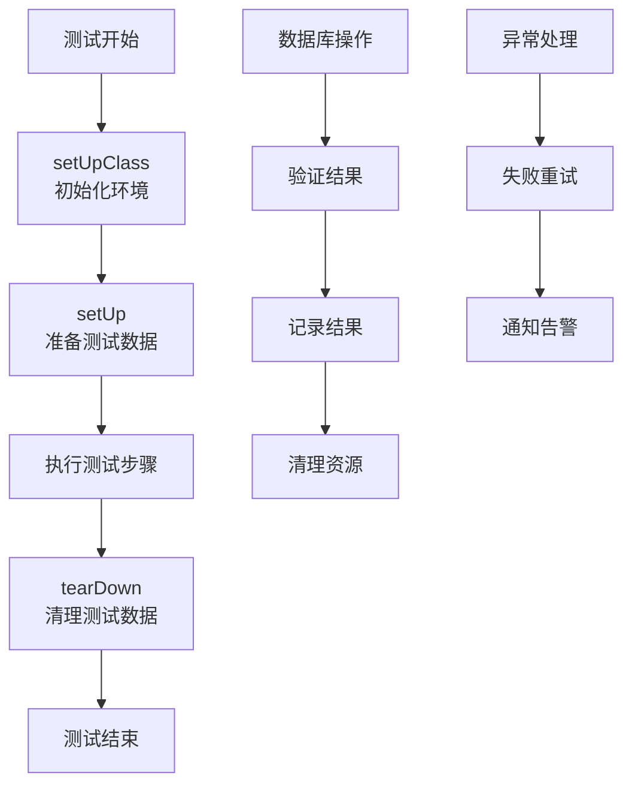
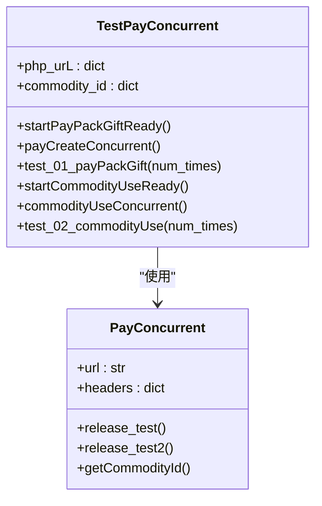
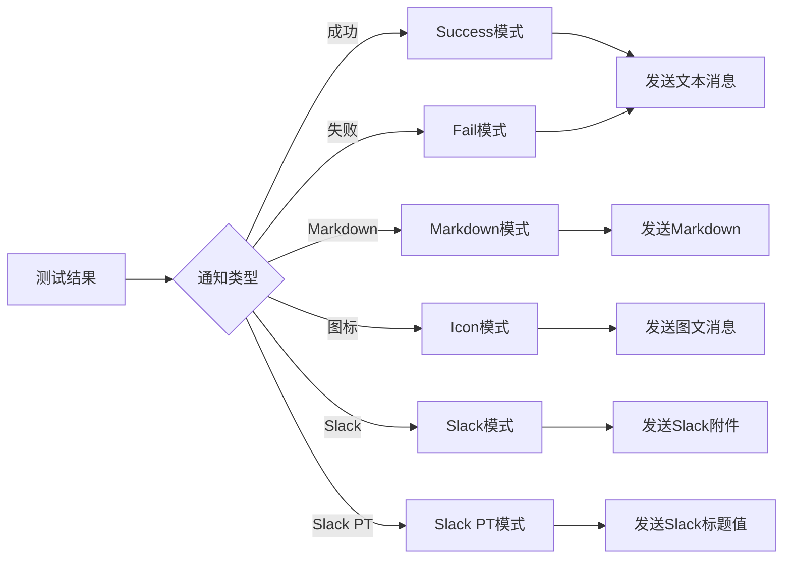
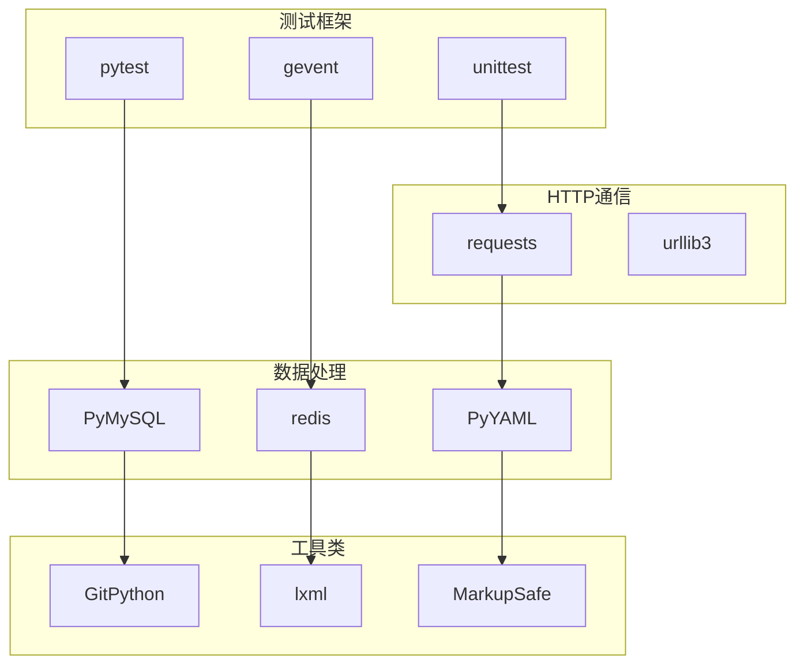

# 测试工具脚本

<cite>
**本文档引用的文件**
- [run_all_case.py](file://run_all_case.py)
- [README.md](file://README.md)
- [requirements.txt](file://requirements.txt)
- [Robot.py](file://Robot.py)
- [testWeb.py](file://testWeb.py)
- [common/Config.py](file://common/Config.py)
- [common/Consts.py](file://common/Consts.py)
- [common/Logs.py](file://common/Logs.py)
- [common/Request.py](file://common/Request.py)
- [case/test_pay_bean.py](file://case/test_pay_bean.py)
- [common/Assert.py](file://common/Assert.py)
- [common/basicData.py](file://common/basicData.py)
- [common/runFailed.py](file://common/runFailed.py)
- [testConcurrent.py](file://testConcurrent.py)
- [testPayConcurrent.py](file://testPayConcurrent.py)
</cite>

## 目录
1. [简介](#简介)
2. [项目结构](#项目结构)
3. [核心组件](#核心组件)
4. [架构概览](#架构概览)
5. [详细组件分析](#详细组件分析)
6. [依赖分析](#依赖分析)
7. [性能考虑](#性能考虑)
8. [故障排除指南](#故障排除指南)
9. [结论](#结论)

## 简介

这是一个基于Python的综合性测试工具脚本项目，专门用于支付相关的自动化测试。该项目采用unittest框架，结合多种测试策略，包括单测、并发测试、跨平台测试等，为多个业务线提供完整的测试解决方案。

项目主要特点：
- 支持多应用平台测试（BB、PT、Starify、SLP）
- 提供并发测试能力
- 集成消息通知系统
- 包含丰富的测试用例模板
- 支持失败重试机制

## 项目结构

**图表来源**
- [run_all_case.py:1-159](file://run_all_case.py#L1-L159)
- [README.md:1-38](file://README.md#L1-L38)

**章节来源**
- [run_all_case.py:1-159](file://run_all_case.py#L1-L159)
- [README.md:1-38](file://README.md#L1-L38)

## 核心组件

### 测试执行引擎

测试执行引擎是整个框架的核心，负责协调各个测试模块的运行。它支持多平台测试切换、自动代码更新、测试结果统计等功能。

### 请求处理模块

封装了HTTP请求处理逻辑，支持多种协议和参数格式，提供统一的请求接口。

### 断言验证模块

提供了丰富的断言方法，包括状态码验证、数据相等性验证、文本包含验证等。

### 日志记录模块

实现了基于时间轮转的日志系统，支持多种日志级别和输出格式。

**章节来源**
- [run_all_case.py:12-159](file://run_all_case.py#L12-L159)
- [common/Request.py:17-60](file://common/Request.py#L17-L60)
- [common/Assert.py:11-96](file://common/Assert.py#L11-L96)
- [common/Logs.py:8-48](file://common/Logs.py#L8-L48)

## 架构概览

**图表来源**
- [run_all_case.py:126-147](file://run_all_case.py#L126-L147)
- [common/Config.py:6-133](file://common/Config.py#L6-L133)
- [common/Consts.py:4-17](file://common/Consts.py#L4-L17)

## 详细组件分析

### 主测试控制器

主测试控制器负责协调整个测试流程，包括应用平台检测、代码更新、测试执行和结果通知。

**图表来源**
- [run_all_case.py:12-124](file://run_all_case.py#L12-L124)
- [run_all_case.py:126-147](file://run_all_case.py#L126-L147)

**章节来源**
- [run_all_case.py:12-159](file://run_all_case.py#L12-L159)

### 测试用例模板

每个测试用例都遵循统一的模板结构，包含前置条件设置、测试步骤执行和后置条件清理。

**图表来源**
- [case/test_pay_bean.py:15-26](file://case/test_pay_bean.py#L15-L26)

**章节来源**
- [case/test_pay_bean.py:12-276](file://case/test_pay_bean.py#L12-L276)

### 并发测试框架

并发测试框架使用gevent实现高并发测试，支持多种并发场景的模拟。

**图表来源**
- [testConcurrent.py:17-281](file://testConcurrent.py#L17-L281)
- [testPayConcurrent.py:9-47](file://testPayConcurrent.py#L9-L47)

**章节来源**
- [testConcurrent.py:17-281](file://testConcurrent.py#L17-L281)
- [testPayConcurrent.py:9-47](file://testPayConcurrent.py#L9-L47)

### 消息通知系统

消息通知系统支持多种通知渠道，包括Slack、微信等，提供灵活的通知配置。

**图表来源**
- [Robot.py:6-134](file://Robot.py#L6-L134)

**章节来源**
- [Robot.py:6-138](file://Robot.py#L6-L138)

## 依赖分析

项目依赖管理采用requirements.txt文件统一管理，主要依赖包括：

### 核心测试框架依赖

- unittest：Python标准测试框架
- pytest：增强的测试执行器
- gevent：并发编程支持

### HTTP通信依赖

- requests：HTTP客户端库
- urllib3：底层HTTP支持

### 数据处理依赖

- PyMySQL：MySQL数据库连接
- redis：缓存和队列支持
- PyYAML：配置文件解析

### 工具类依赖

- GitPython：Git版本控制集成
- lxml：XML处理
- MarkupSafe：安全模板渲染

**图表来源**
- [requirements.txt:1-85](file://requirements.txt#L1-L85)

**章节来源**
- [requirements.txt:1-85](file://requirements.txt#L1-L85)

## 性能考虑

### 并发优化策略

项目采用了多层次的并发优化策略：

1. **异步I/O处理**：使用gevent实现非阻塞I/O
2. **连接池管理**：复用HTTP连接减少建立成本
3. **批量操作**：支持批量数据处理和验证

### 内存管理

- 及时清理测试产生的临时数据
- 合理使用生成器避免内存溢出
- 控制日志文件大小和数量

### 网络优化

- 启用HTTP Keep-Alive
- 实现请求重试机制
- 支持超时和重定向处理

## 故障排除指南

### 常见问题及解决方案

#### 测试环境配置问题

**问题**：测试环境变量配置错误
**解决方案**：
1. 检查Config.py中的环境配置
2. 验证数据库连接信息
3. 确认API端点地址正确

#### 网络连接问题

**问题**：HTTP请求超时或连接失败
**解决方案**：
1. 检查网络连通性
2. 验证代理设置
3. 调整超时参数

#### 数据库连接问题

**问题**：数据库操作失败
**解决方案**：
1. 检查数据库服务状态
2. 验证连接凭据
3. 确认表结构完整性

#### 并发测试问题

**问题**：并发测试出现数据竞争
**解决方案**：
1. 使用事务确保数据一致性
2. 实施适当的锁机制
3. 优化测试数据隔离

**章节来源**
- [common/Logs.py:8-48](file://common/Logs.py#L8-L48)
- [common/Request.py:35-59](file://common/Request.py#L35-L59)

## 结论

这个测试工具脚本项目提供了一个完整、可扩展的测试解决方案，具有以下优势：

1. **模块化设计**：清晰的组件分离便于维护和扩展
2. **多平台支持**：支持多个业务线和应用平台
3. **并发能力**：具备强大的并发测试能力
4. **监控告警**：完善的测试结果通知机制
5. **易用性**：简洁的API和配置管理

建议的改进方向：
- 增加更多的测试覆盖率指标
- 实现更精细的错误分类和处理
- 添加性能基准测试功能
- 优化测试报告的可视化展示